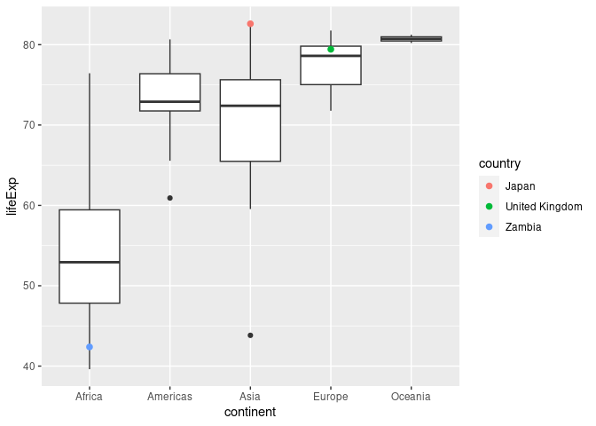
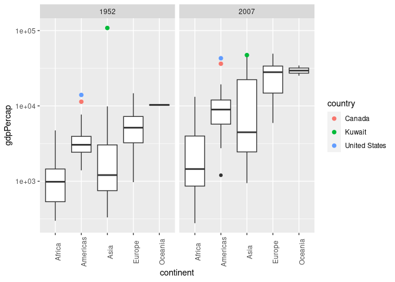

Gapminder
================
(Your name here)
2020-

- <a href="#grading-rubric" id="toc-grading-rubric">Grading Rubric</a>
  - <a href="#individual" id="toc-individual">Individual</a>
  - <a href="#due-date" id="toc-due-date">Due Date</a>
- <a href="#guided-eda" id="toc-guided-eda">Guided EDA</a>
  - <a
    href="#q0-perform-your-first-checks-on-the-dataset-what-variables-are-in-this"
    id="toc-q0-perform-your-first-checks-on-the-dataset-what-variables-are-in-this"><strong>q0</strong>
    Perform your “first checks” on the dataset. What variables are in
    this</a>
  - <a
    href="#q1-determine-the-most-and-least-recent-years-in-the-gapminder-dataset"
    id="toc-q1-determine-the-most-and-least-recent-years-in-the-gapminder-dataset"><strong>q1</strong>
    Determine the most and least recent years in the <code>gapminder</code>
    dataset.</a>
  - <a
    href="#q2-filter-on-years-matching-year_min-and-make-a-plot-of-the-gdp-per-capita-against-continent-choose-an-appropriate-geom_-to-visualize-the-data-what-observations-can-you-make"
    id="toc-q2-filter-on-years-matching-year_min-and-make-a-plot-of-the-gdp-per-capita-against-continent-choose-an-appropriate-geom_-to-visualize-the-data-what-observations-can-you-make"><strong>q2</strong>
    Filter on years matching <code>year_min</code>, and make a plot of the
    GDP per capita against continent. Choose an appropriate
    <code>geom_</code> to visualize the data. What observations can you
    make?</a>
  - <a
    href="#q3-you-should-have-found-at-least-three-outliers-in-q2-but-possibly-many-more-identify-those-outliers-figure-out-which-countries-they-are"
    id="toc-q3-you-should-have-found-at-least-three-outliers-in-q2-but-possibly-many-more-identify-those-outliers-figure-out-which-countries-they-are"><strong>q3</strong>
    You should have found <em>at least</em> three outliers in q2 (but
    possibly many more!). Identify those outliers (figure out which
    countries they are).</a>
  - <a
    href="#q4-create-a-plot-similar-to-yours-from-q2-studying-both-year_min-and-year_max-find-a-way-to-highlight-the-outliers-from-q3-on-your-plot-in-a-way-that-lets-you-identify-which-country-is-which-compare-the-patterns-between-year_min-and-year_max"
    id="toc-q4-create-a-plot-similar-to-yours-from-q2-studying-both-year_min-and-year_max-find-a-way-to-highlight-the-outliers-from-q3-on-your-plot-in-a-way-that-lets-you-identify-which-country-is-which-compare-the-patterns-between-year_min-and-year_max"><strong>q4</strong>
    Create a plot similar to yours from q2 studying both
    <code>year_min</code> and <code>year_max</code>. Find a way to highlight
    the outliers from q3 on your plot <em>in a way that lets you identify
    which country is which</em>. Compare the patterns between
    <code>year_min</code> and <code>year_max</code>.</a>
- <a href="#your-own-eda" id="toc-your-own-eda">Your Own EDA</a>
  - <a
    href="#q5-create-at-least-three-new-figures-below-with-each-figure-try-to-pose-new-questions-about-the-data"
    id="toc-q5-create-at-least-three-new-figures-below-with-each-figure-try-to-pose-new-questions-about-the-data"><strong>q5</strong>
    Create <em>at least</em> three new figures below. With each figure, try
    to pose new questions about the data.</a>

*Purpose*: Learning to do EDA well takes practice! In this challenge
you’ll further practice EDA by first completing a guided exploration,
then by conducting your own investigation. This challenge will also give
you a chance to use the wide variety of visual tools we’ve been
learning.

<!-- include-rubric -->

# Grading Rubric

<!-- -------------------------------------------------- -->

Unlike exercises, **challenges will be graded**. The following rubrics
define how you will be graded, both on an individual and team basis.

## Individual

<!-- ------------------------- -->

| Category    | Needs Improvement                                                                                                | Satisfactory                                                                                                               |
|-------------|------------------------------------------------------------------------------------------------------------------|----------------------------------------------------------------------------------------------------------------------------|
| Effort      | Some task **q**’s left unattempted                                                                               | All task **q**’s attempted                                                                                                 |
| Observed    | Did not document observations, or observations incorrect                                                         | Documented correct observations based on analysis                                                                          |
| Supported   | Some observations not clearly supported by analysis                                                              | All observations clearly supported by analysis (table, graph, etc.)                                                        |
| Assessed    | Observations include claims not supported by the data, or reflect a level of certainty not warranted by the data | Observations are appropriately qualified by the quality & relevance of the data and (in)conclusiveness of the support      |
| Specified   | Uses the phrase “more data are necessary” without clarification                                                  | Any statement that “more data are necessary” specifies which *specific* data are needed to answer what *specific* question |
| Code Styled | Violations of the [style guide](https://style.tidyverse.org/) hinder readability                                 | Code sufficiently close to the [style guide](https://style.tidyverse.org/)                                                 |

## Due Date

<!-- ------------------------- -->

All the deliverables stated in the rubrics above are due **at midnight**
before the day of the class discussion of the challenge. See the
[Syllabus](https://docs.google.com/document/d/1qeP6DUS8Djq_A0HMllMqsSqX3a9dbcx1/edit?usp=sharing&ouid=110386251748498665069&rtpof=true&sd=true)
for more information.

``` r
library(tidyverse)
```

    ## ── Attaching packages ─────────────────────────────────────── tidyverse 1.3.2 ──
    ## ✔ ggplot2 3.4.0     ✔ purrr   1.0.1
    ## ✔ tibble  3.1.8     ✔ dplyr   1.1.0
    ## ✔ tidyr   1.3.0     ✔ stringr 1.5.0
    ## ✔ readr   2.1.3     ✔ forcats 1.0.0
    ## ── Conflicts ────────────────────────────────────────── tidyverse_conflicts() ──
    ## ✖ dplyr::filter() masks stats::filter()
    ## ✖ dplyr::lag()    masks stats::lag()

``` r
library(gapminder)
```

*Background*: [Gapminder](https://www.gapminder.org/about-gapminder/) is
an independent organization that seeks to educate people about the state
of the world. They seek to counteract the worldview constructed by a
hype-driven media cycle, and promote a “fact-based worldview” by
focusing on data. The dataset we’ll study in this challenge is from
Gapminder.

# Guided EDA

<!-- -------------------------------------------------- -->

First, we’ll go through a round of *guided EDA*. Try to pay attention to
the high-level process we’re going through—after this guided round
you’ll be responsible for doing another cycle of EDA on your own!

### **q0** Perform your “first checks” on the dataset. What variables are in this

dataset?

``` r
## TASK: Do your "first checks" here!
glimpse(gapminder)
```

    ## Rows: 1,704
    ## Columns: 6
    ## $ country   <fct> "Afghanistan", "Afghanistan", "Afghanistan", "Afghanistan", …
    ## $ continent <fct> Asia, Asia, Asia, Asia, Asia, Asia, Asia, Asia, Asia, Asia, …
    ## $ year      <int> 1952, 1957, 1962, 1967, 1972, 1977, 1982, 1987, 1992, 1997, …
    ## $ lifeExp   <dbl> 28.801, 30.332, 31.997, 34.020, 36.088, 38.438, 39.854, 40.8…
    ## $ pop       <int> 8425333, 9240934, 10267083, 11537966, 13079460, 14880372, 12…
    ## $ gdpPercap <dbl> 779.4453, 820.8530, 853.1007, 836.1971, 739.9811, 786.1134, …

**Observations**:

- Write all variable names here country, continent, year, life
  expectancy (lifeExp), population (pop), and GDP per capita (gdpPercap)

### **q1** Determine the most and least recent years in the `gapminder` dataset.

*Hint*: Use the `pull()` function to get a vector out of a tibble.
(Rather than the `$` notation of base R.)

``` r
## TASK: Find the largest and smallest values of `year` in `gapminder`
year_max <- gapminder %>%
  pull(year) %>%
  max()
year_min <- gapminder %>%
  pull(year) %>%
  min()
```

Use the following test to check your work.

``` r
## NOTE: No need to change this
assertthat::assert_that(year_max %% 7 == 5)
```

    ## [1] TRUE

``` r
assertthat::assert_that(year_max %% 3 == 0)
```

    ## [1] TRUE

``` r
assertthat::assert_that(year_min %% 7 == 6)
```

    ## [1] TRUE

``` r
assertthat::assert_that(year_min %% 3 == 2)
```

    ## [1] TRUE

``` r
if (is_tibble(year_max)) {
  print("year_max is a tibble; try using `pull()` to get a vector")
  assertthat::assert_that(False)
}

print("Nice!")
```

    ## [1] "Nice!"

### **q2** Filter on years matching `year_min`, and make a plot of the GDP per capita against continent. Choose an appropriate `geom_` to visualize the data. What observations can you make?

You may encounter difficulties in visualizing these data; if so document
your challenges and attempt to produce the most informative visual you
can.

``` r
## TASK: Create a visual of gdpPercap vs continent
gapminder %>%
  filter(year == year_min) %>%
  ggplot(aes(x = continent, y = gdpPercap))+
  geom_boxplot() + 
  scale_y_log10()
```

<!-- -->

**Observations**:

- The dataset states that the median GDPs for each continent go in the
  following order: Africa, Asia, the Americas, Europe, and Oceania.
- Because we used a boxplot, we can see the amount of variation in these
  datasets: Asia seems to have GDPs that span the widest range,
  including an outlier that is an order of magnitude ahead of most other
  continents
- Oceania has barely any variation at all in its data, indicating either
  very homogenous or very little data.

**Difficulties & Approaches**:

- The outlier in Asia is quite dramatic, making most visualization
  pretty ineffective without any additional axis scaling. However, I
  searched up code that logarithmically scales the y axis and so that
  issue is remedied.

### **q3** You should have found *at least* three outliers in q2 (but possibly many more!). Identify those outliers (figure out which countries they are).

``` r
## TASK: Identify the outliers from q2
outliers_americas <- gapminder %>%
  filter(
    continent == "Americas",
    gdpPercap > 2e+04
    ) 
outliers_asia <- gapminder %>%
  filter(
    continent == "Asia",
    gdpPercap > 5e+04
  )

outliers_americas
```

    ## # A tibble: 15 × 6
    ##    country       continent  year lifeExp       pop gdpPercap
    ##    <fct>         <fct>     <int>   <dbl>     <int>     <dbl>
    ##  1 Canada        Americas   1977    74.2  23796400    22091.
    ##  2 Canada        Americas   1982    75.8  25201900    22899.
    ##  3 Canada        Americas   1987    76.9  26549700    26627.
    ##  4 Canada        Americas   1992    78.0  28523502    26343.
    ##  5 Canada        Americas   1997    78.6  30305843    28955.
    ##  6 Canada        Americas   2002    79.8  31902268    33329.
    ##  7 Canada        Americas   2007    80.7  33390141    36319.
    ##  8 United States Americas   1972    71.3 209896000    21806.
    ##  9 United States Americas   1977    73.4 220239000    24073.
    ## 10 United States Americas   1982    74.6 232187835    25010.
    ## 11 United States Americas   1987    75.0 242803533    29884.
    ## 12 United States Americas   1992    76.1 256894189    32004.
    ## 13 United States Americas   1997    76.8 272911760    35767.
    ## 14 United States Americas   2002    77.3 287675526    39097.
    ## 15 United States Americas   2007    78.2 301139947    42952.

``` r
outliers_asia
```

    ## # A tibble: 6 × 6
    ##   country continent  year lifeExp     pop gdpPercap
    ##   <fct>   <fct>     <int>   <dbl>   <int>     <dbl>
    ## 1 Kuwait  Asia       1952    55.6  160000   108382.
    ## 2 Kuwait  Asia       1957    58.0  212846   113523.
    ## 3 Kuwait  Asia       1962    60.5  358266    95458.
    ## 4 Kuwait  Asia       1967    64.6  575003    80895.
    ## 5 Kuwait  Asia       1972    67.7  841934   109348.
    ## 6 Kuwait  Asia       1977    69.3 1140357    59265.

**Observations**:

- Identify the outlier countries from q2
  - USA, Canada, and Kuwait.

*Hint*: For the next task, it’s helpful to know a ggplot trick we’ll
learn in an upcoming exercise: You can use the `data` argument inside
any `geom_*` to modify the data that will be plotted *by that geom
only*. For instance, you can use this trick to filter a set of points to
label:

``` r
## NOTE: No need to edit, use ideas from this in q4 below
gapminder %>%
  filter(year == max(year)) %>%

  ggplot(aes(continent, lifeExp)) +
  geom_boxplot() +
  geom_point(
    data = . %>% filter(country %in% c("United Kingdom", "Japan", "Zambia")),
    mapping = aes(color = country),
    size = 2
  )
```

<!-- -->

### **q4** Create a plot similar to yours from q2 studying both `year_min` and `year_max`. Find a way to highlight the outliers from q3 on your plot *in a way that lets you identify which country is which*. Compare the patterns between `year_min` and `year_max`.

*Hint*: We’ve learned a lot of different ways to show multiple
variables; think about using different aesthetics or facets.

``` r
## TASK: Create a visual of gdpPercap vs continent

gapminder %>%
  filter(year == year_min | year == year_max) %>%
  ggplot(aes(x = continent, y = gdpPercap)) +
  geom_boxplot() +
  geom_point(
    data = . %>% filter(country %in% c("Kuwait", "United States", "Canada")),
    mapping = aes(color = country),
    size = 2
  ) +
  scale_y_log10() +
  facet_wrap(~ year, nrow = 1) + 
  theme(axis.text.x = element_text(angle = 90))
```

<!-- -->

**Observations**:

- We can see here that the GDP per capita of the world as a whole has
  appeared to gone up; every line’s median is higher than where it was
  before.

- Kuwait used to be really far ahead of the rest of Asia in terms of
  GDP, but is now in a significantly more reasonable place.

- The United States and Canada have both increased their GDP per capita!

- Africa is still trailing the other continents in terms of median GDP
  per capita, though the variation has increased since 1952 (indicating
  that there are improvements disproportionally occurring in some places
  of Africa)

# Your Own EDA

<!-- -------------------------------------------------- -->

Now it’s your turn! We just went through guided EDA considering the GDP
per capita at two time points. You can continue looking at outliers,
consider different years, repeat the exercise with `lifeExp`, consider
the relationship between variables, or something else entirely.

### **q5** Create *at least* three new figures below. With each figure, try to pose new questions about the data.

``` r
## TASK: Your first graph
gapminder %>%
  filter(year == year_min) %>%
  ggplot(aes(x = continent, y = lifeExp)) +
  geom_boxplot() + 
  geom_point(
    data = . %>% filter(country %in% c("Turkey")),
    mapping = aes(color = country),
    size = 2
  )
```

<!-- -->

- Plotting life expectancy for each continent yields an interesting
  outlier in Turkey. Turkey is so far off from the rest of the box plot
  that it’s hard to believe that it could happen naturally.
  Unsurprisingly, global factors played into this - Turkey acted as a
  middle point between the Soviets and the United States, and
  inter-communal violence occurred (and is still occuring) which leads
  to an understandably lower life expectancy.

``` r
## TASK: Your second graph
# gapminder %>%
#   ggplot(aes(x = gdpPercap, y = lifeExp, color = year))+
#   geom_point() 
df_gapminder <- gapminder


gapminder %>%
  mutate(year_interval = cut(year, breaks = seq(1952, 2007, by = 5))) %>%
  pivot_longer(cols = c(lifeExp, gdpPercap), names_to = "variable", values_to = "value") %>%
  drop_na() %>%
  ggplot(aes(x = year_interval, y = value)) +
  geom_boxplot() +
  facet_wrap(~variable, scales = "free_y") +
  ylab("Life Expectancy / GDP per capita") +
  xlab("Year interval") + 
  theme(axis.text.x= element_text(angle = 90))
```

<!-- -->

- If we look at this plot of GDP per capita and life expectancy over
  time, we see a general trend that later years have higher life
  expectancy and higher GDP. We can attribute higher life expectancy to
  things like advancement in medicine, hygiene, etc. And higher GDP to a
  global economy that’s becoming more and more interconnected and thus
  robust.

``` r
## TASK: Your third graph
gapminder %>%
  filter(country == "China") %>%
  ggplot(aes(x = year, y = lifeExp, color = country)) +
  geom_line()
```

<!-- -->

``` r
# filtered <- gapminder %>%
#   filter(year == 1992) %>%
#   arrange(lifeExp)
# 
# filtered
```

- We see when plotting life expectancy versus time in China that there’s
  a general upward trend except for the dip that occurs around 1960.
  Further analysis of history suggests that this was likely due to “The
  Great Leap Forward,” an initiative in 1958 that sparked a nationwide
  famine that resulted in the deaths of many millions of people.
  Unsurprisingly, life expectancy decreased in that time.
