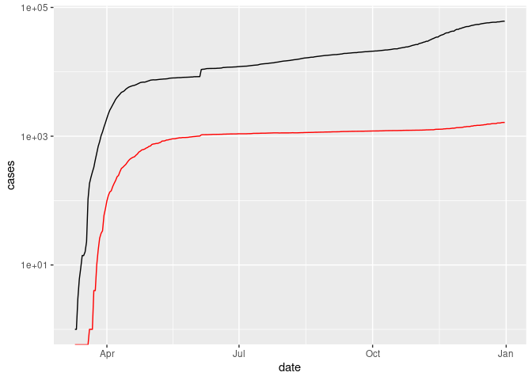

COVID-19
================
Richard Li
2020-

- <a href="#grading-rubric" id="toc-grading-rubric">Grading Rubric</a>
  - <a href="#individual" id="toc-individual">Individual</a>
  - <a href="#due-date" id="toc-due-date">Due Date</a>
- <a href="#the-big-picture" id="toc-the-big-picture">The Big Picture</a>
- <a href="#get-the-data" id="toc-get-the-data">Get the Data</a>
  - <a href="#navigating-the-census-bureau"
    id="toc-navigating-the-census-bureau">Navigating the Census Bureau</a>
    - <a
      href="#q1-load-table-b01003-into-the-following-tibble-make-sure-the-column-names-are-id-geographic-area-name-estimatetotal-margin-of-errortotal"
      id="toc-q1-load-table-b01003-into-the-following-tibble-make-sure-the-column-names-are-id-geographic-area-name-estimatetotal-margin-of-errortotal"><strong>q1</strong>
      Load Table <code>B01003</code> into the following tibble. Make sure the
      column names are
      <code>id, Geographic Area Name, Estimate!!Total, Margin of Error!!Total</code>.</a>
  - <a href="#automated-download-of-nyt-data"
    id="toc-automated-download-of-nyt-data">Automated Download of NYT
    Data</a>
    - <a
      href="#q2-visit-the-nyt-github-repo-and-find-the-url-for-the-raw-us-county-level-data-assign-that-url-as-a-string-to-the-variable-below"
      id="toc-q2-visit-the-nyt-github-repo-and-find-the-url-for-the-raw-us-county-level-data-assign-that-url-as-a-string-to-the-variable-below"><strong>q2</strong>
      Visit the NYT GitHub repo and find the URL for the <strong>raw</strong>
      US County-level data. Assign that URL as a string to the variable
      below.</a>
- <a href="#join-the-data" id="toc-join-the-data">Join the Data</a>
  - <a href="#q3-process-the-id-column-of-df_pop-to-create-a-fips-column"
    id="toc-q3-process-the-id-column-of-df_pop-to-create-a-fips-column"><strong>q3</strong>
    Process the <code>id</code> column of <code>df_pop</code> to create a
    <code>fips</code> column.</a>
  - <a
    href="#q4-join-df_covid-with-df_q3-by-the-fips-column-use-the-proper-type-of-join-to-preserve-only-the-rows-in-df_covid"
    id="toc-q4-join-df_covid-with-df_q3-by-the-fips-column-use-the-proper-type-of-join-to-preserve-only-the-rows-in-df_covid"><strong>q4</strong>
    Join <code>df_covid</code> with <code>df_q3</code> by the
    <code>fips</code> column. Use the proper type of join to preserve
    <em>only</em> the rows in <code>df_covid</code>.</a>
- <a href="#analyze" id="toc-analyze">Analyze</a>
  - <a href="#normalize" id="toc-normalize">Normalize</a>
    - <a
      href="#q5-use-the-population-estimates-in-df_data-to-normalize-cases-and-deaths-to-produce-per-100000-counts-3-store-these-values-in-the-columns-cases_per100k-and-deaths_per100k"
      id="toc-q5-use-the-population-estimates-in-df_data-to-normalize-cases-and-deaths-to-produce-per-100000-counts-3-store-these-values-in-the-columns-cases_per100k-and-deaths_per100k"><strong>q5</strong>
      Use the <code>population</code> estimates in <code>df_data</code> to
      normalize <code>cases</code> and <code>deaths</code> to produce per
      100,000 counts [3]. Store these values in the columns
      <code>cases_per100k</code> and <code>deaths_per100k</code>.</a>
  - <a href="#guided-eda" id="toc-guided-eda">Guided EDA</a>
    - <a
      href="#q6-compute-the-mean-and-standard-deviation-for-cases_per100k-and-deaths_per100k"
      id="toc-q6-compute-the-mean-and-standard-deviation-for-cases_per100k-and-deaths_per100k"><strong>q6</strong>
      Compute the mean and standard deviation for <code>cases_per100k</code>
      and <code>deaths_per100k</code>.</a>
    - <a
      href="#q7-find-the-top-10-counties-in-terms-of-cases_per100k-and-the-top-10-in-terms-of-deaths_per100k-report-the-population-of-each-county-along-with-the-per-100000-counts-compare-the-counts-against-the-mean-values-you-found-in-q6-note-any-observations"
      id="toc-q7-find-the-top-10-counties-in-terms-of-cases_per100k-and-the-top-10-in-terms-of-deaths_per100k-report-the-population-of-each-county-along-with-the-per-100000-counts-compare-the-counts-against-the-mean-values-you-found-in-q6-note-any-observations"><strong>q7</strong>
      Find the top 10 counties in terms of <code>cases_per100k</code>, and the
      top 10 in terms of <code>deaths_per100k</code>. Report the population of
      each county along with the per-100,000 counts. Compare the counts
      against the mean values you found in q6. Note any observations.</a>
  - <a href="#self-directed-eda" id="toc-self-directed-eda">Self-directed
    EDA</a>
    - <a
      href="#q8-drive-your-own-ship-youve-just-put-together-a-very-rich-dataset-you-now-get-to-explore-pick-your-own-direction-and-generate-at-least-one-punchline-figure-to-document-an-interesting-finding-i-give-a-couple-tips--ideas-below"
      id="toc-q8-drive-your-own-ship-youve-just-put-together-a-very-rich-dataset-you-now-get-to-explore-pick-your-own-direction-and-generate-at-least-one-punchline-figure-to-document-an-interesting-finding-i-give-a-couple-tips--ideas-below"><strong>q8</strong>
      Drive your own ship: You’ve just put together a very rich dataset; you
      now get to explore! Pick your own direction and generate at least one
      punchline figure to document an interesting finding. I give a couple
      tips &amp; ideas below:</a>
    - <a href="#ideas" id="toc-ideas">Ideas</a>
    - <a href="#aside-some-visualization-tricks"
      id="toc-aside-some-visualization-tricks">Aside: Some visualization
      tricks</a>
    - <a href="#geographic-exceptions"
      id="toc-geographic-exceptions">Geographic exceptions</a>
- <a href="#notes" id="toc-notes">Notes</a>

*Purpose*: In this challenge, you’ll learn how to navigate the U.S.
Census Bureau website, programmatically download data from the internet,
and perform a county-level population-weighted analysis of current
COVID-19 trends. This will give you the base for a very deep
investigation of COVID-19, which we’ll build upon for Project 1.

<!-- include-rubric -->

# Grading Rubric

<!-- -------------------------------------------------- -->

Unlike exercises, **challenges will be graded**. The following rubrics
define how you will be graded, both on an individual and team basis.

## Individual

<!-- ------------------------- -->

| Category    | Needs Improvement                                                                                                | Satisfactory                                                                                                               |
|-------------|------------------------------------------------------------------------------------------------------------------|----------------------------------------------------------------------------------------------------------------------------|
| Effort      | Some task **q**’s left unattempted                                                                               | All task **q**’s attempted                                                                                                 |
| Observed    | Did not document observations, or observations incorrect                                                         | Documented correct observations based on analysis                                                                          |
| Supported   | Some observations not clearly supported by analysis                                                              | All observations clearly supported by analysis (table, graph, etc.)                                                        |
| Assessed    | Observations include claims not supported by the data, or reflect a level of certainty not warranted by the data | Observations are appropriately qualified by the quality & relevance of the data and (in)conclusiveness of the support      |
| Specified   | Uses the phrase “more data are necessary” without clarification                                                  | Any statement that “more data are necessary” specifies which *specific* data are needed to answer what *specific* question |
| Code Styled | Violations of the [style guide](https://style.tidyverse.org/) hinder readability                                 | Code sufficiently close to the [style guide](https://style.tidyverse.org/)                                                 |

## Due Date

<!-- ------------------------- -->

All the deliverables stated in the rubrics above are due **at midnight**
before the day of the class discussion of the challenge. See the
[Syllabus](https://docs.google.com/document/d/1qeP6DUS8Djq_A0HMllMqsSqX3a9dbcx1/edit?usp=sharing&ouid=110386251748498665069&rtpof=true&sd=true)
for more information.

``` r
library(tidyverse)
```

    ## ── Attaching packages ─────────────────────────────────────── tidyverse 1.3.2 ──
    ## ✔ ggplot2 3.4.0     ✔ purrr   1.0.1
    ## ✔ tibble  3.1.8     ✔ dplyr   1.1.0
    ## ✔ tidyr   1.3.0     ✔ stringr 1.5.0
    ## ✔ readr   2.1.3     ✔ forcats 1.0.0
    ## ── Conflicts ────────────────────────────────────────── tidyverse_conflicts() ──
    ## ✖ dplyr::filter() masks stats::filter()
    ## ✖ dplyr::lag()    masks stats::lag()

*Background*:
[COVID-19](https://en.wikipedia.org/wiki/Coronavirus_disease_2019) is
the disease caused by the virus SARS-CoV-2. In 2020 it became a global
pandemic, leading to huge loss of life and tremendous disruption to
society. The New York Times (as of writing) publishes up-to-date data on
the progression of the pandemic across the United States—we will study
these data in this challenge.

*Optional Readings*: I’ve found this [ProPublica
piece](https://www.propublica.org/article/how-to-understand-covid-19-numbers)
on “How to understand COVID-19 numbers” to be very informative!

# The Big Picture

<!-- -------------------------------------------------- -->

We’re about to go through *a lot* of weird steps, so let’s first fix the
big picture firmly in mind:

We want to study COVID-19 in terms of data: both case counts (number of
infections) and deaths. We’re going to do a county-level analysis in
order to get a high-resolution view of the pandemic. Since US counties
can vary widely in terms of their population, we’ll need population
estimates in order to compute infection rates (think back to the
`Titanic` challenge).

That’s the high-level view; now let’s dig into the details.

# Get the Data

<!-- -------------------------------------------------- -->

1.  County-level population estimates (Census Bureau)
2.  County-level COVID-19 counts (New York Times)

## Navigating the Census Bureau

<!-- ------------------------- -->

**Steps**: Our objective is to find the 2018 American Community
Survey\[1\] (ACS) Total Population estimates, disaggregated by counties.
To check your results, this is Table `B01003`.

1.  Go to [data.census.gov](data.census.gov).
2.  Scroll down and click `View Tables`.
3.  Apply filters to find the ACS **Total Population** estimates,
    disaggregated by counties. I used the filters:

- `Topics > Populations and People > Counts, Estimates, and Projections > Population Total`
- `Geography > County > All counties in United States`

5.  Select the **Total Population** table and click the `Download`
    button to download the data; make sure to select the 2018 5-year
    estimates.
6.  Unzip and move the data to your `challenges/data` folder.

- Note that the data will have a crazy-long filename like
  `ACSDT5Y2018.B01003_data_with_overlays_2020-07-26T094857.csv`. That’s
  because metadata is stored in the filename, such as the year of the
  estimate (`Y2018`) and my access date (`2020-07-26`). **Your filename
  will vary based on when you download the data**, so make sure to copy
  the filename that corresponds to what you downloaded!

### **q1** Load Table `B01003` into the following tibble. Make sure the column names are `id, Geographic Area Name, Estimate!!Total, Margin of Error!!Total`.

*Hint*: You will need to use the `skip` keyword when loading these data!

``` r
## TASK: Load the census bureau data with the following tibble name.
df_pop <- read_csv("data/ACSDT5Y2018.B01003-Data.csv", skip = 1)
```

    ## New names:
    ## Rows: 3220 Columns: 7
    ## ── Column specification
    ## ──────────────────────────────────────────────────────── Delimiter: "," chr
    ## (5): Geography, Geographic Area Name, Annotation of Estimate!!Total, Mar... dbl
    ## (1): Estimate!!Total lgl (1): ...7
    ## ℹ Use `spec()` to retrieve the full column specification for this data. ℹ
    ## Specify the column types or set `show_col_types = FALSE` to quiet this message.
    ## • `` -> `...7`

``` r
df_pop
```

    ## # A tibble: 3,220 × 7
    ##    Geography      `Geographic Area Name`   Estim…¹ Annot…² Margi…³ Annot…⁴ ...7 
    ##    <chr>          <chr>                      <dbl> <chr>   <chr>   <chr>   <lgl>
    ##  1 0500000US01001 Autauga County, Alabama    55200 null    *****   *****   NA   
    ##  2 0500000US01003 Baldwin County, Alabama   208107 null    *****   *****   NA   
    ##  3 0500000US01005 Barbour County, Alabama    25782 null    *****   *****   NA   
    ##  4 0500000US01007 Bibb County, Alabama       22527 null    *****   *****   NA   
    ##  5 0500000US01009 Blount County, Alabama     57645 null    *****   *****   NA   
    ##  6 0500000US01011 Bullock County, Alabama    10352 null    *****   *****   NA   
    ##  7 0500000US01013 Butler County, Alabama     20025 null    *****   *****   NA   
    ##  8 0500000US01015 Calhoun County, Alabama   115098 null    *****   *****   NA   
    ##  9 0500000US01017 Chambers County, Alabama   33826 null    *****   *****   NA   
    ## 10 0500000US01019 Cherokee County, Alabama   25853 null    *****   *****   NA   
    ## # … with 3,210 more rows, and abbreviated variable names ¹​`Estimate!!Total`,
    ## #   ²​`Annotation of Estimate!!Total`, ³​`Margin of Error!!Total`,
    ## #   ⁴​`Annotation of Margin of Error!!Total`

*Note*: You can find information on 1-year, 3-year, and 5-year estimates
[here](https://www.census.gov/programs-surveys/acs/guidance/estimates.html).
The punchline is that 5-year estimates are more reliable but less
current.

## Automated Download of NYT Data

<!-- ------------------------- -->

ACS 5-year estimates don’t change all that often, but the COVID-19 data
are changing rapidly. To that end, it would be nice to be able to
*programmatically* download the most recent data for analysis; that way
we can update our analysis whenever we want simply by re-running our
notebook. This next problem will have you set up such a pipeline.

The New York Times is publishing up-to-date data on COVID-19 on
[GitHub](https://github.com/nytimes/covid-19-data).

### **q2** Visit the NYT [GitHub](https://github.com/nytimes/covid-19-data) repo and find the URL for the **raw** US County-level data. Assign that URL as a string to the variable below.

``` r
## TASK: Find the URL for the NYT covid-19 county-level data
url_counties <- "https://raw.githubusercontent.com/nytimes/covid-19-data/master/us-counties-2020.csv"
```

Once you have the url, the following code will download a local copy of
the data, then load the data into R.

``` r
## NOTE: No need to change this; just execute
## Set the filename of the data to download
filename_nyt <- "./data/nyt_counties.csv"

## Download the data locally
curl::curl_download(
        url_counties,
        destfile = filename_nyt
      )

## Loads the downloaded csv
df_covid <- read_csv(filename_nyt)
```

    ## Rows: 884737 Columns: 6
    ## ── Column specification ────────────────────────────────────────────────────────
    ## Delimiter: ","
    ## chr  (3): county, state, fips
    ## dbl  (2): cases, deaths
    ## date (1): date
    ## 
    ## ℹ Use `spec()` to retrieve the full column specification for this data.
    ## ℹ Specify the column types or set `show_col_types = FALSE` to quiet this message.

You can now re-run the chunk above (or the entire notebook) to pull the
most recent version of the data. Thus you can periodically re-run this
notebook to check in on the pandemic as it evolves.

*Note*: You should feel free to copy-paste the code above for your own
future projects!

# Join the Data

<!-- -------------------------------------------------- -->

To get a sense of our task, let’s take a glimpse at our two data
sources.

``` r
## NOTE: No need to change this; just execute
df_pop %>% glimpse
```

    ## Rows: 3,220
    ## Columns: 7
    ## $ Geography                              <chr> "0500000US01001", "0500000US010…
    ## $ `Geographic Area Name`                 <chr> "Autauga County, Alabama", "Bal…
    ## $ `Estimate!!Total`                      <dbl> 55200, 208107, 25782, 22527, 57…
    ## $ `Annotation of Estimate!!Total`        <chr> "null", "null", "null", "null",…
    ## $ `Margin of Error!!Total`               <chr> "*****", "*****", "*****", "***…
    ## $ `Annotation of Margin of Error!!Total` <chr> "*****", "*****", "*****", "***…
    ## $ ...7                                   <lgl> NA, NA, NA, NA, NA, NA, NA, NA,…

``` r
df_covid %>% glimpse
```

    ## Rows: 884,737
    ## Columns: 6
    ## $ date   <date> 2020-01-21, 2020-01-22, 2020-01-23, 2020-01-24, 2020-01-24, 20…
    ## $ county <chr> "Snohomish", "Snohomish", "Snohomish", "Cook", "Snohomish", "Or…
    ## $ state  <chr> "Washington", "Washington", "Washington", "Illinois", "Washingt…
    ## $ fips   <chr> "53061", "53061", "53061", "17031", "53061", "06059", "17031", …
    ## $ cases  <dbl> 1, 1, 1, 1, 1, 1, 1, 1, 1, 1, 1, 1, 1, 1, 1, 1, 1, 1, 1, 1, 1, …
    ## $ deaths <dbl> 0, 0, 0, 0, 0, 0, 0, 0, 0, 0, 0, 0, 0, 0, 0, 0, 0, 0, 0, 0, 0, …

To join these datasets, we’ll need to use [FIPS county
codes](https://en.wikipedia.org/wiki/FIPS_county_code).\[2\] The last
`5` digits of the `id` column in `df_pop` is the FIPS county code, while
the NYT data `df_covid` already contains the `fips`.

### **q3** Process the `id` column of `df_pop` to create a `fips` column.

``` r
## TASK: Create a `fips` column by extracting the county code
df_q3 <- df_pop %>%
  rename(id = "Geography") %>%
  mutate(
    "fips" = str_sub(id, start = -5),
  )

df_q3
```

    ## # A tibble: 3,220 × 8
    ##    id             Geographic Area …¹ Estim…² Annot…³ Margi…⁴ Annot…⁵ ...7  fips 
    ##    <chr>          <chr>                <dbl> <chr>   <chr>   <chr>   <lgl> <chr>
    ##  1 0500000US01001 Autauga County, A…   55200 null    *****   *****   NA    01001
    ##  2 0500000US01003 Baldwin County, A…  208107 null    *****   *****   NA    01003
    ##  3 0500000US01005 Barbour County, A…   25782 null    *****   *****   NA    01005
    ##  4 0500000US01007 Bibb County, Alab…   22527 null    *****   *****   NA    01007
    ##  5 0500000US01009 Blount County, Al…   57645 null    *****   *****   NA    01009
    ##  6 0500000US01011 Bullock County, A…   10352 null    *****   *****   NA    01011
    ##  7 0500000US01013 Butler County, Al…   20025 null    *****   *****   NA    01013
    ##  8 0500000US01015 Calhoun County, A…  115098 null    *****   *****   NA    01015
    ##  9 0500000US01017 Chambers County, …   33826 null    *****   *****   NA    01017
    ## 10 0500000US01019 Cherokee County, …   25853 null    *****   *****   NA    01019
    ## # … with 3,210 more rows, and abbreviated variable names
    ## #   ¹​`Geographic Area Name`, ²​`Estimate!!Total`,
    ## #   ³​`Annotation of Estimate!!Total`, ⁴​`Margin of Error!!Total`,
    ## #   ⁵​`Annotation of Margin of Error!!Total`

Use the following test to check your answer.

``` r
## NOTE: No need to change this
## Check known county
assertthat::assert_that(
              (df_q3 %>%
              filter(str_detect(`Geographic Area Name`, "Autauga County")) %>%
              pull(fips)) == "01001"
            )
```

    ## [1] TRUE

``` r
print("Very good!")
```

    ## [1] "Very good!"

### **q4** Join `df_covid` with `df_q3` by the `fips` column. Use the proper type of join to preserve *only* the rows in `df_covid`.

``` r
## TASK: Join df_covid and df_q3 by fips.
df_q4 <- left_join(df_covid, df_q3, by =  "fips")

df_q4
```

    ## # A tibble: 884,737 × 13
    ##    date       county      state fips  cases deaths id    Geogr…¹ Estim…² Annot…³
    ##    <date>     <chr>       <chr> <chr> <dbl>  <dbl> <chr> <chr>     <dbl> <chr>  
    ##  1 2020-01-21 Snohomish   Wash… 53061     1      0 0500… Snohom…  7.87e5 null   
    ##  2 2020-01-22 Snohomish   Wash… 53061     1      0 0500… Snohom…  7.87e5 null   
    ##  3 2020-01-23 Snohomish   Wash… 53061     1      0 0500… Snohom…  7.87e5 null   
    ##  4 2020-01-24 Cook        Illi… 17031     1      0 0500… Cook C…  5.22e6 null   
    ##  5 2020-01-24 Snohomish   Wash… 53061     1      0 0500… Snohom…  7.87e5 null   
    ##  6 2020-01-25 Orange      Cali… 06059     1      0 0500… Orange…  3.16e6 null   
    ##  7 2020-01-25 Cook        Illi… 17031     1      0 0500… Cook C…  5.22e6 null   
    ##  8 2020-01-25 Snohomish   Wash… 53061     1      0 0500… Snohom…  7.87e5 null   
    ##  9 2020-01-26 Maricopa    Ariz… 04013     1      0 0500… Marico…  4.25e6 null   
    ## 10 2020-01-26 Los Angeles Cali… 06037     1      0 0500… Los An…  1.01e7 null   
    ## # … with 884,727 more rows, 3 more variables: `Margin of Error!!Total` <chr>,
    ## #   `Annotation of Margin of Error!!Total` <chr>, ...7 <lgl>, and abbreviated
    ## #   variable names ¹​`Geographic Area Name`, ²​`Estimate!!Total`,
    ## #   ³​`Annotation of Estimate!!Total`

For convenience, I down-select some columns and produce more convenient
column names.

``` r
## NOTE: No need to change; run this to produce a more convenient tibble
df_data <-
  df_q4 %>%
  select(
    date,
    county,
    state,
    fips,
    cases,
    deaths,
    population = `Estimate!!Total`
  )

df_data
```

    ## # A tibble: 884,737 × 7
    ##    date       county      state      fips  cases deaths population
    ##    <date>     <chr>       <chr>      <chr> <dbl>  <dbl>      <dbl>
    ##  1 2020-01-21 Snohomish   Washington 53061     1      0     786620
    ##  2 2020-01-22 Snohomish   Washington 53061     1      0     786620
    ##  3 2020-01-23 Snohomish   Washington 53061     1      0     786620
    ##  4 2020-01-24 Cook        Illinois   17031     1      0    5223719
    ##  5 2020-01-24 Snohomish   Washington 53061     1      0     786620
    ##  6 2020-01-25 Orange      California 06059     1      0    3164182
    ##  7 2020-01-25 Cook        Illinois   17031     1      0    5223719
    ##  8 2020-01-25 Snohomish   Washington 53061     1      0     786620
    ##  9 2020-01-26 Maricopa    Arizona    04013     1      0    4253913
    ## 10 2020-01-26 Los Angeles California 06037     1      0   10098052
    ## # … with 884,727 more rows

# Analyze

<!-- -------------------------------------------------- -->

Now that we’ve done the hard work of loading and wrangling the data, we
can finally start our analysis. Our first step will be to produce county
population-normalized cases and death counts. Then we will explore the
data.

## Normalize

<!-- ------------------------- -->

### **q5** Use the `population` estimates in `df_data` to normalize `cases` and `deaths` to produce per 100,000 counts \[3\]. Store these values in the columns `cases_per100k` and `deaths_per100k`.

``` r
## TASK: Normalize cases and deaths
df_normalized <- df_data %>% 
  mutate(
    "cases_per100k" = 100000*(cases/population), 
    "deaths_per100k" = 100000*(deaths/population)
    ) %>%
  transform(
    fips = as.numeric(fips)
  )

df_normalized
```

    ##             date                       county                state  fips cases
    ## 1     2020-01-21                    Snohomish           Washington 53061     1
    ## 2     2020-01-22                    Snohomish           Washington 53061     1
    ## 3     2020-01-23                    Snohomish           Washington 53061     1
    ## 4     2020-01-24                         Cook             Illinois 17031     1
    ## 5     2020-01-24                    Snohomish           Washington 53061     1
    ## 6     2020-01-25                       Orange           California  6059     1
    ## 7     2020-01-25                         Cook             Illinois 17031     1
    ## 8     2020-01-25                    Snohomish           Washington 53061     1
    ## 9     2020-01-26                     Maricopa              Arizona  4013     1
    ## 10    2020-01-26                  Los Angeles           California  6037     1
    ## 11    2020-01-26                       Orange           California  6059     1
    ## 12    2020-01-26                         Cook             Illinois 17031     1
    ## 13    2020-01-26                    Snohomish           Washington 53061     1
    ## 14    2020-01-27                     Maricopa              Arizona  4013     1
    ## 15    2020-01-27                  Los Angeles           California  6037     1
    ## 16    2020-01-27                       Orange           California  6059     1
    ## 17    2020-01-27                         Cook             Illinois 17031     1
    ## 18    2020-01-27                    Snohomish           Washington 53061     1
    ## 19    2020-01-28                     Maricopa              Arizona  4013     1
    ## 20    2020-01-28                  Los Angeles           California  6037     1
    ## 21    2020-01-28                       Orange           California  6059     1
    ## 22    2020-01-28                         Cook             Illinois 17031     1
    ## 23    2020-01-28                    Snohomish           Washington 53061     1
    ## 24    2020-01-29                     Maricopa              Arizona  4013     1
    ## 25    2020-01-29                  Los Angeles           California  6037     1
    ## 26    2020-01-29                       Orange           California  6059     1
    ## 27    2020-01-29                         Cook             Illinois 17031     1
    ## 28    2020-01-29                    Snohomish           Washington 53061     1
    ## 29    2020-01-30                     Maricopa              Arizona  4013     1
    ## 30    2020-01-30                  Los Angeles           California  6037     1
    ## 31    2020-01-30                       Orange           California  6059     1
    ## 32    2020-01-30                         Cook             Illinois 17031     2
    ## 33    2020-01-30                    Snohomish           Washington 53061     1
    ## 34    2020-01-31                     Maricopa              Arizona  4013     1
    ## 35    2020-01-31                  Los Angeles           California  6037     1
    ## 36    2020-01-31                       Orange           California  6059     1
    ## 37    2020-01-31                  Santa Clara           California  6085     1
    ## 38    2020-01-31                         Cook             Illinois 17031     2
    ## 39    2020-01-31                    Snohomish           Washington 53061     1
    ## 40    2020-02-01                     Maricopa              Arizona  4013     1
    ## 41    2020-02-01                  Los Angeles           California  6037     1
    ## 42    2020-02-01                       Orange           California  6059     1
    ## 43    2020-02-01                  Santa Clara           California  6085     1
    ## 44    2020-02-01                         Cook             Illinois 17031     2
    ## 45    2020-02-01                      Suffolk        Massachusetts 25025     1
    ## 46    2020-02-01                    Snohomish           Washington 53061     1
    ## 47    2020-02-02                     Maricopa              Arizona  4013     1
    ## 48    2020-02-02                  Los Angeles           California  6037     1
    ## 49    2020-02-02                       Orange           California  6059     1
    ## 50    2020-02-02                San Francisco           California  6075     2
    ## 51    2020-02-02                  Santa Clara           California  6085     2
    ## 52    2020-02-02                         Cook             Illinois 17031     2
    ## 53    2020-02-02                      Suffolk        Massachusetts 25025     1
    ## 54    2020-02-02                    Snohomish           Washington 53061     1
    ## 55    2020-02-03                     Maricopa              Arizona  4013     1
    ## 56    2020-02-03                  Los Angeles           California  6037     1
    ## 57    2020-02-03                       Orange           California  6059     1
    ## 58    2020-02-03                San Francisco           California  6075     2
    ## 59    2020-02-03                  Santa Clara           California  6085     2
    ## 60    2020-02-03                         Cook             Illinois 17031     2
    ## 61    2020-02-03                      Suffolk        Massachusetts 25025     1
    ## 62    2020-02-03                    Snohomish           Washington 53061     1
    ## 63    2020-02-04                     Maricopa              Arizona  4013     1
    ## 64    2020-02-04                  Los Angeles           California  6037     1
    ## 65    2020-02-04                       Orange           California  6059     1
    ## 66    2020-02-04                San Francisco           California  6075     2
    ## 67    2020-02-04                  Santa Clara           California  6085     2
    ## 68    2020-02-04                         Cook             Illinois 17031     2
    ## 69    2020-02-04                      Suffolk        Massachusetts 25025     1
    ## 70    2020-02-04                    Snohomish           Washington 53061     1
    ## 71    2020-02-05                     Maricopa              Arizona  4013     1
    ## 72    2020-02-05                  Los Angeles           California  6037     1
    ## 73    2020-02-05                       Orange           California  6059     1
    ## 74    2020-02-05                San Francisco           California  6075     2
    ## 75    2020-02-05                  Santa Clara           California  6085     2
    ## 76    2020-02-05                         Cook             Illinois 17031     2
    ## 77    2020-02-05                      Suffolk        Massachusetts 25025     1
    ## 78    2020-02-05                    Snohomish           Washington 53061     1
    ## 79    2020-02-05                         Dane            Wisconsin 55025     1
    ## 80    2020-02-06                     Maricopa              Arizona  4013     1
    ## 81    2020-02-06                  Los Angeles           California  6037     1
    ## 82    2020-02-06                       Orange           California  6059     1
    ## 83    2020-02-06                San Francisco           California  6075     2
    ## 84    2020-02-06                  Santa Clara           California  6085     2
    ## 85    2020-02-06                         Cook             Illinois 17031     2
    ## 86    2020-02-06                      Suffolk        Massachusetts 25025     1
    ## 87    2020-02-06                    Snohomish           Washington 53061     1
    ## 88    2020-02-06                         Dane            Wisconsin 55025     1
    ## 89    2020-02-07                     Maricopa              Arizona  4013     1
    ## 90    2020-02-07                  Los Angeles           California  6037     1
    ## 91    2020-02-07                       Orange           California  6059     1
    ## 92    2020-02-07                San Francisco           California  6075     2
    ## 93    2020-02-07                  Santa Clara           California  6085     2
    ## 94    2020-02-07                         Cook             Illinois 17031     2
    ## 95    2020-02-07                      Suffolk        Massachusetts 25025     1
    ## 96    2020-02-07                    Snohomish           Washington 53061     1
    ## 97    2020-02-07                         Dane            Wisconsin 55025     1
    ## 98    2020-02-08                     Maricopa              Arizona  4013     1
    ## 99    2020-02-08                  Los Angeles           California  6037     1
    ## 100   2020-02-08                       Orange           California  6059     1
    ## 101   2020-02-08                San Francisco           California  6075     2
    ## 102   2020-02-08                  Santa Clara           California  6085     2
    ## 103   2020-02-08                         Cook             Illinois 17031     2
    ## 104   2020-02-08                      Suffolk        Massachusetts 25025     1
    ## 105   2020-02-08                    Snohomish           Washington 53061     1
    ## 106   2020-02-08                         Dane            Wisconsin 55025     1
    ## 107   2020-02-09                     Maricopa              Arizona  4013     1
    ## 108   2020-02-09                  Los Angeles           California  6037     1
    ## 109   2020-02-09                       Orange           California  6059     1
    ## 110   2020-02-09                San Francisco           California  6075     2
    ## 111   2020-02-09                  Santa Clara           California  6085     2
    ## 112   2020-02-09                         Cook             Illinois 17031     2
    ## 113   2020-02-09                      Suffolk        Massachusetts 25025     1
    ## 114   2020-02-09                    Snohomish           Washington 53061     1
    ## 115   2020-02-09                         Dane            Wisconsin 55025     1
    ## 116   2020-02-10                     Maricopa              Arizona  4013     1
    ## 117   2020-02-10                  Los Angeles           California  6037     1
    ## 118   2020-02-10                       Orange           California  6059     1
    ## 119   2020-02-10                    San Diego           California  6073     1
    ## 120   2020-02-10                San Francisco           California  6075     2
    ## 121   2020-02-10                  Santa Clara           California  6085     2
    ## 122   2020-02-10                         Cook             Illinois 17031     2
    ## 123   2020-02-10                      Suffolk        Massachusetts 25025     1
    ## 124   2020-02-10                    Snohomish           Washington 53061     1
    ## 125   2020-02-10                         Dane            Wisconsin 55025     1
    ## 126   2020-02-11                     Maricopa              Arizona  4013     1
    ## 127   2020-02-11                  Los Angeles           California  6037     1
    ## 128   2020-02-11                       Orange           California  6059     1
    ## 129   2020-02-11                    San Diego           California  6073     1
    ## 130   2020-02-11                San Francisco           California  6075     2
    ## 131   2020-02-11                  Santa Clara           California  6085     2
    ## 132   2020-02-11                         Cook             Illinois 17031     2
    ## 133   2020-02-11                      Suffolk        Massachusetts 25025     1
    ## 134   2020-02-11                    Snohomish           Washington 53061     1
    ## 135   2020-02-11                         Dane            Wisconsin 55025     1
    ## 136   2020-02-12                     Maricopa              Arizona  4013     1
    ## 137   2020-02-12                  Los Angeles           California  6037     1
    ## 138   2020-02-12                       Orange           California  6059     1
    ## 139   2020-02-12                    San Diego           California  6073     1
    ## 140   2020-02-12                San Francisco           California  6075     2
    ## 141   2020-02-12                  Santa Clara           California  6085     2
    ## 142   2020-02-12                         Cook             Illinois 17031     2
    ## 143   2020-02-12                      Suffolk        Massachusetts 25025     1
    ## 144   2020-02-12                        Bexar                Texas 48029     1
    ## 145   2020-02-12                    Snohomish           Washington 53061     1
    ## 146   2020-02-12                         Dane            Wisconsin 55025     1
    ## 147   2020-02-13                     Maricopa              Arizona  4013     1
    ## 148   2020-02-13                  Los Angeles           California  6037     1
    ## 149   2020-02-13                       Orange           California  6059     1
    ## 150   2020-02-13                    San Diego           California  6073     1
    ## 151   2020-02-13                San Francisco           California  6075     2
    ## 152   2020-02-13                  Santa Clara           California  6085     2
    ## 153   2020-02-13                         Cook             Illinois 17031     2
    ## 154   2020-02-13                      Suffolk        Massachusetts 25025     1
    ## 155   2020-02-13                        Bexar                Texas 48029     2
    ## 156   2020-02-13                    Snohomish           Washington 53061     1
    ## 157   2020-02-13                         Dane            Wisconsin 55025     1
    ## 158   2020-02-14                     Maricopa              Arizona  4013     1
    ## 159   2020-02-14                  Los Angeles           California  6037     1
    ## 160   2020-02-14                       Orange           California  6059     1
    ## 161   2020-02-14                    San Diego           California  6073     1
    ## 162   2020-02-14                San Francisco           California  6075     2
    ## 163   2020-02-14                  Santa Clara           California  6085     2
    ## 164   2020-02-14                         Cook             Illinois 17031     2
    ## 165   2020-02-14                      Suffolk        Massachusetts 25025     1
    ## 166   2020-02-14                        Bexar                Texas 48029     2
    ## 167   2020-02-14                    Snohomish           Washington 53061     1
    ## 168   2020-02-14                         Dane            Wisconsin 55025     1
    ## 169   2020-02-15                     Maricopa              Arizona  4013     1
    ## 170   2020-02-15                  Los Angeles           California  6037     1
    ## 171   2020-02-15                       Orange           California  6059     1
    ## 172   2020-02-15                    San Diego           California  6073     1
    ## 173   2020-02-15                San Francisco           California  6075     2
    ## 174   2020-02-15                  Santa Clara           California  6085     2
    ## 175   2020-02-15                         Cook             Illinois 17031     2
    ## 176   2020-02-15                      Suffolk        Massachusetts 25025     1
    ## 177   2020-02-15                        Bexar                Texas 48029     2
    ## 178   2020-02-15                    Snohomish           Washington 53061     1
    ## 179   2020-02-15                         Dane            Wisconsin 55025     1
    ## 180   2020-02-16                     Maricopa              Arizona  4013     1
    ## 181   2020-02-16                  Los Angeles           California  6037     1
    ## 182   2020-02-16                       Orange           California  6059     1
    ## 183   2020-02-16                    San Diego           California  6073     1
    ## 184   2020-02-16                San Francisco           California  6075     2
    ## 185   2020-02-16                  Santa Clara           California  6085     2
    ## 186   2020-02-16                         Cook             Illinois 17031     2
    ## 187   2020-02-16                      Suffolk        Massachusetts 25025     1
    ## 188   2020-02-16                        Bexar                Texas 48029     2
    ## 189   2020-02-16                    Snohomish           Washington 53061     1
    ## 190   2020-02-16                         Dane            Wisconsin 55025     1
    ## 191   2020-02-17                     Maricopa              Arizona  4013     1
    ## 192   2020-02-17                  Los Angeles           California  6037     1
    ## 193   2020-02-17                       Orange           California  6059     1
    ## 194   2020-02-17                    San Diego           California  6073     1
    ## 195   2020-02-17                San Francisco           California  6075     2
    ## 196   2020-02-17                  Santa Clara           California  6085     2
    ## 197   2020-02-17                         Cook             Illinois 17031     2
    ## 198   2020-02-17                      Suffolk        Massachusetts 25025     1
    ## 199   2020-02-17                      Douglas             Nebraska 31055    10
    ## 200   2020-02-17                        Bexar                Texas 48029     2
    ## 201   2020-02-17                    Snohomish           Washington 53061     1
    ## 202   2020-02-17                         Dane            Wisconsin 55025     1
    ## 203   2020-02-18                     Maricopa              Arizona  4013     1
    ## 204   2020-02-18                  Los Angeles           California  6037     1
    ## 205   2020-02-18                       Orange           California  6059     1
    ## 206   2020-02-18                    San Diego           California  6073     1
    ## 207   2020-02-18                San Francisco           California  6075     2
    ## 208   2020-02-18                  Santa Clara           California  6085     2
    ## 209   2020-02-18                         Cook             Illinois 17031     2
    ## 210   2020-02-18                      Suffolk        Massachusetts 25025     1
    ## 211   2020-02-18                      Douglas             Nebraska 31055    10
    ## 212   2020-02-18                        Bexar                Texas 48029     2
    ## 213   2020-02-18                    Snohomish           Washington 53061     1
    ## 214   2020-02-18                         Dane            Wisconsin 55025     1
    ## 215   2020-02-19                     Maricopa              Arizona  4013     1
    ## 216   2020-02-19                  Los Angeles           California  6037     1
    ## 217   2020-02-19                       Orange           California  6059     1
    ## 218   2020-02-19                    San Diego           California  6073     1
    ## 219   2020-02-19                San Francisco           California  6075     2
    ## 220   2020-02-19                  Santa Clara           California  6085     2
    ## 221   2020-02-19                         Cook             Illinois 17031     2
    ## 222   2020-02-19                      Suffolk        Massachusetts 25025     1
    ## 223   2020-02-19                      Douglas             Nebraska 31055    10
    ## 224   2020-02-19                        Bexar                Texas 48029     2
    ## 225   2020-02-19                    Snohomish           Washington 53061     1
    ## 226   2020-02-19                         Dane            Wisconsin 55025     1
    ## 227   2020-02-20                     Maricopa              Arizona  4013     1
    ## 228   2020-02-20                     Humboldt           California  6023     1
    ## 229   2020-02-20                  Los Angeles           California  6037     1
    ## 230   2020-02-20                       Orange           California  6059     1
    ## 231   2020-02-20                    San Diego           California  6073     1
    ## 232   2020-02-20                San Francisco           California  6075     2
    ## 233   2020-02-20                  Santa Clara           California  6085     2
    ## 234   2020-02-20                         Cook             Illinois 17031     2
    ## 235   2020-02-20                      Suffolk        Massachusetts 25025     1
    ## 236   2020-02-20                      Douglas             Nebraska 31055    11
    ## 237   2020-02-20                        Bexar                Texas 48029     2
    ## 238   2020-02-20                    Snohomish           Washington 53061     1
    ## 239   2020-02-20                         Dane            Wisconsin 55025     1
    ## 240   2020-02-21                     Maricopa              Arizona  4013     1
    ## 241   2020-02-21                     Humboldt           California  6023     1
    ## 242   2020-02-21                  Los Angeles           California  6037     1
    ## 243   2020-02-21                       Orange           California  6059     1
    ## 244   2020-02-21                   Sacramento           California  6067     1
    ## 245   2020-02-21                    San Diego           California  6073     1
    ## 246   2020-02-21                San Francisco           California  6075     2
    ## 247   2020-02-21                  Santa Clara           California  6085     2
    ## 248   2020-02-21                         Cook             Illinois 17031     2
    ## 249   2020-02-21                      Suffolk        Massachusetts 25025     1
    ## 250   2020-02-21                      Douglas             Nebraska 31055    11
    ## 251   2020-02-21                        Bexar                Texas 48029     4
    ## 252   2020-02-21                    Snohomish           Washington 53061     1
    ## 253   2020-02-21                         Dane            Wisconsin 55025     1
    ## 254   2020-02-22                     Maricopa              Arizona  4013     1
    ## 255   2020-02-22                     Humboldt           California  6023     1
    ## 256   2020-02-22                  Los Angeles           California  6037     1
    ## 257   2020-02-22                       Orange           California  6059     1
    ## 258   2020-02-22                   Sacramento           California  6067     1
    ## 259   2020-02-22                    San Diego           California  6073     1
    ## 260   2020-02-22                San Francisco           California  6075     2
    ## 261   2020-02-22                  Santa Clara           California  6085     2
    ## 262   2020-02-22                         Cook             Illinois 17031     2
    ## 263   2020-02-22                      Suffolk        Massachusetts 25025     1
    ## 264   2020-02-22                      Douglas             Nebraska 31055    11
    ## 265   2020-02-22                        Bexar                Texas 48029     4
    ## 266   2020-02-22                    Snohomish           Washington 53061     1
    ## 267   2020-02-22                         Dane            Wisconsin 55025     1
    ## 268   2020-02-23                     Maricopa              Arizona  4013     1
    ## 269   2020-02-23                     Humboldt           California  6023     1
    ## 270   2020-02-23                  Los Angeles           California  6037     1
    ## 271   2020-02-23                       Orange           California  6059     1
    ## 272   2020-02-23                   Sacramento           California  6067     1
    ## 273   2020-02-23                    San Diego           California  6073     1
    ## 274   2020-02-23                San Francisco           California  6075     2
    ## 275   2020-02-23                  Santa Clara           California  6085     2
    ## 276   2020-02-23                         Cook             Illinois 17031     2
    ## 277   2020-02-23                      Suffolk        Massachusetts 25025     1
    ## 278   2020-02-23                      Douglas             Nebraska 31055    11
    ## 279   2020-02-23                        Bexar                Texas 48029     4
    ## 280   2020-02-23                    Snohomish           Washington 53061     1
    ## 281   2020-02-23                         Dane            Wisconsin 55025     1
    ## 282   2020-02-24                     Maricopa              Arizona  4013     1
    ## 283   2020-02-24                     Humboldt           California  6023     1
    ## 284   2020-02-24                  Los Angeles           California  6037     1
    ## 285   2020-02-24                       Orange           California  6059     1
    ## 286   2020-02-24                   Sacramento           California  6067     1
    ## 287   2020-02-24                    San Diego           California  6073     1
    ## 288   2020-02-24                San Francisco           California  6075     3
    ## 289   2020-02-24                  Santa Clara           California  6085     2
    ## 290   2020-02-24                       Solano           California  6095     1
    ## 291   2020-02-24                         Cook             Illinois 17031     2
    ## 292   2020-02-24                      Suffolk        Massachusetts 25025     1
    ## 293   2020-02-24                      Douglas             Nebraska 31055    12
    ## 294   2020-02-24                        Bexar                Texas 48029    10
    ## 295   2020-02-24                    Snohomish           Washington 53061     1
    ## 296   2020-02-24                      Spokane           Washington 53063     4
    ## 297   2020-02-24                         Dane            Wisconsin 55025     1
    ## 298   2020-02-25                     Maricopa              Arizona  4013     1
    ## 299   2020-02-25                     Humboldt           California  6023     1
    ## 300   2020-02-25                  Los Angeles           California  6037     1
    ## 301   2020-02-25                       Orange           California  6059     1
    ## 302   2020-02-25                   Sacramento           California  6067     1
    ## 303   2020-02-25                    San Diego           California  6073     1
    ## 304   2020-02-25                San Francisco           California  6075     3
    ## 305   2020-02-25                  Santa Clara           California  6085     2
    ## 306   2020-02-25                       Solano           California  6095     1
    ## 307   2020-02-25                         Cook             Illinois 17031     2
    ## 308   2020-02-25                      Suffolk        Massachusetts 25025     1
    ## 309   2020-02-25                      Douglas             Nebraska 31055    13
    ## 310   2020-02-25                        Bexar                Texas 48029    10
    ## 311   2020-02-25                    Salt Lake                 Utah 49035     1
    ## 312   2020-02-25                    Snohomish           Washington 53061     1
    ## 313   2020-02-25                      Spokane           Washington 53063     4
    ## 314   2020-02-25                         Dane            Wisconsin 55025     1
    ## 315   2020-02-26                     Maricopa              Arizona  4013     1
    ## 316   2020-02-26                     Humboldt           California  6023     1
    ## 317   2020-02-26                  Los Angeles           California  6037     1
    ## 318   2020-02-26                        Marin           California  6041     1
    ## 319   2020-02-26                         Napa           California  6055     1
    ## 320   2020-02-26                       Orange           California  6059     1
    ## 321   2020-02-26                   Sacramento           California  6067     3
    ## 322   2020-02-26                    San Diego           California  6073     1
    ## 323   2020-02-26                San Francisco           California  6075     3
    ## 324   2020-02-26                  Santa Clara           California  6085     2
    ## 325   2020-02-26                       Solano           California  6095    11
    ## 326   2020-02-26                       Sonoma           California  6097     1
    ## 327   2020-02-26                         Cook             Illinois 17031     2
    ## 328   2020-02-26                      Suffolk        Massachusetts 25025     1
    ## 329   2020-02-26                      Douglas             Nebraska 31055    13
    ## 330   2020-02-26                        Bexar                Texas 48029    10
    ## 331   2020-02-26                    Salt Lake                 Utah 49035     1
    ## 332   2020-02-26                    Snohomish           Washington 53061     1
    ## 333   2020-02-26                      Spokane           Washington 53063     4
    ## 334   2020-02-26                         Dane            Wisconsin 55025     1
    ## 335   2020-02-27                     Maricopa              Arizona  4013     1
    ## 336   2020-02-27                     Humboldt           California  6023     1
    ## 337   2020-02-27                  Los Angeles           California  6037     1
    ## 338   2020-02-27                        Marin           California  6041     1
    ## 339   2020-02-27                         Napa           California  6055     1
    ## 340   2020-02-27                       Orange           California  6059     1
    ## 341   2020-02-27                   Sacramento           California  6067     3
    ## 342   2020-02-27                    San Diego           California  6073     1
    ## 343   2020-02-27                San Francisco           California  6075     3
    ## 344   2020-02-27                  Santa Clara           California  6085     2
    ## 345   2020-02-27                       Solano           California  6095    11
    ## 346   2020-02-27                       Sonoma           California  6097     1
    ## 347   2020-02-27                         Cook             Illinois 17031     2
    ## 348   2020-02-27                      Suffolk        Massachusetts 25025     1
    ## 349   2020-02-27                      Douglas             Nebraska 31055    13
    ## 350   2020-02-27                        Bexar                Texas 48029    10
    ## 351   2020-02-27                    Salt Lake                 Utah 49035     1
    ## 352   2020-02-27                    Snohomish           Washington 53061     1
    ## 353   2020-02-27                      Spokane           Washington 53063     4
    ## 354   2020-02-27                         Dane            Wisconsin 55025     1
    ## 355   2020-02-28                     Maricopa              Arizona  4013     1
    ## 356   2020-02-28                     Humboldt           California  6023     1
    ## 357   2020-02-28                  Los Angeles           California  6037     1
    ## 358   2020-02-28                        Marin           California  6041     1
    ## 359   2020-02-28                         Napa           California  6055     1
    ## 360   2020-02-28                       Orange           California  6059     1
    ## 361   2020-02-28                   Sacramento           California  6067     3
    ## 362   2020-02-28                    San Diego           California  6073     1
    ## 363   2020-02-28                San Francisco           California  6075     3
    ## 364   2020-02-28                  Santa Clara           California  6085     3
    ## 365   2020-02-28                       Solano           California  6095    11
    ## 366   2020-02-28                       Sonoma           California  6097     1
    ## 367   2020-02-28                         Cook             Illinois 17031     2
    ## 368   2020-02-28                      Suffolk        Massachusetts 25025     1
    ## 369   2020-02-28                      Douglas             Nebraska 31055    13
    ## 370   2020-02-28                   Washington               Oregon 41067     1
    ## 371   2020-02-28                        Bexar                Texas 48029    11
    ## 372   2020-02-28                    Salt Lake                 Utah 49035     1
    ## 373   2020-02-28                         King           Washington 53033     1
    ## 374   2020-02-28                    Snohomish           Washington 53061     2
    ## 375   2020-02-28                      Spokane           Washington 53063     4
    ## 376   2020-02-28                         Dane            Wisconsin 55025     1
    ## 377   2020-02-29                     Maricopa              Arizona  4013     1
    ## 378   2020-02-29                     Humboldt           California  6023     1
    ## 379   2020-02-29                  Los Angeles           California  6037     1
    ## 380   2020-02-29                        Marin           California  6041     1
    ## 381   2020-02-29                         Napa           California  6055     1
    ## 382   2020-02-29                       Orange           California  6059     1
    ## 383   2020-02-29                   Sacramento           California  6067     3
    ## 384   2020-02-29                    San Diego           California  6073     1
    ## 385   2020-02-29                San Francisco           California  6075     3
    ## 386   2020-02-29                  Santa Clara           California  6085     4
    ## 387   2020-02-29                       Solano           California  6095    11
    ## 388   2020-02-29                       Sonoma           California  6097     1
    ## 389   2020-02-29                         Cook             Illinois 17031     3
    ## 390   2020-02-29                      Suffolk        Massachusetts 25025     1
    ## 391   2020-02-29                      Douglas             Nebraska 31055    13
    ## 392   2020-02-29                   Washington               Oregon 41067     1
    ## 393   2020-02-29                        Bexar                Texas 48029    11
    ## 394   2020-02-29                    Salt Lake                 Utah 49035     1
    ## 395   2020-02-29                         King           Washington 53033     4
    ## 396   2020-02-29                    Snohomish           Washington 53061     2
    ## 397   2020-02-29                      Spokane           Washington 53063     4
    ## 398   2020-02-29                         Dane            Wisconsin 55025     1
    ## 399   2020-03-01                     Maricopa              Arizona  4013     1
    ## 400   2020-03-01                      Alameda           California  6001     1
    ## 401   2020-03-01                     Humboldt           California  6023     1
    ## 402   2020-03-01                  Los Angeles           California  6037     1
    ## 403   2020-03-01                        Marin           California  6041     1
    ## 404   2020-03-01                         Napa           California  6055     1
    ## 405   2020-03-01                       Orange           California  6059     1
    ## 406   2020-03-01                   Sacramento           California  6067     3
    ## 407   2020-03-01                    San Diego           California  6073     1
    ## 408   2020-03-01                San Francisco           California  6075     3
    ## 409   2020-03-01                  Santa Clara           California  6085     7
    ## 410   2020-03-01                       Solano           California  6095    12
    ## 411   2020-03-01                       Sonoma           California  6097     1
    ## 412   2020-03-01                 Hillsborough              Florida 12057     1
    ## 413   2020-03-01                      Manatee              Florida 12081     1
    ## 414   2020-03-01                         Cook             Illinois 17031     3
    ## 415   2020-03-01                      Suffolk        Massachusetts 25025     1
    ## 416   2020-03-01                      Douglas             Nebraska 31055    13
    ## 417   2020-03-01                New York City             New York    NA     1
    ## 418   2020-03-01                   Washington               Oregon 41067     2
    ## 419   2020-03-01                      Unknown         Rhode Island    NA     2
    ## 420   2020-03-01                        Bexar                Texas 48029    11
    ## 421   2020-03-01                    Salt Lake                 Utah 49035     1
    ## 422   2020-03-01                         King           Washington 53033    11
    ## 423   2020-03-01                    Snohomish           Washington 53061     2
    ## 424   2020-03-01                      Spokane           Washington 53063     4
    ## 425   2020-03-01                         Dane            Wisconsin 55025     1
    ## 426   2020-03-02                     Maricopa              Arizona  4013     1
    ## 427   2020-03-02                      Alameda           California  6001     1
    ## 428   2020-03-02                     Humboldt           California  6023     1
    ## 429   2020-03-02                  Los Angeles           California  6037     1
    ## 430   2020-03-02                        Marin           California  6041     1
    ## 431   2020-03-02                         Napa           California  6055     1
    ## 432   2020-03-02                       Orange           California  6059     1
    ## 433   2020-03-02                       Placer           California  6061     1
    ## 434   2020-03-02                   Sacramento           California  6067     3
    ## 435   2020-03-02                    San Diego           California  6073     1
    ## 436   2020-03-02                San Francisco           California  6075     3
    ## 437   2020-03-02                    San Mateo           California  6081     1
    ## 438   2020-03-02                  Santa Clara           California  6085     9
    ## 439   2020-03-02                       Solano           California  6095    12
    ## 440   2020-03-02                       Sonoma           California  6097     2
    ## 441   2020-03-02                 Hillsborough              Florida 12057     1
    ## 442   2020-03-02                      Manatee              Florida 12081     1
    ## 443   2020-03-02                       Fulton              Georgia 13121     2
    ## 444   2020-03-02                         Cook             Illinois 17031     4
    ## 445   2020-03-02                      Norfolk        Massachusetts 25021     1
    ## 446   2020-03-02                      Suffolk        Massachusetts 25025     1
    ## 447   2020-03-02                      Douglas             Nebraska 31055    13
    ## 448   2020-03-02                      Grafton        New Hampshire 33009     1
    ## 449   2020-03-02                New York City             New York    NA     1
    ## 450   2020-03-02                   Washington               Oregon 41067     2
    ## 451   2020-03-02                      Unknown         Rhode Island    NA     2
    ## 452   2020-03-02                        Bexar                Texas 48029    11
    ## 453   2020-03-02                    Salt Lake                 Utah 49035     1
    ## 454   2020-03-02                         King           Washington 53033    15
    ## 455   2020-03-02                    Snohomish           Washington 53061     3
    ## 456   2020-03-02                      Spokane           Washington 53063     4
    ## 457   2020-03-02                  Walla Walla           Washington 53071     1
    ## 458   2020-03-02                         Dane            Wisconsin 55025     1
    ## 459   2020-03-03                     Maricopa              Arizona  4013     2
    ## 460   2020-03-03                      Alameda           California  6001     2
    ## 461   2020-03-03                 Contra Costa           California  6013     1
    ## 462   2020-03-03                     Humboldt           California  6023     1
    ## 463   2020-03-03                  Los Angeles           California  6037     1
    ## 464   2020-03-03                        Marin           California  6041     1
    ## 465   2020-03-03                         Napa           California  6055     1
    ## 466   2020-03-03                       Orange           California  6059     3
    ## 467   2020-03-03                       Placer           California  6061     2
    ## 468   2020-03-03                   Sacramento           California  6067     3
    ## 469   2020-03-03                    San Diego           California  6073     1
    ## 470   2020-03-03                San Francisco           California  6075     3
    ## 471   2020-03-03                    San Mateo           California  6081     1
    ## 472   2020-03-03                  Santa Clara           California  6085    11
    ## 473   2020-03-03                       Solano           California  6095    12
    ## 474   2020-03-03                       Sonoma           California  6097     2
    ## 475   2020-03-03                 Hillsborough              Florida 12057     2
    ## 476   2020-03-03                      Manatee              Florida 12081     1
    ## 477   2020-03-03                       Fulton              Georgia 13121     2
    ## 478   2020-03-03                         Cook             Illinois 17031     4
    ## 479   2020-03-03                      Norfolk        Massachusetts 25021     1
    ## 480   2020-03-03                      Suffolk        Massachusetts 25025     1
    ## 481   2020-03-03                      Douglas             Nebraska 31055    13
    ## 482   2020-03-03                      Grafton        New Hampshire 33009     2
    ## 483   2020-03-03                New York City             New York    NA     2
    ## 484   2020-03-03                         Wake       North Carolina 37183     1
    ## 485   2020-03-03                   Washington               Oregon 41067     2
    ## 486   2020-03-03                      Unknown         Rhode Island    NA     2
    ## 487   2020-03-03                        Bexar                Texas 48029    11
    ## 488   2020-03-03                    Salt Lake                 Utah 49035     1
    ## 489   2020-03-03                         King           Washington 53033    22
    ## 490   2020-03-03                    Snohomish           Washington 53061     5
    ## 491   2020-03-03                      Spokane           Washington 53063     4
    ## 492   2020-03-03                  Walla Walla           Washington 53071     1
    ## 493   2020-03-03                         Dane            Wisconsin 55025     1
    ## 494   2020-03-04                     Maricopa              Arizona  4013     2
    ## 495   2020-03-04                      Alameda           California  6001     2
    ## 496   2020-03-04                 Contra Costa           California  6013     1
    ## 497   2020-03-04                     Humboldt           California  6023     1
    ## 498   2020-03-04                  Los Angeles           California  6037     7
    ## 499   2020-03-04                        Marin           California  6041     1
    ## 500   2020-03-04                         Napa           California  6055     1
    ## 501   2020-03-04                       Orange           California  6059     3
    ## 502   2020-03-04                       Placer           California  6061     2
    ## 503   2020-03-04                   Sacramento           California  6067     3
    ## 504   2020-03-04                    San Diego           California  6073     1
    ## 505   2020-03-04                San Francisco           California  6075     3
    ## 506   2020-03-04                    San Mateo           California  6081     1
    ## 507   2020-03-04                  Santa Clara           California  6085    14
    ## 508   2020-03-04                       Solano           California  6095    12
    ## 509   2020-03-04                       Sonoma           California  6097     3
    ## 510   2020-03-04                 Hillsborough              Florida 12057     2
    ## 511   2020-03-04                      Manatee              Florida 12081     1
    ## 512   2020-03-04                       Fulton              Georgia 13121     2
    ## 513   2020-03-04                         Cook             Illinois 17031     4
    ## 514   2020-03-04                      Norfolk        Massachusetts 25021     1
    ## 515   2020-03-04                      Suffolk        Massachusetts 25025     1
    ## 516   2020-03-04                      Douglas             Nebraska 31055    13
    ## 517   2020-03-04                      Grafton        New Hampshire 33009     2
    ## 518   2020-03-04                       Bergen           New Jersey 34003     1
    ## 519   2020-03-04                New York City             New York    NA     2
    ## 520   2020-03-04                  Westchester             New York 36119     9
    ## 521   2020-03-04                         Wake       North Carolina 37183     1
    ## 522   2020-03-04                   Washington               Oregon 41067     2
    ## 523   2020-03-04                      Unknown         Rhode Island    NA     2
    ## 524   2020-03-04                        Bexar                Texas 48029    11
    ## 525   2020-03-04                    Fort Bend                Texas 48157     1
    ## 526   2020-03-04                    Salt Lake                 Utah 49035     1
    ## 527   2020-03-04                       Chelan           Washington 53007     1
    ## 528   2020-03-04                         King           Washington 53033    33
    ## 529   2020-03-04                    Snohomish           Washington 53061     8
    ## 530   2020-03-04                      Spokane           Washington 53063     4
    ## 531   2020-03-04                  Walla Walla           Washington 53071     1
    ## 532   2020-03-04                         Dane            Wisconsin 55025     1
    ## 533   2020-03-05                     Maricopa              Arizona  4013     2
    ## 534   2020-03-05                      Alameda           California  6001     2
    ## 535   2020-03-05                 Contra Costa           California  6013     1
    ## 536   2020-03-05                     Humboldt           California  6023     1
    ## 537   2020-03-05                  Los Angeles           California  6037    11
    ## 538   2020-03-05                        Marin           California  6041     1
    ## 539   2020-03-05                         Napa           California  6055     1
    ## 540   2020-03-05                       Orange           California  6059     3
    ## 541   2020-03-05                       Placer           California  6061     2
    ## 542   2020-03-05                   Sacramento           California  6067     3
    ## 543   2020-03-05                    San Diego           California  6073     1
    ## 544   2020-03-05                San Francisco           California  6075     5
    ## 545   2020-03-05                    San Mateo           California  6081     1
    ## 546   2020-03-05                  Santa Clara           California  6085    20
    ## 547   2020-03-05                       Solano           California  6095    12
    ## 548   2020-03-05                       Sonoma           California  6097     3
    ## 549   2020-03-05                      Douglas             Colorado  8035     1
    ## 550   2020-03-05                    Jefferson             Colorado  8059     1
    ## 551   2020-03-05                 Hillsborough              Florida 12057     2
    ## 552   2020-03-05                      Manatee              Florida 12081     1
    ## 553   2020-03-05                   Santa Rosa              Florida 12113     1
    ## 554   2020-03-05                       Fulton              Georgia 13121     2
    ## 555   2020-03-05                         Cook             Illinois 17031     5
    ## 556   2020-03-05                   Montgomery             Maryland 24031     3
    ## 557   2020-03-05                    Middlesex        Massachusetts 25017     1
    ## 558   2020-03-05                      Norfolk        Massachusetts 25021     1
    ## 559   2020-03-05                      Suffolk        Massachusetts 25025     1
    ## 560   2020-03-05                      Douglas             Nebraska 31055    13
    ## 561   2020-03-05                        Clark               Nevada 32003     1
    ## 562   2020-03-05                       Washoe               Nevada 32031     1
    ## 563   2020-03-05                      Grafton        New Hampshire 33009     2
    ## 564   2020-03-05                       Bergen           New Jersey 34003     2
    ## 565   2020-03-05                       Nassau             New York 36059     1
    ## 566   2020-03-05                New York City             New York    NA     4
    ## 567   2020-03-05                  Westchester             New York 36119    17
    ## 568   2020-03-05                         Wake       North Carolina 37183     1
    ## 569   2020-03-05                   Washington               Oregon 41067     2
    ## 570   2020-03-05                      Unknown         Rhode Island    NA     2
    ## 571   2020-03-05                   Williamson            Tennessee 47187     1
    ## 572   2020-03-05                        Bexar                Texas 48029    11
    ## 573   2020-03-05                    Fort Bend                Texas 48157     1
    ## 574   2020-03-05                       Harris                Texas 48201     4
    ## 575   2020-03-05                    Salt Lake                 Utah 49035     1
    ## 576   2020-03-05                       Chelan           Washington 53007     1
    ## 577   2020-03-05                         King           Washington 53033    52
    ## 578   2020-03-05                    Snohomish           Washington 53061    17
    ## 579   2020-03-05                      Spokane           Washington 53063     4
    ## 580   2020-03-05                  Walla Walla           Washington 53071     1
    ## 581   2020-03-05                         Dane            Wisconsin 55025     1
    ## 582   2020-03-06                     Maricopa              Arizona  4013     2
    ## 583   2020-03-06                        Pinal              Arizona  4021     1
    ## 584   2020-03-06                      Alameda           California  6001     3
    ## 585   2020-03-06                 Contra Costa           California  6013     4
    ## 586   2020-03-06                     Humboldt           California  6023     1
    ## 587   2020-03-06                  Los Angeles           California  6037    13
    ## 588   2020-03-06                        Marin           California  6041     1
    ## 589   2020-03-06                         Napa           California  6055     1
    ## 590   2020-03-06                       Orange           California  6059     3
    ## 591   2020-03-06                       Placer           California  6061     5
    ## 592   2020-03-06                   Sacramento           California  6067     3
    ## 593   2020-03-06                    San Diego           California  6073     1
    ## 594   2020-03-06                San Francisco           California  6075     5
    ## 595   2020-03-06                    San Mateo           California  6081     1
    ## 596   2020-03-06                  Santa Clara           California  6085    24
    ## 597   2020-03-06                       Solano           California  6095    12
    ## 598   2020-03-06                       Sonoma           California  6097     3
    ## 599   2020-03-06                         Yolo           California  6113     1
    ## 600   2020-03-06                       Denver             Colorado  8031     2
    ## 601   2020-03-06                      Douglas             Colorado  8035     3
    ## 602   2020-03-06                        Eagle             Colorado  8037     1
    ## 603   2020-03-06                      El Paso             Colorado  8041     1
    ## 604   2020-03-06                    Jefferson             Colorado  8059     1
    ## 605   2020-03-06                      Broward              Florida 12011     2
    ## 606   2020-03-06                 Hillsborough              Florida 12057     2
    ## 607   2020-03-06                          Lee              Florida 12071     1
    ## 608   2020-03-06                      Manatee              Florida 12081     1
    ## 609   2020-03-06                   Santa Rosa              Florida 12113     1
    ## 610   2020-03-06                       Fulton              Georgia 13121     2
    ## 611   2020-03-06                         Polk              Georgia 13233     1
    ## 612   2020-03-06                     Honolulu               Hawaii 15003     1
    ## 613   2020-03-06                         Cook             Illinois 17031     6
    ## 614   2020-03-06                       Marion              Indiana 18097     1
    ## 615   2020-03-06                      Fayette             Kentucky 21067     1
    ## 616   2020-03-06                   Montgomery             Maryland 24031     3
    ## 617   2020-03-06                    Middlesex        Massachusetts 25017     1
    ## 618   2020-03-06                      Norfolk        Massachusetts 25021     3
    ## 619   2020-03-06                      Suffolk        Massachusetts 25025     4
    ## 620   2020-03-06                       Ramsey            Minnesota 27123     1
    ## 621   2020-03-06                      Douglas             Nebraska 31055    14
    ## 622   2020-03-06                        Clark               Nevada 32003     1
    ## 623   2020-03-06                       Washoe               Nevada 32031     1
    ## 624   2020-03-06                      Grafton        New Hampshire 33009     2
    ## 625   2020-03-06                       Bergen           New Jersey 34003     3
    ## 626   2020-03-06                       Camden           New Jersey 34007     1
    ## 627   2020-03-06                       Nassau             New York 36059     4
    ## 628   2020-03-06                New York City             New York    NA     5
    ## 629   2020-03-06                     Rockland             New York 36087     2
    ## 630   2020-03-06                  Westchester             New York 36119    33
    ## 631   2020-03-06                      Chatham       North Carolina 37037     1
    ## 632   2020-03-06                         Wake       North Carolina 37183     1
    ## 633   2020-03-06                        Tulsa             Oklahoma 40143     1
    ## 634   2020-03-06                   Washington               Oregon 41067     2
    ## 635   2020-03-06                     Delaware         Pennsylvania 42045     1
    ## 636   2020-03-06                        Wayne         Pennsylvania 42127     1
    ## 637   2020-03-06                      Unknown         Rhode Island    NA     3
    ## 638   2020-03-06                   Charleston       South Carolina 45019     1
    ## 639   2020-03-06                      Kershaw       South Carolina 45055     1
    ## 640   2020-03-06                   Williamson            Tennessee 47187     1
    ## 641   2020-03-06                        Bexar                Texas 48029    11
    ## 642   2020-03-06                    Fort Bend                Texas 48157     3
    ## 643   2020-03-06                       Harris                Texas 48201     5
    ## 644   2020-03-06                        Davis                 Utah 49011     1
    ## 645   2020-03-06                    Salt Lake                 Utah 49035     1
    ## 646   2020-03-06                   Washington                 Utah 49053     1
    ## 647   2020-03-06                       Chelan           Washington 53007     1
    ## 648   2020-03-06                        Clark           Washington 53011     1
    ## 649   2020-03-06                    Jefferson           Washington 53031     1
    ## 650   2020-03-06                         King           Washington 53033    59
    ## 651   2020-03-06                       Pierce           Washington 53053     1
    ## 652   2020-03-06                    Snohomish           Washington 53061    18
    ## 653   2020-03-06                      Spokane           Washington 53063     4
    ## 654   2020-03-06                  Walla Walla           Washington 53071     1
    ## 655   2020-03-06                         Dane            Wisconsin 55025     1
    ## 656   2020-03-07                     Maricopa              Arizona  4013     2
    ## 657   2020-03-07                        Pinal              Arizona  4021     3
    ## 658   2020-03-07                      Alameda           California  6001     3
    ## 659   2020-03-07                 Contra Costa           California  6013     4
    ## 660   2020-03-07                       Fresno           California  6019     1
    ## 661   2020-03-07                     Humboldt           California  6023     1
    ## 662   2020-03-07                  Los Angeles           California  6037    14
    ## 663   2020-03-07                       Madera           California  6039     1
    ## 664   2020-03-07                        Marin           California  6041     1
    ## 665   2020-03-07                         Napa           California  6055     1
    ## 666   2020-03-07                       Orange           California  6059     3
    ## 667   2020-03-07                       Placer           California  6061     5
    ## 668   2020-03-07                    Riverside           California  6065     1
    ## 669   2020-03-07                   Sacramento           California  6067     3
    ## 670   2020-03-07                    San Diego           California  6073     1
    ## 671   2020-03-07                San Francisco           California  6075    11
    ## 672   2020-03-07                    San Mateo           California  6081     1
    ## 673   2020-03-07                  Santa Clara           California  6085    32
    ## 674   2020-03-07                   Santa Cruz           California  6087     1
    ## 675   2020-03-07                       Solano           California  6095    12
    ## 676   2020-03-07                       Sonoma           California  6097     3
    ## 677   2020-03-07                         Yolo           California  6113     1
    ## 678   2020-03-07                       Denver             Colorado  8031     2
    ## 679   2020-03-07                      Douglas             Colorado  8035     3
    ## 680   2020-03-07                        Eagle             Colorado  8037     1
    ## 681   2020-03-07                      El Paso             Colorado  8041     1
    ## 682   2020-03-07                    Jefferson             Colorado  8059     1
    ## 683   2020-03-07         District of Columbia District of Columbia 11001     1
    ## 684   2020-03-07                      Broward              Florida 12011     2
    ## 685   2020-03-07                    Charlotte              Florida 12015     1
    ## 686   2020-03-07                 Hillsborough              Florida 12057     2
    ## 687   2020-03-07                          Lee              Florida 12071     2
    ## 688   2020-03-07                      Manatee              Florida 12081     2
    ## 689   2020-03-07                     Okaloosa              Florida 12091     1
    ## 690   2020-03-07                   Santa Rosa              Florida 12113     1
    ## 691   2020-03-07                      Volusia              Florida 12127     1
    ## 692   2020-03-07                         Cobb              Georgia 13067     1
    ## 693   2020-03-07                       Fulton              Georgia 13121     4
    ## 694   2020-03-07                     Gwinnett              Georgia 13135     1
    ## 695   2020-03-07                         Polk              Georgia 13233     1
    ## 696   2020-03-07                     Honolulu               Hawaii 15003     1
    ## 697   2020-03-07                         Cook             Illinois 17031     6
    ## 698   2020-03-07                       Marion              Indiana 18097     1
    ## 699   2020-03-07                      Johnson               Kansas 20091     1
    ## 700   2020-03-07                      Fayette             Kentucky 21067     1
    ## 701   2020-03-07                   Montgomery             Maryland 24031     3
    ## 702   2020-03-07                    Berkshire        Massachusetts 25003     1
    ## 703   2020-03-07                    Middlesex        Massachusetts 25017     5
    ## 704   2020-03-07                      Norfolk        Massachusetts 25021     3
    ## 705   2020-03-07                      Suffolk        Massachusetts 25025     4
    ## 706   2020-03-07                       Ramsey            Minnesota 27123     1
    ## 707   2020-03-07                    St. Louis             Missouri 29189     1
    ## 708   2020-03-07                      Douglas             Nebraska 31055    14
    ## 709   2020-03-07                        Clark               Nevada 32003     1
    ## 710   2020-03-07                       Washoe               Nevada 32031     1
    ## 711   2020-03-07                      Grafton        New Hampshire 33009     3
    ## 712   2020-03-07                   Rockingham        New Hampshire 33015     1
    ## 713   2020-03-07                       Bergen           New Jersey 34003     3
    ## 714   2020-03-07                       Camden           New Jersey 34007     1
    ## 715   2020-03-07                       Nassau             New York 36059     4
    ## 716   2020-03-07                New York City             New York    NA    12
    ## 717   2020-03-07                     Rockland             New York 36087     2
    ## 718   2020-03-07                     Saratoga             New York 36091     2
    ## 719   2020-03-07                  Westchester             New York 36119    69
    ## 720   2020-03-07                      Chatham       North Carolina 37037     1
    ## 721   2020-03-07                         Wake       North Carolina 37183     1
    ## 722   2020-03-07                        Tulsa             Oklahoma 40143     1
    ## 723   2020-03-07                      Jackson               Oregon 41029     2
    ## 724   2020-03-07                      Klamath               Oregon 41035     1
    ## 725   2020-03-07                   Washington               Oregon 41067     3
    ## 726   2020-03-07                     Delaware         Pennsylvania 42045     1
    ## 727   2020-03-07                   Montgomery         Pennsylvania 42091     2
    ## 728   2020-03-07                        Wayne         Pennsylvania 42127     1
    ## 729   2020-03-07                      Unknown         Rhode Island    NA     3
    ## 730   2020-03-07                   Charleston       South Carolina 45019     1
    ## 731   2020-03-07                      Kershaw       South Carolina 45055     1
    ## 732   2020-03-07                   Williamson            Tennessee 47187     1
    ## 733   2020-03-07                        Bexar                Texas 48029    11
    ## 734   2020-03-07                    Fort Bend                Texas 48157     3
    ## 735   2020-03-07                       Harris                Texas 48201     5
    ## 736   2020-03-07                        Davis                 Utah 49011     1
    ## 737   2020-03-07                    Salt Lake                 Utah 49035     1
    ## 738   2020-03-07                   Washington                 Utah 49053     1
    ## 739   2020-03-07                   Bennington              Vermont 50003     1
    ## 740   2020-03-07                      Fairfax             Virginia 51059     1
    ## 741   2020-03-07                       Chelan           Washington 53007     1
    ## 742   2020-03-07                        Clark           Washington 53011     1
    ## 743   2020-03-07                    Jefferson           Washington 53031     1
    ## 744   2020-03-07                         King           Washington 53033    72
    ## 745   2020-03-07                     Kittitas           Washington 53037     1
    ## 746   2020-03-07                       Pierce           Washington 53053     3
    ## 747   2020-03-07                    Snohomish           Washington 53061    26
    ## 748   2020-03-07                      Spokane           Washington 53063     4
    ## 749   2020-03-07                  Walla Walla           Washington 53071     1
    ## 750   2020-03-07                         Dane            Wisconsin 55025     1
    ## 751   2020-03-08                     Maricopa              Arizona  4013     2
    ## 752   2020-03-08                        Pinal              Arizona  4021     3
    ## 753   2020-03-08                      Alameda           California  6001     3
    ## 754   2020-03-08                 Contra Costa           California  6013     9
    ## 755   2020-03-08                       Fresno           California  6019     1
    ## 756   2020-03-08                     Humboldt           California  6023     1
    ## 757   2020-03-08                  Los Angeles           California  6037    14
    ## 758   2020-03-08                       Madera           California  6039     1
    ## 759   2020-03-08                        Marin           California  6041     1
    ## 760   2020-03-08                         Napa           California  6055     1
    ## 761   2020-03-08                       Orange           California  6059     3
    ## 762   2020-03-08                       Placer           California  6061     7
    ## 763   2020-03-08                    Riverside           California  6065     1
    ## 764   2020-03-08                   Sacramento           California  6067     3
    ## 765   2020-03-08                    San Diego           California  6073     1
    ## 766   2020-03-08                San Francisco           California  6075    11
    ## 767   2020-03-08                    San Mateo           California  6081     1
    ## 768   2020-03-08                  Santa Clara           California  6085    37
    ## 769   2020-03-08                   Santa Cruz           California  6087     1
    ## 770   2020-03-08                       Solano           California  6095    12
    ## 771   2020-03-08                       Sonoma           California  6097     3
    ## 772   2020-03-08                         Yolo           California  6113     1
    ## 773   2020-03-08                       Denver             Colorado  8031     2
    ## 774   2020-03-08                      Douglas             Colorado  8035     3
    ## 775   2020-03-08                        Eagle             Colorado  8037     1
    ## 776   2020-03-08                      El Paso             Colorado  8041     1
    ## 777   2020-03-08                    Jefferson             Colorado  8059     1
    ## 778   2020-03-08                    Fairfield          Connecticut  9001     1
    ## 779   2020-03-08         District of Columbia District of Columbia 11001     1
    ## 780   2020-03-08                      Broward              Florida 12011     3
    ## 781   2020-03-08                    Charlotte              Florida 12015     1
    ## 782   2020-03-08                 Hillsborough              Florida 12057     2
    ## 783   2020-03-08                          Lee              Florida 12071     2
    ## 784   2020-03-08                      Manatee              Florida 12081     2
    ## 785   2020-03-08                     Okaloosa              Florida 12091     1
    ## 786   2020-03-08                   Santa Rosa              Florida 12113     1
    ## 787   2020-03-08                      Volusia              Florida 12127     1
    ## 788   2020-03-08                     Cherokee              Georgia 13057     1
    ## 789   2020-03-08                         Cobb              Georgia 13067     3
    ## 790   2020-03-08                       Fulton              Georgia 13121     5
    ## 791   2020-03-08                     Gwinnett              Georgia 13135     1
    ## 792   2020-03-08                         Polk              Georgia 13233     1
    ## 793   2020-03-08                     Honolulu               Hawaii 15003     2
    ## 794   2020-03-08                         Cook             Illinois 17031     7
    ## 795   2020-03-08                    Hendricks              Indiana 18063     1
    ## 796   2020-03-08                       Marion              Indiana 18097     1
    ## 797   2020-03-08                      Johnson                 Iowa 19103     3
    ## 798   2020-03-08                      Johnson               Kansas 20091     1
    ## 799   2020-03-08                      Fayette             Kentucky 21067     2
    ## 800   2020-03-08                     Harrison             Kentucky 21097     1
    ## 801   2020-03-08                    Jefferson             Kentucky 21111     1
    ## 802   2020-03-08                      Harford             Maryland 24025     1
    ## 803   2020-03-08                   Montgomery             Maryland 24031     4
    ## 804   2020-03-08                    Berkshire        Massachusetts 25003     1
    ## 805   2020-03-08                    Middlesex        Massachusetts 25017    10
    ## 806   2020-03-08                      Norfolk        Massachusetts 25021     7
    ## 807   2020-03-08                      Suffolk        Massachusetts 25025     9
    ## 808   2020-03-08                    Worcester        Massachusetts 25027     1
    ## 809   2020-03-08                       Carver            Minnesota 27019     1
    ## 810   2020-03-08                       Ramsey            Minnesota 27123     1
    ## 811   2020-03-08                    St. Louis             Missouri 29189     1
    ## 812   2020-03-08                      Douglas             Nebraska 31055    16
    ## 813   2020-03-08                        Clark               Nevada 32003     2
    ## 814   2020-03-08                       Washoe               Nevada 32031     2
    ## 815   2020-03-08                      Grafton        New Hampshire 33009     3
    ## 816   2020-03-08                   Rockingham        New Hampshire 33015     1
    ## 817   2020-03-08                       Bergen           New Jersey 34003     4
    ## 818   2020-03-08                       Camden           New Jersey 34007     1
    ## 819   2020-03-08                      Passaic           New Jersey 34031     1
    ## 820   2020-03-08                       Nassau             New York 36059     5
    ## 821   2020-03-08                New York City             New York    NA    14
    ## 822   2020-03-08                     Rockland             New York 36087     2
    ## 823   2020-03-08                     Saratoga             New York 36091     2
    ## 824   2020-03-08                      Suffolk             New York 36103     1
    ## 825   2020-03-08                       Ulster             New York 36111     1
    ## 826   2020-03-08                  Westchester             New York 36119    81
    ## 827   2020-03-08                      Chatham       North Carolina 37037     1
    ## 828   2020-03-08                         Wake       North Carolina 37183     1
    ## 829   2020-03-08                        Tulsa             Oklahoma 40143     1
    ## 830   2020-03-08                      Douglas               Oregon 41019     1
    ## 831   2020-03-08                      Jackson               Oregon 41029     2
    ## 832   2020-03-08                      Klamath               Oregon 41035     1
    ## 833   2020-03-08                       Marion               Oregon 41047     1
    ## 834   2020-03-08                   Washington               Oregon 41067     8
    ## 835   2020-03-08                     Delaware         Pennsylvania 42045     1
    ## 836   2020-03-08                   Montgomery         Pennsylvania 42091     4
    ## 837   2020-03-08                        Wayne         Pennsylvania 42127     1
    ## 838   2020-03-08                      Unknown         Rhode Island    NA     3
    ## 839   2020-03-08                   Charleston       South Carolina 45019     1
    ## 840   2020-03-08                      Kershaw       South Carolina 45055     4
    ## 841   2020-03-08                  Spartanburg       South Carolina 45083     1
    ## 842   2020-03-08                     Davidson            Tennessee 47037     1
    ## 843   2020-03-08                       Shelby            Tennessee 47157     1
    ## 844   2020-03-08                   Williamson            Tennessee 47187     1
    ## 845   2020-03-08                        Bexar                Texas 48029    11
    ## 846   2020-03-08                    Fort Bend                Texas 48157     6
    ## 847   2020-03-08                       Harris                Texas 48201     6
    ## 848   2020-03-08                        Davis                 Utah 49011     1
    ## 849   2020-03-08                    Salt Lake                 Utah 49035     1
    ## 850   2020-03-08                   Washington                 Utah 49053     1
    ## 851   2020-03-08                   Bennington              Vermont 50003     1
    ## 852   2020-03-08                      Fairfax             Virginia 51059     2
    ## 853   2020-03-08                       Chelan           Washington 53007     1
    ## 854   2020-03-08                        Clark           Washington 53011     1
    ## 855   2020-03-08                    Jefferson           Washington 53031     1
    ## 856   2020-03-08                         King           Washington 53033    91
    ## 857   2020-03-08                       Kitsap           Washington 53035     1
    ## 858   2020-03-08                     Kittitas           Washington 53037     1
    ## 859   2020-03-08                       Pierce           Washington 53053     4
    ## 860   2020-03-08                    Snohomish           Washington 53061    36
    ## 861   2020-03-08                      Spokane           Washington 53063     4
    ## 862   2020-03-08                  Walla Walla           Washington 53071     1
    ## 863   2020-03-08                         Dane            Wisconsin 55025     1
    ## 864   2020-03-09                     Maricopa              Arizona  4013     2
    ## 865   2020-03-09                         Pima              Arizona  4019     1
    ## 866   2020-03-09                        Pinal              Arizona  4021     3
    ## 867   2020-03-09                      Alameda           California  6001    24
    ## 868   2020-03-09                 Contra Costa           California  6013     9
    ## 869   2020-03-09                       Fresno           California  6019     1
    ## 870   2020-03-09                     Humboldt           California  6023     1
    ## 871   2020-03-09                  Los Angeles           California  6037    19
    ## 872   2020-03-09                       Madera           California  6039     1
    ## 873   2020-03-09                        Marin           California  6041     2
    ## 874   2020-03-09                         Napa           California  6055     1
    ## 875   2020-03-09                       Orange           California  6059     5
    ## 876   2020-03-09                       Placer           California  6061     7
    ## 877   2020-03-09                    Riverside           California  6065     4
    ## 878   2020-03-09                   Sacramento           California  6067     9
    ## 879   2020-03-09                    San Diego           California  6073     2
    ## 880   2020-03-09                San Francisco           California  6075    16
    ## 881   2020-03-09                    San Mateo           California  6081     9
    ## 882   2020-03-09                  Santa Clara           California  6085    43
    ## 883   2020-03-09                   Santa Cruz           California  6087     2
    ## 884   2020-03-09                       Shasta           California  6089     1
    ## 885   2020-03-09                       Solano           California  6095    12
    ## 886   2020-03-09                       Sonoma           California  6097     3
    ## 887   2020-03-09                         Yolo           California  6113     1
    ## 888   2020-03-09                     Arapahoe             Colorado  8005     1
    ## 889   2020-03-09                       Denver             Colorado  8031     3
    ## 890   2020-03-09                      Douglas             Colorado  8035     3
    ## 891   2020-03-09                        Eagle             Colorado  8037     2
    ## 892   2020-03-09                      El Paso             Colorado  8041     1
    ## 893   2020-03-09                    Jefferson             Colorado  8059     1
    ## 894   2020-03-09                      Larimer             Colorado  8069     1
    ## 895   2020-03-09                    Fairfield          Connecticut  9001     2
    ## 896   2020-03-09         District of Columbia District of Columbia 11001     4
    ## 897   2020-03-09                      Broward              Florida 12011     3
    ## 898   2020-03-09                    Charlotte              Florida 12015     1
    ## 899   2020-03-09                 Hillsborough              Florida 12057     2
    ## 900   2020-03-09                          Lee              Florida 12071     2
    ## 901   2020-03-09                      Manatee              Florida 12081     2
    ## 902   2020-03-09                     Okaloosa              Florida 12091     1
    ## 903   2020-03-09                   Santa Rosa              Florida 12113     1
    ## 904   2020-03-09                      Volusia              Florida 12127     2
    ## 905   2020-03-09                     Cherokee              Georgia 13057     1
    ## 906   2020-03-09                         Cobb              Georgia 13067     4
    ## 907   2020-03-09                       DeKalb              Georgia 13089     2
    ## 908   2020-03-09                      Fayette              Georgia 13113     1
    ## 909   2020-03-09                        Floyd              Georgia 13115     1
    ## 910   2020-03-09                       Fulton              Georgia 13121     5
    ## 911   2020-03-09                     Gwinnett              Georgia 13135     2
    ## 912   2020-03-09                         Polk              Georgia 13233     1
    ## 913   2020-03-09                     Honolulu               Hawaii 15003     2
    ## 914   2020-03-09                         Cook             Illinois 17031    11
    ## 915   2020-03-09                    Hendricks              Indiana 18063     2
    ## 916   2020-03-09                       Marion              Indiana 18097     1
    ## 917   2020-03-09                        Noble              Indiana 18113     1
    ## 918   2020-03-09                      Johnson                 Iowa 19103     7
    ## 919   2020-03-09                Pottawattamie                 Iowa 19155     1
    ## 920   2020-03-09                      Johnson               Kansas 20091     1
    ## 921   2020-03-09                      Fayette             Kentucky 21067     3
    ## 922   2020-03-09                     Harrison             Kentucky 21097     1
    ## 923   2020-03-09                    Jefferson             Kentucky 21111     1
    ## 924   2020-03-09                    Jefferson            Louisiana 22051     1
    ## 925   2020-03-09                      Harford             Maryland 24025     1
    ## 926   2020-03-09                   Montgomery             Maryland 24031     4
    ## 927   2020-03-09              Prince George's             Maryland 24033     1
    ## 928   2020-03-09                    Berkshire        Massachusetts 25003     5
    ## 929   2020-03-09                    Middlesex        Massachusetts 25017    15
    ## 930   2020-03-09                      Norfolk        Massachusetts 25021    10
    ## 931   2020-03-09                      Suffolk        Massachusetts 25025    10
    ## 932   2020-03-09                    Worcester        Massachusetts 25027     1
    ## 933   2020-03-09                       Carver            Minnesota 27019     1
    ## 934   2020-03-09                       Ramsey            Minnesota 27123     1
    ## 935   2020-03-09                    St. Louis             Missouri 29189     1
    ## 936   2020-03-09                      Douglas             Nebraska 31055    16
    ## 937   2020-03-09                        Clark               Nevada 32003     2
    ## 938   2020-03-09                       Washoe               Nevada 32031     2
    ## 939   2020-03-09                      Grafton        New Hampshire 33009     3
    ## 940   2020-03-09                   Rockingham        New Hampshire 33015     1
    ## 941   2020-03-09                       Bergen           New Jersey 34003     5
    ## 942   2020-03-09                       Camden           New Jersey 34007     1
    ## 943   2020-03-09                       Hudson           New Jersey 34017     1
    ## 944   2020-03-09                     Monmouth           New Jersey 34025     2
    ## 945   2020-03-09                      Passaic           New Jersey 34031     1
    ## 946   2020-03-09                        Union           New Jersey 34039     1
    ## 947   2020-03-09                       Nassau             New York 36059    17
    ## 948   2020-03-09                New York City             New York    NA    20
    ## 949   2020-03-09                     Rockland             New York 36087     4
    ## 950   2020-03-09                     Saratoga             New York 36091     2
    ## 951   2020-03-09                      Suffolk             New York 36103     1
    ## 952   2020-03-09                       Ulster             New York 36111     1
    ## 953   2020-03-09                  Westchester             New York 36119    97
    ## 954   2020-03-09                      Chatham       North Carolina 37037     1
    ## 955   2020-03-09                         Wake       North Carolina 37183     6
    ## 956   2020-03-09                     Cuyahoga                 Ohio 39035     3
    ## 957   2020-03-09                        Tulsa             Oklahoma 40143     1
    ## 958   2020-03-09                      Douglas               Oregon 41019     1
    ## 959   2020-03-09                      Jackson               Oregon 41029     2
    ## 960   2020-03-09                      Klamath               Oregon 41035     1
    ## 961   2020-03-09                       Marion               Oregon 41047     1
    ## 962   2020-03-09                   Washington               Oregon 41067     8
    ## 963   2020-03-09                     Delaware         Pennsylvania 42045     1
    ## 964   2020-03-09                       Monroe         Pennsylvania 42089     1
    ## 965   2020-03-09                   Montgomery         Pennsylvania 42091     7
    ## 966   2020-03-09                        Wayne         Pennsylvania 42127     1
    ## 967   2020-03-09                      Unknown         Rhode Island    NA     3
    ## 968   2020-03-09                   Charleston       South Carolina 45019     1
    ## 969   2020-03-09                      Kershaw       South Carolina 45055     5
    ## 970   2020-03-09                  Spartanburg       South Carolina 45083     1
    ## 971   2020-03-09                     Davidson            Tennessee 47037     1
    ## 972   2020-03-09                       Shelby            Tennessee 47157     1
    ## 973   2020-03-09                   Williamson            Tennessee 47187     2
    ## 974   2020-03-09                        Bexar                Texas 48029    11
    ## 975   2020-03-09                       Collin                Texas 48085     1
    ## 976   2020-03-09                    Fort Bend                Texas 48157     6
    ## 977   2020-03-09                       Harris                Texas 48201     6
    ## 978   2020-03-09                        Davis                 Utah 49011     1
    ## 979   2020-03-09                    Salt Lake                 Utah 49035     1
    ## 980   2020-03-09                   Washington                 Utah 49053     1
    ## 981   2020-03-09                   Bennington              Vermont 50003     1
    ## 982   2020-03-09                      Fairfax             Virginia 51059     4
    ## 983   2020-03-09          Virginia Beach city             Virginia 51810     1
    ## 984   2020-03-09                       Chelan           Washington 53007     1
    ## 985   2020-03-09                        Clark           Washington 53011     1
    ## 986   2020-03-09                    Jefferson           Washington 53031     1
    ## 987   2020-03-09                         King           Washington 53033   117
    ## 988   2020-03-09                       Kitsap           Washington 53035     1
    ## 989   2020-03-09                     Kittitas           Washington 53037     1
    ## 990   2020-03-09                       Pierce           Washington 53053     7
    ## 991   2020-03-09                    Snohomish           Washington 53061    45
    ## 992   2020-03-09                      Spokane           Washington 53063     4
    ## 993   2020-03-09                  Walla Walla           Washington 53071     1
    ## 994   2020-03-09                         Dane            Wisconsin 55025     1
    ## 995   2020-03-09                       Pierce            Wisconsin 55093     1
    ## 996   2020-03-10                     Maricopa              Arizona  4013     2
    ## 997   2020-03-10                         Pima              Arizona  4019     1
    ## 998   2020-03-10                        Pinal              Arizona  4021     3
    ## 999   2020-03-10                      Alameda           California  6001    25
    ## 1000  2020-03-10                 Contra Costa           California  6013     9
    ## 1001  2020-03-10                       Fresno           California  6019     1
    ## 1002  2020-03-10                     Humboldt           California  6023     1
    ## 1003  2020-03-10                  Los Angeles           California  6037    20
    ## 1004  2020-03-10                       Madera           California  6039     1
    ## 1005  2020-03-10                        Marin           California  6041     2
    ## 1006  2020-03-10                         Napa           California  6055     1
    ## 1007  2020-03-10                       Orange           California  6059     5
    ## 1008  2020-03-10                       Placer           California  6061     7
    ## 1009  2020-03-10                    Riverside           California  6065     4
    ## 1010  2020-03-10                   Sacramento           California  6067     9
    ## 1011  2020-03-10                    San Diego           California  6073     2
    ## 1012  2020-03-10                San Francisco           California  6075    17
    ## 1013  2020-03-10                  San Joaquin           California  6077     1
    ## 1014  2020-03-10                    San Mateo           California  6081     9
    ## 1015  2020-03-10                  Santa Clara           California  6085    45
    ## 1016  2020-03-10                   Santa Cruz           California  6087     2
    ## 1017  2020-03-10                       Shasta           California  6089     1
    ## 1018  2020-03-10                       Solano           California  6095    12
    ## 1019  2020-03-10                       Sonoma           California  6097     3
    ## 1020  2020-03-10                      Ventura           California  6111     1
    ## 1021  2020-03-10                         Yolo           California  6113     1
    ## 1022  2020-03-10                     Arapahoe             Colorado  8005     2
    ## 1023  2020-03-10                       Denver             Colorado  8031     4
    ## 1024  2020-03-10                      Douglas             Colorado  8035     3
    ## 1025  2020-03-10                        Eagle             Colorado  8037     3
    ## 1026  2020-03-10                      El Paso             Colorado  8041     1
    ## 1027  2020-03-10                     Gunnison             Colorado  8051     1
    ## 1028  2020-03-10                    Jefferson             Colorado  8059     2
    ## 1029  2020-03-10                      Larimer             Colorado  8069     1
    ## 1030  2020-03-10                    Fairfield          Connecticut  9001     2
    ## 1031  2020-03-10         District of Columbia District of Columbia 11001     4
    ## 1032  2020-03-10                      Alachua              Florida 12001     1
    ## 1033  2020-03-10                      Broward              Florida 12011     4
    ## 1034  2020-03-10                    Charlotte              Florida 12015     1
    ## 1035  2020-03-10                      Collier              Florida 12021     3
    ## 1036  2020-03-10                 Hillsborough              Florida 12057     2
    ## 1037  2020-03-10                          Lee              Florida 12071     2
    ## 1038  2020-03-10                      Manatee              Florida 12081     2
    ## 1039  2020-03-10                       Nassau              Florida 12089     1
    ## 1040  2020-03-10                     Okaloosa              Florida 12091     1
    ## 1041  2020-03-10                        Pasco              Florida 12101     1
    ## 1042  2020-03-10                     Pinellas              Florida 12103     2
    ## 1043  2020-03-10                   Santa Rosa              Florida 12113     1
    ## 1044  2020-03-10                      Volusia              Florida 12127     2
    ## 1045  2020-03-10                     Charlton              Georgia 13049     1
    ## 1046  2020-03-10                     Cherokee              Georgia 13057     1
    ## 1047  2020-03-10                         Cobb              Georgia 13067     7
    ## 1048  2020-03-10                       DeKalb              Georgia 13089     2
    ## 1049  2020-03-10                      Fayette              Georgia 13113     1
    ## 1050  2020-03-10                        Floyd              Georgia 13115     1
    ## 1051  2020-03-10                       Fulton              Georgia 13121     6
    ## 1052  2020-03-10                     Gwinnett              Georgia 13135     2
    ## 1053  2020-03-10                         Polk              Georgia 13233     1
    ## 1054  2020-03-10                     Honolulu               Hawaii 15003     2
    ## 1055  2020-03-10                         Cook             Illinois 17031    17
    ## 1056  2020-03-10                         Kane             Illinois 17089     1
    ## 1057  2020-03-10                      McHenry             Illinois 17111     1
    ## 1058  2020-03-10                        Adams              Indiana 18001     1
    ## 1059  2020-03-10                        Boone              Indiana 18011     1
    ## 1060  2020-03-10                    Hendricks              Indiana 18063     2
    ## 1061  2020-03-10                       Marion              Indiana 18097     1
    ## 1062  2020-03-10                        Noble              Indiana 18113     1
    ## 1063  2020-03-10                      Johnson                 Iowa 19103    12
    ## 1064  2020-03-10                Pottawattamie                 Iowa 19155     1
    ## 1065  2020-03-10                      Johnson               Kansas 20091     1
    ## 1066  2020-03-10                      Fayette             Kentucky 21067     3
    ## 1067  2020-03-10                     Harrison             Kentucky 21097     3
    ## 1068  2020-03-10                    Jefferson             Kentucky 21111     1
    ## 1069  2020-03-10                    Jefferson            Louisiana 22051     1
    ## 1070  2020-03-10                      Orleans            Louisiana 22071     5
    ## 1071  2020-03-10                      Harford             Maryland 24025     1
    ## 1072  2020-03-10                   Montgomery             Maryland 24031     5
    ## 1073  2020-03-10              Prince George's             Maryland 24033     3
    ## 1074  2020-03-10                    Berkshire        Massachusetts 25003     7
    ## 1075  2020-03-10                        Essex        Massachusetts 25009     1
    ## 1076  2020-03-10                    Middlesex        Massachusetts 25017    41
    ## 1077  2020-03-10                      Norfolk        Massachusetts 25021    22
    ## 1078  2020-03-10                      Suffolk        Massachusetts 25025    20
    ## 1079  2020-03-10                    Worcester        Massachusetts 25027     1
    ## 1080  2020-03-10                      Oakland             Michigan 26125     1
    ## 1081  2020-03-10                        Wayne             Michigan 26163     1
    ## 1082  2020-03-10                        Anoka            Minnesota 27003     1
    ## 1083  2020-03-10                       Carver            Minnesota 27019     1
    ## 1084  2020-03-10                       Ramsey            Minnesota 27123     1
    ## 1085  2020-03-10                    St. Louis             Missouri 29189     1
    ## 1086  2020-03-10                      Douglas             Nebraska 31055    17
    ## 1087  2020-03-10                        Clark               Nevada 32003     2
    ## 1088  2020-03-10                       Washoe               Nevada 32031     2
    ## 1089  2020-03-10                      Grafton        New Hampshire 33009     3
    ## 1090  2020-03-10                   Rockingham        New Hampshire 33015     2
    ## 1091  2020-03-10                       Bergen           New Jersey 34003     7
    ## 1092  2020-03-10                   Burlington           New Jersey 34005     2
    ## 1093  2020-03-10                       Camden           New Jersey 34007     1
    ## 1094  2020-03-10                       Hudson           New Jersey 34017     1
    ## 1095  2020-03-10                     Monmouth           New Jersey 34025     2
    ## 1096  2020-03-10                      Passaic           New Jersey 34031     1
    ## 1097  2020-03-10                        Union           New Jersey 34039     1
    ## 1098  2020-03-10                       Nassau             New York 36059    19
    ## 1099  2020-03-10                New York City             New York    NA    37
    ## 1100  2020-03-10                     Rockland             New York 36087     6
    ## 1101  2020-03-10                     Saratoga             New York 36091     2
    ## 1102  2020-03-10                      Suffolk             New York 36103     1
    ## 1103  2020-03-10                       Ulster             New York 36111     1
    ## 1104  2020-03-10                  Westchester             New York 36119   107
    ## 1105  2020-03-10                      Chatham       North Carolina 37037     1
    ## 1106  2020-03-10                         Wake       North Carolina 37183     6
    ## 1107  2020-03-10                     Cuyahoga                 Ohio 39035     3
    ## 1108  2020-03-10                        Tulsa             Oklahoma 40143     2
    ## 1109  2020-03-10                      Douglas               Oregon 41019     1
    ## 1110  2020-03-10                      Jackson               Oregon 41029     2
    ## 1111  2020-03-10                      Klamath               Oregon 41035     1
    ## 1112  2020-03-10                       Marion               Oregon 41047     1
    ## 1113  2020-03-10                    Multnomah               Oregon 41051     1
    ## 1114  2020-03-10                   Washington               Oregon 41067     8
    ## 1115  2020-03-10                     Delaware         Pennsylvania 42045     1
    ## 1116  2020-03-10                       Monroe         Pennsylvania 42089     1
    ## 1117  2020-03-10                   Montgomery         Pennsylvania 42091     8
    ## 1118  2020-03-10                 Philadelphia         Pennsylvania 42101     1
    ## 1119  2020-03-10                        Wayne         Pennsylvania 42127     1
    ## 1120  2020-03-10                      Unknown         Rhode Island    NA     5
    ## 1121  2020-03-10                   Charleston       South Carolina 45019     1
    ## 1122  2020-03-10                      Kershaw       South Carolina 45055     7
    ## 1123  2020-03-10                  Spartanburg       South Carolina 45083     1
    ## 1124  2020-03-10                       Beadle         South Dakota 46005     1
    ## 1125  2020-03-10                  Charles Mix         South Dakota 46023     1
    ## 1126  2020-03-10                      Davison         South Dakota 46035     2
    ## 1127  2020-03-10                    Minnehaha         South Dakota 46099     1
    ## 1128  2020-03-10                     Davidson            Tennessee 47037     1
    ## 1129  2020-03-10                       Shelby            Tennessee 47157     1
    ## 1130  2020-03-10                     Sullivan            Tennessee 47163     1
    ## 1131  2020-03-10                   Williamson            Tennessee 47187     4
    ## 1132  2020-03-10                        Bexar                Texas 48029    11
    ## 1133  2020-03-10                       Collin                Texas 48085     3
    ## 1134  2020-03-10                       Dallas                Texas 48113     2
    ## 1135  2020-03-10                    Fort Bend                Texas 48157     6
    ## 1136  2020-03-10                       Harris                Texas 48201     7
    ## 1137  2020-03-10                   Montgomery                Texas 48339     1
    ## 1138  2020-03-10                      Tarrant                Texas 48439     1
    ## 1139  2020-03-10                        Davis                 Utah 49011     1
    ## 1140  2020-03-10                    Salt Lake                 Utah 49035     1
    ## 1141  2020-03-10                   Washington                 Utah 49053     1
    ## 1142  2020-03-10                        Weber                 Utah 49057     1
    ## 1143  2020-03-10                   Bennington              Vermont 50003     1
    ## 1144  2020-03-10                      Fairfax             Virginia 51059     4
    ## 1145  2020-03-10                      Loudoun             Virginia 51107     2
    ## 1146  2020-03-10          Virginia Beach city             Virginia 51810     2
    ## 1147  2020-03-10                       Chelan           Washington 53007     1
    ## 1148  2020-03-10                        Clark           Washington 53011     1
    ## 1149  2020-03-10                    Jefferson           Washington 53031     1
    ## 1150  2020-03-10                         King           Washington 53033   191
    ## 1151  2020-03-10                       Kitsap           Washington 53035     2
    ## 1152  2020-03-10                     Kittitas           Washington 53037     1
    ## 1153  2020-03-10                       Pierce           Washington 53053    14
    ## 1154  2020-03-10                       Skagit           Washington 53057     1
    ## 1155  2020-03-10                    Snohomish           Washington 53061    61
    ## 1156  2020-03-10                      Spokane           Washington 53063     4
    ## 1157  2020-03-10                  Walla Walla           Washington 53071     1
    ## 1158  2020-03-10                      Whatcom           Washington 53073     1
    ## 1159  2020-03-10                         Dane            Wisconsin 55025     2
    ## 1160  2020-03-10                       Pierce            Wisconsin 55093     1
    ## 1161  2020-03-11                     Maricopa              Arizona  4013     3
    ## 1162  2020-03-11                         Pima              Arizona  4019     1
    ## 1163  2020-03-11                        Pinal              Arizona  4021     5
    ## 1164  2020-03-11                    Jefferson             Arkansas  5069     1
    ## 1165  2020-03-11                      Alameda           California  6001    25
    ## 1166  2020-03-11                 Contra Costa           California  6013     9
    ## 1167  2020-03-11                       Fresno           California  6019     1
    ## 1168  2020-03-11                     Humboldt           California  6023     1
    ## 1169  2020-03-11                  Los Angeles           California  6037    28
    ## 1170  2020-03-11                       Madera           California  6039     1
    ## 1171  2020-03-11                        Marin           California  6041     4
    ## 1172  2020-03-11                         Napa           California  6055     1
    ## 1173  2020-03-11                       Orange           California  6059     6
    ## 1174  2020-03-11                       Placer           California  6061     7
    ## 1175  2020-03-11                    Riverside           California  6065     4
    ## 1176  2020-03-11                   Sacramento           California  6067     9
    ## 1177  2020-03-11                    San Diego           California  6073     2
    ## 1178  2020-03-11                San Francisco           California  6075    17
    ## 1179  2020-03-11                  San Joaquin           California  6077     1
    ## 1180  2020-03-11                    San Mateo           California  6081    15
    ## 1181  2020-03-11                  Santa Clara           California  6085    48
    ## 1182  2020-03-11                   Santa Cruz           California  6087     2
    ## 1183  2020-03-11                       Shasta           California  6089     1
    ## 1184  2020-03-11                       Solano           California  6095    12
    ## 1185  2020-03-11                       Sonoma           California  6097     3
    ## 1186  2020-03-11                   Stanislaus           California  6099     2
    ## 1187  2020-03-11                      Ventura           California  6111     2
    ## 1188  2020-03-11                         Yolo           California  6113     1
    ## 1189  2020-03-11                     Arapahoe             Colorado  8005     3
    ## 1190  2020-03-11                       Denver             Colorado  8031     6
    ## 1191  2020-03-11                      Douglas             Colorado  8035     3
    ## 1192  2020-03-11                        Eagle             Colorado  8037     4
    ## 1193  2020-03-11                      El Paso             Colorado  8041     1
    ## 1194  2020-03-11                     Gunnison             Colorado  8051     3
    ## 1195  2020-03-11                    Jefferson             Colorado  8059     4
    ## 1196  2020-03-11                      Larimer             Colorado  8069     1
    ## 1197  2020-03-11                       Pitkin             Colorado  8097     9
    ## 1198  2020-03-11                    Fairfield          Connecticut  9001     3
    ## 1199  2020-03-11                   New Castle             Delaware 10003     1
    ## 1200  2020-03-11         District of Columbia District of Columbia 11001    10
    ## 1201  2020-03-11                      Alachua              Florida 12001     1
    ## 1202  2020-03-11                      Broward              Florida 12011     5
    ## 1203  2020-03-11                    Charlotte              Florida 12015     1
    ## 1204  2020-03-11                      Collier              Florida 12021     3
    ## 1205  2020-03-11                 Hillsborough              Florida 12057     2
    ## 1206  2020-03-11                          Lee              Florida 12071     2
    ## 1207  2020-03-11                      Manatee              Florida 12081     2
    ## 1208  2020-03-11                   Miami-Dade              Florida 12086     1
    ## 1209  2020-03-11                       Nassau              Florida 12089     1
    ## 1210  2020-03-11                     Okaloosa              Florida 12091     1
    ## 1211  2020-03-11                        Pasco              Florida 12101     1
    ## 1212  2020-03-11                     Pinellas              Florida 12103     2
    ## 1213  2020-03-11                   Santa Rosa              Florida 12113     1
    ## 1214  2020-03-11                    St. Johns              Florida 12109     1
    ## 1215  2020-03-11                      Volusia              Florida 12127     2
    ## 1216  2020-03-11                       Bartow              Georgia 13015     3
    ## 1217  2020-03-11                     Charlton              Georgia 13049     1
    ## 1218  2020-03-11                     Cherokee              Georgia 13057     1
    ## 1219  2020-03-11                         Cobb              Georgia 13067     8
    ## 1220  2020-03-11                       DeKalb              Georgia 13089     4
    ## 1221  2020-03-11                      Fayette              Georgia 13113     1
    ## 1222  2020-03-11                        Floyd              Georgia 13115     2
    ## 1223  2020-03-11                       Fulton              Georgia 13121     6
    ## 1224  2020-03-11                     Gwinnett              Georgia 13135     2
    ## 1225  2020-03-11                          Lee              Georgia 13177     1
    ## 1226  2020-03-11                      Lowndes              Georgia 13185     1
    ## 1227  2020-03-11                         Polk              Georgia 13233     1
    ## 1228  2020-03-11                     Honolulu               Hawaii 15003     2
    ## 1229  2020-03-11                         Cook             Illinois 17031    22
    ## 1230  2020-03-11                         Kane             Illinois 17089     1
    ## 1231  2020-03-11                         Lake             Illinois 17097     1
    ## 1232  2020-03-11                      McHenry             Illinois 17111     1
    ## 1233  2020-03-11                        Adams              Indiana 18001     1
    ## 1234  2020-03-11                        Boone              Indiana 18011     1
    ## 1235  2020-03-11                    Hendricks              Indiana 18063     2
    ## 1236  2020-03-11                       Howard              Indiana 18067     1
    ## 1237  2020-03-11                      Johnson              Indiana 18081     3
    ## 1238  2020-03-11                       Marion              Indiana 18097     1
    ## 1239  2020-03-11                        Noble              Indiana 18113     1
    ## 1240  2020-03-11                   St. Joseph              Indiana 18141     1
    ## 1241  2020-03-11                      Johnson                 Iowa 19103    13
    ## 1242  2020-03-11                Pottawattamie                 Iowa 19155     1
    ## 1243  2020-03-11                      Johnson               Kansas 20091     1
    ## 1244  2020-03-11                      Fayette             Kentucky 21067     3
    ## 1245  2020-03-11                     Harrison             Kentucky 21097     3
    ## 1246  2020-03-11                    Jefferson             Kentucky 21111     1
    ## 1247  2020-03-11                        Caddo            Louisiana 22017     1
    ## 1248  2020-03-11                    Jefferson            Louisiana 22051     1
    ## 1249  2020-03-11                      Orleans            Louisiana 22071    11
    ## 1250  2020-03-11                    Baltimore             Maryland 24005     1
    ## 1251  2020-03-11                      Harford             Maryland 24025     1
    ## 1252  2020-03-11                   Montgomery             Maryland 24031     6
    ## 1253  2020-03-11              Prince George's             Maryland 24033     5
    ## 1254  2020-03-11                    Berkshire        Massachusetts 25003     9
    ## 1255  2020-03-11                        Essex        Massachusetts 25009     1
    ## 1256  2020-03-11                    Middlesex        Massachusetts 25017    41
    ## 1257  2020-03-11                      Norfolk        Massachusetts 25021    22
    ## 1258  2020-03-11                      Suffolk        Massachusetts 25025    20
    ## 1259  2020-03-11                    Worcester        Massachusetts 25027     2
    ## 1260  2020-03-11                      Oakland             Michigan 26125     1
    ## 1261  2020-03-11                        Wayne             Michigan 26163     1
    ## 1262  2020-03-11                        Anoka            Minnesota 27003     1
    ## 1263  2020-03-11                       Carver            Minnesota 27019     1
    ## 1264  2020-03-11                      Olmsted            Minnesota 27109     1
    ## 1265  2020-03-11                       Ramsey            Minnesota 27123     2
    ## 1266  2020-03-11                      Forrest          Mississippi 28035     1
    ## 1267  2020-03-11                    St. Louis             Missouri 29189     1
    ## 1268  2020-03-11                      Douglas             Nebraska 31055    23
    ## 1269  2020-03-11                        Clark               Nevada 32003     5
    ## 1270  2020-03-11                       Washoe               Nevada 32031     2
    ## 1271  2020-03-11                      Grafton        New Hampshire 33009     3
    ## 1272  2020-03-11                   Rockingham        New Hampshire 33015     2
    ## 1273  2020-03-11                       Bergen           New Jersey 34003    11
    ## 1274  2020-03-11                   Burlington           New Jersey 34005     2
    ## 1275  2020-03-11                       Camden           New Jersey 34007     1
    ## 1276  2020-03-11                       Hudson           New Jersey 34017     1
    ## 1277  2020-03-11                    Middlesex           New Jersey 34023     2
    ## 1278  2020-03-11                     Monmouth           New Jersey 34025     4
    ## 1279  2020-03-11                      Passaic           New Jersey 34031     1
    ## 1280  2020-03-11                        Union           New Jersey 34039     1
    ## 1281  2020-03-11                   Bernalillo           New Mexico 35001     1
    ## 1282  2020-03-11                     Santa Fe           New Mexico 35049     1
    ## 1283  2020-03-11                      Socorro           New Mexico 35053     2
    ## 1284  2020-03-11                       Monroe             New York 36055     1
    ## 1285  2020-03-11                       Nassau             New York 36059    28
    ## 1286  2020-03-11                New York City             New York    NA    52
    ## 1287  2020-03-11                     Rockland             New York 36087     6
    ## 1288  2020-03-11                     Saratoga             New York 36091     2
    ## 1289  2020-03-11                      Suffolk             New York 36103     6
    ## 1290  2020-03-11                       Ulster             New York 36111     2
    ## 1291  2020-03-11                  Westchester             New York 36119   120
    ## 1292  2020-03-11                      Chatham       North Carolina 37037     1
    ## 1293  2020-03-11                         Wake       North Carolina 37183     7
    ## 1294  2020-03-11                         Ward         North Dakota 38101     1
    ## 1295  2020-03-11                     Cuyahoga                 Ohio 39035     3
    ## 1296  2020-03-11                        Stark                 Ohio 39151     1
    ## 1297  2020-03-11                        Tulsa             Oklahoma 40143     2
    ## 1298  2020-03-11                    Deschutes               Oregon 41017     1
    ## 1299  2020-03-11                      Douglas               Oregon 41019     1
    ## 1300  2020-03-11                      Jackson               Oregon 41029     2
    ## 1301  2020-03-11                      Klamath               Oregon 41035     1
    ## 1302  2020-03-11                         Linn               Oregon 41043     2
    ## 1303  2020-03-11                       Marion               Oregon 41047     2
    ## 1304  2020-03-11                    Multnomah               Oregon 41051     1
    ## 1305  2020-03-11                         Polk               Oregon 41053     1
    ## 1306  2020-03-11                     Umatilla               Oregon 41059     1
    ## 1307  2020-03-11                   Washington               Oregon 41067     8
    ## 1308  2020-03-11                        Bucks         Pennsylvania 42017     2
    ## 1309  2020-03-11                     Delaware         Pennsylvania 42045     1
    ## 1310  2020-03-11                       Monroe         Pennsylvania 42089     2
    ## 1311  2020-03-11                   Montgomery         Pennsylvania 42091     9
    ## 1312  2020-03-11                 Philadelphia         Pennsylvania 42101     1
    ## 1313  2020-03-11                        Wayne         Pennsylvania 42127     1
    ## 1314  2020-03-11                      Unknown         Rhode Island    NA     5
    ## 1315  2020-03-11                   Charleston       South Carolina 45019     1
    ## 1316  2020-03-11                      Kershaw       South Carolina 45055     7
    ## 1317  2020-03-11                    Lancaster       South Carolina 45057     1
    ## 1318  2020-03-11                  Spartanburg       South Carolina 45083     1
    ## 1319  2020-03-11                       Beadle         South Dakota 46005     1
    ## 1320  2020-03-11                    Bon Homme         South Dakota 46009     1
    ## 1321  2020-03-11                  Charles Mix         South Dakota 46023     1
    ## 1322  2020-03-11                      Davison         South Dakota 46035     2
    ## 1323  2020-03-11                    Minnehaha         South Dakota 46099     3
    ## 1324  2020-03-11                     Davidson            Tennessee 47037     2
    ## 1325  2020-03-11                       Shelby            Tennessee 47157     1
    ## 1326  2020-03-11                     Sullivan            Tennessee 47163     1
    ## 1327  2020-03-11                   Williamson            Tennessee 47187     4
    ## 1328  2020-03-11                        Bexar                Texas 48029    11
    ## 1329  2020-03-11                       Collin                Texas 48085     3
    ## 1330  2020-03-11                       Dallas                Texas 48113     3
    ## 1331  2020-03-11                    Fort Bend                Texas 48157     6
    ## 1332  2020-03-11                        Gregg                Texas 48183     1
    ## 1333  2020-03-11                       Harris                Texas 48201     7
    ## 1334  2020-03-11                   Montgomery                Texas 48339     1
    ## 1335  2020-03-11                      Tarrant                Texas 48439     1
    ## 1336  2020-03-11                        Davis                 Utah 49011     1
    ## 1337  2020-03-11                    Salt Lake                 Utah 49035     2
    ## 1338  2020-03-11                   Washington                 Utah 49053     1
    ## 1339  2020-03-11                        Weber                 Utah 49057     1
    ## 1340  2020-03-11                   Bennington              Vermont 50003     1
    ## 1341  2020-03-11                   Chittenden              Vermont 50007     1
    ## 1342  2020-03-11                    Arlington             Virginia 51013     2
    ## 1343  2020-03-11                      Fairfax             Virginia 51059     4
    ## 1344  2020-03-11                      Loudoun             Virginia 51107     2
    ## 1345  2020-03-11          Virginia Beach city             Virginia 51810     2
    ## 1346  2020-03-11                       Chelan           Washington 53007     1
    ## 1347  2020-03-11                        Clark           Washington 53011     1
    ## 1348  2020-03-11                       Island           Washington 53029     1
    ## 1349  2020-03-11                    Jefferson           Washington 53031     1
    ## 1350  2020-03-11                         King           Washington 53033   235
    ## 1351  2020-03-11                       Kitsap           Washington 53035     2
    ## 1352  2020-03-11                     Kittitas           Washington 53037     3
    ## 1353  2020-03-11                       Pierce           Washington 53053    17
    ## 1354  2020-03-11                       Skagit           Washington 53057     1
    ## 1355  2020-03-11                    Snohomish           Washington 53061    69
    ## 1356  2020-03-11                      Spokane           Washington 53063     4
    ## 1357  2020-03-11                     Thurston           Washington 53067     1
    ## 1358  2020-03-11                  Walla Walla           Washington 53071     1
    ## 1359  2020-03-11                      Whatcom           Washington 53073     1
    ## 1360  2020-03-11                         Dane            Wisconsin 55025     2
    ## 1361  2020-03-11                  Fond du Lac            Wisconsin 55039     2
    ## 1362  2020-03-11                       Pierce            Wisconsin 55093     1
    ## 1363  2020-03-11                     Waukesha            Wisconsin 55133     1
    ## 1364  2020-03-11                     Sheridan              Wyoming 56033     1
    ## 1365  2020-03-12                    Anchorage               Alaska  2020     1
    ## 1366  2020-03-12                     Maricopa              Arizona  4013     3
    ## 1367  2020-03-12                         Pima              Arizona  4019     1
    ## 1368  2020-03-12                        Pinal              Arizona  4021     5
    ## 1369  2020-03-12                    Jefferson             Arkansas  5069     1
    ## 1370  2020-03-12                      Pulaski             Arkansas  5119     5
    ## 1371  2020-03-12                      Alameda           California  6001    29
    ## 1372  2020-03-12                 Contra Costa           California  6013     9
    ## 1373  2020-03-12                       Fresno           California  6019     1
    ## 1374  2020-03-12                     Humboldt           California  6023     1
    ## 1375  2020-03-12                  Los Angeles           California  6037    32
    ## 1376  2020-03-12                       Madera           California  6039     1
    ## 1377  2020-03-12                        Marin           California  6041     4
    ## 1378  2020-03-12                         Napa           California  6055     1
    ## 1379  2020-03-12                       Orange           California  6059     6
    ## 1380  2020-03-12                       Placer           California  6061     7
    ## 1381  2020-03-12                    Riverside           California  6065     6
    ## 1382  2020-03-12                   Sacramento           California  6067    16
    ## 1383  2020-03-12                    San Diego           California  6073     5
    ## 1384  2020-03-12                San Francisco           California  6075    21
    ## 1385  2020-03-12                  San Joaquin           California  6077     3
    ## 1386  2020-03-12                    San Mateo           California  6081    20
    ## 1387  2020-03-12                  Santa Clara           California  6085    66
    ## 1388  2020-03-12                   Santa Cruz           California  6087     2
    ## 1389  2020-03-12                       Shasta           California  6089     1
    ## 1390  2020-03-12                       Solano           California  6095    12
    ## 1391  2020-03-12                       Sonoma           California  6097     3
    ## 1392  2020-03-12                   Stanislaus           California  6099     2
    ## 1393  2020-03-12                       Tulare           California  6107     1
    ## 1394  2020-03-12                      Ventura           California  6111     2
    ## 1395  2020-03-12                         Yolo           California  6113     1
    ## 1396  2020-03-12                        Adams             Colorado  8001     2
    ## 1397  2020-03-12                     Arapahoe             Colorado  8005     3
    ## 1398  2020-03-12                       Denver             Colorado  8031     9
    ## 1399  2020-03-12                      Douglas             Colorado  8035     3
    ## 1400  2020-03-12                        Eagle             Colorado  8037    11
    ## 1401  2020-03-12                      El Paso             Colorado  8041     1
    ## 1402  2020-03-12                     Gunnison             Colorado  8051     4
    ## 1403  2020-03-12                    Jefferson             Colorado  8059     5
    ## 1404  2020-03-12                      Larimer             Colorado  8069     1
    ## 1405  2020-03-12                       Pitkin             Colorado  8097    10
    ## 1406  2020-03-12                    Fairfield          Connecticut  9001     5
    ## 1407  2020-03-12                   Litchfield          Connecticut  9005     1
    ## 1408  2020-03-12                   New Castle             Delaware 10003     4
    ## 1409  2020-03-12         District of Columbia District of Columbia 11001    10
    ## 1410  2020-03-12                      Alachua              Florida 12001     2
    ## 1411  2020-03-12                      Broward              Florida 12011    12
    ## 1412  2020-03-12                    Charlotte              Florida 12015     1
    ## 1413  2020-03-12                         Clay              Florida 12019     1
    ## 1414  2020-03-12                      Collier              Florida 12021     3
    ## 1415  2020-03-12                        Duval              Florida 12031     1
    ## 1416  2020-03-12                 Hillsborough              Florida 12057     3
    ## 1417  2020-03-12                          Lee              Florida 12071     4
    ## 1418  2020-03-12                      Manatee              Florida 12081     2
    ## 1419  2020-03-12                   Miami-Dade              Florida 12086     2
    ## 1420  2020-03-12                       Nassau              Florida 12089     1
    ## 1421  2020-03-12                     Okaloosa              Florida 12091     1
    ## 1422  2020-03-12                   Palm Beach              Florida 12099     2
    ## 1423  2020-03-12                        Pasco              Florida 12101     1
    ## 1424  2020-03-12                     Pinellas              Florida 12103     2
    ## 1425  2020-03-12                   Santa Rosa              Florida 12113     1
    ## 1426  2020-03-12                     Sarasota              Florida 12115     2
    ## 1427  2020-03-12                     Seminole              Florida 12117     1
    ## 1428  2020-03-12                    St. Johns              Florida 12109     1
    ## 1429  2020-03-12                      Volusia              Florida 12127     3
    ## 1430  2020-03-12                       Bartow              Georgia 13015     3
    ## 1431  2020-03-12                     Charlton              Georgia 13049     1
    ## 1432  2020-03-12                     Cherokee              Georgia 13057     1
    ## 1433  2020-03-12                         Cobb              Georgia 13067     8
    ## 1434  2020-03-12                       DeKalb              Georgia 13089     4
    ## 1435  2020-03-12                      Fayette              Georgia 13113     1
    ## 1436  2020-03-12                        Floyd              Georgia 13115     2
    ## 1437  2020-03-12                       Fulton              Georgia 13121     6
    ## 1438  2020-03-12                     Gwinnett              Georgia 13135     2
    ## 1439  2020-03-12                          Lee              Georgia 13177     1
    ## 1440  2020-03-12                      Lowndes              Georgia 13185     1
    ## 1441  2020-03-12                         Polk              Georgia 13233     1
    ## 1442  2020-03-12                     Honolulu               Hawaii 15003     2
    ## 1443  2020-03-12                         Cook             Illinois 17031    27
    ## 1444  2020-03-12                         Kane             Illinois 17089     2
    ## 1445  2020-03-12                         Lake             Illinois 17097     1
    ## 1446  2020-03-12                      McHenry             Illinois 17111     2
    ## 1447  2020-03-12                        Adams              Indiana 18001     1
    ## 1448  2020-03-12                        Boone              Indiana 18011     1
    ## 1449  2020-03-12                    Hendricks              Indiana 18063     2
    ## 1450  2020-03-12                       Howard              Indiana 18067     1
    ## 1451  2020-03-12                      Johnson              Indiana 18081     3
    ## 1452  2020-03-12                       Marion              Indiana 18097     2
    ## 1453  2020-03-12                        Noble              Indiana 18113     1
    ## 1454  2020-03-12                   St. Joseph              Indiana 18141     1
    ## 1455  2020-03-12                      Carroll                 Iowa 19027     1
    ## 1456  2020-03-12                      Johnson                 Iowa 19103    14
    ## 1457  2020-03-12                Pottawattamie                 Iowa 19155     1
    ## 1458  2020-03-12                      Johnson               Kansas 20091     4
    ## 1459  2020-03-12                    Wyandotte               Kansas 20209     1
    ## 1460  2020-03-12                      Fayette             Kentucky 21067     4
    ## 1461  2020-03-12                     Harrison             Kentucky 21097     4
    ## 1462  2020-03-12                    Jefferson             Kentucky 21111     2
    ## 1463  2020-03-12                   Montgomery             Kentucky 21173     1
    ## 1464  2020-03-12                        Caddo            Louisiana 22017     1
    ## 1465  2020-03-12                    Jefferson            Louisiana 22051     1
    ## 1466  2020-03-12                      Orleans            Louisiana 22071    12
    ## 1467  2020-03-12                 Androscoggin                Maine 23001     1
    ## 1468  2020-03-12                    Baltimore             Maryland 24005     1
    ## 1469  2020-03-12                      Harford             Maryland 24025     1
    ## 1470  2020-03-12                   Montgomery             Maryland 24031     6
    ## 1471  2020-03-12              Prince George's             Maryland 24033     5
    ## 1472  2020-03-12                    Berkshire        Massachusetts 25003     9
    ## 1473  2020-03-12                        Essex        Massachusetts 25009     2
    ## 1474  2020-03-12                    Middlesex        Massachusetts 25017    49
    ## 1475  2020-03-12                      Norfolk        Massachusetts 25021    24
    ## 1476  2020-03-12                      Suffolk        Massachusetts 25025    22
    ## 1477  2020-03-12                    Worcester        Massachusetts 25027     2
    ## 1478  2020-03-12                       Ingham             Michigan 26065     1
    ## 1479  2020-03-12                         Kent             Michigan 26081     3
    ## 1480  2020-03-12                     Montcalm             Michigan 26117     1
    ## 1481  2020-03-12                      Oakland             Michigan 26125     3
    ## 1482  2020-03-12                    St. Clair             Michigan 26147     1
    ## 1483  2020-03-12                    Washtenaw             Michigan 26161     2
    ## 1484  2020-03-12                        Wayne             Michigan 26163     1
    ## 1485  2020-03-12                        Anoka            Minnesota 27003     1
    ## 1486  2020-03-12                       Carver            Minnesota 27019     1
    ## 1487  2020-03-12                       Dakota            Minnesota 27037     1
    ## 1488  2020-03-12                     Hennepin            Minnesota 27053     1
    ## 1489  2020-03-12                      Olmsted            Minnesota 27109     1
    ## 1490  2020-03-12                       Ramsey            Minnesota 27123     2
    ## 1491  2020-03-12                      Stearns            Minnesota 27145     2
    ## 1492  2020-03-12                      Forrest          Mississippi 28035     1
    ## 1493  2020-03-12                       Greene             Missouri 29077     1
    ## 1494  2020-03-12                    St. Louis             Missouri 29189     1
    ## 1495  2020-03-12                         Cass             Nebraska 31025     1
    ## 1496  2020-03-12                      Douglas             Nebraska 31055    23
    ## 1497  2020-03-12                  Carson City               Nevada 32510     1
    ## 1498  2020-03-12                        Clark               Nevada 32003     8
    ## 1499  2020-03-12                       Washoe               Nevada 32031     2
    ## 1500  2020-03-12                      Grafton        New Hampshire 33009     3
    ## 1501  2020-03-12                   Rockingham        New Hampshire 33015     3
    ## 1502  2020-03-12                       Bergen           New Jersey 34003    13
    ## 1503  2020-03-12                   Burlington           New Jersey 34005     2
    ## 1504  2020-03-12                       Camden           New Jersey 34007     1
    ## 1505  2020-03-12                        Essex           New Jersey 34013     1
    ## 1506  2020-03-12                       Hudson           New Jersey 34017     1
    ## 1507  2020-03-12                    Middlesex           New Jersey 34023     2
    ## 1508  2020-03-12                     Monmouth           New Jersey 34025     5
    ## 1509  2020-03-12                       Morris           New Jersey 34027     1
    ## 1510  2020-03-12                      Passaic           New Jersey 34031     1
    ## 1511  2020-03-12                        Union           New Jersey 34039     1
    ## 1512  2020-03-12                      Unknown           New Jersey    NA     1
    ## 1513  2020-03-12                   Bernalillo           New Mexico 35001     2
    ## 1514  2020-03-12                     Santa Fe           New Mexico 35049     2
    ## 1515  2020-03-12                      Socorro           New Mexico 35053     2
    ## 1516  2020-03-12                       Albany             New York 36001     2
    ## 1517  2020-03-12                     Delaware             New York 36025     1
    ## 1518  2020-03-12                     Dutchess             New York 36027     1
    ## 1519  2020-03-12                     Herkimer             New York 36043     1
    ## 1520  2020-03-12                       Monroe             New York 36055     1
    ## 1521  2020-03-12                       Nassau             New York 36059    41
    ## 1522  2020-03-12                New York City             New York    NA    96
    ## 1523  2020-03-12                       Orange             New York 36071     1
    ## 1524  2020-03-12                     Rockland             New York 36087     7
    ## 1525  2020-03-12                     Saratoga             New York 36091     3
    ## 1526  2020-03-12                      Suffolk             New York 36103    21
    ## 1527  2020-03-12                       Ulster             New York 36111     4
    ## 1528  2020-03-12                  Westchester             New York 36119   147
    ## 1529  2020-03-12                     Cabarrus       North Carolina 37025     1
    ## 1530  2020-03-12                      Chatham       North Carolina 37037     1
    ## 1531  2020-03-12                      Forsyth       North Carolina 37067     2
    ## 1532  2020-03-12                     Johnston       North Carolina 37101     1
    ## 1533  2020-03-12                  Mecklenburg       North Carolina 37119     2
    ## 1534  2020-03-12                       Onslow       North Carolina 37133     1
    ## 1535  2020-03-12                         Wake       North Carolina 37183     8
    ## 1536  2020-03-12                         Ward         North Dakota 38101     1
    ## 1537  2020-03-12                     Cuyahoga                 Ohio 39035     3
    ## 1538  2020-03-12                        Stark                 Ohio 39151     1
    ## 1539  2020-03-12                     Trumbull                 Ohio 39155     1
    ## 1540  2020-03-12                        Tulsa             Oklahoma 40143     2
    ## 1541  2020-03-12                    Clackamas               Oregon 41005     1
    ## 1542  2020-03-12                    Deschutes               Oregon 41017     1
    ## 1543  2020-03-12                      Douglas               Oregon 41019     1
    ## 1544  2020-03-12                      Jackson               Oregon 41029     2
    ## 1545  2020-03-12                      Klamath               Oregon 41035     1
    ## 1546  2020-03-12                         Linn               Oregon 41043     8
    ## 1547  2020-03-12                       Marion               Oregon 41047     2
    ## 1548  2020-03-12                    Multnomah               Oregon 41051     1
    ## 1549  2020-03-12                         Polk               Oregon 41053     1
    ## 1550  2020-03-12                     Umatilla               Oregon 41059     2
    ## 1551  2020-03-12                   Washington               Oregon 41067    10
    ## 1552  2020-03-12                        Bucks         Pennsylvania 42017     2
    ## 1553  2020-03-12                     Delaware         Pennsylvania 42045     1
    ## 1554  2020-03-12                       Monroe         Pennsylvania 42089     2
    ## 1555  2020-03-12                   Montgomery         Pennsylvania 42091    13
    ## 1556  2020-03-12                  Northampton         Pennsylvania 42095     1
    ## 1557  2020-03-12                 Philadelphia         Pennsylvania 42101     1
    ## 1558  2020-03-12                         Pike         Pennsylvania 42103     1
    ## 1559  2020-03-12                        Wayne         Pennsylvania 42127     1
    ## 1560  2020-03-12                      Unknown         Rhode Island    NA     5
    ## 1561  2020-03-12                   Charleston       South Carolina 45019     1
    ## 1562  2020-03-12                      Kershaw       South Carolina 45055     8
    ## 1563  2020-03-12                    Lancaster       South Carolina 45057     2
    ## 1564  2020-03-12                  Spartanburg       South Carolina 45083     1
    ## 1565  2020-03-12                       Beadle         South Dakota 46005     1
    ## 1566  2020-03-12                    Bon Homme         South Dakota 46009     1
    ## 1567  2020-03-12                  Charles Mix         South Dakota 46023     1
    ## 1568  2020-03-12                      Davison         South Dakota 46035     2
    ## 1569  2020-03-12                    Minnehaha         South Dakota 46099     3
    ## 1570  2020-03-12                     Davidson            Tennessee 47037     6
    ## 1571  2020-03-12                         Knox            Tennessee 47093     1
    ## 1572  2020-03-12                       Shelby            Tennessee 47157     2
    ## 1573  2020-03-12                     Sullivan            Tennessee 47163     1
    ## 1574  2020-03-12                   Williamson            Tennessee 47187     8
    ## 1575  2020-03-12                        Bexar                Texas 48029    11
    ## 1576  2020-03-12                       Collin                Texas 48085     4
    ## 1577  2020-03-12                       Dallas                Texas 48113     8
    ## 1578  2020-03-12                    Fort Bend                Texas 48157     6
    ## 1579  2020-03-12                        Gregg                Texas 48183     1
    ## 1580  2020-03-12                       Harris                Texas 48201     9
    ## 1581  2020-03-12                   Montgomery                Texas 48339     1
    ## 1582  2020-03-12                      Tarrant                Texas 48439     1
    ## 1583  2020-03-12                        Davis                 Utah 49011     1
    ## 1584  2020-03-12                    Salt Lake                 Utah 49035     4
    ## 1585  2020-03-12                   Washington                 Utah 49053     1
    ## 1586  2020-03-12                        Weber                 Utah 49057     1
    ## 1587  2020-03-12                   Bennington              Vermont 50003     1
    ## 1588  2020-03-12                   Chittenden              Vermont 50007     1
    ## 1589  2020-03-12              Alexandria city             Virginia 51510     1
    ## 1590  2020-03-12                    Arlington             Virginia 51013     2
    ## 1591  2020-03-12                      Fairfax             Virginia 51059     4
    ## 1592  2020-03-12                      Hanover             Virginia 51085     1
    ## 1593  2020-03-12                   James City             Virginia 51095     3
    ## 1594  2020-03-12                      Loudoun             Virginia 51107     2
    ## 1595  2020-03-12                Prince Edward             Virginia 51147     1
    ## 1596  2020-03-12               Prince William             Virginia 51153     1
    ## 1597  2020-03-12          Virginia Beach city             Virginia 51810     2
    ## 1598  2020-03-12                       Chelan           Washington 53007     1
    ## 1599  2020-03-12                        Clark           Washington 53011     1
    ## 1600  2020-03-12                     Columbia           Washington 53013     1
    ## 1601  2020-03-12                 Grays Harbor           Washington 53027     1
    ## 1602  2020-03-12                       Island           Washington 53029     3
    ## 1603  2020-03-12                    Jefferson           Washington 53031     1
    ## 1604  2020-03-12                         King           Washington 53033   271
    ## 1605  2020-03-12                       Kitsap           Washington 53035     2
    ## 1606  2020-03-12                     Kittitas           Washington 53037     3
    ## 1607  2020-03-12                       Pierce           Washington 53053    17
    ## 1608  2020-03-12                       Skagit           Washington 53057     2
    ## 1609  2020-03-12                    Snohomish           Washington 53061   107
    ## 1610  2020-03-12                      Spokane           Washington 53063     4
    ## 1611  2020-03-12                     Thurston           Washington 53067     1
    ## 1612  2020-03-12                  Walla Walla           Washington 53071     1
    ## 1613  2020-03-12                      Whatcom           Washington 53073     1
    ## 1614  2020-03-12                       Yakima           Washington 53077     2
    ## 1615  2020-03-12                         Dane            Wisconsin 55025     4
    ## 1616  2020-03-12                  Fond du Lac            Wisconsin 55039     2
    ## 1617  2020-03-12                       Pierce            Wisconsin 55093     1
    ## 1618  2020-03-12                     Waukesha            Wisconsin 55133     1
    ## 1619  2020-03-12                     Sheridan              Wyoming 56033     1
    ## 1620  2020-03-13                       Elmore              Alabama  1051     1
    ## 1621  2020-03-13                    Jefferson              Alabama  1073     2
    ## 1622  2020-03-13                    Limestone              Alabama  1083     1
    ## 1623  2020-03-13                   Montgomery              Alabama  1101     1
    ## 1624  2020-03-13                   Tuscaloosa              Alabama  1125     1
    ## 1625  2020-03-13                    Anchorage               Alaska  2020     1
    ## 1626  2020-03-13                     Maricopa              Arizona  4013     3
    ## 1627  2020-03-13                         Pima              Arizona  4019     1
    ## 1628  2020-03-13                        Pinal              Arizona  4021     5
    ## 1629  2020-03-13                    Jefferson             Arkansas  5069     1
    ## 1630  2020-03-13                      Pulaski             Arkansas  5119     6
    ## 1631  2020-03-13                      Alameda           California  6001    29
    ## 1632  2020-03-13                 Contra Costa           California  6013    25
    ## 1633  2020-03-13                       Fresno           California  6019     1
    ## 1634  2020-03-13                     Humboldt           California  6023     1
    ## 1635  2020-03-13                  Los Angeles           California  6037    40
    ## 1636  2020-03-13                       Madera           California  6039     1
    ## 1637  2020-03-13                        Marin           California  6041     4
    ## 1638  2020-03-13                         Napa           California  6055     1
    ## 1639  2020-03-13                       Orange           California  6059    13
    ## 1640  2020-03-13                       Placer           California  6061     7
    ## 1641  2020-03-13                    Riverside           California  6065    10
    ## 1642  2020-03-13                   Sacramento           California  6067    16
    ## 1643  2020-03-13                   San Benito           California  6069     1
    ## 1644  2020-03-13                    San Diego           California  6073     9
    ## 1645  2020-03-13                San Francisco           California  6075    26
    ## 1646  2020-03-13                  San Joaquin           California  6077     8
    ## 1647  2020-03-13                    San Mateo           California  6081    20
    ## 1648  2020-03-13                  Santa Clara           California  6085    79
    ## 1649  2020-03-13                   Santa Cruz           California  6087     2
    ## 1650  2020-03-13                       Shasta           California  6089     1
    ## 1651  2020-03-13                       Solano           California  6095    12
    ## 1652  2020-03-13                       Sonoma           California  6097     3
    ## 1653  2020-03-13                   Stanislaus           California  6099     2
    ## 1654  2020-03-13                       Tulare           California  6107     2
    ## 1655  2020-03-13                      Ventura           California  6111     5
    ## 1656  2020-03-13                         Yolo           California  6113     2
    ## 1657  2020-03-13                        Adams             Colorado  8001     3
    ## 1658  2020-03-13                     Arapahoe             Colorado  8005     7
    ## 1659  2020-03-13                  Clear Creek             Colorado  8019     1
    ## 1660  2020-03-13                       Denver             Colorado  8031    17
    ## 1661  2020-03-13                      Douglas             Colorado  8035     4
    ## 1662  2020-03-13                        Eagle             Colorado  8037    16
    ## 1663  2020-03-13                      El Paso             Colorado  8041     2
    ## 1664  2020-03-13                     Gunnison             Colorado  8051     5
    ## 1665  2020-03-13                    Jefferson             Colorado  8059     7
    ## 1666  2020-03-13                      Larimer             Colorado  8069     1
    ## 1667  2020-03-13                       Pitkin             Colorado  8097    10
    ## 1668  2020-03-13                       Pueblo             Colorado  8101     1
    ## 1669  2020-03-13                        Routt             Colorado  8107     1
    ## 1670  2020-03-13                       Summit             Colorado  8117     2
    ## 1671  2020-03-13                         Weld             Colorado  8123     1
    ## 1672  2020-03-13                    Fairfield          Connecticut  9001     8
    ## 1673  2020-03-13                   Litchfield          Connecticut  9005     3
    ## 1674  2020-03-13                   New Castle             Delaware 10003     4
    ## 1675  2020-03-13         District of Columbia District of Columbia 11001    10
    ## 1676  2020-03-13                      Alachua              Florida 12001     3
    ## 1677  2020-03-13                      Broward              Florida 12011    21
    ## 1678  2020-03-13                    Charlotte              Florida 12015     1
    ## 1679  2020-03-13                         Clay              Florida 12019     1
    ## 1680  2020-03-13                      Collier              Florida 12021     3
    ## 1681  2020-03-13                        Duval              Florida 12031     1
    ## 1682  2020-03-13                 Hillsborough              Florida 12057     3
    ## 1683  2020-03-13                          Lee              Florida 12071     4
    ## 1684  2020-03-13                      Manatee              Florida 12081     4
    ## 1685  2020-03-13                   Miami-Dade              Florida 12086     8
    ## 1686  2020-03-13                       Nassau              Florida 12089     1
    ## 1687  2020-03-13                     Okaloosa              Florida 12091     1
    ## 1688  2020-03-13                       Orange              Florida 12095     1
    ## 1689  2020-03-13                      Osceola              Florida 12097     1
    ## 1690  2020-03-13                   Palm Beach              Florida 12099     5
    ## 1691  2020-03-13                        Pasco              Florida 12101     1
    ## 1692  2020-03-13                     Pinellas              Florida 12103     2
    ## 1693  2020-03-13                   Santa Rosa              Florida 12113     1
    ## 1694  2020-03-13                     Sarasota              Florida 12115     2
    ## 1695  2020-03-13                     Seminole              Florida 12117     1
    ## 1696  2020-03-13                    St. Johns              Florida 12109     1
    ## 1697  2020-03-13                      Volusia              Florida 12127     4
    ## 1698  2020-03-13                       Bartow              Georgia 13015     7
    ## 1699  2020-03-13                     Charlton              Georgia 13049     1
    ## 1700  2020-03-13                     Cherokee              Georgia 13057     4
    ## 1701  2020-03-13                         Cobb              Georgia 13067     8
    ## 1702  2020-03-13                       DeKalb              Georgia 13089     4
    ## 1703  2020-03-13                      Fayette              Georgia 13113     1
    ## 1704  2020-03-13                        Floyd              Georgia 13115     2
    ## 1705  2020-03-13                       Fulton              Georgia 13121     6
    ## 1706  2020-03-13                       Gordon              Georgia 13129     2
    ## 1707  2020-03-13                     Gwinnett              Georgia 13135     2
    ## 1708  2020-03-13                        Henry              Georgia 13151     1
    ## 1709  2020-03-13                          Lee              Georgia 13177     1
    ## 1710  2020-03-13                      Lowndes              Georgia 13185     1
    ## 1711  2020-03-13                         Polk              Georgia 13233     1
    ## 1712  2020-03-13                     Honolulu               Hawaii 15003     2
    ## 1713  2020-03-13                          Ada                Idaho 16001     1
    ## 1714  2020-03-13                         Cook             Illinois 17031    40
    ## 1715  2020-03-13                         Kane             Illinois 17089     2
    ## 1716  2020-03-13                         Lake             Illinois 17097     2
    ## 1717  2020-03-13                      McHenry             Illinois 17111     2
    ## 1718  2020-03-13                        Adams              Indiana 18001     1
    ## 1719  2020-03-13                        Boone              Indiana 18011     1
    ## 1720  2020-03-13                    Hendricks              Indiana 18063     2
    ## 1721  2020-03-13                       Howard              Indiana 18067     1
    ## 1722  2020-03-13                      Johnson              Indiana 18081     3
    ## 1723  2020-03-13                       Marion              Indiana 18097     2
    ## 1724  2020-03-13                        Noble              Indiana 18113     1
    ## 1725  2020-03-13                   St. Joseph              Indiana 18141     1
    ## 1726  2020-03-13                      Carroll                 Iowa 19027     1
    ## 1727  2020-03-13                     Harrison                 Iowa 19085     1
    ## 1728  2020-03-13                      Johnson                 Iowa 19103    14
    ## 1729  2020-03-13                Pottawattamie                 Iowa 19155     1
    ## 1730  2020-03-13                       Butler               Kansas 20015     1
    ## 1731  2020-03-13                      Johnson               Kansas 20091     4
    ## 1732  2020-03-13                    Wyandotte               Kansas 20209     1
    ## 1733  2020-03-13                      Fayette             Kentucky 21067     4
    ## 1734  2020-03-13                     Harrison             Kentucky 21097     4
    ## 1735  2020-03-13                    Jefferson             Kentucky 21111     2
    ## 1736  2020-03-13                   Montgomery             Kentucky 21173     1
    ## 1737  2020-03-13                        Caddo            Louisiana 22017     1
    ## 1738  2020-03-13                    Jefferson            Louisiana 22051     3
    ## 1739  2020-03-13                      Orleans            Louisiana 22071    28
    ## 1740  2020-03-13                  St. Charles            Louisiana 22089     1
    ## 1741  2020-03-13                  St. Tammany            Louisiana 22103     2
    ## 1742  2020-03-13                   Terrebonne            Louisiana 22109     1
    ## 1743  2020-03-13                 Androscoggin                Maine 23001     1
    ## 1744  2020-03-13                   Cumberland                Maine 23005     1
    ## 1745  2020-03-13                 Anne Arundel             Maryland 24003     1
    ## 1746  2020-03-13                    Baltimore             Maryland 24005     2
    ## 1747  2020-03-13                      Charles             Maryland 24017     1
    ## 1748  2020-03-13                      Harford             Maryland 24025     1
    ## 1749  2020-03-13                   Montgomery             Maryland 24031     6
    ## 1750  2020-03-13              Prince George's             Maryland 24033     7
    ## 1751  2020-03-13                    Berkshire        Massachusetts 25003     9
    ## 1752  2020-03-13                        Essex        Massachusetts 25009     2
    ## 1753  2020-03-13                    Middlesex        Massachusetts 25017    60
    ## 1754  2020-03-13                      Norfolk        Massachusetts 25021    24
    ## 1755  2020-03-13                      Suffolk        Massachusetts 25025    26
    ## 1756  2020-03-13                    Worcester        Massachusetts 25027     2
    ## 1757  2020-03-13                          Bay             Michigan 26017     1
    ## 1758  2020-03-13                   Charlevoix             Michigan 26029     1
    ## 1759  2020-03-13                       Ingham             Michigan 26065     1
    ## 1760  2020-03-13                         Kent             Michigan 26081     3
    ## 1761  2020-03-13                     Leelanau             Michigan 26089     1
    ## 1762  2020-03-13                       Macomb             Michigan 26099     1
    ## 1763  2020-03-13                     Montcalm             Michigan 26117     1
    ## 1764  2020-03-13                      Oakland             Michigan 26125     6
    ## 1765  2020-03-13                    St. Clair             Michigan 26147     1
    ## 1766  2020-03-13                    Washtenaw             Michigan 26161     3
    ## 1767  2020-03-13                        Wayne             Michigan 26163     6
    ## 1768  2020-03-13                        Anoka            Minnesota 27003     1
    ## 1769  2020-03-13                       Carver            Minnesota 27019     1
    ## 1770  2020-03-13                       Dakota            Minnesota 27037     2
    ## 1771  2020-03-13                     Hennepin            Minnesota 27053     3
    ## 1772  2020-03-13                      Olmsted            Minnesota 27109     1
    ## 1773  2020-03-13                       Ramsey            Minnesota 27123     3
    ## 1774  2020-03-13                      Stearns            Minnesota 27145     2
    ## 1775  2020-03-13                       Wright            Minnesota 27171     1
    ## 1776  2020-03-13                       Copiah          Mississippi 28029     1
    ## 1777  2020-03-13                      Forrest          Mississippi 28035     3
    ## 1778  2020-03-13                      Leflore          Mississippi 28083     1
    ## 1779  2020-03-13                  Pearl River          Mississippi 28109     1
    ## 1780  2020-03-13                       Greene             Missouri 29077     1
    ## 1781  2020-03-13                        Henry             Missouri 29083     1
    ## 1782  2020-03-13                    St. Louis             Missouri 29189     2
    ## 1783  2020-03-13                     Gallatin              Montana 30031     1
    ## 1784  2020-03-13              Lewis and Clark              Montana 30049     1
    ## 1785  2020-03-13                   Silver Bow              Montana 30093     1
    ## 1786  2020-03-13                  Yellowstone              Montana 30111     1
    ## 1787  2020-03-13                         Cass             Nebraska 31025     1
    ## 1788  2020-03-13                      Douglas             Nebraska 31055    26
    ## 1789  2020-03-13                  Carson City               Nevada 32510     1
    ## 1790  2020-03-13                        Clark               Nevada 32003    16
    ## 1791  2020-03-13                       Washoe               Nevada 32031     2
    ## 1792  2020-03-13                      Grafton        New Hampshire 33009     3
    ## 1793  2020-03-13                   Rockingham        New Hampshire 33015     4
    ## 1794  2020-03-13                       Bergen           New Jersey 34003    17
    ## 1795  2020-03-13                   Burlington           New Jersey 34005     3
    ## 1796  2020-03-13                       Camden           New Jersey 34007     2
    ## 1797  2020-03-13                        Essex           New Jersey 34013     6
    ## 1798  2020-03-13                       Hudson           New Jersey 34017     3
    ## 1799  2020-03-13                    Middlesex           New Jersey 34023     4
    ## 1800  2020-03-13                     Monmouth           New Jersey 34025     7
    ## 1801  2020-03-13                       Morris           New Jersey 34027     3
    ## 1802  2020-03-13                        Ocean           New Jersey 34029     1
    ## 1803  2020-03-13                      Passaic           New Jersey 34031     2
    ## 1804  2020-03-13                        Union           New Jersey 34039     1
    ## 1805  2020-03-13                      Unknown           New Jersey    NA     1
    ## 1806  2020-03-13                   Bernalillo           New Mexico 35001     5
    ## 1807  2020-03-13                     Santa Fe           New Mexico 35049     3
    ## 1808  2020-03-13                      Socorro           New Mexico 35053     2
    ## 1809  2020-03-13                       Albany             New York 36001     2
    ## 1810  2020-03-13                     Delaware             New York 36025     1
    ## 1811  2020-03-13                     Dutchess             New York 36027     3
    ## 1812  2020-03-13                     Herkimer             New York 36043     1
    ## 1813  2020-03-13                       Monroe             New York 36055     1
    ## 1814  2020-03-13                       Nassau             New York 36059    51
    ## 1815  2020-03-13                New York City             New York    NA   155
    ## 1816  2020-03-13                       Orange             New York 36071     3
    ## 1817  2020-03-13                     Rockland             New York 36087     9
    ## 1818  2020-03-13                     Saratoga             New York 36091     3
    ## 1819  2020-03-13                  Schenectady             New York 36093     1
    ## 1820  2020-03-13                      Suffolk             New York 36103    29
    ## 1821  2020-03-13                       Ulster             New York 36111     5
    ## 1822  2020-03-13                  Westchester             New York 36119   157
    ## 1823  2020-03-13                     Cabarrus       North Carolina 37025     1
    ## 1824  2020-03-13                      Chatham       North Carolina 37037     1
    ## 1825  2020-03-13                      Forsyth       North Carolina 37067     2
    ## 1826  2020-03-13                     Johnston       North Carolina 37101     1
    ## 1827  2020-03-13                  Mecklenburg       North Carolina 37119     2
    ## 1828  2020-03-13                       Onslow       North Carolina 37133     1
    ## 1829  2020-03-13                         Wake       North Carolina 37183     9
    ## 1830  2020-03-13                        Wayne       North Carolina 37191     1
    ## 1831  2020-03-13                         Ward         North Dakota 38101     1
    ## 1832  2020-03-13                     Cuyahoga                 Ohio 39035    11
    ## 1833  2020-03-13                        Stark                 Ohio 39151     1
    ## 1834  2020-03-13                     Trumbull                 Ohio 39155     1
    ## 1835  2020-03-13                     Oklahoma             Oklahoma 40109     1
    ## 1836  2020-03-13                        Tulsa             Oklahoma 40143     2
    ## 1837  2020-03-13                    Clackamas               Oregon 41005     1
    ## 1838  2020-03-13                    Deschutes               Oregon 41017     1
    ## 1839  2020-03-13                      Douglas               Oregon 41019     1
    ## 1840  2020-03-13                      Jackson               Oregon 41029     2
    ## 1841  2020-03-13                      Klamath               Oregon 41035     1
    ## 1842  2020-03-13                         Linn               Oregon 41043     8
    ## 1843  2020-03-13                       Marion               Oregon 41047     2
    ## 1844  2020-03-13                    Multnomah               Oregon 41051     1
    ## 1845  2020-03-13                         Polk               Oregon 41053     1
    ## 1846  2020-03-13                     Umatilla               Oregon 41059     2
    ## 1847  2020-03-13                   Washington               Oregon 41067    10
    ## 1848  2020-03-13                        Bucks         Pennsylvania 42017     3
    ## 1849  2020-03-13                      Chester         Pennsylvania 42029     1
    ## 1850  2020-03-13                   Cumberland         Pennsylvania 42041     3
    ## 1851  2020-03-13                     Delaware         Pennsylvania 42045     6
    ## 1852  2020-03-13                       Monroe         Pennsylvania 42089     3
    ## 1853  2020-03-13                   Montgomery         Pennsylvania 42091    18
    ## 1854  2020-03-13                  Northampton         Pennsylvania 42095     1
    ## 1855  2020-03-13                 Philadelphia         Pennsylvania 42101     3
    ## 1856  2020-03-13                         Pike         Pennsylvania 42103     1
    ## 1857  2020-03-13                   Washington         Pennsylvania 42125     1
    ## 1858  2020-03-13                        Wayne         Pennsylvania 42127     1
    ## 1859  2020-03-13                      Unknown          Puerto Rico    NA     3
    ## 1860  2020-03-13                      Unknown         Rhode Island    NA    20
    ## 1861  2020-03-13                   Charleston       South Carolina 45019     1
    ## 1862  2020-03-13                      Kershaw       South Carolina 45055     9
    ## 1863  2020-03-13                    Lancaster       South Carolina 45057     2
    ## 1864  2020-03-13                  Spartanburg       South Carolina 45083     1
    ## 1865  2020-03-13                       Beadle         South Dakota 46005     1
    ## 1866  2020-03-13                    Bon Homme         South Dakota 46009     1
    ## 1867  2020-03-13                  Charles Mix         South Dakota 46023     1
    ## 1868  2020-03-13                      Davison         South Dakota 46035     2
    ## 1869  2020-03-13                       McCook         South Dakota 46087     1
    ## 1870  2020-03-13                    Minnehaha         South Dakota 46099     3
    ## 1871  2020-03-13                     Davidson            Tennessee 47037    10
    ## 1872  2020-03-13                     Hamilton            Tennessee 47065     1
    ## 1873  2020-03-13                    Jefferson            Tennessee 47089     1
    ## 1874  2020-03-13                         Knox            Tennessee 47093     1
    ## 1875  2020-03-13                   Rutherford            Tennessee 47149     1
    ## 1876  2020-03-13                       Shelby            Tennessee 47157     2
    ## 1877  2020-03-13                     Sullivan            Tennessee 47163     1
    ## 1878  2020-03-13                   Williamson            Tennessee 47187     9
    ## 1879  2020-03-13                         Bell                Texas 48027     1
    ## 1880  2020-03-13                        Bexar                Texas 48029    11
    ## 1881  2020-03-13                       Collin                Texas 48085     5
    ## 1882  2020-03-13                       Dallas                Texas 48113     9
    ## 1883  2020-03-13                      El Paso                Texas 48141     1
    ## 1884  2020-03-13                    Fort Bend                Texas 48157     9
    ## 1885  2020-03-13                    Galveston                Texas 48167     1
    ## 1886  2020-03-13                        Gregg                Texas 48183     1
    ## 1887  2020-03-13                       Harris                Texas 48201    10
    ## 1888  2020-03-13                   Montgomery                Texas 48339     1
    ## 1889  2020-03-13                        Smith                Texas 48423     3
    ## 1890  2020-03-13                      Tarrant                Texas 48439     2
    ## 1891  2020-03-13                       Travis                Texas 48453     4
    ## 1892  2020-03-13                        Davis                 Utah 49011     1
    ## 1893  2020-03-13                    Salt Lake                 Utah 49035     4
    ## 1894  2020-03-13                   Washington                 Utah 49053     1
    ## 1895  2020-03-13                        Weber                 Utah 49057     1
    ## 1896  2020-03-13                   Bennington              Vermont 50003     1
    ## 1897  2020-03-13                   Chittenden              Vermont 50007     1
    ## 1898  2020-03-13              Alexandria city             Virginia 51510     1
    ## 1899  2020-03-13                    Arlington             Virginia 51013     5
    ## 1900  2020-03-13                      Fairfax             Virginia 51059     6
    ## 1901  2020-03-13                      Hanover             Virginia 51085     1
    ## 1902  2020-03-13            Harrisonburg city             Virginia 51660     1
    ## 1903  2020-03-13                   James City             Virginia 51095     8
    ## 1904  2020-03-13                      Loudoun             Virginia 51107     3
    ## 1905  2020-03-13                Prince Edward             Virginia 51147     1
    ## 1906  2020-03-13               Prince William             Virginia 51153     2
    ## 1907  2020-03-13          Virginia Beach city             Virginia 51810     2
    ## 1908  2020-03-13                       Chelan           Washington 53007     1
    ## 1909  2020-03-13                        Clark           Washington 53011     3
    ## 1910  2020-03-13                     Columbia           Washington 53013     1
    ## 1911  2020-03-13                        Grant           Washington 53025     1
    ## 1912  2020-03-13                 Grays Harbor           Washington 53027     1
    ## 1913  2020-03-13                       Island           Washington 53029     3
    ## 1914  2020-03-13                    Jefferson           Washington 53031     1
    ## 1915  2020-03-13                         King           Washington 53033   329
    ## 1916  2020-03-13                       Kitsap           Washington 53035     3
    ## 1917  2020-03-13                     Kittitas           Washington 53037     3
    ## 1918  2020-03-13                       Pierce           Washington 53053    19
    ## 1919  2020-03-13                       Skagit           Washington 53057     3
    ## 1920  2020-03-13                    Snohomish           Washington 53061   132
    ## 1921  2020-03-13                      Spokane           Washington 53063     4
    ## 1922  2020-03-13                     Thurston           Washington 53067     3
    ## 1923  2020-03-13                  Walla Walla           Washington 53071     1
    ## 1924  2020-03-13                      Whatcom           Washington 53073     1
    ## 1925  2020-03-13                       Yakima           Washington 53077     2
    ## 1926  2020-03-13                         Dane            Wisconsin 55025     5
    ## 1927  2020-03-13                  Fond du Lac            Wisconsin 55039     6
    ## 1928  2020-03-13                    Milwaukee            Wisconsin 55079     2
    ## 1929  2020-03-13                       Pierce            Wisconsin 55093     1
    ## 1930  2020-03-13                       Racine            Wisconsin 55101     1
    ## 1931  2020-03-13                    Sheboygan            Wisconsin 55117     3
    ## 1932  2020-03-13                     Waukesha            Wisconsin 55133     1
    ## 1933  2020-03-13                      Fremont              Wyoming 56013     1
    ## 1934  2020-03-13                     Sheridan              Wyoming 56033     1
    ## 1935  2020-03-14                      Baldwin              Alabama  1003     1
    ## 1936  2020-03-14                       Elmore              Alabama  1051     1
    ## 1937  2020-03-14                    Jefferson              Alabama  1073     6
    ## 1938  2020-03-14                    Limestone              Alabama  1083     1
    ## 1939  2020-03-14                   Montgomery              Alabama  1101     1
    ## 1940  2020-03-14                   Tuscaloosa              Alabama  1125     2
    ## 1941  2020-03-14                    Anchorage               Alaska  2020     1
    ## 1942  2020-03-14                       Graham              Arizona  4009     1
    ## 1943  2020-03-14                     Maricopa              Arizona  4013     4
    ## 1944  2020-03-14                         Pima              Arizona  4019     2
    ## 1945  2020-03-14                        Pinal              Arizona  4021     5
    ## 1946  2020-03-14                    Jefferson             Arkansas  5069     2
    ## 1947  2020-03-14                      Pulaski             Arkansas  5119     7
    ## 1948  2020-03-14                      Alameda           California  6001    29
    ## 1949  2020-03-14                 Contra Costa           California  6013    25
    ## 1950  2020-03-14                       Fresno           California  6019     2
    ## 1951  2020-03-14                     Humboldt           California  6023     1
    ## 1952  2020-03-14                  Los Angeles           California  6037    53
    ## 1953  2020-03-14                       Madera           California  6039     1
    ## 1954  2020-03-14                        Marin           California  6041     4
    ## 1955  2020-03-14                         Napa           California  6055     1
    ## 1956  2020-03-14                       Orange           California  6059    14
    ## 1957  2020-03-14                       Placer           California  6061     8
    ## 1958  2020-03-14                    Riverside           California  6065    10
    ## 1959  2020-03-14                   Sacramento           California  6067    28
    ## 1960  2020-03-14                   San Benito           California  6069     1
    ## 1961  2020-03-14                    San Diego           California  6073    10
    ## 1962  2020-03-14                San Francisco           California  6075    31
    ## 1963  2020-03-14                  San Joaquin           California  6077     8
    ## 1964  2020-03-14              San Luis Obispo           California  6079     1
    ## 1965  2020-03-14                    San Mateo           California  6081    32
    ## 1966  2020-03-14                  Santa Clara           California  6085    91
    ## 1967  2020-03-14                   Santa Cruz           California  6087     2
    ## 1968  2020-03-14                       Shasta           California  6089     1
    ## 1969  2020-03-14                       Solano           California  6095    12
    ## 1970  2020-03-14                       Sonoma           California  6097     4
    ## 1971  2020-03-14                   Stanislaus           California  6099     2
    ## 1972  2020-03-14                       Tulare           California  6107     3
    ## 1973  2020-03-14                      Ventura           California  6111     5
    ## 1974  2020-03-14                         Yolo           California  6113     2
    ## 1975  2020-03-14                        Adams             Colorado  8001     6
    ## 1976  2020-03-14                     Arapahoe             Colorado  8005    10
    ## 1977  2020-03-14                      Boulder             Colorado  8013     1
    ## 1978  2020-03-14                  Clear Creek             Colorado  8019     1
    ## 1979  2020-03-14                       Denver             Colorado  8031    23
    ## 1980  2020-03-14                      Douglas             Colorado  8035     4
    ## 1981  2020-03-14                        Eagle             Colorado  8037    20
    ## 1982  2020-03-14                      El Paso             Colorado  8041     3
    ## 1983  2020-03-14                     Gunnison             Colorado  8051     7
    ## 1984  2020-03-14                    Jefferson             Colorado  8059     9
    ## 1985  2020-03-14                      Larimer             Colorado  8069     1
    ## 1986  2020-03-14                         Mesa             Colorado  8077     1
    ## 1987  2020-03-14                       Pitkin             Colorado  8097    11
    ## 1988  2020-03-14                       Pueblo             Colorado  8101     1
    ## 1989  2020-03-14                        Routt             Colorado  8107     1
    ## 1990  2020-03-14                       Summit             Colorado  8117     2
    ## 1991  2020-03-14                         Weld             Colorado  8123     2
    ## 1992  2020-03-14                    Fairfield          Connecticut  9001    15
    ## 1993  2020-03-14                     Hartford          Connecticut  9003     1
    ## 1994  2020-03-14                   Litchfield          Connecticut  9005     3
    ## 1995  2020-03-14                    New Haven          Connecticut  9009     1
    ## 1996  2020-03-14                   New Castle             Delaware 10003     4
    ## 1997  2020-03-14         District of Columbia District of Columbia 11001    16
    ## 1998  2020-03-14                      Alachua              Florida 12001     3
    ## 1999  2020-03-14                      Broward              Florida 12011    21
    ## 2000  2020-03-14                    Charlotte              Florida 12015     1
    ## 2001  2020-03-14                         Clay              Florida 12019     1
    ## 2002  2020-03-14                      Collier              Florida 12021     3
    ## 2003  2020-03-14                        Duval              Florida 12031     1
    ## 2004  2020-03-14                 Hillsborough              Florida 12057     3
    ## 2005  2020-03-14                          Lee              Florida 12071     4
    ## 2006  2020-03-14                      Manatee              Florida 12081     4
    ## 2007  2020-03-14                   Miami-Dade              Florida 12086     8
    ## 2008  2020-03-14                       Nassau              Florida 12089     1
    ## 2009  2020-03-14                     Okaloosa              Florida 12091     1
    ## 2010  2020-03-14                       Orange              Florida 12095     1
    ## 2011  2020-03-14                      Osceola              Florida 12097     1
    ## 2012  2020-03-14                   Palm Beach              Florida 12099     5
    ## 2013  2020-03-14                        Pasco              Florida 12101     1
    ## 2014  2020-03-14                     Pinellas              Florida 12103     2
    ## 2015  2020-03-14                   Santa Rosa              Florida 12113     1
    ## 2016  2020-03-14                     Sarasota              Florida 12115     2
    ## 2017  2020-03-14                     Seminole              Florida 12117     1
    ## 2018  2020-03-14                    St. Johns              Florida 12109     1
    ## 2019  2020-03-14                      Volusia              Florida 12127     4
    ## 2020  2020-03-14                       Bartow              Georgia 13015     7
    ## 2021  2020-03-14                     Charlton              Georgia 13049     1
    ## 2022  2020-03-14                     Cherokee              Georgia 13057     4
    ## 2023  2020-03-14                         Cobb              Georgia 13067    15
    ## 2024  2020-03-14                       Coweta              Georgia 13077     2
    ## 2025  2020-03-14                       DeKalb              Georgia 13089     8
    ## 2026  2020-03-14                      Fayette              Georgia 13113     4
    ## 2027  2020-03-14                        Floyd              Georgia 13115     3
    ## 2028  2020-03-14                       Fulton              Georgia 13121    13
    ## 2029  2020-03-14                       Gordon              Georgia 13129     2
    ## 2030  2020-03-14                     Gwinnett              Georgia 13135     2
    ## 2031  2020-03-14                        Henry              Georgia 13151     1
    ## 2032  2020-03-14                          Lee              Georgia 13177     1
    ## 2033  2020-03-14                      Lowndes              Georgia 13185     1
    ## 2034  2020-03-14                         Polk              Georgia 13233     1
    ## 2035  2020-03-14                     Honolulu               Hawaii 15003     2
    ## 2036  2020-03-14                        Kauai               Hawaii 15007     2
    ## 2037  2020-03-14                          Ada                Idaho 16001     2
    ## 2038  2020-03-14                       Blaine                Idaho 16013     2
    ## 2039  2020-03-14                        Teton                Idaho 16081     1
    ## 2040  2020-03-14                         Cook             Illinois 17031    51
    ## 2041  2020-03-14                   Cumberland             Illinois 17035     1
    ## 2042  2020-03-14                       DuPage             Illinois 17043     1
    ## 2043  2020-03-14                         Kane             Illinois 17089     3
    ## 2044  2020-03-14                         Lake             Illinois 17097     3
    ## 2045  2020-03-14                      McHenry             Illinois 17111     2
    ## 2046  2020-03-14                     Sangamon             Illinois 17167     2
    ## 2047  2020-03-14                    St. Clair             Illinois 17163     2
    ## 2048  2020-03-14                     Woodford             Illinois 17203     1
    ## 2049  2020-03-14                        Adams              Indiana 18001     1
    ## 2050  2020-03-14                        Boone              Indiana 18011     1
    ## 2051  2020-03-14                    Hendricks              Indiana 18063     2
    ## 2052  2020-03-14                       Howard              Indiana 18067     1
    ## 2053  2020-03-14                      Johnson              Indiana 18081     3
    ## 2054  2020-03-14                      LaPorte              Indiana 18091     1
    ## 2055  2020-03-14                       Marion              Indiana 18097     3
    ## 2056  2020-03-14                        Noble              Indiana 18113     1
    ## 2057  2020-03-14                   St. Joseph              Indiana 18141     1
    ## 2058  2020-03-14                        Wells              Indiana 18179     1
    ## 2059  2020-03-14                      Carroll                 Iowa 19027     1
    ## 2060  2020-03-14                       Dallas                 Iowa 19049     1
    ## 2061  2020-03-14                     Harrison                 Iowa 19085     1
    ## 2062  2020-03-14                      Johnson                 Iowa 19103    14
    ## 2063  2020-03-14                Pottawattamie                 Iowa 19155     1
    ## 2064  2020-03-14                       Butler               Kansas 20015     1
    ## 2065  2020-03-14                     Franklin               Kansas 20059     1
    ## 2066  2020-03-14                      Johnson               Kansas 20091     5
    ## 2067  2020-03-14                    Wyandotte               Kansas 20209     1
    ## 2068  2020-03-14                      Bourbon             Kentucky 21017     1
    ## 2069  2020-03-14                      Fayette             Kentucky 21067     5
    ## 2070  2020-03-14                     Harrison             Kentucky 21097     6
    ## 2071  2020-03-14                    Jefferson             Kentucky 21111     4
    ## 2072  2020-03-14                   Montgomery             Kentucky 21173     1
    ## 2073  2020-03-14                       Nelson             Kentucky 21179     1
    ## 2074  2020-03-14                      Bossier            Louisiana 22015     1
    ## 2075  2020-03-14                        Caddo            Louisiana 22017     2
    ## 2076  2020-03-14                    Jefferson            Louisiana 22051    11
    ## 2077  2020-03-14                    Lafourche            Louisiana 22057     1
    ## 2078  2020-03-14                      Orleans            Louisiana 22071    53
    ## 2079  2020-03-14                  St. Charles            Louisiana 22089     2
    ## 2080  2020-03-14         St. John the Baptist            Louisiana 22095     1
    ## 2081  2020-03-14                  St. Tammany            Louisiana 22103     4
    ## 2082  2020-03-14                   Terrebonne            Louisiana 22109     2
    ## 2083  2020-03-14                 Androscoggin                Maine 23001     1
    ## 2084  2020-03-14                   Cumberland                Maine 23005     2
    ## 2085  2020-03-14                 Anne Arundel             Maryland 24003     1
    ## 2086  2020-03-14                    Baltimore             Maryland 24005     3
    ## 2087  2020-03-14                      Carroll             Maryland 24013     1
    ## 2088  2020-03-14                      Charles             Maryland 24017     1
    ## 2089  2020-03-14                      Harford             Maryland 24025     2
    ## 2090  2020-03-14                   Montgomery             Maryland 24031    12
    ## 2091  2020-03-14              Prince George's             Maryland 24033     7
    ## 2092  2020-03-14                   Barnstable        Massachusetts 25001     1
    ## 2093  2020-03-14                    Berkshire        Massachusetts 25003     9
    ## 2094  2020-03-14                      Bristol        Massachusetts 25005     1
    ## 2095  2020-03-14                        Essex        Massachusetts 25009     5
    ## 2096  2020-03-14                    Middlesex        Massachusetts 25017    65
    ## 2097  2020-03-14                      Norfolk        Massachusetts 25021    28
    ## 2098  2020-03-14                      Suffolk        Massachusetts 25025    27
    ## 2099  2020-03-14                    Worcester        Massachusetts 25027     2
    ## 2100  2020-03-14                          Bay             Michigan 26017     1
    ## 2101  2020-03-14                   Charlevoix             Michigan 26029     1
    ## 2102  2020-03-14                       Ingham             Michigan 26065     1
    ## 2103  2020-03-14                         Kent             Michigan 26081     3
    ## 2104  2020-03-14                     Leelanau             Michigan 26089     1
    ## 2105  2020-03-14                       Macomb             Michigan 26099     2
    ## 2106  2020-03-14                       Monroe             Michigan 26115     1
    ## 2107  2020-03-14                     Montcalm             Michigan 26117     1
    ## 2108  2020-03-14                      Oakland             Michigan 26125     9
    ## 2109  2020-03-14                    St. Clair             Michigan 26147     1
    ## 2110  2020-03-14                    Washtenaw             Michigan 26161     4
    ## 2111  2020-03-14                        Wayne             Michigan 26163     8
    ## 2112  2020-03-14                        Anoka            Minnesota 27003     2
    ## 2113  2020-03-14                       Carver            Minnesota 27019     1
    ## 2114  2020-03-14                       Dakota            Minnesota 27037     2
    ## 2115  2020-03-14                     Hennepin            Minnesota 27053     6
    ## 2116  2020-03-14                      Olmsted            Minnesota 27109     1
    ## 2117  2020-03-14                       Ramsey            Minnesota 27123     4
    ## 2118  2020-03-14                     Renville            Minnesota 27129     1
    ## 2119  2020-03-14                      Stearns            Minnesota 27145     3
    ## 2120  2020-03-14                       Wright            Minnesota 27171     1
    ## 2121  2020-03-14                       Copiah          Mississippi 28029     1
    ## 2122  2020-03-14                      Forrest          Mississippi 28035     3
    ## 2123  2020-03-14                      Leflore          Mississippi 28083     1
    ## 2124  2020-03-14                  Pearl River          Mississippi 28109     1
    ## 2125  2020-03-14                       Greene             Missouri 29077     2
    ## 2126  2020-03-14                        Henry             Missouri 29083     1
    ## 2127  2020-03-14                    St. Louis             Missouri 29189     2
    ## 2128  2020-03-14                     Gallatin              Montana 30031     1
    ## 2129  2020-03-14              Lewis and Clark              Montana 30049     1
    ## 2130  2020-03-14                     Missoula              Montana 30063     2
    ## 2131  2020-03-14                   Silver Bow              Montana 30093     1
    ## 2132  2020-03-14                  Yellowstone              Montana 30111     1
    ## 2133  2020-03-14                         Cass             Nebraska 31025     1
    ## 2134  2020-03-14                      Douglas             Nebraska 31055    28
    ## 2135  2020-03-14                  Carson City               Nevada 32510     1
    ## 2136  2020-03-14                        Clark               Nevada 32003    16
    ## 2137  2020-03-14                       Washoe               Nevada 32031     4
    ## 2138  2020-03-14                      Grafton        New Hampshire 33009     3
    ## 2139  2020-03-14                   Rockingham        New Hampshire 33015     4
    ## 2140  2020-03-14                       Bergen           New Jersey 34003    31
    ## 2141  2020-03-14                   Burlington           New Jersey 34005     3
    ## 2142  2020-03-14                       Camden           New Jersey 34007     2
    ## 2143  2020-03-14                        Essex           New Jersey 34013     7
    ## 2144  2020-03-14                       Hudson           New Jersey 34017     5
    ## 2145  2020-03-14                       Mercer           New Jersey 34021     1
    ## 2146  2020-03-14                    Middlesex           New Jersey 34023     8
    ## 2147  2020-03-14                     Monmouth           New Jersey 34025     8
    ## 2148  2020-03-14                       Morris           New Jersey 34027     5
    ## 2149  2020-03-14                        Ocean           New Jersey 34029     1
    ## 2150  2020-03-14                      Passaic           New Jersey 34031     2
    ## 2151  2020-03-14                        Union           New Jersey 34039     1
    ## 2152  2020-03-14                      Unknown           New Jersey    NA     1
    ## 2153  2020-03-14                   Bernalillo           New Mexico 35001     6
    ## 2154  2020-03-14                     Sandoval           New Mexico 35043     2
    ## 2155  2020-03-14                     Santa Fe           New Mexico 35049     3
    ## 2156  2020-03-14                      Socorro           New Mexico 35053     2
    ## 2157  2020-03-14                       Albany             New York 36001     5
    ## 2158  2020-03-14                       Broome             New York 36007     1
    ## 2159  2020-03-14                     Delaware             New York 36025     1
    ## 2160  2020-03-14                     Dutchess             New York 36027     4
    ## 2161  2020-03-14                     Herkimer             New York 36043     1
    ## 2162  2020-03-14                       Monroe             New York 36055     2
    ## 2163  2020-03-14                       Nassau             New York 36059    79
    ## 2164  2020-03-14                New York City             New York    NA   269
    ## 2165  2020-03-14                       Orange             New York 36071     6
    ## 2166  2020-03-14                     Rockland             New York 36087    12
    ## 2167  2020-03-14                     Saratoga             New York 36091     3
    ## 2168  2020-03-14                  Schenectady             New York 36093     1
    ## 2169  2020-03-14                      Suffolk             New York 36103    41
    ## 2170  2020-03-14                        Tioga             New York 36107     1
    ## 2171  2020-03-14                     Tompkins             New York 36109     1
    ## 2172  2020-03-14                       Ulster             New York 36111     5
    ## 2173  2020-03-14                  Westchester             New York 36119   178
    ## 2174  2020-03-14                    Brunswick       North Carolina 37019     1
    ## 2175  2020-03-14                     Cabarrus       North Carolina 37025     1
    ## 2176  2020-03-14                      Chatham       North Carolina 37037     1
    ## 2177  2020-03-14                       Craven       North Carolina 37049     1
    ## 2178  2020-03-14                      Forsyth       North Carolina 37067     2
    ## 2179  2020-03-14                      Harnett       North Carolina 37085     2
    ## 2180  2020-03-14                     Johnston       North Carolina 37101     2
    ## 2181  2020-03-14                  Mecklenburg       North Carolina 37119     2
    ## 2182  2020-03-14                       Onslow       North Carolina 37133     1
    ## 2183  2020-03-14                         Wake       North Carolina 37183    11
    ## 2184  2020-03-14                        Wayne       North Carolina 37191     1
    ## 2185  2020-03-14                         Ward         North Dakota 38101     1
    ## 2186  2020-03-14                      Belmont                 Ohio 39013     2
    ## 2187  2020-03-14                       Butler                 Ohio 39017     4
    ## 2188  2020-03-14                     Cuyahoga                 Ohio 39035    11
    ## 2189  2020-03-14                     Franklin                 Ohio 39049     1
    ## 2190  2020-03-14                       Lorain                 Ohio 39093     1
    ## 2191  2020-03-14                        Stark                 Ohio 39151     2
    ## 2192  2020-03-14                       Summit                 Ohio 39153     2
    ## 2193  2020-03-14                     Trumbull                 Ohio 39155     2
    ## 2194  2020-03-14                   Tuscarawas                 Ohio 39157     1
    ## 2195  2020-03-14                      Jackson             Oklahoma 40065     1
    ## 2196  2020-03-14                     Oklahoma             Oklahoma 40109     1
    ## 2197  2020-03-14                        Tulsa             Oklahoma 40143     2
    ## 2198  2020-03-14                    Clackamas               Oregon 41005     1
    ## 2199  2020-03-14                    Deschutes               Oregon 41017     3
    ## 2200  2020-03-14                      Douglas               Oregon 41019     1
    ## 2201  2020-03-14                      Jackson               Oregon 41029     2
    ## 2202  2020-03-14                      Klamath               Oregon 41035     1
    ## 2203  2020-03-14                         Linn               Oregon 41043     9
    ## 2204  2020-03-14                       Marion               Oregon 41047     2
    ## 2205  2020-03-14                    Multnomah               Oregon 41051     1
    ## 2206  2020-03-14                         Polk               Oregon 41053     1
    ## 2207  2020-03-14                     Umatilla               Oregon 41059     2
    ## 2208  2020-03-14                   Washington               Oregon 41067    13
    ## 2209  2020-03-14                    Allegheny         Pennsylvania 42003     1
    ## 2210  2020-03-14                        Bucks         Pennsylvania 42017     4
    ## 2211  2020-03-14                      Chester         Pennsylvania 42029     2
    ## 2212  2020-03-14                   Cumberland         Pennsylvania 42041     3
    ## 2213  2020-03-14                     Delaware         Pennsylvania 42045     6
    ## 2214  2020-03-14                       Monroe         Pennsylvania 42089     3
    ## 2215  2020-03-14                   Montgomery         Pennsylvania 42091    20
    ## 2216  2020-03-14                  Northampton         Pennsylvania 42095     1
    ## 2217  2020-03-14                 Philadelphia         Pennsylvania 42101     4
    ## 2218  2020-03-14                         Pike         Pennsylvania 42103     1
    ## 2219  2020-03-14                   Washington         Pennsylvania 42125     1
    ## 2220  2020-03-14                        Wayne         Pennsylvania 42127     1
    ## 2221  2020-03-14                      Unknown          Puerto Rico    NA     4
    ## 2222  2020-03-14                      Unknown         Rhode Island    NA    20
    ## 2223  2020-03-14                     Beaufort       South Carolina 45013     3
    ## 2224  2020-03-14                   Charleston       South Carolina 45019     1
    ## 2225  2020-03-14                      Kershaw       South Carolina 45055    11
    ## 2226  2020-03-14                    Lancaster       South Carolina 45057     2
    ## 2227  2020-03-14                    Lexington       South Carolina 45063     1
    ## 2228  2020-03-14                  Spartanburg       South Carolina 45083     1
    ## 2229  2020-03-14                       Beadle         South Dakota 46005     1
    ## 2230  2020-03-14                    Bon Homme         South Dakota 46009     1
    ## 2231  2020-03-14                  Charles Mix         South Dakota 46023     1
    ## 2232  2020-03-14                      Davison         South Dakota 46035     2
    ## 2233  2020-03-14                       McCook         South Dakota 46087     1
    ## 2234  2020-03-14                    Minnehaha         South Dakota 46099     3
    ## 2235  2020-03-14                     Campbell            Tennessee 47013     1
    ## 2236  2020-03-14                     Davidson            Tennessee 47037    14
    ## 2237  2020-03-14                     Hamilton            Tennessee 47065     1
    ## 2238  2020-03-14                    Jefferson            Tennessee 47089     1
    ## 2239  2020-03-14                         Knox            Tennessee 47093     1
    ## 2240  2020-03-14                   Rutherford            Tennessee 47149     1
    ## 2241  2020-03-14                       Shelby            Tennessee 47157     2
    ## 2242  2020-03-14                     Sullivan            Tennessee 47163     1
    ## 2243  2020-03-14                   Williamson            Tennessee 47187    10
    ## 2244  2020-03-14                         Bell                Texas 48027     1
    ## 2245  2020-03-14                        Bexar                Texas 48029    12
    ## 2246  2020-03-14                     Brazoria                Texas 48039     2
    ## 2247  2020-03-14                       Collin                Texas 48085     7
    ## 2248  2020-03-14                       Dallas                Texas 48113    11
    ## 2249  2020-03-14                      El Paso                Texas 48141     1
    ## 2250  2020-03-14                    Fort Bend                Texas 48157     9
    ## 2251  2020-03-14                    Galveston                Texas 48167     1
    ## 2252  2020-03-14                        Gregg                Texas 48183     1
    ## 2253  2020-03-14                       Harris                Texas 48201    11
    ## 2254  2020-03-14                         Hays                Texas 48209     1
    ## 2255  2020-03-14                   Montgomery                Texas 48339     1
    ## 2256  2020-03-14                        Smith                Texas 48423     3
    ## 2257  2020-03-14                      Tarrant                Texas 48439     4
    ## 2258  2020-03-14                       Travis                Texas 48453     4
    ## 2259  2020-03-14                        Davis                 Utah 49011     2
    ## 2260  2020-03-14                    Salt Lake                 Utah 49035    15
    ## 2261  2020-03-14                       Summit                 Utah 49043     2
    ## 2262  2020-03-14                   Washington                 Utah 49053     1
    ## 2263  2020-03-14                        Weber                 Utah 49057     1
    ## 2264  2020-03-14                   Bennington              Vermont 50003     1
    ## 2265  2020-03-14                   Chittenden              Vermont 50007     1
    ## 2266  2020-03-14                   Washington              Vermont 50023     1
    ## 2267  2020-03-14                      Windsor              Vermont 50027     2
    ## 2268  2020-03-14                      Unknown       Virgin Islands    NA     1
    ## 2269  2020-03-14              Alexandria city             Virginia 51510     1
    ## 2270  2020-03-14                    Arlington             Virginia 51013     7
    ## 2271  2020-03-14                 Chesterfield             Virginia 51041     1
    ## 2272  2020-03-14                      Fairfax             Virginia 51059    10
    ## 2273  2020-03-14                      Hanover             Virginia 51085     1
    ## 2274  2020-03-14            Harrisonburg city             Virginia 51660     1
    ## 2275  2020-03-14                   James City             Virginia 51095     9
    ## 2276  2020-03-14                      Loudoun             Virginia 51107     5
    ## 2277  2020-03-14                Prince Edward             Virginia 51147     1
    ## 2278  2020-03-14               Prince William             Virginia 51153     2
    ## 2279  2020-03-14                 Spotsylvania             Virginia 51177     1
    ## 2280  2020-03-14          Virginia Beach city             Virginia 51810     3
    ## 2281  2020-03-14                       Chelan           Washington 53007     1
    ## 2282  2020-03-14                        Clark           Washington 53011     3
    ## 2283  2020-03-14                     Columbia           Washington 53013     1
    ## 2284  2020-03-14                        Grant           Washington 53025     1
    ## 2285  2020-03-14                 Grays Harbor           Washington 53027     1
    ## 2286  2020-03-14                       Island           Washington 53029     6
    ## 2287  2020-03-14                    Jefferson           Washington 53031     1
    ## 2288  2020-03-14                         King           Washington 53033   389
    ## 2289  2020-03-14                       Kitsap           Washington 53035     3
    ## 2290  2020-03-14                     Kittitas           Washington 53037     3
    ## 2291  2020-03-14                    Klickitat           Washington 53039     1
    ## 2292  2020-03-14                       Pierce           Washington 53053    26
    ## 2293  2020-03-14                       Skagit           Washington 53057     3
    ## 2294  2020-03-14                    Snohomish           Washington 53061   154
    ## 2295  2020-03-14                      Spokane           Washington 53063     7
    ## 2296  2020-03-14                     Thurston           Washington 53067     3
    ## 2297  2020-03-14                  Walla Walla           Washington 53071     1
    ## 2298  2020-03-14                      Whatcom           Washington 53073     2
    ## 2299  2020-03-14                       Yakima           Washington 53077     3
    ## 2300  2020-03-14                         Dane            Wisconsin 55025     6
    ## 2301  2020-03-14                  Fond du Lac            Wisconsin 55039     6
    ## 2302  2020-03-14                    Milwaukee            Wisconsin 55079     6
    ## 2303  2020-03-14                       Pierce            Wisconsin 55093     1
    ## 2304  2020-03-14                       Racine            Wisconsin 55101     1
    ## 2305  2020-03-14                    Sheboygan            Wisconsin 55117     3
    ## 2306  2020-03-14                     Waukesha            Wisconsin 55133     3
    ## 2307  2020-03-14                    Winnebago            Wisconsin 55139     1
    ## 2308  2020-03-14                      Fremont              Wyoming 56013     1
    ## 2309  2020-03-14                     Sheridan              Wyoming 56033     2
    ## 2310  2020-03-15                      Baldwin              Alabama  1003     1
    ## 2311  2020-03-15                       Elmore              Alabama  1051     1
    ## 2312  2020-03-15                    Jefferson              Alabama  1073    13
    ## 2313  2020-03-15                          Lee              Alabama  1081     1
    ## 2314  2020-03-15                    Limestone              Alabama  1083     1
    ## 2315  2020-03-15                   Montgomery              Alabama  1101     1
    ## 2316  2020-03-15                       Shelby              Alabama  1117     2
    ## 2317  2020-03-15                   Tuscaloosa              Alabama  1125     3
    ## 2318  2020-03-15                    Anchorage               Alaska  2020     1
    ## 2319  2020-03-15                       Graham              Arizona  4009     1
    ## 2320  2020-03-15                     Maricopa              Arizona  4013     4
    ## 2321  2020-03-15                         Pima              Arizona  4019     3
    ## 2322  2020-03-15                        Pinal              Arizona  4021     5
    ## 2323  2020-03-15                      Garland             Arkansas  5051     2
    ## 2324  2020-03-15                    Jefferson             Arkansas  5069     5
    ## 2325  2020-03-15                      Pulaski             Arkansas  5119     8
    ## 2326  2020-03-15                       Saline             Arkansas  5125     1
    ## 2327  2020-03-15                      Alameda           California  6001    37
    ## 2328  2020-03-15                 Contra Costa           California  6013    25
    ## 2329  2020-03-15                       Fresno           California  6019     2
    ## 2330  2020-03-15                     Humboldt           California  6023     1
    ## 2331  2020-03-15                  Los Angeles           California  6037    69
    ## 2332  2020-03-15                       Madera           California  6039     1
    ## 2333  2020-03-15                        Marin           California  6041     4
    ## 2334  2020-03-15                         Napa           California  6055     1
    ## 2335  2020-03-15                       Orange           California  6059    17
    ## 2336  2020-03-15                       Placer           California  6061     8
    ## 2337  2020-03-15                    Riverside           California  6065    12
    ## 2338  2020-03-15                   Sacramento           California  6067    32
    ## 2339  2020-03-15                   San Benito           California  6069     1
    ## 2340  2020-03-15               San Bernardino           California  6071     1
    ## 2341  2020-03-15                    San Diego           California  6073    40
    ## 2342  2020-03-15                San Francisco           California  6075    37
    ## 2343  2020-03-15                  San Joaquin           California  6077     8
    ## 2344  2020-03-15              San Luis Obispo           California  6079     2
    ## 2345  2020-03-15                    San Mateo           California  6081    32
    ## 2346  2020-03-15                Santa Barbara           California  6083     1
    ## 2347  2020-03-15                  Santa Clara           California  6085   114
    ## 2348  2020-03-15                   Santa Cruz           California  6087     2
    ## 2349  2020-03-15                       Shasta           California  6089     1
    ## 2350  2020-03-15                       Solano           California  6095    13
    ## 2351  2020-03-15                       Sonoma           California  6097     5
    ## 2352  2020-03-15                   Stanislaus           California  6099     2
    ## 2353  2020-03-15                       Tulare           California  6107     3
    ## 2354  2020-03-15                      Ventura           California  6111     5
    ## 2355  2020-03-15                         Yolo           California  6113     2
    ## 2356  2020-03-15                        Adams             Colorado  8001     6
    ## 2357  2020-03-15                     Arapahoe             Colorado  8005    15
    ## 2358  2020-03-15                      Boulder             Colorado  8013     7
    ## 2359  2020-03-15                  Clear Creek             Colorado  8019     1
    ## 2360  2020-03-15                       Denver             Colorado  8031    28
    ## 2361  2020-03-15                      Douglas             Colorado  8035     8
    ## 2362  2020-03-15                        Eagle             Colorado  8037    24
    ## 2363  2020-03-15                      El Paso             Colorado  8041     4
    ## 2364  2020-03-15                     Garfield             Colorado  8045     1
    ## 2365  2020-03-15                     Gunnison             Colorado  8051     9
    ## 2366  2020-03-15                    Jefferson             Colorado  8059    12
    ## 2367  2020-03-15                      Larimer             Colorado  8069     1
    ## 2368  2020-03-15                         Mesa             Colorado  8077     1
    ## 2369  2020-03-15                       Pitkin             Colorado  8097    11
    ## 2370  2020-03-15                       Pueblo             Colorado  8101     1
    ## 2371  2020-03-15                        Routt             Colorado  8107     1
    ## 2372  2020-03-15                       Summit             Colorado  8117     2
    ## 2373  2020-03-15                         Weld             Colorado  8123     4
    ## 2374  2020-03-15                    Fairfield          Connecticut  9001    16
    ## 2375  2020-03-15                     Hartford          Connecticut  9003     3
    ## 2376  2020-03-15                   Litchfield          Connecticut  9005     4
    ## 2377  2020-03-15                    New Haven          Connecticut  9009     3
    ## 2378  2020-03-15                   New Castle             Delaware 10003     7
    ## 2379  2020-03-15         District of Columbia District of Columbia 11001    17
    ## 2380  2020-03-15                      Alachua              Florida 12001     4
    ## 2381  2020-03-15                        Baker              Florida 12003     1
    ## 2382  2020-03-15                      Broward              Florida 12011    37
    ## 2383  2020-03-15                    Charlotte              Florida 12015     1
    ## 2384  2020-03-15                       Citrus              Florida 12017     1
    ## 2385  2020-03-15                         Clay              Florida 12019     3
    ## 2386  2020-03-15                      Collier              Florida 12021     5
    ## 2387  2020-03-15                        Duval              Florida 12031     4
    ## 2388  2020-03-15                 Hillsborough              Florida 12057     6
    ## 2389  2020-03-15                          Lee              Florida 12071     5
    ## 2390  2020-03-15                      Manatee              Florida 12081     4
    ## 2391  2020-03-15                   Miami-Dade              Florida 12086    13
    ## 2392  2020-03-15                       Nassau              Florida 12089     1
    ## 2393  2020-03-15                     Okaloosa              Florida 12091     1
    ## 2394  2020-03-15                       Orange              Florida 12095     2
    ## 2395  2020-03-15                      Osceola              Florida 12097     1
    ## 2396  2020-03-15                   Palm Beach              Florida 12099     5
    ## 2397  2020-03-15                        Pasco              Florida 12101     2
    ## 2398  2020-03-15                     Pinellas              Florida 12103     2
    ## 2399  2020-03-15                   Santa Rosa              Florida 12113     1
    ## 2400  2020-03-15                     Sarasota              Florida 12115     2
    ## 2401  2020-03-15                     Seminole              Florida 12117     1
    ## 2402  2020-03-15                    St. Johns              Florida 12109     2
    ## 2403  2020-03-15                      Volusia              Florida 12127     5
    ## 2404  2020-03-15                       Bartow              Georgia 13015     9
    ## 2405  2020-03-15                     Charlton              Georgia 13049     1
    ## 2406  2020-03-15                     Cherokee              Georgia 13057     4
    ## 2407  2020-03-15                       Clarke              Georgia 13059     2
    ## 2408  2020-03-15                      Clayton              Georgia 13063     2
    ## 2409  2020-03-15                         Cobb              Georgia 13067    19
    ## 2410  2020-03-15                       Coweta              Georgia 13077     2
    ## 2411  2020-03-15                       DeKalb              Georgia 13089    10
    ## 2412  2020-03-15                    Dougherty              Georgia 13095     6
    ## 2413  2020-03-15                      Fayette              Georgia 13113     5
    ## 2414  2020-03-15                        Floyd              Georgia 13115     4
    ## 2415  2020-03-15                       Fulton              Georgia 13121    20
    ## 2416  2020-03-15                       Gordon              Georgia 13129     2
    ## 2417  2020-03-15                     Gwinnett              Georgia 13135     4
    ## 2418  2020-03-15                        Henry              Georgia 13151     1
    ## 2419  2020-03-15                          Lee              Georgia 13177     2
    ## 2420  2020-03-15                      Lowndes              Georgia 13185     2
    ## 2421  2020-03-15                       Newton              Georgia 13217     1
    ## 2422  2020-03-15                         Polk              Georgia 13233     1
    ## 2423  2020-03-15                      Unknown                 Guam    NA     3
    ## 2424  2020-03-15                     Honolulu               Hawaii 15003     4
    ## 2425  2020-03-15                        Kauai               Hawaii 15007     2
    ## 2426  2020-03-15                         Maui               Hawaii 15009     1
    ## 2427  2020-03-15                          Ada                Idaho 16001     2
    ## 2428  2020-03-15                       Blaine                Idaho 16013     2
    ## 2429  2020-03-15                        Teton                Idaho 16081     1
    ## 2430  2020-03-15                      Clinton             Illinois 17027     1
    ## 2431  2020-03-15                         Cook             Illinois 17031    76
    ## 2432  2020-03-15                   Cumberland             Illinois 17035     1
    ## 2433  2020-03-15                       DuPage             Illinois 17043     1
    ## 2434  2020-03-15                         Kane             Illinois 17089     3
    ## 2435  2020-03-15                         Lake             Illinois 17097     3
    ## 2436  2020-03-15                      McHenry             Illinois 17111     2
    ## 2437  2020-03-15                     Sangamon             Illinois 17167     2
    ## 2438  2020-03-15                    St. Clair             Illinois 17163     2
    ## 2439  2020-03-15                    Whiteside             Illinois 17195     1
    ## 2440  2020-03-15                    Winnebago             Illinois 17201     1
    ## 2441  2020-03-15                     Woodford             Illinois 17203     1
    ## 2442  2020-03-15                        Adams              Indiana 18001     1
    ## 2443  2020-03-15                        Boone              Indiana 18011     1
    ## 2444  2020-03-15                     Hamilton              Indiana 18057     1
    ## 2445  2020-03-15                    Hendricks              Indiana 18063     2
    ## 2446  2020-03-15                       Howard              Indiana 18067     1
    ## 2447  2020-03-15                      Johnson              Indiana 18081     3
    ## 2448  2020-03-15                      LaPorte              Indiana 18091     1
    ## 2449  2020-03-15                       Marion              Indiana 18097     6
    ## 2450  2020-03-15                        Noble              Indiana 18113     1
    ## 2451  2020-03-15                   St. Joseph              Indiana 18141     1
    ## 2452  2020-03-15                        Wells              Indiana 18179     1
    ## 2453  2020-03-15                    Allamakee                 Iowa 19005     2
    ## 2454  2020-03-15                      Carroll                 Iowa 19027     1
    ## 2455  2020-03-15                       Dallas                 Iowa 19049     1
    ## 2456  2020-03-15                     Harrison                 Iowa 19085     1
    ## 2457  2020-03-15                      Johnson                 Iowa 19103    15
    ## 2458  2020-03-15                         Polk                 Iowa 19153     1
    ## 2459  2020-03-15                Pottawattamie                 Iowa 19155     1
    ## 2460  2020-03-15                       Butler               Kansas 20015     1
    ## 2461  2020-03-15                     Franklin               Kansas 20059     1
    ## 2462  2020-03-15                      Johnson               Kansas 20091     6
    ## 2463  2020-03-15                    Wyandotte               Kansas 20209     1
    ## 2464  2020-03-15                      Bourbon             Kentucky 21017     1
    ## 2465  2020-03-15                        Clark             Kentucky 21049     1
    ## 2466  2020-03-15                      Fayette             Kentucky 21067     5
    ## 2467  2020-03-15                     Harrison             Kentucky 21097     6
    ## 2468  2020-03-15                    Jefferson             Kentucky 21111     6
    ## 2469  2020-03-15                   Montgomery             Kentucky 21173     1
    ## 2470  2020-03-15                       Nelson             Kentucky 21179     1
    ## 2471  2020-03-15                      Bossier            Louisiana 22015     1
    ## 2472  2020-03-15                        Caddo            Louisiana 22017     2
    ## 2473  2020-03-15                    Jefferson            Louisiana 22051    14
    ## 2474  2020-03-15                    Lafourche            Louisiana 22057     1
    ## 2475  2020-03-15                      Orleans            Louisiana 22071    75
    ## 2476  2020-03-15                  St. Bernard            Louisiana 22087     1
    ## 2477  2020-03-15                  St. Charles            Louisiana 22089     2
    ## 2478  2020-03-15         St. John the Baptist            Louisiana 22095     1
    ## 2479  2020-03-15                  St. Tammany            Louisiana 22103     4
    ## 2480  2020-03-15                   Terrebonne            Louisiana 22109     2
    ## 2481  2020-03-15                 Androscoggin                Maine 23001     1
    ## 2482  2020-03-15                   Cumberland                Maine 23005    10
    ## 2483  2020-03-15                      Lincoln                Maine 23015     1
    ## 2484  2020-03-15                 Anne Arundel             Maryland 24003     2
    ## 2485  2020-03-15                    Baltimore             Maryland 24005     3
    ## 2486  2020-03-15               Baltimore city             Maryland 24510     1
    ## 2487  2020-03-15                      Carroll             Maryland 24013     1
    ## 2488  2020-03-15                      Charles             Maryland 24017     1
    ## 2489  2020-03-15                      Harford             Maryland 24025     2
    ## 2490  2020-03-15                       Howard             Maryland 24027     1
    ## 2491  2020-03-15                   Montgomery             Maryland 24031    12
    ## 2492  2020-03-15              Prince George's             Maryland 24033     9
    ## 2493  2020-03-15                   Barnstable        Massachusetts 25001     1
    ## 2494  2020-03-15                    Berkshire        Massachusetts 25003     9
    ## 2495  2020-03-15                      Bristol        Massachusetts 25005     1
    ## 2496  2020-03-15                        Essex        Massachusetts 25009     6
    ## 2497  2020-03-15                      Hampden        Massachusetts 25013     1
    ## 2498  2020-03-15                    Middlesex        Massachusetts 25017    75
    ## 2499  2020-03-15                      Norfolk        Massachusetts 25021    31
    ## 2500  2020-03-15                     Plymouth        Massachusetts 25023     3
    ## 2501  2020-03-15                      Suffolk        Massachusetts 25025    31
    ## 2502  2020-03-15                    Worcester        Massachusetts 25027     6
    ## 2503  2020-03-15                          Bay             Michigan 26017     1
    ## 2504  2020-03-15                   Charlevoix             Michigan 26029     1
    ## 2505  2020-03-15                       Ingham             Michigan 26065     1
    ## 2506  2020-03-15                         Kent             Michigan 26081     5
    ## 2507  2020-03-15                     Leelanau             Michigan 26089     1
    ## 2508  2020-03-15                       Macomb             Michigan 26099     5
    ## 2509  2020-03-15                       Monroe             Michigan 26115     1
    ## 2510  2020-03-15                     Montcalm             Michigan 26117     1
    ## 2511  2020-03-15                      Oakland             Michigan 26125    14
    ## 2512  2020-03-15                       Ottawa             Michigan 26139     1
    ## 2513  2020-03-15                    St. Clair             Michigan 26147     2
    ## 2514  2020-03-15                    Washtenaw             Michigan 26161     7
    ## 2515  2020-03-15                        Wayne             Michigan 26163    13
    ## 2516  2020-03-15                        Anoka            Minnesota 27003     2
    ## 2517  2020-03-15                       Carver            Minnesota 27019     1
    ## 2518  2020-03-15                       Dakota            Minnesota 27037     3
    ## 2519  2020-03-15                     Hennepin            Minnesota 27053    12
    ## 2520  2020-03-15                      Olmsted            Minnesota 27109     2
    ## 2521  2020-03-15                       Ramsey            Minnesota 27123     8
    ## 2522  2020-03-15                     Renville            Minnesota 27129     1
    ## 2523  2020-03-15                      Stearns            Minnesota 27145     3
    ## 2524  2020-03-15                       Waseca            Minnesota 27161     1
    ## 2525  2020-03-15                   Washington            Minnesota 27163     1
    ## 2526  2020-03-15                       Wright            Minnesota 27171     1
    ## 2527  2020-03-15                       Copiah          Mississippi 28029     2
    ## 2528  2020-03-15                      Forrest          Mississippi 28035     3
    ## 2529  2020-03-15                        Hinds          Mississippi 28049     2
    ## 2530  2020-03-15                      Leflore          Mississippi 28083     1
    ## 2531  2020-03-15                  Pearl River          Mississippi 28109     2
    ## 2532  2020-03-15                       Greene             Missouri 29077     2
    ## 2533  2020-03-15                        Henry             Missouri 29083     1
    ## 2534  2020-03-15                    St. Louis             Missouri 29189     2
    ## 2535  2020-03-15                     Gallatin              Montana 30031     1
    ## 2536  2020-03-15              Lewis and Clark              Montana 30049     1
    ## 2537  2020-03-15                     Missoula              Montana 30063     2
    ## 2538  2020-03-15                   Silver Bow              Montana 30093     1
    ## 2539  2020-03-15                  Yellowstone              Montana 30111     1
    ## 2540  2020-03-15                         Cass             Nebraska 31025     1
    ## 2541  2020-03-15                      Douglas             Nebraska 31055    30
    ## 2542  2020-03-15                  Carson City               Nevada 32510     1
    ## 2543  2020-03-15                        Clark               Nevada 32003    16
    ## 2544  2020-03-15                       Washoe               Nevada 32031     9
    ## 2545  2020-03-15                      Grafton        New Hampshire 33009     3
    ## 2546  2020-03-15                 Hillsborough        New Hampshire 33011     1
    ## 2547  2020-03-15                   Rockingham        New Hampshire 33015     9
    ## 2548  2020-03-15                       Bergen           New Jersey 34003    32
    ## 2549  2020-03-15                   Burlington           New Jersey 34005     4
    ## 2550  2020-03-15                       Camden           New Jersey 34007     2
    ## 2551  2020-03-15                        Essex           New Jersey 34013    11
    ## 2552  2020-03-15                       Hudson           New Jersey 34017    10
    ## 2553  2020-03-15                       Mercer           New Jersey 34021     1
    ## 2554  2020-03-15                    Middlesex           New Jersey 34023     9
    ## 2555  2020-03-15                     Monmouth           New Jersey 34025    11
    ## 2556  2020-03-15                       Morris           New Jersey 34027     6
    ## 2557  2020-03-15                        Ocean           New Jersey 34029     2
    ## 2558  2020-03-15                      Passaic           New Jersey 34031     5
    ## 2559  2020-03-15                        Union           New Jersey 34039     4
    ## 2560  2020-03-15                      Unknown           New Jersey    NA     1
    ## 2561  2020-03-15                   Bernalillo           New Mexico 35001    10
    ## 2562  2020-03-15                     Sandoval           New Mexico 35043     2
    ## 2563  2020-03-15                     Santa Fe           New Mexico 35049     3
    ## 2564  2020-03-15                      Socorro           New Mexico 35053     2
    ## 2565  2020-03-15                       Albany             New York 36001    11
    ## 2566  2020-03-15                       Broome             New York 36007     1
    ## 2567  2020-03-15                     Delaware             New York 36025     1
    ## 2568  2020-03-15                     Dutchess             New York 36027     7
    ## 2569  2020-03-15                         Erie             New York 36029     3
    ## 2570  2020-03-15                       Greene             New York 36039     2
    ## 2571  2020-03-15                     Herkimer             New York 36043     1
    ## 2572  2020-03-15                       Monroe             New York 36055     2
    ## 2573  2020-03-15                   Montgomery             New York 36057     1
    ## 2574  2020-03-15                       Nassau             New York 36059    98
    ## 2575  2020-03-15                New York City             New York    NA   330
    ## 2576  2020-03-15                       Orange             New York 36071     6
    ## 2577  2020-03-15                       Putnam             New York 36079     2
    ## 2578  2020-03-15                     Rockland             New York 36087    13
    ## 2579  2020-03-15                     Saratoga             New York 36091     3
    ## 2580  2020-03-15                  Schenectady             New York 36093     2
    ## 2581  2020-03-15                      Suffolk             New York 36103    47
    ## 2582  2020-03-15                        Tioga             New York 36107     1
    ## 2583  2020-03-15                     Tompkins             New York 36109     1
    ## 2584  2020-03-15                       Ulster             New York 36111     5
    ## 2585  2020-03-15                  Westchester             New York 36119   195
    ## 2586  2020-03-15                    Brunswick       North Carolina 37019     1
    ## 2587  2020-03-15                     Cabarrus       North Carolina 37025     1
    ## 2588  2020-03-15                      Chatham       North Carolina 37037     1
    ## 2589  2020-03-15                       Craven       North Carolina 37049     1
    ## 2590  2020-03-15                      Forsyth       North Carolina 37067     2
    ## 2591  2020-03-15                      Harnett       North Carolina 37085     2
    ## 2592  2020-03-15                     Johnston       North Carolina 37101     2
    ## 2593  2020-03-15                  Mecklenburg       North Carolina 37119     4
    ## 2594  2020-03-15                       Onslow       North Carolina 37133     1
    ## 2595  2020-03-15                         Wake       North Carolina 37183    14
    ## 2596  2020-03-15                      Watauga       North Carolina 37189     1
    ## 2597  2020-03-15                        Wayne       North Carolina 37191     1
    ## 2598  2020-03-15                       Wilson       North Carolina 37195     1
    ## 2599  2020-03-15                         Ward         North Dakota 38101     1
    ## 2600  2020-03-15                      Belmont                 Ohio 39013     2
    ## 2601  2020-03-15                       Butler                 Ohio 39017     6
    ## 2602  2020-03-15                     Cuyahoga                 Ohio 39035    14
    ## 2603  2020-03-15                     Franklin                 Ohio 39049     3
    ## 2604  2020-03-15                       Lorain                 Ohio 39093     2
    ## 2605  2020-03-15                        Lucas                 Ohio 39095     1
    ## 2606  2020-03-15                       Medina                 Ohio 39103     1
    ## 2607  2020-03-15                        Stark                 Ohio 39151     3
    ## 2608  2020-03-15                       Summit                 Ohio 39153     2
    ## 2609  2020-03-15                     Trumbull                 Ohio 39155     2
    ## 2610  2020-03-15                   Tuscarawas                 Ohio 39157     1
    ## 2611  2020-03-15                    Cleveland             Oklahoma 40027     1
    ## 2612  2020-03-15                      Jackson             Oklahoma 40065     1
    ## 2613  2020-03-15                          Kay             Oklahoma 40071     1
    ## 2614  2020-03-15                     Oklahoma             Oklahoma 40109     1
    ## 2615  2020-03-15                        Payne             Oklahoma 40119     1
    ## 2616  2020-03-15                        Tulsa             Oklahoma 40143     3
    ## 2617  2020-03-15                    Clackamas               Oregon 41005     1
    ## 2618  2020-03-15                    Deschutes               Oregon 41017     4
    ## 2619  2020-03-15                      Douglas               Oregon 41019     1
    ## 2620  2020-03-15                      Jackson               Oregon 41029     2
    ## 2621  2020-03-15                      Klamath               Oregon 41035     1
    ## 2622  2020-03-15                         Linn               Oregon 41043    10
    ## 2623  2020-03-15                       Marion               Oregon 41047     2
    ## 2624  2020-03-15                    Multnomah               Oregon 41051     1
    ## 2625  2020-03-15                         Polk               Oregon 41053     1
    ## 2626  2020-03-15                     Umatilla               Oregon 41059     2
    ## 2627  2020-03-15                   Washington               Oregon 41067    13
    ## 2628  2020-03-15                      Yamhill               Oregon 41071     1
    ## 2629  2020-03-15                    Allegheny         Pennsylvania 42003     3
    ## 2630  2020-03-15                        Bucks         Pennsylvania 42017     4
    ## 2631  2020-03-15                      Chester         Pennsylvania 42029     4
    ## 2632  2020-03-15                   Cumberland         Pennsylvania 42041     5
    ## 2633  2020-03-15                     Delaware         Pennsylvania 42045     7
    ## 2634  2020-03-15                       Lehigh         Pennsylvania 42077     1
    ## 2635  2020-03-15                      Luzerne         Pennsylvania 42079     1
    ## 2636  2020-03-15                       Monroe         Pennsylvania 42089     7
    ## 2637  2020-03-15                   Montgomery         Pennsylvania 42091    24
    ## 2638  2020-03-15                  Northampton         Pennsylvania 42095     1
    ## 2639  2020-03-15                 Philadelphia         Pennsylvania 42101     8
    ## 2640  2020-03-15                         Pike         Pennsylvania 42103     1
    ## 2641  2020-03-15                   Washington         Pennsylvania 42125     1
    ## 2642  2020-03-15                        Wayne         Pennsylvania 42127     1
    ## 2643  2020-03-15                      Unknown          Puerto Rico    NA     5
    ## 2644  2020-03-15                      Unknown         Rhode Island    NA    20
    ## 2645  2020-03-15                     Anderson       South Carolina 45007     2
    ## 2646  2020-03-15                     Beaufort       South Carolina 45013     3
    ## 2647  2020-03-15                   Charleston       South Carolina 45019     1
    ## 2648  2020-03-15                   Greenville       South Carolina 45045     1
    ## 2649  2020-03-15                        Horry       South Carolina 45051     3
    ## 2650  2020-03-15                      Kershaw       South Carolina 45055    14
    ## 2651  2020-03-15                    Lancaster       South Carolina 45057     2
    ## 2652  2020-03-15                    Lexington       South Carolina 45063     1
    ## 2653  2020-03-15                  Spartanburg       South Carolina 45083     1
    ## 2654  2020-03-15                       Beadle         South Dakota 46005     1
    ## 2655  2020-03-15                    Bon Homme         South Dakota 46009     1
    ## 2656  2020-03-15                  Charles Mix         South Dakota 46023     1
    ## 2657  2020-03-15                      Davison         South Dakota 46035     2
    ## 2658  2020-03-15                       McCook         South Dakota 46087     1
    ## 2659  2020-03-15                    Minnehaha         South Dakota 46099     3
    ## 2660  2020-03-15                     Campbell            Tennessee 47013     1
    ## 2661  2020-03-15                     Davidson            Tennessee 47037    17
    ## 2662  2020-03-15                     Hamilton            Tennessee 47065     1
    ## 2663  2020-03-15                    Jefferson            Tennessee 47089     1
    ## 2664  2020-03-15                         Knox            Tennessee 47093     1
    ## 2665  2020-03-15                   Rutherford            Tennessee 47149     1
    ## 2666  2020-03-15                       Shelby            Tennessee 47157     2
    ## 2667  2020-03-15                     Sullivan            Tennessee 47163     1
    ## 2668  2020-03-15                   Williamson            Tennessee 47187    14
    ## 2669  2020-03-15                         Bell                Texas 48027     1
    ## 2670  2020-03-15                        Bexar                Texas 48029    12
    ## 2671  2020-03-15                     Brazoria                Texas 48039     2
    ## 2672  2020-03-15                       Collin                Texas 48085     8
    ## 2673  2020-03-15                       Dallas                Texas 48113    14
    ## 2674  2020-03-15                       Denton                Texas 48121     1
    ## 2675  2020-03-15                      El Paso                Texas 48141     2
    ## 2676  2020-03-15                    Fort Bend                Texas 48157     9
    ## 2677  2020-03-15                    Galveston                Texas 48167     1
    ## 2678  2020-03-15                        Gregg                Texas 48183     1
    ## 2679  2020-03-15                       Harris                Texas 48201    13
    ## 2680  2020-03-15                         Hays                Texas 48209     1
    ## 2681  2020-03-15                   Montgomery                Texas 48339     1
    ## 2682  2020-03-15                        Smith                Texas 48423     4
    ## 2683  2020-03-15                      Tarrant                Texas 48439     4
    ## 2684  2020-03-15                       Travis                Texas 48453     6
    ## 2685  2020-03-15                        Davis                 Utah 49011     3
    ## 2686  2020-03-15                    Salt Lake                 Utah 49035    15
    ## 2687  2020-03-15                       Summit                 Utah 49043     8
    ## 2688  2020-03-15                         Utah                 Utah 49049     1
    ## 2689  2020-03-15                   Washington                 Utah 49053     1
    ## 2690  2020-03-15                        Weber                 Utah 49057     1
    ## 2691  2020-03-15                   Bennington              Vermont 50003     2
    ## 2692  2020-03-15                   Chittenden              Vermont 50007     2
    ## 2693  2020-03-15                   Washington              Vermont 50023     1
    ## 2694  2020-03-15                      Windsor              Vermont 50027     3
    ## 2695  2020-03-15                      Unknown       Virgin Islands    NA     1
    ## 2696  2020-03-15              Alexandria city             Virginia 51510     1
    ## 2697  2020-03-15                    Arlington             Virginia 51013     8
    ## 2698  2020-03-15                 Chesterfield             Virginia 51041     1
    ## 2699  2020-03-15                      Fairfax             Virginia 51059    10
    ## 2700  2020-03-15                      Hanover             Virginia 51085     1
    ## 2701  2020-03-15            Harrisonburg city             Virginia 51660     1
    ## 2702  2020-03-15                   James City             Virginia 51095     9
    ## 2703  2020-03-15                      Loudoun             Virginia 51107     5
    ## 2704  2020-03-15                Prince Edward             Virginia 51147     1
    ## 2705  2020-03-15               Prince William             Virginia 51153     3
    ## 2706  2020-03-15                 Spotsylvania             Virginia 51177     1
    ## 2707  2020-03-15          Virginia Beach city             Virginia 51810     4
    ## 2708  2020-03-15                       Chelan           Washington 53007     1
    ## 2709  2020-03-15                        Clark           Washington 53011     3
    ## 2710  2020-03-15                     Columbia           Washington 53013     1
    ## 2711  2020-03-15                        Grant           Washington 53025     1
    ## 2712  2020-03-15                 Grays Harbor           Washington 53027     1
    ## 2713  2020-03-15                       Island           Washington 53029     6
    ## 2714  2020-03-15                    Jefferson           Washington 53031     3
    ## 2715  2020-03-15                         King           Washington 53033   421
    ## 2716  2020-03-15                       Kitsap           Washington 53035     5
    ## 2717  2020-03-15                     Kittitas           Washington 53037     3
    ## 2718  2020-03-15                    Klickitat           Washington 53039     1
    ## 2719  2020-03-15                        Lewis           Washington 53041     1
    ## 2720  2020-03-15                      Lincoln           Washington 53043     1
    ## 2721  2020-03-15                       Pierce           Washington 53053    29
    ## 2722  2020-03-15                       Skagit           Washington 53057     4
    ## 2723  2020-03-15                    Snohomish           Washington 53061   175
    ## 2724  2020-03-15                      Spokane           Washington 53063     7
    ## 2725  2020-03-15                     Thurston           Washington 53067     4
    ## 2726  2020-03-15                  Walla Walla           Washington 53071     1
    ## 2727  2020-03-15                      Whatcom           Washington 53073     3
    ## 2728  2020-03-15                       Yakima           Washington 53077     4
    ## 2729  2020-03-15                         Dane            Wisconsin 55025     6
    ## 2730  2020-03-15                  Fond du Lac            Wisconsin 55039    11
    ## 2731  2020-03-15                    Milwaukee            Wisconsin 55079     7
    ## 2732  2020-03-15                       Pierce            Wisconsin 55093     1
    ## 2733  2020-03-15                       Racine            Wisconsin 55101     1
    ## 2734  2020-03-15                    Sheboygan            Wisconsin 55117     3
    ## 2735  2020-03-15                     Waukesha            Wisconsin 55133     3
    ## 2736  2020-03-15                    Winnebago            Wisconsin 55139     1
    ## 2737  2020-03-15                      Fremont              Wyoming 56013     1
    ## 2738  2020-03-15                     Sheridan              Wyoming 56033     2
    ## 2739  2020-03-16                      Baldwin              Alabama  1003     1
    ## 2740  2020-03-16                       Elmore              Alabama  1051     1
    ## 2741  2020-03-16                    Jefferson              Alabama  1073    17
    ## 2742  2020-03-16                          Lee              Alabama  1081     1
    ## 2743  2020-03-16                    Limestone              Alabama  1083     1
    ## 2744  2020-03-16                   Montgomery              Alabama  1101     2
    ## 2745  2020-03-16                       Shelby              Alabama  1117     3
    ## 2746  2020-03-16                   Tuscaloosa              Alabama  1125     3
    ## 2747  2020-03-16                    Anchorage               Alaska  2020     1
    ## 2748  2020-03-16 Fairbanks North Star Borough               Alaska  2090     2
    ## 2749  2020-03-16                       Graham              Arizona  4009     1
    ## 2750  2020-03-16                     Maricopa              Arizona  4013     8
    ## 2751  2020-03-16                         Pima              Arizona  4019     4
    ## 2752  2020-03-16                        Pinal              Arizona  4021     5
    ## 2753  2020-03-16                     Cleburne             Arkansas  5023     1
    ## 2754  2020-03-16                    Cleveland             Arkansas  5025     1
    ## 2755  2020-03-16                        Desha             Arkansas  5041     1
    ## 2756  2020-03-16                      Garland             Arkansas  5051     2
    ## 2757  2020-03-16                    Jefferson             Arkansas  5069     5
    ## 2758  2020-03-16                      Lincoln             Arkansas  5079     1
    ## 2759  2020-03-16                      Pulaski             Arkansas  5119    10
    ## 2760  2020-03-16                       Saline             Arkansas  5125     1
    ## 2761  2020-03-16                      Alameda           California  6001    40
    ## 2762  2020-03-16                 Contra Costa           California  6013    34
    ## 2763  2020-03-16                       Fresno           California  6019     2
    ## 2764  2020-03-16                     Humboldt           California  6023     1
    ## 2765  2020-03-16                  Los Angeles           California  6037    94
    ## 2766  2020-03-16                       Madera           California  6039     1
    ## 2767  2020-03-16                        Marin           California  6041     4
    ## 2768  2020-03-16                         Napa           California  6055     1
    ## 2769  2020-03-16                       Nevada           California  6057     1
    ## 2770  2020-03-16                       Orange           California  6059    22
    ## 2771  2020-03-16                       Placer           California  6061     8
    ## 2772  2020-03-16                    Riverside           California  6065    14
    ## 2773  2020-03-16                   Sacramento           California  6067    32
    ## 2774  2020-03-16                   San Benito           California  6069     1
    ## 2775  2020-03-16               San Bernardino           California  6071     2
    ## 2776  2020-03-16                    San Diego           California  6073    56
    ## 2777  2020-03-16                San Francisco           California  6075    43
    ## 2778  2020-03-16                  San Joaquin           California  6077     9
    ## 2779  2020-03-16              San Luis Obispo           California  6079     3
    ## 2780  2020-03-16                    San Mateo           California  6081    42
    ## 2781  2020-03-16                Santa Barbara           California  6083     1
    ## 2782  2020-03-16                  Santa Clara           California  6085   138
    ## 2783  2020-03-16                   Santa Cruz           California  6087     2
    ## 2784  2020-03-16                       Shasta           California  6089     1
    ## 2785  2020-03-16                       Solano           California  6095    15
    ## 2786  2020-03-16                       Sonoma           California  6097     8
    ## 2787  2020-03-16                   Stanislaus           California  6099     3
    ## 2788  2020-03-16                       Tulare           California  6107     3
    ## 2789  2020-03-16                      Ventura           California  6111     5
    ## 2790  2020-03-16                         Yolo           California  6113     2
    ## 2791  2020-03-16                        Adams             Colorado  8001     8
    ## 2792  2020-03-16                     Arapahoe             Colorado  8005    15
    ## 2793  2020-03-16                      Boulder             Colorado  8013     7
    ## 2794  2020-03-16                  Clear Creek             Colorado  8019     1
    ## 2795  2020-03-16                       Denver             Colorado  8031    28
    ## 2796  2020-03-16                      Douglas             Colorado  8035     8
    ## 2797  2020-03-16                        Eagle             Colorado  8037    34
    ## 2798  2020-03-16                      El Paso             Colorado  8041     6
    ## 2799  2020-03-16                     Garfield             Colorado  8045     2
    ## 2800  2020-03-16                     Gunnison             Colorado  8051    11
    ## 2801  2020-03-16                    Jefferson             Colorado  8059    17
    ## 2802  2020-03-16                      Larimer             Colorado  8069     2
    ## 2803  2020-03-16                         Mesa             Colorado  8077     1
    ## 2804  2020-03-16                       Pitkin             Colorado  8097    11
    ## 2805  2020-03-16                       Pueblo             Colorado  8101     1
    ## 2806  2020-03-16                        Routt             Colorado  8107     2
    ## 2807  2020-03-16                       Summit             Colorado  8117     3
    ## 2808  2020-03-16                         Weld             Colorado  8123     4
    ## 2809  2020-03-16                    Fairfield          Connecticut  9001    29
    ## 2810  2020-03-16                     Hartford          Connecticut  9003     4
    ## 2811  2020-03-16                   Litchfield          Connecticut  9005     4
    ## 2812  2020-03-16                    New Haven          Connecticut  9009     4
    ## 2813  2020-03-16                   New Castle             Delaware 10003     8
    ## 2814  2020-03-16         District of Columbia District of Columbia 11001    22
    ## 2815  2020-03-16                      Alachua              Florida 12001     4
    ## 2816  2020-03-16                        Baker              Florida 12003     1
    ## 2817  2020-03-16                      Broward              Florida 12011    39
    ## 2818  2020-03-16                    Charlotte              Florida 12015     1
    ## 2819  2020-03-16                       Citrus              Florida 12017     1
    ## 2820  2020-03-16                         Clay              Florida 12019     3
    ## 2821  2020-03-16                      Collier              Florida 12021     6
    ## 2822  2020-03-16                        Duval              Florida 12031     5
    ## 2823  2020-03-16                     Escambia              Florida 12033     1
    ## 2824  2020-03-16                 Hillsborough              Florida 12057     6
    ## 2825  2020-03-16                         Lake              Florida 12069     1
    ## 2826  2020-03-16                          Lee              Florida 12071     5
    ## 2827  2020-03-16                      Manatee              Florida 12081     5
    ## 2828  2020-03-16                   Miami-Dade              Florida 12086    23
    ## 2829  2020-03-16                       Nassau              Florida 12089     1
    ## 2830  2020-03-16                     Okaloosa              Florida 12091     1
    ## 2831  2020-03-16                       Orange              Florida 12095     4
    ## 2832  2020-03-16                      Osceola              Florida 12097     4
    ## 2833  2020-03-16                   Palm Beach              Florida 12099     7
    ## 2834  2020-03-16                        Pasco              Florida 12101     2
    ## 2835  2020-03-16                     Pinellas              Florida 12103     4
    ## 2836  2020-03-16                   Santa Rosa              Florida 12113     1
    ## 2837  2020-03-16                     Sarasota              Florida 12115     3
    ## 2838  2020-03-16                     Seminole              Florida 12117     4
    ## 2839  2020-03-16                    St. Johns              Florida 12109     2
    ## 2840  2020-03-16                      Volusia              Florida 12127     7
    ## 2841  2020-03-16                       Bartow              Georgia 13015     9
    ## 2842  2020-03-16                     Charlton              Georgia 13049     1
    ## 2843  2020-03-16                     Cherokee              Georgia 13057     4
    ## 2844  2020-03-16                       Clarke              Georgia 13059     3
    ## 2845  2020-03-16                      Clayton              Georgia 13063     5
    ## 2846  2020-03-16                         Cobb              Georgia 13067    22
    ## 2847  2020-03-16                       Coweta              Georgia 13077     2
    ## 2848  2020-03-16                       DeKalb              Georgia 13089    10
    ## 2849  2020-03-16                    Dougherty              Georgia 13095     6
    ## 2850  2020-03-16                      Fayette              Georgia 13113     5
    ## 2851  2020-03-16                        Floyd              Georgia 13115     4
    ## 2852  2020-03-16                      Forsyth              Georgia 13117     1
    ## 2853  2020-03-16                       Fulton              Georgia 13121    27
    ## 2854  2020-03-16                       Gordon              Georgia 13129     2
    ## 2855  2020-03-16                     Gwinnett              Georgia 13135     5
    ## 2856  2020-03-16                         Hall              Georgia 13139     1
    ## 2857  2020-03-16                        Henry              Georgia 13151     2
    ## 2858  2020-03-16                          Lee              Georgia 13177     2
    ## 2859  2020-03-16                      Lowndes              Georgia 13185     3
    ## 2860  2020-03-16                       Newton              Georgia 13217     1
    ## 2861  2020-03-16                     Paulding              Georgia 13223     1
    ## 2862  2020-03-16                         Polk              Georgia 13233     1
    ## 2863  2020-03-16                        Troup              Georgia 13285     1
    ## 2864  2020-03-16                      Unknown                 Guam    NA     3
    ## 2865  2020-03-16                     Honolulu               Hawaii 15003     6
    ## 2866  2020-03-16                        Kauai               Hawaii 15007     2
    ## 2867  2020-03-16                         Maui               Hawaii 15009     2
    ## 2868  2020-03-16                          Ada                Idaho 16001     2
    ## 2869  2020-03-16                       Blaine                Idaho 16013     2
    ## 2870  2020-03-16                        Teton                Idaho 16081     1
    ## 2871  2020-03-16                      Clinton             Illinois 17027     1
    ## 2872  2020-03-16                         Cook             Illinois 17031    76
    ## 2873  2020-03-16                   Cumberland             Illinois 17035     1
    ## 2874  2020-03-16                       DuPage             Illinois 17043     5
    ## 2875  2020-03-16                         Kane             Illinois 17089     3
    ## 2876  2020-03-16                         Lake             Illinois 17097     6
    ## 2877  2020-03-16                      McHenry             Illinois 17111     2
    ## 2878  2020-03-16                       Peoria             Illinois 17143     1
    ## 2879  2020-03-16                     Sangamon             Illinois 17167     3
    ## 2880  2020-03-16                    St. Clair             Illinois 17163     2
    ## 2881  2020-03-16                    Whiteside             Illinois 17195     1
    ## 2882  2020-03-16                         Will             Illinois 17197     1
    ## 2883  2020-03-16                    Winnebago             Illinois 17201     1
    ## 2884  2020-03-16                     Woodford             Illinois 17203     1
    ## 2885  2020-03-16                        Adams              Indiana 18001     1
    ## 2886  2020-03-16                  Bartholomew              Indiana 18005     1
    ## 2887  2020-03-16                        Boone              Indiana 18011     1
    ## 2888  2020-03-16                        Floyd              Indiana 18043     1
    ## 2889  2020-03-16                     Hamilton              Indiana 18057     1
    ## 2890  2020-03-16                    Hendricks              Indiana 18063     3
    ## 2891  2020-03-16                       Howard              Indiana 18067     2
    ## 2892  2020-03-16                      Johnson              Indiana 18081     3
    ## 2893  2020-03-16                      LaPorte              Indiana 18091     1
    ## 2894  2020-03-16                       Marion              Indiana 18097     7
    ## 2895  2020-03-16                        Noble              Indiana 18113     1
    ## 2896  2020-03-16                   St. Joseph              Indiana 18141     1
    ## 2897  2020-03-16                        Wells              Indiana 18179     1
    ## 2898  2020-03-16                    Allamakee                 Iowa 19005     2
    ## 2899  2020-03-16                      Carroll                 Iowa 19027     1
    ## 2900  2020-03-16                       Dallas                 Iowa 19049     1
    ## 2901  2020-03-16                     Harrison                 Iowa 19085     1
    ## 2902  2020-03-16                      Johnson                 Iowa 19103    15
    ## 2903  2020-03-16                         Polk                 Iowa 19153     1
    ## 2904  2020-03-16                Pottawattamie                 Iowa 19155     1
    ## 2905  2020-03-16                       Butler               Kansas 20015     1
    ## 2906  2020-03-16                     Franklin               Kansas 20059     1
    ## 2907  2020-03-16                      Johnson               Kansas 20091     8
    ## 2908  2020-03-16                    Wyandotte               Kansas 20209     1
    ## 2909  2020-03-16                      Bourbon             Kentucky 21017     1
    ## 2910  2020-03-16                        Clark             Kentucky 21049     1
    ## 2911  2020-03-16                      Fayette             Kentucky 21067     5
    ## 2912  2020-03-16                     Harrison             Kentucky 21097     6
    ## 2913  2020-03-16                    Jefferson             Kentucky 21111     7
    ## 2914  2020-03-16                   Montgomery             Kentucky 21173     1
    ## 2915  2020-03-16                       Nelson             Kentucky 21179     1
    ## 2916  2020-03-16                    Ascension            Louisiana 22005     1
    ## 2917  2020-03-16                      Bossier            Louisiana 22015     1
    ## 2918  2020-03-16                        Caddo            Louisiana 22017     3
    ## 2919  2020-03-16                    Jefferson            Louisiana 22051    21
    ## 2920  2020-03-16                    Lafourche            Louisiana 22057     2
    ## 2921  2020-03-16                      Orleans            Louisiana 22071    95
    ## 2922  2020-03-16                  St. Bernard            Louisiana 22087     2
    ## 2923  2020-03-16                  St. Charles            Louisiana 22089     3
    ## 2924  2020-03-16         St. John the Baptist            Louisiana 22095     1
    ## 2925  2020-03-16                  St. Tammany            Louisiana 22103     6
    ## 2926  2020-03-16                   Terrebonne            Louisiana 22109     2
    ## 2927  2020-03-16                 Androscoggin                Maine 23001     1
    ## 2928  2020-03-16                   Cumberland                Maine 23005    13
    ## 2929  2020-03-16                      Lincoln                Maine 23015     2
    ## 2930  2020-03-16                      Unknown                Maine    NA     1
    ## 2931  2020-03-16                 Anne Arundel             Maryland 24003     2
    ## 2932  2020-03-16                    Baltimore             Maryland 24005     4
    ## 2933  2020-03-16               Baltimore city             Maryland 24510     1
    ## 2934  2020-03-16                      Carroll             Maryland 24013     1
    ## 2935  2020-03-16                      Charles             Maryland 24017     1
    ## 2936  2020-03-16                    Frederick             Maryland 24021     1
    ## 2937  2020-03-16                      Harford             Maryland 24025     2
    ## 2938  2020-03-16                       Howard             Maryland 24027     1
    ## 2939  2020-03-16                   Montgomery             Maryland 24031    15
    ## 2940  2020-03-16              Prince George's             Maryland 24033    10
    ## 2941  2020-03-16                       Talbot             Maryland 24041     1
    ## 2942  2020-03-16                   Barnstable        Massachusetts 25001     1
    ## 2943  2020-03-16                    Berkshire        Massachusetts 25003    11
    ## 2944  2020-03-16                      Bristol        Massachusetts 25005     2
    ## 2945  2020-03-16                        Essex        Massachusetts 25009     7
    ## 2946  2020-03-16                      Hampden        Massachusetts 25013     1
    ## 2947  2020-03-16                    Middlesex        Massachusetts 25017    83
    ## 2948  2020-03-16                      Norfolk        Massachusetts 25021    36
    ## 2949  2020-03-16                     Plymouth        Massachusetts 25023     5
    ## 2950  2020-03-16                      Suffolk        Massachusetts 25025    42
    ## 2951  2020-03-16                      Unknown        Massachusetts    NA     1
    ## 2952  2020-03-16                    Worcester        Massachusetts 25027     8
    ## 2953  2020-03-16                          Bay             Michigan 26017     1
    ## 2954  2020-03-16                   Charlevoix             Michigan 26029     1
    ## 2955  2020-03-16                       Ingham             Michigan 26065     1
    ## 2956  2020-03-16                         Kent             Michigan 26081     5
    ## 2957  2020-03-16                     Leelanau             Michigan 26089     1
    ## 2958  2020-03-16                       Macomb             Michigan 26099     6
    ## 2959  2020-03-16                       Monroe             Michigan 26115     1
    ## 2960  2020-03-16                     Montcalm             Michigan 26117     1
    ## 2961  2020-03-16                      Oakland             Michigan 26125    14
    ## 2962  2020-03-16                       Ottawa             Michigan 26139     1
    ## 2963  2020-03-16                    St. Clair             Michigan 26147     2
    ## 2964  2020-03-16                    Washtenaw             Michigan 26161     7
    ## 2965  2020-03-16                        Wayne             Michigan 26163    13
    ## 2966  2020-03-16                        Anoka            Minnesota 27003     3
    ## 2967  2020-03-16                       Benton            Minnesota 27009     1
    ## 2968  2020-03-16                   Blue Earth            Minnesota 27013     1
    ## 2969  2020-03-16                       Carver            Minnesota 27019     1
    ## 2970  2020-03-16                       Dakota            Minnesota 27037     4
    ## 2971  2020-03-16                     Hennepin            Minnesota 27053    26
    ## 2972  2020-03-16                      Olmsted            Minnesota 27109     3
    ## 2973  2020-03-16                       Ramsey            Minnesota 27123     8
    ## 2974  2020-03-16                     Renville            Minnesota 27129     1
    ## 2975  2020-03-16                      Stearns            Minnesota 27145     3
    ## 2976  2020-03-16                       Waseca            Minnesota 27161     1
    ## 2977  2020-03-16                   Washington            Minnesota 27163     1
    ## 2978  2020-03-16                       Wright            Minnesota 27171     1
    ## 2979  2020-03-16                       Copiah          Mississippi 28029     2
    ## 2980  2020-03-16                      Forrest          Mississippi 28035     3
    ## 2981  2020-03-16                      Hancock          Mississippi 28045     1
    ## 2982  2020-03-16                        Hinds          Mississippi 28049     2
    ## 2983  2020-03-16                      Leflore          Mississippi 28083     1
    ## 2984  2020-03-16                       Monroe          Mississippi 28095     1
    ## 2985  2020-03-16                  Pearl River          Mississippi 28109     2
    ## 2986  2020-03-16                         Cass             Missouri 29037     1
    ## 2987  2020-03-16                       Greene             Missouri 29077     3
    ## 2988  2020-03-16                        Henry             Missouri 29083     1
    ## 2989  2020-03-16                    St. Louis             Missouri 29189     4
    ## 2990  2020-03-16                     Gallatin              Montana 30031     1
    ## 2991  2020-03-16              Lewis and Clark              Montana 30049     1
    ## 2992  2020-03-16                     Missoula              Montana 30063     2
    ## 2993  2020-03-16                   Silver Bow              Montana 30093     1
    ## 2994  2020-03-16                  Yellowstone              Montana 30111     3
    ## 2995  2020-03-16                         Cass             Nebraska 31025     1
    ## 2996  2020-03-16                      Douglas             Nebraska 31055    32
    ## 2997  2020-03-16                  Carson City               Nevada 32510     1
    ## 2998  2020-03-16                        Clark               Nevada 32003    35
    ## 2999  2020-03-16                       Washoe               Nevada 32031     9
    ## 3000  2020-03-16                      Carroll        New Hampshire 33003     1
    ## 3001  2020-03-16                      Grafton        New Hampshire 33009     5
    ## 3002  2020-03-16                 Hillsborough        New Hampshire 33011     1
    ## 3003  2020-03-16                   Rockingham        New Hampshire 33015    10
    ## 3004  2020-03-16                       Bergen           New Jersey 34003    61
    ## 3005  2020-03-16                   Burlington           New Jersey 34005     5
    ## 3006  2020-03-16                       Camden           New Jersey 34007     3
    ## 3007  2020-03-16                        Essex           New Jersey 34013    20
    ## 3008  2020-03-16                       Hudson           New Jersey 34017    19
    ## 3009  2020-03-16                    Hunterdon           New Jersey 34019     1
    ## 3010  2020-03-16                       Mercer           New Jersey 34021     6
    ## 3011  2020-03-16                    Middlesex           New Jersey 34023    15
    ## 3012  2020-03-16                     Monmouth           New Jersey 34025    14
    ## 3013  2020-03-16                       Morris           New Jersey 34027     8
    ## 3014  2020-03-16                        Ocean           New Jersey 34029     3
    ## 3015  2020-03-16                      Passaic           New Jersey 34031     8
    ## 3016  2020-03-16                     Somerset           New Jersey 34035     4
    ## 3017  2020-03-16                        Union           New Jersey 34039     8
    ## 3018  2020-03-16                      Unknown           New Jersey    NA     1
    ## 3019  2020-03-16                   Bernalillo           New Mexico 35001    14
    ## 3020  2020-03-16                     Sandoval           New Mexico 35043     2
    ## 3021  2020-03-16                     Santa Fe           New Mexico 35049     3
    ## 3022  2020-03-16                      Socorro           New Mexico 35053     2
    ## 3023  2020-03-16                       Albany             New York 36001    12
    ## 3024  2020-03-16                     Allegany             New York 36003     2
    ## 3025  2020-03-16                       Broome             New York 36007     1
    ## 3026  2020-03-16                     Delaware             New York 36025     1
    ## 3027  2020-03-16                     Dutchess             New York 36027    10
    ## 3028  2020-03-16                         Erie             New York 36029     6
    ## 3029  2020-03-16                       Greene             New York 36039     2
    ## 3030  2020-03-16                     Herkimer             New York 36043     1
    ## 3031  2020-03-16                       Monroe             New York 36055    10
    ## 3032  2020-03-16                   Montgomery             New York 36057     1
    ## 3033  2020-03-16                       Nassau             New York 36059   109
    ## 3034  2020-03-16                New York City             New York    NA   464
    ## 3035  2020-03-16                     Onondaga             New York 36067     1
    ## 3036  2020-03-16                      Ontario             New York 36069     1
    ## 3037  2020-03-16                       Orange             New York 36071    11
    ## 3038  2020-03-16                       Putnam             New York 36079     2
    ## 3039  2020-03-16                     Rockland             New York 36087    16
    ## 3040  2020-03-16                     Saratoga             New York 36091     5
    ## 3041  2020-03-16                  Schenectady             New York 36093     4
    ## 3042  2020-03-16                      Suffolk             New York 36103    63
    ## 3043  2020-03-16                        Tioga             New York 36107     1
    ## 3044  2020-03-16                     Tompkins             New York 36109     1
    ## 3045  2020-03-16                       Ulster             New York 36111     7
    ## 3046  2020-03-16                  Westchester             New York 36119   219
    ## 3047  2020-03-16                    Brunswick       North Carolina 37019     1
    ## 3048  2020-03-16                     Cabarrus       North Carolina 37025     1
    ## 3049  2020-03-16                      Chatham       North Carolina 37037     1
    ## 3050  2020-03-16                       Craven       North Carolina 37049     1
    ## 3051  2020-03-16                       Durham       North Carolina 37063     1
    ## 3052  2020-03-16                      Forsyth       North Carolina 37067     2
    ## 3053  2020-03-16                      Harnett       North Carolina 37085     2
    ## 3054  2020-03-16                     Johnston       North Carolina 37101     2
    ## 3055  2020-03-16                  Mecklenburg       North Carolina 37119     4
    ## 3056  2020-03-16                       Onslow       North Carolina 37133     1
    ## 3057  2020-03-16                         Wake       North Carolina 37183    15
    ## 3058  2020-03-16                      Watauga       North Carolina 37189     1
    ## 3059  2020-03-16                        Wayne       North Carolina 37191     1
    ## 3060  2020-03-16                       Wilson       North Carolina 37195     1
    ## 3061  2020-03-16                         Ward         North Dakota 38101     1
    ## 3062  2020-03-16                      Belmont                 Ohio 39013     2
    ## 3063  2020-03-16                       Butler                 Ohio 39017     6
    ## 3064  2020-03-16                     Cuyahoga                 Ohio 39035    24
    ## 3065  2020-03-16                     Franklin                 Ohio 39049     3
    ## 3066  2020-03-16                       Geauga                 Ohio 39055     1
    ## 3067  2020-03-16                       Lorain                 Ohio 39093     3
    ## 3068  2020-03-16                        Lucas                 Ohio 39095     1
    ## 3069  2020-03-16                       Medina                 Ohio 39103     2
    ## 3070  2020-03-16                        Stark                 Ohio 39151     3
    ## 3071  2020-03-16                       Summit                 Ohio 39153     2
    ## 3072  2020-03-16                     Trumbull                 Ohio 39155     2
    ## 3073  2020-03-16                   Tuscarawas                 Ohio 39157     1
    ## 3074  2020-03-16                     Canadian             Oklahoma 40017     1
    ## 3075  2020-03-16                    Cleveland             Oklahoma 40027     1
    ## 3076  2020-03-16                      Jackson             Oklahoma 40065     1
    ## 3077  2020-03-16                          Kay             Oklahoma 40071     1
    ## 3078  2020-03-16                     Oklahoma             Oklahoma 40109     2
    ## 3079  2020-03-16                        Payne             Oklahoma 40119     1
    ## 3080  2020-03-16                        Tulsa             Oklahoma 40143     3
    ## 3081  2020-03-16                       Benton               Oregon 41003     1
    ## 3082  2020-03-16                    Clackamas               Oregon 41005     2
    ## 3083  2020-03-16                    Deschutes               Oregon 41017     6
    ## 3084  2020-03-16                      Douglas               Oregon 41019     1
    ## 3085  2020-03-16                      Jackson               Oregon 41029     2
    ## 3086  2020-03-16                      Klamath               Oregon 41035     1
    ## 3087  2020-03-16                         Linn               Oregon 41043    10
    ## 3088  2020-03-16                       Marion               Oregon 41047     3
    ## 3089  2020-03-16                    Multnomah               Oregon 41051     2
    ## 3090  2020-03-16                         Polk               Oregon 41053     1
    ## 3091  2020-03-16                     Umatilla               Oregon 41059     2
    ## 3092  2020-03-16                   Washington               Oregon 41067    14
    ## 3093  2020-03-16                      Yamhill               Oregon 41071     1
    ## 3094  2020-03-16                    Allegheny         Pennsylvania 42003     5
    ## 3095  2020-03-16                        Bucks         Pennsylvania 42017     7
    ## 3096  2020-03-16                      Chester         Pennsylvania 42029     4
    ## 3097  2020-03-16                   Cumberland         Pennsylvania 42041     5
    ## 3098  2020-03-16                     Delaware         Pennsylvania 42045     7
    ## 3099  2020-03-16                       Lehigh         Pennsylvania 42077     1
    ## 3100  2020-03-16                      Luzerne         Pennsylvania 42079     1
    ## 3101  2020-03-16                       Monroe         Pennsylvania 42089     9
    ## 3102  2020-03-16                   Montgomery         Pennsylvania 42091    30
    ## 3103  2020-03-16                  Northampton         Pennsylvania 42095     1
    ## 3104  2020-03-16                 Philadelphia         Pennsylvania 42101     8
    ## 3105  2020-03-16                         Pike         Pennsylvania 42103     1
    ## 3106  2020-03-16                   Washington         Pennsylvania 42125     1
    ## 3107  2020-03-16                        Wayne         Pennsylvania 42127     1
    ## 3108  2020-03-16                      Unknown          Puerto Rico    NA     5
    ## 3109  2020-03-16                      Unknown         Rhode Island    NA    21
    ## 3110  2020-03-16                     Anderson       South Carolina 45007     2
    ## 3111  2020-03-16                     Beaufort       South Carolina 45013     3
    ## 3112  2020-03-16                   Charleston       South Carolina 45019     1
    ## 3113  2020-03-16                    Fairfield       South Carolina 45039     1
    ## 3114  2020-03-16                   Greenville       South Carolina 45045     1
    ## 3115  2020-03-16                        Horry       South Carolina 45051     3
    ## 3116  2020-03-16                      Kershaw       South Carolina 45055    17
    ## 3117  2020-03-16                    Lancaster       South Carolina 45057     2
    ## 3118  2020-03-16                    Lexington       South Carolina 45063     2
    ## 3119  2020-03-16                  Spartanburg       South Carolina 45083     1
    ## 3120  2020-03-16                       Beadle         South Dakota 46005     1
    ## 3121  2020-03-16                    Bon Homme         South Dakota 46009     1
    ## 3122  2020-03-16                  Charles Mix         South Dakota 46023     1
    ## 3123  2020-03-16                      Davison         South Dakota 46035     2
    ## 3124  2020-03-16                       McCook         South Dakota 46087     1
    ## 3125  2020-03-16                    Minnehaha         South Dakota 46099     4
    ## 3126  2020-03-16                     Campbell            Tennessee 47013     1
    ## 3127  2020-03-16                     Davidson            Tennessee 47037    25
    ## 3128  2020-03-16                     Hamilton            Tennessee 47065     1
    ## 3129  2020-03-16                    Jefferson            Tennessee 47089     1
    ## 3130  2020-03-16                         Knox            Tennessee 47093     1
    ## 3131  2020-03-16                   Rutherford            Tennessee 47149     1
    ## 3132  2020-03-16                       Sevier            Tennessee 47155     1
    ## 3133  2020-03-16                       Shelby            Tennessee 47157     2
    ## 3134  2020-03-16                     Sullivan            Tennessee 47163     1
    ## 3135  2020-03-16                   Williamson            Tennessee 47187    18
    ## 3136  2020-03-16                         Bell                Texas 48027     1
    ## 3137  2020-03-16                        Bexar                Texas 48029    13
    ## 3138  2020-03-16                        Bowie                Texas 48037     1
    ## 3139  2020-03-16                     Brazoria                Texas 48039     2
    ## 3140  2020-03-16                       Collin                Texas 48085     8
    ## 3141  2020-03-16                       Dallas                Texas 48113    14
    ## 3142  2020-03-16                       Denton                Texas 48121     1
    ## 3143  2020-03-16                      El Paso                Texas 48141     2
    ## 3144  2020-03-16                    Fort Bend                Texas 48157     9
    ## 3145  2020-03-16                    Galveston                Texas 48167     1
    ## 3146  2020-03-16                        Gregg                Texas 48183     1
    ## 3147  2020-03-16                       Harris                Texas 48201    13
    ## 3148  2020-03-16                         Hays                Texas 48209     1
    ## 3149  2020-03-16                    Matagorda                Texas 48321     2
    ## 3150  2020-03-16                   Montgomery                Texas 48339     3
    ## 3151  2020-03-16                        Smith                Texas 48423     4
    ## 3152  2020-03-16                      Tarrant                Texas 48439     5
    ## 3153  2020-03-16                       Travis                Texas 48453     6
    ## 3154  2020-03-16                        Davis                 Utah 49011     4
    ## 3155  2020-03-16                    Salt Lake                 Utah 49035    20
    ## 3156  2020-03-16                       Summit                 Utah 49043    11
    ## 3157  2020-03-16                       Tooele                 Utah 49045     1
    ## 3158  2020-03-16                         Utah                 Utah 49049     1
    ## 3159  2020-03-16                      Wasatch                 Utah 49051     1
    ## 3160  2020-03-16                   Washington                 Utah 49053     1
    ## 3161  2020-03-16                        Weber                 Utah 49057     1
    ## 3162  2020-03-16                   Bennington              Vermont 50003     3
    ## 3163  2020-03-16                   Chittenden              Vermont 50007     4
    ## 3164  2020-03-16                       Orange              Vermont 50017     1
    ## 3165  2020-03-16                   Washington              Vermont 50023     1
    ## 3166  2020-03-16                      Windsor              Vermont 50027     3
    ## 3167  2020-03-16                      Unknown       Virgin Islands    NA     2
    ## 3168  2020-03-16              Alexandria city             Virginia 51510     2
    ## 3169  2020-03-16                    Arlington             Virginia 51013     9
    ## 3170  2020-03-16                 Chesterfield             Virginia 51041     2
    ## 3171  2020-03-16                      Fairfax             Virginia 51059    10
    ## 3172  2020-03-16                      Hanover             Virginia 51085     1
    ## 3173  2020-03-16            Harrisonburg city             Virginia 51660     1
    ## 3174  2020-03-16                   James City             Virginia 51095    10
    ## 3175  2020-03-16                      Loudoun             Virginia 51107     5
    ## 3176  2020-03-16                Prince Edward             Virginia 51147     1
    ## 3177  2020-03-16               Prince William             Virginia 51153     3
    ## 3178  2020-03-16                 Spotsylvania             Virginia 51177     1
    ## 3179  2020-03-16                     Stafford             Virginia 51179     1
    ## 3180  2020-03-16          Virginia Beach city             Virginia 51810     4
    ## 3181  2020-03-16                         York             Virginia 51199     1
    ## 3182  2020-03-16                       Chelan           Washington 53007     1
    ## 3183  2020-03-16                        Clark           Washington 53011     4
    ## 3184  2020-03-16                     Columbia           Washington 53013     1
    ## 3185  2020-03-16                        Grant           Washington 53025     6
    ## 3186  2020-03-16                 Grays Harbor           Washington 53027     1
    ## 3187  2020-03-16                       Island           Washington 53029     7
    ## 3188  2020-03-16                    Jefferson           Washington 53031     3
    ## 3189  2020-03-16                         King           Washington 53033   489
    ## 3190  2020-03-16                       Kitsap           Washington 53035     7
    ## 3191  2020-03-16                     Kittitas           Washington 53037     3
    ## 3192  2020-03-16                    Klickitat           Washington 53039     1
    ## 3193  2020-03-16                        Lewis           Washington 53041     1
    ## 3194  2020-03-16                      Lincoln           Washington 53043     1
    ## 3195  2020-03-16                       Pierce           Washington 53053    44
    ## 3196  2020-03-16                       Skagit           Washington 53057     7
    ## 3197  2020-03-16                    Snohomish           Washington 53061   199
    ## 3198  2020-03-16                      Spokane           Washington 53063     7
    ## 3199  2020-03-16                     Thurston           Washington 53067     4
    ## 3200  2020-03-16                  Walla Walla           Washington 53071     1
    ## 3201  2020-03-16                      Whatcom           Washington 53073     3
    ## 3202  2020-03-16                       Yakima           Washington 53077     4
    ## 3203  2020-03-16                         Dane            Wisconsin 55025    10
    ## 3204  2020-03-16                  Fond du Lac            Wisconsin 55039    11
    ## 3205  2020-03-16                    Milwaukee            Wisconsin 55079    13
    ## 3206  2020-03-16                    Outagamie            Wisconsin 55087     1
    ## 3207  2020-03-16                       Pierce            Wisconsin 55093     1
    ## 3208  2020-03-16                       Racine            Wisconsin 55101     1
    ## 3209  2020-03-16                    Sheboygan            Wisconsin 55117     3
    ## 3210  2020-03-16                     Waukesha            Wisconsin 55133     3
    ## 3211  2020-03-16                    Winnebago            Wisconsin 55139     3
    ## 3212  2020-03-16                         Wood            Wisconsin 55141     1
    ## 3213  2020-03-16                      Fremont              Wyoming 56013     8
    ## 3214  2020-03-16                     Sheridan              Wyoming 56033     2
    ## 3215  2020-03-17                      Baldwin              Alabama  1003     1
    ## 3216  2020-03-17                       Elmore              Alabama  1051     2
    ## 3217  2020-03-17                    Jefferson              Alabama  1073    21
    ## 3218  2020-03-17                          Lee              Alabama  1081     3
    ## 3219  2020-03-17                    Limestone              Alabama  1083     1
    ## 3220  2020-03-17                      Madison              Alabama  1089     1
    ## 3221  2020-03-17                   Montgomery              Alabama  1101     2
    ## 3222  2020-03-17                       Shelby              Alabama  1117     4
    ## 3223  2020-03-17                    St. Clair              Alabama  1115     1
    ## 3224  2020-03-17                   Tuscaloosa              Alabama  1125     3
    ## 3225  2020-03-17                    Anchorage               Alaska  2020     2
    ## 3226  2020-03-17 Fairbanks North Star Borough               Alaska  2090     3
    ## 3227  2020-03-17    Ketchikan Gateway Borough               Alaska  2130     1
    ## 3228  2020-03-17                       Graham              Arizona  4009     1
    ## 3229  2020-03-17                     Maricopa              Arizona  4013     9
    ## 3230  2020-03-17                       Navajo              Arizona  4017     1
    ## 3231  2020-03-17                         Pima              Arizona  4019     4
    ## 3232  2020-03-17                        Pinal              Arizona  4021     5
    ## 3233  2020-03-17                     Cleburne             Arkansas  5023     1
    ## 3234  2020-03-17                    Cleveland             Arkansas  5025     1
    ## 3235  2020-03-17                        Desha             Arkansas  5041     1
    ## 3236  2020-03-17                      Garland             Arkansas  5051     2
    ## 3237  2020-03-17                    Jefferson             Arkansas  5069     5
    ## 3238  2020-03-17                      Lincoln             Arkansas  5079     1
    ## 3239  2020-03-17                      Pulaski             Arkansas  5119    10
    ## 3240  2020-03-17                       Saline             Arkansas  5125     1
    ## 3241  2020-03-17                      Alameda           California  6001    49
    ## 3242  2020-03-17                 Contra Costa           California  6013    34
    ## 3243  2020-03-17                       Fresno           California  6019     2
    ## 3244  2020-03-17                     Humboldt           California  6023     1
    ## 3245  2020-03-17                         Kern           California  6029     1
    ## 3246  2020-03-17                  Los Angeles           California  6037   144
    ## 3247  2020-03-17                       Madera           California  6039     1
    ## 3248  2020-03-17                        Marin           California  6041     4
    ## 3249  2020-03-17                     Monterey           California  6053     2
    ## 3250  2020-03-17                         Napa           California  6055     1
    ## 3251  2020-03-17                       Nevada           California  6057     1
    ## 3252  2020-03-17                       Orange           California  6059    29
    ## 3253  2020-03-17                       Placer           California  6061     8
    ## 3254  2020-03-17                    Riverside           California  6065    16
    ## 3255  2020-03-17                   Sacramento           California  6067    39
    ## 3256  2020-03-17                   San Benito           California  6069     2
    ## 3257  2020-03-17               San Bernardino           California  6071     3
    ## 3258  2020-03-17                    San Diego           California  6073    61
    ## 3259  2020-03-17                San Francisco           California  6075    46
    ## 3260  2020-03-17                  San Joaquin           California  6077    13
    ## 3261  2020-03-17              San Luis Obispo           California  6079     6
    ## 3262  2020-03-17                    San Mateo           California  6081    64
    ## 3263  2020-03-17                Santa Barbara           California  6083     2
    ## 3264  2020-03-17                  Santa Clara           California  6085   155
    ## 3265  2020-03-17                   Santa Cruz           California  6087     2
    ## 3266  2020-03-17                       Shasta           California  6089     1
    ## 3267  2020-03-17                       Solano           California  6095    15
    ## 3268  2020-03-17                       Sonoma           California  6097     9
    ## 3269  2020-03-17                   Stanislaus           California  6099     4
    ## 3270  2020-03-17                       Tulare           California  6107     3
    ## 3271  2020-03-17                      Ventura           California  6111    10
    ## 3272  2020-03-17                         Yolo           California  6113     4
    ## 3273  2020-03-17                        Adams             Colorado  8001    10
    ## 3274  2020-03-17                     Arapahoe             Colorado  8005    18
    ## 3275  2020-03-17                      Boulder             Colorado  8013     8
    ## 3276  2020-03-17                  Clear Creek             Colorado  8019     2
    ## 3277  2020-03-17                       Denver             Colorado  8031    41
    ## 3278  2020-03-17                      Douglas             Colorado  8035     9
    ## 3279  2020-03-17                        Eagle             Colorado  8037    34
    ## 3280  2020-03-17                      El Paso             Colorado  8041     6
    ## 3281  2020-03-17                     Garfield             Colorado  8045     2
    ## 3282  2020-03-17                     Gunnison             Colorado  8051    11
    ## 3283  2020-03-17                    Jefferson             Colorado  8059    17
    ## 3284  2020-03-17                      Larimer             Colorado  8069     2
    ## 3285  2020-03-17                         Mesa             Colorado  8077     1
    ## 3286  2020-03-17                       Pitkin             Colorado  8097    11
    ## 3287  2020-03-17                       Pueblo             Colorado  8101     1
    ## 3288  2020-03-17                        Routt             Colorado  8107     2
    ## 3289  2020-03-17                       Summit             Colorado  8117     3
    ## 3290  2020-03-17                         Weld             Colorado  8123     5
    ## 3291  2020-03-17                    Fairfield          Connecticut  9001    48
    ## 3292  2020-03-17                     Hartford          Connecticut  9003     7
    ## 3293  2020-03-17                   Litchfield          Connecticut  9005     5
    ## 3294  2020-03-17                    New Haven          Connecticut  9009     8
    ## 3295  2020-03-17                   New Castle             Delaware 10003    15
    ## 3296  2020-03-17                       Sussex             Delaware 10005     1
    ## 3297  2020-03-17         District of Columbia District of Columbia 11001    31
    ## 3298  2020-03-17                      Alachua              Florida 12001     6
    ## 3299  2020-03-17                        Baker              Florida 12003     1
    ## 3300  2020-03-17                      Brevard              Florida 12009     1
    ## 3301  2020-03-17                      Broward              Florida 12011    55
    ## 3302  2020-03-17                    Charlotte              Florida 12015     1
    ## 3303  2020-03-17                       Citrus              Florida 12017     2
    ## 3304  2020-03-17                         Clay              Florida 12019     4
    ## 3305  2020-03-17                      Collier              Florida 12021     7
    ## 3306  2020-03-17                        Duval              Florida 12031    10
    ## 3307  2020-03-17                     Escambia              Florida 12033     1
    ## 3308  2020-03-17                 Hillsborough              Florida 12057     9
    ## 3309  2020-03-17                         Lake              Florida 12069     1
    ## 3310  2020-03-17                          Lee              Florida 12071     7
    ## 3311  2020-03-17                      Manatee              Florida 12081     7
    ## 3312  2020-03-17                   Miami-Dade              Florida 12086    43
    ## 3313  2020-03-17                       Nassau              Florida 12089     1
    ## 3314  2020-03-17                     Okaloosa              Florida 12091     2
    ## 3315  2020-03-17                       Orange              Florida 12095     6
    ## 3316  2020-03-17                      Osceola              Florida 12097     7
    ## 3317  2020-03-17                   Palm Beach              Florida 12099    11
    ## 3318  2020-03-17                        Pasco              Florida 12101     2
    ## 3319  2020-03-17                     Pinellas              Florida 12103     4
    ## 3320  2020-03-17                         Polk              Florida 12105     1
    ## 3321  2020-03-17                   Santa Rosa              Florida 12113     1
    ## 3322  2020-03-17                     Sarasota              Florida 12115     4
    ## 3323  2020-03-17                     Seminole              Florida 12117     4
    ## 3324  2020-03-17                    St. Johns              Florida 12109     3
    ## 3325  2020-03-17                      Volusia              Florida 12127     9
    ## 3326  2020-03-17                       Bartow              Georgia 13015    11
    ## 3327  2020-03-17                     Charlton              Georgia 13049     1
    ## 3328  2020-03-17                     Cherokee              Georgia 13057     4
    ## 3329  2020-03-17                       Clarke              Georgia 13059     3
    ## 3330  2020-03-17                      Clayton              Georgia 13063     5
    ## 3331  2020-03-17                         Cobb              Georgia 13067    25
    ## 3332  2020-03-17                       Coweta              Georgia 13077     3
    ## 3333  2020-03-17                       DeKalb              Georgia 13089    15
    ## 3334  2020-03-17                    Dougherty              Georgia 13095     6
    ## 3335  2020-03-17                      Fayette              Georgia 13113     5
    ## 3336  2020-03-17                        Floyd              Georgia 13115     5
    ## 3337  2020-03-17                      Forsyth              Georgia 13117     1
    ## 3338  2020-03-17                       Fulton              Georgia 13121    33
    ## 3339  2020-03-17                       Gordon              Georgia 13129     2
    ## 3340  2020-03-17                     Gwinnett              Georgia 13135     7
    ## 3341  2020-03-17                         Hall              Georgia 13139     1
    ## 3342  2020-03-17                        Henry              Georgia 13151     2
    ## 3343  2020-03-17                          Lee              Georgia 13177     2
    ## 3344  2020-03-17                      Lowndes              Georgia 13185     4
    ## 3345  2020-03-17                       Newton              Georgia 13217     1
    ## 3346  2020-03-17                     Paulding              Georgia 13223     1
    ## 3347  2020-03-17                         Polk              Georgia 13233     1
    ## 3348  2020-03-17                     Richmond              Georgia 13245     1
    ## 3349  2020-03-17                        Troup              Georgia 13285     2
    ## 3350  2020-03-17                    Whitfield              Georgia 13313     1
    ## 3351  2020-03-17                      Unknown                 Guam    NA     3
    ## 3352  2020-03-17                       Hawaii               Hawaii 15001     1
    ## 3353  2020-03-17                     Honolulu               Hawaii 15003     8
    ## 3354  2020-03-17                        Kauai               Hawaii 15007     2
    ## 3355  2020-03-17                         Maui               Hawaii 15009     3
    ## 3356  2020-03-17                          Ada                Idaho 16001     3
    ## 3357  2020-03-17                       Blaine                Idaho 16013     4
    ## 3358  2020-03-17                      Madison                Idaho 16065     1
    ## 3359  2020-03-17                        Teton                Idaho 16081     1
    ## 3360  2020-03-17                      Clinton             Illinois 17027     2
    ## 3361  2020-03-17                         Cook             Illinois 17031   107
    ## 3362  2020-03-17                   Cumberland             Illinois 17035     1
    ## 3363  2020-03-17                       DuPage             Illinois 17043    26
    ## 3364  2020-03-17                         Kane             Illinois 17089     3
    ## 3365  2020-03-17                         Lake             Illinois 17097     7
    ## 3366  2020-03-17                      McHenry             Illinois 17111     2
    ## 3367  2020-03-17                       Peoria             Illinois 17143     1
    ## 3368  2020-03-17                     Sangamon             Illinois 17167     3
    ## 3369  2020-03-17                    St. Clair             Illinois 17163     2
    ## 3370  2020-03-17                    Whiteside             Illinois 17195     1
    ## 3371  2020-03-17                         Will             Illinois 17197     2
    ## 3372  2020-03-17                    Winnebago             Illinois 17201     1
    ## 3373  2020-03-17                     Woodford             Illinois 17203     1
    ## 3374  2020-03-17                        Adams              Indiana 18001     1
    ## 3375  2020-03-17                  Bartholomew              Indiana 18005     1
    ## 3376  2020-03-17                        Boone              Indiana 18011     1
    ## 3377  2020-03-17                        Floyd              Indiana 18043     1
    ## 3378  2020-03-17                     Franklin              Indiana 18047     2
    ## 3379  2020-03-17                     Hamilton              Indiana 18057     1
    ## 3380  2020-03-17                    Hendricks              Indiana 18063     3
    ## 3381  2020-03-17                       Howard              Indiana 18067     2
    ## 3382  2020-03-17                      Johnson              Indiana 18081     3
    ## 3383  2020-03-17                      LaPorte              Indiana 18091     1
    ## 3384  2020-03-17                         Lake              Indiana 18089     2
    ## 3385  2020-03-17                       Marion              Indiana 18097     9
    ## 3386  2020-03-17                        Noble              Indiana 18113     1
    ## 3387  2020-03-17                   St. Joseph              Indiana 18141     1
    ## 3388  2020-03-17                        Wells              Indiana 18179     1
    ## 3389  2020-03-17                        Adair                 Iowa 19001     1
    ## 3390  2020-03-17                    Allamakee                 Iowa 19005     2
    ## 3391  2020-03-17                   Black Hawk                 Iowa 19013     1
    ## 3392  2020-03-17                      Carroll                 Iowa 19027     1
    ## 3393  2020-03-17                       Dallas                 Iowa 19049     3
    ## 3394  2020-03-17                     Harrison                 Iowa 19085     1
    ## 3395  2020-03-17                      Johnson                 Iowa 19103    18
    ## 3396  2020-03-17                         Polk                 Iowa 19153     1
    ## 3397  2020-03-17                Pottawattamie                 Iowa 19155     1
    ## 3398  2020-03-17                       Butler               Kansas 20015     1
    ## 3399  2020-03-17                      Douglas               Kansas 20045     1
    ## 3400  2020-03-17                         Ford               Kansas 20057     1
    ## 3401  2020-03-17                     Franklin               Kansas 20059     1
    ## 3402  2020-03-17                      Johnson               Kansas 20091    10
    ## 3403  2020-03-17                    Wyandotte               Kansas 20209     3
    ## 3404  2020-03-17                      Bourbon             Kentucky 21017     1
    ## 3405  2020-03-17                        Clark             Kentucky 21049     1
    ## 3406  2020-03-17                      Fayette             Kentucky 21067     5
    ## 3407  2020-03-17                     Harrison             Kentucky 21097     6
    ## 3408  2020-03-17                    Jefferson             Kentucky 21111     9
    ## 3409  2020-03-17                         Lyon             Kentucky 21143     1
    ## 3410  2020-03-17                   Montgomery             Kentucky 21173     2
    ## 3411  2020-03-17                       Nelson             Kentucky 21179     1
    ## 3412  2020-03-17                    Ascension            Louisiana 22005     1
    ## 3413  2020-03-17                      Bossier            Louisiana 22015     1
    ## 3414  2020-03-17                        Caddo            Louisiana 22017     4
    ## 3415  2020-03-17             East Baton Rouge            Louisiana 22033     1
    ## 3416  2020-03-17                    Jefferson            Louisiana 22051    35
    ## 3417  2020-03-17                    Lafourche            Louisiana 22057     2
    ## 3418  2020-03-17                      Orleans            Louisiana 22071   136
    ## 3419  2020-03-17                  St. Bernard            Louisiana 22087     2
    ## 3420  2020-03-17                  St. Charles            Louisiana 22089     3
    ## 3421  2020-03-17         St. John the Baptist            Louisiana 22095     1
    ## 3422  2020-03-17                  St. Tammany            Louisiana 22103     6
    ## 3423  2020-03-17                   Terrebonne            Louisiana 22109     3
    ## 3424  2020-03-17                   Washington            Louisiana 22117     1
    ## 3425  2020-03-17                 Androscoggin                Maine 23001     3
    ## 3426  2020-03-17                   Cumberland                Maine 23005    20
    ## 3427  2020-03-17                     Kennebec                Maine 23011     1
    ## 3428  2020-03-17                      Lincoln                Maine 23015     3
    ## 3429  2020-03-17                       Oxford                Maine 23017     1
    ## 3430  2020-03-17                      Unknown                Maine    NA     3
    ## 3431  2020-03-17                         York                Maine 23031     1
    ## 3432  2020-03-17                 Anne Arundel             Maryland 24003     3
    ## 3433  2020-03-17                    Baltimore             Maryland 24005     4
    ## 3434  2020-03-17               Baltimore city             Maryland 24510     3
    ## 3435  2020-03-17                      Carroll             Maryland 24013     1
    ## 3436  2020-03-17                      Charles             Maryland 24017     1
    ## 3437  2020-03-17                    Frederick             Maryland 24021     1
    ## 3438  2020-03-17                      Harford             Maryland 24025     2
    ## 3439  2020-03-17                       Howard             Maryland 24027     3
    ## 3440  2020-03-17                   Montgomery             Maryland 24031    24
    ## 3441  2020-03-17              Prince George's             Maryland 24033    14
    ## 3442  2020-03-17                       Talbot             Maryland 24041     1
    ## 3443  2020-03-17                   Barnstable        Massachusetts 25001     2
    ## 3444  2020-03-17                    Berkshire        Massachusetts 25003    14
    ## 3445  2020-03-17                      Bristol        Massachusetts 25005     5
    ## 3446  2020-03-17                        Essex        Massachusetts 25009     8
    ## 3447  2020-03-17                      Hampden        Massachusetts 25013     1
    ## 3448  2020-03-17                    Middlesex        Massachusetts 25017    89
    ## 3449  2020-03-17                      Norfolk        Massachusetts 25021    43
    ## 3450  2020-03-17                     Plymouth        Massachusetts 25023     5
    ## 3451  2020-03-17                      Suffolk        Massachusetts 25025    42
    ## 3452  2020-03-17                      Unknown        Massachusetts    NA     1
    ## 3453  2020-03-17                    Worcester        Massachusetts 25027     8
    ## 3454  2020-03-17                          Bay             Michigan 26017     1
    ## 3455  2020-03-17                   Charlevoix             Michigan 26029     1
    ## 3456  2020-03-17                       Ingham             Michigan 26065     2
    ## 3457  2020-03-17                      Jackson             Michigan 26075     1
    ## 3458  2020-03-17                         Kent             Michigan 26081     5
    ## 3459  2020-03-17                     Leelanau             Michigan 26089     1
    ## 3460  2020-03-17                       Macomb             Michigan 26099     8
    ## 3461  2020-03-17                       Monroe             Michigan 26115     1
    ## 3462  2020-03-17                     Montcalm             Michigan 26117     1
    ## 3463  2020-03-17                      Oakland             Michigan 26125    16
    ## 3464  2020-03-17                       Otsego             Michigan 26137     1
    ## 3465  2020-03-17                       Ottawa             Michigan 26139     1
    ## 3466  2020-03-17                    St. Clair             Michigan 26147     2
    ## 3467  2020-03-17                    Washtenaw             Michigan 26161     7
    ## 3468  2020-03-17                        Wayne             Michigan 26163    17
    ## 3469  2020-03-17                        Anoka            Minnesota 27003     3
    ## 3470  2020-03-17                       Benton            Minnesota 27009     1
    ## 3471  2020-03-17                   Blue Earth            Minnesota 27013     1
    ## 3472  2020-03-17                       Carver            Minnesota 27019     1
    ## 3473  2020-03-17                       Dakota            Minnesota 27037     7
    ## 3474  2020-03-17                     Hennepin            Minnesota 27053    26
    ## 3475  2020-03-17                       Martin            Minnesota 27091     2
    ## 3476  2020-03-17                     Nicollet            Minnesota 27103     1
    ## 3477  2020-03-17                      Olmsted            Minnesota 27109     3
    ## 3478  2020-03-17                       Ramsey            Minnesota 27123     8
    ## 3479  2020-03-17                     Renville            Minnesota 27129     1
    ## 3480  2020-03-17                      Stearns            Minnesota 27145     3
    ## 3481  2020-03-17                       Waseca            Minnesota 27161     1
    ## 3482  2020-03-17                   Washington            Minnesota 27163     1
    ## 3483  2020-03-17                       Wright            Minnesota 27171     1
    ## 3484  2020-03-17                       Copiah          Mississippi 28029     2
    ## 3485  2020-03-17                      Forrest          Mississippi 28035     3
    ## 3486  2020-03-17                      Hancock          Mississippi 28045     1
    ## 3487  2020-03-17                     Harrison          Mississippi 28047     1
    ## 3488  2020-03-17                        Hinds          Mississippi 28049     6
    ## 3489  2020-03-17                      Jackson          Mississippi 28059     1
    ## 3490  2020-03-17                      Leflore          Mississippi 28083     4
    ## 3491  2020-03-17                       Monroe          Mississippi 28095     1
    ## 3492  2020-03-17                  Pearl River          Mississippi 28109     2
    ## 3493  2020-03-17                        Boone             Missouri 29019     1
    ## 3494  2020-03-17                         Cass             Missouri 29037     2
    ## 3495  2020-03-17                         Cole             Missouri 29051     1
    ## 3496  2020-03-17                       Greene             Missouri 29077     4
    ## 3497  2020-03-17                        Henry             Missouri 29083     1
    ## 3498  2020-03-17                      Jackson             Missouri 29095     2
    ## 3499  2020-03-17                    St. Louis             Missouri 29189     5
    ## 3500  2020-03-17                     Gallatin              Montana 30031     1
    ## 3501  2020-03-17              Lewis and Clark              Montana 30049     1
    ## 3502  2020-03-17                     Missoula              Montana 30063     2
    ## 3503  2020-03-17                   Silver Bow              Montana 30093     1
    ## 3504  2020-03-17                  Yellowstone              Montana 30111     3
    ## 3505  2020-03-17                         Cass             Nebraska 31025     1
    ## 3506  2020-03-17                      Douglas             Nebraska 31055    33
    ## 3507  2020-03-17                         Knox             Nebraska 31107     1
    ## 3508  2020-03-17                        Sarpy             Nebraska 31153     1
    ## 3509  2020-03-17                  Carson City               Nevada 32510     1
    ## 3510  2020-03-17                        Clark               Nevada 32003    42
    ## 3511  2020-03-17                       Washoe               Nevada 32031    12
    ## 3512  2020-03-17                      Carroll        New Hampshire 33003     1
    ## 3513  2020-03-17                      Grafton        New Hampshire 33009     7
    ## 3514  2020-03-17                 Hillsborough        New Hampshire 33011     4
    ## 3515  2020-03-17                   Rockingham        New Hampshire 33015    14
    ## 3516  2020-03-17                       Bergen           New Jersey 34003    84
    ## 3517  2020-03-17                   Burlington           New Jersey 34005     5
    ## 3518  2020-03-17                       Camden           New Jersey 34007     3
    ## 3519  2020-03-17                        Essex           New Jersey 34013    32
    ## 3520  2020-03-17                   Gloucester           New Jersey 34015     2
    ## 3521  2020-03-17                       Hudson           New Jersey 34017    24
    ## 3522  2020-03-17                    Hunterdon           New Jersey 34019     4
    ## 3523  2020-03-17                       Mercer           New Jersey 34021     9
    ## 3524  2020-03-17                    Middlesex           New Jersey 34023    20
    ## 3525  2020-03-17                     Monmouth           New Jersey 34025    22
    ## 3526  2020-03-17                       Morris           New Jersey 34027    19
    ## 3527  2020-03-17                        Ocean           New Jersey 34029     4
    ## 3528  2020-03-17                      Passaic           New Jersey 34031    10
    ## 3529  2020-03-17                     Somerset           New Jersey 34035     6
    ## 3530  2020-03-17                        Union           New Jersey 34039    22
    ## 3531  2020-03-17                      Unknown           New Jersey    NA     1
    ## 3532  2020-03-17                       Warren           New Jersey 34041     1
    ## 3533  2020-03-17                   Bernalillo           New Mexico 35001    14
    ## 3534  2020-03-17                     Sandoval           New Mexico 35043     2
    ## 3535  2020-03-17                     Santa Fe           New Mexico 35049     4
    ## 3536  2020-03-17                      Socorro           New Mexico 35053     2
    ## 3537  2020-03-17                         Taos           New Mexico 35055     1
    ## 3538  2020-03-17                       Albany             New York 36001    23
    ## 3539  2020-03-17                     Allegany             New York 36003     2
    ## 3540  2020-03-17                       Broome             New York 36007     1
    ## 3541  2020-03-17                      Clinton             New York 36019     1
    ## 3542  2020-03-17                     Delaware             New York 36025     1
    ## 3543  2020-03-17                     Dutchess             New York 36027    16
    ## 3544  2020-03-17                         Erie             New York 36029     7
    ## 3545  2020-03-17                       Greene             New York 36039     2
    ## 3546  2020-03-17                     Herkimer             New York 36043     1
    ## 3547  2020-03-17                       Monroe             New York 36055    11
    ## 3548  2020-03-17                   Montgomery             New York 36057     1
    ## 3549  2020-03-17                       Nassau             New York 36059   131
    ## 3550  2020-03-17                New York City             New York    NA   646
    ## 3551  2020-03-17                     Onondaga             New York 36067     2
    ## 3552  2020-03-17                      Ontario             New York 36069     1
    ## 3553  2020-03-17                       Orange             New York 36071    15
    ## 3554  2020-03-17                       Putnam             New York 36079     2
    ## 3555  2020-03-17                   Rensselaer             New York 36083     1
    ## 3556  2020-03-17                     Rockland             New York 36087    22
    ## 3557  2020-03-17                     Saratoga             New York 36091     9
    ## 3558  2020-03-17                  Schenectady             New York 36093     5
    ## 3559  2020-03-17                      Suffolk             New York 36103    84
    ## 3560  2020-03-17                     Sullivan             New York 36105     1
    ## 3561  2020-03-17                        Tioga             New York 36107     1
    ## 3562  2020-03-17                     Tompkins             New York 36109     1
    ## 3563  2020-03-17                       Ulster             New York 36111     8
    ## 3564  2020-03-17                  Westchester             New York 36119   379
    ## 3565  2020-03-17                      Wyoming             New York 36121     1
    ## 3566  2020-03-17                    Brunswick       North Carolina 37019     1
    ## 3567  2020-03-17                     Cabarrus       North Carolina 37025     1
    ## 3568  2020-03-17                      Chatham       North Carolina 37037     1
    ## 3569  2020-03-17                       Craven       North Carolina 37049     1
    ## 3570  2020-03-17                       Durham       North Carolina 37063     1
    ## 3571  2020-03-17                      Forsyth       North Carolina 37067     2
    ## 3572  2020-03-17                      Harnett       North Carolina 37085     3
    ## 3573  2020-03-17                      Iredell       North Carolina 37097     1
    ## 3574  2020-03-17                     Johnston       North Carolina 37101     2
    ## 3575  2020-03-17                  Mecklenburg       North Carolina 37119     7
    ## 3576  2020-03-17                       Onslow       North Carolina 37133     1
    ## 3577  2020-03-17                      Sampson       North Carolina 37163     1
    ## 3578  2020-03-17                         Wake       North Carolina 37183    17
    ## 3579  2020-03-17                      Watauga       North Carolina 37189     1
    ## 3580  2020-03-17                        Wayne       North Carolina 37191     1
    ## 3581  2020-03-17                       Wilson       North Carolina 37195     1
    ## 3582  2020-03-17                     Burleigh         North Dakota 38015     2
    ## 3583  2020-03-17                         Cass         North Dakota 38017     1
    ## 3584  2020-03-17                         Ward         North Dakota 38101     2
    ## 3585  2020-03-17                      Belmont                 Ohio 39013     2
    ## 3586  2020-03-17                       Butler                 Ohio 39017     6
    ## 3587  2020-03-17                    Coshocton                 Ohio 39031     2
    ## 3588  2020-03-17                     Cuyahoga                 Ohio 39035    31
    ## 3589  2020-03-17                        Darke                 Ohio 39037     1
    ## 3590  2020-03-17                     Franklin                 Ohio 39049     4
    ## 3591  2020-03-17                       Geauga                 Ohio 39055     1
    ## 3592  2020-03-17                         Lake                 Ohio 39085     1
    ## 3593  2020-03-17                       Lorain                 Ohio 39093     4
    ## 3594  2020-03-17                        Lucas                 Ohio 39095     1
    ## 3595  2020-03-17                     Mahoning                 Ohio 39099     1
    ## 3596  2020-03-17                       Medina                 Ohio 39103     3
    ## 3597  2020-03-17                        Stark                 Ohio 39151     3
    ## 3598  2020-03-17                       Summit                 Ohio 39153     4
    ## 3599  2020-03-17                     Trumbull                 Ohio 39155     2
    ## 3600  2020-03-17                   Tuscarawas                 Ohio 39157     1
    ## 3601  2020-03-17                     Canadian             Oklahoma 40017     2
    ## 3602  2020-03-17                    Cleveland             Oklahoma 40027     1
    ## 3603  2020-03-17                      Jackson             Oklahoma 40065     1
    ## 3604  2020-03-17                          Kay             Oklahoma 40071     2
    ## 3605  2020-03-17                     Oklahoma             Oklahoma 40109     6
    ## 3606  2020-03-17                       Pawnee             Oklahoma 40117     1
    ## 3607  2020-03-17                        Payne             Oklahoma 40119     1
    ## 3608  2020-03-17                        Tulsa             Oklahoma 40143     4
    ## 3609  2020-03-17                       Benton               Oregon 41003     1
    ## 3610  2020-03-17                    Clackamas               Oregon 41005     6
    ## 3611  2020-03-17                    Deschutes               Oregon 41017     6
    ## 3612  2020-03-17                      Douglas               Oregon 41019     1
    ## 3613  2020-03-17                      Jackson               Oregon 41029     2
    ## 3614  2020-03-17                      Klamath               Oregon 41035     1
    ## 3615  2020-03-17                         Lane               Oregon 41039     2
    ## 3616  2020-03-17                         Linn               Oregon 41043    15
    ## 3617  2020-03-17                       Marion               Oregon 41047     4
    ## 3618  2020-03-17                    Multnomah               Oregon 41051     3
    ## 3619  2020-03-17                         Polk               Oregon 41053     1
    ## 3620  2020-03-17                     Umatilla               Oregon 41059     2
    ## 3621  2020-03-17                   Washington               Oregon 41067    21
    ## 3622  2020-03-17                      Yamhill               Oregon 41071     1
    ## 3623  2020-03-17                    Allegheny         Pennsylvania 42003    10
    ## 3624  2020-03-17                       Beaver         Pennsylvania 42007     1
    ## 3625  2020-03-17                        Bucks         Pennsylvania 42017     9
    ## 3626  2020-03-17                      Chester         Pennsylvania 42029     4
    ## 3627  2020-03-17                   Cumberland         Pennsylvania 42041    10
    ## 3628  2020-03-17                     Delaware         Pennsylvania 42045     9
    ## 3629  2020-03-17                       Lehigh         Pennsylvania 42077     1
    ## 3630  2020-03-17                      Luzerne         Pennsylvania 42079     1
    ## 3631  2020-03-17                       Monroe         Pennsylvania 42089     9
    ## 3632  2020-03-17                   Montgomery         Pennsylvania 42091    32
    ## 3633  2020-03-17                  Northampton         Pennsylvania 42095     1
    ## 3634  2020-03-17                 Philadelphia         Pennsylvania 42101    10
    ## 3635  2020-03-17                         Pike         Pennsylvania 42103     1
    ## 3636  2020-03-17                   Washington         Pennsylvania 42125     2
    ## 3637  2020-03-17                        Wayne         Pennsylvania 42127     1
    ## 3638  2020-03-17                      Unknown          Puerto Rico    NA     5
    ## 3639  2020-03-17                      Unknown         Rhode Island    NA    23
    ## 3640  2020-03-17                     Anderson       South Carolina 45007     2
    ## 3641  2020-03-17                     Beaufort       South Carolina 45013     4
    ## 3642  2020-03-17                      Calhoun       South Carolina 45017     1
    ## 3643  2020-03-17                   Charleston       South Carolina 45019     3
    ## 3644  2020-03-17                    Fairfield       South Carolina 45039     1
    ## 3645  2020-03-17                   Greenville       South Carolina 45045     2
    ## 3646  2020-03-17                        Horry       South Carolina 45051     4
    ## 3647  2020-03-17                      Kershaw       South Carolina 45055    22
    ## 3648  2020-03-17                    Lancaster       South Carolina 45057     2
    ## 3649  2020-03-17                    Lexington       South Carolina 45063     3
    ## 3650  2020-03-17                     Richland       South Carolina 45079     1
    ## 3651  2020-03-17                  Spartanburg       South Carolina 45083     1
    ## 3652  2020-03-17                         York       South Carolina 45091     1
    ## 3653  2020-03-17                       Beadle         South Dakota 46005     1
    ## 3654  2020-03-17                    Bon Homme         South Dakota 46009     1
    ## 3655  2020-03-17                  Charles Mix         South Dakota 46023     1
    ## 3656  2020-03-17                      Davison         South Dakota 46035     2
    ## 3657  2020-03-17                       McCook         South Dakota 46087     1
    ## 3658  2020-03-17                    Minnehaha         South Dakota 46099     5
    ## 3659  2020-03-17                     Campbell            Tennessee 47013     1
    ## 3660  2020-03-17                     Davidson            Tennessee 47037    42
    ## 3661  2020-03-17                     Hamilton            Tennessee 47065     1
    ## 3662  2020-03-17                    Jefferson            Tennessee 47089     1
    ## 3663  2020-03-17                         Knox            Tennessee 47093     2
    ## 3664  2020-03-17                   Rutherford            Tennessee 47149     1
    ## 3665  2020-03-17                       Sevier            Tennessee 47155     1
    ## 3666  2020-03-17                       Shelby            Tennessee 47157     2
    ## 3667  2020-03-17                     Sullivan            Tennessee 47163     1
    ## 3668  2020-03-17                   Williamson            Tennessee 47187    21
    ## 3669  2020-03-17                         Bell                Texas 48027     1
    ## 3670  2020-03-17                        Bexar                Texas 48029    13
    ## 3671  2020-03-17                        Bowie                Texas 48037     1
    ## 3672  2020-03-17                     Brazoria                Texas 48039     2
    ## 3673  2020-03-17                       Brazos                Texas 48041     1
    ## 3674  2020-03-17                       Collin                Texas 48085     8
    ## 3675  2020-03-17                       Dallas                Texas 48113    23
    ## 3676  2020-03-17                       Denton                Texas 48121     1
    ## 3677  2020-03-17                      El Paso                Texas 48141     2
    ## 3678  2020-03-17                        Ellis                Texas 48139     2
    ## 3679  2020-03-17                    Fort Bend                Texas 48157    10
    ## 3680  2020-03-17                    Galveston                Texas 48167     1
    ## 3681  2020-03-17                        Gregg                Texas 48183     1
    ## 3682  2020-03-17                       Harris                Texas 48201    16
    ## 3683  2020-03-17                         Hays                Texas 48209     1
    ## 3684  2020-03-17                      Lubbock                Texas 48303     2
    ## 3685  2020-03-17                    Matagorda                Texas 48321     2
    ## 3686  2020-03-17                   Montgomery                Texas 48339     3
    ## 3687  2020-03-17                        Smith                Texas 48423     4
    ## 3688  2020-03-17                      Tarrant                Texas 48439     6
    ## 3689  2020-03-17                       Travis                Texas 48453     6
    ## 3690  2020-03-17                        Davis                 Utah 49011     4
    ## 3691  2020-03-17                    Salt Lake                 Utah 49035    23
    ## 3692  2020-03-17                       Summit                 Utah 49043    15
    ## 3693  2020-03-17                       Tooele                 Utah 49045     1
    ## 3694  2020-03-17                         Utah                 Utah 49049     1
    ## 3695  2020-03-17                      Wasatch                 Utah 49051     2
    ## 3696  2020-03-17                   Washington                 Utah 49053     1
    ## 3697  2020-03-17                        Weber                 Utah 49057     4
    ## 3698  2020-03-17                   Bennington              Vermont 50003     3
    ## 3699  2020-03-17                   Chittenden              Vermont 50007     6
    ## 3700  2020-03-17                       Orange              Vermont 50017     1
    ## 3701  2020-03-17                   Washington              Vermont 50023     1
    ## 3702  2020-03-17                      Windsor              Vermont 50027     3
    ## 3703  2020-03-17                      Unknown       Virgin Islands    NA     2
    ## 3704  2020-03-17              Alexandria city             Virginia 51510     2
    ## 3705  2020-03-17                    Arlington             Virginia 51013    13
    ## 3706  2020-03-17         Charlottesville city             Virginia 51540     1
    ## 3707  2020-03-17                 Chesterfield             Virginia 51041     4
    ## 3708  2020-03-17                      Fairfax             Virginia 51059    12
    ## 3709  2020-03-17                    Goochland             Virginia 51075     1
    ## 3710  2020-03-17                      Hanover             Virginia 51085     1
    ## 3711  2020-03-17            Harrisonburg city             Virginia 51660     1
    ## 3712  2020-03-17                      Henrico             Virginia 51087     2
    ## 3713  2020-03-17                   James City             Virginia 51095    12
    ## 3714  2020-03-17                      Loudoun             Virginia 51107     5
    ## 3715  2020-03-17                Prince Edward             Virginia 51147     1
    ## 3716  2020-03-17               Prince William             Virginia 51153     4
    ## 3717  2020-03-17                 Spotsylvania             Virginia 51177     1
    ## 3718  2020-03-17                     Stafford             Virginia 51179     1
    ## 3719  2020-03-17          Virginia Beach city             Virginia 51810     4
    ## 3720  2020-03-17            Williamsburg city             Virginia 51830     1
    ## 3721  2020-03-17                         York             Virginia 51199     1
    ## 3722  2020-03-17                       Chelan           Washington 53007     3
    ## 3723  2020-03-17                        Clark           Washington 53011     4
    ## 3724  2020-03-17                     Columbia           Washington 53013     1
    ## 3725  2020-03-17                     Franklin           Washington 53021     1
    ## 3726  2020-03-17                        Grant           Washington 53025     6
    ## 3727  2020-03-17                 Grays Harbor           Washington 53027     1
    ## 3728  2020-03-17                       Island           Washington 53029    14
    ## 3729  2020-03-17                    Jefferson           Washington 53031     4
    ## 3730  2020-03-17                         King           Washington 53033   518
    ## 3731  2020-03-17                       Kitsap           Washington 53035     7
    ## 3732  2020-03-17                     Kittitas           Washington 53037     3
    ## 3733  2020-03-17                    Klickitat           Washington 53039     1
    ## 3734  2020-03-17                        Lewis           Washington 53041     1
    ## 3735  2020-03-17                      Lincoln           Washington 53043     1
    ## 3736  2020-03-17                        Mason           Washington 53045     1
    ## 3737  2020-03-17                       Pierce           Washington 53053    44
    ## 3738  2020-03-17                       Skagit           Washington 53057     9
    ## 3739  2020-03-17                    Snohomish           Washington 53061   265
    ## 3740  2020-03-17                      Spokane           Washington 53063     7
    ## 3741  2020-03-17                     Thurston           Washington 53067     5
    ## 3742  2020-03-17                  Walla Walla           Washington 53071     1
    ## 3743  2020-03-17                      Whatcom           Washington 53073     6
    ## 3744  2020-03-17                       Yakima           Washington 53077     5
    ## 3745  2020-03-17                    Jefferson        West Virginia 54037     1
    ## 3746  2020-03-17                         Dane            Wisconsin 55025    19
    ## 3747  2020-03-17                  Fond du Lac            Wisconsin 55039    11
    ## 3748  2020-03-17                      Kenosha            Wisconsin 55059     4
    ## 3749  2020-03-17                    Milwaukee            Wisconsin 55079    24
    ## 3750  2020-03-17                    Outagamie            Wisconsin 55087     1
    ## 3751  2020-03-17                       Pierce            Wisconsin 55093     1
    ## 3752  2020-03-17                       Racine            Wisconsin 55101     1
    ## 3753  2020-03-17                    Sheboygan            Wisconsin 55117     3
    ## 3754  2020-03-17                     Waukesha            Wisconsin 55133     4
    ## 3755  2020-03-17                    Winnebago            Wisconsin 55139     3
    ## 3756  2020-03-17                         Wood            Wisconsin 55141     1
    ## 3757  2020-03-17                      Fremont              Wyoming 56013     8
    ## 3758  2020-03-17                      Laramie              Wyoming 56021     2
    ## 3759  2020-03-17                         Park              Wyoming 56029     1
    ## 3760  2020-03-17                     Sheridan              Wyoming 56033     4
    ## 3761  2020-03-18                      Baldwin              Alabama  1003     1
    ## 3762  2020-03-18                      Calhoun              Alabama  1015     1
    ## 3763  2020-03-18                       Elmore              Alabama  1051     4
    ## 3764  2020-03-18                    Jefferson              Alabama  1073    25
    ## 3765  2020-03-18                          Lee              Alabama  1081     7
    ## 3766  2020-03-18                    Limestone              Alabama  1083     1
    ## 3767  2020-03-18                      Madison              Alabama  1089     1
    ## 3768  2020-03-18                   Montgomery              Alabama  1101     2
    ## 3769  2020-03-18                       Shelby              Alabama  1117     4
    ## 3770  2020-03-18                    St. Clair              Alabama  1115     1
    ## 3771  2020-03-18                    Talladega              Alabama  1121     1
    ## 3772  2020-03-18                   Tuscaloosa              Alabama  1125     3
    ## 3773  2020-03-18                    Anchorage               Alaska  2020     4
    ## 3774  2020-03-18 Fairbanks North Star Borough               Alaska  2090     3
    ## 3775  2020-03-18      Kenai Peninsula Borough               Alaska  2122     1
    ## 3776  2020-03-18    Ketchikan Gateway Borough               Alaska  2130     1
    ## 3777  2020-03-18                     Coconino              Arizona  4005     1
    ## 3778  2020-03-18                       Graham              Arizona  4009     1
    ## 3779  2020-03-18                     Maricopa              Arizona  4013    11
    ## 3780  2020-03-18                       Navajo              Arizona  4017     2
    ## 3781  2020-03-18                         Pima              Arizona  4019     5
    ## 3782  2020-03-18                        Pinal              Arizona  4021     8
    ## 3783  2020-03-18                      Bradley             Arkansas  5011     1
    ## 3784  2020-03-18                     Cleburne             Arkansas  5023     1
    ## 3785  2020-03-18                    Cleveland             Arkansas  5025     1
    ## 3786  2020-03-18                        Desha             Arkansas  5041     1
    ## 3787  2020-03-18                     Faulkner             Arkansas  5045     1
    ## 3788  2020-03-18                      Garland             Arkansas  5051     2
    ## 3789  2020-03-18                    Jefferson             Arkansas  5069    10
    ## 3790  2020-03-18                      Lincoln             Arkansas  5079     1
    ## 3791  2020-03-18                      Pulaski             Arkansas  5119    13
    ## 3792  2020-03-18                       Saline             Arkansas  5125     1
    ## 3793  2020-03-18                   Washington             Arkansas  5143     1
    ## 3794  2020-03-18                      Alameda           California  6001    53
    ## 3795  2020-03-18                 Contra Costa           California  6013    41
    ## 3796  2020-03-18                       Fresno           California  6019     4
    ## 3797  2020-03-18                     Humboldt           California  6023     1
    ## 3798  2020-03-18                         Kern           California  6029     1
    ## 3799  2020-03-18                  Los Angeles           California  6037   190
    ## 3800  2020-03-18                       Madera           California  6039     1
    ## 3801  2020-03-18                        Marin           California  6041    16
    ## 3802  2020-03-18                    Mendocino           California  6045     1
    ## 3803  2020-03-18                     Monterey           California  6053     2
    ## 3804  2020-03-18                         Napa           California  6055     1
    ## 3805  2020-03-18                       Nevada           California  6057     1
    ## 3806  2020-03-18                       Orange           California  6059    42
    ## 3807  2020-03-18                       Placer           California  6061     9
    ## 3808  2020-03-18                    Riverside           California  6065    16
    ## 3809  2020-03-18                   Sacramento           California  6067    39
    ## 3810  2020-03-18                   San Benito           California  6069     5
    ## 3811  2020-03-18               San Bernardino           California  6071     5
    ## 3812  2020-03-18                    San Diego           California  6073    81
    ## 3813  2020-03-18                San Francisco           California  6075    51
    ## 3814  2020-03-18                  San Joaquin           California  6077    14
    ## 3815  2020-03-18              San Luis Obispo           California  6079     7
    ## 3816  2020-03-18                    San Mateo           California  6081    80
    ## 3817  2020-03-18                Santa Barbara           California  6083     2
    ## 3818  2020-03-18                  Santa Clara           California  6085   175
    ## 3819  2020-03-18                   Santa Cruz           California  6087     2
    ## 3820  2020-03-18                       Shasta           California  6089     1
    ## 3821  2020-03-18                       Solano           California  6095    15
    ## 3822  2020-03-18                       Sonoma           California  6097     9
    ## 3823  2020-03-18                   Stanislaus           California  6099     5
    ## 3824  2020-03-18                       Tulare           California  6107     5
    ## 3825  2020-03-18                      Ventura           California  6111    13
    ## 3826  2020-03-18                         Yolo           California  6113     5
    ## 3827  2020-03-18                        Adams             Colorado  8001    10
    ## 3828  2020-03-18                     Arapahoe             Colorado  8005    22
    ## 3829  2020-03-18                      Boulder             Colorado  8013     8
    ## 3830  2020-03-18                  Clear Creek             Colorado  8019     2
    ## 3831  2020-03-18                       Denver             Colorado  8031    45
    ## 3832  2020-03-18                      Douglas             Colorado  8035    11
    ## 3833  2020-03-18                        Eagle             Colorado  8037    39
    ## 3834  2020-03-18                      El Paso             Colorado  8041     8
    ## 3835  2020-03-18                     Garfield             Colorado  8045     2
    ## 3836  2020-03-18                     Gunnison             Colorado  8051    11
    ## 3837  2020-03-18                    Jefferson             Colorado  8059    25
    ## 3838  2020-03-18                      Larimer             Colorado  8069     4
    ## 3839  2020-03-18                         Mesa             Colorado  8077     1
    ## 3840  2020-03-18                       Pitkin             Colorado  8097    11
    ## 3841  2020-03-18                       Pueblo             Colorado  8101     1
    ## 3842  2020-03-18                        Routt             Colorado  8107     2
    ## 3843  2020-03-18                       Summit             Colorado  8117     4
    ## 3844  2020-03-18                         Weld             Colorado  8123     9
    ## 3845  2020-03-18                         Yuma             Colorado  8125     1
    ## 3846  2020-03-18                    Fairfield          Connecticut  9001    69
    ## 3847  2020-03-18                     Hartford          Connecticut  9003    11
    ## 3848  2020-03-18                   Litchfield          Connecticut  9005     5
    ## 3849  2020-03-18                    Middlesex          Connecticut  9007     1
    ## 3850  2020-03-18                    New Haven          Connecticut  9009    10
    ## 3851  2020-03-18                         Kent             Delaware 10001     3
    ## 3852  2020-03-18                   New Castle             Delaware 10003    20
    ## 3853  2020-03-18                       Sussex             Delaware 10005     3
    ## 3854  2020-03-18         District of Columbia District of Columbia 11001    36
    ## 3855  2020-03-18                      Alachua              Florida 12001     7
    ## 3856  2020-03-18                        Baker              Florida 12003     1
    ## 3857  2020-03-18                      Brevard              Florida 12009     2
    ## 3858  2020-03-18                      Broward              Florida 12011    80
    ## 3859  2020-03-18                    Charlotte              Florida 12015     1
    ## 3860  2020-03-18                       Citrus              Florida 12017     3
    ## 3861  2020-03-18                         Clay              Florida 12019     4
    ## 3862  2020-03-18                      Collier              Florida 12021    13
    ## 3863  2020-03-18                        Duval              Florida 12031    14
    ## 3864  2020-03-18                     Escambia              Florida 12033     1
    ## 3865  2020-03-18                 Hillsborough              Florida 12057    14
    ## 3866  2020-03-18                         Lake              Florida 12069     2
    ## 3867  2020-03-18                          Lee              Florida 12071    11
    ## 3868  2020-03-18                         Leon              Florida 12073     1
    ## 3869  2020-03-18                      Manatee              Florida 12081     8
    ## 3870  2020-03-18                   Miami-Dade              Florida 12086    77
    ## 3871  2020-03-18                       Nassau              Florida 12089     1
    ## 3872  2020-03-18                     Okaloosa              Florida 12091     3
    ## 3873  2020-03-18                       Orange              Florida 12095    11
    ## 3874  2020-03-18                      Osceola              Florida 12097     8
    ## 3875  2020-03-18                   Palm Beach              Florida 12099    20
    ## 3876  2020-03-18                        Pasco              Florida 12101     3
    ## 3877  2020-03-18                     Pinellas              Florida 12103    12
    ## 3878  2020-03-18                         Polk              Florida 12105     2
    ## 3879  2020-03-18                   Santa Rosa              Florida 12113     1
    ## 3880  2020-03-18                     Sarasota              Florida 12115     4
    ## 3881  2020-03-18                     Seminole              Florida 12117     7
    ## 3882  2020-03-18                    St. Johns              Florida 12109     4
    ## 3883  2020-03-18                       Sumter              Florida 12119     1
    ## 3884  2020-03-18                      Volusia              Florida 12127     9
    ## 3885  2020-03-18                       Walton              Florida 12131     1
    ## 3886  2020-03-18                       Bartow              Georgia 13015    20
    ## 3887  2020-03-18                     Charlton              Georgia 13049     1
    ## 3888  2020-03-18                     Cherokee              Georgia 13057     6
    ## 3889  2020-03-18                       Clarke              Georgia 13059     4
    ## 3890  2020-03-18                      Clayton              Georgia 13063     6
    ## 3891  2020-03-18                         Cobb              Georgia 13067    29
    ## 3892  2020-03-18                     Columbia              Georgia 13073     1
    ## 3893  2020-03-18                       Coweta              Georgia 13077     3
    ## 3894  2020-03-18                       DeKalb              Georgia 13089    18
    ## 3895  2020-03-18                    Dougherty              Georgia 13095     7
    ## 3896  2020-03-18                      Fayette              Georgia 13113     7
    ## 3897  2020-03-18                        Floyd              Georgia 13115     5
    ## 3898  2020-03-18                      Forsyth              Georgia 13117     2
    ## 3899  2020-03-18                       Fulton              Georgia 13121    49
    ## 3900  2020-03-18                       Gordon              Georgia 13129     3
    ## 3901  2020-03-18                     Gwinnett              Georgia 13135     7
    ## 3902  2020-03-18                         Hall              Georgia 13139     3
    ## 3903  2020-03-18                        Henry              Georgia 13151     2
    ## 3904  2020-03-18                      Houston              Georgia 13153     1
    ## 3905  2020-03-18                          Lee              Georgia 13177     2
    ## 3906  2020-03-18                      Lowndes              Georgia 13185     5
    ## 3907  2020-03-18                       Newton              Georgia 13217     3
    ## 3908  2020-03-18                     Paulding              Georgia 13223     3
    ## 3909  2020-03-18                         Polk              Georgia 13233     1
    ## 3910  2020-03-18                     Richmond              Georgia 13245     2
    ## 3911  2020-03-18                        Troup              Georgia 13285     2
    ## 3912  2020-03-18                    Whitfield              Georgia 13313     1
    ## 3913  2020-03-18                      Unknown                 Guam    NA     8
    ## 3914  2020-03-18                       Hawaii               Hawaii 15001     1
    ## 3915  2020-03-18                     Honolulu               Hawaii 15003    10
    ## 3916  2020-03-18                        Kauai               Hawaii 15007     2
    ## 3917  2020-03-18                         Maui               Hawaii 15009     3
    ## 3918  2020-03-18                          Ada                Idaho 16001     3
    ## 3919  2020-03-18                       Blaine                Idaho 16013     5
    ## 3920  2020-03-18                      Madison                Idaho 16065     1
    ## 3921  2020-03-18                        Teton                Idaho 16081     1
    ## 3922  2020-03-18                   Twin Falls                Idaho 16083     1
    ## 3923  2020-03-18                      Clinton             Illinois 17027     3
    ## 3924  2020-03-18                         Cook             Illinois 17031   179
    ## 3925  2020-03-18                   Cumberland             Illinois 17035     1
    ## 3926  2020-03-18                       DuPage             Illinois 17043    45
    ## 3927  2020-03-18                      Jackson             Illinois 17077     1
    ## 3928  2020-03-18                         Kane             Illinois 17089     4
    ## 3929  2020-03-18                     Kankakee             Illinois 17091     1
    ## 3930  2020-03-18                      Kendall             Illinois 17093     3
    ## 3931  2020-03-18                      LaSalle             Illinois 17099     1
    ## 3932  2020-03-18                         Lake             Illinois 17097    18
    ## 3933  2020-03-18                      Madison             Illinois 17119     1
    ## 3934  2020-03-18                      McHenry             Illinois 17111     4
    ## 3935  2020-03-18                       Peoria             Illinois 17143     3
    ## 3936  2020-03-18                     Sangamon             Illinois 17167     4
    ## 3937  2020-03-18                    St. Clair             Illinois 17163     3
    ## 3938  2020-03-18                   Washington             Illinois 17189     1
    ## 3939  2020-03-18                    Whiteside             Illinois 17195     1
    ## 3940  2020-03-18                         Will             Illinois 17197     9
    ## 3941  2020-03-18                   Williamson             Illinois 17199     1
    ## 3942  2020-03-18                    Winnebago             Illinois 17201     1
    ## 3943  2020-03-18                     Woodford             Illinois 17203     2
    ## 3944  2020-03-18                        Adams              Indiana 18001     1
    ## 3945  2020-03-18                  Bartholomew              Indiana 18005     1
    ## 3946  2020-03-18                        Boone              Indiana 18011     1
    ## 3947  2020-03-18                        Clark              Indiana 18019     1
    ## 3948  2020-03-18                      Fayette              Indiana 18041     1
    ## 3949  2020-03-18                        Floyd              Indiana 18043     1
    ## 3950  2020-03-18                     Franklin              Indiana 18047     2
    ## 3951  2020-03-18                     Hamilton              Indiana 18057     2
    ## 3952  2020-03-18                    Hendricks              Indiana 18063     4
    ## 3953  2020-03-18                       Howard              Indiana 18067     2
    ## 3954  2020-03-18                     Jennings              Indiana 18079     1
    ## 3955  2020-03-18                      Johnson              Indiana 18081     3
    ## 3956  2020-03-18                      LaPorte              Indiana 18091     1
    ## 3957  2020-03-18                         Lake              Indiana 18089     3
    ## 3958  2020-03-18                      Madison              Indiana 18095     1
    ## 3959  2020-03-18                       Marion              Indiana 18097    11
    ## 3960  2020-03-18                        Noble              Indiana 18113     1
    ## 3961  2020-03-18                   St. Joseph              Indiana 18141     1
    ## 3962  2020-03-18                        Wells              Indiana 18179     1
    ## 3963  2020-03-18                        Adair                 Iowa 19001     1
    ## 3964  2020-03-18                    Allamakee                 Iowa 19005     2
    ## 3965  2020-03-18                   Black Hawk                 Iowa 19013     1
    ## 3966  2020-03-18                      Carroll                 Iowa 19027     1
    ## 3967  2020-03-18                       Dallas                 Iowa 19049     5
    ## 3968  2020-03-18                     Harrison                 Iowa 19085     1
    ## 3969  2020-03-18                      Johnson                 Iowa 19103    21
    ## 3970  2020-03-18                         Polk                 Iowa 19153     3
    ## 3971  2020-03-18                Pottawattamie                 Iowa 19155     1
    ## 3972  2020-03-18                   Washington                 Iowa 19183     1
    ## 3973  2020-03-18                   Winneshiek                 Iowa 19191     1
    ## 3974  2020-03-18                       Butler               Kansas 20015     1
    ## 3975  2020-03-18                      Douglas               Kansas 20045     1
    ## 3976  2020-03-18                         Ford               Kansas 20057     1
    ## 3977  2020-03-18                     Franklin               Kansas 20059     1
    ## 3978  2020-03-18                      Johnson               Kansas 20091    11
    ## 3979  2020-03-18                  Leavenworth               Kansas 20103     2
    ## 3980  2020-03-18                    Wyandotte               Kansas 20209     5
    ## 3981  2020-03-18                      Bourbon             Kentucky 21017     2
    ## 3982  2020-03-18                        Clark             Kentucky 21049     2
    ## 3983  2020-03-18                      Fayette             Kentucky 21067     6
    ## 3984  2020-03-18                     Franklin             Kentucky 21073     1
    ## 3985  2020-03-18                     Harrison             Kentucky 21097     7
    ## 3986  2020-03-18                    Jefferson             Kentucky 21111    11
    ## 3987  2020-03-18                       Kenton             Kentucky 21117     1
    ## 3988  2020-03-18                         Lyon             Kentucky 21143     1
    ## 3989  2020-03-18                   Montgomery             Kentucky 21173     2
    ## 3990  2020-03-18                       Nelson             Kentucky 21179     1
    ## 3991  2020-03-18                       Warren             Kentucky 21227     1
    ## 3992  2020-03-18                    Ascension            Louisiana 22005     1
    ## 3993  2020-03-18                      Bossier            Louisiana 22015     2
    ## 3994  2020-03-18                        Caddo            Louisiana 22017     6
    ## 3995  2020-03-18             East Baton Rouge            Louisiana 22033     3
    ## 3996  2020-03-18                    Jefferson            Louisiana 22051    45
    ## 3997  2020-03-18                    Lafourche            Louisiana 22057     3
    ## 3998  2020-03-18                      Orleans            Louisiana 22071   196
    ## 3999  2020-03-18                  St. Bernard            Louisiana 22087     3
    ## 4000  2020-03-18                  St. Charles            Louisiana 22089     3
    ## 4001  2020-03-18         St. John the Baptist            Louisiana 22095     2
    ## 4002  2020-03-18                  St. Tammany            Louisiana 22103    10
    ## 4003  2020-03-18                   Terrebonne            Louisiana 22109     3
    ## 4004  2020-03-18                      Unknown            Louisiana    NA     2
    ## 4005  2020-03-18                   Washington            Louisiana 22117     1
    ## 4006  2020-03-18                 Androscoggin                Maine 23001     3
    ## 4007  2020-03-18                   Cumberland                Maine 23005    29
    ## 4008  2020-03-18                     Kennebec                Maine 23011     1
    ## 4009  2020-03-18                      Lincoln                Maine 23015     4
    ## 4010  2020-03-18                       Oxford                Maine 23017     1
    ## 4011  2020-03-18                    Penobscot                Maine 23019     1
    ## 4012  2020-03-18                      Unknown                Maine    NA     3
    ## 4013  2020-03-18                         York                Maine 23031     1
    ## 4014  2020-03-18                 Anne Arundel             Maryland 24003     4
    ## 4015  2020-03-18                    Baltimore             Maryland 24005     7
    ## 4016  2020-03-18               Baltimore city             Maryland 24510     7
    ## 4017  2020-03-18                      Carroll             Maryland 24013     1
    ## 4018  2020-03-18                      Charles             Maryland 24017     2
    ## 4019  2020-03-18                    Frederick             Maryland 24021     1
    ## 4020  2020-03-18                      Harford             Maryland 24025     3
    ## 4021  2020-03-18                       Howard             Maryland 24027     8
    ## 4022  2020-03-18                   Montgomery             Maryland 24031    31
    ## 4023  2020-03-18              Prince George's             Maryland 24033    20
    ## 4024  2020-03-18                       Talbot             Maryland 24041     1
    ## 4025  2020-03-18                   Barnstable        Massachusetts 25001     2
    ## 4026  2020-03-18                    Berkshire        Massachusetts 25003    17
    ## 4027  2020-03-18                      Bristol        Massachusetts 25005     5
    ## 4028  2020-03-18                        Essex        Massachusetts 25009    14
    ## 4029  2020-03-18                     Franklin        Massachusetts 25011     1
    ## 4030  2020-03-18                      Hampden        Massachusetts 25013     2
    ## 4031  2020-03-18                    Middlesex        Massachusetts 25017   100
    ## 4032  2020-03-18                      Norfolk        Massachusetts 25021    45
    ## 4033  2020-03-18                     Plymouth        Massachusetts 25023     5
    ## 4034  2020-03-18                      Suffolk        Massachusetts 25025    51
    ## 4035  2020-03-18                      Unknown        Massachusetts    NA     4
    ## 4036  2020-03-18                    Worcester        Massachusetts 25027    10
    ## 4037  2020-03-18                          Bay             Michigan 26017     1
    ## 4038  2020-03-18                   Charlevoix             Michigan 26029     1
    ## 4039  2020-03-18                       Ingham             Michigan 26065     2
    ## 4040  2020-03-18                      Jackson             Michigan 26075     1
    ## 4041  2020-03-18                         Kent             Michigan 26081     5
    ## 4042  2020-03-18                     Leelanau             Michigan 26089     1
    ## 4043  2020-03-18                       Macomb             Michigan 26099    10
    ## 4044  2020-03-18                       Monroe             Michigan 26115     1
    ## 4045  2020-03-18                     Montcalm             Michigan 26117     1
    ## 4046  2020-03-18                      Oakland             Michigan 26125    23
    ## 4047  2020-03-18                       Otsego             Michigan 26137     1
    ## 4048  2020-03-18                       Ottawa             Michigan 26139     1
    ## 4049  2020-03-18                    St. Clair             Michigan 26147     2
    ## 4050  2020-03-18                    Washtenaw             Michigan 26161     7
    ## 4051  2020-03-18                        Wayne             Michigan 26163    23
    ## 4052  2020-03-18                        Anoka            Minnesota 27003     3
    ## 4053  2020-03-18                       Benton            Minnesota 27009     1
    ## 4054  2020-03-18                   Blue Earth            Minnesota 27013     2
    ## 4055  2020-03-18                       Carver            Minnesota 27019     2
    ## 4056  2020-03-18                       Dakota            Minnesota 27037     7
    ## 4057  2020-03-18                     Hennepin            Minnesota 27053    33
    ## 4058  2020-03-18                       Martin            Minnesota 27091     3
    ## 4059  2020-03-18                     Nicollet            Minnesota 27103     2
    ## 4060  2020-03-18                      Olmsted            Minnesota 27109     6
    ## 4061  2020-03-18                       Ramsey            Minnesota 27123     8
    ## 4062  2020-03-18                     Renville            Minnesota 27129     1
    ## 4063  2020-03-18                         Rice            Minnesota 27131     1
    ## 4064  2020-03-18                      Stearns            Minnesota 27145     3
    ## 4065  2020-03-18                       Waseca            Minnesota 27161     1
    ## 4066  2020-03-18                   Washington            Minnesota 27163     3
    ## 4067  2020-03-18                       Wright            Minnesota 27171     1
    ## 4068  2020-03-18                      Bolivar          Mississippi 28011     2
    ## 4069  2020-03-18                      Coahoma          Mississippi 28027     2
    ## 4070  2020-03-18                       Copiah          Mississippi 28029     2
    ## 4071  2020-03-18                       DeSoto          Mississippi 28033     1
    ## 4072  2020-03-18                      Forrest          Mississippi 28035     3
    ## 4073  2020-03-18                      Hancock          Mississippi 28045     2
    ## 4074  2020-03-18                     Harrison          Mississippi 28047     4
    ## 4075  2020-03-18                        Hinds          Mississippi 28049     6
    ## 4076  2020-03-18                      Jackson          Mississippi 28059     1
    ## 4077  2020-03-18                      Leflore          Mississippi 28083     4
    ## 4078  2020-03-18                      Madison          Mississippi 28089     1
    ## 4079  2020-03-18                       Monroe          Mississippi 28095     1
    ## 4080  2020-03-18                  Pearl River          Mississippi 28109     4
    ## 4081  2020-03-18                        Perry          Mississippi 28111     1
    ## 4082  2020-03-18                        Boone             Missouri 29019     1
    ## 4083  2020-03-18                         Cass             Missouri 29037     2
    ## 4084  2020-03-18                         Cole             Missouri 29051     2
    ## 4085  2020-03-18                       Greene             Missouri 29077     4
    ## 4086  2020-03-18                        Henry             Missouri 29083     1
    ## 4087  2020-03-18                      Jackson             Missouri 29095     3
    ## 4088  2020-03-18                  St. Charles             Missouri 29183     1
    ## 4089  2020-03-18                    St. Louis             Missouri 29189     6
    ## 4090  2020-03-18               St. Louis city             Missouri 29510     1
    ## 4091  2020-03-18                     Gallatin              Montana 30031     2
    ## 4092  2020-03-18              Lewis and Clark              Montana 30049     1
    ## 4093  2020-03-18                     Missoula              Montana 30063     3
    ## 4094  2020-03-18                   Silver Bow              Montana 30093     1
    ## 4095  2020-03-18                  Yellowstone              Montana 30111     5
    ## 4096  2020-03-18                        Adams             Nebraska 31001     1
    ## 4097  2020-03-18                         Cass             Nebraska 31025     1
    ## 4098  2020-03-18                      Douglas             Nebraska 31055    37
    ## 4099  2020-03-18                         Knox             Nebraska 31107     2
    ## 4100  2020-03-18                      Lincoln             Nebraska 31111     1
    ## 4101  2020-03-18                        Sarpy             Nebraska 31153     1
    ## 4102  2020-03-18                  Carson City               Nevada 32510     1
    ## 4103  2020-03-18                        Clark               Nevada 32003    69
    ## 4104  2020-03-18                       Washoe               Nevada 32031    12
    ## 4105  2020-03-18                      Belknap        New Hampshire 33001     2
    ## 4106  2020-03-18                      Carroll        New Hampshire 33003     4
    ## 4107  2020-03-18                      Grafton        New Hampshire 33009     7
    ## 4108  2020-03-18                 Hillsborough        New Hampshire 33011     8
    ## 4109  2020-03-18                    Merrimack        New Hampshire 33013     1
    ## 4110  2020-03-18                   Rockingham        New Hampshire 33015    17
    ## 4111  2020-03-18                     Atlantic           New Jersey 34001     3
    ## 4112  2020-03-18                       Bergen           New Jersey 34003   133
    ## 4113  2020-03-18                   Burlington           New Jersey 34005    10
    ## 4114  2020-03-18                       Camden           New Jersey 34007    10
    ## 4115  2020-03-18                        Essex           New Jersey 34013    45
    ## 4116  2020-03-18                   Gloucester           New Jersey 34015     2
    ## 4117  2020-03-18                       Hudson           New Jersey 34017    34
    ## 4118  2020-03-18                    Hunterdon           New Jersey 34019     6
    ## 4119  2020-03-18                       Mercer           New Jersey 34021    15
    ## 4120  2020-03-18                    Middlesex           New Jersey 34023    40
    ## 4121  2020-03-18                     Monmouth           New Jersey 34025    32
    ## 4122  2020-03-18                       Morris           New Jersey 34027    19
    ## 4123  2020-03-18                        Ocean           New Jersey 34029    16
    ## 4124  2020-03-18                      Passaic           New Jersey 34031    18
    ## 4125  2020-03-18                     Somerset           New Jersey 34035    15
    ## 4126  2020-03-18                        Union           New Jersey 34039    26
    ## 4127  2020-03-18                      Unknown           New Jersey    NA     1
    ## 4128  2020-03-18                       Warren           New Jersey 34041     2
    ## 4129  2020-03-18                   Bernalillo           New Mexico 35001    17
    ## 4130  2020-03-18                     Sandoval           New Mexico 35043     2
    ## 4131  2020-03-18                     Santa Fe           New Mexico 35049     6
    ## 4132  2020-03-18                      Socorro           New Mexico 35053     2
    ## 4133  2020-03-18                         Taos           New Mexico 35055     1
    ## 4134  2020-03-18                       Albany             New York 36001    36
    ## 4135  2020-03-18                     Allegany             New York 36003     2
    ## 4136  2020-03-18                       Broome             New York 36007     2
    ## 4137  2020-03-18                     Chenango             New York 36017     1
    ## 4138  2020-03-18                      Clinton             New York 36019     1
    ## 4139  2020-03-18                     Delaware             New York 36025     1
    ## 4140  2020-03-18                     Dutchess             New York 36027    20
    ## 4141  2020-03-18                         Erie             New York 36029     7
    ## 4142  2020-03-18                        Essex             New York 36031     1
    ## 4143  2020-03-18                       Greene             New York 36039     2
    ## 4144  2020-03-18                     Hamilton             New York 36041     1
    ## 4145  2020-03-18                     Herkimer             New York 36043     1
    ## 4146  2020-03-18                    Jefferson             New York 36045     1
    ## 4147  2020-03-18                   Livingston             New York 36051     1
    ## 4148  2020-03-18                       Monroe             New York 36055    14
    ## 4149  2020-03-18                   Montgomery             New York 36057     1
    ## 4150  2020-03-18                       Nassau             New York 36059   183
    ## 4151  2020-03-18                New York City             New York    NA  1344
    ## 4152  2020-03-18                     Onondaga             New York 36067     2
    ## 4153  2020-03-18                      Ontario             New York 36069     1
    ## 4154  2020-03-18                       Orange             New York 36071    32
    ## 4155  2020-03-18                       Putnam             New York 36079     2
    ## 4156  2020-03-18                   Rensselaer             New York 36083     4
    ## 4157  2020-03-18                     Rockland             New York 36087    30
    ## 4158  2020-03-18                     Saratoga             New York 36091    14
    ## 4159  2020-03-18                  Schenectady             New York 36093    14
    ## 4160  2020-03-18                      Suffolk             New York 36103   116
    ## 4161  2020-03-18                     Sullivan             New York 36105     1
    ## 4162  2020-03-18                        Tioga             New York 36107     1
    ## 4163  2020-03-18                     Tompkins             New York 36109     2
    ## 4164  2020-03-18                       Ulster             New York 36111     9
    ## 4165  2020-03-18                       Warren             New York 36113     1
    ## 4166  2020-03-18                   Washington             New York 36115     1
    ## 4167  2020-03-18                  Westchester             New York 36119   537
    ## 4168  2020-03-18                      Wyoming             New York 36121     1
    ## 4169  2020-03-18                    Brunswick       North Carolina 37019     1
    ## 4170  2020-03-18                     Cabarrus       North Carolina 37025     1
    ## 4171  2020-03-18                      Chatham       North Carolina 37037     3
    ## 4172  2020-03-18                       Craven       North Carolina 37049     1
    ## 4173  2020-03-18                       Durham       North Carolina 37063    12
    ## 4174  2020-03-18                      Forsyth       North Carolina 37067     2
    ## 4175  2020-03-18                       Gaston       North Carolina 37071     1
    ## 4176  2020-03-18                     Guilford       North Carolina 37081     1
    ## 4177  2020-03-18                      Harnett       North Carolina 37085     4
    ## 4178  2020-03-18                         Hoke       North Carolina 37093     1
    ## 4179  2020-03-18                      Iredell       North Carolina 37097     1
    ## 4180  2020-03-18                     Johnston       North Carolina 37101     2
    ## 4181  2020-03-18                      Lincoln       North Carolina 37109     1
    ## 4182  2020-03-18                  Mecklenburg       North Carolina 37119    11
    ## 4183  2020-03-18                        Moore       North Carolina 37125     1
    ## 4184  2020-03-18                  New Hanover       North Carolina 37129     1
    ## 4185  2020-03-18                       Onslow       North Carolina 37133     1
    ## 4186  2020-03-18                      Sampson       North Carolina 37163     1
    ## 4187  2020-03-18                         Wake       North Carolina 37183    17
    ## 4188  2020-03-18                      Watauga       North Carolina 37189     1
    ## 4189  2020-03-18                        Wayne       North Carolina 37191     1
    ## 4190  2020-03-18                       Wilson       North Carolina 37195     1
    ## 4191  2020-03-18                     Burleigh         North Dakota 38015     2
    ## 4192  2020-03-18                         Cass         North Dakota 38017     1
    ## 4193  2020-03-18                       Morton         North Dakota 38059     2
    ## 4194  2020-03-18                         Ward         North Dakota 38101     2
    ## 4195  2020-03-18                      Ashland                 Ohio 39005     1
    ## 4196  2020-03-18                      Belmont                 Ohio 39013     2
    ## 4197  2020-03-18                       Butler                 Ohio 39017     8
    ## 4198  2020-03-18                        Clark                 Ohio 39023     1
    ## 4199  2020-03-18                    Coshocton                 Ohio 39031     2
    ## 4200  2020-03-18                     Cuyahoga                 Ohio 39035    38
    ## 4201  2020-03-18                        Darke                 Ohio 39037     1
    ## 4202  2020-03-18                     Delaware                 Ohio 39041     1
    ## 4203  2020-03-18                     Franklin                 Ohio 39049     7
    ## 4204  2020-03-18                       Geauga                 Ohio 39055     1
    ## 4205  2020-03-18                        Huron                 Ohio 39077     1
    ## 4206  2020-03-18                         Lake                 Ohio 39085     2
    ## 4207  2020-03-18                       Lorain                 Ohio 39093     6
    ## 4208  2020-03-18                        Lucas                 Ohio 39095     1
    ## 4209  2020-03-18                     Mahoning                 Ohio 39099     3
    ## 4210  2020-03-18                       Medina                 Ohio 39103     4
    ## 4211  2020-03-18                        Miami                 Ohio 39109     1
    ## 4212  2020-03-18                        Stark                 Ohio 39151     3
    ## 4213  2020-03-18                       Summit                 Ohio 39153     4
    ## 4214  2020-03-18                     Trumbull                 Ohio 39155     2
    ## 4215  2020-03-18                   Tuscarawas                 Ohio 39157     1
    ## 4216  2020-03-18                     Canadian             Oklahoma 40017     2
    ## 4217  2020-03-18                    Cleveland             Oklahoma 40027     4
    ## 4218  2020-03-18                      Jackson             Oklahoma 40065     1
    ## 4219  2020-03-18                          Kay             Oklahoma 40071     2
    ## 4220  2020-03-18                     Oklahoma             Oklahoma 40109    14
    ## 4221  2020-03-18                       Pawnee             Oklahoma 40117     1
    ## 4222  2020-03-18                        Payne             Oklahoma 40119     1
    ## 4223  2020-03-18                        Tulsa             Oklahoma 40143     4
    ## 4224  2020-03-18                       Benton               Oregon 41003     2
    ## 4225  2020-03-18                    Clackamas               Oregon 41005     6
    ## 4226  2020-03-18                    Deschutes               Oregon 41017     6
    ## 4227  2020-03-18                      Douglas               Oregon 41019     1
    ## 4228  2020-03-18                      Jackson               Oregon 41029     2
    ## 4229  2020-03-18                      Klamath               Oregon 41035     1
    ## 4230  2020-03-18                         Lane               Oregon 41039     2
    ## 4231  2020-03-18                         Linn               Oregon 41043    15
    ## 4232  2020-03-18                       Marion               Oregon 41047     8
    ## 4233  2020-03-18                    Multnomah               Oregon 41051     3
    ## 4234  2020-03-18                         Polk               Oregon 41053     1
    ## 4235  2020-03-18                     Umatilla               Oregon 41059     2
    ## 4236  2020-03-18                   Washington               Oregon 41067    23
    ## 4237  2020-03-18                      Yamhill               Oregon 41071     2
    ## 4238  2020-03-18                        Adams         Pennsylvania 42001     1
    ## 4239  2020-03-18                    Allegheny         Pennsylvania 42003    12
    ## 4240  2020-03-18                       Beaver         Pennsylvania 42007     2
    ## 4241  2020-03-18                        Berks         Pennsylvania 42011     1
    ## 4242  2020-03-18                        Bucks         Pennsylvania 42017    10
    ## 4243  2020-03-18                      Chester         Pennsylvania 42029     9
    ## 4244  2020-03-18                   Cumberland         Pennsylvania 42041    10
    ## 4245  2020-03-18                     Delaware         Pennsylvania 42045    14
    ## 4246  2020-03-18                   Lackawanna         Pennsylvania 42069     2
    ## 4247  2020-03-18                       Lehigh         Pennsylvania 42077     1
    ## 4248  2020-03-18                      Luzerne         Pennsylvania 42079     1
    ## 4249  2020-03-18                       Monroe         Pennsylvania 42089     9
    ## 4250  2020-03-18                   Montgomery         Pennsylvania 42091    42
    ## 4251  2020-03-18                  Northampton         Pennsylvania 42095     1
    ## 4252  2020-03-18                 Philadelphia         Pennsylvania 42101    17
    ## 4253  2020-03-18                         Pike         Pennsylvania 42103     2
    ## 4254  2020-03-18                   Washington         Pennsylvania 42125     2
    ## 4255  2020-03-18                        Wayne         Pennsylvania 42127     1
    ## 4256  2020-03-18                         York         Pennsylvania 42133     2
    ## 4257  2020-03-18                      Unknown          Puerto Rico    NA     5
    ## 4258  2020-03-18                      Unknown         Rhode Island    NA    33
    ## 4259  2020-03-18                     Anderson       South Carolina 45007     2
    ## 4260  2020-03-18                     Beaufort       South Carolina 45013     6
    ## 4261  2020-03-18                      Calhoun       South Carolina 45017     1
    ## 4262  2020-03-18                   Charleston       South Carolina 45019     4
    ## 4263  2020-03-18                    Fairfield       South Carolina 45039     1
    ## 4264  2020-03-18                   Greenville       South Carolina 45045     3
    ## 4265  2020-03-18                        Horry       South Carolina 45051     5
    ## 4266  2020-03-18                      Kershaw       South Carolina 45055    25
    ## 4267  2020-03-18                    Lancaster       South Carolina 45057     2
    ## 4268  2020-03-18                          Lee       South Carolina 45061     1
    ## 4269  2020-03-18                    Lexington       South Carolina 45063     4
    ## 4270  2020-03-18                     Richland       South Carolina 45079     4
    ## 4271  2020-03-18                  Spartanburg       South Carolina 45083     1
    ## 4272  2020-03-18                         York       South Carolina 45091     1
    ## 4273  2020-03-18                       Beadle         South Dakota 46005     1
    ## 4274  2020-03-18                    Bon Homme         South Dakota 46009     1
    ## 4275  2020-03-18                  Charles Mix         South Dakota 46023     1
    ## 4276  2020-03-18                      Davison         South Dakota 46035     2
    ## 4277  2020-03-18                       McCook         South Dakota 46087     1
    ## 4278  2020-03-18                    Minnehaha         South Dakota 46099     5
    ## 4279  2020-03-18                     Campbell            Tennessee 47013     1
    ## 4280  2020-03-18                     Cheatham            Tennessee 47021     1
    ## 4281  2020-03-18                     Davidson            Tennessee 47037    58
    ## 4282  2020-03-18                     Hamilton            Tennessee 47065     1
    ## 4283  2020-03-18                    Jefferson            Tennessee 47089     1
    ## 4284  2020-03-18                         Knox            Tennessee 47093     2
    ## 4285  2020-03-18                    Robertson            Tennessee 47147     1
    ## 4286  2020-03-18                   Rutherford            Tennessee 47149     1
    ## 4287  2020-03-18                       Sevier            Tennessee 47155     1
    ## 4288  2020-03-18                       Shelby            Tennessee 47157     4
    ## 4289  2020-03-18                     Sullivan            Tennessee 47163     1
    ## 4290  2020-03-18                       Sumner            Tennessee 47165     2
    ## 4291  2020-03-18                   Williamson            Tennessee 47187    24
    ## 4292  2020-03-18                         Bell                Texas 48027     1
    ## 4293  2020-03-18                        Bexar                Texas 48029    13
    ## 4294  2020-03-18                        Bowie                Texas 48037     1
    ## 4295  2020-03-18                     Brazoria                Texas 48039     4
    ## 4296  2020-03-18                       Brazos                Texas 48041     3
    ## 4297  2020-03-18                       Collin                Texas 48085    13
    ## 4298  2020-03-18                       Dallas                Texas 48113    34
    ## 4299  2020-03-18                       Denton                Texas 48121     5
    ## 4300  2020-03-18                      El Paso                Texas 48141     3
    ## 4301  2020-03-18                        Ellis                Texas 48139     2
    ## 4302  2020-03-18                    Fort Bend                Texas 48157    12
    ## 4303  2020-03-18                    Galveston                Texas 48167     4
    ## 4304  2020-03-18                        Gregg                Texas 48183     1
    ## 4305  2020-03-18                       Harris                Texas 48201    28
    ## 4306  2020-03-18                         Hays                Texas 48209     3
    ## 4307  2020-03-18                       Lavaca                Texas 48285     1
    ## 4308  2020-03-18                      Lubbock                Texas 48303     3
    ## 4309  2020-03-18                    Matagorda                Texas 48321     2
    ## 4310  2020-03-18                     McLennan                Texas 48309     5
    ## 4311  2020-03-18                       Medina                Texas 48325     1
    ## 4312  2020-03-18                   Montgomery                Texas 48339     3
    ## 4313  2020-03-18                         Rusk                Texas 48401     1
    ## 4314  2020-03-18                        Smith                Texas 48423     5
    ## 4315  2020-03-18                      Tarrant                Texas 48439     6
    ## 4316  2020-03-18                       Travis                Texas 48453     6
    ## 4317  2020-03-18                         Webb                Texas 48479     1
    ## 4318  2020-03-18                      Wichita                Texas 48485     1
    ## 4319  2020-03-18                   Williamson                Texas 48491     4
    ## 4320  2020-03-18                    Box Elder                 Utah 49003     1
    ## 4321  2020-03-18                        Cache                 Utah 49005     2
    ## 4322  2020-03-18                        Davis                 Utah 49011     6
    ## 4323  2020-03-18                    Salt Lake                 Utah 49035    24
    ## 4324  2020-03-18                       Summit                 Utah 49043    22
    ## 4325  2020-03-18                       Tooele                 Utah 49045     1
    ## 4326  2020-03-18                         Utah                 Utah 49049     2
    ## 4327  2020-03-18                      Wasatch                 Utah 49051     2
    ## 4328  2020-03-18                   Washington                 Utah 49053     1
    ## 4329  2020-03-18                        Weber                 Utah 49057     4
    ## 4330  2020-03-18                   Bennington              Vermont 50003     3
    ## 4331  2020-03-18                   Chittenden              Vermont 50007    11
    ## 4332  2020-03-18                       Orange              Vermont 50017     1
    ## 4333  2020-03-18                   Washington              Vermont 50023     1
    ## 4334  2020-03-18                      Windsor              Vermont 50027     3
    ## 4335  2020-03-18                      Unknown       Virgin Islands    NA     3
    ## 4336  2020-03-18              Alexandria city             Virginia 51510     2
    ## 4337  2020-03-18                    Arlington             Virginia 51013    14
    ## 4338  2020-03-18                 Charles City             Virginia 51036     1
    ## 4339  2020-03-18         Charlottesville city             Virginia 51540     1
    ## 4340  2020-03-18                 Chesterfield             Virginia 51041     5
    ## 4341  2020-03-18                      Fairfax             Virginia 51059    14
    ## 4342  2020-03-18                    Goochland             Virginia 51075     1
    ## 4343  2020-03-18                      Hanover             Virginia 51085     1
    ## 4344  2020-03-18            Harrisonburg city             Virginia 51660     1
    ## 4345  2020-03-18                      Henrico             Virginia 51087     2
    ## 4346  2020-03-18                   James City             Virginia 51095    13
    ## 4347  2020-03-18                      Loudoun             Virginia 51107     5
    ## 4348  2020-03-18                Prince Edward             Virginia 51147     1
    ## 4349  2020-03-18               Prince William             Virginia 51153     4
    ## 4350  2020-03-18                Richmond city             Virginia 51760     4
    ## 4351  2020-03-18                 Spotsylvania             Virginia 51177     1
    ## 4352  2020-03-18                     Stafford             Virginia 51179     2
    ## 4353  2020-03-18          Virginia Beach city             Virginia 51810     4
    ## 4354  2020-03-18            Williamsburg city             Virginia 51830     1
    ## 4355  2020-03-18                         York             Virginia 51199     1
    ## 4356  2020-03-18                       Benton           Washington 53005     1
    ## 4357  2020-03-18                       Chelan           Washington 53007     3
    ## 4358  2020-03-18                        Clark           Washington 53011     4
    ## 4359  2020-03-18                     Columbia           Washington 53013     1
    ## 4360  2020-03-18                     Franklin           Washington 53021     1
    ## 4361  2020-03-18                        Grant           Washington 53025     6
    ## 4362  2020-03-18                 Grays Harbor           Washington 53027     1
    ## 4363  2020-03-18                       Island           Washington 53029    16
    ## 4364  2020-03-18                    Jefferson           Washington 53031     4
    ## 4365  2020-03-18                         King           Washington 53033   563
    ## 4366  2020-03-18                       Kitsap           Washington 53035     9
    ## 4367  2020-03-18                     Kittitas           Washington 53037     4
    ## 4368  2020-03-18                    Klickitat           Washington 53039     1
    ## 4369  2020-03-18                        Lewis           Washington 53041     1
    ## 4370  2020-03-18                      Lincoln           Washington 53043     1
    ## 4371  2020-03-18                        Mason           Washington 53045     1
    ## 4372  2020-03-18                       Pierce           Washington 53053    56
    ## 4373  2020-03-18                       Skagit           Washington 53057    14
    ## 4374  2020-03-18                    Snohomish           Washington 53061   309
    ## 4375  2020-03-18                      Spokane           Washington 53063     7
    ## 4376  2020-03-18                     Thurston           Washington 53067     6
    ## 4377  2020-03-18                  Walla Walla           Washington 53071     1
    ## 4378  2020-03-18                      Whatcom           Washington 53073     7
    ## 4379  2020-03-18                       Yakima           Washington 53077     9
    ## 4380  2020-03-18                    Jefferson        West Virginia 54037     1
    ## 4381  2020-03-18                       Mercer        West Virginia 54055     1
    ## 4382  2020-03-18                        Brown            Wisconsin 55009     1
    ## 4383  2020-03-18                         Dane            Wisconsin 55025    23
    ## 4384  2020-03-18                  Fond du Lac            Wisconsin 55039    12
    ## 4385  2020-03-18                      Kenosha            Wisconsin 55059     4
    ## 4386  2020-03-18                    La Crosse            Wisconsin 55063     1
    ## 4387  2020-03-18                    Milwaukee            Wisconsin 55079    47
    ## 4388  2020-03-18                    Outagamie            Wisconsin 55087     1
    ## 4389  2020-03-18                       Pierce            Wisconsin 55093     1
    ## 4390  2020-03-18                       Racine            Wisconsin 55101     1
    ## 4391  2020-03-18                    Sheboygan            Wisconsin 55117     4
    ## 4392  2020-03-18                   Washington            Wisconsin 55131     2
    ## 4393  2020-03-18                     Waukesha            Wisconsin 55133     5
    ## 4394  2020-03-18                    Winnebago            Wisconsin 55139     3
    ## 4395  2020-03-18                         Wood            Wisconsin 55141     1
    ## 4396  2020-03-18                      Fremont              Wyoming 56013     8
    ## 4397  2020-03-18                      Laramie              Wyoming 56021     3
    ## 4398  2020-03-18                         Park              Wyoming 56029     1
    ## 4399  2020-03-18                     Sheridan              Wyoming 56033     4
    ## 4400  2020-03-18                        Teton              Wyoming 56039     1
    ## 4401  2020-03-19                      Baldwin              Alabama  1003     1
    ## 4402  2020-03-19                      Calhoun              Alabama  1015     1
    ## 4403  2020-03-19                     Chambers              Alabama  1017     1
    ## 4404  2020-03-19                       Elmore              Alabama  1051     5
    ## 4405  2020-03-19                    Jefferson              Alabama  1073    34
    ## 4406  2020-03-19                          Lee              Alabama  1081    10
    ## 4407  2020-03-19                    Limestone              Alabama  1083     1
    ## 4408  2020-03-19                      Madison              Alabama  1089     5
    ## 4409  2020-03-19                       Mobile              Alabama  1097     1
    ## 4410  2020-03-19                   Montgomery              Alabama  1101     3
    ## 4411  2020-03-19                       Shelby              Alabama  1117     9
    ## 4412  2020-03-19                    St. Clair              Alabama  1115     1
    ## 4413  2020-03-19                    Talladega              Alabama  1121     1
    ## 4414  2020-03-19                   Tuscaloosa              Alabama  1125     4
    ## 4415  2020-03-19                       Walker              Alabama  1127     1
    ## 4416  2020-03-19                    Anchorage               Alaska  2020     4
    ## 4417  2020-03-19 Fairbanks North Star Borough               Alaska  2090     5
    ## 4418  2020-03-19      Kenai Peninsula Borough               Alaska  2122     1
    ## 4419  2020-03-19    Ketchikan Gateway Borough               Alaska  2130     2
    ## 4420  2020-03-19                     Coconino              Arizona  4005     2
    ## 4421  2020-03-19                       Graham              Arizona  4009     1
    ## 4422  2020-03-19                     Maricopa              Arizona  4013    22
    ## 4423  2020-03-19                       Navajo              Arizona  4017     3
    ## 4424  2020-03-19                         Pima              Arizona  4019     7
    ## 4425  2020-03-19                        Pinal              Arizona  4021    10
    ## 4426  2020-03-19                   Santa Cruz              Arizona  4023     1
    ## 4427  2020-03-19                      Yavapai              Arizona  4025     1
    ## 4428  2020-03-19                       Benton             Arkansas  5007     1
    ## 4429  2020-03-19                        Boone             Arkansas  5009     1
    ## 4430  2020-03-19                      Bradley             Arkansas  5011     1
    ## 4431  2020-03-19                        Clark             Arkansas  5019     1
    ## 4432  2020-03-19                     Cleburne             Arkansas  5023     1
    ## 4433  2020-03-19                    Cleveland             Arkansas  5025     1
    ## 4434  2020-03-19                    Craighead             Arkansas  5031     1
    ## 4435  2020-03-19                   Crittenden             Arkansas  5035     1
    ## 4436  2020-03-19                        Desha             Arkansas  5041     1
    ## 4437  2020-03-19                     Faulkner             Arkansas  5045     1
    ## 4438  2020-03-19                      Garland             Arkansas  5051     3
    ## 4439  2020-03-19                        Grant             Arkansas  5053     1
    ## 4440  2020-03-19                       Greene             Arkansas  5055     1
    ## 4441  2020-03-19                 Independence             Arkansas  5063     1
    ## 4442  2020-03-19                    Jefferson             Arkansas  5069    18
    ## 4443  2020-03-19                      Lincoln             Arkansas  5079     1
    ## 4444  2020-03-19                     Poinsett             Arkansas  5111     1
    ## 4445  2020-03-19                         Polk             Arkansas  5113     1
    ## 4446  2020-03-19                         Pope             Arkansas  5115     1
    ## 4447  2020-03-19                      Pulaski             Arkansas  5119    18
    ## 4448  2020-03-19                       Saline             Arkansas  5125     1
    ## 4449  2020-03-19                       Searcy             Arkansas  5129     1
    ## 4450  2020-03-19                    Sebastian             Arkansas  5131     1
    ## 4451  2020-03-19                       Sevier             Arkansas  5133     1
    ## 4452  2020-03-19                    Van Buren             Arkansas  5141     1
    ## 4453  2020-03-19                   Washington             Arkansas  5143     1
    ## 4454  2020-03-19                      Alameda           California  6001    57
    ## 4455  2020-03-19                 Contra Costa           California  6013    42
    ## 4456  2020-03-19                       Fresno           California  6019     4
    ## 4457  2020-03-19                     Humboldt           California  6023     1
    ## 4458  2020-03-19                         Kern           California  6029     2
    ## 4459  2020-03-19                  Los Angeles           California  6037   231
    ## 4460  2020-03-19                       Madera           California  6039     3
    ## 4461  2020-03-19                        Marin           California  6041    25
    ## 4462  2020-03-19                    Mendocino           California  6045     1
    ## 4463  2020-03-19                     Monterey           California  6053     2
    ## 4464  2020-03-19                         Napa           California  6055     1
    ## 4465  2020-03-19                       Nevada           California  6057     1
    ## 4466  2020-03-19                       Orange           California  6059    53
    ## 4467  2020-03-19                       Placer           California  6061     9
    ## 4468  2020-03-19                    Riverside           California  6065    22
    ## 4469  2020-03-19                   Sacramento           California  6067    44
    ## 4470  2020-03-19                   San Benito           California  6069     5
    ## 4471  2020-03-19               San Bernardino           California  6071     5
    ## 4472  2020-03-19                    San Diego           California  6073   105
    ## 4473  2020-03-19                San Francisco           California  6075    73
    ## 4474  2020-03-19                  San Joaquin           California  6077    17
    ## 4475  2020-03-19              San Luis Obispo           California  6079    13
    ## 4476  2020-03-19                    San Mateo           California  6081    89
    ## 4477  2020-03-19                Santa Barbara           California  6083     8
    ## 4478  2020-03-19                  Santa Clara           California  6085   189
    ## 4479  2020-03-19                   Santa Cruz           California  6087     2
    ## 4480  2020-03-19                       Shasta           California  6089     1
    ## 4481  2020-03-19                       Solano           California  6095    15
    ## 4482  2020-03-19                       Sonoma           California  6097    11
    ## 4483  2020-03-19                   Stanislaus           California  6099     5
    ## 4484  2020-03-19                       Tulare           California  6107     7
    ## 4485  2020-03-19                      Ventura           California  6111    19
    ## 4486  2020-03-19                         Yolo           California  6113     5
    ## 4487  2020-03-19                        Adams             Colorado  8001    10
    ## 4488  2020-03-19                     Arapahoe             Colorado  8005    22
    ## 4489  2020-03-19                      Boulder             Colorado  8013    11
    ## 4490  2020-03-19                  Clear Creek             Colorado  8019     2
    ## 4491  2020-03-19                      Crowley             Colorado  8025     1
    ## 4492  2020-03-19                       Denver             Colorado  8031    61
    ## 4493  2020-03-19                      Douglas             Colorado  8035    14
    ## 4494  2020-03-19                        Eagle             Colorado  8037    51
    ## 4495  2020-03-19                      El Paso             Colorado  8041    15
    ## 4496  2020-03-19                     Garfield             Colorado  8045     3
    ## 4497  2020-03-19                        Grand             Colorado  8049     1
    ## 4498  2020-03-19                     Gunnison             Colorado  8051    13
    ## 4499  2020-03-19                    Jefferson             Colorado  8059    36
    ## 4500  2020-03-19                      Larimer             Colorado  8069     5
    ## 4501  2020-03-19                         Mesa             Colorado  8077     1
    ## 4502  2020-03-19                       Morgan             Colorado  8087     1
    ## 4503  2020-03-19                       Pitkin             Colorado  8097    12
    ## 4504  2020-03-19                       Pueblo             Colorado  8101     2
    ## 4505  2020-03-19                        Routt             Colorado  8107     2
    ## 4506  2020-03-19                       Summit             Colorado  8117     5
    ## 4507  2020-03-19                         Weld             Colorado  8123     9
    ## 4508  2020-03-19                         Yuma             Colorado  8125     1
    ## 4509  2020-03-19                    Fairfield          Connecticut  9001   102
    ## 4510  2020-03-19                     Hartford          Connecticut  9003    18
    ## 4511  2020-03-19                   Litchfield          Connecticut  9005     7
    ## 4512  2020-03-19                    Middlesex          Connecticut  9007     3
    ## 4513  2020-03-19                    New Haven          Connecticut  9009    24
    ## 4514  2020-03-19                      Tolland          Connecticut  9013     4
    ## 4515  2020-03-19                      Windham          Connecticut  9015     1
    ## 4516  2020-03-19                         Kent             Delaware 10001     4
    ## 4517  2020-03-19                   New Castle             Delaware 10003    23
    ## 4518  2020-03-19                       Sussex             Delaware 10005     3
    ## 4519  2020-03-19         District of Columbia District of Columbia 11001    39
    ## 4520  2020-03-19                      Alachua              Florida 12001    11
    ## 4521  2020-03-19                        Baker              Florida 12003     1
    ## 4522  2020-03-19                      Brevard              Florida 12009     3
    ## 4523  2020-03-19                      Broward              Florida 12011    96
    ## 4524  2020-03-19                    Charlotte              Florida 12015     1
    ## 4525  2020-03-19                       Citrus              Florida 12017     3
    ## 4526  2020-03-19                         Clay              Florida 12019     4
    ## 4527  2020-03-19                      Collier              Florida 12021    18
    ## 4528  2020-03-19                        Duval              Florida 12031    15
    ## 4529  2020-03-19                     Escambia              Florida 12033     1
    ## 4530  2020-03-19                     Hernando              Florida 12053     4
    ## 4531  2020-03-19                 Hillsborough              Florida 12057    20
    ## 4532  2020-03-19                 Indian River              Florida 12061     1
    ## 4533  2020-03-19                      Jackson              Florida 12063     1
    ## 4534  2020-03-19                         Lake              Florida 12069     3
    ## 4535  2020-03-19                          Lee              Florida 12071    11
    ## 4536  2020-03-19                         Leon              Florida 12073     3
    ## 4537  2020-03-19                      Manatee              Florida 12081     9
    ## 4538  2020-03-19                       Martin              Florida 12085     1
    ## 4539  2020-03-19                   Miami-Dade              Florida 12086   101
    ## 4540  2020-03-19                       Nassau              Florida 12089     1
    ## 4541  2020-03-19                     Okaloosa              Florida 12091     5
    ## 4542  2020-03-19                       Orange              Florida 12095    19
    ## 4543  2020-03-19                      Osceola              Florida 12097    13
    ## 4544  2020-03-19                   Palm Beach              Florida 12099    28
    ## 4545  2020-03-19                        Pasco              Florida 12101     5
    ## 4546  2020-03-19                     Pinellas              Florida 12103    16
    ## 4547  2020-03-19                         Polk              Florida 12105     4
    ## 4548  2020-03-19                   Santa Rosa              Florida 12113     1
    ## 4549  2020-03-19                     Sarasota              Florida 12115     6
    ## 4550  2020-03-19                     Seminole              Florida 12117    13
    ## 4551  2020-03-19                    St. Johns              Florida 12109     4
    ## 4552  2020-03-19                       Sumter              Florida 12119     2
    ## 4553  2020-03-19                      Volusia              Florida 12127     9
    ## 4554  2020-03-19                       Walton              Florida 12131     1
    ## 4555  2020-03-19                       Bartow              Georgia 13015    27
    ## 4556  2020-03-19                         Bibb              Georgia 13021     1
    ## 4557  2020-03-19                     Charlton              Georgia 13049     1
    ## 4558  2020-03-19                     Cherokee              Georgia 13057    13
    ## 4559  2020-03-19                       Clarke              Georgia 13059     7
    ## 4560  2020-03-19                      Clayton              Georgia 13063     6
    ## 4561  2020-03-19                         Cobb              Georgia 13067    38
    ## 4562  2020-03-19                     Columbia              Georgia 13073     1
    ## 4563  2020-03-19                       Coweta              Georgia 13077     3
    ## 4564  2020-03-19                       DeKalb              Georgia 13089    22
    ## 4565  2020-03-19                    Dougherty              Georgia 13095    22
    ## 4566  2020-03-19                        Early              Georgia 13099     2
    ## 4567  2020-03-19                    Effingham              Georgia 13103     1
    ## 4568  2020-03-19                      Fayette              Georgia 13113     8
    ## 4569  2020-03-19                        Floyd              Georgia 13115     6
    ## 4570  2020-03-19                      Forsyth              Georgia 13117     3
    ## 4571  2020-03-19                       Fulton              Georgia 13121    68
    ## 4572  2020-03-19                        Glynn              Georgia 13127     2
    ## 4573  2020-03-19                       Gordon              Georgia 13129     3
    ## 4574  2020-03-19                     Gwinnett              Georgia 13135    12
    ## 4575  2020-03-19                         Hall              Georgia 13139     5
    ## 4576  2020-03-19                        Henry              Georgia 13151     3
    ## 4577  2020-03-19                      Houston              Georgia 13153     1
    ## 4578  2020-03-19                      Laurens              Georgia 13175     2
    ## 4579  2020-03-19                          Lee              Georgia 13177     4
    ## 4580  2020-03-19                      Lowndes              Georgia 13185     6
    ## 4581  2020-03-19                       Newton              Georgia 13217     3
    ## 4582  2020-03-19                     Paulding              Georgia 13223     3
    ## 4583  2020-03-19                        Peach              Georgia 13225     1
    ## 4584  2020-03-19                         Polk              Georgia 13233     1
    ## 4585  2020-03-19                     Richmond              Georgia 13245     3
    ## 4586  2020-03-19                     Rockdale              Georgia 13247     1
    ## 4587  2020-03-19                        Troup              Georgia 13285     2
    ## 4588  2020-03-19                    Whitfield              Georgia 13313     1
    ## 4589  2020-03-19                      Unknown                 Guam    NA    12
    ## 4590  2020-03-19                       Hawaii               Hawaii 15001     1
    ## 4591  2020-03-19                     Honolulu               Hawaii 15003    18
    ## 4592  2020-03-19                        Kauai               Hawaii 15007     2
    ## 4593  2020-03-19                         Maui               Hawaii 15009     5
    ## 4594  2020-03-19                          Ada                Idaho 16001     3
    ## 4595  2020-03-19                       Blaine                Idaho 16013    17
    ## 4596  2020-03-19                      Madison                Idaho 16065     1
    ## 4597  2020-03-19                        Teton                Idaho 16081     1
    ## 4598  2020-03-19                   Twin Falls                Idaho 16083     1
    ## 4599  2020-03-19                      Clinton             Illinois 17027     3
    ## 4600  2020-03-19                         Cook             Illinois 17031   279
    ## 4601  2020-03-19                   Cumberland             Illinois 17035     1
    ## 4602  2020-03-19                       DuPage             Illinois 17043    54
    ## 4603  2020-03-19                      Jackson             Illinois 17077     1
    ## 4604  2020-03-19                         Kane             Illinois 17089     6
    ## 4605  2020-03-19                     Kankakee             Illinois 17091     1
    ## 4606  2020-03-19                      Kendall             Illinois 17093     3
    ## 4607  2020-03-19                      LaSalle             Illinois 17099     1
    ## 4608  2020-03-19                         Lake             Illinois 17097    37
    ## 4609  2020-03-19                      Madison             Illinois 17119     1
    ## 4610  2020-03-19                      McHenry             Illinois 17111     6
    ## 4611  2020-03-19                       Peoria             Illinois 17143     3
    ## 4612  2020-03-19                     Sangamon             Illinois 17167     4
    ## 4613  2020-03-19                    St. Clair             Illinois 17163     3
    ## 4614  2020-03-19                   Washington             Illinois 17189     1
    ## 4615  2020-03-19                    Whiteside             Illinois 17195     1
    ## 4616  2020-03-19                         Will             Illinois 17197    11
    ## 4617  2020-03-19                   Williamson             Illinois 17199     1
    ## 4618  2020-03-19                    Winnebago             Illinois 17201     1
    ## 4619  2020-03-19                     Woodford             Illinois 17203     2
    ## 4620  2020-03-19                        Adams              Indiana 18001     1
    ## 4621  2020-03-19                  Bartholomew              Indiana 18005     1
    ## 4622  2020-03-19                        Boone              Indiana 18011     1
    ## 4623  2020-03-19                        Clark              Indiana 18019     1
    ## 4624  2020-03-19                      Fayette              Indiana 18041     1
    ## 4625  2020-03-19                        Floyd              Indiana 18043     1
    ## 4626  2020-03-19                     Franklin              Indiana 18047     2
    ## 4627  2020-03-19                     Hamilton              Indiana 18057     2
    ## 4628  2020-03-19                    Hendricks              Indiana 18063     4
    ## 4629  2020-03-19                       Howard              Indiana 18067     5
    ## 4630  2020-03-19                     Jennings              Indiana 18079     1
    ## 4631  2020-03-19                      Johnson              Indiana 18081     3
    ## 4632  2020-03-19                      LaPorte              Indiana 18091     1
    ## 4633  2020-03-19                         Lake              Indiana 18089     4
    ## 4634  2020-03-19                      Madison              Indiana 18095     1
    ## 4635  2020-03-19                       Marion              Indiana 18097    19
    ## 4636  2020-03-19                        Noble              Indiana 18113     1
    ## 4637  2020-03-19                         Owen              Indiana 18119     1
    ## 4638  2020-03-19                   St. Joseph              Indiana 18141     3
    ## 4639  2020-03-19                   Tippecanoe              Indiana 18157     1
    ## 4640  2020-03-19                        Wayne              Indiana 18177     1
    ## 4641  2020-03-19                        Wells              Indiana 18179     1
    ## 4642  2020-03-19                        Adair                 Iowa 19001     1
    ## 4643  2020-03-19                    Allamakee                 Iowa 19005     2
    ## 4644  2020-03-19                   Black Hawk                 Iowa 19013     1
    ## 4645  2020-03-19                      Carroll                 Iowa 19027     1
    ## 4646  2020-03-19                       Dallas                 Iowa 19049     5
    ## 4647  2020-03-19                      Dubuque                 Iowa 19061     1
    ## 4648  2020-03-19                     Harrison                 Iowa 19085     1
    ## 4649  2020-03-19                      Johnson                 Iowa 19103    22
    ## 4650  2020-03-19                    Muscatine                 Iowa 19139     1
    ## 4651  2020-03-19                         Polk                 Iowa 19153     6
    ## 4652  2020-03-19                Pottawattamie                 Iowa 19155     1
    ## 4653  2020-03-19                   Washington                 Iowa 19183     1
    ## 4654  2020-03-19                   Winneshiek                 Iowa 19191     1
    ## 4655  2020-03-19                       Butler               Kansas 20015     1
    ## 4656  2020-03-19                     Cherokee               Kansas 20021     1
    ## 4657  2020-03-19                      Douglas               Kansas 20045     1
    ## 4658  2020-03-19                         Ford               Kansas 20057     1
    ## 4659  2020-03-19                     Franklin               Kansas 20059     1
    ## 4660  2020-03-19                      Johnson               Kansas 20091    16
    ## 4661  2020-03-19                  Leavenworth               Kansas 20103     2
    ## 4662  2020-03-19                         Linn               Kansas 20107     1
    ## 4663  2020-03-19                       Morris               Kansas 20127     2
    ## 4664  2020-03-19                     Sedgwick               Kansas 20173     1
    ## 4665  2020-03-19                    Wyandotte               Kansas 20209     8
    ## 4666  2020-03-19                      Bourbon             Kentucky 21017     2
    ## 4667  2020-03-19                    Christian             Kentucky 21047     1
    ## 4668  2020-03-19                        Clark             Kentucky 21049     2
    ## 4669  2020-03-19                      Daviess             Kentucky 21059     1
    ## 4670  2020-03-19                      Fayette             Kentucky 21067     7
    ## 4671  2020-03-19                     Franklin             Kentucky 21073     1
    ## 4672  2020-03-19                     Harrison             Kentucky 21097     9
    ## 4673  2020-03-19                    Henderson             Kentucky 21101     1
    ## 4674  2020-03-19                    Jefferson             Kentucky 21111    14
    ## 4675  2020-03-19                       Kenton             Kentucky 21117     1
    ## 4676  2020-03-19                         Lyon             Kentucky 21143     1
    ## 4677  2020-03-19                   Montgomery             Kentucky 21173     2
    ## 4678  2020-03-19                       Nelson             Kentucky 21179     1
    ## 4679  2020-03-19                      Pulaski             Kentucky 21199     1
    ## 4680  2020-03-19                        Scott             Kentucky 21209     1
    ## 4681  2020-03-19                      Unknown             Kentucky    NA     1
    ## 4682  2020-03-19                       Warren             Kentucky 21227     1
    ## 4683  2020-03-19                    Ascension            Louisiana 22005     2
    ## 4684  2020-03-19                   Assumption            Louisiana 22007     1
    ## 4685  2020-03-19                      Bossier            Louisiana 22015     4
    ## 4686  2020-03-19                        Caddo            Louisiana 22017    10
    ## 4687  2020-03-19                    Calcasieu            Louisiana 22019     1
    ## 4688  2020-03-19             East Baton Rouge            Louisiana 22033     6
    ## 4689  2020-03-19                       Iberia            Louisiana 22045     1
    ## 4690  2020-03-19                    Iberville            Louisiana 22047     1
    ## 4691  2020-03-19                    Jefferson            Louisiana 22051    69
    ## 4692  2020-03-19                    Lafayette            Louisiana 22055     3
    ## 4693  2020-03-19                    Lafourche            Louisiana 22057     4
    ## 4694  2020-03-19                   Livingston            Louisiana 22063     1
    ## 4695  2020-03-19                      Orleans            Louisiana 22071   252
    ## 4696  2020-03-19                  Plaquemines            Louisiana 22075     1
    ## 4697  2020-03-19                  St. Bernard            Louisiana 22087     4
    ## 4698  2020-03-19                  St. Charles            Louisiana 22089     4
    ## 4699  2020-03-19                    St. James            Louisiana 22093     1
    ## 4700  2020-03-19         St. John the Baptist            Louisiana 22095     3
    ## 4701  2020-03-19                   St. Landry            Louisiana 22097     2
    ## 4702  2020-03-19                  St. Tammany            Louisiana 22103    10
    ## 4703  2020-03-19                   Terrebonne            Louisiana 22109     4
    ## 4704  2020-03-19                      Unknown            Louisiana    NA     3
    ## 4705  2020-03-19                   Washington            Louisiana 22117     2
    ## 4706  2020-03-19                      Webster            Louisiana 22119     1
    ## 4707  2020-03-19             West Baton Rouge            Louisiana 22121     2
    ## 4708  2020-03-19                 Androscoggin                Maine 23001     3
    ## 4709  2020-03-19                   Cumberland                Maine 23005    34
    ## 4710  2020-03-19                     Kennebec                Maine 23011     3
    ## 4711  2020-03-19                      Lincoln                Maine 23015     4
    ## 4712  2020-03-19                       Oxford                Maine 23017     1
    ## 4713  2020-03-19                    Penobscot                Maine 23019     1
    ## 4714  2020-03-19                      Unknown                Maine    NA     3
    ## 4715  2020-03-19                         York                Maine 23031     3
    ## 4716  2020-03-19                 Anne Arundel             Maryland 24003     5
    ## 4717  2020-03-19                    Baltimore             Maryland 24005    13
    ## 4718  2020-03-19               Baltimore city             Maryland 24510     7
    ## 4719  2020-03-19                      Calvert             Maryland 24009     1
    ## 4720  2020-03-19                      Carroll             Maryland 24013     2
    ## 4721  2020-03-19                      Charles             Maryland 24017     2
    ## 4722  2020-03-19                    Frederick             Maryland 24021     1
    ## 4723  2020-03-19                      Harford             Maryland 24025     3
    ## 4724  2020-03-19                       Howard             Maryland 24027    16
    ## 4725  2020-03-19                   Montgomery             Maryland 24031    33
    ## 4726  2020-03-19              Prince George's             Maryland 24033    23
    ## 4727  2020-03-19                       Talbot             Maryland 24041     1
    ## 4728  2020-03-19                     Wicomico             Maryland 24045     1
    ## 4729  2020-03-19                   Barnstable        Massachusetts 25001     5
    ## 4730  2020-03-19                    Berkshire        Massachusetts 25003    18
    ## 4731  2020-03-19                      Bristol        Massachusetts 25005     6
    ## 4732  2020-03-19                        Essex        Massachusetts 25009    19
    ## 4733  2020-03-19                     Franklin        Massachusetts 25011     1
    ## 4734  2020-03-19                      Hampden        Massachusetts 25013     3
    ## 4735  2020-03-19                    Hampshire        Massachusetts 25015     1
    ## 4736  2020-03-19                    Middlesex        Massachusetts 25017   119
    ## 4737  2020-03-19                      Norfolk        Massachusetts 25021    52
    ## 4738  2020-03-19                     Plymouth        Massachusetts 25023     5
    ## 4739  2020-03-19                      Suffolk        Massachusetts 25025    72
    ## 4740  2020-03-19                      Unknown        Massachusetts    NA    13
    ## 4741  2020-03-19                    Worcester        Massachusetts 25027    14
    ## 4742  2020-03-19                          Bay             Michigan 26017     1
    ## 4743  2020-03-19                   Charlevoix             Michigan 26029     1
    ## 4744  2020-03-19                      Clinton             Michigan 26037     1
    ## 4745  2020-03-19                        Eaton             Michigan 26045     2
    ## 4746  2020-03-19                      Genesee             Michigan 26049     1
    ## 4747  2020-03-19                       Ingham             Michigan 26065     7
    ## 4748  2020-03-19                      Jackson             Michigan 26075     1
    ## 4749  2020-03-19                         Kent             Michigan 26081    12
    ## 4750  2020-03-19                     Leelanau             Michigan 26089     1
    ## 4751  2020-03-19                   Livingston             Michigan 26093     3
    ## 4752  2020-03-19                       Macomb             Michigan 26099    55
    ## 4753  2020-03-19                      Midland             Michigan 26111     1
    ## 4754  2020-03-19                       Monroe             Michigan 26115     3
    ## 4755  2020-03-19                     Montcalm             Michigan 26117     1
    ## 4756  2020-03-19                      Oakland             Michigan 26125   105
    ## 4757  2020-03-19                       Otsego             Michigan 26137     1
    ## 4758  2020-03-19                       Ottawa             Michigan 26139     1
    ## 4759  2020-03-19                    St. Clair             Michigan 26147     4
    ## 4760  2020-03-19                    Washtenaw             Michigan 26161    14
    ## 4761  2020-03-19                        Wayne             Michigan 26163   119
    ## 4762  2020-03-19                        Anoka            Minnesota 27003     5
    ## 4763  2020-03-19                       Benton            Minnesota 27009     1
    ## 4764  2020-03-19                   Blue Earth            Minnesota 27013     2
    ## 4765  2020-03-19                       Carver            Minnesota 27019     3
    ## 4766  2020-03-19                       Dakota            Minnesota 27037     7
    ## 4767  2020-03-19                     Hennepin            Minnesota 27053    33
    ## 4768  2020-03-19                       Martin            Minnesota 27091     3
    ## 4769  2020-03-19                        Mower            Minnesota 27099     1
    ## 4770  2020-03-19                     Nicollet            Minnesota 27103     2
    ## 4771  2020-03-19                      Olmsted            Minnesota 27109     6
    ## 4772  2020-03-19                       Ramsey            Minnesota 27123    12
    ## 4773  2020-03-19                     Renville            Minnesota 27129     1
    ## 4774  2020-03-19                         Rice            Minnesota 27131     1
    ## 4775  2020-03-19                        Scott            Minnesota 27139     1
    ## 4776  2020-03-19                      Stearns            Minnesota 27145     4
    ## 4777  2020-03-19                       Waseca            Minnesota 27161     2
    ## 4778  2020-03-19                   Washington            Minnesota 27163     3
    ## 4779  2020-03-19                       Wright            Minnesota 27171     2
    ## 4780  2020-03-19                      Bolivar          Mississippi 28011     2
    ## 4781  2020-03-19                      Coahoma          Mississippi 28027     2
    ## 4782  2020-03-19                       Copiah          Mississippi 28029     2
    ## 4783  2020-03-19                       DeSoto          Mississippi 28033     2
    ## 4784  2020-03-19                      Forrest          Mississippi 28035     4
    ## 4785  2020-03-19                      Hancock          Mississippi 28045     2
    ## 4786  2020-03-19                     Harrison          Mississippi 28047     7
    ## 4787  2020-03-19                        Hinds          Mississippi 28049     6
    ## 4788  2020-03-19                       Holmes          Mississippi 28051     1
    ## 4789  2020-03-19                      Jackson          Mississippi 28059     2
    ## 4790  2020-03-19                        Jones          Mississippi 28067     1
    ## 4791  2020-03-19                      Leflore          Mississippi 28083     4
    ## 4792  2020-03-19                      Madison          Mississippi 28089     1
    ## 4793  2020-03-19                       Monroe          Mississippi 28095     1
    ## 4794  2020-03-19                  Pearl River          Mississippi 28109     7
    ## 4795  2020-03-19                        Perry          Mississippi 28111     1
    ## 4796  2020-03-19                        Scott          Mississippi 28123     1
    ## 4797  2020-03-19                     Walthall          Mississippi 28147     1
    ## 4798  2020-03-19                    Wilkinson          Mississippi 28157     1
    ## 4799  2020-03-19                      Winston          Mississippi 28159     1
    ## 4800  2020-03-19                        Yazoo          Mississippi 28163     1
    ## 4801  2020-03-19                        Boone             Missouri 29019     3
    ## 4802  2020-03-19                         Cass             Missouri 29037     4
    ## 4803  2020-03-19                         Cole             Missouri 29051     2
    ## 4804  2020-03-19                       Greene             Missouri 29077     6
    ## 4805  2020-03-19                        Henry             Missouri 29083     1
    ## 4806  2020-03-19                      Jackson             Missouri 29095     3
    ## 4807  2020-03-19                  St. Charles             Missouri 29183     1
    ## 4808  2020-03-19                    St. Louis             Missouri 29189    10
    ## 4809  2020-03-19               St. Louis city             Missouri 29510     5
    ## 4810  2020-03-19                   Broadwater              Montana 30007     1
    ## 4811  2020-03-19                     Flathead              Montana 30029     1
    ## 4812  2020-03-19                     Gallatin              Montana 30031     2
    ## 4813  2020-03-19              Lewis and Clark              Montana 30049     3
    ## 4814  2020-03-19                      Madison              Montana 30057     1
    ## 4815  2020-03-19                     Missoula              Montana 30063     4
    ## 4816  2020-03-19                    Roosevelt              Montana 30085     1
    ## 4817  2020-03-19                   Silver Bow              Montana 30093     1
    ## 4818  2020-03-19                  Yellowstone              Montana 30111     5
    ## 4819  2020-03-19                        Adams             Nebraska 31001     1
    ## 4820  2020-03-19                         Cass             Nebraska 31025     1
    ## 4821  2020-03-19                      Douglas             Nebraska 31055    37
    ## 4822  2020-03-19                         Knox             Nebraska 31107     2
    ## 4823  2020-03-19                      Lincoln             Nebraska 31111     3
    ## 4824  2020-03-19                       Nemaha             Nebraska 31127     1
    ## 4825  2020-03-19                        Sarpy             Nebraska 31153     2
    ## 4826  2020-03-19                  Carson City               Nevada 32510     2
    ## 4827  2020-03-19                        Clark               Nevada 32003    74
    ## 4828  2020-03-19                         Elko               Nevada 32007     1
    ## 4829  2020-03-19                      Unknown               Nevada    NA     4
    ## 4830  2020-03-19                       Washoe               Nevada 32031    18
    ## 4831  2020-03-19                      Belknap        New Hampshire 33001     3
    ## 4832  2020-03-19                      Carroll        New Hampshire 33003     4
    ## 4833  2020-03-19                      Grafton        New Hampshire 33009     9
    ## 4834  2020-03-19                 Hillsborough        New Hampshire 33011     8
    ## 4835  2020-03-19                    Merrimack        New Hampshire 33013     2
    ## 4836  2020-03-19                   Rockingham        New Hampshire 33015    18
    ## 4837  2020-03-19                     Atlantic           New Jersey 34001     3
    ## 4838  2020-03-19                       Bergen           New Jersey 34003   297
    ## 4839  2020-03-19                   Burlington           New Jersey 34005    14
    ## 4840  2020-03-19                       Camden           New Jersey 34007    11
    ## 4841  2020-03-19                     Cape May           New Jersey 34009     1
    ## 4842  2020-03-19                        Essex           New Jersey 34013    63
    ## 4843  2020-03-19                   Gloucester           New Jersey 34015     3
    ## 4844  2020-03-19                       Hudson           New Jersey 34017    55
    ## 4845  2020-03-19                    Hunterdon           New Jersey 34019     8
    ## 4846  2020-03-19                       Mercer           New Jersey 34021    20
    ## 4847  2020-03-19                    Middlesex           New Jersey 34023    64
    ## 4848  2020-03-19                     Monmouth           New Jersey 34025    43
    ## 4849  2020-03-19                       Morris           New Jersey 34027    26
    ## 4850  2020-03-19                        Ocean           New Jersey 34029    33
    ## 4851  2020-03-19                      Passaic           New Jersey 34031    38
    ## 4852  2020-03-19                     Somerset           New Jersey 34035    20
    ## 4853  2020-03-19                       Sussex           New Jersey 34037     2
    ## 4854  2020-03-19                        Union           New Jersey 34039    29
    ## 4855  2020-03-19                      Unknown           New Jersey    NA     1
    ## 4856  2020-03-19                       Warren           New Jersey 34041     4
    ## 4857  2020-03-19                   Bernalillo           New Mexico 35001    20
    ## 4858  2020-03-19                   San Miguel           New Mexico 35047     1
    ## 4859  2020-03-19                     Sandoval           New Mexico 35043     4
    ## 4860  2020-03-19                     Santa Fe           New Mexico 35049     7
    ## 4861  2020-03-19                      Socorro           New Mexico 35053     2
    ## 4862  2020-03-19                         Taos           New Mexico 35055     1
    ## 4863  2020-03-19                       Albany             New York 36001    43
    ## 4864  2020-03-19                     Allegany             New York 36003     2
    ## 4865  2020-03-19                       Broome             New York 36007     2
    ## 4866  2020-03-19                     Chenango             New York 36017     1
    ## 4867  2020-03-19                      Clinton             New York 36019     1
    ## 4868  2020-03-19                     Delaware             New York 36025     1
    ## 4869  2020-03-19                     Dutchess             New York 36027    31
    ## 4870  2020-03-19                         Erie             New York 36029    28
    ## 4871  2020-03-19                        Essex             New York 36031     1
    ## 4872  2020-03-19                       Greene             New York 36039     2
    ## 4873  2020-03-19                     Hamilton             New York 36041     1
    ## 4874  2020-03-19                     Herkimer             New York 36043     1
    ## 4875  2020-03-19                    Jefferson             New York 36045     1
    ## 4876  2020-03-19                   Livingston             New York 36051     1
    ## 4877  2020-03-19                       Monroe             New York 36055    28
    ## 4878  2020-03-19                   Montgomery             New York 36057     1
    ## 4879  2020-03-19                       Nassau             New York 36059   382
    ## 4880  2020-03-19                New York City             New York    NA  2477
    ## 4881  2020-03-19                     Onondaga             New York 36067     2
    ## 4882  2020-03-19                      Ontario             New York 36069     1
    ## 4883  2020-03-19                       Orange             New York 36071    51
    ## 4884  2020-03-19                       Putnam             New York 36079     2
    ## 4885  2020-03-19                   Rensselaer             New York 36083     4
    ## 4886  2020-03-19                     Rockland             New York 36087    53
    ## 4887  2020-03-19                     Saratoga             New York 36091    14
    ## 4888  2020-03-19                  Schenectady             New York 36093    21
    ## 4889  2020-03-19                    Schoharie             New York 36095     1
    ## 4890  2020-03-19                      Suffolk             New York 36103   178
    ## 4891  2020-03-19                     Sullivan             New York 36105     8
    ## 4892  2020-03-19                        Tioga             New York 36107     1
    ## 4893  2020-03-19                     Tompkins             New York 36109     7
    ## 4894  2020-03-19                       Ulster             New York 36111    12
    ## 4895  2020-03-19                       Warren             New York 36113     1
    ## 4896  2020-03-19                   Washington             New York 36115     1
    ## 4897  2020-03-19                        Wayne             New York 36117     1
    ## 4898  2020-03-19                  Westchester             New York 36119   797
    ## 4899  2020-03-19                      Wyoming             New York 36121     2
    ## 4900  2020-03-19                    Brunswick       North Carolina 37019     2
    ## 4901  2020-03-19                     Cabarrus       North Carolina 37025     1
    ## 4902  2020-03-19                      Chatham       North Carolina 37037     3
    ## 4903  2020-03-19                       Craven       North Carolina 37049     1
    ## 4904  2020-03-19                       Durham       North Carolina 37063    32
    ## 4905  2020-03-19                      Forsyth       North Carolina 37067     2
    ## 4906  2020-03-19                       Gaston       North Carolina 37071     1
    ## 4907  2020-03-19                     Guilford       North Carolina 37081     2
    ## 4908  2020-03-19                      Harnett       North Carolina 37085     6
    ## 4909  2020-03-19                         Hoke       North Carolina 37093     1
    ## 4910  2020-03-19                      Iredell       North Carolina 37097     2
    ## 4911  2020-03-19                     Johnston       North Carolina 37101     2
    ## 4912  2020-03-19                      Lincoln       North Carolina 37109     1
    ## 4913  2020-03-19                  Mecklenburg       North Carolina 37119    13
    ## 4914  2020-03-19                        Moore       North Carolina 37125     2
    ## 4915  2020-03-19                  New Hanover       North Carolina 37129     1
    ## 4916  2020-03-19                       Onslow       North Carolina 37133     1
    ## 4917  2020-03-19                      Sampson       North Carolina 37163     1
    ## 4918  2020-03-19                         Wake       North Carolina 37183    25
    ## 4919  2020-03-19                      Watauga       North Carolina 37189     2
    ## 4920  2020-03-19                        Wayne       North Carolina 37191     1
    ## 4921  2020-03-19                       Wilson       North Carolina 37195     2
    ## 4922  2020-03-19                     Burleigh         North Dakota 38015    11
    ## 4923  2020-03-19                         Cass         North Dakota 38017     1
    ## 4924  2020-03-19                       Morton         North Dakota 38059     4
    ## 4925  2020-03-19                         Ward         North Dakota 38101     3
    ## 4926  2020-03-19                      Ashland                 Ohio 39005     1
    ## 4927  2020-03-19                      Belmont                 Ohio 39013     2
    ## 4928  2020-03-19                       Butler                 Ohio 39017     8
    ## 4929  2020-03-19                        Clark                 Ohio 39023     1
    ## 4930  2020-03-19                    Coshocton                 Ohio 39031     2
    ## 4931  2020-03-19                     Cuyahoga                 Ohio 39035    53
    ## 4932  2020-03-19                        Darke                 Ohio 39037     1
    ## 4933  2020-03-19                     Delaware                 Ohio 39041     2
    ## 4934  2020-03-19                     Franklin                 Ohio 39049    10
    ## 4935  2020-03-19                       Geauga                 Ohio 39055     1
    ## 4936  2020-03-19                     Hamilton                 Ohio 39061     2
    ## 4937  2020-03-19                        Huron                 Ohio 39077     1
    ## 4938  2020-03-19                         Lake                 Ohio 39085     2
    ## 4939  2020-03-19                       Lorain                 Ohio 39093     6
    ## 4940  2020-03-19                        Lucas                 Ohio 39095     1
    ## 4941  2020-03-19                     Mahoning                 Ohio 39099     5
    ## 4942  2020-03-19                       Medina                 Ohio 39103     5
    ## 4943  2020-03-19                        Miami                 Ohio 39109     1
    ## 4944  2020-03-19                   Montgomery                 Ohio 39113     1
    ## 4945  2020-03-19                     Richland                 Ohio 39139     1
    ## 4946  2020-03-19                        Stark                 Ohio 39151     5
    ## 4947  2020-03-19                       Summit                 Ohio 39153     6
    ## 4948  2020-03-19                     Trumbull                 Ohio 39155     2
    ## 4949  2020-03-19                   Tuscarawas                 Ohio 39157     1
    ## 4950  2020-03-19                     Canadian             Oklahoma 40017     2
    ## 4951  2020-03-19                    Cleveland             Oklahoma 40027     9
    ## 4952  2020-03-19                       Custer             Oklahoma 40039     1
    ## 4953  2020-03-19                        Grady             Oklahoma 40051     1
    ## 4954  2020-03-19                      Jackson             Oklahoma 40065     1
    ## 4955  2020-03-19                          Kay             Oklahoma 40071     2
    ## 4956  2020-03-19                        Logan             Oklahoma 40083     1
    ## 4957  2020-03-19                      McClain             Oklahoma 40087     1
    ## 4958  2020-03-19                     Oklahoma             Oklahoma 40109    18
    ## 4959  2020-03-19                       Pawnee             Oklahoma 40117     1
    ## 4960  2020-03-19                        Payne             Oklahoma 40119     1
    ## 4961  2020-03-19                        Tulsa             Oklahoma 40143     5
    ## 4962  2020-03-19                   Washington             Oklahoma 40147     1
    ## 4963  2020-03-19                       Benton               Oregon 41003     2
    ## 4964  2020-03-19                    Clackamas               Oregon 41005     6
    ## 4965  2020-03-19                    Deschutes               Oregon 41017     6
    ## 4966  2020-03-19                      Douglas               Oregon 41019     1
    ## 4967  2020-03-19                      Jackson               Oregon 41029     2
    ## 4968  2020-03-19                      Klamath               Oregon 41035     1
    ## 4969  2020-03-19                         Lane               Oregon 41039     2
    ## 4970  2020-03-19                         Linn               Oregon 41043    17
    ## 4971  2020-03-19                       Marion               Oregon 41047    13
    ## 4972  2020-03-19                    Multnomah               Oregon 41051     7
    ## 4973  2020-03-19                         Polk               Oregon 41053     1
    ## 4974  2020-03-19                     Umatilla               Oregon 41059     2
    ## 4975  2020-03-19                   Washington               Oregon 41067    25
    ## 4976  2020-03-19                      Yamhill               Oregon 41071     2
    ## 4977  2020-03-19                        Adams         Pennsylvania 42001     2
    ## 4978  2020-03-19                    Allegheny         Pennsylvania 42003    18
    ## 4979  2020-03-19                       Beaver         Pennsylvania 42007     2
    ## 4980  2020-03-19                        Berks         Pennsylvania 42011     1
    ## 4981  2020-03-19                        Bucks         Pennsylvania 42017    10
    ## 4982  2020-03-19                      Chester         Pennsylvania 42029    10
    ## 4983  2020-03-19                   Cumberland         Pennsylvania 42041    11
    ## 4984  2020-03-19                     Delaware         Pennsylvania 42045    14
    ## 4985  2020-03-19                   Lackawanna         Pennsylvania 42069     3
    ## 4986  2020-03-19                    Lancaster         Pennsylvania 42071     2
    ## 4987  2020-03-19                      Lebanon         Pennsylvania 42075     1
    ## 4988  2020-03-19                       Lehigh         Pennsylvania 42077     1
    ## 4989  2020-03-19                      Luzerne         Pennsylvania 42079     1
    ## 4990  2020-03-19                       Monroe         Pennsylvania 42089    15
    ## 4991  2020-03-19                   Montgomery         Pennsylvania 42091    47
    ## 4992  2020-03-19                  Northampton         Pennsylvania 42095     5
    ## 4993  2020-03-19                 Philadelphia         Pennsylvania 42101    33
    ## 4994  2020-03-19                         Pike         Pennsylvania 42103     3
    ## 4995  2020-03-19                   Washington         Pennsylvania 42125     3
    ## 4996  2020-03-19                        Wayne         Pennsylvania 42127     1
    ## 4997  2020-03-19                 Westmoreland         Pennsylvania 42129     2
    ## 4998  2020-03-19                         York         Pennsylvania 42133     2
    ## 4999  2020-03-19                      Unknown          Puerto Rico    NA     6
    ## 5000  2020-03-19                      Unknown         Rhode Island    NA    44
    ## 5001  2020-03-19                    Abbeville       South Carolina 45001     1
    ## 5002  2020-03-19                     Anderson       South Carolina 45007     3
    ## 5003  2020-03-19                     Beaufort       South Carolina 45013     7
    ## 5004  2020-03-19                      Calhoun       South Carolina 45017     1
    ## 5005  2020-03-19                   Charleston       South Carolina 45019     5
    ## 5006  2020-03-19                   Dorchester       South Carolina 45035     1
    ## 5007  2020-03-19                    Fairfield       South Carolina 45039     1
    ## 5008  2020-03-19                   Greenville       South Carolina 45045     7
    ## 5009  2020-03-19                        Horry       South Carolina 45051     6
    ## 5010  2020-03-19                      Kershaw       South Carolina 45055    29
    ## 5011  2020-03-19                    Lancaster       South Carolina 45057     3
    ## 5012  2020-03-19                          Lee       South Carolina 45061     1
    ## 5013  2020-03-19                    Lexington       South Carolina 45063     5
    ## 5014  2020-03-19                     Richland       South Carolina 45079     8
    ## 5015  2020-03-19                       Saluda       South Carolina 45081     1
    ## 5016  2020-03-19                  Spartanburg       South Carolina 45083     1
    ## 5017  2020-03-19                         York       South Carolina 45091     1
    ## 5018  2020-03-19                       Beadle         South Dakota 46005     4
    ## 5019  2020-03-19                    Bon Homme         South Dakota 46009     1
    ## 5020  2020-03-19                  Charles Mix         South Dakota 46023     1
    ## 5021  2020-03-19                      Davison         South Dakota 46035     2
    ## 5022  2020-03-19                       McCook         South Dakota 46087     1
    ## 5023  2020-03-19                    Minnehaha         South Dakota 46099     5
    ## 5024  2020-03-19                     Campbell            Tennessee 47013     1
    ## 5025  2020-03-19                     Cheatham            Tennessee 47021     1
    ## 5026  2020-03-19                   Cumberland            Tennessee 47035     1
    ## 5027  2020-03-19                     Davidson            Tennessee 47037    75
    ## 5028  2020-03-19                         Dyer            Tennessee 47045     1
    ## 5029  2020-03-19                     Hamilton            Tennessee 47065     1
    ## 5030  2020-03-19                    Jefferson            Tennessee 47089     1
    ## 5031  2020-03-19                         Knox            Tennessee 47093     2
    ## 5032  2020-03-19                   Montgomery            Tennessee 47125     1
    ## 5033  2020-03-19                    Robertson            Tennessee 47147     2
    ## 5034  2020-03-19                   Rutherford            Tennessee 47149     1
    ## 5035  2020-03-19                       Sevier            Tennessee 47155     1
    ## 5036  2020-03-19                       Shelby            Tennessee 47157    22
    ## 5037  2020-03-19                     Sullivan            Tennessee 47163     1
    ## 5038  2020-03-19                       Sumner            Tennessee 47165     3
    ## 5039  2020-03-19                      Unknown            Tennessee    NA     2
    ## 5040  2020-03-19                   Washington            Tennessee 47179     2
    ## 5041  2020-03-19                   Williamson            Tennessee 47187    35
    ## 5042  2020-03-19                       Wilson            Tennessee 47189     2
    ## 5043  2020-03-19                         Bell                Texas 48027     1
    ## 5044  2020-03-19                        Bexar                Texas 48029    17
    ## 5045  2020-03-19                        Bowie                Texas 48037     1
    ## 5046  2020-03-19                     Brazoria                Texas 48039     4
    ## 5047  2020-03-19                       Brazos                Texas 48041     4
    ## 5048  2020-03-19                      Cameron                Texas 48061     1
    ## 5049  2020-03-19                       Collin                Texas 48085    18
    ## 5050  2020-03-19                        Crane                Texas 48103     1
    ## 5051  2020-03-19                       Dallas                Texas 48113    56
    ## 5052  2020-03-19                       DeWitt                Texas 48123     1
    ## 5053  2020-03-19                       Denton                Texas 48121     9
    ## 5054  2020-03-19                      El Paso                Texas 48141     6
    ## 5055  2020-03-19                        Ellis                Texas 48139     2
    ## 5056  2020-03-19                    Fort Bend                Texas 48157    19
    ## 5057  2020-03-19                    Galveston                Texas 48167     4
    ## 5058  2020-03-19                        Gregg                Texas 48183     1
    ## 5059  2020-03-19                       Harris                Texas 48201    35
    ## 5060  2020-03-19                         Hays                Texas 48209     5
    ## 5061  2020-03-19                      Johnson                Texas 48251     2
    ## 5062  2020-03-19                       Lavaca                Texas 48285     1
    ## 5063  2020-03-19                      Lubbock                Texas 48303     3
    ## 5064  2020-03-19                    Matagorda                Texas 48321     3
    ## 5065  2020-03-19                     McLennan                Texas 48309     7
    ## 5066  2020-03-19                       Medina                Texas 48325     1
    ## 5067  2020-03-19                   Montgomery                Texas 48339     3
    ## 5068  2020-03-19                         Rusk                Texas 48401     1
    ## 5069  2020-03-19                        Smith                Texas 48423     5
    ## 5070  2020-03-19                      Tarrant                Texas 48439    19
    ## 5071  2020-03-19                       Travis                Texas 48453     7
    ## 5072  2020-03-19                    Van Zandt                Texas 48467     1
    ## 5073  2020-03-19                         Webb                Texas 48479     1
    ## 5074  2020-03-19                      Wichita                Texas 48485     1
    ## 5075  2020-03-19                   Williamson                Texas 48491     8
    ## 5076  2020-03-19                    Box Elder                 Utah 49003     1
    ## 5077  2020-03-19                        Cache                 Utah 49005     2
    ## 5078  2020-03-19                        Davis                 Utah 49011     8
    ## 5079  2020-03-19                    Salt Lake                 Utah 49035    31
    ## 5080  2020-03-19                       Summit                 Utah 49043    26
    ## 5081  2020-03-19                       Tooele                 Utah 49045     1
    ## 5082  2020-03-19                         Utah                 Utah 49049     3
    ## 5083  2020-03-19                      Wasatch                 Utah 49051     3
    ## 5084  2020-03-19                   Washington                 Utah 49053     1
    ## 5085  2020-03-19                        Weber                 Utah 49057     4
    ## 5086  2020-03-19                   Bennington              Vermont 50003     4
    ## 5087  2020-03-19                   Chittenden              Vermont 50007    12
    ## 5088  2020-03-19                       Orange              Vermont 50017     2
    ## 5089  2020-03-19                   Washington              Vermont 50023     1
    ## 5090  2020-03-19                      Windsor              Vermont 50027     3
    ## 5091  2020-03-19                      Unknown       Virgin Islands    NA     3
    ## 5092  2020-03-19              Alexandria city             Virginia 51510     3
    ## 5093  2020-03-19                    Arlington             Virginia 51013    17
    ## 5094  2020-03-19                 Charles City             Virginia 51036     1
    ## 5095  2020-03-19         Charlottesville city             Virginia 51540     1
    ## 5096  2020-03-19                 Chesterfield             Virginia 51041     6
    ## 5097  2020-03-19                      Fairfax             Virginia 51059    16
    ## 5098  2020-03-19                    Goochland             Virginia 51075     1
    ## 5099  2020-03-19                      Hanover             Virginia 51085     1
    ## 5100  2020-03-19            Harrisonburg city             Virginia 51660     1
    ## 5101  2020-03-19                      Henrico             Virginia 51087     2
    ## 5102  2020-03-19                   James City             Virginia 51095    14
    ## 5103  2020-03-19                      Loudoun             Virginia 51107     5
    ## 5104  2020-03-19                Prince Edward             Virginia 51147     1
    ## 5105  2020-03-19               Prince William             Virginia 51153    12
    ## 5106  2020-03-19                Richmond city             Virginia 51760     4
    ## 5107  2020-03-19                 Spotsylvania             Virginia 51177     1
    ## 5108  2020-03-19                     Stafford             Virginia 51179     2
    ## 5109  2020-03-19          Virginia Beach city             Virginia 51810     4
    ## 5110  2020-03-19            Williamsburg city             Virginia 51830     1
    ## 5111  2020-03-19                         York             Virginia 51199     1
    ## 5112  2020-03-19                       Benton           Washington 53005     2
    ## 5113  2020-03-19                       Chelan           Washington 53007     3
    ## 5114  2020-03-19                      Clallam           Washington 53009     1
    ## 5115  2020-03-19                        Clark           Washington 53011     4
    ## 5116  2020-03-19                     Columbia           Washington 53013     1
    ## 5117  2020-03-19                     Franklin           Washington 53021     1
    ## 5118  2020-03-19                        Grant           Washington 53025     8
    ## 5119  2020-03-19                 Grays Harbor           Washington 53027     1
    ## 5120  2020-03-19                       Island           Washington 53029    17
    ## 5121  2020-03-19                    Jefferson           Washington 53031     4
    ## 5122  2020-03-19                         King           Washington 53033   693
    ## 5123  2020-03-19                       Kitsap           Washington 53035    12
    ## 5124  2020-03-19                     Kittitas           Washington 53037     4
    ## 5125  2020-03-19                    Klickitat           Washington 53039     2
    ## 5126  2020-03-19                        Lewis           Washington 53041     1
    ## 5127  2020-03-19                      Lincoln           Washington 53043     1
    ## 5128  2020-03-19                        Mason           Washington 53045     1
    ## 5129  2020-03-19                       Pierce           Washington 53053    75
    ## 5130  2020-03-19                       Skagit           Washington 53057    18
    ## 5131  2020-03-19                    Snohomish           Washington 53061   347
    ## 5132  2020-03-19                      Spokane           Washington 53063     9
    ## 5133  2020-03-19                     Thurston           Washington 53067     6
    ## 5134  2020-03-19                  Walla Walla           Washington 53071     1
    ## 5135  2020-03-19                      Whatcom           Washington 53073     7
    ## 5136  2020-03-19                       Yakima           Washington 53077     9
    ## 5137  2020-03-19                    Jefferson        West Virginia 54037     1
    ## 5138  2020-03-19                       Mercer        West Virginia 54055     1
    ## 5139  2020-03-19                   Monongalia        West Virginia 54061     1
    ## 5140  2020-03-19                       Tucker        West Virginia 54093     2
    ## 5141  2020-03-19                     Bayfield            Wisconsin 55007     1
    ## 5142  2020-03-19                        Brown            Wisconsin 55009     2
    ## 5143  2020-03-19                      Calumet            Wisconsin 55015     1
    ## 5144  2020-03-19                     Columbia            Wisconsin 55021     4
    ## 5145  2020-03-19                         Dane            Wisconsin 55025    27
    ## 5146  2020-03-19                   Eau Claire            Wisconsin 55035     1
    ## 5147  2020-03-19                  Fond du Lac            Wisconsin 55039    14
    ## 5148  2020-03-19                      Kenosha            Wisconsin 55059     4
    ## 5149  2020-03-19                    La Crosse            Wisconsin 55063     2
    ## 5150  2020-03-19                    Milwaukee            Wisconsin 55079    62
    ## 5151  2020-03-19                    Outagamie            Wisconsin 55087     1
    ## 5152  2020-03-19                      Ozaukee            Wisconsin 55089     3
    ## 5153  2020-03-19                       Pierce            Wisconsin 55093     1
    ## 5154  2020-03-19                       Racine            Wisconsin 55101     3
    ## 5155  2020-03-19                         Sauk            Wisconsin 55111     1
    ## 5156  2020-03-19                    Sheboygan            Wisconsin 55117     6
    ## 5157  2020-03-19                     Walworth            Wisconsin 55127     2
    ## 5158  2020-03-19                   Washington            Wisconsin 55131     2
    ## 5159  2020-03-19                     Waukesha            Wisconsin 55133    12
    ## 5160  2020-03-19                    Winnebago            Wisconsin 55139     5
    ## 5161  2020-03-19                         Wood            Wisconsin 55141     1
    ## 5162  2020-03-19                      Fremont              Wyoming 56013     8
    ## 5163  2020-03-19                      Laramie              Wyoming 56021     4
    ## 5164  2020-03-19                         Park              Wyoming 56029     1
    ## 5165  2020-03-19                     Sheridan              Wyoming 56033     4
    ## 5166  2020-03-19                        Teton              Wyoming 56039     1
    ## 5167  2020-03-20                      Baldwin              Alabama  1003     2
    ## 5168  2020-03-20                      Calhoun              Alabama  1015     1
    ## 5169  2020-03-20                     Chambers              Alabama  1017     1
    ## 5170  2020-03-20                      Cullman              Alabama  1043     1
    ## 5171  2020-03-20                       Elmore              Alabama  1051     6
    ## 5172  2020-03-20                      Jackson              Alabama  1071     1
    ## 5173  2020-03-20                    Jefferson              Alabama  1073    50
    ## 5174  2020-03-20                        Lamar              Alabama  1075     1
    ## 5175  2020-03-20                   Lauderdale              Alabama  1077     1
    ## 5176  2020-03-20                          Lee              Alabama  1081    11
    ## 5177  2020-03-20                    Limestone              Alabama  1083     1
    ## 5178  2020-03-20                      Madison              Alabama  1089     7
    ## 5179  2020-03-20                       Mobile              Alabama  1097     2
    ## 5180  2020-03-20                   Montgomery              Alabama  1101     3
    ## 5181  2020-03-20                       Shelby              Alabama  1117    10
    ## 5182  2020-03-20                    St. Clair              Alabama  1115     1
    ## 5183  2020-03-20                    Talladega              Alabama  1121     1
    ## 5184  2020-03-20                   Tuscaloosa              Alabama  1125     4
    ## 5185  2020-03-20                       Walker              Alabama  1127     1
    ## 5186  2020-03-20                   Washington              Alabama  1129     1
    ## 5187  2020-03-20                    Anchorage               Alaska  2020     4
    ## 5188  2020-03-20 Fairbanks North Star Borough               Alaska  2090     6
    ## 5189  2020-03-20      Kenai Peninsula Borough               Alaska  2122     1
    ## 5190  2020-03-20    Ketchikan Gateway Borough               Alaska  2130     3
    ## 5191  2020-03-20                     Coconino              Arizona  4005    11
    ## 5192  2020-03-20                       Graham              Arizona  4009     1
    ## 5193  2020-03-20                     Maricopa              Arizona  4013    34
    ## 5194  2020-03-20                       Navajo              Arizona  4017     3
    ## 5195  2020-03-20                         Pima              Arizona  4019     8
    ## 5196  2020-03-20                        Pinal              Arizona  4021    10
    ## 5197  2020-03-20                   Santa Cruz              Arizona  4023     1
    ## 5198  2020-03-20                      Yavapai              Arizona  4025     1
    ## 5199  2020-03-20                         Yuma              Arizona  4027     1
    ## 5200  2020-03-20                       Benton             Arkansas  5007     1
    ## 5201  2020-03-20                        Boone             Arkansas  5009     1
    ## 5202  2020-03-20                      Bradley             Arkansas  5011     1
    ## 5203  2020-03-20                        Clark             Arkansas  5019     1
    ## 5204  2020-03-20                     Cleburne             Arkansas  5023    11
    ## 5205  2020-03-20                    Cleveland             Arkansas  5025     1
    ## 5206  2020-03-20                    Craighead             Arkansas  5031     1
    ## 5207  2020-03-20                   Crittenden             Arkansas  5035     1
    ## 5208  2020-03-20                        Desha             Arkansas  5041     1
    ## 5209  2020-03-20                     Faulkner             Arkansas  5045     1
    ## 5210  2020-03-20                      Garland             Arkansas  5051     6
    ## 5211  2020-03-20                        Grant             Arkansas  5053     1
    ## 5212  2020-03-20                       Greene             Arkansas  5055     1
    ## 5213  2020-03-20                 Independence             Arkansas  5063     1
    ## 5214  2020-03-20                    Jefferson             Arkansas  5069    19
    ## 5215  2020-03-20                      Lincoln             Arkansas  5079     1
    ## 5216  2020-03-20                     Poinsett             Arkansas  5111     1
    ## 5217  2020-03-20                         Polk             Arkansas  5113     1
    ## 5218  2020-03-20                         Pope             Arkansas  5115     1
    ## 5219  2020-03-20                      Pulaski             Arkansas  5119    23
    ## 5220  2020-03-20                       Saline             Arkansas  5125     1
    ## 5221  2020-03-20                       Searcy             Arkansas  5129     1
    ## 5222  2020-03-20                    Sebastian             Arkansas  5131     1
    ## 5223  2020-03-20                       Sevier             Arkansas  5133     1
    ## 5224  2020-03-20                      Unknown             Arkansas    NA    19
    ## 5225  2020-03-20                    Van Buren             Arkansas  5141     1
    ## 5226  2020-03-20                   Washington             Arkansas  5143     1
    ## 5227  2020-03-20                      Alameda           California  6001    67
    ## 5228  2020-03-20                       Amador           California  6005     1
    ## 5229  2020-03-20                 Contra Costa           California  6013    46
    ## 5230  2020-03-20                       Fresno           California  6019    10
    ## 5231  2020-03-20                     Humboldt           California  6023     2
    ## 5232  2020-03-20                     Imperial           California  6025     4
    ## 5233  2020-03-20                         Kern           California  6029     2
    ## 5234  2020-03-20                  Los Angeles           California  6037   292
    ## 5235  2020-03-20                       Madera           California  6039     3
    ## 5236  2020-03-20                        Marin           California  6041    38
    ## 5237  2020-03-20                    Mendocino           California  6045     1
    ## 5238  2020-03-20                     Monterey           California  6053     5
    ## 5239  2020-03-20                         Napa           California  6055     1
    ## 5240  2020-03-20                       Nevada           California  6057     1
    ## 5241  2020-03-20                       Orange           California  6059    65
    ## 5242  2020-03-20                       Placer           California  6061     9
    ## 5243  2020-03-20                    Riverside           California  6065    28
    ## 5244  2020-03-20                   Sacramento           California  6067    52
    ## 5245  2020-03-20                   San Benito           California  6069     5
    ## 5246  2020-03-20               San Bernardino           California  6071     9
    ## 5247  2020-03-20                    San Diego           California  6073   131
    ## 5248  2020-03-20                San Francisco           California  6075    79
    ## 5249  2020-03-20                  San Joaquin           California  6077    25
    ## 5250  2020-03-20              San Luis Obispo           California  6079    16
    ## 5251  2020-03-20                    San Mateo           California  6081   100
    ## 5252  2020-03-20                Santa Barbara           California  6083     9
    ## 5253  2020-03-20                  Santa Clara           California  6085   196
    ## 5254  2020-03-20                   Santa Cruz           California  6087    15
    ## 5255  2020-03-20                       Shasta           California  6089     1
    ## 5256  2020-03-20                       Solano           California  6095    18
    ## 5257  2020-03-20                       Sonoma           California  6097    11
    ## 5258  2020-03-20                   Stanislaus           California  6099     5
    ## 5259  2020-03-20                       Tulare           California  6107    11
    ## 5260  2020-03-20                      Ventura           California  6111    19
    ## 5261  2020-03-20                         Yolo           California  6113     6
    ## 5262  2020-03-20                        Adams             Colorado  8001    12
    ## 5263  2020-03-20                     Arapahoe             Colorado  8005    29
    ## 5264  2020-03-20                      Boulder             Colorado  8013    24
    ## 5265  2020-03-20                   Broomfield             Colorado  8014     1
    ## 5266  2020-03-20                  Clear Creek             Colorado  8019     2
    ## 5267  2020-03-20                      Crowley             Colorado  8025     1
    ## 5268  2020-03-20                       Denver             Colorado  8031    79
    ## 5269  2020-03-20                      Douglas             Colorado  8035    17
    ## 5270  2020-03-20                        Eagle             Colorado  8037    61
    ## 5271  2020-03-20                      El Paso             Colorado  8041    27
    ## 5272  2020-03-20                     Garfield             Colorado  8045     4
    ## 5273  2020-03-20                        Grand             Colorado  8049     2
    ## 5274  2020-03-20                     Gunnison             Colorado  8051    13
    ## 5275  2020-03-20                    Jefferson             Colorado  8059    37
    ## 5276  2020-03-20                      Larimer             Colorado  8069     7
    ## 5277  2020-03-20                         Mesa             Colorado  8077     1
    ## 5278  2020-03-20                       Morgan             Colorado  8087     2
    ## 5279  2020-03-20                         Park             Colorado  8093     1
    ## 5280  2020-03-20                       Pitkin             Colorado  8097    15
    ## 5281  2020-03-20                       Pueblo             Colorado  8101     3
    ## 5282  2020-03-20                        Routt             Colorado  8107     2
    ## 5283  2020-03-20                   San Miguel             Colorado  8113     1
    ## 5284  2020-03-20                       Summit             Colorado  8117     7
    ## 5285  2020-03-20                         Weld             Colorado  8123    15
    ## 5286  2020-03-20                         Yuma             Colorado  8125     1
    ## 5287  2020-03-20                    Fairfield          Connecticut  9001   122
    ## 5288  2020-03-20                     Hartford          Connecticut  9003    29
    ## 5289  2020-03-20                   Litchfield          Connecticut  9005     8
    ## 5290  2020-03-20                    Middlesex          Connecticut  9007     5
    ## 5291  2020-03-20                    New Haven          Connecticut  9009    24
    ## 5292  2020-03-20                   New London          Connecticut  9011     1
    ## 5293  2020-03-20                      Tolland          Connecticut  9013     4
    ## 5294  2020-03-20                      Windham          Connecticut  9015     1
    ## 5295  2020-03-20                         Kent             Delaware 10001     4
    ## 5296  2020-03-20                   New Castle             Delaware 10003    28
    ## 5297  2020-03-20                       Sussex             Delaware 10005     7
    ## 5298  2020-03-20         District of Columbia District of Columbia 11001    71
    ## 5299  2020-03-20                      Alachua              Florida 12001    15
    ## 5300  2020-03-20                        Baker              Florida 12003     1
    ## 5301  2020-03-20                      Brevard              Florida 12009     4
    ## 5302  2020-03-20                      Broward              Florida 12011   128
    ## 5303  2020-03-20                    Charlotte              Florida 12015     2
    ## 5304  2020-03-20                       Citrus              Florida 12017     3
    ## 5305  2020-03-20                         Clay              Florida 12019     4
    ## 5306  2020-03-20                      Collier              Florida 12021    25
    ## 5307  2020-03-20                        Duval              Florida 12031    17
    ## 5308  2020-03-20                     Escambia              Florida 12033     1
    ## 5309  2020-03-20                     Hernando              Florida 12053     4
    ## 5310  2020-03-20                 Hillsborough              Florida 12057    32
    ## 5311  2020-03-20                 Indian River              Florida 12061     3
    ## 5312  2020-03-20                      Jackson              Florida 12063     1
    ## 5313  2020-03-20                         Lake              Florida 12069     3
    ## 5314  2020-03-20                          Lee              Florida 12071    14
    ## 5315  2020-03-20                         Leon              Florida 12073     4
    ## 5316  2020-03-20                      Manatee              Florida 12081    10
    ## 5317  2020-03-20                       Martin              Florida 12085     1
    ## 5318  2020-03-20                   Miami-Dade              Florida 12086   124
    ## 5319  2020-03-20                       Monroe              Florida 12087     1
    ## 5320  2020-03-20                       Nassau              Florida 12089     1
    ## 5321  2020-03-20                     Okaloosa              Florida 12091     7
    ## 5322  2020-03-20                       Orange              Florida 12095    23
    ## 5323  2020-03-20                      Osceola              Florida 12097    13
    ## 5324  2020-03-20                   Palm Beach              Florida 12099    41
    ## 5325  2020-03-20                        Pasco              Florida 12101     6
    ## 5326  2020-03-20                     Pinellas              Florida 12103    22
    ## 5327  2020-03-20                         Polk              Florida 12105     9
    ## 5328  2020-03-20                   Santa Rosa              Florida 12113     2
    ## 5329  2020-03-20                     Sarasota              Florida 12115     8
    ## 5330  2020-03-20                     Seminole              Florida 12117    13
    ## 5331  2020-03-20                    St. Johns              Florida 12109     7
    ## 5332  2020-03-20                       Sumter              Florida 12119     2
    ## 5333  2020-03-20                      Volusia              Florida 12127    10
    ## 5334  2020-03-20                       Walton              Florida 12131     3
    ## 5335  2020-03-20                       Bartow              Georgia 13015    54
    ## 5336  2020-03-20                         Bibb              Georgia 13021     1
    ## 5337  2020-03-20                      Carroll              Georgia 13045    14
    ## 5338  2020-03-20                     Charlton              Georgia 13049     1
    ## 5339  2020-03-20                      Chatham              Georgia 13051     2
    ## 5340  2020-03-20                     Cherokee              Georgia 13057    16
    ## 5341  2020-03-20                       Clarke              Georgia 13059     9
    ## 5342  2020-03-20                      Clayton              Georgia 13063    10
    ## 5343  2020-03-20                         Cobb              Georgia 13067    51
    ## 5344  2020-03-20                     Columbia              Georgia 13073     1
    ## 5345  2020-03-20                       Coweta              Georgia 13077     6
    ## 5346  2020-03-20                       Dawson              Georgia 13085     1
    ## 5347  2020-03-20                       DeKalb              Georgia 13089    40
    ## 5348  2020-03-20                    Dougherty              Georgia 13095    45
    ## 5349  2020-03-20                      Douglas              Georgia 13097     1
    ## 5350  2020-03-20                        Early              Georgia 13099     2
    ## 5351  2020-03-20                    Effingham              Georgia 13103     1
    ## 5352  2020-03-20                      Fayette              Georgia 13113     8
    ## 5353  2020-03-20                        Floyd              Georgia 13115     7
    ## 5354  2020-03-20                      Forsyth              Georgia 13117     3
    ## 5355  2020-03-20                       Fulton              Georgia 13121    95
    ## 5356  2020-03-20                        Glynn              Georgia 13127     2
    ## 5357  2020-03-20                       Gordon              Georgia 13129     3
    ## 5358  2020-03-20                     Gwinnett              Georgia 13135    23
    ## 5359  2020-03-20                         Hall              Georgia 13139     6
    ## 5360  2020-03-20                        Heard              Georgia 13149     1
    ## 5361  2020-03-20                        Henry              Georgia 13151     6
    ## 5362  2020-03-20                      Houston              Georgia 13153     1
    ## 5363  2020-03-20                        Lamar              Georgia 13171     1
    ## 5364  2020-03-20                      Laurens              Georgia 13175     2
    ## 5365  2020-03-20                          Lee              Georgia 13177    13
    ## 5366  2020-03-20                      Lincoln              Georgia 13181     1
    ## 5367  2020-03-20                      Lowndes              Georgia 13185     7
    ## 5368  2020-03-20                       Miller              Georgia 13201     1
    ## 5369  2020-03-20                       Monroe              Georgia 13207     1
    ## 5370  2020-03-20                     Muscogee              Georgia 13215     1
    ## 5371  2020-03-20                       Newton              Georgia 13217     4
    ## 5372  2020-03-20                       Oconee              Georgia 13219     1
    ## 5373  2020-03-20                     Paulding              Georgia 13223     3
    ## 5374  2020-03-20                        Peach              Georgia 13225     2
    ## 5375  2020-03-20                      Pickens              Georgia 13227     2
    ## 5376  2020-03-20                         Polk              Georgia 13233     3
    ## 5377  2020-03-20                     Randolph              Georgia 13243     1
    ## 5378  2020-03-20                     Richmond              Georgia 13245     9
    ## 5379  2020-03-20                     Rockdale              Georgia 13247     1
    ## 5380  2020-03-20                     Spalding              Georgia 13255     2
    ## 5381  2020-03-20                       Sumter              Georgia 13261     2
    ## 5382  2020-03-20                      Terrell              Georgia 13273     2
    ## 5383  2020-03-20                         Tift              Georgia 13277     1
    ## 5384  2020-03-20                        Troup              Georgia 13285     2
    ## 5385  2020-03-20                       Turner              Georgia 13287     1
    ## 5386  2020-03-20                      Unknown              Georgia    NA     6
    ## 5387  2020-03-20                    Whitfield              Georgia 13313     1
    ## 5388  2020-03-20                        Worth              Georgia 13321     2
    ## 5389  2020-03-20                      Unknown                 Guam    NA    14
    ## 5390  2020-03-20                       Hawaii               Hawaii 15001     1
    ## 5391  2020-03-20                     Honolulu               Hawaii 15003    28
    ## 5392  2020-03-20                        Kauai               Hawaii 15007     3
    ## 5393  2020-03-20                         Maui               Hawaii 15009     5
    ## 5394  2020-03-20                          Ada                Idaho 16001     4
    ## 5395  2020-03-20                      Bingham                Idaho 16011     1
    ## 5396  2020-03-20                       Blaine                Idaho 16013    19
    ## 5397  2020-03-20                       Canyon                Idaho 16027     1
    ## 5398  2020-03-20                     Kootenai                Idaho 16055     3
    ## 5399  2020-03-20                      Madison                Idaho 16065     1
    ## 5400  2020-03-20                        Teton                Idaho 16081     1
    ## 5401  2020-03-20                   Twin Falls                Idaho 16083     1
    ## 5402  2020-03-20                        Adams             Illinois 17001     1
    ## 5403  2020-03-20                    Christian             Illinois 17021     1
    ## 5404  2020-03-20                      Clinton             Illinois 17027     3
    ## 5405  2020-03-20                         Cook             Illinois 17031   412
    ## 5406  2020-03-20                   Cumberland             Illinois 17035     1
    ## 5407  2020-03-20                       DuPage             Illinois 17043    57
    ## 5408  2020-03-20                      Jackson             Illinois 17077     1
    ## 5409  2020-03-20                         Kane             Illinois 17089     8
    ## 5410  2020-03-20                     Kankakee             Illinois 17091     1
    ## 5411  2020-03-20                      Kendall             Illinois 17093     3
    ## 5412  2020-03-20                      LaSalle             Illinois 17099     1
    ## 5413  2020-03-20                         Lake             Illinois 17097    52
    ## 5414  2020-03-20                      Madison             Illinois 17119     1
    ## 5415  2020-03-20                      McHenry             Illinois 17111     8
    ## 5416  2020-03-20                       McLean             Illinois 17113     4
    ## 5417  2020-03-20                       Peoria             Illinois 17143     3
    ## 5418  2020-03-20                     Sangamon             Illinois 17167     4
    ## 5419  2020-03-20                    St. Clair             Illinois 17163     3
    ## 5420  2020-03-20                   Washington             Illinois 17189     1
    ## 5421  2020-03-20                    Whiteside             Illinois 17195     1
    ## 5422  2020-03-20                         Will             Illinois 17197    12
    ## 5423  2020-03-20                   Williamson             Illinois 17199     1
    ## 5424  2020-03-20                    Winnebago             Illinois 17201     2
    ## 5425  2020-03-20                     Woodford             Illinois 17203     2
    ## 5426  2020-03-20                        Adams              Indiana 18001     1
    ## 5427  2020-03-20                        Allen              Indiana 18003     1
    ## 5428  2020-03-20                  Bartholomew              Indiana 18005     1
    ## 5429  2020-03-20                        Boone              Indiana 18011     2
    ## 5430  2020-03-20                        Clark              Indiana 18019     1
    ## 5431  2020-03-20                      Fayette              Indiana 18041     1
    ## 5432  2020-03-20                        Floyd              Indiana 18043     2
    ## 5433  2020-03-20                     Franklin              Indiana 18047     2
    ## 5434  2020-03-20                        Grant              Indiana 18053     1
    ## 5435  2020-03-20                     Hamilton              Indiana 18057     5
    ## 5436  2020-03-20                    Hendricks              Indiana 18063     4
    ## 5437  2020-03-20                       Howard              Indiana 18067     5
    ## 5438  2020-03-20                     Jennings              Indiana 18079     2
    ## 5439  2020-03-20                      Johnson              Indiana 18081     4
    ## 5440  2020-03-20                      LaPorte              Indiana 18091     1
    ## 5441  2020-03-20                         Lake              Indiana 18089     6
    ## 5442  2020-03-20                      Madison              Indiana 18095     1
    ## 5443  2020-03-20                       Marion              Indiana 18097    26
    ## 5444  2020-03-20                        Noble              Indiana 18113     1
    ## 5445  2020-03-20                         Owen              Indiana 18119     1
    ## 5446  2020-03-20                       Shelby              Indiana 18145     1
    ## 5447  2020-03-20                   St. Joseph              Indiana 18141     6
    ## 5448  2020-03-20                   Tippecanoe              Indiana 18157     2
    ## 5449  2020-03-20                  Vanderburgh              Indiana 18163     1
    ## 5450  2020-03-20                         Vigo              Indiana 18167     1
    ## 5451  2020-03-20                        Wayne              Indiana 18177     1
    ## 5452  2020-03-20                        Wells              Indiana 18179     1
    ## 5453  2020-03-20                        Adair                 Iowa 19001     1
    ## 5454  2020-03-20                    Allamakee                 Iowa 19005     3
    ## 5455  2020-03-20                   Black Hawk                 Iowa 19013     1
    ## 5456  2020-03-20                      Carroll                 Iowa 19027     1
    ## 5457  2020-03-20                       Dallas                 Iowa 19049     5
    ## 5458  2020-03-20                      Dubuque                 Iowa 19061     1
    ## 5459  2020-03-20                     Harrison                 Iowa 19085     1
    ## 5460  2020-03-20                      Johnson                 Iowa 19103    22
    ## 5461  2020-03-20                    Muscatine                 Iowa 19139     1
    ## 5462  2020-03-20                         Polk                 Iowa 19153     6
    ## 5463  2020-03-20                Pottawattamie                 Iowa 19155     1
    ## 5464  2020-03-20                   Washington                 Iowa 19183     1
    ## 5465  2020-03-20                   Winneshiek                 Iowa 19191     1
    ## 5466  2020-03-20                       Butler               Kansas 20015     2
    ## 5467  2020-03-20                     Cherokee               Kansas 20021     1
    ## 5468  2020-03-20                      Douglas               Kansas 20045     1
    ## 5469  2020-03-20                         Ford               Kansas 20057     1
    ## 5470  2020-03-20                     Franklin               Kansas 20059     1
    ## 5471  2020-03-20                      Johnson               Kansas 20091    24
    ## 5472  2020-03-20                  Leavenworth               Kansas 20103     4
    ## 5473  2020-03-20                         Linn               Kansas 20107     1
    ## 5474  2020-03-20                       Morris               Kansas 20127     2
    ## 5475  2020-03-20                         Reno               Kansas 20155     1
    ## 5476  2020-03-20                        Riley               Kansas 20161     1
    ## 5477  2020-03-20                     Sedgwick               Kansas 20173     1
    ## 5478  2020-03-20                    Wyandotte               Kansas 20209     9
    ## 5479  2020-03-20                      Bourbon             Kentucky 21017     2
    ## 5480  2020-03-20                     Calloway             Kentucky 21035     1
    ## 5481  2020-03-20                    Christian             Kentucky 21047     1
    ## 5482  2020-03-20                        Clark             Kentucky 21049     2
    ## 5483  2020-03-20                      Daviess             Kentucky 21059     1
    ## 5484  2020-03-20                      Fayette             Kentucky 21067    10
    ## 5485  2020-03-20                     Franklin             Kentucky 21073     1
    ## 5486  2020-03-20                     Harrison             Kentucky 21097     9
    ## 5487  2020-03-20                    Henderson             Kentucky 21101     2
    ## 5488  2020-03-20                    Jefferson             Kentucky 21111    23
    ## 5489  2020-03-20                       Kenton             Kentucky 21117     1
    ## 5490  2020-03-20                         Lyon             Kentucky 21143     1
    ## 5491  2020-03-20                   Montgomery             Kentucky 21173     2
    ## 5492  2020-03-20                       Nelson             Kentucky 21179     1
    ## 5493  2020-03-20                      Pulaski             Kentucky 21199     2
    ## 5494  2020-03-20                        Scott             Kentucky 21209     1
    ## 5495  2020-03-20                      Unknown             Kentucky    NA     1
    ## 5496  2020-03-20                       Warren             Kentucky 21227     2
    ## 5497  2020-03-20                    Ascension            Louisiana 22005     3
    ## 5498  2020-03-20                   Assumption            Louisiana 22007     1
    ## 5499  2020-03-20                      Bossier            Louisiana 22015     5
    ## 5500  2020-03-20                        Caddo            Louisiana 22017    12
    ## 5501  2020-03-20                    Calcasieu            Louisiana 22019     3
    ## 5502  2020-03-20                    Catahoula            Louisiana 22025     1
    ## 5503  2020-03-20                      De Soto            Louisiana 22031     2
    ## 5504  2020-03-20             East Baton Rouge            Louisiana 22033     7
    ## 5505  2020-03-20                       Iberia            Louisiana 22045     2
    ## 5506  2020-03-20                    Iberville            Louisiana 22047     1
    ## 5507  2020-03-20                    Jefferson            Louisiana 22051   104
    ## 5508  2020-03-20                    Lafayette            Louisiana 22055     6
    ## 5509  2020-03-20                    Lafourche            Louisiana 22057     5
    ## 5510  2020-03-20                   Livingston            Louisiana 22063     1
    ## 5511  2020-03-20                      Orleans            Louisiana 22071   329
    ## 5512  2020-03-20                  Plaquemines            Louisiana 22075     1
    ## 5513  2020-03-20                      Rapides            Louisiana 22079     2
    ## 5514  2020-03-20                  St. Bernard            Louisiana 22087     5
    ## 5515  2020-03-20                  St. Charles            Louisiana 22089     7
    ## 5516  2020-03-20                    St. James            Louisiana 22093     1
    ## 5517  2020-03-20         St. John the Baptist            Louisiana 22095     6
    ## 5518  2020-03-20                   St. Landry            Louisiana 22097     2
    ## 5519  2020-03-20                  St. Tammany            Louisiana 22103    12
    ## 5520  2020-03-20                   Tangipahoa            Louisiana 22105     1
    ## 5521  2020-03-20                   Terrebonne            Louisiana 22109     7
    ## 5522  2020-03-20                      Unknown            Louisiana    NA     5
    ## 5523  2020-03-20                   Washington            Louisiana 22117     2
    ## 5524  2020-03-20                      Webster            Louisiana 22119     1
    ## 5525  2020-03-20             West Baton Rouge            Louisiana 22121     3
    ## 5526  2020-03-20                 Androscoggin                Maine 23001     3
    ## 5527  2020-03-20                   Cumberland                Maine 23005    35
    ## 5528  2020-03-20                     Kennebec                Maine 23011     4
    ## 5529  2020-03-20                      Lincoln                Maine 23015     4
    ## 5530  2020-03-20                       Oxford                Maine 23017     1
    ## 5531  2020-03-20                    Penobscot                Maine 23019     2
    ## 5532  2020-03-20                      Unknown                Maine    NA     3
    ## 5533  2020-03-20                         York                Maine 23031     5
    ## 5534  2020-03-20                 Anne Arundel             Maryland 24003    10
    ## 5535  2020-03-20                    Baltimore             Maryland 24005    13
    ## 5536  2020-03-20               Baltimore city             Maryland 24510    11
    ## 5537  2020-03-20                      Calvert             Maryland 24009     1
    ## 5538  2020-03-20                      Carroll             Maryland 24013     4
    ## 5539  2020-03-20                      Charles             Maryland 24017     2
    ## 5540  2020-03-20                    Frederick             Maryland 24021     1
    ## 5541  2020-03-20                      Harford             Maryland 24025     5
    ## 5542  2020-03-20                       Howard             Maryland 24027    18
    ## 5543  2020-03-20                   Montgomery             Maryland 24031    51
    ## 5544  2020-03-20              Prince George's             Maryland 24033    31
    ## 5545  2020-03-20                       Talbot             Maryland 24041     1
    ## 5546  2020-03-20                     Wicomico             Maryland 24045     1
    ## 5547  2020-03-20                    Worcester             Maryland 24047     1
    ## 5548  2020-03-20                   Barnstable        Massachusetts 25001     9
    ## 5549  2020-03-20                    Berkshire        Massachusetts 25003    20
    ## 5550  2020-03-20                      Bristol        Massachusetts 25005     6
    ## 5551  2020-03-20                        Essex        Massachusetts 25009    29
    ## 5552  2020-03-20                     Franklin        Massachusetts 25011     1
    ## 5553  2020-03-20                      Hampden        Massachusetts 25013     3
    ## 5554  2020-03-20                    Hampshire        Massachusetts 25015     2
    ## 5555  2020-03-20                    Middlesex        Massachusetts 25017   144
    ## 5556  2020-03-20                      Norfolk        Massachusetts 25021    64
    ## 5557  2020-03-20                     Plymouth        Massachusetts 25023    11
    ## 5558  2020-03-20                      Suffolk        Massachusetts 25025    87
    ## 5559  2020-03-20                      Unknown        Massachusetts    NA    18
    ## 5560  2020-03-20                    Worcester        Massachusetts 25027    19
    ## 5561  2020-03-20                          Bay             Michigan 26017     1
    ## 5562  2020-03-20                   Charlevoix             Michigan 26029     1
    ## 5563  2020-03-20                      Clinton             Michigan 26037     1
    ## 5564  2020-03-20                        Eaton             Michigan 26045     2
    ## 5565  2020-03-20                      Genesee             Michigan 26049     1
    ## 5566  2020-03-20                       Ingham             Michigan 26065     7
    ## 5567  2020-03-20                      Jackson             Michigan 26075     1
    ## 5568  2020-03-20                         Kent             Michigan 26081    12
    ## 5569  2020-03-20                     Leelanau             Michigan 26089     1
    ## 5570  2020-03-20                   Livingston             Michigan 26093     3
    ## 5571  2020-03-20                       Macomb             Michigan 26099    86
    ## 5572  2020-03-20                      Midland             Michigan 26111     3
    ## 5573  2020-03-20                       Monroe             Michigan 26115     3
    ## 5574  2020-03-20                     Montcalm             Michigan 26117     1
    ## 5575  2020-03-20                      Oakland             Michigan 26125   184
    ## 5576  2020-03-20                       Otsego             Michigan 26137     1
    ## 5577  2020-03-20                       Ottawa             Michigan 26139     1
    ## 5578  2020-03-20                    St. Clair             Michigan 26147     7
    ## 5579  2020-03-20                    Washtenaw             Michigan 26161    16
    ## 5580  2020-03-20                        Wayne             Michigan 26163   216
    ## 5581  2020-03-20                        Anoka            Minnesota 27003     5
    ## 5582  2020-03-20                       Benton            Minnesota 27009     1
    ## 5583  2020-03-20                   Blue Earth            Minnesota 27013     2
    ## 5584  2020-03-20                       Carver            Minnesota 27019     3
    ## 5585  2020-03-20                      Chisago            Minnesota 27025     1
    ## 5586  2020-03-20                         Clay            Minnesota 27027     1
    ## 5587  2020-03-20                       Dakota            Minnesota 27037     7
    ## 5588  2020-03-20                     Fillmore            Minnesota 27045     2
    ## 5589  2020-03-20                     Hennepin            Minnesota 27053    44
    ## 5590  2020-03-20                       Martin            Minnesota 27091     4
    ## 5591  2020-03-20                        Mower            Minnesota 27099     1
    ## 5592  2020-03-20                     Nicollet            Minnesota 27103     2
    ## 5593  2020-03-20                      Olmsted            Minnesota 27109    11
    ## 5594  2020-03-20                       Ramsey            Minnesota 27123    16
    ## 5595  2020-03-20                     Renville            Minnesota 27129     1
    ## 5596  2020-03-20                         Rice            Minnesota 27131     1
    ## 5597  2020-03-20                        Scott            Minnesota 27139     2
    ## 5598  2020-03-20                      Stearns            Minnesota 27145     4
    ## 5599  2020-03-20                       Waseca            Minnesota 27161     2
    ## 5600  2020-03-20                   Washington            Minnesota 27163     3
    ## 5601  2020-03-20                       Wright            Minnesota 27171     2
    ## 5602  2020-03-20                        Adams          Mississippi 28001     1
    ## 5603  2020-03-20                      Bolivar          Mississippi 28011     2
    ## 5604  2020-03-20                      Coahoma          Mississippi 28027     3
    ## 5605  2020-03-20                       Copiah          Mississippi 28029     2
    ## 5606  2020-03-20                       DeSoto          Mississippi 28033     4
    ## 5607  2020-03-20                      Forrest          Mississippi 28035     4
    ## 5608  2020-03-20                     Franklin          Mississippi 28037     1
    ## 5609  2020-03-20                      Hancock          Mississippi 28045     3
    ## 5610  2020-03-20                     Harrison          Mississippi 28047     8
    ## 5611  2020-03-20                        Hinds          Mississippi 28049     7
    ## 5612  2020-03-20                       Holmes          Mississippi 28051     3
    ## 5613  2020-03-20                    Humphreys          Mississippi 28053     1
    ## 5614  2020-03-20                      Jackson          Mississippi 28059     3
    ## 5615  2020-03-20                        Jones          Mississippi 28067     1
    ## 5616  2020-03-20                    Lafayette          Mississippi 28071     1
    ## 5617  2020-03-20                     Lawrence          Mississippi 28077     1
    ## 5618  2020-03-20                          Lee          Mississippi 28081     1
    ## 5619  2020-03-20                      Leflore          Mississippi 28083     7
    ## 5620  2020-03-20                      Madison          Mississippi 28089     3
    ## 5621  2020-03-20                     Marshall          Mississippi 28093     1
    ## 5622  2020-03-20                       Monroe          Mississippi 28095     2
    ## 5623  2020-03-20                  Pearl River          Mississippi 28109     7
    ## 5624  2020-03-20                        Perry          Mississippi 28111     1
    ## 5625  2020-03-20                         Pike          Mississippi 28113     1
    ## 5626  2020-03-20                       Rankin          Mississippi 28121     3
    ## 5627  2020-03-20                        Scott          Mississippi 28123     1
    ## 5628  2020-03-20                        Smith          Mississippi 28129     1
    ## 5629  2020-03-20                       Tippah          Mississippi 28139     3
    ## 5630  2020-03-20                     Walthall          Mississippi 28147     1
    ## 5631  2020-03-20                    Wilkinson          Mississippi 28157     1
    ## 5632  2020-03-20                      Winston          Mississippi 28159     1
    ## 5633  2020-03-20                        Yazoo          Mississippi 28163     1
    ## 5634  2020-03-20                        Boone             Missouri 29019    10
    ## 5635  2020-03-20                         Cass             Missouri 29037     6
    ## 5636  2020-03-20                    Christian             Missouri 29043     2
    ## 5637  2020-03-20                         Cole             Missouri 29051     3
    ## 5638  2020-03-20                      Dunklin             Missouri 29069     1
    ## 5639  2020-03-20                       Greene             Missouri 29077     8
    ## 5640  2020-03-20                        Henry             Missouri 29083     1
    ## 5641  2020-03-20                      Jackson             Missouri 29095     5
    ## 5642  2020-03-20                  Kansas City             Missouri    NA    12
    ## 5643  2020-03-20                      Pulaski             Missouri 29169     1
    ## 5644  2020-03-20                        Scott             Missouri 29201     1
    ## 5645  2020-03-20                  St. Charles             Missouri 29183     3
    ## 5646  2020-03-20                    St. Louis             Missouri 29189    13
    ## 5647  2020-03-20               St. Louis city             Missouri 29510     6
    ## 5648  2020-03-20                      Unknown             Missouri    NA     1
    ## 5649  2020-03-20                   Broadwater              Montana 30007     1
    ## 5650  2020-03-20                     Flathead              Montana 30029     1
    ## 5651  2020-03-20                     Gallatin              Montana 30031     2
    ## 5652  2020-03-20              Lewis and Clark              Montana 30049     3
    ## 5653  2020-03-20                      Madison              Montana 30057     1
    ## 5654  2020-03-20                     Missoula              Montana 30063     4
    ## 5655  2020-03-20                    Roosevelt              Montana 30085     1
    ## 5656  2020-03-20                   Silver Bow              Montana 30093     1
    ## 5657  2020-03-20                  Yellowstone              Montana 30111     5
    ## 5658  2020-03-20                        Adams             Nebraska 31001     1
    ## 5659  2020-03-20                      Buffalo             Nebraska 31019     1
    ## 5660  2020-03-20                         Cass             Nebraska 31025     1
    ## 5661  2020-03-20                      Douglas             Nebraska 31055    40
    ## 5662  2020-03-20                         Knox             Nebraska 31107     2
    ## 5663  2020-03-20                    Lancaster             Nebraska 31109     1
    ## 5664  2020-03-20                      Lincoln             Nebraska 31111     3
    ## 5665  2020-03-20                       Nemaha             Nebraska 31127     1
    ## 5666  2020-03-20                        Sarpy             Nebraska 31153     3
    ## 5667  2020-03-20                  Carson City               Nevada 32510     3
    ## 5668  2020-03-20                        Clark               Nevada 32003   126
    ## 5669  2020-03-20                         Elko               Nevada 32007     2
    ## 5670  2020-03-20                          Nye               Nevada 32023     1
    ## 5671  2020-03-20                      Unknown               Nevada    NA    11
    ## 5672  2020-03-20                       Washoe               Nevada 32031    22
    ## 5673  2020-03-20                      Belknap        New Hampshire 33001     3
    ## 5674  2020-03-20                      Carroll        New Hampshire 33003     5
    ## 5675  2020-03-20                     Cheshire        New Hampshire 33005     1
    ## 5676  2020-03-20                      Grafton        New Hampshire 33009    13
    ## 5677  2020-03-20                 Hillsborough        New Hampshire 33011    11
    ## 5678  2020-03-20                    Merrimack        New Hampshire 33013     2
    ## 5679  2020-03-20                   Rockingham        New Hampshire 33015    20
    ## 5680  2020-03-20                     Atlantic           New Jersey 34001     3
    ## 5681  2020-03-20                       Bergen           New Jersey 34003   342
    ## 5682  2020-03-20                   Burlington           New Jersey 34005    17
    ## 5683  2020-03-20                       Camden           New Jersey 34007    15
    ## 5684  2020-03-20                     Cape May           New Jersey 34009     1
    ## 5685  2020-03-20                   Cumberland           New Jersey 34011     1
    ## 5686  2020-03-20                        Essex           New Jersey 34013    73
    ## 5687  2020-03-20                   Gloucester           New Jersey 34015     3
    ## 5688  2020-03-20                       Hudson           New Jersey 34017    66
    ## 5689  2020-03-20                    Hunterdon           New Jersey 34019    11
    ## 5690  2020-03-20                       Mercer           New Jersey 34021    22
    ## 5691  2020-03-20                    Middlesex           New Jersey 34023    76
    ## 5692  2020-03-20                     Monmouth           New Jersey 34025    53
    ## 5693  2020-03-20                       Morris           New Jersey 34027    35
    ## 5694  2020-03-20                        Ocean           New Jersey 34029    49
    ## 5695  2020-03-20                      Passaic           New Jersey 34031    49
    ## 5696  2020-03-20                     Somerset           New Jersey 34035    27
    ## 5697  2020-03-20                       Sussex           New Jersey 34037     3
    ## 5698  2020-03-20                        Union           New Jersey 34039    43
    ## 5699  2020-03-20                      Unknown           New Jersey    NA     3
    ## 5700  2020-03-20                       Warren           New Jersey 34041     4
    ## 5701  2020-03-20                   Bernalillo           New Mexico 35001    23
    ## 5702  2020-03-20                     Doña Ana           New Mexico 35013     1
    ## 5703  2020-03-20                     McKinley           New Mexico 35031     1
    ## 5704  2020-03-20                   San Miguel           New Mexico 35047     1
    ## 5705  2020-03-20                     Sandoval           New Mexico 35043     6
    ## 5706  2020-03-20                     Santa Fe           New Mexico 35049     7
    ## 5707  2020-03-20                      Socorro           New Mexico 35053     2
    ## 5708  2020-03-20                         Taos           New Mexico 35055     2
    ## 5709  2020-03-20                       Albany             New York 36001    61
    ## 5710  2020-03-20                     Allegany             New York 36003     2
    ## 5711  2020-03-20                       Broome             New York 36007     2
    ## 5712  2020-03-20                     Chenango             New York 36017     2
    ## 5713  2020-03-20                      Clinton             New York 36019     2
    ## 5714  2020-03-20                     Columbia             New York 36021     1
    ## 5715  2020-03-20                     Delaware             New York 36025     1
    ## 5716  2020-03-20                     Dutchess             New York 36027    36
    ## 5717  2020-03-20                         Erie             New York 36029    31
    ## 5718  2020-03-20                        Essex             New York 36031     1
    ## 5719  2020-03-20                       Fulton             New York 36035     1
    ## 5720  2020-03-20                      Genesee             New York 36037     1
    ## 5721  2020-03-20                       Greene             New York 36039     2
    ## 5722  2020-03-20                     Hamilton             New York 36041     2
    ## 5723  2020-03-20                     Herkimer             New York 36043     2
    ## 5724  2020-03-20                    Jefferson             New York 36045     1
    ## 5725  2020-03-20                   Livingston             New York 36051     1
    ## 5726  2020-03-20                       Monroe             New York 36055    32
    ## 5727  2020-03-20                   Montgomery             New York 36057     2
    ## 5728  2020-03-20                       Nassau             New York 36059   754
    ## 5729  2020-03-20                New York City             New York    NA  4419
    ## 5730  2020-03-20                      Niagara             New York 36063     3
    ## 5731  2020-03-20                       Oneida             New York 36065     2
    ## 5732  2020-03-20                     Onondaga             New York 36067     8
    ## 5733  2020-03-20                      Ontario             New York 36069     3
    ## 5734  2020-03-20                       Orange             New York 36071    84
    ## 5735  2020-03-20                       Putnam             New York 36079     7
    ## 5736  2020-03-20                   Rensselaer             New York 36083     8
    ## 5737  2020-03-20                     Rockland             New York 36087   101
    ## 5738  2020-03-20                     Saratoga             New York 36091    24
    ## 5739  2020-03-20                  Schenectady             New York 36093    21
    ## 5740  2020-03-20                    Schoharie             New York 36095     1
    ## 5741  2020-03-20                      Suffolk             New York 36103   371
    ## 5742  2020-03-20                     Sullivan             New York 36105     8
    ## 5743  2020-03-20                        Tioga             New York 36107     1
    ## 5744  2020-03-20                     Tompkins             New York 36109     7
    ## 5745  2020-03-20                       Ulster             New York 36111    12
    ## 5746  2020-03-20                       Warren             New York 36113     1
    ## 5747  2020-03-20                   Washington             New York 36115     1
    ## 5748  2020-03-20                        Wayne             New York 36117     1
    ## 5749  2020-03-20                  Westchester             New York 36119  1091
    ## 5750  2020-03-20                      Wyoming             New York 36121     2
    ## 5751  2020-03-20                    Brunswick       North Carolina 37019     4
    ## 5752  2020-03-20                     Cabarrus       North Carolina 37025     2
    ## 5753  2020-03-20                     Carteret       North Carolina 37031     1
    ## 5754  2020-03-20                      Chatham       North Carolina 37037     3
    ## 5755  2020-03-20                       Craven       North Carolina 37049     2
    ## 5756  2020-03-20                     Davidson       North Carolina 37057     1
    ## 5757  2020-03-20                       Durham       North Carolina 37063    33
    ## 5758  2020-03-20                      Forsyth       North Carolina 37067     7
    ## 5759  2020-03-20                     Franklin       North Carolina 37069     4
    ## 5760  2020-03-20                       Gaston       North Carolina 37071     1
    ## 5761  2020-03-20                     Guilford       North Carolina 37081     4
    ## 5762  2020-03-20                      Harnett       North Carolina 37085     6
    ## 5763  2020-03-20                         Hoke       North Carolina 37093     1
    ## 5764  2020-03-20                      Iredell       North Carolina 37097     2
    ## 5765  2020-03-20                     Johnston       North Carolina 37101     2
    ## 5766  2020-03-20                      Lincoln       North Carolina 37109     1
    ## 5767  2020-03-20                  Mecklenburg       North Carolina 37119    28
    ## 5768  2020-03-20                        Moore       North Carolina 37125     2
    ## 5769  2020-03-20                  New Hanover       North Carolina 37129     1
    ## 5770  2020-03-20                       Onslow       North Carolina 37133     1
    ## 5771  2020-03-20                       Orange       North Carolina 37135     3
    ## 5772  2020-03-20                   Pasquotank       North Carolina 37139     1
    ## 5773  2020-03-20                         Pitt       North Carolina 37147     1
    ## 5774  2020-03-20                        Rowan       North Carolina 37159     1
    ## 5775  2020-03-20                      Sampson       North Carolina 37163     1
    ## 5776  2020-03-20                       Stanly       North Carolina 37167     1
    ## 5777  2020-03-20                         Wake       North Carolina 37183    25
    ## 5778  2020-03-20                      Watauga       North Carolina 37189     2
    ## 5779  2020-03-20                        Wayne       North Carolina 37191     1
    ## 5780  2020-03-20                       Wilson       North Carolina 37195     2
    ## 5781  2020-03-20                     Burleigh         North Dakota 38015    13
    ## 5782  2020-03-20                         Cass         North Dakota 38017     1
    ## 5783  2020-03-20                       Morton         North Dakota 38059     8
    ## 5784  2020-03-20                       Pierce         North Dakota 38069     1
    ## 5785  2020-03-20                       Ramsey         North Dakota 38071     1
    ## 5786  2020-03-20                         Ward         North Dakota 38101     3
    ## 5787  2020-03-20                      Ashland                 Ohio 39005     1
    ## 5788  2020-03-20                    Ashtabula                 Ohio 39007     1
    ## 5789  2020-03-20                      Belmont                 Ohio 39013     2
    ## 5790  2020-03-20                       Butler                 Ohio 39017    12
    ## 5791  2020-03-20                        Clark                 Ohio 39023     1
    ## 5792  2020-03-20                   Columbiana                 Ohio 39029     1
    ## 5793  2020-03-20                    Coshocton                 Ohio 39031     2
    ## 5794  2020-03-20                     Cuyahoga                 Ohio 39035    69
    ## 5795  2020-03-20                        Darke                 Ohio 39037     1
    ## 5796  2020-03-20                     Delaware                 Ohio 39041     2
    ## 5797  2020-03-20                     Franklin                 Ohio 39049    14
    ## 5798  2020-03-20                       Geauga                 Ohio 39055     1
    ## 5799  2020-03-20                     Hamilton                 Ohio 39061     7
    ## 5800  2020-03-20                        Huron                 Ohio 39077     1
    ## 5801  2020-03-20                         Lake                 Ohio 39085     3
    ## 5802  2020-03-20                       Lorain                 Ohio 39093    10
    ## 5803  2020-03-20                        Lucas                 Ohio 39095     2
    ## 5804  2020-03-20                     Mahoning                 Ohio 39099     7
    ## 5805  2020-03-20                       Marion                 Ohio 39101     1
    ## 5806  2020-03-20                       Medina                 Ohio 39103     5
    ## 5807  2020-03-20                        Miami                 Ohio 39109     1
    ## 5808  2020-03-20                   Montgomery                 Ohio 39113     1
    ## 5809  2020-03-20                     Richland                 Ohio 39139     1
    ## 5810  2020-03-20                        Stark                 Ohio 39151     6
    ## 5811  2020-03-20                       Summit                 Ohio 39153    10
    ## 5812  2020-03-20                     Trumbull                 Ohio 39155     3
    ## 5813  2020-03-20                   Tuscarawas                 Ohio 39157     1
    ## 5814  2020-03-20                        Union                 Ohio 39159     1
    ## 5815  2020-03-20                       Warren                 Ohio 39165     2
    ## 5816  2020-03-20                     Canadian             Oklahoma 40017     2
    ## 5817  2020-03-20                    Cleveland             Oklahoma 40027    11
    ## 5818  2020-03-20                       Custer             Oklahoma 40039     1
    ## 5819  2020-03-20                       Garvin             Oklahoma 40049     1
    ## 5820  2020-03-20                        Grady             Oklahoma 40051     1
    ## 5821  2020-03-20                      Jackson             Oklahoma 40065     1
    ## 5822  2020-03-20                          Kay             Oklahoma 40071     3
    ## 5823  2020-03-20                        Logan             Oklahoma 40083     1
    ## 5824  2020-03-20                      McClain             Oklahoma 40087     1
    ## 5825  2020-03-20                     Oklahoma             Oklahoma 40109    19
    ## 5826  2020-03-20                       Pawnee             Oklahoma 40117     1
    ## 5827  2020-03-20                        Payne             Oklahoma 40119     1
    ## 5828  2020-03-20                        Tulsa             Oklahoma 40143     5
    ## 5829  2020-03-20                   Washington             Oklahoma 40147     1
    ## 5830  2020-03-20                       Benton               Oregon 41003     2
    ## 5831  2020-03-20                    Clackamas               Oregon 41005    10
    ## 5832  2020-03-20                    Deschutes               Oregon 41017     8
    ## 5833  2020-03-20                      Douglas               Oregon 41019     1
    ## 5834  2020-03-20                        Grant               Oregon 41023     1
    ## 5835  2020-03-20                      Jackson               Oregon 41029     2
    ## 5836  2020-03-20                      Klamath               Oregon 41035     1
    ## 5837  2020-03-20                         Lane               Oregon 41039     2
    ## 5838  2020-03-20                         Linn               Oregon 41043    19
    ## 5839  2020-03-20                       Marion               Oregon 41047    17
    ## 5840  2020-03-20                    Multnomah               Oregon 41051    12
    ## 5841  2020-03-20                         Polk               Oregon 41053     1
    ## 5842  2020-03-20                     Umatilla               Oregon 41059     2
    ## 5843  2020-03-20                        Union               Oregon 41061     1
    ## 5844  2020-03-20                   Washington               Oregon 41067    31
    ## 5845  2020-03-20                      Yamhill               Oregon 41071     4
    ## 5846  2020-03-20                        Adams         Pennsylvania 42001     5
    ## 5847  2020-03-20                    Allegheny         Pennsylvania 42003    28
    ## 5848  2020-03-20                       Beaver         Pennsylvania 42007     3
    ## 5849  2020-03-20                        Berks         Pennsylvania 42011     5
    ## 5850  2020-03-20                        Bucks         Pennsylvania 42017    14
    ## 5851  2020-03-20                       Centre         Pennsylvania 42027     1
    ## 5852  2020-03-20                      Chester         Pennsylvania 42029    17
    ## 5853  2020-03-20                   Cumberland         Pennsylvania 42041    11
    ## 5854  2020-03-20                     Delaware         Pennsylvania 42045    23
    ## 5855  2020-03-20                         Erie         Pennsylvania 42049     1
    ## 5856  2020-03-20                     Franklin         Pennsylvania 42055     1
    ## 5857  2020-03-20                   Lackawanna         Pennsylvania 42069     5
    ## 5858  2020-03-20                    Lancaster         Pennsylvania 42071     2
    ## 5859  2020-03-20                      Lebanon         Pennsylvania 42075     1
    ## 5860  2020-03-20                       Lehigh         Pennsylvania 42077     2
    ## 5861  2020-03-20                      Luzerne         Pennsylvania 42079     2
    ## 5862  2020-03-20                       Monroe         Pennsylvania 42089    19
    ## 5863  2020-03-20                   Montgomery         Pennsylvania 42091    59
    ## 5864  2020-03-20                  Northampton         Pennsylvania 42095    10
    ## 5865  2020-03-20                 Philadelphia         Pennsylvania 42101    42
    ## 5866  2020-03-20                         Pike         Pennsylvania 42103     3
    ## 5867  2020-03-20                       Potter         Pennsylvania 42105     1
    ## 5868  2020-03-20                   Washington         Pennsylvania 42125     3
    ## 5869  2020-03-20                        Wayne         Pennsylvania 42127     1
    ## 5870  2020-03-20                 Westmoreland         Pennsylvania 42129     4
    ## 5871  2020-03-20                         York         Pennsylvania 42133     6
    ## 5872  2020-03-20                      Unknown          Puerto Rico    NA    14
    ## 5873  2020-03-20                      Unknown         Rhode Island    NA    44
    ## 5874  2020-03-20                    Abbeville       South Carolina 45001     1
    ## 5875  2020-03-20                        Aiken       South Carolina 45003     1
    ## 5876  2020-03-20                     Anderson       South Carolina 45007     6
    ## 5877  2020-03-20                     Beaufort       South Carolina 45013     8
    ## 5878  2020-03-20                     Berkeley       South Carolina 45015     1
    ## 5879  2020-03-20                      Calhoun       South Carolina 45017     1
    ## 5880  2020-03-20                   Charleston       South Carolina 45019     6
    ## 5881  2020-03-20                    Clarendon       South Carolina 45027     1
    ## 5882  2020-03-20                   Darlington       South Carolina 45031     1
    ## 5883  2020-03-20                   Dorchester       South Carolina 45035     1
    ## 5884  2020-03-20                    Fairfield       South Carolina 45039     1
    ## 5885  2020-03-20                     Florence       South Carolina 45041     1
    ## 5886  2020-03-20                   Greenville       South Carolina 45045    12
    ## 5887  2020-03-20                        Horry       South Carolina 45051     8
    ## 5888  2020-03-20                      Kershaw       South Carolina 45055    36
    ## 5889  2020-03-20                    Lancaster       South Carolina 45057     3
    ## 5890  2020-03-20                          Lee       South Carolina 45061     1
    ## 5891  2020-03-20                    Lexington       South Carolina 45063     8
    ## 5892  2020-03-20                   Orangeburg       South Carolina 45075     2
    ## 5893  2020-03-20                      Pickens       South Carolina 45077     1
    ## 5894  2020-03-20                     Richland       South Carolina 45079    22
    ## 5895  2020-03-20                       Saluda       South Carolina 45081     1
    ## 5896  2020-03-20                  Spartanburg       South Carolina 45083     1
    ## 5897  2020-03-20                       Sumter       South Carolina 45085     1
    ## 5898  2020-03-20                         York       South Carolina 45091     1
    ## 5899  2020-03-20                       Beadle         South Dakota 46005     4
    ## 5900  2020-03-20                    Bon Homme         South Dakota 46009     1
    ## 5901  2020-03-20                  Charles Mix         South Dakota 46023     1
    ## 5902  2020-03-20                      Davison         South Dakota 46035     2
    ## 5903  2020-03-20                       McCook         South Dakota 46087     1
    ## 5904  2020-03-20                    Minnehaha         South Dakota 46099     5
    ## 5905  2020-03-20                     Anderson            Tennessee 47001     1
    ## 5906  2020-03-20                       Blount            Tennessee 47009     1
    ## 5907  2020-03-20                      Bradley            Tennessee 47011     1
    ## 5908  2020-03-20                     Campbell            Tennessee 47013     1
    ## 5909  2020-03-20                     Cheatham            Tennessee 47021     2
    ## 5910  2020-03-20                   Cumberland            Tennessee 47035     2
    ## 5911  2020-03-20                     Davidson            Tennessee 47037   110
    ## 5912  2020-03-20                      Dickson            Tennessee 47043     2
    ## 5913  2020-03-20                         Dyer            Tennessee 47045     1
    ## 5914  2020-03-20                       Greene            Tennessee 47059     1
    ## 5915  2020-03-20                      Hamblen            Tennessee 47063     1
    ## 5916  2020-03-20                     Hamilton            Tennessee 47065     5
    ## 5917  2020-03-20                    Jefferson            Tennessee 47089     1
    ## 5918  2020-03-20                         Knox            Tennessee 47093     3
    ## 5919  2020-03-20                        Maury            Tennessee 47119     1
    ## 5920  2020-03-20                   Montgomery            Tennessee 47125     3
    ## 5921  2020-03-20                    Robertson            Tennessee 47147     2
    ## 5922  2020-03-20                   Rutherford            Tennessee 47149     1
    ## 5923  2020-03-20                       Sevier            Tennessee 47155     1
    ## 5924  2020-03-20                       Shelby            Tennessee 47157    42
    ## 5925  2020-03-20                     Sullivan            Tennessee 47163     1
    ## 5926  2020-03-20                       Sumner            Tennessee 47165    11
    ## 5927  2020-03-20                       Tipton            Tennessee 47167     1
    ## 5928  2020-03-20                      Unknown            Tennessee    NA     2
    ## 5929  2020-03-20                   Washington            Tennessee 47179     2
    ## 5930  2020-03-20                   Williamson            Tennessee 47187    35
    ## 5931  2020-03-20                       Wilson            Tennessee 47189     3
    ## 5932  2020-03-20                         Bell                Texas 48027     2
    ## 5933  2020-03-20                        Bexar                Texas 48029    40
    ## 5934  2020-03-20                        Bowie                Texas 48037     1
    ## 5935  2020-03-20                     Brazoria                Texas 48039    10
    ## 5936  2020-03-20                       Brazos                Texas 48041     6
    ## 5937  2020-03-20                        Brown                Texas 48049     1
    ## 5938  2020-03-20                      Cameron                Texas 48061     1
    ## 5939  2020-03-20                         Cass                Texas 48067     1
    ## 5940  2020-03-20                       Collin                Texas 48085    27
    ## 5941  2020-03-20                        Crane                Texas 48103     1
    ## 5942  2020-03-20                       Dallas                Texas 48113    74
    ## 5943  2020-03-20                       DeWitt                Texas 48123     1
    ## 5944  2020-03-20                       Denton                Texas 48121    15
    ## 5945  2020-03-20                      El Paso                Texas 48141     6
    ## 5946  2020-03-20                        Ellis                Texas 48139     2
    ## 5947  2020-03-20                       Fannin                Texas 48147     1
    ## 5948  2020-03-20                    Fort Bend                Texas 48157    24
    ## 5949  2020-03-20                    Galveston                Texas 48167     6
    ## 5950  2020-03-20                        Gregg                Texas 48183     1
    ## 5951  2020-03-20                       Harris                Texas 48201    55
    ## 5952  2020-03-20                         Hays                Texas 48209     6
    ## 5953  2020-03-20                      Hockley                Texas 48219     1
    ## 5954  2020-03-20                      Johnson                Texas 48251     2
    ## 5955  2020-03-20                       Lavaca                Texas 48285     1
    ## 5956  2020-03-20                      Lubbock                Texas 48303     5
    ## 5957  2020-03-20                    Matagorda                Texas 48321     3
    ## 5958  2020-03-20                     McLennan                Texas 48309    13
    ## 5959  2020-03-20                       Medina                Texas 48325     1
    ## 5960  2020-03-20                   Montgomery                Texas 48339     4
    ## 5961  2020-03-20                         Rusk                Texas 48401     1
    ## 5962  2020-03-20                        Smith                Texas 48423     8
    ## 5963  2020-03-20                      Tarrant                Texas 48439    29
    ## 5964  2020-03-20                       Travis                Texas 48453    21
    ## 5965  2020-03-20                       Upshur                Texas 48459     1
    ## 5966  2020-03-20                    Van Zandt                Texas 48467     1
    ## 5967  2020-03-20                         Webb                Texas 48479     1
    ## 5968  2020-03-20                      Wichita                Texas 48485     4
    ## 5969  2020-03-20                   Williamson                Texas 48491     9
    ## 5970  2020-03-20                    Box Elder                 Utah 49003     1
    ## 5971  2020-03-20                        Cache                 Utah 49005     2
    ## 5972  2020-03-20                        Davis                 Utah 49011    12
    ## 5973  2020-03-20                    Salt Lake                 Utah 49035    46
    ## 5974  2020-03-20                       Summit                 Utah 49043    35
    ## 5975  2020-03-20                       Tooele                 Utah 49045     2
    ## 5976  2020-03-20                         Utah                 Utah 49049     3
    ## 5977  2020-03-20                      Wasatch                 Utah 49051     4
    ## 5978  2020-03-20                   Washington                 Utah 49053     1
    ## 5979  2020-03-20                        Weber                 Utah 49057     6
    ## 5980  2020-03-20                      Addison              Vermont 50001     1
    ## 5981  2020-03-20                   Bennington              Vermont 50003     4
    ## 5982  2020-03-20                   Chittenden              Vermont 50007    12
    ## 5983  2020-03-20                       Orange              Vermont 50017     3
    ## 5984  2020-03-20                      Rutland              Vermont 50021     1
    ## 5985  2020-03-20                   Washington              Vermont 50023     2
    ## 5986  2020-03-20                      Windsor              Vermont 50027     6
    ## 5987  2020-03-20                      Unknown       Virgin Islands    NA     6
    ## 5988  2020-03-20                     Accomack             Virginia 51001     1
    ## 5989  2020-03-20              Alexandria city             Virginia 51510     3
    ## 5990  2020-03-20                    Arlington             Virginia 51013    17
    ## 5991  2020-03-20                 Charles City             Virginia 51036     1
    ## 5992  2020-03-20         Charlottesville city             Virginia 51540     1
    ## 5993  2020-03-20                 Chesterfield             Virginia 51041     6
    ## 5994  2020-03-20                      Fairfax             Virginia 51059    16
    ## 5995  2020-03-20                   Gloucester             Virginia 51073     1
    ## 5996  2020-03-20                    Goochland             Virginia 51075     1
    ## 5997  2020-03-20                      Hanover             Virginia 51085     1
    ## 5998  2020-03-20            Harrisonburg city             Virginia 51660     1
    ## 5999  2020-03-20                      Henrico             Virginia 51087     3
    ## 6000  2020-03-20                   James City             Virginia 51095    19
    ## 6001  2020-03-20                      Loudoun             Virginia 51107     9
    ## 6002  2020-03-20            Newport News city             Virginia 51700     1
    ## 6003  2020-03-20                 Norfolk city             Virginia 51710     1
    ## 6004  2020-03-20              Portsmouth city             Virginia 51740     1
    ## 6005  2020-03-20                Prince Edward             Virginia 51147     1
    ## 6006  2020-03-20               Prince William             Virginia 51153    12
    ## 6007  2020-03-20                Richmond city             Virginia 51760     5
    ## 6008  2020-03-20                 Spotsylvania             Virginia 51177     1
    ## 6009  2020-03-20                     Stafford             Virginia 51179     2
    ## 6010  2020-03-20          Virginia Beach city             Virginia 51810     4
    ## 6011  2020-03-20            Williamsburg city             Virginia 51830     4
    ## 6012  2020-03-20                         York             Virginia 51199     3
    ## 6013  2020-03-20                       Benton           Washington 53005     3
    ## 6014  2020-03-20                       Chelan           Washington 53007     3
    ## 6015  2020-03-20                      Clallam           Washington 53009     1
    ## 6016  2020-03-20                        Clark           Washington 53011     6
    ## 6017  2020-03-20                     Columbia           Washington 53013     1
    ## 6018  2020-03-20                      Cowlitz           Washington 53015     2
    ## 6019  2020-03-20                     Franklin           Washington 53021     1
    ## 6020  2020-03-20                        Grant           Washington 53025    11
    ## 6021  2020-03-20                 Grays Harbor           Washington 53027     1
    ## 6022  2020-03-20                       Island           Washington 53029    19
    ## 6023  2020-03-20                    Jefferson           Washington 53031     4
    ## 6024  2020-03-20                         King           Washington 53033   794
    ## 6025  2020-03-20                       Kitsap           Washington 53035    12
    ## 6026  2020-03-20                     Kittitas           Washington 53037     4
    ## 6027  2020-03-20                    Klickitat           Washington 53039     2
    ## 6028  2020-03-20                        Lewis           Washington 53041     2
    ## 6029  2020-03-20                      Lincoln           Washington 53043     1
    ## 6030  2020-03-20                        Mason           Washington 53045     1
    ## 6031  2020-03-20                       Pierce           Washington 53053    83
    ## 6032  2020-03-20                     San Juan           Washington 53055     1
    ## 6033  2020-03-20                       Skagit           Washington 53057    26
    ## 6034  2020-03-20                    Snohomish           Washington 53061   384
    ## 6035  2020-03-20                      Spokane           Washington 53063    11
    ## 6036  2020-03-20                      Stevens           Washington 53065     1
    ## 6037  2020-03-20                     Thurston           Washington 53067     8
    ## 6038  2020-03-20                  Walla Walla           Washington 53071     1
    ## 6039  2020-03-20                      Whatcom           Washington 53073    11
    ## 6040  2020-03-20                       Yakima           Washington 53077    10
    ## 6041  2020-03-20                      Jackson        West Virginia 54035     1
    ## 6042  2020-03-20                    Jefferson        West Virginia 54037     2
    ## 6043  2020-03-20                      Kanawha        West Virginia 54039     1
    ## 6044  2020-03-20                       Mercer        West Virginia 54055     1
    ## 6045  2020-03-20                   Monongalia        West Virginia 54061     1
    ## 6046  2020-03-20                       Tucker        West Virginia 54093     2
    ## 6047  2020-03-20                     Bayfield            Wisconsin 55007     1
    ## 6048  2020-03-20                        Brown            Wisconsin 55009     2
    ## 6049  2020-03-20                      Calumet            Wisconsin 55015     1
    ## 6050  2020-03-20                     Chippewa            Wisconsin 55017     1
    ## 6051  2020-03-20                     Columbia            Wisconsin 55021     5
    ## 6052  2020-03-20                         Dane            Wisconsin 55025    32
    ## 6053  2020-03-20                      Douglas            Wisconsin 55031     1
    ## 6054  2020-03-20                         Dunn            Wisconsin 55033     1
    ## 6055  2020-03-20                   Eau Claire            Wisconsin 55035     1
    ## 6056  2020-03-20                  Fond du Lac            Wisconsin 55039    14
    ## 6057  2020-03-20                        Green            Wisconsin 55045     1
    ## 6058  2020-03-20                    Jefferson            Wisconsin 55055     1
    ## 6059  2020-03-20                      Kenosha            Wisconsin 55059     4
    ## 6060  2020-03-20                    La Crosse            Wisconsin 55063     4
    ## 6061  2020-03-20                     Marathon            Wisconsin 55073     1
    ## 6062  2020-03-20                    Milwaukee            Wisconsin 55079    95
    ## 6063  2020-03-20                    Outagamie            Wisconsin 55087     2
    ## 6064  2020-03-20                      Ozaukee            Wisconsin 55089     7
    ## 6065  2020-03-20                       Pierce            Wisconsin 55093     1
    ## 6066  2020-03-20                       Racine            Wisconsin 55101     3
    ## 6067  2020-03-20                         Rock            Wisconsin 55105     1
    ## 6068  2020-03-20                         Sauk            Wisconsin 55111     2
    ## 6069  2020-03-20                    Sheboygan            Wisconsin 55117     6
    ## 6070  2020-03-20                    St. Croix            Wisconsin 55109     2
    ## 6071  2020-03-20                     Walworth            Wisconsin 55127     3
    ## 6072  2020-03-20                   Washington            Wisconsin 55131     3
    ## 6073  2020-03-20                     Waukesha            Wisconsin 55133    15
    ## 6074  2020-03-20                    Winnebago            Wisconsin 55139     5
    ## 6075  2020-03-20                         Wood            Wisconsin 55141     1
    ## 6076  2020-03-20                     Campbell              Wyoming 56005     1
    ## 6077  2020-03-20                      Fremont              Wyoming 56013     9
    ## 6078  2020-03-20                      Laramie              Wyoming 56021     4
    ## 6079  2020-03-20                      Natrona              Wyoming 56025     1
    ## 6080  2020-03-20                         Park              Wyoming 56029     1
    ## 6081  2020-03-20                     Sheridan              Wyoming 56033     4
    ## 6082  2020-03-20                        Teton              Wyoming 56039     2
    ## 6083  2020-03-21                      Baldwin              Alabama  1003     2
    ## 6084  2020-03-21                      Calhoun              Alabama  1015     1
    ## 6085  2020-03-21                     Chambers              Alabama  1017     1
    ## 6086  2020-03-21                      Cullman              Alabama  1043     2
    ## 6087  2020-03-21                       Elmore              Alabama  1051     6
    ## 6088  2020-03-21                      Jackson              Alabama  1071     1
    ## 6089  2020-03-21                    Jefferson              Alabama  1073    61
    ## 6090  2020-03-21                        Lamar              Alabama  1075     1
    ## 6091  2020-03-21                   Lauderdale              Alabama  1077     2
    ## 6092  2020-03-21                          Lee              Alabama  1081    12
    ## 6093  2020-03-21                    Limestone              Alabama  1083     1
    ## 6094  2020-03-21                      Madison              Alabama  1089     9
    ## 6095  2020-03-21                       Marion              Alabama  1093     1
    ## 6096  2020-03-21                       Mobile              Alabama  1097     2
    ## 6097  2020-03-21                   Montgomery              Alabama  1101     3
    ## 6098  2020-03-21                       Shelby              Alabama  1117    16
    ## 6099  2020-03-21                    St. Clair              Alabama  1115     1
    ## 6100  2020-03-21                    Talladega              Alabama  1121     1
    ## 6101  2020-03-21                   Tuscaloosa              Alabama  1125     6
    ## 6102  2020-03-21                       Walker              Alabama  1127     1
    ## 6103  2020-03-21                   Washington              Alabama  1129     1
    ## 6104  2020-03-21                    Anchorage               Alaska  2020     5
    ## 6105  2020-03-21 Fairbanks North Star Borough               Alaska  2090     7
    ## 6106  2020-03-21      Kenai Peninsula Borough               Alaska  2122     3
    ## 6107  2020-03-21    Ketchikan Gateway Borough               Alaska  2130     6
    ## 6108  2020-03-21                       Apache              Arizona  4001     3
    ## 6109  2020-03-21                      Cochise              Arizona  4003     1
    ## 6110  2020-03-21                     Coconino              Arizona  4005    11
    ## 6111  2020-03-21                       Graham              Arizona  4009     1
    ## 6112  2020-03-21                     Maricopa              Arizona  4013    49
    ## 6113  2020-03-21                       Navajo              Arizona  4017    10
    ## 6114  2020-03-21                         Pima              Arizona  4019    12
    ## 6115  2020-03-21                        Pinal              Arizona  4021    14
    ## 6116  2020-03-21                   Santa Cruz              Arizona  4023     1
    ## 6117  2020-03-21                      Yavapai              Arizona  4025     1
    ## 6118  2020-03-21                         Yuma              Arizona  4027     1
    ## 6119  2020-03-21                       Benton             Arkansas  5007     1
    ## 6120  2020-03-21                        Boone             Arkansas  5009     1
    ## 6121  2020-03-21                      Bradley             Arkansas  5011     1
    ## 6122  2020-03-21                        Clark             Arkansas  5019     1
    ## 6123  2020-03-21                     Cleburne             Arkansas  5023    22
    ## 6124  2020-03-21                    Cleveland             Arkansas  5025     1
    ## 6125  2020-03-21                    Craighead             Arkansas  5031     1
    ## 6126  2020-03-21                   Crittenden             Arkansas  5035     1
    ## 6127  2020-03-21                        Desha             Arkansas  5041     1
    ## 6128  2020-03-21                     Faulkner             Arkansas  5045     1
    ## 6129  2020-03-21                      Garland             Arkansas  5051     6
    ## 6130  2020-03-21                        Grant             Arkansas  5053     1
    ## 6131  2020-03-21                       Greene             Arkansas  5055     1
    ## 6132  2020-03-21                 Independence             Arkansas  5063     1
    ## 6133  2020-03-21                    Jefferson             Arkansas  5069    19
    ## 6134  2020-03-21                      Lincoln             Arkansas  5079     1
    ## 6135  2020-03-21                     Poinsett             Arkansas  5111     1
    ## 6136  2020-03-21                         Polk             Arkansas  5113     1
    ## 6137  2020-03-21                         Pope             Arkansas  5115     1
    ## 6138  2020-03-21                      Pulaski             Arkansas  5119    28
    ## 6139  2020-03-21                       Saline             Arkansas  5125     1
    ## 6140  2020-03-21                       Searcy             Arkansas  5129     1
    ## 6141  2020-03-21                    Sebastian             Arkansas  5131     1
    ## 6142  2020-03-21                       Sevier             Arkansas  5133     1
    ## 6143  2020-03-21                      Unknown             Arkansas    NA    21
    ## 6144  2020-03-21                    Van Buren             Arkansas  5141     1
    ## 6145  2020-03-21                   Washington             Arkansas  5143     1
    ## 6146  2020-03-21                      Alameda           California  6001    87
    ## 6147  2020-03-21                       Amador           California  6005     1
    ## 6148  2020-03-21                        Butte           California  6007     1
    ## 6149  2020-03-21                 Contra Costa           California  6013    51
    ## 6150  2020-03-21                    El Dorado           California  6017     2
    ## 6151  2020-03-21                       Fresno           California  6019    10
    ## 6152  2020-03-21                     Humboldt           California  6023     2
    ## 6153  2020-03-21                     Imperial           California  6025     4
    ## 6154  2020-03-21                         Kern           California  6029     4
    ## 6155  2020-03-21                  Los Angeles           California  6037   351
    ## 6156  2020-03-21                       Madera           California  6039     3
    ## 6157  2020-03-21                        Marin           California  6041    38
    ## 6158  2020-03-21                    Mendocino           California  6045     1
    ## 6159  2020-03-21                     Monterey           California  6053    11
    ## 6160  2020-03-21                         Napa           California  6055     1
    ## 6161  2020-03-21                       Nevada           California  6057     1
    ## 6162  2020-03-21                       Orange           California  6059    78
    ## 6163  2020-03-21                       Placer           California  6061    12
    ## 6164  2020-03-21                    Riverside           California  6065    30
    ## 6165  2020-03-21                   Sacramento           California  6067    52
    ## 6166  2020-03-21                   San Benito           California  6069     5
    ## 6167  2020-03-21               San Bernardino           California  6071     9
    ## 6168  2020-03-21                    San Diego           California  6073   159
    ## 6169  2020-03-21                San Francisco           California  6075    84
    ## 6170  2020-03-21                  San Joaquin           California  6077    31
    ## 6171  2020-03-21              San Luis Obispo           California  6079    27
    ## 6172  2020-03-21                    San Mateo           California  6081   110
    ## 6173  2020-03-21                Santa Barbara           California  6083    17
    ## 6174  2020-03-21                  Santa Clara           California  6085   263
    ## 6175  2020-03-21                   Santa Cruz           California  6087    15
    ## 6176  2020-03-21                       Shasta           California  6089     2
    ## 6177  2020-03-21                     Siskiyou           California  6093     2
    ## 6178  2020-03-21                       Solano           California  6095    19
    ## 6179  2020-03-21                       Sonoma           California  6097    11
    ## 6180  2020-03-21                   Stanislaus           California  6099     5
    ## 6181  2020-03-21                       Tulare           California  6107    11
    ## 6182  2020-03-21                      Ventura           California  6111    26
    ## 6183  2020-03-21                         Yolo           California  6113     6
    ## 6184  2020-03-21                         Yuba           California  6115     2
    ## 6185  2020-03-21                        Adams             Colorado  8001    14
    ## 6186  2020-03-21                     Arapahoe             Colorado  8005    40
    ## 6187  2020-03-21                      Boulder             Colorado  8013    30
    ## 6188  2020-03-21                   Broomfield             Colorado  8014     1
    ## 6189  2020-03-21                      Chaffee             Colorado  8015     2
    ## 6190  2020-03-21                  Clear Creek             Colorado  8019     3
    ## 6191  2020-03-21                      Crowley             Colorado  8025     1
    ## 6192  2020-03-21                       Denver             Colorado  8031    98
    ## 6193  2020-03-21                      Douglas             Colorado  8035    27
    ## 6194  2020-03-21                        Eagle             Colorado  8037    74
    ## 6195  2020-03-21                      El Paso             Colorado  8041    37
    ## 6196  2020-03-21                       Elbert             Colorado  8039     3
    ## 6197  2020-03-21                     Garfield             Colorado  8045     7
    ## 6198  2020-03-21                        Grand             Colorado  8049     2
    ## 6199  2020-03-21                     Gunnison             Colorado  8051    18
    ## 6200  2020-03-21                     Hinsdale             Colorado  8053     1
    ## 6201  2020-03-21                    Jefferson             Colorado  8059    43
    ## 6202  2020-03-21                      Larimer             Colorado  8069    19
    ## 6203  2020-03-21                         Mesa             Colorado  8077     1
    ## 6204  2020-03-21                     Montrose             Colorado  8085     1
    ## 6205  2020-03-21                       Morgan             Colorado  8087     2
    ## 6206  2020-03-21                         Park             Colorado  8093     1
    ## 6207  2020-03-21                       Pitkin             Colorado  8097    15
    ## 6208  2020-03-21                       Pueblo             Colorado  8101     3
    ## 6209  2020-03-21                        Routt             Colorado  8107     2
    ## 6210  2020-03-21                   San Miguel             Colorado  8113     1
    ## 6211  2020-03-21                       Summit             Colorado  8117     7
    ## 6212  2020-03-21                         Weld             Colorado  8123    21
    ## 6213  2020-03-21                         Yuma             Colorado  8125     1
    ## 6214  2020-03-21                    Fairfield          Connecticut  9001   140
    ## 6215  2020-03-21                     Hartford          Connecticut  9003    35
    ## 6216  2020-03-21                   Litchfield          Connecticut  9005    11
    ## 6217  2020-03-21                    Middlesex          Connecticut  9007     6
    ## 6218  2020-03-21                    New Haven          Connecticut  9009    24
    ## 6219  2020-03-21                   New London          Connecticut  9011     1
    ## 6220  2020-03-21                      Tolland          Connecticut  9013     5
    ## 6221  2020-03-21                      Windham          Connecticut  9015     1
    ## 6222  2020-03-21                         Kent             Delaware 10001     5
    ## 6223  2020-03-21                   New Castle             Delaware 10003    32
    ## 6224  2020-03-21                       Sussex             Delaware 10005     8
    ## 6225  2020-03-21         District of Columbia District of Columbia 11001    77
    ## 6226  2020-03-21                      Alachua              Florida 12001    25
    ## 6227  2020-03-21                        Baker              Florida 12003     1
    ## 6228  2020-03-21                          Bay              Florida 12005     1
    ## 6229  2020-03-21                      Brevard              Florida 12009     5
    ## 6230  2020-03-21                      Broward              Florida 12011   164
    ## 6231  2020-03-21                    Charlotte              Florida 12015     2
    ## 6232  2020-03-21                       Citrus              Florida 12017     8
    ## 6233  2020-03-21                         Clay              Florida 12019     6
    ## 6234  2020-03-21                      Collier              Florida 12021    28
    ## 6235  2020-03-21                        Duval              Florida 12031    25
    ## 6236  2020-03-21                     Escambia              Florida 12033     1
    ## 6237  2020-03-21                     Hernando              Florida 12053     5
    ## 6238  2020-03-21                    Highlands              Florida 12055     1
    ## 6239  2020-03-21                 Hillsborough              Florida 12057    47
    ## 6240  2020-03-21                 Indian River              Florida 12061     5
    ## 6241  2020-03-21                      Jackson              Florida 12063     1
    ## 6242  2020-03-21                         Lake              Florida 12069     6
    ## 6243  2020-03-21                          Lee              Florida 12071    17
    ## 6244  2020-03-21                         Leon              Florida 12073     4
    ## 6245  2020-03-21                      Manatee              Florida 12081    13
    ## 6246  2020-03-21                       Marion              Florida 12083     2
    ## 6247  2020-03-21                       Martin              Florida 12085     1
    ## 6248  2020-03-21                   Miami-Dade              Florida 12086   170
    ## 6249  2020-03-21                       Monroe              Florida 12087     1
    ## 6250  2020-03-21                       Nassau              Florida 12089     1
    ## 6251  2020-03-21                     Okaloosa              Florida 12091    12
    ## 6252  2020-03-21                       Orange              Florida 12095    29
    ## 6253  2020-03-21                      Osceola              Florida 12097    21
    ## 6254  2020-03-21                   Palm Beach              Florida 12099    56
    ## 6255  2020-03-21                        Pasco              Florida 12101     8
    ## 6256  2020-03-21                     Pinellas              Florida 12103    29
    ## 6257  2020-03-21                         Polk              Florida 12105    10
    ## 6258  2020-03-21                       Putnam              Florida 12107     1
    ## 6259  2020-03-21                   Santa Rosa              Florida 12113     2
    ## 6260  2020-03-21                     Sarasota              Florida 12115    14
    ## 6261  2020-03-21                     Seminole              Florida 12117    13
    ## 6262  2020-03-21                    St. Johns              Florida 12109     9
    ## 6263  2020-03-21                    St. Lucie              Florida 12111     1
    ## 6264  2020-03-21                       Sumter              Florida 12119     4
    ## 6265  2020-03-21                      Volusia              Florida 12127    11
    ## 6266  2020-03-21                       Walton              Florida 12131     4
    ## 6267  2020-03-21                      Baldwin              Georgia 13009     2
    ## 6268  2020-03-21                       Bartow              Georgia 13015    55
    ## 6269  2020-03-21                         Bibb              Georgia 13021     1
    ## 6270  2020-03-21                      Carroll              Georgia 13045    16
    ## 6271  2020-03-21                     Charlton              Georgia 13049     1
    ## 6272  2020-03-21                      Chatham              Georgia 13051     4
    ## 6273  2020-03-21                     Cherokee              Georgia 13057    17
    ## 6274  2020-03-21                       Clarke              Georgia 13059     9
    ## 6275  2020-03-21                      Clayton              Georgia 13063    12
    ## 6276  2020-03-21                         Cobb              Georgia 13067    56
    ## 6277  2020-03-21                     Columbia              Georgia 13073     3
    ## 6278  2020-03-21                       Coweta              Georgia 13077     8
    ## 6279  2020-03-21                       Dawson              Georgia 13085     1
    ## 6280  2020-03-21                       DeKalb              Georgia 13089    42
    ## 6281  2020-03-21                    Dougherty              Georgia 13095    47
    ## 6282  2020-03-21                      Douglas              Georgia 13097     4
    ## 6283  2020-03-21                        Early              Georgia 13099     2
    ## 6284  2020-03-21                    Effingham              Georgia 13103     1
    ## 6285  2020-03-21                      Fayette              Georgia 13113     9
    ## 6286  2020-03-21                        Floyd              Georgia 13115     8
    ## 6287  2020-03-21                      Forsyth              Georgia 13117     4
    ## 6288  2020-03-21                       Fulton              Georgia 13121   100
    ## 6289  2020-03-21                        Glynn              Georgia 13127     2
    ## 6290  2020-03-21                       Gordon              Georgia 13129     4
    ## 6291  2020-03-21                     Gwinnett              Georgia 13135    23
    ## 6292  2020-03-21                         Hall              Georgia 13139     9
    ## 6293  2020-03-21                        Heard              Georgia 13149     1
    ## 6294  2020-03-21                        Henry              Georgia 13151     7
    ## 6295  2020-03-21                      Houston              Georgia 13153     1
    ## 6296  2020-03-21                        Lamar              Georgia 13171     1
    ## 6297  2020-03-21                      Laurens              Georgia 13175     2
    ## 6298  2020-03-21                          Lee              Georgia 13177    14
    ## 6299  2020-03-21                      Lincoln              Georgia 13181     1
    ## 6300  2020-03-21                      Lowndes              Georgia 13185     7
    ## 6301  2020-03-21                      Lumpkin              Georgia 13187     1
    ## 6302  2020-03-21                       Miller              Georgia 13201     1
    ## 6303  2020-03-21                       Monroe              Georgia 13207     1
    ## 6304  2020-03-21                     Muscogee              Georgia 13215     2
    ## 6305  2020-03-21                       Newton              Georgia 13217     4
    ## 6306  2020-03-21                       Oconee              Georgia 13219     1
    ## 6307  2020-03-21                     Paulding              Georgia 13223     4
    ## 6308  2020-03-21                        Peach              Georgia 13225     2
    ## 6309  2020-03-21                      Pickens              Georgia 13227     2
    ## 6310  2020-03-21                         Polk              Georgia 13233     4
    ## 6311  2020-03-21                     Randolph              Georgia 13243     1
    ## 6312  2020-03-21                     Richmond              Georgia 13245    10
    ## 6313  2020-03-21                     Rockdale              Georgia 13247     2
    ## 6314  2020-03-21                     Spalding              Georgia 13255     2
    ## 6315  2020-03-21                       Sumter              Georgia 13261     2
    ## 6316  2020-03-21                      Terrell              Georgia 13273     2
    ## 6317  2020-03-21                         Tift              Georgia 13277     2
    ## 6318  2020-03-21                        Troup              Georgia 13285     4
    ## 6319  2020-03-21                       Turner              Georgia 13287     1
    ## 6320  2020-03-21                      Unknown              Georgia    NA    27
    ## 6321  2020-03-21                    Whitfield              Georgia 13313     1
    ## 6322  2020-03-21                        Worth              Georgia 13321     2
    ## 6323  2020-03-21                      Unknown                 Guam    NA    15
    ## 6324  2020-03-21                       Hawaii               Hawaii 15001     3
    ## 6325  2020-03-21                     Honolulu               Hawaii 15003    35
    ## 6326  2020-03-21                        Kauai               Hawaii 15007     3
    ## 6327  2020-03-21                         Maui               Hawaii 15009     7
    ## 6328  2020-03-21                          Ada                Idaho 16001    11
    ## 6329  2020-03-21                      Bingham                Idaho 16011     1
    ## 6330  2020-03-21                       Blaine                Idaho 16013    21
    ## 6331  2020-03-21                       Canyon                Idaho 16027     1
    ## 6332  2020-03-21                     Kootenai                Idaho 16055     3
    ## 6333  2020-03-21                      Madison                Idaho 16065     2
    ## 6334  2020-03-21                        Teton                Idaho 16081     2
    ## 6335  2020-03-21                   Twin Falls                Idaho 16083     1
    ## 6336  2020-03-21                        Adams             Illinois 17001     1
    ## 6337  2020-03-21                    Christian             Illinois 17021     1
    ## 6338  2020-03-21                      Clinton             Illinois 17027     3
    ## 6339  2020-03-21                         Cook             Illinois 17031   548
    ## 6340  2020-03-21                   Cumberland             Illinois 17035     1
    ## 6341  2020-03-21                       DeKalb             Illinois 17037     1
    ## 6342  2020-03-21                       DuPage             Illinois 17043    68
    ## 6343  2020-03-21                      Jackson             Illinois 17077     1
    ## 6344  2020-03-21                         Kane             Illinois 17089     8
    ## 6345  2020-03-21                     Kankakee             Illinois 17091     2
    ## 6346  2020-03-21                      Kendall             Illinois 17093     3
    ## 6347  2020-03-21                      LaSalle             Illinois 17099     1
    ## 6348  2020-03-21                         Lake             Illinois 17097    63
    ## 6349  2020-03-21                      Madison             Illinois 17119     2
    ## 6350  2020-03-21                      McHenry             Illinois 17111    11
    ## 6351  2020-03-21                       McLean             Illinois 17113     6
    ## 6352  2020-03-21                       Peoria             Illinois 17143     3
    ## 6353  2020-03-21                     Sangamon             Illinois 17167     4
    ## 6354  2020-03-21                    St. Clair             Illinois 17163     3
    ## 6355  2020-03-21                   Washington             Illinois 17189     1
    ## 6356  2020-03-21                    Whiteside             Illinois 17195     1
    ## 6357  2020-03-21                         Will             Illinois 17197    12
    ## 6358  2020-03-21                   Williamson             Illinois 17199     1
    ## 6359  2020-03-21                    Winnebago             Illinois 17201     4
    ## 6360  2020-03-21                     Woodford             Illinois 17203     2
    ## 6361  2020-03-21                        Adams              Indiana 18001     1
    ## 6362  2020-03-21                        Allen              Indiana 18003     4
    ## 6363  2020-03-21                  Bartholomew              Indiana 18005     2
    ## 6364  2020-03-21                        Boone              Indiana 18011     2
    ## 6365  2020-03-21                        Clark              Indiana 18019     4
    ## 6366  2020-03-21                     Delaware              Indiana 18035     1
    ## 6367  2020-03-21                      Elkhart              Indiana 18039     1
    ## 6368  2020-03-21                      Fayette              Indiana 18041     1
    ## 6369  2020-03-21                        Floyd              Indiana 18043     2
    ## 6370  2020-03-21                     Franklin              Indiana 18047     2
    ## 6371  2020-03-21                        Grant              Indiana 18053     1
    ## 6372  2020-03-21                     Hamilton              Indiana 18057    10
    ## 6373  2020-03-21                      Hancock              Indiana 18059     1
    ## 6374  2020-03-21                     Harrison              Indiana 18061     1
    ## 6375  2020-03-21                    Hendricks              Indiana 18063     6
    ## 6376  2020-03-21                       Howard              Indiana 18067     5
    ## 6377  2020-03-21                     Jennings              Indiana 18079     2
    ## 6378  2020-03-21                      Johnson              Indiana 18081     7
    ## 6379  2020-03-21                      LaPorte              Indiana 18091     2
    ## 6380  2020-03-21                         Lake              Indiana 18089     7
    ## 6381  2020-03-21                      Madison              Indiana 18095     1
    ## 6382  2020-03-21                       Marion              Indiana 18097    47
    ## 6383  2020-03-21                        Miami              Indiana 18103     1
    ## 6384  2020-03-21                        Noble              Indiana 18113     1
    ## 6385  2020-03-21                         Owen              Indiana 18119     1
    ## 6386  2020-03-21                       Shelby              Indiana 18145     1
    ## 6387  2020-03-21                   St. Joseph              Indiana 18141     6
    ## 6388  2020-03-21                   Tippecanoe              Indiana 18157     2
    ## 6389  2020-03-21                  Vanderburgh              Indiana 18163     1
    ## 6390  2020-03-21                         Vigo              Indiana 18167     2
    ## 6391  2020-03-21                   Washington              Indiana 18175     1
    ## 6392  2020-03-21                        Wayne              Indiana 18177     1
    ## 6393  2020-03-21                        Wells              Indiana 18179     1
    ## 6394  2020-03-21                        Adair                 Iowa 19001     1
    ## 6395  2020-03-21                    Allamakee                 Iowa 19005     5
    ## 6396  2020-03-21                   Black Hawk                 Iowa 19013     3
    ## 6397  2020-03-21                      Carroll                 Iowa 19027     1
    ## 6398  2020-03-21                       Dallas                 Iowa 19049     5
    ## 6399  2020-03-21                      Dubuque                 Iowa 19061     2
    ## 6400  2020-03-21                      Fayette                 Iowa 19065     1
    ## 6401  2020-03-21                     Harrison                 Iowa 19085     1
    ## 6402  2020-03-21                        Henry                 Iowa 19087     1
    ## 6403  2020-03-21                      Johnson                 Iowa 19103    27
    ## 6404  2020-03-21                         Linn                 Iowa 19113     3
    ## 6405  2020-03-21                    Muscatine                 Iowa 19139     2
    ## 6406  2020-03-21                         Polk                 Iowa 19153    10
    ## 6407  2020-03-21                Pottawattamie                 Iowa 19155     2
    ## 6408  2020-03-21                        Story                 Iowa 19169     1
    ## 6409  2020-03-21                   Washington                 Iowa 19183     2
    ## 6410  2020-03-21                   Winneshiek                 Iowa 19191     1
    ## 6411  2020-03-21                       Butler               Kansas 20015     2
    ## 6412  2020-03-21                     Cherokee               Kansas 20021     1
    ## 6413  2020-03-21                      Douglas               Kansas 20045     3
    ## 6414  2020-03-21                         Ford               Kansas 20057     1
    ## 6415  2020-03-21                     Franklin               Kansas 20059     1
    ## 6416  2020-03-21                      Johnson               Kansas 20091    25
    ## 6417  2020-03-21                  Leavenworth               Kansas 20103     4
    ## 6418  2020-03-21                         Linn               Kansas 20107     1
    ## 6419  2020-03-21                       Morris               Kansas 20127     2
    ## 6420  2020-03-21                         Reno               Kansas 20155     1
    ## 6421  2020-03-21                        Riley               Kansas 20161     1
    ## 6422  2020-03-21                     Sedgwick               Kansas 20173     2
    ## 6423  2020-03-21                    Wyandotte               Kansas 20209    13
    ## 6424  2020-03-21                     Anderson             Kentucky 21005     1
    ## 6425  2020-03-21                      Bourbon             Kentucky 21017     2
    ## 6426  2020-03-21                     Calloway             Kentucky 21035     1
    ## 6427  2020-03-21                    Christian             Kentucky 21047     1
    ## 6428  2020-03-21                        Clark             Kentucky 21049     2
    ## 6429  2020-03-21                      Daviess             Kentucky 21059     4
    ## 6430  2020-03-21                      Fayette             Kentucky 21067    13
    ## 6431  2020-03-21                     Franklin             Kentucky 21073     1
    ## 6432  2020-03-21                     Harrison             Kentucky 21097    10
    ## 6433  2020-03-21                    Henderson             Kentucky 21101     3
    ## 6434  2020-03-21                    Jefferson             Kentucky 21111    25
    ## 6435  2020-03-21                       Kenton             Kentucky 21117     3
    ## 6436  2020-03-21                         Lyon             Kentucky 21143     1
    ## 6437  2020-03-21                      Madison             Kentucky 21151     1
    ## 6438  2020-03-21                   Montgomery             Kentucky 21173     2
    ## 6439  2020-03-21                       Nelson             Kentucky 21179     1
    ## 6440  2020-03-21                      Pulaski             Kentucky 21199     2
    ## 6441  2020-03-21                        Scott             Kentucky 21209     1
    ## 6442  2020-03-21                      Spencer             Kentucky 21215     1
    ## 6443  2020-03-21                      Unknown             Kentucky    NA     5
    ## 6444  2020-03-21                       Warren             Kentucky 21227     4
    ## 6445  2020-03-21                    Ascension            Louisiana 22005    12
    ## 6446  2020-03-21                   Assumption            Louisiana 22007     1
    ## 6447  2020-03-21                    Avoyelles            Louisiana 22009     1
    ## 6448  2020-03-21                   Beauregard            Louisiana 22011     1
    ## 6449  2020-03-21                    Bienville            Louisiana 22013     1
    ## 6450  2020-03-21                      Bossier            Louisiana 22015     5
    ## 6451  2020-03-21                        Caddo            Louisiana 22017    15
    ## 6452  2020-03-21                    Calcasieu            Louisiana 22019     4
    ## 6453  2020-03-21                    Catahoula            Louisiana 22025     1
    ## 6454  2020-03-21                    Claiborne            Louisiana 22027     1
    ## 6455  2020-03-21                      De Soto            Louisiana 22031     2
    ## 6456  2020-03-21             East Baton Rouge            Louisiana 22033    18
    ## 6457  2020-03-21                   Evangeline            Louisiana 22039     2
    ## 6458  2020-03-21                       Iberia            Louisiana 22045     3
    ## 6459  2020-03-21                    Iberville            Louisiana 22047     1
    ## 6460  2020-03-21                    Jefferson            Louisiana 22051   166
    ## 6461  2020-03-21                    Lafayette            Louisiana 22055     6
    ## 6462  2020-03-21                    Lafourche            Louisiana 22057    11
    ## 6463  2020-03-21                   Livingston            Louisiana 22063     2
    ## 6464  2020-03-21                      Orleans            Louisiana 22071   418
    ## 6465  2020-03-21                     Ouachita            Louisiana 22073     2
    ## 6466  2020-03-21                  Plaquemines            Louisiana 22075     4
    ## 6467  2020-03-21                      Rapides            Louisiana 22079     2
    ## 6468  2020-03-21                  St. Bernard            Louisiana 22087    12
    ## 6469  2020-03-21                  St. Charles            Louisiana 22089     7
    ## 6470  2020-03-21                    St. James            Louisiana 22093     1
    ## 6471  2020-03-21         St. John the Baptist            Louisiana 22095     9
    ## 6472  2020-03-21                   St. Landry            Louisiana 22097     3
    ## 6473  2020-03-21                     St. Mary            Louisiana 22101     1
    ## 6474  2020-03-21                  St. Tammany            Louisiana 22103    22
    ## 6475  2020-03-21                   Tangipahoa            Louisiana 22105     3
    ## 6476  2020-03-21                   Terrebonne            Louisiana 22109    11
    ## 6477  2020-03-21                      Unknown            Louisiana    NA     9
    ## 6478  2020-03-21                   Washington            Louisiana 22117     2
    ## 6479  2020-03-21                      Webster            Louisiana 22119     1
    ## 6480  2020-03-21             West Baton Rouge            Louisiana 22121     3
    ## 6481  2020-03-21                 Androscoggin                Maine 23001     3
    ## 6482  2020-03-21                   Cumberland                Maine 23005    41
    ## 6483  2020-03-21                     Kennebec                Maine 23011     4
    ## 6484  2020-03-21                      Lincoln                Maine 23015     4
    ## 6485  2020-03-21                       Oxford                Maine 23017     4
    ## 6486  2020-03-21                    Penobscot                Maine 23019     2
    ## 6487  2020-03-21                    Sagadahoc                Maine 23023     1
    ## 6488  2020-03-21                      Unknown                Maine    NA     3
    ## 6489  2020-03-21                         York                Maine 23031     8
    ## 6490  2020-03-21                 Anne Arundel             Maryland 24003    16
    ## 6491  2020-03-21                    Baltimore             Maryland 24005    19
    ## 6492  2020-03-21               Baltimore city             Maryland 24510    15
    ## 6493  2020-03-21                      Calvert             Maryland 24009     1
    ## 6494  2020-03-21                     Caroline             Maryland 24011     1
    ## 6495  2020-03-21                      Carroll             Maryland 24013     4
    ## 6496  2020-03-21                      Charles             Maryland 24017     4
    ## 6497  2020-03-21                    Frederick             Maryland 24021     1
    ## 6498  2020-03-21                      Harford             Maryland 24025     5
    ## 6499  2020-03-21                       Howard             Maryland 24027    19
    ## 6500  2020-03-21                   Montgomery             Maryland 24031    68
    ## 6501  2020-03-21              Prince George's             Maryland 24033    36
    ## 6502  2020-03-21                     Somerset             Maryland 24039     1
    ## 6503  2020-03-21                       Talbot             Maryland 24041     1
    ## 6504  2020-03-21                   Washington             Maryland 24043     1
    ## 6505  2020-03-21                     Wicomico             Maryland 24045     2
    ## 6506  2020-03-21                    Worcester             Maryland 24047     1
    ## 6507  2020-03-21                   Barnstable        Massachusetts 25001    11
    ## 6508  2020-03-21                    Berkshire        Massachusetts 25003    21
    ## 6509  2020-03-21                      Bristol        Massachusetts 25005    14
    ## 6510  2020-03-21                        Essex        Massachusetts 25009    41
    ## 6511  2020-03-21                     Franklin        Massachusetts 25011     2
    ## 6512  2020-03-21                      Hampden        Massachusetts 25013     9
    ## 6513  2020-03-21                    Hampshire        Massachusetts 25015     2
    ## 6514  2020-03-21                    Middlesex        Massachusetts 25017   177
    ## 6515  2020-03-21                    Nantucket        Massachusetts 25019     1
    ## 6516  2020-03-21                      Norfolk        Massachusetts 25021    69
    ## 6517  2020-03-21                     Plymouth        Massachusetts 25023    20
    ## 6518  2020-03-21                      Suffolk        Massachusetts 25025   108
    ## 6519  2020-03-21                      Unknown        Massachusetts    NA    26
    ## 6520  2020-03-21                    Worcester        Massachusetts 25027    24
    ## 6521  2020-03-21                      Allegan             Michigan 26005     1
    ## 6522  2020-03-21                        Barry             Michigan 26015     1
    ## 6523  2020-03-21                          Bay             Michigan 26017     1
    ## 6524  2020-03-21                      Berrien             Michigan 26021     2
    ## 6525  2020-03-21                      Calhoun             Michigan 26025     1
    ## 6526  2020-03-21                   Charlevoix             Michigan 26029     1
    ## 6527  2020-03-21                        Clare             Michigan 26035     1
    ## 6528  2020-03-21                      Clinton             Michigan 26037     2
    ## 6529  2020-03-21                        Eaton             Michigan 26045     2
    ## 6530  2020-03-21                      Genesee             Michigan 26049     7
    ## 6531  2020-03-21                       Ingham             Michigan 26065    11
    ## 6532  2020-03-21                      Jackson             Michigan 26075     1
    ## 6533  2020-03-21                         Kent             Michigan 26081    21
    ## 6534  2020-03-21                     Leelanau             Michigan 26089     1
    ## 6535  2020-03-21                   Livingston             Michigan 26093     6
    ## 6536  2020-03-21                       Macomb             Michigan 26099   101
    ## 6537  2020-03-21                      Midland             Michigan 26111     3
    ## 6538  2020-03-21                       Monroe             Michigan 26115     3
    ## 6539  2020-03-21                     Montcalm             Michigan 26117     1
    ## 6540  2020-03-21                      Oakland             Michigan 26125   229
    ## 6541  2020-03-21                       Otsego             Michigan 26137     1
    ## 6542  2020-03-21                       Ottawa             Michigan 26139     2
    ## 6543  2020-03-21                      Saginaw             Michigan 26145     1
    ## 6544  2020-03-21                    St. Clair             Michigan 26147     7
    ## 6545  2020-03-21                      Tuscola             Michigan 26157     1
    ## 6546  2020-03-21                    Washtenaw             Michigan 26161    29
    ## 6547  2020-03-21                        Wayne             Michigan 26163   349
    ## 6548  2020-03-21                      Wexford             Michigan 26165     1
    ## 6549  2020-03-21                        Anoka            Minnesota 27003     5
    ## 6550  2020-03-21                       Benton            Minnesota 27009     1
    ## 6551  2020-03-21                   Blue Earth            Minnesota 27013     3
    ## 6552  2020-03-21                       Carver            Minnesota 27019     3
    ## 6553  2020-03-21                      Chisago            Minnesota 27025     1
    ## 6554  2020-03-21                         Clay            Minnesota 27027     1
    ## 6555  2020-03-21                       Dakota            Minnesota 27037     7
    ## 6556  2020-03-21                        Dodge            Minnesota 27039     1
    ## 6557  2020-03-21                     Fillmore            Minnesota 27045     2
    ## 6558  2020-03-21                     Hennepin            Minnesota 27053    52
    ## 6559  2020-03-21                      Jackson            Minnesota 27063     1
    ## 6560  2020-03-21                       Martin            Minnesota 27091     5
    ## 6561  2020-03-21                        Mower            Minnesota 27099     3
    ## 6562  2020-03-21                     Nicollet            Minnesota 27103     2
    ## 6563  2020-03-21                      Olmsted            Minnesota 27109    12
    ## 6564  2020-03-21                       Ramsey            Minnesota 27123    17
    ## 6565  2020-03-21                     Renville            Minnesota 27129     1
    ## 6566  2020-03-21                         Rice            Minnesota 27131     1
    ## 6567  2020-03-21                        Scott            Minnesota 27139     2
    ## 6568  2020-03-21                    St. Louis            Minnesota 27137     1
    ## 6569  2020-03-21                      Stearns            Minnesota 27145     4
    ## 6570  2020-03-21                       Steele            Minnesota 27147     2
    ## 6571  2020-03-21                      Unknown            Minnesota    NA     1
    ## 6572  2020-03-21                      Wabasha            Minnesota 27157     1
    ## 6573  2020-03-21                       Waseca            Minnesota 27161     2
    ## 6574  2020-03-21                   Washington            Minnesota 27163     4
    ## 6575  2020-03-21                       Wright            Minnesota 27171     3
    ## 6576  2020-03-21                        Adams          Mississippi 28001     1
    ## 6577  2020-03-21                       Attala          Mississippi 28007     1
    ## 6578  2020-03-21                      Bolivar          Mississippi 28011     2
    ## 6579  2020-03-21                         Clay          Mississippi 28025     1
    ## 6580  2020-03-21                      Coahoma          Mississippi 28027     5
    ## 6581  2020-03-21                       Copiah          Mississippi 28029     2
    ## 6582  2020-03-21                       DeSoto          Mississippi 28033    13
    ## 6583  2020-03-21                      Forrest          Mississippi 28035     5
    ## 6584  2020-03-21                     Franklin          Mississippi 28037     2
    ## 6585  2020-03-21                       George          Mississippi 28039     1
    ## 6586  2020-03-21                      Grenada          Mississippi 28043     1
    ## 6587  2020-03-21                      Hancock          Mississippi 28045     4
    ## 6588  2020-03-21                     Harrison          Mississippi 28047    10
    ## 6589  2020-03-21                        Hinds          Mississippi 28049    14
    ## 6590  2020-03-21                       Holmes          Mississippi 28051     3
    ## 6591  2020-03-21                    Humphreys          Mississippi 28053     1
    ## 6592  2020-03-21                     Itawamba          Mississippi 28057     3
    ## 6593  2020-03-21                      Jackson          Mississippi 28059     5
    ## 6594  2020-03-21                        Jones          Mississippi 28067     1
    ## 6595  2020-03-21                    Lafayette          Mississippi 28071     2
    ## 6596  2020-03-21                     Lawrence          Mississippi 28077     1
    ## 6597  2020-03-21                        Leake          Mississippi 28079     1
    ## 6598  2020-03-21                          Lee          Mississippi 28081     5
    ## 6599  2020-03-21                      Leflore          Mississippi 28083     7
    ## 6600  2020-03-21                      Lincoln          Mississippi 28085     1
    ## 6601  2020-03-21                      Lowndes          Mississippi 28087     4
    ## 6602  2020-03-21                      Madison          Mississippi 28089     7
    ## 6603  2020-03-21                     Marshall          Mississippi 28093     2
    ## 6604  2020-03-21                       Monroe          Mississippi 28095     2
    ## 6605  2020-03-21                       Panola          Mississippi 28107     1
    ## 6606  2020-03-21                  Pearl River          Mississippi 28109     9
    ## 6607  2020-03-21                        Perry          Mississippi 28111     1
    ## 6608  2020-03-21                         Pike          Mississippi 28113     2
    ## 6609  2020-03-21                       Rankin          Mississippi 28121     7
    ## 6610  2020-03-21                        Scott          Mississippi 28123     1
    ## 6611  2020-03-21                      Simpson          Mississippi 28127     1
    ## 6612  2020-03-21                        Smith          Mississippi 28129     1
    ## 6613  2020-03-21                       Tippah          Mississippi 28139     3
    ## 6614  2020-03-21                       Tunica          Mississippi 28143     1
    ## 6615  2020-03-21                        Union          Mississippi 28145     1
    ## 6616  2020-03-21                     Walthall          Mississippi 28147     1
    ## 6617  2020-03-21                   Washington          Mississippi 28151     1
    ## 6618  2020-03-21                    Wilkinson          Mississippi 28157     1
    ## 6619  2020-03-21                      Winston          Mississippi 28159     1
    ## 6620  2020-03-21                        Yazoo          Mississippi 28163     1
    ## 6621  2020-03-21                        Bates             Missouri 29013     1
    ## 6622  2020-03-21                        Boone             Missouri 29019    11
    ## 6623  2020-03-21                         Cass             Missouri 29037     6
    ## 6624  2020-03-21                    Christian             Missouri 29043     2
    ## 6625  2020-03-21                         Cole             Missouri 29051     3
    ## 6626  2020-03-21                      Dunklin             Missouri 29069     1
    ## 6627  2020-03-21                       Greene             Missouri 29077    10
    ## 6628  2020-03-21                        Henry             Missouri 29083     1
    ## 6629  2020-03-21                      Jackson             Missouri 29095     5
    ## 6630  2020-03-21                       Jasper             Missouri 29097     1
    ## 6631  2020-03-21                      Johnson             Missouri 29101     1
    ## 6632  2020-03-21                  Kansas City             Missouri    NA    13
    ## 6633  2020-03-21                      Pulaski             Missouri 29169     1
    ## 6634  2020-03-21                        Scott             Missouri 29201     1
    ## 6635  2020-03-21                  St. Charles             Missouri 29183     3
    ## 6636  2020-03-21                    St. Louis             Missouri 29189    22
    ## 6637  2020-03-21               St. Louis city             Missouri 29510    10
    ## 6638  2020-03-21                      Unknown             Missouri    NA     1
    ## 6639  2020-03-21                   Broadwater              Montana 30007     1
    ## 6640  2020-03-21                      Cascade              Montana 30013     3
    ## 6641  2020-03-21                     Flathead              Montana 30029     2
    ## 6642  2020-03-21                     Gallatin              Montana 30031     7
    ## 6643  2020-03-21              Lewis and Clark              Montana 30049     3
    ## 6644  2020-03-21                      Madison              Montana 30057     1
    ## 6645  2020-03-21                     Missoula              Montana 30063     4
    ## 6646  2020-03-21                      Ravalli              Montana 30081     1
    ## 6647  2020-03-21                    Roosevelt              Montana 30085     1
    ## 6648  2020-03-21                   Silver Bow              Montana 30093     1
    ## 6649  2020-03-21                  Yellowstone              Montana 30111     5
    ## 6650  2020-03-21                        Adams             Nebraska 31001     1
    ## 6651  2020-03-21                      Buffalo             Nebraska 31019     2
    ## 6652  2020-03-21                         Cass             Nebraska 31025     1
    ## 6653  2020-03-21                      Douglas             Nebraska 31055    46
    ## 6654  2020-03-21                         Knox             Nebraska 31107     2
    ## 6655  2020-03-21                    Lancaster             Nebraska 31109     2
    ## 6656  2020-03-21                      Lincoln             Nebraska 31111     3
    ## 6657  2020-03-21                       Nemaha             Nebraska 31127     1
    ## 6658  2020-03-21                        Sarpy             Nebraska 31153     3
    ## 6659  2020-03-21                  Carson City               Nevada 32510     3
    ## 6660  2020-03-21                        Clark               Nevada 32003   126
    ## 6661  2020-03-21                         Elko               Nevada 32007     2
    ## 6662  2020-03-21                          Nye               Nevada 32023     1
    ## 6663  2020-03-21                      Unknown               Nevada    NA    11
    ## 6664  2020-03-21                       Washoe               Nevada 32031    22
    ## 6665  2020-03-21                      Belknap        New Hampshire 33001     3
    ## 6666  2020-03-21                      Carroll        New Hampshire 33003     5
    ## 6667  2020-03-21                     Cheshire        New Hampshire 33005     1
    ## 6668  2020-03-21                      Grafton        New Hampshire 33009    14
    ## 6669  2020-03-21                 Hillsborough        New Hampshire 33011    12
    ## 6670  2020-03-21                    Merrimack        New Hampshire 33013     4
    ## 6671  2020-03-21                   Rockingham        New Hampshire 33015    25
    ## 6672  2020-03-21                    Strafford        New Hampshire 33017     1
    ## 6673  2020-03-21                     Atlantic           New Jersey 34001     4
    ## 6674  2020-03-21                       Bergen           New Jersey 34003   362
    ## 6675  2020-03-21                   Burlington           New Jersey 34005    20
    ## 6676  2020-03-21                       Camden           New Jersey 34007    15
    ## 6677  2020-03-21                     Cape May           New Jersey 34009     2
    ## 6678  2020-03-21                   Cumberland           New Jersey 34011     1
    ## 6679  2020-03-21                        Essex           New Jersey 34013   107
    ## 6680  2020-03-21                   Gloucester           New Jersey 34015     6
    ## 6681  2020-03-21                       Hudson           New Jersey 34017    97
    ## 6682  2020-03-21                    Hunterdon           New Jersey 34019    14
    ## 6683  2020-03-21                       Mercer           New Jersey 34021    30
    ## 6684  2020-03-21                    Middlesex           New Jersey 34023   116
    ## 6685  2020-03-21                     Monmouth           New Jersey 34025    92
    ## 6686  2020-03-21                       Morris           New Jersey 34027    64
    ## 6687  2020-03-21                        Ocean           New Jersey 34029    62
    ## 6688  2020-03-21                      Passaic           New Jersey 34031    67
    ## 6689  2020-03-21                     Somerset           New Jersey 34035    34
    ## 6690  2020-03-21                       Sussex           New Jersey 34037     6
    ## 6691  2020-03-21                        Union           New Jersey 34039    81
    ## 6692  2020-03-21                      Unknown           New Jersey    NA   151
    ## 6693  2020-03-21                       Warren           New Jersey 34041     5
    ## 6694  2020-03-21                   Bernalillo           New Mexico 35001    32
    ## 6695  2020-03-21                     Doña Ana           New Mexico 35013     2
    ## 6696  2020-03-21                          Lea           New Mexico 35025     1
    ## 6697  2020-03-21                     McKinley           New Mexico 35031     1
    ## 6698  2020-03-21                   San Miguel           New Mexico 35047     1
    ## 6699  2020-03-21                     Sandoval           New Mexico 35043     7
    ## 6700  2020-03-21                     Santa Fe           New Mexico 35049     8
    ## 6701  2020-03-21                      Socorro           New Mexico 35053     2
    ## 6702  2020-03-21                         Taos           New Mexico 35055     3
    ## 6703  2020-03-21                       Albany             New York 36001    88
    ## 6704  2020-03-21                     Allegany             New York 36003     2
    ## 6705  2020-03-21                       Broome             New York 36007     2
    ## 6706  2020-03-21                     Chenango             New York 36017     2
    ## 6707  2020-03-21                      Clinton             New York 36019     4
    ## 6708  2020-03-21                     Columbia             New York 36021     2
    ## 6709  2020-03-21                     Delaware             New York 36025     1
    ## 6710  2020-03-21                     Dutchess             New York 36027    49
    ## 6711  2020-03-21                         Erie             New York 36029    38
    ## 6712  2020-03-21                        Essex             New York 36031     2
    ## 6713  2020-03-21                       Fulton             New York 36035     1
    ## 6714  2020-03-21                      Genesee             New York 36037     1
    ## 6715  2020-03-21                       Greene             New York 36039     2
    ## 6716  2020-03-21                     Hamilton             New York 36041     2
    ## 6717  2020-03-21                     Herkimer             New York 36043     3
    ## 6718  2020-03-21                    Jefferson             New York 36045     1
    ## 6719  2020-03-21                   Livingston             New York 36051     2
    ## 6720  2020-03-21                       Monroe             New York 36055    42
    ## 6721  2020-03-21                   Montgomery             New York 36057     3
    ## 6722  2020-03-21                       Nassau             New York 36059  1234
    ## 6723  2020-03-21                New York City             New York    NA  6226
    ## 6724  2020-03-21                      Niagara             New York 36063     4
    ## 6725  2020-03-21                       Oneida             New York 36065     4
    ## 6726  2020-03-21                     Onondaga             New York 36067    17
    ## 6727  2020-03-21                      Ontario             New York 36069     4
    ## 6728  2020-03-21                       Orange             New York 36071   163
    ## 6729  2020-03-21                       Putnam             New York 36079    22
    ## 6730  2020-03-21                   Rensselaer             New York 36083    20
    ## 6731  2020-03-21                     Rockland             New York 36087   262
    ## 6732  2020-03-21                     Saratoga             New York 36091    35
    ## 6733  2020-03-21                  Schenectady             New York 36093    32
    ## 6734  2020-03-21                    Schoharie             New York 36095     1
    ## 6735  2020-03-21                      Steuben             New York 36101     2
    ## 6736  2020-03-21                      Suffolk             New York 36103   662
    ## 6737  2020-03-21                     Sullivan             New York 36105    12
    ## 6738  2020-03-21                        Tioga             New York 36107     1
    ## 6739  2020-03-21                     Tompkins             New York 36109    11
    ## 6740  2020-03-21                       Ulster             New York 36111    18
    ## 6741  2020-03-21                       Warren             New York 36113     1
    ## 6742  2020-03-21                   Washington             New York 36115     1
    ## 6743  2020-03-21                        Wayne             New York 36117     3
    ## 6744  2020-03-21                  Westchester             New York 36119  1387
    ## 6745  2020-03-21                      Wyoming             New York 36121     2
    ## 6746  2020-03-21                    Brunswick       North Carolina 37019     4
    ## 6747  2020-03-21                     Buncombe       North Carolina 37021     1
    ## 6748  2020-03-21                     Cabarrus       North Carolina 37025     2
    ## 6749  2020-03-21                     Carteret       North Carolina 37031     1
    ## 6750  2020-03-21                      Catawba       North Carolina 37035     1
    ## 6751  2020-03-21                      Chatham       North Carolina 37037     3
    ## 6752  2020-03-21                       Craven       North Carolina 37049     2
    ## 6753  2020-03-21                     Davidson       North Carolina 37057     1
    ## 6754  2020-03-21                       Durham       North Carolina 37063    33
    ## 6755  2020-03-21                      Forsyth       North Carolina 37067     8
    ## 6756  2020-03-21                     Franklin       North Carolina 37069     4
    ## 6757  2020-03-21                       Gaston       North Carolina 37071     1
    ## 6758  2020-03-21                     Guilford       North Carolina 37081     4
    ## 6759  2020-03-21                      Harnett       North Carolina 37085     6
    ## 6760  2020-03-21                         Hoke       North Carolina 37093     1
    ## 6761  2020-03-21                      Iredell       North Carolina 37097     2
    ## 6762  2020-03-21                     Johnston       North Carolina 37101     2
    ## 6763  2020-03-21                      Lincoln       North Carolina 37109     1
    ## 6764  2020-03-21                  Mecklenburg       North Carolina 37119    41
    ## 6765  2020-03-21                        Moore       North Carolina 37125     2
    ## 6766  2020-03-21                  New Hanover       North Carolina 37129     1
    ## 6767  2020-03-21                       Onslow       North Carolina 37133     1
    ## 6768  2020-03-21                       Orange       North Carolina 37135     3
    ## 6769  2020-03-21                   Pasquotank       North Carolina 37139     1
    ## 6770  2020-03-21                         Pitt       North Carolina 37147     1
    ## 6771  2020-03-21                        Rowan       North Carolina 37159     1
    ## 6772  2020-03-21                      Sampson       North Carolina 37163     1
    ## 6773  2020-03-21                       Stanly       North Carolina 37167     1
    ## 6774  2020-03-21                         Wake       North Carolina 37183    49
    ## 6775  2020-03-21                      Watauga       North Carolina 37189     2
    ## 6776  2020-03-21                        Wayne       North Carolina 37191     1
    ## 6777  2020-03-21                       Wilson       North Carolina 37195     2
    ## 6778  2020-03-21                     Burleigh         North Dakota 38015    14
    ## 6779  2020-03-21                         Cass         North Dakota 38017     1
    ## 6780  2020-03-21                       Morton         North Dakota 38059     8
    ## 6781  2020-03-21                       Pierce         North Dakota 38069     1
    ## 6782  2020-03-21                       Ramsey         North Dakota 38071     1
    ## 6783  2020-03-21                         Ward         North Dakota 38101     3
    ## 6784  2020-03-21                      Ashland                 Ohio 39005     1
    ## 6785  2020-03-21                    Ashtabula                 Ohio 39007     1
    ## 6786  2020-03-21                      Belmont                 Ohio 39013     2
    ## 6787  2020-03-21                       Butler                 Ohio 39017    16
    ## 6788  2020-03-21                        Clark                 Ohio 39023     1
    ## 6789  2020-03-21                     Clermont                 Ohio 39025     2
    ## 6790  2020-03-21                   Columbiana                 Ohio 39029     1
    ## 6791  2020-03-21                    Coshocton                 Ohio 39031     2
    ## 6792  2020-03-21                     Cuyahoga                 Ohio 39035    92
    ## 6793  2020-03-21                        Darke                 Ohio 39037     1
    ## 6794  2020-03-21                     Defiance                 Ohio 39039     2
    ## 6795  2020-03-21                     Delaware                 Ohio 39041     4
    ## 6796  2020-03-21                         Erie                 Ohio 39043     1
    ## 6797  2020-03-21                     Franklin                 Ohio 39049    21
    ## 6798  2020-03-21                       Geauga                 Ohio 39055     1
    ## 6799  2020-03-21                     Hamilton                 Ohio 39061     8
    ## 6800  2020-03-21                        Huron                 Ohio 39077     1
    ## 6801  2020-03-21                         Lake                 Ohio 39085     4
    ## 6802  2020-03-21                      Licking                 Ohio 39089     1
    ## 6803  2020-03-21                       Lorain                 Ohio 39093    14
    ## 6804  2020-03-21                        Lucas                 Ohio 39095     4
    ## 6805  2020-03-21                     Mahoning                 Ohio 39099    14
    ## 6806  2020-03-21                       Marion                 Ohio 39101     1
    ## 6807  2020-03-21                       Medina                 Ohio 39103     9
    ## 6808  2020-03-21                        Miami                 Ohio 39109    11
    ## 6809  2020-03-21                   Montgomery                 Ohio 39113     1
    ## 6810  2020-03-21                     Richland                 Ohio 39139     1
    ## 6811  2020-03-21                        Stark                 Ohio 39151     8
    ## 6812  2020-03-21                       Summit                 Ohio 39153    15
    ## 6813  2020-03-21                     Trumbull                 Ohio 39155     3
    ## 6814  2020-03-21                   Tuscarawas                 Ohio 39157     1
    ## 6815  2020-03-21                        Union                 Ohio 39159     1
    ## 6816  2020-03-21                       Warren                 Ohio 39165     2
    ## 6817  2020-03-21                     Canadian             Oklahoma 40017     2
    ## 6818  2020-03-21                    Cleveland             Oklahoma 40027    12
    ## 6819  2020-03-21                       Custer             Oklahoma 40039     1
    ## 6820  2020-03-21                       Garvin             Oklahoma 40049     2
    ## 6821  2020-03-21                        Grady             Oklahoma 40051     1
    ## 6822  2020-03-21                      Jackson             Oklahoma 40065     1
    ## 6823  2020-03-21                          Kay             Oklahoma 40071     3
    ## 6824  2020-03-21                        Logan             Oklahoma 40083     1
    ## 6825  2020-03-21                      McClain             Oklahoma 40087     1
    ## 6826  2020-03-21                     Oklahoma             Oklahoma 40109    20
    ## 6827  2020-03-21                       Pawnee             Oklahoma 40117     2
    ## 6828  2020-03-21                        Payne             Oklahoma 40119     1
    ## 6829  2020-03-21                        Tulsa             Oklahoma 40143     5
    ## 6830  2020-03-21                   Washington             Oklahoma 40147     1
    ## 6831  2020-03-21                       Benton               Oregon 41003     2
    ## 6832  2020-03-21                    Clackamas               Oregon 41005    11
    ## 6833  2020-03-21                    Deschutes               Oregon 41017     9
    ## 6834  2020-03-21                      Douglas               Oregon 41019     1
    ## 6835  2020-03-21                        Grant               Oregon 41023     1
    ## 6836  2020-03-21                      Jackson               Oregon 41029     2
    ## 6837  2020-03-21                    Josephine               Oregon 41033     1
    ## 6838  2020-03-21                      Klamath               Oregon 41035     1
    ## 6839  2020-03-21                         Lane               Oregon 41039     3
    ## 6840  2020-03-21                         Linn               Oregon 41043    19
    ## 6841  2020-03-21                       Marion               Oregon 41047    19
    ## 6842  2020-03-21                    Multnomah               Oregon 41051    18
    ## 6843  2020-03-21                         Polk               Oregon 41053     1
    ## 6844  2020-03-21                     Umatilla               Oregon 41059     2
    ## 6845  2020-03-21                        Union               Oregon 41061     1
    ## 6846  2020-03-21                   Washington               Oregon 41067    42
    ## 6847  2020-03-21                      Yamhill               Oregon 41071     4
    ## 6848  2020-03-21                        Adams         Pennsylvania 42001     5
    ## 6849  2020-03-21                    Allegheny         Pennsylvania 42003    31
    ## 6850  2020-03-21                       Beaver         Pennsylvania 42007     3
    ## 6851  2020-03-21                        Berks         Pennsylvania 42011     7
    ## 6852  2020-03-21                        Bucks         Pennsylvania 42017    32
    ## 6853  2020-03-21                       Butler         Pennsylvania 42019     1
    ## 6854  2020-03-21                       Centre         Pennsylvania 42027     1
    ## 6855  2020-03-21                      Chester         Pennsylvania 42029    19
    ## 6856  2020-03-21                   Cumberland         Pennsylvania 42041    11
    ## 6857  2020-03-21                     Delaware         Pennsylvania 42045    33
    ## 6858  2020-03-21                         Erie         Pennsylvania 42049     1
    ## 6859  2020-03-21                     Franklin         Pennsylvania 42055     1
    ## 6860  2020-03-21                   Lackawanna         Pennsylvania 42069     6
    ## 6861  2020-03-21                    Lancaster         Pennsylvania 42071     4
    ## 6862  2020-03-21                      Lebanon         Pennsylvania 42075     2
    ## 6863  2020-03-21                       Lehigh         Pennsylvania 42077    13
    ## 6864  2020-03-21                      Luzerne         Pennsylvania 42079     6
    ## 6865  2020-03-21                       Monroe         Pennsylvania 42089    25
    ## 6866  2020-03-21                   Montgomery         Pennsylvania 42091    77
    ## 6867  2020-03-21                      Montour         Pennsylvania 42093     1
    ## 6868  2020-03-21                  Northampton         Pennsylvania 42095    17
    ## 6869  2020-03-21                 Philadelphia         Pennsylvania 42101    69
    ## 6870  2020-03-21                         Pike         Pennsylvania 42103     3
    ## 6871  2020-03-21                       Potter         Pennsylvania 42105     1
    ## 6872  2020-03-21                   Washington         Pennsylvania 42125     5
    ## 6873  2020-03-21                        Wayne         Pennsylvania 42127     1
    ## 6874  2020-03-21                 Westmoreland         Pennsylvania 42129     4
    ## 6875  2020-03-21                         York         Pennsylvania 42133     9
    ## 6876  2020-03-21                      Unknown          Puerto Rico    NA    21
    ## 6877  2020-03-21                      Unknown         Rhode Island    NA    66
    ## 6878  2020-03-21                    Abbeville       South Carolina 45001     1
    ## 6879  2020-03-21                        Aiken       South Carolina 45003     1
    ## 6880  2020-03-21                     Anderson       South Carolina 45007    10
    ## 6881  2020-03-21                     Beaufort       South Carolina 45013    12
    ## 6882  2020-03-21                     Berkeley       South Carolina 45015     1
    ## 6883  2020-03-21                      Calhoun       South Carolina 45017     1
    ## 6884  2020-03-21                   Charleston       South Carolina 45019     9
    ## 6885  2020-03-21                    Clarendon       South Carolina 45027     1
    ## 6886  2020-03-21                   Darlington       South Carolina 45031     2
    ## 6887  2020-03-21                       Dillon       South Carolina 45033     1
    ## 6888  2020-03-21                   Dorchester       South Carolina 45035     1
    ## 6889  2020-03-21                    Edgefield       South Carolina 45037     1
    ## 6890  2020-03-21                    Fairfield       South Carolina 45039     1
    ## 6891  2020-03-21                     Florence       South Carolina 45041     1
    ## 6892  2020-03-21                   Greenville       South Carolina 45045    17
    ## 6893  2020-03-21                    Greenwood       South Carolina 45047     2
    ## 6894  2020-03-21                        Horry       South Carolina 45051     9
    ## 6895  2020-03-21                       Jasper       South Carolina 45053     1
    ## 6896  2020-03-21                      Kershaw       South Carolina 45055    42
    ## 6897  2020-03-21                    Lancaster       South Carolina 45057     3
    ## 6898  2020-03-21                          Lee       South Carolina 45061     1
    ## 6899  2020-03-21                    Lexington       South Carolina 45063    12
    ## 6900  2020-03-21                     Marlboro       South Carolina 45069     1
    ## 6901  2020-03-21                     Newberry       South Carolina 45071     1
    ## 6902  2020-03-21                   Orangeburg       South Carolina 45075     3
    ## 6903  2020-03-21                      Pickens       South Carolina 45077     1
    ## 6904  2020-03-21                     Richland       South Carolina 45079    28
    ## 6905  2020-03-21                       Saluda       South Carolina 45081     1
    ## 6906  2020-03-21                  Spartanburg       South Carolina 45083     2
    ## 6907  2020-03-21                       Sumter       South Carolina 45085     3
    ## 6908  2020-03-21                         York       South Carolina 45091     2
    ## 6909  2020-03-21                       Beadle         South Dakota 46005     4
    ## 6910  2020-03-21                    Bon Homme         South Dakota 46009     1
    ## 6911  2020-03-21                  Charles Mix         South Dakota 46023     1
    ## 6912  2020-03-21                      Davison         South Dakota 46035     2
    ## 6913  2020-03-21                       McCook         South Dakota 46087     1
    ## 6914  2020-03-21                    Minnehaha         South Dakota 46099     5
    ## 6915  2020-03-21                     Anderson            Tennessee 47001     1
    ## 6916  2020-03-21                       Blount            Tennessee 47009     1
    ## 6917  2020-03-21                      Bradley            Tennessee 47011     1
    ## 6918  2020-03-21                     Campbell            Tennessee 47013     2
    ## 6919  2020-03-21                      Carroll            Tennessee 47017     1
    ## 6920  2020-03-21                     Cheatham            Tennessee 47021     2
    ## 6921  2020-03-21                        Cocke            Tennessee 47029     1
    ## 6922  2020-03-21                   Cumberland            Tennessee 47035     2
    ## 6923  2020-03-21                     Davidson            Tennessee 47037   140
    ## 6924  2020-03-21                      Dickson            Tennessee 47043     3
    ## 6925  2020-03-21                         Dyer            Tennessee 47045     2
    ## 6926  2020-03-21                      Fayette            Tennessee 47047     1
    ## 6927  2020-03-21                       Greene            Tennessee 47059     1
    ## 6928  2020-03-21                      Hamblen            Tennessee 47063     2
    ## 6929  2020-03-21                     Hamilton            Tennessee 47065     7
    ## 6930  2020-03-21                    Jefferson            Tennessee 47089     1
    ## 6931  2020-03-21                         Knox            Tennessee 47093     4
    ## 6932  2020-03-21                        Maury            Tennessee 47119     1
    ## 6933  2020-03-21                       Monroe            Tennessee 47123     3
    ## 6934  2020-03-21                   Montgomery            Tennessee 47125     3
    ## 6935  2020-03-21                       Putnam            Tennessee 47141     5
    ## 6936  2020-03-21                        Roane            Tennessee 47145     1
    ## 6937  2020-03-21                    Robertson            Tennessee 47147     2
    ## 6938  2020-03-21                   Rutherford            Tennessee 47149     5
    ## 6939  2020-03-21                        Scott            Tennessee 47151     2
    ## 6940  2020-03-21                       Sevier            Tennessee 47155     2
    ## 6941  2020-03-21                       Shelby            Tennessee 47157    42
    ## 6942  2020-03-21                     Sullivan            Tennessee 47163     1
    ## 6943  2020-03-21                       Sumner            Tennessee 47165    11
    ## 6944  2020-03-21                       Tipton            Tennessee 47167     2
    ## 6945  2020-03-21                      Unknown            Tennessee    NA     8
    ## 6946  2020-03-21                   Washington            Tennessee 47179     2
    ## 6947  2020-03-21                   Williamson            Tennessee 47187    47
    ## 6948  2020-03-21                       Wilson            Tennessee 47189     3
    ## 6949  2020-03-21                      Bastrop                Texas 48021     1
    ## 6950  2020-03-21                         Bell                Texas 48027     8
    ## 6951  2020-03-21                        Bexar                Texas 48029    50
    ## 6952  2020-03-21                        Bowie                Texas 48037     1
    ## 6953  2020-03-21                     Brazoria                Texas 48039    14
    ## 6954  2020-03-21                       Brazos                Texas 48041    10
    ## 6955  2020-03-21                        Brown                Texas 48049     2
    ## 6956  2020-03-21                      Cameron                Texas 48061     6
    ## 6957  2020-03-21                         Cass                Texas 48067     1
    ## 6958  2020-03-21                       Castro                Texas 48069     1
    ## 6959  2020-03-21                       Collin                Texas 48085    31
    ## 6960  2020-03-21                        Crane                Texas 48103     1
    ## 6961  2020-03-21                       Dallas                Texas 48113    95
    ## 6962  2020-03-21                       DeWitt                Texas 48123     1
    ## 6963  2020-03-21                   Deaf Smith                Texas 48117     1
    ## 6964  2020-03-21                       Denton                Texas 48121    24
    ## 6965  2020-03-21                      El Paso                Texas 48141     6
    ## 6966  2020-03-21                        Ellis                Texas 48139     3
    ## 6967  2020-03-21                       Fannin                Texas 48147     1
    ## 6968  2020-03-21                    Fort Bend                Texas 48157    29
    ## 6969  2020-03-21                    Galveston                Texas 48167     8
    ## 6970  2020-03-21                        Gregg                Texas 48183     1
    ## 6971  2020-03-21                       Harris                Texas 48201    68
    ## 6972  2020-03-21                         Hays                Texas 48209     6
    ## 6973  2020-03-21                      Hockley                Texas 48219     2
    ## 6974  2020-03-21                      Johnson                Texas 48251     2
    ## 6975  2020-03-21                       Lavaca                Texas 48285     1
    ## 6976  2020-03-21                      Lubbock                Texas 48303     9
    ## 6977  2020-03-21                    Matagorda                Texas 48321     4
    ## 6978  2020-03-21                     McLennan                Texas 48309    16
    ## 6979  2020-03-21                       Medina                Texas 48325     1
    ## 6980  2020-03-21                      Midland                Texas 48329     1
    ## 6981  2020-03-21                   Montgomery                Texas 48339     4
    ## 6982  2020-03-21                       Oldham                Texas 48359     1
    ## 6983  2020-03-21                       Potter                Texas 48375     2
    ## 6984  2020-03-21                         Rusk                Texas 48401     1
    ## 6985  2020-03-21                        Smith                Texas 48423     8
    ## 6986  2020-03-21                      Tarrant                Texas 48439    47
    ## 6987  2020-03-21                       Travis                Texas 48453    62
    ## 6988  2020-03-21                       Upshur                Texas 48459     1
    ## 6989  2020-03-21                    Van Zandt                Texas 48467     1
    ## 6990  2020-03-21                         Webb                Texas 48479     2
    ## 6991  2020-03-21                      Wichita                Texas 48485     4
    ## 6992  2020-03-21                   Williamson                Texas 48491     9
    ## 6993  2020-03-21                    Box Elder                 Utah 49003     1
    ## 6994  2020-03-21                        Cache                 Utah 49005     2
    ## 6995  2020-03-21                        Davis                 Utah 49011    16
    ## 6996  2020-03-21                    Salt Lake                 Utah 49035    60
    ## 6997  2020-03-21                       Summit                 Utah 49043    35
    ## 6998  2020-03-21                       Tooele                 Utah 49045     2
    ## 6999  2020-03-21                         Utah                 Utah 49049     7
    ## 7000  2020-03-21                      Wasatch                 Utah 49051     7
    ## 7001  2020-03-21                   Washington                 Utah 49053     2
    ## 7002  2020-03-21                        Weber                 Utah 49057     6
    ## 7003  2020-03-21                      Addison              Vermont 50001     3
    ## 7004  2020-03-21                   Bennington              Vermont 50003     4
    ## 7005  2020-03-21                   Chittenden              Vermont 50007    22
    ## 7006  2020-03-21                     Franklin              Vermont 50011     2
    ## 7007  2020-03-21                       Orange              Vermont 50017     3
    ## 7008  2020-03-21                      Rutland              Vermont 50021     3
    ## 7009  2020-03-21                   Washington              Vermont 50023     2
    ## 7010  2020-03-21                      Windham              Vermont 50025     2
    ## 7011  2020-03-21                      Windsor              Vermont 50027     8
    ## 7012  2020-03-21                      Unknown       Virgin Islands    NA     6
    ## 7013  2020-03-21                     Accomack             Virginia 51001     1
    ## 7014  2020-03-21                    Albemarle             Virginia 51003     1
    ## 7015  2020-03-21              Alexandria city             Virginia 51510     5
    ## 7016  2020-03-21                    Arlington             Virginia 51013    22
    ## 7017  2020-03-21                    Botetourt             Virginia 51023     1
    ## 7018  2020-03-21                 Charles City             Virginia 51036     1
    ## 7019  2020-03-21         Charlottesville city             Virginia 51540     1
    ## 7020  2020-03-21                 Chesterfield             Virginia 51041     7
    ## 7021  2020-03-21                      Fairfax             Virginia 51059    22
    ## 7022  2020-03-21                     Franklin             Virginia 51067     1
    ## 7023  2020-03-21                   Gloucester             Virginia 51073     2
    ## 7024  2020-03-21                    Goochland             Virginia 51075     1
    ## 7025  2020-03-21                      Hanover             Virginia 51085     1
    ## 7026  2020-03-21            Harrisonburg city             Virginia 51660     1
    ## 7027  2020-03-21                      Henrico             Virginia 51087     7
    ## 7028  2020-03-21                Isle of Wight             Virginia 51093     1
    ## 7029  2020-03-21                   James City             Virginia 51095    20
    ## 7030  2020-03-21                      Loudoun             Virginia 51107    14
    ## 7031  2020-03-21                  Mecklenburg             Virginia 51117     1
    ## 7032  2020-03-21            Newport News city             Virginia 51700     2
    ## 7033  2020-03-21                 Norfolk city             Virginia 51710     3
    ## 7034  2020-03-21              Portsmouth city             Virginia 51740     1
    ## 7035  2020-03-21                Prince Edward             Virginia 51147     1
    ## 7036  2020-03-21               Prince William             Virginia 51153    14
    ## 7037  2020-03-21                Richmond city             Virginia 51760     6
    ## 7038  2020-03-21                 Spotsylvania             Virginia 51177     1
    ## 7039  2020-03-21                     Stafford             Virginia 51179     2
    ## 7040  2020-03-21                 Suffolk city             Virginia 51800     1
    ## 7041  2020-03-21          Virginia Beach city             Virginia 51810     4
    ## 7042  2020-03-21            Williamsburg city             Virginia 51830     4
    ## 7043  2020-03-21                         York             Virginia 51199     3
    ## 7044  2020-03-21                       Benton           Washington 53005     8
    ## 7045  2020-03-21                       Chelan           Washington 53007     3
    ## 7046  2020-03-21                      Clallam           Washington 53009     2
    ## 7047  2020-03-21                        Clark           Washington 53011     9
    ## 7048  2020-03-21                     Columbia           Washington 53013     1
    ## 7049  2020-03-21                      Cowlitz           Washington 53015     2
    ## 7050  2020-03-21                     Franklin           Washington 53021     1
    ## 7051  2020-03-21                        Grant           Washington 53025    11
    ## 7052  2020-03-21                 Grays Harbor           Washington 53027     1
    ## 7053  2020-03-21                       Island           Washington 53029    19
    ## 7054  2020-03-21                    Jefferson           Washington 53031     4
    ## 7055  2020-03-21                         King           Washington 53033   935
    ## 7056  2020-03-21                       Kitsap           Washington 53035    15
    ## 7057  2020-03-21                     Kittitas           Washington 53037     4
    ## 7058  2020-03-21                    Klickitat           Washington 53039     4
    ## 7059  2020-03-21                        Lewis           Washington 53041     2
    ## 7060  2020-03-21                      Lincoln           Washington 53043     1
    ## 7061  2020-03-21                        Mason           Washington 53045     1
    ## 7062  2020-03-21                       Pierce           Washington 53053    95
    ## 7063  2020-03-21                     San Juan           Washington 53055     1
    ## 7064  2020-03-21                       Skagit           Washington 53057    28
    ## 7065  2020-03-21                    Snohomish           Washington 53061   446
    ## 7066  2020-03-21                      Spokane           Washington 53063    16
    ## 7067  2020-03-21                      Stevens           Washington 53065     1
    ## 7068  2020-03-21                     Thurston           Washington 53067    10
    ## 7069  2020-03-21                  Walla Walla           Washington 53071     1
    ## 7070  2020-03-21                      Whatcom           Washington 53073    14
    ## 7071  2020-03-21                       Yakima           Washington 53077    20
    ## 7072  2020-03-21                      Jackson        West Virginia 54035     1
    ## 7073  2020-03-21                    Jefferson        West Virginia 54037     2
    ## 7074  2020-03-21                      Kanawha        West Virginia 54039     1
    ## 7075  2020-03-21                     Marshall        West Virginia 54051     2
    ## 7076  2020-03-21                       Mercer        West Virginia 54055     2
    ## 7077  2020-03-21                   Monongalia        West Virginia 54061     1
    ## 7078  2020-03-21                       Putnam        West Virginia 54079     1
    ## 7079  2020-03-21                       Tucker        West Virginia 54093     2
    ## 7080  2020-03-21                     Bayfield            Wisconsin 55007     1
    ## 7081  2020-03-21                        Brown            Wisconsin 55009     3
    ## 7082  2020-03-21                      Calumet            Wisconsin 55015     1
    ## 7083  2020-03-21                     Chippewa            Wisconsin 55017     1
    ## 7084  2020-03-21                     Columbia            Wisconsin 55021     5
    ## 7085  2020-03-21                         Dane            Wisconsin 55025    49
    ## 7086  2020-03-21                      Douglas            Wisconsin 55031     1
    ## 7087  2020-03-21                         Dunn            Wisconsin 55033     1
    ## 7088  2020-03-21                   Eau Claire            Wisconsin 55035     2
    ## 7089  2020-03-21                  Fond du Lac            Wisconsin 55039    15
    ## 7090  2020-03-21                        Green            Wisconsin 55045     1
    ## 7091  2020-03-21                    Jefferson            Wisconsin 55055     1
    ## 7092  2020-03-21                      Kenosha            Wisconsin 55059     5
    ## 7093  2020-03-21                    La Crosse            Wisconsin 55063     5
    ## 7094  2020-03-21                     Marathon            Wisconsin 55073     1
    ## 7095  2020-03-21                    Milwaukee            Wisconsin 55079   126
    ## 7096  2020-03-21                    Outagamie            Wisconsin 55087     2
    ## 7097  2020-03-21                      Ozaukee            Wisconsin 55089    11
    ## 7098  2020-03-21                       Pierce            Wisconsin 55093     1
    ## 7099  2020-03-21                       Racine            Wisconsin 55101     4
    ## 7100  2020-03-21                         Rock            Wisconsin 55105     3
    ## 7101  2020-03-21                         Sauk            Wisconsin 55111     2
    ## 7102  2020-03-21                    Sheboygan            Wisconsin 55117     6
    ## 7103  2020-03-21                    St. Croix            Wisconsin 55109     2
    ## 7104  2020-03-21                     Walworth            Wisconsin 55127     3
    ## 7105  2020-03-21                   Washington            Wisconsin 55131     3
    ## 7106  2020-03-21                     Waukesha            Wisconsin 55133    20
    ## 7107  2020-03-21                    Winnebago            Wisconsin 55139     5
    ## 7108  2020-03-21                         Wood            Wisconsin 55141     1
    ## 7109  2020-03-21                     Campbell              Wyoming 56005     1
    ## 7110  2020-03-21                       Carbon              Wyoming 56007     1
    ## 7111  2020-03-21                      Fremont              Wyoming 56013     9
    ## 7112  2020-03-21                      Laramie              Wyoming 56021     5
    ## 7113  2020-03-21                      Natrona              Wyoming 56025     1
    ## 7114  2020-03-21                         Park              Wyoming 56029     1
    ## 7115  2020-03-21                     Sheridan              Wyoming 56033     4
    ## 7116  2020-03-21                        Teton              Wyoming 56039     2
    ## 7117  2020-03-22                      Baldwin              Alabama  1003     2
    ## 7118  2020-03-22                      Calhoun              Alabama  1015     1
    ## 7119  2020-03-22                     Chambers              Alabama  1017     2
    ## 7120  2020-03-22                      Cullman              Alabama  1043     2
    ## 7121  2020-03-22                       Elmore              Alabama  1051     6
    ## 7122  2020-03-22                      Jackson              Alabama  1071     1
    ## 7123  2020-03-22                    Jefferson              Alabama  1073    71
    ## 7124  2020-03-22                        Lamar              Alabama  1075     1
    ## 7125  2020-03-22                   Lauderdale              Alabama  1077     2
    ## 7126  2020-03-22                          Lee              Alabama  1081    16
    ## 7127  2020-03-22                    Limestone              Alabama  1083     1
    ## 7128  2020-03-22                      Madison              Alabama  1089    16
    ## 7129  2020-03-22                       Marion              Alabama  1093     1
    ## 7130  2020-03-22                       Mobile              Alabama  1097     2
    ## 7131  2020-03-22                   Montgomery              Alabama  1101     3
    ## 7132  2020-03-22                       Shelby              Alabama  1117    17
    ## 7133  2020-03-22                    St. Clair              Alabama  1115     3
    ## 7134  2020-03-22                    Talladega              Alabama  1121     1
    ## 7135  2020-03-22                   Tuscaloosa              Alabama  1125     7
    ## 7136  2020-03-22                       Walker              Alabama  1127     1
    ## 7137  2020-03-22                   Washington              Alabama  1129     1
    ## 7138  2020-03-22                    Anchorage               Alaska  2020     6
    ## 7139  2020-03-22 Fairbanks North Star Borough               Alaska  2090     7
    ## 7140  2020-03-22      Kenai Peninsula Borough               Alaska  2122     3
    ## 7141  2020-03-22    Ketchikan Gateway Borough               Alaska  2130     6
    ## 7142  2020-03-22                       Apache              Arizona  4001     3
    ## 7143  2020-03-22                      Cochise              Arizona  4003     1
    ## 7144  2020-03-22                     Coconino              Arizona  4005    15
    ## 7145  2020-03-22                       Graham              Arizona  4009     2
    ## 7146  2020-03-22                     Maricopa              Arizona  4013    81
    ## 7147  2020-03-22                       Navajo              Arizona  4017    13
    ## 7148  2020-03-22                         Pima              Arizona  4019    17
    ## 7149  2020-03-22                        Pinal              Arizona  4021    16
    ## 7150  2020-03-22                   Santa Cruz              Arizona  4023     1
    ## 7151  2020-03-22                      Yavapai              Arizona  4025     3
    ## 7152  2020-03-22                         Yuma              Arizona  4027     1
    ## 7153  2020-03-22                       Benton             Arkansas  5007     1
    ## 7154  2020-03-22                        Boone             Arkansas  5009     1
    ## 7155  2020-03-22                      Bradley             Arkansas  5011     1
    ## 7156  2020-03-22                        Clark             Arkansas  5019     1
    ## 7157  2020-03-22                     Cleburne             Arkansas  5023    25
    ## 7158  2020-03-22                    Cleveland             Arkansas  5025     1
    ## 7159  2020-03-22                    Craighead             Arkansas  5031     1
    ## 7160  2020-03-22                   Crittenden             Arkansas  5035     1
    ## 7161  2020-03-22                        Desha             Arkansas  5041     1
    ## 7162  2020-03-22                     Faulkner             Arkansas  5045     7
    ## 7163  2020-03-22                      Garland             Arkansas  5051     9
    ## 7164  2020-03-22                        Grant             Arkansas  5053     1
    ## 7165  2020-03-22                       Greene             Arkansas  5055     1
    ## 7166  2020-03-22                 Independence             Arkansas  5063     1
    ## 7167  2020-03-22                    Jefferson             Arkansas  5069    20
    ## 7168  2020-03-22                      Lincoln             Arkansas  5079     1
    ## 7169  2020-03-22                     Poinsett             Arkansas  5111     1
    ## 7170  2020-03-22                         Polk             Arkansas  5113     1
    ## 7171  2020-03-22                         Pope             Arkansas  5115     1
    ## 7172  2020-03-22                      Pulaski             Arkansas  5119    52
    ## 7173  2020-03-22                       Saline             Arkansas  5125     1
    ## 7174  2020-03-22                       Searcy             Arkansas  5129     1
    ## 7175  2020-03-22                    Sebastian             Arkansas  5131     1
    ## 7176  2020-03-22                       Sevier             Arkansas  5133     1
    ## 7177  2020-03-22                      Unknown             Arkansas    NA    27
    ## 7178  2020-03-22                    Van Buren             Arkansas  5141     1
    ## 7179  2020-03-22                   Washington             Arkansas  5143     5
    ## 7180  2020-03-22                      Alameda           California  6001   127
    ## 7181  2020-03-22                       Amador           California  6005     1
    ## 7182  2020-03-22                        Butte           California  6007     2
    ## 7183  2020-03-22                 Contra Costa           California  6013    61
    ## 7184  2020-03-22                    El Dorado           California  6017     2
    ## 7185  2020-03-22                       Fresno           California  6019    10
    ## 7186  2020-03-22                     Humboldt           California  6023     2
    ## 7187  2020-03-22                     Imperial           California  6025     4
    ## 7188  2020-03-22                         Kern           California  6029     5
    ## 7189  2020-03-22                  Los Angeles           California  6037   421
    ## 7190  2020-03-22                       Madera           California  6039     3
    ## 7191  2020-03-22                        Marin           California  6041    38
    ## 7192  2020-03-22                    Mendocino           California  6045     1
    ## 7193  2020-03-22                     Monterey           California  6053    14
    ## 7194  2020-03-22                         Napa           California  6055     3
    ## 7195  2020-03-22                       Nevada           California  6057     1
    ## 7196  2020-03-22                       Orange           California  6059    95
    ## 7197  2020-03-22                       Placer           California  6061    12
    ## 7198  2020-03-22                    Riverside           California  6065    45
    ## 7199  2020-03-22                   Sacramento           California  6067    52
    ## 7200  2020-03-22                   San Benito           California  6069     5
    ## 7201  2020-03-22               San Bernardino           California  6071    17
    ## 7202  2020-03-22                    San Diego           California  6073   205
    ## 7203  2020-03-22                San Francisco           California  6075   111
    ## 7204  2020-03-22                  San Joaquin           California  6077    41
    ## 7205  2020-03-22              San Luis Obispo           California  6079    27
    ## 7206  2020-03-22                    San Mateo           California  6081   117
    ## 7207  2020-03-22                Santa Barbara           California  6083    18
    ## 7208  2020-03-22                  Santa Clara           California  6085   303
    ## 7209  2020-03-22                   Santa Cruz           California  6087    15
    ## 7210  2020-03-22                       Shasta           California  6089     2
    ## 7211  2020-03-22                     Siskiyou           California  6093     2
    ## 7212  2020-03-22                       Solano           California  6095    19
    ## 7213  2020-03-22                       Sonoma           California  6097    11
    ## 7214  2020-03-22                   Stanislaus           California  6099     8
    ## 7215  2020-03-22                       Tulare           California  6107    12
    ## 7216  2020-03-22                      Unknown           California    NA     1
    ## 7217  2020-03-22                      Ventura           California  6111    30
    ## 7218  2020-03-22                         Yolo           California  6113     6
    ## 7219  2020-03-22                         Yuba           California  6115     2
    ## 7220  2020-03-22                        Adams             Colorado  8001    18
    ## 7221  2020-03-22                     Arapahoe             Colorado  8005    45
    ## 7222  2020-03-22                      Boulder             Colorado  8013    37
    ## 7223  2020-03-22                   Broomfield             Colorado  8014     1
    ## 7224  2020-03-22                      Chaffee             Colorado  8015     3
    ## 7225  2020-03-22                  Clear Creek             Colorado  8019     3
    ## 7226  2020-03-22                      Crowley             Colorado  8025     1
    ## 7227  2020-03-22                       Denver             Colorado  8031   125
    ## 7228  2020-03-22                      Douglas             Colorado  8035    33
    ## 7229  2020-03-22                        Eagle             Colorado  8037    80
    ## 7230  2020-03-22                      El Paso             Colorado  8041    51
    ## 7231  2020-03-22                       Elbert             Colorado  8039     3
    ## 7232  2020-03-22                     Garfield             Colorado  8045     8
    ## 7233  2020-03-22                        Grand             Colorado  8049     2
    ## 7234  2020-03-22                     Gunnison             Colorado  8051    22
    ## 7235  2020-03-22                     Hinsdale             Colorado  8053     1
    ## 7236  2020-03-22                    Jefferson             Colorado  8059    51
    ## 7237  2020-03-22                      Larimer             Colorado  8069    32
    ## 7238  2020-03-22                         Mesa             Colorado  8077     2
    ## 7239  2020-03-22                     Montrose             Colorado  8085     1
    ## 7240  2020-03-22                       Morgan             Colorado  8087     2
    ## 7241  2020-03-22                         Park             Colorado  8093     1
    ## 7242  2020-03-22                       Pitkin             Colorado  8097    16
    ## 7243  2020-03-22                       Pueblo             Colorado  8101     3
    ## 7244  2020-03-22                        Routt             Colorado  8107     3
    ## 7245  2020-03-22                   San Miguel             Colorado  8113     1
    ## 7246  2020-03-22                       Summit             Colorado  8117     7
    ## 7247  2020-03-22                      Unknown             Colorado    NA     1
    ## 7248  2020-03-22                         Weld             Colorado  8123    37
    ## 7249  2020-03-22                         Yuma             Colorado  8125     1
    ## 7250  2020-03-22                    Fairfield          Connecticut  9001   208
    ## 7251  2020-03-22                     Hartford          Connecticut  9003    54
    ## 7252  2020-03-22                   Litchfield          Connecticut  9005    12
    ## 7253  2020-03-22                    Middlesex          Connecticut  9007     6
    ## 7254  2020-03-22                    New Haven          Connecticut  9009    29
    ## 7255  2020-03-22                   New London          Connecticut  9011     3
    ## 7256  2020-03-22                      Tolland          Connecticut  9013    14
    ## 7257  2020-03-22                      Windham          Connecticut  9015     1
    ## 7258  2020-03-22                         Kent             Delaware 10001     5
    ## 7259  2020-03-22                   New Castle             Delaware 10003    39
    ## 7260  2020-03-22                       Sussex             Delaware 10005    12
    ## 7261  2020-03-22         District of Columbia District of Columbia 11001    98
    ## 7262  2020-03-22                      Alachua              Florida 12001    35
    ## 7263  2020-03-22                        Baker              Florida 12003     2
    ## 7264  2020-03-22                          Bay              Florida 12005     1
    ## 7265  2020-03-22                     Bradford              Florida 12007     1
    ## 7266  2020-03-22                      Brevard              Florida 12009     7
    ## 7267  2020-03-22                      Broward              Florida 12011   217
    ## 7268  2020-03-22                    Charlotte              Florida 12015     2
    ## 7269  2020-03-22                       Citrus              Florida 12017     8
    ## 7270  2020-03-22                         Clay              Florida 12019     7
    ## 7271  2020-03-22                      Collier              Florida 12021    33
    ## 7272  2020-03-22                     Columbia              Florida 12023     2
    ## 7273  2020-03-22                       DeSoto              Florida 12027     1
    ## 7274  2020-03-22                        Duval              Florida 12031    39
    ## 7275  2020-03-22                     Escambia              Florida 12033     4
    ## 7276  2020-03-22                      Flagler              Florida 12035     1
    ## 7277  2020-03-22                     Hernando              Florida 12053     5
    ## 7278  2020-03-22                    Highlands              Florida 12055     1
    ## 7279  2020-03-22                 Hillsborough              Florida 12057    58
    ## 7280  2020-03-22                 Indian River              Florida 12061     8
    ## 7281  2020-03-22                      Jackson              Florida 12063     1
    ## 7282  2020-03-22                         Lake              Florida 12069     6
    ## 7283  2020-03-22                          Lee              Florida 12071    26
    ## 7284  2020-03-22                         Leon              Florida 12073     4
    ## 7285  2020-03-22                      Manatee              Florida 12081    13
    ## 7286  2020-03-22                       Marion              Florida 12083     3
    ## 7287  2020-03-22                       Martin              Florida 12085     2
    ## 7288  2020-03-22                   Miami-Dade              Florida 12086   228
    ## 7289  2020-03-22                       Monroe              Florida 12087     1
    ## 7290  2020-03-22                       Nassau              Florida 12089     1
    ## 7291  2020-03-22                     Okaloosa              Florida 12091    13
    ## 7292  2020-03-22                       Orange              Florida 12095    32
    ## 7293  2020-03-22                      Osceola              Florida 12097    24
    ## 7294  2020-03-22                   Palm Beach              Florida 12099    70
    ## 7295  2020-03-22                        Pasco              Florida 12101    11
    ## 7296  2020-03-22                     Pinellas              Florida 12103    38
    ## 7297  2020-03-22                         Polk              Florida 12105    11
    ## 7298  2020-03-22                       Putnam              Florida 12107     2
    ## 7299  2020-03-22                   Santa Rosa              Florida 12113     3
    ## 7300  2020-03-22                     Sarasota              Florida 12115    17
    ## 7301  2020-03-22                     Seminole              Florida 12117    19
    ## 7302  2020-03-22                    St. Johns              Florida 12109    16
    ## 7303  2020-03-22                    St. Lucie              Florida 12111     3
    ## 7304  2020-03-22                       Sumter              Florida 12119     5
    ## 7305  2020-03-22                      Unknown              Florida    NA     1
    ## 7306  2020-03-22                      Volusia              Florida 12127    14
    ## 7307  2020-03-22                       Walton              Florida 12131     4
    ## 7308  2020-03-22                      Baldwin              Georgia 13009     2
    ## 7309  2020-03-22                       Barrow              Georgia 13013     1
    ## 7310  2020-03-22                       Bartow              Georgia 13015    56
    ## 7311  2020-03-22                         Bibb              Georgia 13021     1
    ## 7312  2020-03-22                        Butts              Georgia 13035     2
    ## 7313  2020-03-22                      Carroll              Georgia 13045    16
    ## 7314  2020-03-22                     Charlton              Georgia 13049     1
    ## 7315  2020-03-22                      Chatham              Georgia 13051     4
    ## 7316  2020-03-22                    Chattooga              Georgia 13055     1
    ## 7317  2020-03-22                     Cherokee              Georgia 13057    18
    ## 7318  2020-03-22                       Clarke              Georgia 13059    10
    ## 7319  2020-03-22                      Clayton              Georgia 13063    13
    ## 7320  2020-03-22                       Clinch              Georgia 13065     1
    ## 7321  2020-03-22                         Cobb              Georgia 13067    67
    ## 7322  2020-03-22                       Coffee              Georgia 13069     1
    ## 7323  2020-03-22                     Columbia              Georgia 13073     3
    ## 7324  2020-03-22                       Coweta              Georgia 13077     9
    ## 7325  2020-03-22                       Dawson              Georgia 13085     1
    ## 7326  2020-03-22                       DeKalb              Georgia 13089    53
    ## 7327  2020-03-22                    Dougherty              Georgia 13095    52
    ## 7328  2020-03-22                      Douglas              Georgia 13097     4
    ## 7329  2020-03-22                        Early              Georgia 13099     2
    ## 7330  2020-03-22                    Effingham              Georgia 13103     2
    ## 7331  2020-03-22                      Fayette              Georgia 13113     9
    ## 7332  2020-03-22                        Floyd              Georgia 13115     9
    ## 7333  2020-03-22                      Forsyth              Georgia 13117     5
    ## 7334  2020-03-22                       Fulton              Georgia 13121   111
    ## 7335  2020-03-22                        Glynn              Georgia 13127     4
    ## 7336  2020-03-22                       Gordon              Georgia 13129     4
    ## 7337  2020-03-22                     Gwinnett              Georgia 13135    27
    ## 7338  2020-03-22                         Hall              Georgia 13139     9
    ## 7339  2020-03-22                        Heard              Georgia 13149     1
    ## 7340  2020-03-22                        Henry              Georgia 13151     7
    ## 7341  2020-03-22                      Houston              Georgia 13153     1
    ## 7342  2020-03-22                        Lamar              Georgia 13171     3
    ## 7343  2020-03-22                      Laurens              Georgia 13175     2
    ## 7344  2020-03-22                          Lee              Georgia 13177    16
    ## 7345  2020-03-22                      Lincoln              Georgia 13181     1
    ## 7346  2020-03-22                      Lowndes              Georgia 13185     8
    ## 7347  2020-03-22                      Lumpkin              Georgia 13187     1
    ## 7348  2020-03-22                       Miller              Georgia 13201     1
    ## 7349  2020-03-22                       Monroe              Georgia 13207     1
    ## 7350  2020-03-22                     Muscogee              Georgia 13215     2
    ## 7351  2020-03-22                       Newton              Georgia 13217     4
    ## 7352  2020-03-22                       Oconee              Georgia 13219     2
    ## 7353  2020-03-22                     Paulding              Georgia 13223     4
    ## 7354  2020-03-22                        Peach              Georgia 13225     3
    ## 7355  2020-03-22                      Pickens              Georgia 13227     2
    ## 7356  2020-03-22                         Polk              Georgia 13233     4
    ## 7357  2020-03-22                     Randolph              Georgia 13243     1
    ## 7358  2020-03-22                     Richmond              Georgia 13245    10
    ## 7359  2020-03-22                     Rockdale              Georgia 13247     2
    ## 7360  2020-03-22                     Spalding              Georgia 13255     2
    ## 7361  2020-03-22                       Sumter              Georgia 13261     2
    ## 7362  2020-03-22                     Tattnall              Georgia 13267     1
    ## 7363  2020-03-22                      Terrell              Georgia 13273     2
    ## 7364  2020-03-22                         Tift              Georgia 13277     2
    ## 7365  2020-03-22                        Troup              Georgia 13285     4
    ## 7366  2020-03-22                       Turner              Georgia 13287     1
    ## 7367  2020-03-22                       Twiggs              Georgia 13289     1
    ## 7368  2020-03-22                      Unknown              Georgia    NA    27
    ## 7369  2020-03-22                    Whitfield              Georgia 13313     2
    ## 7370  2020-03-22                        Worth              Georgia 13321     2
    ## 7371  2020-03-22                      Unknown                 Guam    NA    27
    ## 7372  2020-03-22                       Hawaii               Hawaii 15001     3
    ## 7373  2020-03-22                     Honolulu               Hawaii 15003    41
    ## 7374  2020-03-22                        Kauai               Hawaii 15007     3
    ## 7375  2020-03-22                         Maui               Hawaii 15009     9
    ## 7376  2020-03-22                          Ada                Idaho 16001    13
    ## 7377  2020-03-22                      Bingham                Idaho 16011     1
    ## 7378  2020-03-22                       Blaine                Idaho 16013    21
    ## 7379  2020-03-22                       Canyon                Idaho 16027     3
    ## 7380  2020-03-22                     Kootenai                Idaho 16055     3
    ## 7381  2020-03-22                      Madison                Idaho 16065     2
    ## 7382  2020-03-22                        Teton                Idaho 16081     2
    ## 7383  2020-03-22                   Twin Falls                Idaho 16083     1
    ## 7384  2020-03-22                       Valley                Idaho 16085     1
    ## 7385  2020-03-22                        Adams             Illinois 17001     1
    ## 7386  2020-03-22                    Champaign             Illinois 17019     2
    ## 7387  2020-03-22                    Christian             Illinois 17021     1
    ## 7388  2020-03-22                      Clinton             Illinois 17027     3
    ## 7389  2020-03-22                         Cook             Illinois 17031   805
    ## 7390  2020-03-22                   Cumberland             Illinois 17035     1
    ## 7391  2020-03-22                       DeKalb             Illinois 17037     1
    ## 7392  2020-03-22                       DuPage             Illinois 17043    79
    ## 7393  2020-03-22                      Jackson             Illinois 17077     1
    ## 7394  2020-03-22                   Jo Daviess             Illinois 17085     1
    ## 7395  2020-03-22                         Kane             Illinois 17089    13
    ## 7396  2020-03-22                     Kankakee             Illinois 17091     2
    ## 7397  2020-03-22                      Kendall             Illinois 17093     4
    ## 7398  2020-03-22                      LaSalle             Illinois 17099     1
    ## 7399  2020-03-22                         Lake             Illinois 17097    69
    ## 7400  2020-03-22                   Livingston             Illinois 17105     1
    ## 7401  2020-03-22                      Madison             Illinois 17119     2
    ## 7402  2020-03-22                      McHenry             Illinois 17111    12
    ## 7403  2020-03-22                       McLean             Illinois 17113     6
    ## 7404  2020-03-22                       Peoria             Illinois 17143     3
    ## 7405  2020-03-22                  Rock Island             Illinois 17161     1
    ## 7406  2020-03-22                     Sangamon             Illinois 17167     4
    ## 7407  2020-03-22                    St. Clair             Illinois 17163     3
    ## 7408  2020-03-22                   Stephenson             Illinois 17177     1
    ## 7409  2020-03-22                   Washington             Illinois 17189     1
    ## 7410  2020-03-22                    Whiteside             Illinois 17195     1
    ## 7411  2020-03-22                         Will             Illinois 17197    21
    ## 7412  2020-03-22                   Williamson             Illinois 17199     1
    ## 7413  2020-03-22                    Winnebago             Illinois 17201     4
    ## 7414  2020-03-22                     Woodford             Illinois 17203     2
    ## 7415  2020-03-22                        Adams              Indiana 18001     1
    ## 7416  2020-03-22                        Allen              Indiana 18003     4
    ## 7417  2020-03-22                  Bartholomew              Indiana 18005     5
    ## 7418  2020-03-22                        Boone              Indiana 18011     3
    ## 7419  2020-03-22                        Clark              Indiana 18019     4
    ## 7420  2020-03-22                     Delaware              Indiana 18035     2
    ## 7421  2020-03-22                      Elkhart              Indiana 18039     1
    ## 7422  2020-03-22                      Fayette              Indiana 18041     1
    ## 7423  2020-03-22                        Floyd              Indiana 18043     3
    ## 7424  2020-03-22                     Franklin              Indiana 18047     4
    ## 7425  2020-03-22                        Grant              Indiana 18053     2
    ## 7426  2020-03-22                     Hamilton              Indiana 18057    18
    ## 7427  2020-03-22                      Hancock              Indiana 18059     2
    ## 7428  2020-03-22                     Harrison              Indiana 18061     1
    ## 7429  2020-03-22                    Hendricks              Indiana 18063     8
    ## 7430  2020-03-22                       Howard              Indiana 18067     6
    ## 7431  2020-03-22                     Jennings              Indiana 18079     2
    ## 7432  2020-03-22                      Johnson              Indiana 18081    12
    ## 7433  2020-03-22                      LaPorte              Indiana 18091     2
    ## 7434  2020-03-22                         Lake              Indiana 18089    10
    ## 7435  2020-03-22                      Madison              Indiana 18095     3
    ## 7436  2020-03-22                       Marion              Indiana 18097    83
    ## 7437  2020-03-22                        Miami              Indiana 18103     1
    ## 7438  2020-03-22                       Monroe              Indiana 18105     1
    ## 7439  2020-03-22                       Morgan              Indiana 18109     1
    ## 7440  2020-03-22                        Noble              Indiana 18113     1
    ## 7441  2020-03-22                         Owen              Indiana 18119     1
    ## 7442  2020-03-22                       Putnam              Indiana 18133     1
    ## 7443  2020-03-22                       Ripley              Indiana 18137     1
    ## 7444  2020-03-22                        Scott              Indiana 18143     1
    ## 7445  2020-03-22                       Shelby              Indiana 18145     1
    ## 7446  2020-03-22                   St. Joseph              Indiana 18141     8
    ## 7447  2020-03-22                   Tippecanoe              Indiana 18157     2
    ## 7448  2020-03-22                       Tipton              Indiana 18159     1
    ## 7449  2020-03-22                  Vanderburgh              Indiana 18163     1
    ## 7450  2020-03-22                         Vigo              Indiana 18167     2
    ## 7451  2020-03-22                   Washington              Indiana 18175     2
    ## 7452  2020-03-22                        Wayne              Indiana 18177     1
    ## 7453  2020-03-22                        Wells              Indiana 18179     1
    ## 7454  2020-03-22                        Adair                 Iowa 19001     1
    ## 7455  2020-03-22                    Allamakee                 Iowa 19005     5
    ## 7456  2020-03-22                   Black Hawk                 Iowa 19013     3
    ## 7457  2020-03-22                      Carroll                 Iowa 19027     1
    ## 7458  2020-03-22                  Cerro Gordo                 Iowa 19033     2
    ## 7459  2020-03-22                       Dallas                 Iowa 19049     6
    ## 7460  2020-03-22                      Dubuque                 Iowa 19061     4
    ## 7461  2020-03-22                      Fayette                 Iowa 19065     1
    ## 7462  2020-03-22                     Harrison                 Iowa 19085     3
    ## 7463  2020-03-22                        Henry                 Iowa 19087     1
    ## 7464  2020-03-22                      Johnson                 Iowa 19103    32
    ## 7465  2020-03-22                      Kossuth                 Iowa 19109     1
    ## 7466  2020-03-22                         Linn                 Iowa 19113     4
    ## 7467  2020-03-22                    Muscatine                 Iowa 19139     2
    ## 7468  2020-03-22                         Polk                 Iowa 19153    10
    ## 7469  2020-03-22                Pottawattamie                 Iowa 19155     2
    ## 7470  2020-03-22                    Poweshiek                 Iowa 19157     1
    ## 7471  2020-03-22                        Scott                 Iowa 19163     1
    ## 7472  2020-03-22                        Sioux                 Iowa 19167     1
    ## 7473  2020-03-22                        Story                 Iowa 19169     1
    ## 7474  2020-03-22                         Tama                 Iowa 19171     3
    ## 7475  2020-03-22                   Washington                 Iowa 19183     3
    ## 7476  2020-03-22                   Winneshiek                 Iowa 19191     1
    ## 7477  2020-03-22                     Woodbury                 Iowa 19193     1
    ## 7478  2020-03-22                       Butler               Kansas 20015     3
    ## 7479  2020-03-22                     Cherokee               Kansas 20021     1
    ## 7480  2020-03-22                      Douglas               Kansas 20045     4
    ## 7481  2020-03-22                         Ford               Kansas 20057     1
    ## 7482  2020-03-22                     Franklin               Kansas 20059     1
    ## 7483  2020-03-22                      Jackson               Kansas 20085     1
    ## 7484  2020-03-22                      Johnson               Kansas 20091    28
    ## 7485  2020-03-22                  Leavenworth               Kansas 20103     4
    ## 7486  2020-03-22                         Linn               Kansas 20107     1
    ## 7487  2020-03-22                     Mitchell               Kansas 20123     1
    ## 7488  2020-03-22                       Morris               Kansas 20127     2
    ## 7489  2020-03-22                         Reno               Kansas 20155     2
    ## 7490  2020-03-22                        Riley               Kansas 20161     1
    ## 7491  2020-03-22                     Sedgwick               Kansas 20173     2
    ## 7492  2020-03-22                    Wyandotte               Kansas 20209    14
    ## 7493  2020-03-22                        Allen             Kentucky 21003     1
    ## 7494  2020-03-22                     Anderson             Kentucky 21005     1
    ## 7495  2020-03-22                      Bourbon             Kentucky 21017     2
    ## 7496  2020-03-22                    Breathitt             Kentucky 21025     1
    ## 7497  2020-03-22                     Calloway             Kentucky 21035     1
    ## 7498  2020-03-22                    Christian             Kentucky 21047     2
    ## 7499  2020-03-22                        Clark             Kentucky 21049     2
    ## 7500  2020-03-22                      Daviess             Kentucky 21059     6
    ## 7501  2020-03-22                      Fayette             Kentucky 21067    14
    ## 7502  2020-03-22                     Franklin             Kentucky 21073     1
    ## 7503  2020-03-22                       Hardin             Kentucky 21093     1
    ## 7504  2020-03-22                     Harrison             Kentucky 21097    10
    ## 7505  2020-03-22                    Henderson             Kentucky 21101     5
    ## 7506  2020-03-22                    Jefferson             Kentucky 21111    26
    ## 7507  2020-03-22                    Jessamine             Kentucky 21113     1
    ## 7508  2020-03-22                       Kenton             Kentucky 21117     7
    ## 7509  2020-03-22                         Lyon             Kentucky 21143     1
    ## 7510  2020-03-22                      Madison             Kentucky 21151     2
    ## 7511  2020-03-22                   Montgomery             Kentucky 21173     2
    ## 7512  2020-03-22                       Nelson             Kentucky 21179     1
    ## 7513  2020-03-22                       Oldham             Kentucky 21185     1
    ## 7514  2020-03-22                      Pulaski             Kentucky 21199     2
    ## 7515  2020-03-22                        Scott             Kentucky 21209     1
    ## 7516  2020-03-22                      Spencer             Kentucky 21215     1
    ## 7517  2020-03-22                      Unknown             Kentucky    NA     6
    ## 7518  2020-03-22                       Warren             Kentucky 21227     5
    ## 7519  2020-03-22                       Acadia            Louisiana 22001     1
    ## 7520  2020-03-22                    Ascension            Louisiana 22005    17
    ## 7521  2020-03-22                   Assumption            Louisiana 22007     1
    ## 7522  2020-03-22                    Avoyelles            Louisiana 22009     1
    ## 7523  2020-03-22                   Beauregard            Louisiana 22011     1
    ## 7524  2020-03-22                    Bienville            Louisiana 22013     1
    ## 7525  2020-03-22                      Bossier            Louisiana 22015     5
    ## 7526  2020-03-22                        Caddo            Louisiana 22017    16
    ## 7527  2020-03-22                    Calcasieu            Louisiana 22019     4
    ## 7528  2020-03-22                    Catahoula            Louisiana 22025     1
    ## 7529  2020-03-22                    Claiborne            Louisiana 22027     1
    ## 7530  2020-03-22                      De Soto            Louisiana 22031     2
    ## 7531  2020-03-22             East Baton Rouge            Louisiana 22033    20
    ## 7532  2020-03-22                   Evangeline            Louisiana 22039     2
    ## 7533  2020-03-22                       Iberia            Louisiana 22045     3
    ## 7534  2020-03-22                    Iberville            Louisiana 22047     1
    ## 7535  2020-03-22                    Jefferson            Louisiana 22051   184
    ## 7536  2020-03-22                    Lafayette            Louisiana 22055     6
    ## 7537  2020-03-22                    Lafourche            Louisiana 22057    12
    ## 7538  2020-03-22                   Livingston            Louisiana 22063     2
    ## 7539  2020-03-22                      Orleans            Louisiana 22071   451
    ## 7540  2020-03-22                     Ouachita            Louisiana 22073     4
    ## 7541  2020-03-22                  Plaquemines            Louisiana 22075     5
    ## 7542  2020-03-22                      Rapides            Louisiana 22079     3
    ## 7543  2020-03-22                  St. Bernard            Louisiana 22087    13
    ## 7544  2020-03-22                  St. Charles            Louisiana 22089     8
    ## 7545  2020-03-22                    St. James            Louisiana 22093     1
    ## 7546  2020-03-22         St. John the Baptist            Louisiana 22095    10
    ## 7547  2020-03-22                   St. Landry            Louisiana 22097     3
    ## 7548  2020-03-22                     St. Mary            Louisiana 22101     1
    ## 7549  2020-03-22                  St. Tammany            Louisiana 22103    25
    ## 7550  2020-03-22                   Tangipahoa            Louisiana 22105     3
    ## 7551  2020-03-22                   Terrebonne            Louisiana 22109    12
    ## 7552  2020-03-22                      Unknown            Louisiana    NA    11
    ## 7553  2020-03-22                   Washington            Louisiana 22117     2
    ## 7554  2020-03-22                      Webster            Louisiana 22119     1
    ## 7555  2020-03-22             West Baton Rouge            Louisiana 22121     3
    ## 7556  2020-03-22                 Androscoggin                Maine 23001     3
    ## 7557  2020-03-22                   Cumberland                Maine 23005    56
    ## 7558  2020-03-22                     Kennebec                Maine 23011     4
    ## 7559  2020-03-22                      Lincoln                Maine 23015     4
    ## 7560  2020-03-22                       Oxford                Maine 23017     4
    ## 7561  2020-03-22                    Penobscot                Maine 23019     2
    ## 7562  2020-03-22                    Sagadahoc                Maine 23023     3
    ## 7563  2020-03-22                      Unknown                Maine    NA     5
    ## 7564  2020-03-22                         York                Maine 23031     8
    ## 7565  2020-03-22                 Anne Arundel             Maryland 24003    19
    ## 7566  2020-03-22                    Baltimore             Maryland 24005    28
    ## 7567  2020-03-22               Baltimore city             Maryland 24510    24
    ## 7568  2020-03-22                      Calvert             Maryland 24009     2
    ## 7569  2020-03-22                     Caroline             Maryland 24011     1
    ## 7570  2020-03-22                      Carroll             Maryland 24013     4
    ## 7571  2020-03-22                        Cecil             Maryland 24015     1
    ## 7572  2020-03-22                      Charles             Maryland 24017     5
    ## 7573  2020-03-22                    Frederick             Maryland 24021     1
    ## 7574  2020-03-22                      Harford             Maryland 24025     5
    ## 7575  2020-03-22                       Howard             Maryland 24027    24
    ## 7576  2020-03-22                   Montgomery             Maryland 24031    83
    ## 7577  2020-03-22              Prince George's             Maryland 24033    40
    ## 7578  2020-03-22                     Somerset             Maryland 24039     1
    ## 7579  2020-03-22                   St. Mary's             Maryland 24037     1
    ## 7580  2020-03-22                       Talbot             Maryland 24041     1
    ## 7581  2020-03-22                   Washington             Maryland 24043     1
    ## 7582  2020-03-22                     Wicomico             Maryland 24045     2
    ## 7583  2020-03-22                    Worcester             Maryland 24047     2
    ## 7584  2020-03-22                   Barnstable        Massachusetts 25001    24
    ## 7585  2020-03-22                    Berkshire        Massachusetts 25003    23
    ## 7586  2020-03-22                      Bristol        Massachusetts 25005    24
    ## 7587  2020-03-22                        Essex        Massachusetts 25009    60
    ## 7588  2020-03-22                     Franklin        Massachusetts 25011     2
    ## 7589  2020-03-22                      Hampden        Massachusetts 25013    12
    ## 7590  2020-03-22                    Hampshire        Massachusetts 25015     4
    ## 7591  2020-03-22                    Middlesex        Massachusetts 25017   199
    ## 7592  2020-03-22                    Nantucket        Massachusetts 25019     1
    ## 7593  2020-03-22                      Norfolk        Massachusetts 25021    75
    ## 7594  2020-03-22                     Plymouth        Massachusetts 25023    25
    ## 7595  2020-03-22                      Suffolk        Massachusetts 25025   126
    ## 7596  2020-03-22                      Unknown        Massachusetts    NA    34
    ## 7597  2020-03-22                    Worcester        Massachusetts 25027    37
    ## 7598  2020-03-22                      Allegan             Michigan 26005     1
    ## 7599  2020-03-22                        Barry             Michigan 26015     1
    ## 7600  2020-03-22                          Bay             Michigan 26017     1
    ## 7601  2020-03-22                      Berrien             Michigan 26021     3
    ## 7602  2020-03-22                      Calhoun             Michigan 26025     2
    ## 7603  2020-03-22                   Charlevoix             Michigan 26029     2
    ## 7604  2020-03-22                        Clare             Michigan 26035     1
    ## 7605  2020-03-22                      Clinton             Michigan 26037     2
    ## 7606  2020-03-22                        Eaton             Michigan 26045     2
    ## 7607  2020-03-22                        Emmet             Michigan 26047     1
    ## 7608  2020-03-22                      Genesee             Michigan 26049    14
    ## 7609  2020-03-22                      Gladwin             Michigan 26051     1
    ## 7610  2020-03-22               Grand Traverse             Michigan 26055     1
    ## 7611  2020-03-22                       Ingham             Michigan 26065    11
    ## 7612  2020-03-22                      Jackson             Michigan 26075     1
    ## 7613  2020-03-22                         Kent             Michigan 26081    21
    ## 7614  2020-03-22                     Leelanau             Michigan 26089     1
    ## 7615  2020-03-22                   Livingston             Michigan 26093     8
    ## 7616  2020-03-22                       Macomb             Michigan 26099   140
    ## 7617  2020-03-22                      Midland             Michigan 26111     5
    ## 7618  2020-03-22                       Monroe             Michigan 26115     6
    ## 7619  2020-03-22                     Montcalm             Michigan 26117     1
    ## 7620  2020-03-22                      Oakland             Michigan 26125   277
    ## 7621  2020-03-22                       Otsego             Michigan 26137     1
    ## 7622  2020-03-22                       Ottawa             Michigan 26139     6
    ## 7623  2020-03-22                    Roscommon             Michigan 26143     1
    ## 7624  2020-03-22                      Saginaw             Michigan 26145     2
    ## 7625  2020-03-22                    St. Clair             Michigan 26147     7
    ## 7626  2020-03-22                      Tuscola             Michigan 26157     1
    ## 7627  2020-03-22                    Washtenaw             Michigan 26161    34
    ## 7628  2020-03-22                        Wayne             Michigan 26163   477
    ## 7629  2020-03-22                      Wexford             Michigan 26165     1
    ## 7630  2020-03-22                        Anoka            Minnesota 27003     5
    ## 7631  2020-03-22                       Benton            Minnesota 27009     1
    ## 7632  2020-03-22                   Blue Earth            Minnesota 27013     4
    ## 7633  2020-03-22                       Carver            Minnesota 27019     8
    ## 7634  2020-03-22                      Chisago            Minnesota 27025     1
    ## 7635  2020-03-22                         Clay            Minnesota 27027     2
    ## 7636  2020-03-22                       Dakota            Minnesota 27037    11
    ## 7637  2020-03-22                        Dodge            Minnesota 27039     2
    ## 7638  2020-03-22                     Fillmore            Minnesota 27045     2
    ## 7639  2020-03-22                     Hennepin            Minnesota 27053    57
    ## 7640  2020-03-22                      Jackson            Minnesota 27063     1
    ## 7641  2020-03-22                     Le Sueur            Minnesota 27079     1
    ## 7642  2020-03-22                       Martin            Minnesota 27091     8
    ## 7643  2020-03-22                        Mower            Minnesota 27099     6
    ## 7644  2020-03-22                     Nicollet            Minnesota 27103     3
    ## 7645  2020-03-22                      Olmsted            Minnesota 27109    14
    ## 7646  2020-03-22                       Ramsey            Minnesota 27123    18
    ## 7647  2020-03-22                     Renville            Minnesota 27129     1
    ## 7648  2020-03-22                         Rice            Minnesota 27131     1
    ## 7649  2020-03-22                        Scott            Minnesota 27139     3
    ## 7650  2020-03-22                    St. Louis            Minnesota 27137     1
    ## 7651  2020-03-22                      Stearns            Minnesota 27145     4
    ## 7652  2020-03-22                       Steele            Minnesota 27147     3
    ## 7653  2020-03-22                      Unknown            Minnesota    NA     1
    ## 7654  2020-03-22                      Wabasha            Minnesota 27157     1
    ## 7655  2020-03-22                       Waseca            Minnesota 27161     2
    ## 7656  2020-03-22                   Washington            Minnesota 27163     7
    ## 7657  2020-03-22                       Wright            Minnesota 27171     3
    ## 7658  2020-03-22                        Adams          Mississippi 28001     1
    ## 7659  2020-03-22                       Attala          Mississippi 28007     1
    ## 7660  2020-03-22                      Bolivar          Mississippi 28011     3
    ## 7661  2020-03-22                    Chickasaw          Mississippi 28017     1
    ## 7662  2020-03-22                         Clay          Mississippi 28025     1
    ## 7663  2020-03-22                      Coahoma          Mississippi 28027     7
    ## 7664  2020-03-22                       Copiah          Mississippi 28029     4
    ## 7665  2020-03-22                       DeSoto          Mississippi 28033    18
    ## 7666  2020-03-22                      Forrest          Mississippi 28035    11
    ## 7667  2020-03-22                     Franklin          Mississippi 28037     3
    ## 7668  2020-03-22                       George          Mississippi 28039     1
    ## 7669  2020-03-22                      Grenada          Mississippi 28043     2
    ## 7670  2020-03-22                      Hancock          Mississippi 28045     4
    ## 7671  2020-03-22                     Harrison          Mississippi 28047    15
    ## 7672  2020-03-22                        Hinds          Mississippi 28049    20
    ## 7673  2020-03-22                       Holmes          Mississippi 28051     6
    ## 7674  2020-03-22                    Humphreys          Mississippi 28053     1
    ## 7675  2020-03-22                     Itawamba          Mississippi 28057     3
    ## 7676  2020-03-22                      Jackson          Mississippi 28059     5
    ## 7677  2020-03-22                        Jones          Mississippi 28067     1
    ## 7678  2020-03-22                    Lafayette          Mississippi 28071     5
    ## 7679  2020-03-22                     Lawrence          Mississippi 28077     2
    ## 7680  2020-03-22                        Leake          Mississippi 28079     1
    ## 7681  2020-03-22                          Lee          Mississippi 28081     6
    ## 7682  2020-03-22                      Leflore          Mississippi 28083     8
    ## 7683  2020-03-22                      Lincoln          Mississippi 28085     4
    ## 7684  2020-03-22                      Lowndes          Mississippi 28087     4
    ## 7685  2020-03-22                      Madison          Mississippi 28089     9
    ## 7686  2020-03-22                     Marshall          Mississippi 28093     3
    ## 7687  2020-03-22                       Monroe          Mississippi 28095     2
    ## 7688  2020-03-22                   Montgomery          Mississippi 28097     1
    ## 7689  2020-03-22                    Oktibbeha          Mississippi 28105     2
    ## 7690  2020-03-22                       Panola          Mississippi 28107     2
    ## 7691  2020-03-22                  Pearl River          Mississippi 28109    10
    ## 7692  2020-03-22                        Perry          Mississippi 28111     1
    ## 7693  2020-03-22                         Pike          Mississippi 28113     3
    ## 7694  2020-03-22                     Pontotoc          Mississippi 28115     1
    ## 7695  2020-03-22                       Rankin          Mississippi 28121     7
    ## 7696  2020-03-22                        Scott          Mississippi 28123     1
    ## 7697  2020-03-22                      Simpson          Mississippi 28127     1
    ## 7698  2020-03-22                        Smith          Mississippi 28129     1
    ## 7699  2020-03-22                    Sunflower          Mississippi 28133     2
    ## 7700  2020-03-22                         Tate          Mississippi 28137     1
    ## 7701  2020-03-22                       Tippah          Mississippi 28139     7
    ## 7702  2020-03-22                       Tunica          Mississippi 28143     2
    ## 7703  2020-03-22                        Union          Mississippi 28145     1
    ## 7704  2020-03-22                     Walthall          Mississippi 28147     2
    ## 7705  2020-03-22                   Washington          Mississippi 28151     3
    ## 7706  2020-03-22                      Webster          Mississippi 28155     1
    ## 7707  2020-03-22                    Wilkinson          Mississippi 28157     3
    ## 7708  2020-03-22                      Winston          Mississippi 28159     2
    ## 7709  2020-03-22                        Yazoo          Mississippi 28163     1
    ## 7710  2020-03-22                        Bates             Missouri 29013     1
    ## 7711  2020-03-22                        Boone             Missouri 29019    11
    ## 7712  2020-03-22                         Cass             Missouri 29037     6
    ## 7713  2020-03-22                    Christian             Missouri 29043     2
    ## 7714  2020-03-22                         Cole             Missouri 29051     3
    ## 7715  2020-03-22                      Dunklin             Missouri 29069     1
    ## 7716  2020-03-22                       Greene             Missouri 29077    10
    ## 7717  2020-03-22                        Henry             Missouri 29083     1
    ## 7718  2020-03-22                      Jackson             Missouri 29095     5
    ## 7719  2020-03-22                       Jasper             Missouri 29097     1
    ## 7720  2020-03-22                      Johnson             Missouri 29101     1
    ## 7721  2020-03-22                  Kansas City             Missouri    NA    13
    ## 7722  2020-03-22                      Pulaski             Missouri 29169     1
    ## 7723  2020-03-22                        Scott             Missouri 29201     1
    ## 7724  2020-03-22                  St. Charles             Missouri 29183     3
    ## 7725  2020-03-22                    St. Louis             Missouri 29189    55
    ## 7726  2020-03-22               St. Louis city             Missouri 29510    14
    ## 7727  2020-03-22                      Unknown             Missouri    NA     1
    ## 7728  2020-03-22                   Broadwater              Montana 30007     1
    ## 7729  2020-03-22                      Cascade              Montana 30013     3
    ## 7730  2020-03-22                     Flathead              Montana 30029     2
    ## 7731  2020-03-22                     Gallatin              Montana 30031    10
    ## 7732  2020-03-22              Lewis and Clark              Montana 30049     3
    ## 7733  2020-03-22                      Madison              Montana 30057     1
    ## 7734  2020-03-22                     Missoula              Montana 30063     4
    ## 7735  2020-03-22                      Ravalli              Montana 30081     1
    ## 7736  2020-03-22                    Roosevelt              Montana 30085     1
    ## 7737  2020-03-22                   Silver Bow              Montana 30093     2
    ## 7738  2020-03-22                  Yellowstone              Montana 30111     6
    ## 7739  2020-03-22                        Adams             Nebraska 31001     1
    ## 7740  2020-03-22                      Buffalo             Nebraska 31019     2
    ## 7741  2020-03-22                         Cass             Nebraska 31025     1
    ## 7742  2020-03-22                       Dawson             Nebraska 31047     1
    ## 7743  2020-03-22                      Douglas             Nebraska 31055    46
    ## 7744  2020-03-22                         Knox             Nebraska 31107     2
    ## 7745  2020-03-22                    Lancaster             Nebraska 31109     2
    ## 7746  2020-03-22                      Lincoln             Nebraska 31111     3
    ## 7747  2020-03-22                       Nemaha             Nebraska 31127     1
    ## 7748  2020-03-22                        Sarpy             Nebraska 31153     3
    ## 7749  2020-03-22                  Carson City               Nevada 32510     3
    ## 7750  2020-03-22                        Clark               Nevada 32003   126
    ## 7751  2020-03-22                         Elko               Nevada 32007     2
    ## 7752  2020-03-22                          Nye               Nevada 32023     1
    ## 7753  2020-03-22                      Unknown               Nevada    NA    33
    ## 7754  2020-03-22                       Washoe               Nevada 32031    25
    ## 7755  2020-03-22                      Belknap        New Hampshire 33001     4
    ## 7756  2020-03-22                      Carroll        New Hampshire 33003     6
    ## 7757  2020-03-22                     Cheshire        New Hampshire 33005     1
    ## 7758  2020-03-22                      Grafton        New Hampshire 33009    15
    ## 7759  2020-03-22                 Hillsborough        New Hampshire 33011    16
    ## 7760  2020-03-22                    Merrimack        New Hampshire 33013     4
    ## 7761  2020-03-22                   Rockingham        New Hampshire 33015    28
    ## 7762  2020-03-22                    Strafford        New Hampshire 33017     3
    ## 7763  2020-03-22                     Sullivan        New Hampshire 33019     1
    ## 7764  2020-03-22                     Atlantic           New Jersey 34001     5
    ## 7765  2020-03-22                       Bergen           New Jersey 34003   457
    ## 7766  2020-03-22                   Burlington           New Jersey 34005    26
    ## 7767  2020-03-22                       Camden           New Jersey 34007    22
    ## 7768  2020-03-22                     Cape May           New Jersey 34009     2
    ## 7769  2020-03-22                   Cumberland           New Jersey 34011     1
    ## 7770  2020-03-22                        Essex           New Jersey 34013   172
    ## 7771  2020-03-22                   Gloucester           New Jersey 34015     8
    ## 7772  2020-03-22                       Hudson           New Jersey 34017   126
    ## 7773  2020-03-22                    Hunterdon           New Jersey 34019    16
    ## 7774  2020-03-22                       Mercer           New Jersey 34021    40
    ## 7775  2020-03-22                    Middlesex           New Jersey 34023   147
    ## 7776  2020-03-22                     Monmouth           New Jersey 34025   158
    ## 7777  2020-03-22                       Morris           New Jersey 34027   119
    ## 7778  2020-03-22                        Ocean           New Jersey 34029   102
    ## 7779  2020-03-22                      Passaic           New Jersey 34031    95
    ## 7780  2020-03-22                        Salem           New Jersey 34033     1
    ## 7781  2020-03-22                     Somerset           New Jersey 34035    51
    ## 7782  2020-03-22                       Sussex           New Jersey 34037    12
    ## 7783  2020-03-22                        Union           New Jersey 34039   124
    ## 7784  2020-03-22                      Unknown           New Jersey    NA   221
    ## 7785  2020-03-22                       Warren           New Jersey 34041     9
    ## 7786  2020-03-22                   Bernalillo           New Mexico 35001    34
    ## 7787  2020-03-22                     Doña Ana           New Mexico 35013     4
    ## 7788  2020-03-22                          Lea           New Mexico 35025     1
    ## 7789  2020-03-22                     McKinley           New Mexico 35031     2
    ## 7790  2020-03-22                     San Juan           New Mexico 35045     1
    ## 7791  2020-03-22                   San Miguel           New Mexico 35047     1
    ## 7792  2020-03-22                     Sandoval           New Mexico 35043     7
    ## 7793  2020-03-22                     Santa Fe           New Mexico 35049    10
    ## 7794  2020-03-22                      Socorro           New Mexico 35053     2
    ## 7795  2020-03-22                         Taos           New Mexico 35055     3
    ## 7796  2020-03-22                       Albany             New York 36001   123
    ## 7797  2020-03-22                     Allegany             New York 36003     2
    ## 7798  2020-03-22                       Broome             New York 36007     3
    ## 7799  2020-03-22                     Chenango             New York 36017     3
    ## 7800  2020-03-22                      Clinton             New York 36019     4
    ## 7801  2020-03-22                     Columbia             New York 36021     5
    ## 7802  2020-03-22                     Cortland             New York 36023     1
    ## 7803  2020-03-22                     Delaware             New York 36025     3
    ## 7804  2020-03-22                     Dutchess             New York 36027    82
    ## 7805  2020-03-22                         Erie             New York 36029    54
    ## 7806  2020-03-22                        Essex             New York 36031     3
    ## 7807  2020-03-22                       Fulton             New York 36035     1
    ## 7808  2020-03-22                      Genesee             New York 36037     1
    ## 7809  2020-03-22                       Greene             New York 36039     2
    ## 7810  2020-03-22                     Hamilton             New York 36041     2
    ## 7811  2020-03-22                     Herkimer             New York 36043     4
    ## 7812  2020-03-22                    Jefferson             New York 36045     1
    ## 7813  2020-03-22                   Livingston             New York 36051     2
    ## 7814  2020-03-22                      Madison             New York 36053     1
    ## 7815  2020-03-22                       Monroe             New York 36055    57
    ## 7816  2020-03-22                   Montgomery             New York 36057     3
    ## 7817  2020-03-22                       Nassau             New York 36059  1900
    ## 7818  2020-03-22                New York City             New York    NA  9065
    ## 7819  2020-03-22                      Niagara             New York 36063     6
    ## 7820  2020-03-22                       Oneida             New York 36065     5
    ## 7821  2020-03-22                     Onondaga             New York 36067    29
    ## 7822  2020-03-22                      Ontario             New York 36069     6
    ## 7823  2020-03-22                       Orange             New York 36071   247
    ## 7824  2020-03-22                       Putnam             New York 36079    37
    ## 7825  2020-03-22                   Rensselaer             New York 36083    26
    ## 7826  2020-03-22                     Rockland             New York 36087   455
    ## 7827  2020-03-22                     Saratoga             New York 36091    41
    ## 7828  2020-03-22                  Schenectady             New York 36093    39
    ## 7829  2020-03-22                    Schoharie             New York 36095     1
    ## 7830  2020-03-22                 St. Lawrence             New York 36089     1
    ## 7831  2020-03-22                      Steuben             New York 36101     3
    ## 7832  2020-03-22                      Suffolk             New York 36103  1034
    ## 7833  2020-03-22                     Sullivan             New York 36105    16
    ## 7834  2020-03-22                        Tioga             New York 36107     1
    ## 7835  2020-03-22                     Tompkins             New York 36109    13
    ## 7836  2020-03-22                       Ulster             New York 36111    26
    ## 7837  2020-03-22                       Warren             New York 36113     1
    ## 7838  2020-03-22                   Washington             New York 36115     1
    ## 7839  2020-03-22                        Wayne             New York 36117     3
    ## 7840  2020-03-22                  Westchester             New York 36119  1873
    ## 7841  2020-03-22                      Wyoming             New York 36121     2
    ## 7842  2020-03-22                    Brunswick       North Carolina 37019     5
    ## 7843  2020-03-22                     Buncombe       North Carolina 37021     1
    ## 7844  2020-03-22                     Cabarrus       North Carolina 37025     4
    ## 7845  2020-03-22                     Carteret       North Carolina 37031     2
    ## 7846  2020-03-22                      Catawba       North Carolina 37035     1
    ## 7847  2020-03-22                      Chatham       North Carolina 37037     3
    ## 7848  2020-03-22                     Cherokee       North Carolina 37039     4
    ## 7849  2020-03-22                       Craven       North Carolina 37049     2
    ## 7850  2020-03-22                   Cumberland       North Carolina 37051     2
    ## 7851  2020-03-22                     Davidson       North Carolina 37057     1
    ## 7852  2020-03-22                        Davie       North Carolina 37059     1
    ## 7853  2020-03-22                       Durham       North Carolina 37063    40
    ## 7854  2020-03-22                      Forsyth       North Carolina 37067    12
    ## 7855  2020-03-22                     Franklin       North Carolina 37069     4
    ## 7856  2020-03-22                       Gaston       North Carolina 37071     3
    ## 7857  2020-03-22                    Granville       North Carolina 37077     1
    ## 7858  2020-03-22                     Guilford       North Carolina 37081    11
    ## 7859  2020-03-22                      Harnett       North Carolina 37085     8
    ## 7860  2020-03-22                    Henderson       North Carolina 37089     1
    ## 7861  2020-03-22                         Hoke       North Carolina 37093     1
    ## 7862  2020-03-22                      Iredell       North Carolina 37097     6
    ## 7863  2020-03-22                     Johnston       North Carolina 37101     3
    ## 7864  2020-03-22                          Lee       North Carolina 37105     1
    ## 7865  2020-03-22                      Lincoln       North Carolina 37109     1
    ## 7866  2020-03-22                  Mecklenburg       North Carolina 37119    66
    ## 7867  2020-03-22                        Moore       North Carolina 37125     2
    ## 7868  2020-03-22                         Nash       North Carolina 37127     1
    ## 7869  2020-03-22                  New Hanover       North Carolina 37129     3
    ## 7870  2020-03-22                       Onslow       North Carolina 37133     1
    ## 7871  2020-03-22                       Orange       North Carolina 37135     5
    ## 7872  2020-03-22                   Pasquotank       North Carolina 37139     1
    ## 7873  2020-03-22                         Pitt       North Carolina 37147     3
    ## 7874  2020-03-22                      Robeson       North Carolina 37155     1
    ## 7875  2020-03-22                        Rowan       North Carolina 37159     2
    ## 7876  2020-03-22                      Sampson       North Carolina 37163     1
    ## 7877  2020-03-22                     Scotland       North Carolina 37165     1
    ## 7878  2020-03-22                       Stanly       North Carolina 37167     1
    ## 7879  2020-03-22                        Union       North Carolina 37179     9
    ## 7880  2020-03-22                         Wake       North Carolina 37183    49
    ## 7881  2020-03-22                      Watauga       North Carolina 37189     2
    ## 7882  2020-03-22                        Wayne       North Carolina 37191     1
    ## 7883  2020-03-22                       Wilson       North Carolina 37195     2
    ## 7884  2020-03-22                     Burleigh         North Dakota 38015    15
    ## 7885  2020-03-22                         Cass         North Dakota 38017     1
    ## 7886  2020-03-22                       Morton         North Dakota 38059     8
    ## 7887  2020-03-22                       Pierce         North Dakota 38069     2
    ## 7888  2020-03-22                       Ramsey         North Dakota 38071     1
    ## 7889  2020-03-22                         Ward         North Dakota 38101     3
    ## 7890  2020-03-22                      Ashland                 Ohio 39005     1
    ## 7891  2020-03-22                    Ashtabula                 Ohio 39007     2
    ## 7892  2020-03-22                      Belmont                 Ohio 39013     2
    ## 7893  2020-03-22                       Butler                 Ohio 39017    17
    ## 7894  2020-03-22                      Carroll                 Ohio 39019     1
    ## 7895  2020-03-22                        Clark                 Ohio 39023     1
    ## 7896  2020-03-22                     Clermont                 Ohio 39025     5
    ## 7897  2020-03-22                      Clinton                 Ohio 39027     1
    ## 7898  2020-03-22                   Columbiana                 Ohio 39029     2
    ## 7899  2020-03-22                    Coshocton                 Ohio 39031     2
    ## 7900  2020-03-22                     Cuyahoga                 Ohio 39035   125
    ## 7901  2020-03-22                        Darke                 Ohio 39037     1
    ## 7902  2020-03-22                     Defiance                 Ohio 39039     2
    ## 7903  2020-03-22                     Delaware                 Ohio 39041     6
    ## 7904  2020-03-22                         Erie                 Ohio 39043     1
    ## 7905  2020-03-22                     Franklin                 Ohio 39049    34
    ## 7906  2020-03-22                       Gallia                 Ohio 39053     1
    ## 7907  2020-03-22                       Geauga                 Ohio 39055     2
    ## 7908  2020-03-22                       Greene                 Ohio 39057     1
    ## 7909  2020-03-22                     Hamilton                 Ohio 39061    19
    ## 7910  2020-03-22                      Hancock                 Ohio 39063     1
    ## 7911  2020-03-22                        Huron                 Ohio 39077     1
    ## 7912  2020-03-22                         Lake                 Ohio 39085     6
    ## 7913  2020-03-22                      Licking                 Ohio 39089     1
    ## 7914  2020-03-22                       Lorain                 Ohio 39093    19
    ## 7915  2020-03-22                        Lucas                 Ohio 39095     5
    ## 7916  2020-03-22                     Mahoning                 Ohio 39099    18
    ## 7917  2020-03-22                       Marion                 Ohio 39101     1
    ## 7918  2020-03-22                       Medina                 Ohio 39103    10
    ## 7919  2020-03-22                        Miami                 Ohio 39109    13
    ## 7920  2020-03-22                   Montgomery                 Ohio 39113     5
    ## 7921  2020-03-22                      Portage                 Ohio 39133     1
    ## 7922  2020-03-22                     Richland                 Ohio 39139     1
    ## 7923  2020-03-22                        Stark                 Ohio 39151    10
    ## 7924  2020-03-22                       Summit                 Ohio 39153    23
    ## 7925  2020-03-22                     Trumbull                 Ohio 39155     3
    ## 7926  2020-03-22                   Tuscarawas                 Ohio 39157     2
    ## 7927  2020-03-22                        Union                 Ohio 39159     1
    ## 7928  2020-03-22                       Warren                 Ohio 39165     3
    ## 7929  2020-03-22                         Wood                 Ohio 39173     1
    ## 7930  2020-03-22                     Canadian             Oklahoma 40017     2
    ## 7931  2020-03-22                    Cleveland             Oklahoma 40027    13
    ## 7932  2020-03-22                       Custer             Oklahoma 40039     1
    ## 7933  2020-03-22                       Garvin             Oklahoma 40049     2
    ## 7934  2020-03-22                        Grady             Oklahoma 40051     1
    ## 7935  2020-03-22                      Jackson             Oklahoma 40065     1
    ## 7936  2020-03-22                          Kay             Oklahoma 40071     4
    ## 7937  2020-03-22                        Logan             Oklahoma 40083     1
    ## 7938  2020-03-22                      McClain             Oklahoma 40087     1
    ## 7939  2020-03-22                     Muskogee             Oklahoma 40101     1
    ## 7940  2020-03-22                        Noble             Oklahoma 40103     1
    ## 7941  2020-03-22                     Oklahoma             Oklahoma 40109    26
    ## 7942  2020-03-22                       Pawnee             Oklahoma 40117     3
    ## 7943  2020-03-22                        Payne             Oklahoma 40119     2
    ## 7944  2020-03-22                        Tulsa             Oklahoma 40143     6
    ## 7945  2020-03-22                   Washington             Oklahoma 40147     2
    ## 7946  2020-03-22                       Benton               Oregon 41003     4
    ## 7947  2020-03-22                    Clackamas               Oregon 41005    12
    ## 7948  2020-03-22                    Deschutes               Oregon 41017    10
    ## 7949  2020-03-22                      Douglas               Oregon 41019     1
    ## 7950  2020-03-22                        Grant               Oregon 41023     1
    ## 7951  2020-03-22                      Jackson               Oregon 41029     2
    ## 7952  2020-03-22                    Josephine               Oregon 41033     1
    ## 7953  2020-03-22                      Klamath               Oregon 41035     1
    ## 7954  2020-03-22                         Lane               Oregon 41039     4
    ## 7955  2020-03-22                         Linn               Oregon 41043    19
    ## 7956  2020-03-22                       Marion               Oregon 41047    22
    ## 7957  2020-03-22                    Multnomah               Oregon 41051    19
    ## 7958  2020-03-22                         Polk               Oregon 41053     1
    ## 7959  2020-03-22                     Umatilla               Oregon 41059     2
    ## 7960  2020-03-22                        Union               Oregon 41061     1
    ## 7961  2020-03-22                   Washington               Oregon 41067    55
    ## 7962  2020-03-22                      Yamhill               Oregon 41071     6
    ## 7963  2020-03-22                        Adams         Pennsylvania 42001     5
    ## 7964  2020-03-22                    Allegheny         Pennsylvania 42003    40
    ## 7965  2020-03-22                       Beaver         Pennsylvania 42007     3
    ## 7966  2020-03-22                        Berks         Pennsylvania 42011    13
    ## 7967  2020-03-22                        Bucks         Pennsylvania 42017    34
    ## 7968  2020-03-22                       Butler         Pennsylvania 42019     1
    ## 7969  2020-03-22                       Centre         Pennsylvania 42027     1
    ## 7970  2020-03-22                      Chester         Pennsylvania 42029    23
    ## 7971  2020-03-22                     Columbia         Pennsylvania 42037     1
    ## 7972  2020-03-22                   Cumberland         Pennsylvania 42041    11
    ## 7973  2020-03-22                      Dauphin         Pennsylvania 42043     1
    ## 7974  2020-03-22                     Delaware         Pennsylvania 42045    43
    ## 7975  2020-03-22                         Erie         Pennsylvania 42049     2
    ## 7976  2020-03-22                      Fayette         Pennsylvania 42051     1
    ## 7977  2020-03-22                     Franklin         Pennsylvania 42055     1
    ## 7978  2020-03-22                   Lackawanna         Pennsylvania 42069     6
    ## 7979  2020-03-22                    Lancaster         Pennsylvania 42071     5
    ## 7980  2020-03-22                      Lebanon         Pennsylvania 42075     3
    ## 7981  2020-03-22                       Lehigh         Pennsylvania 42077    19
    ## 7982  2020-03-22                      Luzerne         Pennsylvania 42079     7
    ## 7983  2020-03-22                       Mercer         Pennsylvania 42085     1
    ## 7984  2020-03-22                       Monroe         Pennsylvania 42089    31
    ## 7985  2020-03-22                   Montgomery         Pennsylvania 42091   110
    ## 7986  2020-03-22                      Montour         Pennsylvania 42093     1
    ## 7987  2020-03-22                  Northampton         Pennsylvania 42095    21
    ## 7988  2020-03-22                 Philadelphia         Pennsylvania 42101    91
    ## 7989  2020-03-22                         Pike         Pennsylvania 42103     3
    ## 7990  2020-03-22                       Potter         Pennsylvania 42105     1
    ## 7991  2020-03-22                   Schuylkill         Pennsylvania 42107     1
    ## 7992  2020-03-22                   Washington         Pennsylvania 42125     7
    ## 7993  2020-03-22                        Wayne         Pennsylvania 42127     2
    ## 7994  2020-03-22                 Westmoreland         Pennsylvania 42129     5
    ## 7995  2020-03-22                         York         Pennsylvania 42133    10
    ## 7996  2020-03-22                      Unknown          Puerto Rico    NA    23
    ## 7997  2020-03-22                      Unknown         Rhode Island    NA    83
    ## 7998  2020-03-22                    Abbeville       South Carolina 45001     1
    ## 7999  2020-03-22                        Aiken       South Carolina 45003     1
    ## 8000  2020-03-22                     Anderson       South Carolina 45007    10
    ## 8001  2020-03-22                     Beaufort       South Carolina 45013    14
    ## 8002  2020-03-22                     Berkeley       South Carolina 45015     2
    ## 8003  2020-03-22                      Calhoun       South Carolina 45017     1
    ## 8004  2020-03-22                   Charleston       South Carolina 45019    13
    ## 8005  2020-03-22                    Clarendon       South Carolina 45027     1
    ## 8006  2020-03-22                     Colleton       South Carolina 45029     1
    ## 8007  2020-03-22                   Darlington       South Carolina 45031     3
    ## 8008  2020-03-22                       Dillon       South Carolina 45033     1
    ## 8009  2020-03-22                   Dorchester       South Carolina 45035     1
    ## 8010  2020-03-22                    Edgefield       South Carolina 45037     1
    ## 8011  2020-03-22                    Fairfield       South Carolina 45039     1
    ## 8012  2020-03-22                     Florence       South Carolina 45041     1
    ## 8013  2020-03-22                   Greenville       South Carolina 45045    19
    ## 8014  2020-03-22                    Greenwood       South Carolina 45047     2
    ## 8015  2020-03-22                        Horry       South Carolina 45051    11
    ## 8016  2020-03-22                       Jasper       South Carolina 45053     1
    ## 8017  2020-03-22                      Kershaw       South Carolina 45055    44
    ## 8018  2020-03-22                    Lancaster       South Carolina 45057     5
    ## 8019  2020-03-22                          Lee       South Carolina 45061     1
    ## 8020  2020-03-22                    Lexington       South Carolina 45063    12
    ## 8021  2020-03-22                     Marlboro       South Carolina 45069     1
    ## 8022  2020-03-22                     Newberry       South Carolina 45071     1
    ## 8023  2020-03-22                   Orangeburg       South Carolina 45075     3
    ## 8024  2020-03-22                      Pickens       South Carolina 45077     1
    ## 8025  2020-03-22                     Richland       South Carolina 45079    31
    ## 8026  2020-03-22                       Saluda       South Carolina 45081     1
    ## 8027  2020-03-22                  Spartanburg       South Carolina 45083     2
    ## 8028  2020-03-22                       Sumter       South Carolina 45085     3
    ## 8029  2020-03-22                         York       South Carolina 45091     4
    ## 8030  2020-03-22                       Beadle         South Dakota 46005    10
    ## 8031  2020-03-22                    Bon Homme         South Dakota 46009     1
    ## 8032  2020-03-22                        Brown         South Dakota 46013     1
    ## 8033  2020-03-22                  Charles Mix         South Dakota 46023     1
    ## 8034  2020-03-22                      Davison         South Dakota 46035     2
    ## 8035  2020-03-22                       McCook         South Dakota 46087     1
    ## 8036  2020-03-22                    Minnehaha         South Dakota 46099     5
    ## 8037  2020-03-22                     Anderson            Tennessee 47001     1
    ## 8038  2020-03-22                       Blount            Tennessee 47009     1
    ## 8039  2020-03-22                      Bradley            Tennessee 47011     2
    ## 8040  2020-03-22                     Campbell            Tennessee 47013     2
    ## 8041  2020-03-22                      Carroll            Tennessee 47017     2
    ## 8042  2020-03-22                     Cheatham            Tennessee 47021     4
    ## 8043  2020-03-22                      Chester            Tennessee 47023     1
    ## 8044  2020-03-22                        Cocke            Tennessee 47029     1
    ## 8045  2020-03-22                   Cumberland            Tennessee 47035     2
    ## 8046  2020-03-22                     Davidson            Tennessee 47037   167
    ## 8047  2020-03-22                      Dickson            Tennessee 47043     4
    ## 8048  2020-03-22                         Dyer            Tennessee 47045     2
    ## 8049  2020-03-22                      Fayette            Tennessee 47047     3
    ## 8050  2020-03-22                     Franklin            Tennessee 47051     1
    ## 8051  2020-03-22                       Gibson            Tennessee 47053     1
    ## 8052  2020-03-22                       Greene            Tennessee 47059     2
    ## 8053  2020-03-22                      Hamblen            Tennessee 47063     2
    ## 8054  2020-03-22                     Hamilton            Tennessee 47065     8
    ## 8055  2020-03-22                      Houston            Tennessee 47083     1
    ## 8056  2020-03-22                    Jefferson            Tennessee 47089     2
    ## 8057  2020-03-22                         Knox            Tennessee 47093     5
    ## 8058  2020-03-22                       Loudon            Tennessee 47105     1
    ## 8059  2020-03-22                       Marion            Tennessee 47115     1
    ## 8060  2020-03-22                        Maury            Tennessee 47119     2
    ## 8061  2020-03-22                       McMinn            Tennessee 47107     1
    ## 8062  2020-03-22                       Monroe            Tennessee 47123     3
    ## 8063  2020-03-22                   Montgomery            Tennessee 47125     3
    ## 8064  2020-03-22                        Perry            Tennessee 47135     1
    ## 8065  2020-03-22                       Putnam            Tennessee 47141     6
    ## 8066  2020-03-22                        Roane            Tennessee 47145     1
    ## 8067  2020-03-22                    Robertson            Tennessee 47147     3
    ## 8068  2020-03-22                   Rutherford            Tennessee 47149     8
    ## 8069  2020-03-22                        Scott            Tennessee 47151     2
    ## 8070  2020-03-22                       Sevier            Tennessee 47155     3
    ## 8071  2020-03-22                       Shelby            Tennessee 47157    66
    ## 8072  2020-03-22                     Sullivan            Tennessee 47163     1
    ## 8073  2020-03-22                       Sumner            Tennessee 47165    22
    ## 8074  2020-03-22                       Tipton            Tennessee 47167     5
    ## 8075  2020-03-22                      Unknown            Tennessee    NA    28
    ## 8076  2020-03-22                   Washington            Tennessee 47179     2
    ## 8077  2020-03-22                   Williamson            Tennessee 47187    48
    ## 8078  2020-03-22                       Wilson            Tennessee 47189     3
    ## 8079  2020-03-22                      Bastrop                Texas 48021     1
    ## 8080  2020-03-22                         Bell                Texas 48027     8
    ## 8081  2020-03-22                        Bexar                Texas 48029    50
    ## 8082  2020-03-22                        Bowie                Texas 48037     1
    ## 8083  2020-03-22                     Brazoria                Texas 48039    14
    ## 8084  2020-03-22                       Brazos                Texas 48041    12
    ## 8085  2020-03-22                        Brown                Texas 48049     2
    ## 8086  2020-03-22                      Cameron                Texas 48061     6
    ## 8087  2020-03-22                         Cass                Texas 48067     1
    ## 8088  2020-03-22                       Castro                Texas 48069     1
    ## 8089  2020-03-22                       Collin                Texas 48085    38
    ## 8090  2020-03-22                        Crane                Texas 48103     1
    ## 8091  2020-03-22                       Dallas                Texas 48113   132
    ## 8092  2020-03-22                       DeWitt                Texas 48123     1
    ## 8093  2020-03-22                   Deaf Smith                Texas 48117     1
    ## 8094  2020-03-22                       Denton                Texas 48121    30
    ## 8095  2020-03-22                      El Paso                Texas 48141     6
    ## 8096  2020-03-22                        Ellis                Texas 48139     5
    ## 8097  2020-03-22                       Fannin                Texas 48147     1
    ## 8098  2020-03-22                    Fort Bend                Texas 48157    29
    ## 8099  2020-03-22                    Galveston                Texas 48167    11
    ## 8100  2020-03-22                        Gregg                Texas 48183     1
    ## 8101  2020-03-22                       Harris                Texas 48201    74
    ## 8102  2020-03-22                         Hays                Texas 48209     6
    ## 8103  2020-03-22                      Hockley                Texas 48219     2
    ## 8104  2020-03-22                      Johnson                Texas 48251     2
    ## 8105  2020-03-22                       Lavaca                Texas 48285     1
    ## 8106  2020-03-22                      Lubbock                Texas 48303     9
    ## 8107  2020-03-22                    Matagorda                Texas 48321     4
    ## 8108  2020-03-22                     McLennan                Texas 48309    16
    ## 8109  2020-03-22                       Medina                Texas 48325     1
    ## 8110  2020-03-22                      Midland                Texas 48329     1
    ## 8111  2020-03-22                   Montgomery                Texas 48339    13
    ## 8112  2020-03-22                       Oldham                Texas 48359     1
    ## 8113  2020-03-22                       Potter                Texas 48375     2
    ## 8114  2020-03-22                         Rusk                Texas 48401     1
    ## 8115  2020-03-22                        Smith                Texas 48423    10
    ## 8116  2020-03-22                      Tarrant                Texas 48439    47
    ## 8117  2020-03-22                       Travis                Texas 48453    79
    ## 8118  2020-03-22                       Upshur                Texas 48459     1
    ## 8119  2020-03-22                    Van Zandt                Texas 48467     1
    ## 8120  2020-03-22                         Webb                Texas 48479     2
    ## 8121  2020-03-22                      Wichita                Texas 48485     5
    ## 8122  2020-03-22                   Williamson                Texas 48491     9
    ## 8123  2020-03-22                    Box Elder                 Utah 49003     1
    ## 8124  2020-03-22                        Cache                 Utah 49005     2
    ## 8125  2020-03-22                        Davis                 Utah 49011    19
    ## 8126  2020-03-22                    Salt Lake                 Utah 49035    84
    ## 8127  2020-03-22                       Summit                 Utah 49043    50
    ## 8128  2020-03-22                       Tooele                 Utah 49045     3
    ## 8129  2020-03-22                         Utah                 Utah 49049     7
    ## 8130  2020-03-22                      Wasatch                 Utah 49051     8
    ## 8131  2020-03-22                   Washington                 Utah 49053     2
    ## 8132  2020-03-22                        Weber                 Utah 49057     6
    ## 8133  2020-03-22                      Addison              Vermont 50001     3
    ## 8134  2020-03-22                   Bennington              Vermont 50003     4
    ## 8135  2020-03-22                   Chittenden              Vermont 50007    22
    ## 8136  2020-03-22                     Franklin              Vermont 50011     2
    ## 8137  2020-03-22                       Orange              Vermont 50017     3
    ## 8138  2020-03-22                      Rutland              Vermont 50021     3
    ## 8139  2020-03-22                   Washington              Vermont 50023     2
    ## 8140  2020-03-22                      Windham              Vermont 50025     5
    ## 8141  2020-03-22                      Windsor              Vermont 50027     8
    ## 8142  2020-03-22                      Unknown       Virgin Islands    NA    17
    ## 8143  2020-03-22                     Accomack             Virginia 51001     1
    ## 8144  2020-03-22                    Albemarle             Virginia 51003     2
    ## 8145  2020-03-22              Alexandria city             Virginia 51510     5
    ## 8146  2020-03-22                      Amherst             Virginia 51009     1
    ## 8147  2020-03-22                    Arlington             Virginia 51013    26
    ## 8148  2020-03-22                      Bedford             Virginia 51019     1
    ## 8149  2020-03-22                    Botetourt             Virginia 51023     1
    ## 8150  2020-03-22                 Charles City             Virginia 51036     1
    ## 8151  2020-03-22         Charlottesville city             Virginia 51540     4
    ## 8152  2020-03-22                 Chesterfield             Virginia 51041     8
    ## 8153  2020-03-22                     Culpeper             Virginia 51047     2
    ## 8154  2020-03-22                      Fairfax             Virginia 51059    31
    ## 8155  2020-03-22                     Fluvanna             Virginia 51065     1
    ## 8156  2020-03-22                     Franklin             Virginia 51067     1
    ## 8157  2020-03-22                   Gloucester             Virginia 51073     2
    ## 8158  2020-03-22                    Goochland             Virginia 51075     2
    ## 8159  2020-03-22                      Hanover             Virginia 51085     1
    ## 8160  2020-03-22            Harrisonburg city             Virginia 51660     1
    ## 8161  2020-03-22                      Henrico             Virginia 51087     8
    ## 8162  2020-03-22                Isle of Wight             Virginia 51093     1
    ## 8163  2020-03-22                   James City             Virginia 51095    32
    ## 8164  2020-03-22                          Lee             Virginia 51105     2
    ## 8165  2020-03-22                      Loudoun             Virginia 51107    15
    ## 8166  2020-03-22                       Louisa             Virginia 51109     1
    ## 8167  2020-03-22                  Mecklenburg             Virginia 51117     1
    ## 8168  2020-03-22            Newport News city             Virginia 51700     2
    ## 8169  2020-03-22                 Norfolk city             Virginia 51710     3
    ## 8170  2020-03-22              Portsmouth city             Virginia 51740     1
    ## 8171  2020-03-22                Prince Edward             Virginia 51147     1
    ## 8172  2020-03-22               Prince William             Virginia 51153    18
    ## 8173  2020-03-22                Richmond city             Virginia 51760     6
    ## 8174  2020-03-22                   Rockingham             Virginia 51165     2
    ## 8175  2020-03-22                 Spotsylvania             Virginia 51177     2
    ## 8176  2020-03-22                     Stafford             Virginia 51179     5
    ## 8177  2020-03-22                 Suffolk city             Virginia 51800     1
    ## 8178  2020-03-22          Virginia Beach city             Virginia 51810    17
    ## 8179  2020-03-22            Williamsburg city             Virginia 51830     5
    ## 8180  2020-03-22                         York             Virginia 51199     5
    ## 8181  2020-03-22                       Benton           Washington 53005     8
    ## 8182  2020-03-22                       Chelan           Washington 53007     3
    ## 8183  2020-03-22                      Clallam           Washington 53009     4
    ## 8184  2020-03-22                        Clark           Washington 53011    10
    ## 8185  2020-03-22                     Columbia           Washington 53013     1
    ## 8186  2020-03-22                      Cowlitz           Washington 53015     3
    ## 8187  2020-03-22                     Franklin           Washington 53021     2
    ## 8188  2020-03-22                        Grant           Washington 53025    18
    ## 8189  2020-03-22                 Grays Harbor           Washington 53027     1
    ## 8190  2020-03-22                       Island           Washington 53029    21
    ## 8191  2020-03-22                    Jefferson           Washington 53031     6
    ## 8192  2020-03-22                         King           Washington 53033  1036
    ## 8193  2020-03-22                       Kitsap           Washington 53035    20
    ## 8194  2020-03-22                     Kittitas           Washington 53037     4
    ## 8195  2020-03-22                    Klickitat           Washington 53039     4
    ## 8196  2020-03-22                        Lewis           Washington 53041     2
    ## 8197  2020-03-22                      Lincoln           Washington 53043     1
    ## 8198  2020-03-22                        Mason           Washington 53045     1
    ## 8199  2020-03-22                       Pierce           Washington 53053   107
    ## 8200  2020-03-22                     San Juan           Washington 53055     1
    ## 8201  2020-03-22                       Skagit           Washington 53057    34
    ## 8202  2020-03-22                    Snohomish           Washington 53061   480
    ## 8203  2020-03-22                      Spokane           Washington 53063    20
    ## 8204  2020-03-22                      Stevens           Washington 53065     1
    ## 8205  2020-03-22                     Thurston           Washington 53067    11
    ## 8206  2020-03-22                  Walla Walla           Washington 53071     1
    ## 8207  2020-03-22                      Whatcom           Washington 53073    19
    ## 8208  2020-03-22                      Whitman           Washington 53075     1
    ## 8209  2020-03-22                       Yakima           Washington 53077    24
    ## 8210  2020-03-22                      Jackson        West Virginia 54035     1
    ## 8211  2020-03-22                    Jefferson        West Virginia 54037     3
    ## 8212  2020-03-22                      Kanawha        West Virginia 54039     3
    ## 8213  2020-03-22                     Marshall        West Virginia 54051     2
    ## 8214  2020-03-22                       Mercer        West Virginia 54055     2
    ## 8215  2020-03-22                   Monongalia        West Virginia 54061     2
    ## 8216  2020-03-22                       Putnam        West Virginia 54079     1
    ## 8217  2020-03-22                       Tucker        West Virginia 54093     2
    ## 8218  2020-03-22                     Bayfield            Wisconsin 55007     1
    ## 8219  2020-03-22                        Brown            Wisconsin 55009     3
    ## 8220  2020-03-22                      Calumet            Wisconsin 55015     1
    ## 8221  2020-03-22                     Chippewa            Wisconsin 55017     1
    ## 8222  2020-03-22                     Columbia            Wisconsin 55021     5
    ## 8223  2020-03-22                         Dane            Wisconsin 55025    61
    ## 8224  2020-03-22                      Douglas            Wisconsin 55031     1
    ## 8225  2020-03-22                         Dunn            Wisconsin 55033     1
    ## 8226  2020-03-22                   Eau Claire            Wisconsin 55035     4
    ## 8227  2020-03-22                  Fond du Lac            Wisconsin 55039    16
    ## 8228  2020-03-22                        Green            Wisconsin 55045     1
    ## 8229  2020-03-22                    Jefferson            Wisconsin 55055     2
    ## 8230  2020-03-22                      Kenosha            Wisconsin 55059    10
    ## 8231  2020-03-22                    La Crosse            Wisconsin 55063     5
    ## 8232  2020-03-22                     Marathon            Wisconsin 55073     1
    ## 8233  2020-03-22                    Milwaukee            Wisconsin 55079   183
    ## 8234  2020-03-22                    Outagamie            Wisconsin 55087     2
    ## 8235  2020-03-22                      Ozaukee            Wisconsin 55089    13
    ## 8236  2020-03-22                       Pierce            Wisconsin 55093     1
    ## 8237  2020-03-22                       Racine            Wisconsin 55101     4
    ## 8238  2020-03-22                         Rock            Wisconsin 55105     3
    ## 8239  2020-03-22                         Sauk            Wisconsin 55111     2
    ## 8240  2020-03-22                    Sheboygan            Wisconsin 55117     6
    ## 8241  2020-03-22                    St. Croix            Wisconsin 55109     2
    ## 8242  2020-03-22                     Walworth            Wisconsin 55127     3
    ## 8243  2020-03-22                   Washington            Wisconsin 55131    14
    ## 8244  2020-03-22                     Waukesha            Wisconsin 55133    30
    ## 8245  2020-03-22                    Winnebago            Wisconsin 55139     5
    ## 8246  2020-03-22                         Wood            Wisconsin 55141     1
    ## 8247  2020-03-22                     Campbell              Wyoming 56005     1
    ## 8248  2020-03-22                       Carbon              Wyoming 56007     1
    ## 8249  2020-03-22                      Fremont              Wyoming 56013    10
    ## 8250  2020-03-22                      Laramie              Wyoming 56021     6
    ## 8251  2020-03-22                      Natrona              Wyoming 56025     1
    ## 8252  2020-03-22                         Park              Wyoming 56029     1
    ## 8253  2020-03-22                     Sheridan              Wyoming 56033     4
    ## 8254  2020-03-22                        Teton              Wyoming 56039     2
    ## 8255  2020-03-23                      Baldwin              Alabama  1003     3
    ## 8256  2020-03-23                      Calhoun              Alabama  1015     2
    ## 8257  2020-03-23                     Chambers              Alabama  1017     2
    ## 8258  2020-03-23                      Cullman              Alabama  1043     2
    ## 8259  2020-03-23                       Elmore              Alabama  1051     6
    ## 8260  2020-03-23                     Franklin              Alabama  1059     1
    ## 8261  2020-03-23                      Houston              Alabama  1069     1
    ## 8262  2020-03-23                      Jackson              Alabama  1071     1
    ## 8263  2020-03-23                    Jefferson              Alabama  1073    86
    ## 8264  2020-03-23                        Lamar              Alabama  1075     1
    ## 8265  2020-03-23                   Lauderdale              Alabama  1077     3
    ## 8266  2020-03-23                          Lee              Alabama  1081    19
    ## 8267  2020-03-23                    Limestone              Alabama  1083     1
    ## 8268  2020-03-23                      Madison              Alabama  1089    21
    ## 8269  2020-03-23                       Marion              Alabama  1093     1
    ## 8270  2020-03-23                       Mobile              Alabama  1097     2
    ## 8271  2020-03-23                   Montgomery              Alabama  1101     4
    ## 8272  2020-03-23                       Shelby              Alabama  1117    22
    ## 8273  2020-03-23                    St. Clair              Alabama  1115     3
    ## 8274  2020-03-23                    Talladega              Alabama  1121     1
    ## 8275  2020-03-23                   Tallapoosa              Alabama  1123     1
    ## 8276  2020-03-23                   Tuscaloosa              Alabama  1125     9
    ## 8277  2020-03-23                       Walker              Alabama  1127     3
    ## 8278  2020-03-23                   Washington              Alabama  1129     1
    ## 8279  2020-03-23                    Anchorage               Alaska  2020    17
    ## 8280  2020-03-23 Fairbanks North Star Borough               Alaska  2090     7
    ## 8281  2020-03-23      Juneau City and Borough               Alaska  2110     1
    ## 8282  2020-03-23      Kenai Peninsula Borough               Alaska  2122     3
    ## 8283  2020-03-23    Ketchikan Gateway Borough               Alaska  2130     6
    ## 8284  2020-03-23    Matanuska-Susitna Borough               Alaska  2170     2
    ## 8285  2020-03-23                       Apache              Arizona  4001     4
    ## 8286  2020-03-23                      Cochise              Arizona  4003     1
    ## 8287  2020-03-23                     Coconino              Arizona  4005    17
    ## 8288  2020-03-23                       Graham              Arizona  4009     2
    ## 8289  2020-03-23                     Maricopa              Arizona  4013   139
    ## 8290  2020-03-23                       Navajo              Arizona  4017    25
    ## 8291  2020-03-23                         Pima              Arizona  4019    24
    ## 8292  2020-03-23                        Pinal              Arizona  4021    17
    ## 8293  2020-03-23                   Santa Cruz              Arizona  4023     1
    ## 8294  2020-03-23                      Yavapai              Arizona  4025     3
    ## 8295  2020-03-23                         Yuma              Arizona  4027     1
    ## 8296  2020-03-23                       Benton             Arkansas  5007     1
    ## 8297  2020-03-23                        Boone             Arkansas  5009     1
    ## 8298  2020-03-23                      Bradley             Arkansas  5011     1
    ## 8299  2020-03-23                        Clark             Arkansas  5019     1
    ## 8300  2020-03-23                     Cleburne             Arkansas  5023    25
    ## 8301  2020-03-23                    Cleveland             Arkansas  5025     1
    ## 8302  2020-03-23                    Craighead             Arkansas  5031     1
    ## 8303  2020-03-23                   Crittenden             Arkansas  5035     1
    ## 8304  2020-03-23                        Desha             Arkansas  5041     1
    ## 8305  2020-03-23                     Faulkner             Arkansas  5045     7
    ## 8306  2020-03-23                      Garland             Arkansas  5051     9
    ## 8307  2020-03-23                        Grant             Arkansas  5053     1
    ## 8308  2020-03-23                       Greene             Arkansas  5055     1
    ## 8309  2020-03-23                 Independence             Arkansas  5063     1
    ## 8310  2020-03-23                    Jefferson             Arkansas  5069    20
    ## 8311  2020-03-23                      Lincoln             Arkansas  5079     1
    ## 8312  2020-03-23                     Poinsett             Arkansas  5111     1
    ## 8313  2020-03-23                         Polk             Arkansas  5113     1
    ## 8314  2020-03-23                         Pope             Arkansas  5115     1
    ## 8315  2020-03-23                      Pulaski             Arkansas  5119    54
    ## 8316  2020-03-23                       Saline             Arkansas  5125     1
    ## 8317  2020-03-23                       Searcy             Arkansas  5129     1
    ## 8318  2020-03-23                    Sebastian             Arkansas  5131     1
    ## 8319  2020-03-23                       Sevier             Arkansas  5133     1
    ## 8320  2020-03-23                      Unknown             Arkansas    NA    61
    ## 8321  2020-03-23                    Van Buren             Arkansas  5141     1
    ## 8322  2020-03-23                   Washington             Arkansas  5143     5
    ## 8323  2020-03-23                      Alameda           California  6001   139
    ## 8324  2020-03-23                       Amador           California  6005     1
    ## 8325  2020-03-23                        Butte           California  6007     3
    ## 8326  2020-03-23                 Contra Costa           California  6013    71
    ## 8327  2020-03-23                    El Dorado           California  6017     2
    ## 8328  2020-03-23                       Fresno           California  6019    13
    ## 8329  2020-03-23                     Humboldt           California  6023     2
    ## 8330  2020-03-23                     Imperial           California  6025     4
    ## 8331  2020-03-23                         Kern           California  6029     5
    ## 8332  2020-03-23                  Los Angeles           California  6037   536
    ## 8333  2020-03-23                       Madera           California  6039     6
    ## 8334  2020-03-23                        Marin           California  6041    47
    ## 8335  2020-03-23                    Mendocino           California  6045     1
    ## 8336  2020-03-23                     Monterey           California  6053    20
    ## 8337  2020-03-23                         Napa           California  6055     3
    ## 8338  2020-03-23                       Nevada           California  6057     3
    ## 8339  2020-03-23                       Orange           California  6059   125
    ## 8340  2020-03-23                       Placer           California  6061    20
    ## 8341  2020-03-23                    Riverside           California  6065    48
    ## 8342  2020-03-23                   Sacramento           California  6067    87
    ## 8343  2020-03-23                   San Benito           California  6069     6
    ## 8344  2020-03-23               San Bernardino           California  6071    17
    ## 8345  2020-03-23                    San Diego           California  6073   230
    ## 8346  2020-03-23                San Francisco           California  6075   134
    ## 8347  2020-03-23                  San Joaquin           California  6077    51
    ## 8348  2020-03-23              San Luis Obispo           California  6079    33
    ## 8349  2020-03-23                    San Mateo           California  6081   142
    ## 8350  2020-03-23                Santa Barbara           California  6083    18
    ## 8351  2020-03-23                  Santa Clara           California  6085   321
    ## 8352  2020-03-23                   Santa Cruz           California  6087    22
    ## 8353  2020-03-23                       Shasta           California  6089     3
    ## 8354  2020-03-23                     Siskiyou           California  6093     3
    ## 8355  2020-03-23                       Solano           California  6095    21
    ## 8356  2020-03-23                       Sonoma           California  6097    29
    ## 8357  2020-03-23                   Stanislaus           California  6099    10
    ## 8358  2020-03-23                       Tulare           California  6107    16
    ## 8359  2020-03-23                      Unknown           California    NA     2
    ## 8360  2020-03-23                      Ventura           California  6111    35
    ## 8361  2020-03-23                         Yolo           California  6113     8
    ## 8362  2020-03-23                         Yuba           California  6115     3
    ## 8363  2020-03-23                        Adams             Colorado  8001    25
    ## 8364  2020-03-23                     Arapahoe             Colorado  8005    58
    ## 8365  2020-03-23                      Boulder             Colorado  8013    39
    ## 8366  2020-03-23                   Broomfield             Colorado  8014     2
    ## 8367  2020-03-23                      Chaffee             Colorado  8015     3
    ## 8368  2020-03-23                  Clear Creek             Colorado  8019     3
    ## 8369  2020-03-23                      Crowley             Colorado  8025     1
    ## 8370  2020-03-23                       Denver             Colorado  8031   148
    ## 8371  2020-03-23                      Douglas             Colorado  8035    48
    ## 8372  2020-03-23                        Eagle             Colorado  8037    92
    ## 8373  2020-03-23                      El Paso             Colorado  8041    69
    ## 8374  2020-03-23                       Elbert             Colorado  8039     3
    ## 8375  2020-03-23                     Garfield             Colorado  8045     8
    ## 8376  2020-03-23                        Grand             Colorado  8049     2
    ## 8377  2020-03-23                     Gunnison             Colorado  8051    28
    ## 8378  2020-03-23                     Hinsdale             Colorado  8053     1
    ## 8379  2020-03-23                    Jefferson             Colorado  8059    55
    ## 8380  2020-03-23                     La Plata             Colorado  8067     1
    ## 8381  2020-03-23                      Larimer             Colorado  8069    34
    ## 8382  2020-03-23                        Logan             Colorado  8075     2
    ## 8383  2020-03-23                         Mesa             Colorado  8077     2
    ## 8384  2020-03-23                     Montrose             Colorado  8085     1
    ## 8385  2020-03-23                       Morgan             Colorado  8087     3
    ## 8386  2020-03-23                         Park             Colorado  8093     1
    ## 8387  2020-03-23                       Pitkin             Colorado  8097    18
    ## 8388  2020-03-23                       Pueblo             Colorado  8101     3
    ## 8389  2020-03-23                        Routt             Colorado  8107     3
    ## 8390  2020-03-23                   San Miguel             Colorado  8113     1
    ## 8391  2020-03-23                       Summit             Colorado  8117     8
    ## 8392  2020-03-23                       Teller             Colorado  8119     3
    ## 8393  2020-03-23                      Unknown             Colorado    NA     5
    ## 8394  2020-03-23                         Weld             Colorado  8123    50
    ## 8395  2020-03-23                         Yuma             Colorado  8125     1
    ## 8396  2020-03-23                    Fairfield          Connecticut  9001   270
    ## 8397  2020-03-23                     Hartford          Connecticut  9003    61
    ## 8398  2020-03-23                   Litchfield          Connecticut  9005    13
    ## 8399  2020-03-23                    Middlesex          Connecticut  9007     8
    ## 8400  2020-03-23                    New Haven          Connecticut  9009    41
    ## 8401  2020-03-23                   New London          Connecticut  9011     4
    ## 8402  2020-03-23                      Tolland          Connecticut  9013    16
    ## 8403  2020-03-23                      Windham          Connecticut  9015     2
    ## 8404  2020-03-23                         Kent             Delaware 10001     9
    ## 8405  2020-03-23                   New Castle             Delaware 10003    58
    ## 8406  2020-03-23                       Sussex             Delaware 10005    20
    ## 8407  2020-03-23         District of Columbia District of Columbia 11001   116
    ## 8408  2020-03-23                      Alachua              Florida 12001    37
    ## 8409  2020-03-23                        Baker              Florida 12003     3
    ## 8410  2020-03-23                          Bay              Florida 12005     1
    ## 8411  2020-03-23                     Bradford              Florida 12007     1
    ## 8412  2020-03-23                      Brevard              Florida 12009     7
    ## 8413  2020-03-23                      Broward              Florida 12011   262
    ## 8414  2020-03-23                    Charlotte              Florida 12015     3
    ## 8415  2020-03-23                       Citrus              Florida 12017     9
    ## 8416  2020-03-23                         Clay              Florida 12019     8
    ## 8417  2020-03-23                      Collier              Florida 12021    39
    ## 8418  2020-03-23                     Columbia              Florida 12023     2
    ## 8419  2020-03-23                       DeSoto              Florida 12027     1
    ## 8420  2020-03-23                        Duval              Florida 12031    50
    ## 8421  2020-03-23                     Escambia              Florida 12033     9
    ## 8422  2020-03-23                      Flagler              Florida 12035     3
    ## 8423  2020-03-23                     Hernando              Florida 12053     5
    ## 8424  2020-03-23                    Highlands              Florida 12055     2
    ## 8425  2020-03-23                 Hillsborough              Florida 12057    75
    ## 8426  2020-03-23                 Indian River              Florida 12061    10
    ## 8427  2020-03-23                      Jackson              Florida 12063     1
    ## 8428  2020-03-23                         Lake              Florida 12069     9
    ## 8429  2020-03-23                          Lee              Florida 12071    30
    ## 8430  2020-03-23                         Leon              Florida 12073     5
    ## 8431  2020-03-23                      Manatee              Florida 12081    15
    ## 8432  2020-03-23                       Marion              Florida 12083     4
    ## 8433  2020-03-23                       Martin              Florida 12085     4
    ## 8434  2020-03-23                   Miami-Dade              Florida 12086   277
    ## 8435  2020-03-23                       Monroe              Florida 12087     2
    ## 8436  2020-03-23                       Nassau              Florida 12089     1
    ## 8437  2020-03-23                     Okaloosa              Florida 12091    13
    ## 8438  2020-03-23                       Orange              Florida 12095    47
    ## 8439  2020-03-23                      Osceola              Florida 12097    25
    ## 8440  2020-03-23                   Palm Beach              Florida 12099    88
    ## 8441  2020-03-23                        Pasco              Florida 12101    14
    ## 8442  2020-03-23                     Pinellas              Florida 12103    41
    ## 8443  2020-03-23                         Polk              Florida 12105    13
    ## 8444  2020-03-23                       Putnam              Florida 12107     2
    ## 8445  2020-03-23                   Santa Rosa              Florida 12113     4
    ## 8446  2020-03-23                     Sarasota              Florida 12115    21
    ## 8447  2020-03-23                     Seminole              Florida 12117    22
    ## 8448  2020-03-23                    St. Johns              Florida 12109    18
    ## 8449  2020-03-23                    St. Lucie              Florida 12111     5
    ## 8450  2020-03-23                       Sumter              Florida 12119     8
    ## 8451  2020-03-23                      Unknown              Florida    NA     1
    ## 8452  2020-03-23                      Volusia              Florida 12127    16
    ## 8453  2020-03-23                       Walton              Florida 12131     9
    ## 8454  2020-03-23                      Baldwin              Georgia 13009     2
    ## 8455  2020-03-23                       Barrow              Georgia 13013     1
    ## 8456  2020-03-23                       Bartow              Georgia 13015    61
    ## 8457  2020-03-23                         Bibb              Georgia 13021     2
    ## 8458  2020-03-23                        Burke              Georgia 13033     1
    ## 8459  2020-03-23                        Butts              Georgia 13035     2
    ## 8460  2020-03-23                      Carroll              Georgia 13045    21
    ## 8461  2020-03-23                      Catoosa              Georgia 13047     1
    ## 8462  2020-03-23                     Charlton              Georgia 13049     1
    ## 8463  2020-03-23                      Chatham              Georgia 13051     4
    ## 8464  2020-03-23                    Chattooga              Georgia 13055     1
    ## 8465  2020-03-23                     Cherokee              Georgia 13057    24
    ## 8466  2020-03-23                       Clarke              Georgia 13059    14
    ## 8467  2020-03-23                      Clayton              Georgia 13063    19
    ## 8468  2020-03-23                       Clinch              Georgia 13065     1
    ## 8469  2020-03-23                         Cobb              Georgia 13067    79
    ## 8470  2020-03-23                       Coffee              Georgia 13069     1
    ## 8471  2020-03-23                     Columbia              Georgia 13073     3
    ## 8472  2020-03-23                       Coweta              Georgia 13077     9
    ## 8473  2020-03-23                       Dawson              Georgia 13085     1
    ## 8474  2020-03-23                       DeKalb              Georgia 13089    74
    ## 8475  2020-03-23                    Dougherty              Georgia 13095    69
    ## 8476  2020-03-23                      Douglas              Georgia 13097     7
    ## 8477  2020-03-23                        Early              Georgia 13099     2
    ## 8478  2020-03-23                    Effingham              Georgia 13103     2
    ## 8479  2020-03-23                      Fayette              Georgia 13113    11
    ## 8480  2020-03-23                        Floyd              Georgia 13115    10
    ## 8481  2020-03-23                      Forsyth              Georgia 13117     7
    ## 8482  2020-03-23                       Fulton              Georgia 13121   152
    ## 8483  2020-03-23                        Glynn              Georgia 13127     4
    ## 8484  2020-03-23                       Gordon              Georgia 13129     6
    ## 8485  2020-03-23                     Gwinnett              Georgia 13135    35
    ## 8486  2020-03-23                         Hall              Georgia 13139    10
    ## 8487  2020-03-23                       Harris              Georgia 13145     1
    ## 8488  2020-03-23                        Heard              Georgia 13149     1
    ## 8489  2020-03-23                        Henry              Georgia 13151     9
    ## 8490  2020-03-23                      Houston              Georgia 13153     1
    ## 8491  2020-03-23                        Lamar              Georgia 13171     3
    ## 8492  2020-03-23                      Laurens              Georgia 13175     2
    ## 8493  2020-03-23                          Lee              Georgia 13177    19
    ## 8494  2020-03-23                      Liberty              Georgia 13179     1
    ## 8495  2020-03-23                      Lincoln              Georgia 13181     1
    ## 8496  2020-03-23                      Lowndes              Georgia 13185     8
    ## 8497  2020-03-23                      Lumpkin              Georgia 13187     2
    ## 8498  2020-03-23                      Madison              Georgia 13195     1
    ## 8499  2020-03-23                       Miller              Georgia 13201     1
    ## 8500  2020-03-23                       Monroe              Georgia 13207     1
    ## 8501  2020-03-23                       Morgan              Georgia 13211     1
    ## 8502  2020-03-23                     Muscogee              Georgia 13215     2
    ## 8503  2020-03-23                       Newton              Georgia 13217     4
    ## 8504  2020-03-23                       Oconee              Georgia 13219     3
    ## 8505  2020-03-23                     Paulding              Georgia 13223     5
    ## 8506  2020-03-23                        Peach              Georgia 13225     3
    ## 8507  2020-03-23                      Pickens              Georgia 13227     3
    ## 8508  2020-03-23                       Pierce              Georgia 13229     1
    ## 8509  2020-03-23                         Polk              Georgia 13233     4
    ## 8510  2020-03-23                     Randolph              Georgia 13243     1
    ## 8511  2020-03-23                     Richmond              Georgia 13245    11
    ## 8512  2020-03-23                     Rockdale              Georgia 13247     5
    ## 8513  2020-03-23                     Spalding              Georgia 13255     4
    ## 8514  2020-03-23                       Sumter              Georgia 13261     2
    ## 8515  2020-03-23                     Tattnall              Georgia 13267     1
    ## 8516  2020-03-23                      Terrell              Georgia 13273     2
    ## 8517  2020-03-23                         Tift              Georgia 13277     2
    ## 8518  2020-03-23                        Troup              Georgia 13285     4
    ## 8519  2020-03-23                       Turner              Georgia 13287     1
    ## 8520  2020-03-23                       Twiggs              Georgia 13289     1
    ## 8521  2020-03-23                      Unknown              Georgia    NA    46
    ## 8522  2020-03-23                   Washington              Georgia 13303     1
    ## 8523  2020-03-23                    Whitfield              Georgia 13313     2
    ## 8524  2020-03-23                        Worth              Georgia 13321     3
    ## 8525  2020-03-23                      Unknown                 Guam    NA    29
    ## 8526  2020-03-23                       Hawaii               Hawaii 15001     5
    ## 8527  2020-03-23                     Honolulu               Hawaii 15003    53
    ## 8528  2020-03-23                        Kauai               Hawaii 15007     3
    ## 8529  2020-03-23                         Maui               Hawaii 15009    11
    ## 8530  2020-03-23                      Unknown               Hawaii    NA     5
    ## 8531  2020-03-23                          Ada                Idaho 16001    15
    ## 8532  2020-03-23                      Bingham                Idaho 16011     1
    ## 8533  2020-03-23                       Blaine                Idaho 16013    21
    ## 8534  2020-03-23                       Canyon                Idaho 16027     4
    ## 8535  2020-03-23                     Kootenai                Idaho 16055     3
    ## 8536  2020-03-23                      Madison                Idaho 16065     2
    ## 8537  2020-03-23                        Teton                Idaho 16081     2
    ## 8538  2020-03-23                   Twin Falls                Idaho 16083     1
    ## 8539  2020-03-23                       Valley                Idaho 16085     1
    ## 8540  2020-03-23                        Adams             Illinois 17001     1
    ## 8541  2020-03-23                    Champaign             Illinois 17019     2
    ## 8542  2020-03-23                    Christian             Illinois 17021     1
    ## 8543  2020-03-23                      Clinton             Illinois 17027     3
    ## 8544  2020-03-23                         Cook             Illinois 17031   922
    ## 8545  2020-03-23                   Cumberland             Illinois 17035     1
    ## 8546  2020-03-23                       DeKalb             Illinois 17037     1
    ## 8547  2020-03-23                       DuPage             Illinois 17043    95
    ## 8548  2020-03-23                      Jackson             Illinois 17077     1
    ## 8549  2020-03-23                   Jo Daviess             Illinois 17085     1
    ## 8550  2020-03-23                         Kane             Illinois 17089    23
    ## 8551  2020-03-23                     Kankakee             Illinois 17091     3
    ## 8552  2020-03-23                      Kendall             Illinois 17093     4
    ## 8553  2020-03-23                      LaSalle             Illinois 17099     2
    ## 8554  2020-03-23                         Lake             Illinois 17097    96
    ## 8555  2020-03-23                   Livingston             Illinois 17105     1
    ## 8556  2020-03-23                      Madison             Illinois 17119     3
    ## 8557  2020-03-23                      McHenry             Illinois 17111    12
    ## 8558  2020-03-23                       McLean             Illinois 17113     7
    ## 8559  2020-03-23                       Monroe             Illinois 17133     1
    ## 8560  2020-03-23                       Peoria             Illinois 17143     3
    ## 8561  2020-03-23                  Rock Island             Illinois 17161     1
    ## 8562  2020-03-23                     Sangamon             Illinois 17167     4
    ## 8563  2020-03-23                    St. Clair             Illinois 17163     4
    ## 8564  2020-03-23                   Stephenson             Illinois 17177     1
    ## 8565  2020-03-23                      Unknown             Illinois    NA    58
    ## 8566  2020-03-23                   Washington             Illinois 17189     1
    ## 8567  2020-03-23                    Whiteside             Illinois 17195     1
    ## 8568  2020-03-23                         Will             Illinois 17197    24
    ## 8569  2020-03-23                   Williamson             Illinois 17199     1
    ## 8570  2020-03-23                    Winnebago             Illinois 17201     5
    ## 8571  2020-03-23                     Woodford             Illinois 17203     2
    ## 8572  2020-03-23                        Adams              Indiana 18001     1
    ## 8573  2020-03-23                        Allen              Indiana 18003     7
    ## 8574  2020-03-23                  Bartholomew              Indiana 18005     5
    ## 8575  2020-03-23                        Boone              Indiana 18011     3
    ## 8576  2020-03-23                        Clark              Indiana 18019     5
    ## 8577  2020-03-23                     Delaware              Indiana 18035     3
    ## 8578  2020-03-23                       Dubois              Indiana 18037     1
    ## 8579  2020-03-23                      Elkhart              Indiana 18039     4
    ## 8580  2020-03-23                      Fayette              Indiana 18041     1
    ## 8581  2020-03-23                        Floyd              Indiana 18043     4
    ## 8582  2020-03-23                     Franklin              Indiana 18047     4
    ## 8583  2020-03-23                        Grant              Indiana 18053     3
    ## 8584  2020-03-23                     Hamilton              Indiana 18057    21
    ## 8585  2020-03-23                      Hancock              Indiana 18059     3
    ## 8586  2020-03-23                     Harrison              Indiana 18061     1
    ## 8587  2020-03-23                    Hendricks              Indiana 18063    12
    ## 8588  2020-03-23                       Howard              Indiana 18067     6
    ## 8589  2020-03-23                     Jennings              Indiana 18079     3
    ## 8590  2020-03-23                      Johnson              Indiana 18081    14
    ## 8591  2020-03-23                      LaPorte              Indiana 18091     2
    ## 8592  2020-03-23                         Lake              Indiana 18089    11
    ## 8593  2020-03-23                      Madison              Indiana 18095     4
    ## 8594  2020-03-23                       Marion              Indiana 18097   111
    ## 8595  2020-03-23                        Miami              Indiana 18103     1
    ## 8596  2020-03-23                       Monroe              Indiana 18105     3
    ## 8597  2020-03-23                       Morgan              Indiana 18109     3
    ## 8598  2020-03-23                        Noble              Indiana 18113     1
    ## 8599  2020-03-23                         Owen              Indiana 18119     2
    ## 8600  2020-03-23                       Putnam              Indiana 18133     1
    ## 8601  2020-03-23                       Ripley              Indiana 18137     1
    ## 8602  2020-03-23                        Scott              Indiana 18143     1
    ## 8603  2020-03-23                       Shelby              Indiana 18145     1
    ## 8604  2020-03-23                   St. Joseph              Indiana 18141    10
    ## 8605  2020-03-23                   Tippecanoe              Indiana 18157     2
    ## 8606  2020-03-23                       Tipton              Indiana 18159     2
    ## 8607  2020-03-23                  Vanderburgh              Indiana 18163     1
    ## 8608  2020-03-23                         Vigo              Indiana 18167     2
    ## 8609  2020-03-23                   Washington              Indiana 18175     2
    ## 8610  2020-03-23                        Wayne              Indiana 18177     1
    ## 8611  2020-03-23                        Wells              Indiana 18179     1
    ## 8612  2020-03-23                        Adair                 Iowa 19001     1
    ## 8613  2020-03-23                    Allamakee                 Iowa 19005     6
    ## 8614  2020-03-23                   Black Hawk                 Iowa 19013     3
    ## 8615  2020-03-23                      Carroll                 Iowa 19027     1
    ## 8616  2020-03-23                  Cerro Gordo                 Iowa 19033     2
    ## 8617  2020-03-23                       Dallas                 Iowa 19049     6
    ## 8618  2020-03-23                      Dubuque                 Iowa 19061     6
    ## 8619  2020-03-23                      Fayette                 Iowa 19065     1
    ## 8620  2020-03-23                      Hancock                 Iowa 19081     2
    ## 8621  2020-03-23                     Harrison                 Iowa 19085     3
    ## 8622  2020-03-23                        Henry                 Iowa 19087     1
    ## 8623  2020-03-23                      Johnson                 Iowa 19103    35
    ## 8624  2020-03-23                      Kossuth                 Iowa 19109     1
    ## 8625  2020-03-23                         Linn                 Iowa 19113     6
    ## 8626  2020-03-23                    Muscatine                 Iowa 19139     3
    ## 8627  2020-03-23                         Polk                 Iowa 19153    12
    ## 8628  2020-03-23                Pottawattamie                 Iowa 19155     2
    ## 8629  2020-03-23                    Poweshiek                 Iowa 19157     1
    ## 8630  2020-03-23                        Scott                 Iowa 19163     1
    ## 8631  2020-03-23                        Sioux                 Iowa 19167     1
    ## 8632  2020-03-23                        Story                 Iowa 19169     1
    ## 8633  2020-03-23                         Tama                 Iowa 19171     3
    ## 8634  2020-03-23                      Wapello                 Iowa 19179     1
    ## 8635  2020-03-23                   Washington                 Iowa 19183     3
    ## 8636  2020-03-23                   Winneshiek                 Iowa 19191     1
    ## 8637  2020-03-23                     Woodbury                 Iowa 19193     2
    ## 8638  2020-03-23                      Bourbon               Kansas 20011     1
    ## 8639  2020-03-23                       Butler               Kansas 20015     3
    ## 8640  2020-03-23                     Cherokee               Kansas 20021     2
    ## 8641  2020-03-23                      Douglas               Kansas 20045     6
    ## 8642  2020-03-23                         Ford               Kansas 20057     1
    ## 8643  2020-03-23                     Franklin               Kansas 20059     1
    ## 8644  2020-03-23                      Jackson               Kansas 20085     1
    ## 8645  2020-03-23                      Johnson               Kansas 20091    32
    ## 8646  2020-03-23                  Leavenworth               Kansas 20103     5
    ## 8647  2020-03-23                         Linn               Kansas 20107     2
    ## 8648  2020-03-23                         Lyon               Kansas 20111     2
    ## 8649  2020-03-23                     Mitchell               Kansas 20123     3
    ## 8650  2020-03-23                       Morris               Kansas 20127     2
    ## 8651  2020-03-23                         Reno               Kansas 20155     2
    ## 8652  2020-03-23                        Riley               Kansas 20161     1
    ## 8653  2020-03-23                     Sedgwick               Kansas 20173     2
    ## 8654  2020-03-23                    Wyandotte               Kansas 20209    16
    ## 8655  2020-03-23                        Allen             Kentucky 21003     1
    ## 8656  2020-03-23                     Anderson             Kentucky 21005     2
    ## 8657  2020-03-23                      Bourbon             Kentucky 21017     2
    ## 8658  2020-03-23                    Breathitt             Kentucky 21025     2
    ## 8659  2020-03-23                     Calloway             Kentucky 21035     1
    ## 8660  2020-03-23                    Christian             Kentucky 21047     2
    ## 8661  2020-03-23                        Clark             Kentucky 21049     3
    ## 8662  2020-03-23                      Daviess             Kentucky 21059    10
    ## 8663  2020-03-23                      Fayette             Kentucky 21067    14
    ## 8664  2020-03-23                     Franklin             Kentucky 21073     2
    ## 8665  2020-03-23                       Hardin             Kentucky 21093     2
    ## 8666  2020-03-23                     Harrison             Kentucky 21097    11
    ## 8667  2020-03-23                    Henderson             Kentucky 21101     5
    ## 8668  2020-03-23                    Jefferson             Kentucky 21111    31
    ## 8669  2020-03-23                    Jessamine             Kentucky 21113     1
    ## 8670  2020-03-23                       Kenton             Kentucky 21117     7
    ## 8671  2020-03-23                        Logan             Kentucky 21141     1
    ## 8672  2020-03-23                         Lyon             Kentucky 21143     1
    ## 8673  2020-03-23                      Madison             Kentucky 21151     2
    ## 8674  2020-03-23                   Montgomery             Kentucky 21173     2
    ## 8675  2020-03-23                       Nelson             Kentucky 21179     1
    ## 8676  2020-03-23                       Oldham             Kentucky 21185     1
    ## 8677  2020-03-23                      Pulaski             Kentucky 21199     3
    ## 8678  2020-03-23                        Scott             Kentucky 21209     1
    ## 8679  2020-03-23                      Spencer             Kentucky 21215     1
    ## 8680  2020-03-23                      Unknown             Kentucky    NA     9
    ## 8681  2020-03-23                       Warren             Kentucky 21227     6
    ## 8682  2020-03-23                       Acadia            Louisiana 22001     1
    ## 8683  2020-03-23                        Allen            Louisiana 22003     2
    ## 8684  2020-03-23                    Ascension            Louisiana 22005    26
    ## 8685  2020-03-23                   Assumption            Louisiana 22007     1
    ## 8686  2020-03-23                    Avoyelles            Louisiana 22009     2
    ## 8687  2020-03-23                   Beauregard            Louisiana 22011     1
    ## 8688  2020-03-23                    Bienville            Louisiana 22013     1
    ## 8689  2020-03-23                      Bossier            Louisiana 22015    12
    ## 8690  2020-03-23                        Caddo            Louisiana 22017    34
    ## 8691  2020-03-23                    Calcasieu            Louisiana 22019     4
    ## 8692  2020-03-23                    Catahoula            Louisiana 22025     1
    ## 8693  2020-03-23                    Claiborne            Louisiana 22027     2
    ## 8694  2020-03-23                      De Soto            Louisiana 22031     5
    ## 8695  2020-03-23             East Baton Rouge            Louisiana 22033    43
    ## 8696  2020-03-23                   Evangeline            Louisiana 22039     2
    ## 8697  2020-03-23                        Grant            Louisiana 22043     1
    ## 8698  2020-03-23                       Iberia            Louisiana 22045     4
    ## 8699  2020-03-23                    Iberville            Louisiana 22047     8
    ## 8700  2020-03-23                    Jefferson            Louisiana 22051   252
    ## 8701  2020-03-23                    Lafayette            Louisiana 22055    11
    ## 8702  2020-03-23                    Lafourche            Louisiana 22057    15
    ## 8703  2020-03-23                      Lincoln            Louisiana 22061     2
    ## 8704  2020-03-23                   Livingston            Louisiana 22063     5
    ## 8705  2020-03-23                 Natchitoches            Louisiana 22069     2
    ## 8706  2020-03-23                      Orleans            Louisiana 22071   567
    ## 8707  2020-03-23                     Ouachita            Louisiana 22073     7
    ## 8708  2020-03-23                  Plaquemines            Louisiana 22075     8
    ## 8709  2020-03-23                      Rapides            Louisiana 22079     8
    ## 8710  2020-03-23                     Richland            Louisiana 22083     1
    ## 8711  2020-03-23                  St. Bernard            Louisiana 22087    15
    ## 8712  2020-03-23                  St. Charles            Louisiana 22089    15
    ## 8713  2020-03-23                    St. James            Louisiana 22093     8
    ## 8714  2020-03-23         St. John the Baptist            Louisiana 22095    16
    ## 8715  2020-03-23                   St. Landry            Louisiana 22097     3
    ## 8716  2020-03-23                   St. Martin            Louisiana 22099     1
    ## 8717  2020-03-23                     St. Mary            Louisiana 22101     1
    ## 8718  2020-03-23                  St. Tammany            Louisiana 22103    47
    ## 8719  2020-03-23                   Tangipahoa            Louisiana 22105     3
    ## 8720  2020-03-23                   Terrebonne            Louisiana 22109    14
    ## 8721  2020-03-23                      Unknown            Louisiana    NA    12
    ## 8722  2020-03-23                   Washington            Louisiana 22117     2
    ## 8723  2020-03-23                      Webster            Louisiana 22119     3
    ## 8724  2020-03-23             West Baton Rouge            Louisiana 22121     4
    ## 8725  2020-03-23                 Androscoggin                Maine 23001     3
    ## 8726  2020-03-23                   Cumberland                Maine 23005    66
    ## 8727  2020-03-23                     Kennebec                Maine 23011     4
    ## 8728  2020-03-23                         Knox                Maine 23013     1
    ## 8729  2020-03-23                      Lincoln                Maine 23015     5
    ## 8730  2020-03-23                       Oxford                Maine 23017     5
    ## 8731  2020-03-23                    Penobscot                Maine 23019     3
    ## 8732  2020-03-23                    Sagadahoc                Maine 23023     3
    ## 8733  2020-03-23                      Unknown                Maine    NA     5
    ## 8734  2020-03-23                         York                Maine 23031    12
    ## 8735  2020-03-23                 Anne Arundel             Maryland 24003    20
    ## 8736  2020-03-23                    Baltimore             Maryland 24005    35
    ## 8737  2020-03-23               Baltimore city             Maryland 24510    31
    ## 8738  2020-03-23                      Calvert             Maryland 24009     2
    ## 8739  2020-03-23                     Caroline             Maryland 24011     1
    ## 8740  2020-03-23                      Carroll             Maryland 24013     5
    ## 8741  2020-03-23                        Cecil             Maryland 24015     1
    ## 8742  2020-03-23                      Charles             Maryland 24017     5
    ## 8743  2020-03-23                    Frederick             Maryland 24021     4
    ## 8744  2020-03-23                      Garrett             Maryland 24023     3
    ## 8745  2020-03-23                      Harford             Maryland 24025     5
    ## 8746  2020-03-23                       Howard             Maryland 24027    26
    ## 8747  2020-03-23                   Montgomery             Maryland 24031    93
    ## 8748  2020-03-23              Prince George's             Maryland 24033    47
    ## 8749  2020-03-23                 Queen Anne's             Maryland 24035     1
    ## 8750  2020-03-23                     Somerset             Maryland 24039     1
    ## 8751  2020-03-23                   St. Mary's             Maryland 24037     1
    ## 8752  2020-03-23                       Talbot             Maryland 24041     1
    ## 8753  2020-03-23                   Washington             Maryland 24043     2
    ## 8754  2020-03-23                     Wicomico             Maryland 24045     4
    ## 8755  2020-03-23                    Worcester             Maryland 24047     2
    ## 8756  2020-03-23                   Barnstable        Massachusetts 25001    30
    ## 8757  2020-03-23                    Berkshire        Massachusetts 25003    26
    ## 8758  2020-03-23                      Bristol        Massachusetts 25005    25
    ## 8759  2020-03-23                        Essex        Massachusetts 25009    73
    ## 8760  2020-03-23                     Franklin        Massachusetts 25011     2
    ## 8761  2020-03-23                      Hampden        Massachusetts 25013    15
    ## 8762  2020-03-23                    Hampshire        Massachusetts 25015     6
    ## 8763  2020-03-23                    Middlesex        Massachusetts 25017   232
    ## 8764  2020-03-23                    Nantucket        Massachusetts 25019     1
    ## 8765  2020-03-23                      Norfolk        Massachusetts 25021    82
    ## 8766  2020-03-23                     Plymouth        Massachusetts 25023    32
    ## 8767  2020-03-23                      Suffolk        Massachusetts 25025   154
    ## 8768  2020-03-23                      Unknown        Massachusetts    NA    57
    ## 8769  2020-03-23                    Worcester        Massachusetts 25027    42
    ## 8770  2020-03-23                      Allegan             Michigan 26005     1
    ## 8771  2020-03-23                        Barry             Michigan 26015     1
    ## 8772  2020-03-23                          Bay             Michigan 26017     1
    ## 8773  2020-03-23                      Berrien             Michigan 26021     5
    ## 8774  2020-03-23                      Calhoun             Michigan 26025     3
    ## 8775  2020-03-23                   Charlevoix             Michigan 26029     2
    ## 8776  2020-03-23                     Chippewa             Michigan 26033     1
    ## 8777  2020-03-23                        Clare             Michigan 26035     1
    ## 8778  2020-03-23                      Clinton             Michigan 26037     2
    ## 8779  2020-03-23                        Eaton             Michigan 26045     2
    ## 8780  2020-03-23                        Emmet             Michigan 26047     1
    ## 8781  2020-03-23                      Genesee             Michigan 26049    23
    ## 8782  2020-03-23                      Gladwin             Michigan 26051     1
    ## 8783  2020-03-23               Grand Traverse             Michigan 26055     1
    ## 8784  2020-03-23                       Ingham             Michigan 26065    12
    ## 8785  2020-03-23                      Jackson             Michigan 26075     1
    ## 8786  2020-03-23                    Kalamazoo             Michigan 26077     3
    ## 8787  2020-03-23                         Kent             Michigan 26081    28
    ## 8788  2020-03-23                     Leelanau             Michigan 26089     1
    ## 8789  2020-03-23                   Livingston             Michigan 26093     9
    ## 8790  2020-03-23                       Macomb             Michigan 26099   175
    ## 8791  2020-03-23                      Midland             Michigan 26111     5
    ## 8792  2020-03-23                       Monroe             Michigan 26115     7
    ## 8793  2020-03-23                     Montcalm             Michigan 26117     1
    ## 8794  2020-03-23                     Muskegon             Michigan 26121     1
    ## 8795  2020-03-23                      Newaygo             Michigan 26123     1
    ## 8796  2020-03-23                      Oakland             Michigan 26125   329
    ## 8797  2020-03-23                       Otsego             Michigan 26137     3
    ## 8798  2020-03-23                       Ottawa             Michigan 26139    11
    ## 8799  2020-03-23                    Roscommon             Michigan 26143     1
    ## 8800  2020-03-23                      Saginaw             Michigan 26145     2
    ## 8801  2020-03-23                    St. Clair             Michigan 26147     7
    ## 8802  2020-03-23                      Tuscola             Michigan 26157     1
    ## 8803  2020-03-23                    Washtenaw             Michigan 26161    42
    ## 8804  2020-03-23                        Wayne             Michigan 26163   638
    ## 8805  2020-03-23                      Wexford             Michigan 26165     1
    ## 8806  2020-03-23                        Anoka            Minnesota 27003     7
    ## 8807  2020-03-23                       Benton            Minnesota 27009     1
    ## 8808  2020-03-23                    Big Stone            Minnesota 27011     1
    ## 8809  2020-03-23                   Blue Earth            Minnesota 27013     5
    ## 8810  2020-03-23                       Carver            Minnesota 27019     8
    ## 8811  2020-03-23                         Cass            Minnesota 27021     1
    ## 8812  2020-03-23                      Chisago            Minnesota 27025     2
    ## 8813  2020-03-23                         Clay            Minnesota 27027     2
    ## 8814  2020-03-23                       Dakota            Minnesota 27037    18
    ## 8815  2020-03-23                        Dodge            Minnesota 27039     2
    ## 8816  2020-03-23                     Fillmore            Minnesota 27045     3
    ## 8817  2020-03-23                     Hennepin            Minnesota 27053    89
    ## 8818  2020-03-23                      Jackson            Minnesota 27063     1
    ## 8819  2020-03-23                Lac qui Parle            Minnesota 27073     1
    ## 8820  2020-03-23                     Le Sueur            Minnesota 27079     1
    ## 8821  2020-03-23                       Martin            Minnesota 27091     8
    ## 8822  2020-03-23                        Mower            Minnesota 27099     6
    ## 8823  2020-03-23                     Nicollet            Minnesota 27103     3
    ## 8824  2020-03-23                      Olmsted            Minnesota 27109    16
    ## 8825  2020-03-23                       Ramsey            Minnesota 27123    24
    ## 8826  2020-03-23                     Renville            Minnesota 27129     1
    ## 8827  2020-03-23                         Rice            Minnesota 27131     2
    ## 8828  2020-03-23                        Scott            Minnesota 27139     5
    ## 8829  2020-03-23                    Sherburne            Minnesota 27141     1
    ## 8830  2020-03-23                    St. Louis            Minnesota 27137     2
    ## 8831  2020-03-23                      Stearns            Minnesota 27145     5
    ## 8832  2020-03-23                       Steele            Minnesota 27147     3
    ## 8833  2020-03-23                      Unknown            Minnesota    NA     1
    ## 8834  2020-03-23                      Wabasha            Minnesota 27157     1
    ## 8835  2020-03-23                       Waseca            Minnesota 27161     2
    ## 8836  2020-03-23                   Washington            Minnesota 27163    10
    ## 8837  2020-03-23                       Wright            Minnesota 27171     3
    ## 8838  2020-03-23                        Adams          Mississippi 28001     2
    ## 8839  2020-03-23                       Attala          Mississippi 28007     1
    ## 8840  2020-03-23                      Bolivar          Mississippi 28011     4
    ## 8841  2020-03-23                    Chickasaw          Mississippi 28017     3
    ## 8842  2020-03-23                         Clay          Mississippi 28025     1
    ## 8843  2020-03-23                      Coahoma          Mississippi 28027     8
    ## 8844  2020-03-23                       Copiah          Mississippi 28029     4
    ## 8845  2020-03-23                       DeSoto          Mississippi 28033    23
    ## 8846  2020-03-23                      Forrest          Mississippi 28035    11
    ## 8847  2020-03-23                     Franklin          Mississippi 28037     3
    ## 8848  2020-03-23                       George          Mississippi 28039     1
    ## 8849  2020-03-23                      Grenada          Mississippi 28043     2
    ## 8850  2020-03-23                      Hancock          Mississippi 28045     4
    ## 8851  2020-03-23                     Harrison          Mississippi 28047    21
    ## 8852  2020-03-23                        Hinds          Mississippi 28049    24
    ## 8853  2020-03-23                       Holmes          Mississippi 28051     6
    ## 8854  2020-03-23                    Humphreys          Mississippi 28053     1
    ## 8855  2020-03-23                     Itawamba          Mississippi 28057     3
    ## 8856  2020-03-23                      Jackson          Mississippi 28059     7
    ## 8857  2020-03-23                        Jones          Mississippi 28067     1
    ## 8858  2020-03-23                    Lafayette          Mississippi 28071     5
    ## 8859  2020-03-23                        Lamar          Mississippi 28073     1
    ## 8860  2020-03-23                     Lawrence          Mississippi 28077     2
    ## 8861  2020-03-23                        Leake          Mississippi 28079     1
    ## 8862  2020-03-23                          Lee          Mississippi 28081     8
    ## 8863  2020-03-23                      Leflore          Mississippi 28083     9
    ## 8864  2020-03-23                      Lincoln          Mississippi 28085     4
    ## 8865  2020-03-23                      Lowndes          Mississippi 28087     6
    ## 8866  2020-03-23                      Madison          Mississippi 28089    11
    ## 8867  2020-03-23                       Marion          Mississippi 28091     1
    ## 8868  2020-03-23                     Marshall          Mississippi 28093     3
    ## 8869  2020-03-23                       Monroe          Mississippi 28095     2
    ## 8870  2020-03-23                   Montgomery          Mississippi 28097     1
    ## 8871  2020-03-23                    Oktibbeha          Mississippi 28105     5
    ## 8872  2020-03-23                       Panola          Mississippi 28107     2
    ## 8873  2020-03-23                  Pearl River          Mississippi 28109    12
    ## 8874  2020-03-23                        Perry          Mississippi 28111     1
    ## 8875  2020-03-23                         Pike          Mississippi 28113     4
    ## 8876  2020-03-23                     Pontotoc          Mississippi 28115     1
    ## 8877  2020-03-23                       Rankin          Mississippi 28121     8
    ## 8878  2020-03-23                        Scott          Mississippi 28123     1
    ## 8879  2020-03-23                      Simpson          Mississippi 28127     1
    ## 8880  2020-03-23                        Smith          Mississippi 28129     1
    ## 8881  2020-03-23                    Sunflower          Mississippi 28133     2
    ## 8882  2020-03-23                 Tallahatchie          Mississippi 28135     1
    ## 8883  2020-03-23                         Tate          Mississippi 28137     1
    ## 8884  2020-03-23                       Tippah          Mississippi 28139     9
    ## 8885  2020-03-23                       Tunica          Mississippi 28143     2
    ## 8886  2020-03-23                        Union          Mississippi 28145     1
    ## 8887  2020-03-23                     Walthall          Mississippi 28147     2
    ## 8888  2020-03-23                   Washington          Mississippi 28151     4
    ## 8889  2020-03-23                      Webster          Mississippi 28155     1
    ## 8890  2020-03-23                    Wilkinson          Mississippi 28157     3
    ## 8891  2020-03-23                      Winston          Mississippi 28159     2
    ## 8892  2020-03-23                        Yazoo          Mississippi 28163     1
    ## 8893  2020-03-23                        Adair             Missouri 29001     2
    ## 8894  2020-03-23                        Bates             Missouri 29013     1
    ## 8895  2020-03-23                        Boone             Missouri 29019    17
    ## 8896  2020-03-23                     Callaway             Missouri 29027     1
    ## 8897  2020-03-23                       Camden             Missouri 29029     1
    ## 8898  2020-03-23                         Cass             Missouri 29037     6
    ## 8899  2020-03-23                    Christian             Missouri 29043     2
    ## 8900  2020-03-23                         Clay             Missouri 29047     3
    ## 8901  2020-03-23                      Clinton             Missouri 29049     1
    ## 8902  2020-03-23                         Cole             Missouri 29051     5
    ## 8903  2020-03-23                      Dunklin             Missouri 29069     1
    ## 8904  2020-03-23                       Greene             Missouri 29077    17
    ## 8905  2020-03-23                        Henry             Missouri 29083     1
    ## 8906  2020-03-23                      Jackson             Missouri 29095    10
    ## 8907  2020-03-23                       Jasper             Missouri 29097     1
    ## 8908  2020-03-23                      Johnson             Missouri 29101     1
    ## 8909  2020-03-23                  Kansas City             Missouri    NA    18
    ## 8910  2020-03-23                    Lafayette             Missouri 29107     1
    ## 8911  2020-03-23                     Moniteau             Missouri 29135     1
    ## 8912  2020-03-23                        Perry             Missouri 29157     1
    ## 8913  2020-03-23                      Pulaski             Missouri 29169     1
    ## 8914  2020-03-23                        Scott             Missouri 29201     1
    ## 8915  2020-03-23                  St. Charles             Missouri 29183     4
    ## 8916  2020-03-23                 St. Francois             Missouri 29187     1
    ## 8917  2020-03-23                    St. Louis             Missouri 29189    68
    ## 8918  2020-03-23               St. Louis city             Missouri 29510    15
    ## 8919  2020-03-23                        Taney             Missouri 29213     1
    ## 8920  2020-03-23                      Unknown             Missouri    NA     1
    ## 8921  2020-03-23                   Broadwater              Montana 30007     1
    ## 8922  2020-03-23                      Cascade              Montana 30013     3
    ## 8923  2020-03-23                     Flathead              Montana 30029     4
    ## 8924  2020-03-23                     Gallatin              Montana 30031    16
    ## 8925  2020-03-23              Lewis and Clark              Montana 30049     3
    ## 8926  2020-03-23                      Madison              Montana 30057     1
    ## 8927  2020-03-23                     Missoula              Montana 30063     6
    ## 8928  2020-03-23                      Ravalli              Montana 30081     1
    ## 8929  2020-03-23                    Roosevelt              Montana 30085     1
    ## 8930  2020-03-23                   Silver Bow              Montana 30093     2
    ## 8931  2020-03-23                  Yellowstone              Montana 30111     7
    ## 8932  2020-03-23                        Adams             Nebraska 31001     1
    ## 8933  2020-03-23                      Buffalo             Nebraska 31019     2
    ## 8934  2020-03-23                         Cass             Nebraska 31025     2
    ## 8935  2020-03-23                       Dawson             Nebraska 31047     1
    ## 8936  2020-03-23                      Douglas             Nebraska 31055    50
    ## 8937  2020-03-23                         Knox             Nebraska 31107     2
    ## 8938  2020-03-23                    Lancaster             Nebraska 31109     2
    ## 8939  2020-03-23                      Lincoln             Nebraska 31111     3
    ## 8940  2020-03-23                      Madison             Nebraska 31119     1
    ## 8941  2020-03-23                       Nemaha             Nebraska 31127     1
    ## 8942  2020-03-23                        Sarpy             Nebraska 31153     6
    ## 8943  2020-03-23                   Washington             Nebraska 31177     2
    ## 8944  2020-03-23                  Carson City               Nevada 32510     3
    ## 8945  2020-03-23                        Clark               Nevada 32003   151
    ## 8946  2020-03-23                      Douglas               Nevada 32005     1
    ## 8947  2020-03-23                         Elko               Nevada 32007     2
    ## 8948  2020-03-23                          Nye               Nevada 32023     1
    ## 8949  2020-03-23                      Unknown               Nevada    NA    82
    ## 8950  2020-03-23                       Washoe               Nevada 32031    25
    ## 8951  2020-03-23                      Belknap        New Hampshire 33001     7
    ## 8952  2020-03-23                      Carroll        New Hampshire 33003     7
    ## 8953  2020-03-23                     Cheshire        New Hampshire 33005     1
    ## 8954  2020-03-23                      Grafton        New Hampshire 33009    20
    ## 8955  2020-03-23                 Hillsborough        New Hampshire 33011    19
    ## 8956  2020-03-23                    Merrimack        New Hampshire 33013     4
    ## 8957  2020-03-23                   Rockingham        New Hampshire 33015    38
    ## 8958  2020-03-23                    Strafford        New Hampshire 33017     4
    ## 8959  2020-03-23                     Sullivan        New Hampshire 33019     1
    ## 8960  2020-03-23                     Atlantic           New Jersey 34001     6
    ## 8961  2020-03-23                       Bergen           New Jersey 34003   609
    ## 8962  2020-03-23                   Burlington           New Jersey 34005    36
    ## 8963  2020-03-23                       Camden           New Jersey 34007    33
    ## 8964  2020-03-23                     Cape May           New Jersey 34009     2
    ## 8965  2020-03-23                   Cumberland           New Jersey 34011     1
    ## 8966  2020-03-23                        Essex           New Jersey 34013   273
    ## 8967  2020-03-23                   Gloucester           New Jersey 34015    13
    ## 8968  2020-03-23                       Hudson           New Jersey 34017   190
    ## 8969  2020-03-23                    Hunterdon           New Jersey 34019    18
    ## 8970  2020-03-23                       Mercer           New Jersey 34021    50
    ## 8971  2020-03-23                    Middlesex           New Jersey 34023   210
    ## 8972  2020-03-23                     Monmouth           New Jersey 34025   238
    ## 8973  2020-03-23                       Morris           New Jersey 34027   177
    ## 8974  2020-03-23                        Ocean           New Jersey 34029   144
    ## 8975  2020-03-23                      Passaic           New Jersey 34031   141
    ## 8976  2020-03-23                        Salem           New Jersey 34033     1
    ## 8977  2020-03-23                     Somerset           New Jersey 34035    67
    ## 8978  2020-03-23                       Sussex           New Jersey 34037    15
    ## 8979  2020-03-23                        Union           New Jersey 34039   189
    ## 8980  2020-03-23                      Unknown           New Jersey    NA   416
    ## 8981  2020-03-23                       Warren           New Jersey 34041    15
    ## 8982  2020-03-23                   Bernalillo           New Mexico 35001    38
    ## 8983  2020-03-23                       Chaves           New Mexico 35005     4
    ## 8984  2020-03-23                     Doña Ana           New Mexico 35013    10
    ## 8985  2020-03-23                          Lea           New Mexico 35025     1
    ## 8986  2020-03-23                     McKinley           New Mexico 35031     2
    ## 8987  2020-03-23                     San Juan           New Mexico 35045     3
    ## 8988  2020-03-23                   San Miguel           New Mexico 35047     1
    ## 8989  2020-03-23                     Sandoval           New Mexico 35043     7
    ## 8990  2020-03-23                     Santa Fe           New Mexico 35049    12
    ## 8991  2020-03-23                      Socorro           New Mexico 35053     2
    ## 8992  2020-03-23                         Taos           New Mexico 35055     3
    ## 8993  2020-03-23                       Albany             New York 36001   127
    ## 8994  2020-03-23                     Allegany             New York 36003     2
    ## 8995  2020-03-23                       Broome             New York 36007     7
    ## 8996  2020-03-23                       Cayuga             New York 36011     2
    ## 8997  2020-03-23                     Chenango             New York 36017     3
    ## 8998  2020-03-23                      Clinton             New York 36019     6
    ## 8999  2020-03-23                     Columbia             New York 36021    10
    ## 9000  2020-03-23                     Cortland             New York 36023     2
    ## 9001  2020-03-23                     Delaware             New York 36025     3
    ## 9002  2020-03-23                     Dutchess             New York 36027   100
    ## 9003  2020-03-23                         Erie             New York 36029    87
    ## 9004  2020-03-23                        Essex             New York 36031     3
    ## 9005  2020-03-23                       Fulton             New York 36035     1
    ## 9006  2020-03-23                      Genesee             New York 36037     1
    ## 9007  2020-03-23                       Greene             New York 36039     4
    ## 9008  2020-03-23                     Hamilton             New York 36041     2
    ## 9009  2020-03-23                     Herkimer             New York 36043     4
    ## 9010  2020-03-23                    Jefferson             New York 36045     2
    ## 9011  2020-03-23                   Livingston             New York 36051     3
    ## 9012  2020-03-23                      Madison             New York 36053     4
    ## 9013  2020-03-23                       Monroe             New York 36055    76
    ## 9014  2020-03-23                   Montgomery             New York 36057     3
    ## 9015  2020-03-23                       Nassau             New York 36059  2442
    ## 9016  2020-03-23                New York City             New York    NA 12329
    ## 9017  2020-03-23                      Niagara             New York 36063    10
    ## 9018  2020-03-23                       Oneida             New York 36065     7
    ## 9019  2020-03-23                     Onondaga             New York 36067    52
    ## 9020  2020-03-23                      Ontario             New York 36069     6
    ## 9021  2020-03-23                       Orange             New York 36071   389
    ## 9022  2020-03-23                       Oswego             New York 36075     1
    ## 9023  2020-03-23                       Otsego             New York 36077     1
    ## 9024  2020-03-23                       Putnam             New York 36079    45
    ## 9025  2020-03-23                   Rensselaer             New York 36083    29
    ## 9026  2020-03-23                     Rockland             New York 36087   592
    ## 9027  2020-03-23                     Saratoga             New York 36091    53
    ## 9028  2020-03-23                  Schenectady             New York 36093    44
    ## 9029  2020-03-23                    Schoharie             New York 36095     1
    ## 9030  2020-03-23                 St. Lawrence             New York 36089     1
    ## 9031  2020-03-23                      Steuben             New York 36101     4
    ## 9032  2020-03-23                      Suffolk             New York 36103  1458
    ## 9033  2020-03-23                     Sullivan             New York 36105    23
    ## 9034  2020-03-23                        Tioga             New York 36107     1
    ## 9035  2020-03-23                     Tompkins             New York 36109    15
    ## 9036  2020-03-23                       Ulster             New York 36111    35
    ## 9037  2020-03-23                       Warren             New York 36113     2
    ## 9038  2020-03-23                   Washington             New York 36115     3
    ## 9039  2020-03-23                        Wayne             New York 36117     6
    ## 9040  2020-03-23                  Westchester             New York 36119  2894
    ## 9041  2020-03-23                      Wyoming             New York 36121     4
    ## 9042  2020-03-23                     Alamance       North Carolina 37001     3
    ## 9043  2020-03-23                    Brunswick       North Carolina 37019     5
    ## 9044  2020-03-23                     Buncombe       North Carolina 37021     1
    ## 9045  2020-03-23                     Cabarrus       North Carolina 37025     6
    ## 9046  2020-03-23                     Carteret       North Carolina 37031     4
    ## 9047  2020-03-23                      Catawba       North Carolina 37035     1
    ## 9048  2020-03-23                      Chatham       North Carolina 37037     3
    ## 9049  2020-03-23                     Cherokee       North Carolina 37039     4
    ## 9050  2020-03-23                       Craven       North Carolina 37049     2
    ## 9051  2020-03-23                   Cumberland       North Carolina 37051     2
    ## 9052  2020-03-23                     Davidson       North Carolina 37057     2
    ## 9053  2020-03-23                        Davie       North Carolina 37059     1
    ## 9054  2020-03-23                       Durham       North Carolina 37063    40
    ## 9055  2020-03-23                      Forsyth       North Carolina 37067    12
    ## 9056  2020-03-23                     Franklin       North Carolina 37069     4
    ## 9057  2020-03-23                       Gaston       North Carolina 37071     3
    ## 9058  2020-03-23                    Granville       North Carolina 37077     1
    ## 9059  2020-03-23                     Guilford       North Carolina 37081    11
    ## 9060  2020-03-23                      Harnett       North Carolina 37085     9
    ## 9061  2020-03-23                    Henderson       North Carolina 37089     1
    ## 9062  2020-03-23                         Hoke       North Carolina 37093     1
    ## 9063  2020-03-23                      Iredell       North Carolina 37097     6
    ## 9064  2020-03-23                     Johnston       North Carolina 37101     3
    ## 9065  2020-03-23                          Lee       North Carolina 37105     1
    ## 9066  2020-03-23                      Lincoln       North Carolina 37109     1
    ## 9067  2020-03-23                  Mecklenburg       North Carolina 37119    80
    ## 9068  2020-03-23                        Moore       North Carolina 37125     2
    ## 9069  2020-03-23                         Nash       North Carolina 37127     1
    ## 9070  2020-03-23                  New Hanover       North Carolina 37129     4
    ## 9071  2020-03-23                       Onslow       North Carolina 37133     1
    ## 9072  2020-03-23                       Orange       North Carolina 37135     6
    ## 9073  2020-03-23                   Pasquotank       North Carolina 37139     1
    ## 9074  2020-03-23                         Pitt       North Carolina 37147     3
    ## 9075  2020-03-23                      Robeson       North Carolina 37155     1
    ## 9076  2020-03-23                        Rowan       North Carolina 37159     2
    ## 9077  2020-03-23                      Sampson       North Carolina 37163     1
    ## 9078  2020-03-23                     Scotland       North Carolina 37165     1
    ## 9079  2020-03-23                       Stanly       North Carolina 37167     1
    ## 9080  2020-03-23                        Union       North Carolina 37179    12
    ## 9081  2020-03-23                        Vance       North Carolina 37181     1
    ## 9082  2020-03-23                         Wake       North Carolina 37183    52
    ## 9083  2020-03-23                      Watauga       North Carolina 37189     2
    ## 9084  2020-03-23                        Wayne       North Carolina 37191     1
    ## 9085  2020-03-23                       Wilson       North Carolina 37195     3
    ## 9086  2020-03-23                     Burleigh         North Dakota 38015    16
    ## 9087  2020-03-23                         Cass         North Dakota 38017     1
    ## 9088  2020-03-23                       Morton         North Dakota 38059     8
    ## 9089  2020-03-23                       Pierce         North Dakota 38069     2
    ## 9090  2020-03-23                       Ramsey         North Dakota 38071     1
    ## 9091  2020-03-23                        Walsh         North Dakota 38099     1
    ## 9092  2020-03-23                         Ward         North Dakota 38101     3
    ## 9093  2020-03-23                      Ashland                 Ohio 39005     1
    ## 9094  2020-03-23                    Ashtabula                 Ohio 39007     3
    ## 9095  2020-03-23                      Belmont                 Ohio 39013     2
    ## 9096  2020-03-23                       Butler                 Ohio 39017    17
    ## 9097  2020-03-23                      Carroll                 Ohio 39019     2
    ## 9098  2020-03-23                        Clark                 Ohio 39023     1
    ## 9099  2020-03-23                     Clermont                 Ohio 39025     5
    ## 9100  2020-03-23                      Clinton                 Ohio 39027     1
    ## 9101  2020-03-23                   Columbiana                 Ohio 39029     2
    ## 9102  2020-03-23                    Coshocton                 Ohio 39031     3
    ## 9103  2020-03-23                     Cuyahoga                 Ohio 39035   149
    ## 9104  2020-03-23                        Darke                 Ohio 39037     1
    ## 9105  2020-03-23                     Defiance                 Ohio 39039     2
    ## 9106  2020-03-23                     Delaware                 Ohio 39041     7
    ## 9107  2020-03-23                         Erie                 Ohio 39043     1
    ## 9108  2020-03-23                     Franklin                 Ohio 39049    46
    ## 9109  2020-03-23                       Gallia                 Ohio 39053     1
    ## 9110  2020-03-23                       Geauga                 Ohio 39055     2
    ## 9111  2020-03-23                       Greene                 Ohio 39057     1
    ## 9112  2020-03-23                     Hamilton                 Ohio 39061    26
    ## 9113  2020-03-23                      Hancock                 Ohio 39063     1
    ## 9114  2020-03-23                        Huron                 Ohio 39077     1
    ## 9115  2020-03-23                         Knox                 Ohio 39083     1
    ## 9116  2020-03-23                         Lake                 Ohio 39085     8
    ## 9117  2020-03-23                      Licking                 Ohio 39089     1
    ## 9118  2020-03-23                        Logan                 Ohio 39091     1
    ## 9119  2020-03-23                       Lorain                 Ohio 39093    24
    ## 9120  2020-03-23                        Lucas                 Ohio 39095     9
    ## 9121  2020-03-23                      Madison                 Ohio 39097     1
    ## 9122  2020-03-23                     Mahoning                 Ohio 39099    23
    ## 9123  2020-03-23                       Marion                 Ohio 39101     3
    ## 9124  2020-03-23                       Medina                 Ohio 39103    15
    ## 9125  2020-03-23                        Miami                 Ohio 39109    17
    ## 9126  2020-03-23                   Montgomery                 Ohio 39113     7
    ## 9127  2020-03-23                      Portage                 Ohio 39133     2
    ## 9128  2020-03-23                     Richland                 Ohio 39139     1
    ## 9129  2020-03-23                     Sandusky                 Ohio 39143     1
    ## 9130  2020-03-23                        Stark                 Ohio 39151    13
    ## 9131  2020-03-23                       Summit                 Ohio 39153    28
    ## 9132  2020-03-23                     Trumbull                 Ohio 39155     3
    ## 9133  2020-03-23                   Tuscarawas                 Ohio 39157     2
    ## 9134  2020-03-23                        Union                 Ohio 39159     1
    ## 9135  2020-03-23                       Warren                 Ohio 39165     5
    ## 9136  2020-03-23                   Washington                 Ohio 39167     1
    ## 9137  2020-03-23                         Wood                 Ohio 39173     2
    ## 9138  2020-03-23                     Canadian             Oklahoma 40017     2
    ## 9139  2020-03-23                    Cleveland             Oklahoma 40027    16
    ## 9140  2020-03-23                       Custer             Oklahoma 40039     1
    ## 9141  2020-03-23                       Garvin             Oklahoma 40049     2
    ## 9142  2020-03-23                        Grady             Oklahoma 40051     1
    ## 9143  2020-03-23                      Jackson             Oklahoma 40065     1
    ## 9144  2020-03-23                          Kay             Oklahoma 40071     5
    ## 9145  2020-03-23                        Logan             Oklahoma 40083     1
    ## 9146  2020-03-23                      McClain             Oklahoma 40087     1
    ## 9147  2020-03-23                     Muskogee             Oklahoma 40101     1
    ## 9148  2020-03-23                        Noble             Oklahoma 40103     1
    ## 9149  2020-03-23                     Oklahoma             Oklahoma 40109    29
    ## 9150  2020-03-23                       Pawnee             Oklahoma 40117     3
    ## 9151  2020-03-23                        Payne             Oklahoma 40119     3
    ## 9152  2020-03-23                     Pontotoc             Oklahoma 40123     1
    ## 9153  2020-03-23                        Tulsa             Oklahoma 40143    11
    ## 9154  2020-03-23                   Washington             Oklahoma 40147     2
    ## 9155  2020-03-23                       Benton               Oregon 41003     4
    ## 9156  2020-03-23                    Clackamas               Oregon 41005    14
    ## 9157  2020-03-23                    Deschutes               Oregon 41017    10
    ## 9158  2020-03-23                      Douglas               Oregon 41019     1
    ## 9159  2020-03-23                        Grant               Oregon 41023     1
    ## 9160  2020-03-23                   Hood River               Oregon 41027     1
    ## 9161  2020-03-23                      Jackson               Oregon 41029     2
    ## 9162  2020-03-23                    Josephine               Oregon 41033     1
    ## 9163  2020-03-23                      Klamath               Oregon 41035     1
    ## 9164  2020-03-23                         Lane               Oregon 41039     4
    ## 9165  2020-03-23                         Linn               Oregon 41043    20
    ## 9166  2020-03-23                       Marion               Oregon 41047    30
    ## 9167  2020-03-23                    Multnomah               Oregon 41051    21
    ## 9168  2020-03-23                         Polk               Oregon 41053     3
    ## 9169  2020-03-23                     Umatilla               Oregon 41059     2
    ## 9170  2020-03-23                        Union               Oregon 41061     1
    ## 9171  2020-03-23                   Washington               Oregon 41067    69
    ## 9172  2020-03-23                      Yamhill               Oregon 41071     6
    ## 9173  2020-03-23                        Adams         Pennsylvania 42001     6
    ## 9174  2020-03-23                    Allegheny         Pennsylvania 42003    48
    ## 9175  2020-03-23                       Beaver         Pennsylvania 42007     3
    ## 9176  2020-03-23                        Berks         Pennsylvania 42011    14
    ## 9177  2020-03-23                        Bucks         Pennsylvania 42017    43
    ## 9178  2020-03-23                       Butler         Pennsylvania 42019     5
    ## 9179  2020-03-23                      Cambria         Pennsylvania 42021     1
    ## 9180  2020-03-23                       Centre         Pennsylvania 42027     3
    ## 9181  2020-03-23                      Chester         Pennsylvania 42029    40
    ## 9182  2020-03-23                     Columbia         Pennsylvania 42037     1
    ## 9183  2020-03-23                   Cumberland         Pennsylvania 42041    12
    ## 9184  2020-03-23                      Dauphin         Pennsylvania 42043     1
    ## 9185  2020-03-23                     Delaware         Pennsylvania 42045    54
    ## 9186  2020-03-23                         Erie         Pennsylvania 42049     3
    ## 9187  2020-03-23                      Fayette         Pennsylvania 42051     1
    ## 9188  2020-03-23                     Franklin         Pennsylvania 42055     1
    ## 9189  2020-03-23                   Lackawanna         Pennsylvania 42069     7
    ## 9190  2020-03-23                    Lancaster         Pennsylvania 42071     5
    ## 9191  2020-03-23                      Lebanon         Pennsylvania 42075     3
    ## 9192  2020-03-23                       Lehigh         Pennsylvania 42077    25
    ## 9193  2020-03-23                      Luzerne         Pennsylvania 42079    10
    ## 9194  2020-03-23                       Mercer         Pennsylvania 42085     1
    ## 9195  2020-03-23                       Monroe         Pennsylvania 42089    43
    ## 9196  2020-03-23                   Montgomery         Pennsylvania 42091   129
    ## 9197  2020-03-23                      Montour         Pennsylvania 42093     1
    ## 9198  2020-03-23                  Northampton         Pennsylvania 42095    23
    ## 9199  2020-03-23                 Philadelphia         Pennsylvania 42101   128
    ## 9200  2020-03-23                         Pike         Pennsylvania 42103     3
    ## 9201  2020-03-23                       Potter         Pennsylvania 42105     1
    ## 9202  2020-03-23                   Schuylkill         Pennsylvania 42107     3
    ## 9203  2020-03-23                   Washington         Pennsylvania 42125     7
    ## 9204  2020-03-23                        Wayne         Pennsylvania 42127     3
    ## 9205  2020-03-23                 Westmoreland         Pennsylvania 42129     6
    ## 9206  2020-03-23                         York         Pennsylvania 42133    10
    ## 9207  2020-03-23                      Unknown          Puerto Rico    NA    31
    ## 9208  2020-03-23                      Unknown         Rhode Island    NA   106
    ## 9209  2020-03-23                    Abbeville       South Carolina 45001     1
    ## 9210  2020-03-23                        Aiken       South Carolina 45003     1
    ## 9211  2020-03-23                     Anderson       South Carolina 45007    15
    ## 9212  2020-03-23                     Beaufort       South Carolina 45013    21
    ## 9213  2020-03-23                     Berkeley       South Carolina 45015     4
    ## 9214  2020-03-23                      Calhoun       South Carolina 45017     1
    ## 9215  2020-03-23                   Charleston       South Carolina 45019    31
    ## 9216  2020-03-23                      Chester       South Carolina 45023     1
    ## 9217  2020-03-23                    Clarendon       South Carolina 45027     4
    ## 9218  2020-03-23                     Colleton       South Carolina 45029     1
    ## 9219  2020-03-23                   Darlington       South Carolina 45031     7
    ## 9220  2020-03-23                       Dillon       South Carolina 45033     1
    ## 9221  2020-03-23                   Dorchester       South Carolina 45035     2
    ## 9222  2020-03-23                    Edgefield       South Carolina 45037     1
    ## 9223  2020-03-23                    Fairfield       South Carolina 45039     2
    ## 9224  2020-03-23                     Florence       South Carolina 45041     3
    ## 9225  2020-03-23                   Georgetown       South Carolina 45043     2
    ## 9226  2020-03-23                   Greenville       South Carolina 45045    31
    ## 9227  2020-03-23                    Greenwood       South Carolina 45047     2
    ## 9228  2020-03-23                        Horry       South Carolina 45051    16
    ## 9229  2020-03-23                       Jasper       South Carolina 45053     1
    ## 9230  2020-03-23                      Kershaw       South Carolina 45055    54
    ## 9231  2020-03-23                    Lancaster       South Carolina 45057     7
    ## 9232  2020-03-23                          Lee       South Carolina 45061     2
    ## 9233  2020-03-23                    Lexington       South Carolina 45063    17
    ## 9234  2020-03-23                     Marlboro       South Carolina 45069     1
    ## 9235  2020-03-23                     Newberry       South Carolina 45071     1
    ## 9236  2020-03-23                       Oconee       South Carolina 45073     2
    ## 9237  2020-03-23                   Orangeburg       South Carolina 45075     8
    ## 9238  2020-03-23                      Pickens       South Carolina 45077     1
    ## 9239  2020-03-23                     Richland       South Carolina 45079    43
    ## 9240  2020-03-23                       Saluda       South Carolina 45081     1
    ## 9241  2020-03-23                  Spartanburg       South Carolina 45083     3
    ## 9242  2020-03-23                       Sumter       South Carolina 45085     4
    ## 9243  2020-03-23                         York       South Carolina 45091     7
    ## 9244  2020-03-23                       Beadle         South Dakota 46005    12
    ## 9245  2020-03-23                    Bon Homme         South Dakota 46009     1
    ## 9246  2020-03-23                        Brown         South Dakota 46013     1
    ## 9247  2020-03-23                  Charles Mix         South Dakota 46023     1
    ## 9248  2020-03-23                    Codington         South Dakota 46029     1
    ## 9249  2020-03-23                      Davison         South Dakota 46035     2
    ## 9250  2020-03-23                       Hughes         South Dakota 46065     1
    ## 9251  2020-03-23                        Lyman         South Dakota 46085     1
    ## 9252  2020-03-23                       McCook         South Dakota 46087     2
    ## 9253  2020-03-23                    Minnehaha         South Dakota 46099     5
    ## 9254  2020-03-23                   Pennington         South Dakota 46103     1
    ## 9255  2020-03-23                     Anderson            Tennessee 47001     1
    ## 9256  2020-03-23                       Blount            Tennessee 47009     1
    ## 9257  2020-03-23                      Bradley            Tennessee 47011     2
    ## 9258  2020-03-23                     Campbell            Tennessee 47013     2
    ## 9259  2020-03-23                      Carroll            Tennessee 47017     2
    ## 9260  2020-03-23                     Cheatham            Tennessee 47021     4
    ## 9261  2020-03-23                      Chester            Tennessee 47023     1
    ## 9262  2020-03-23                        Cocke            Tennessee 47029     1
    ## 9263  2020-03-23                   Cumberland            Tennessee 47035     2
    ## 9264  2020-03-23                     Davidson            Tennessee 47037   184
    ## 9265  2020-03-23                      Dickson            Tennessee 47043     4
    ## 9266  2020-03-23                         Dyer            Tennessee 47045     2
    ## 9267  2020-03-23                      Fayette            Tennessee 47047     3
    ## 9268  2020-03-23                     Franklin            Tennessee 47051     1
    ## 9269  2020-03-23                       Gibson            Tennessee 47053     1
    ## 9270  2020-03-23                       Greene            Tennessee 47059     2
    ## 9271  2020-03-23                      Hamblen            Tennessee 47063     2
    ## 9272  2020-03-23                     Hamilton            Tennessee 47065     8
    ## 9273  2020-03-23                      Houston            Tennessee 47083     1
    ## 9274  2020-03-23                    Jefferson            Tennessee 47089     2
    ## 9275  2020-03-23                         Knox            Tennessee 47093     5
    ## 9276  2020-03-23                       Loudon            Tennessee 47105     1
    ## 9277  2020-03-23                       Marion            Tennessee 47115     1
    ## 9278  2020-03-23                        Maury            Tennessee 47119     2
    ## 9279  2020-03-23                       McMinn            Tennessee 47107     1
    ## 9280  2020-03-23                       Monroe            Tennessee 47123     3
    ## 9281  2020-03-23                   Montgomery            Tennessee 47125     3
    ## 9282  2020-03-23                        Perry            Tennessee 47135     1
    ## 9283  2020-03-23                       Putnam            Tennessee 47141     6
    ## 9284  2020-03-23                        Roane            Tennessee 47145     1
    ## 9285  2020-03-23                    Robertson            Tennessee 47147     3
    ## 9286  2020-03-23                   Rutherford            Tennessee 47149     8
    ## 9287  2020-03-23                        Scott            Tennessee 47151     2
    ## 9288  2020-03-23                       Sevier            Tennessee 47155     3
    ## 9289  2020-03-23                       Shelby            Tennessee 47157    66
    ## 9290  2020-03-23                     Sullivan            Tennessee 47163     1
    ## 9291  2020-03-23                       Sumner            Tennessee 47165    22
    ## 9292  2020-03-23                       Tipton            Tennessee 47167     5
    ## 9293  2020-03-23                      Unknown            Tennessee    NA   109
    ## 9294  2020-03-23                   Washington            Tennessee 47179     2
    ## 9295  2020-03-23                   Williamson            Tennessee 47187    48
    ## 9296  2020-03-23                       Wilson            Tennessee 47189     3
    ## 9297  2020-03-23                      Bastrop                Texas 48021     1
    ## 9298  2020-03-23                         Bell                Texas 48027     8
    ## 9299  2020-03-23                        Bexar                Texas 48029    50
    ## 9300  2020-03-23                        Bowie                Texas 48037     1
    ## 9301  2020-03-23                     Brazoria                Texas 48039    16
    ## 9302  2020-03-23                       Brazos                Texas 48041    12
    ## 9303  2020-03-23                        Brown                Texas 48049     2
    ## 9304  2020-03-23                      Cameron                Texas 48061     6
    ## 9305  2020-03-23                         Cass                Texas 48067     1
    ## 9306  2020-03-23                       Castro                Texas 48069     1
    ## 9307  2020-03-23                       Collin                Texas 48085    45
    ## 9308  2020-03-23                        Crane                Texas 48103     1
    ## 9309  2020-03-23                       Dallas                Texas 48113   159
    ## 9310  2020-03-23                       DeWitt                Texas 48123     1
    ## 9311  2020-03-23                   Deaf Smith                Texas 48117     1
    ## 9312  2020-03-23                       Denton                Texas 48121    36
    ## 9313  2020-03-23                      El Paso                Texas 48141     6
    ## 9314  2020-03-23                        Ellis                Texas 48139     5
    ## 9315  2020-03-23                       Fannin                Texas 48147     1
    ## 9316  2020-03-23                    Fort Bend                Texas 48157    42
    ## 9317  2020-03-23                    Galveston                Texas 48167    17
    ## 9318  2020-03-23                        Gregg                Texas 48183     1
    ## 9319  2020-03-23                       Harris                Texas 48201    78
    ## 9320  2020-03-23                         Hays                Texas 48209     6
    ## 9321  2020-03-23                      Hockley                Texas 48219     2
    ## 9322  2020-03-23                      Johnson                Texas 48251     2
    ## 9323  2020-03-23                       Lavaca                Texas 48285     1
    ## 9324  2020-03-23                      Lubbock                Texas 48303     9
    ## 9325  2020-03-23                    Matagorda                Texas 48321     4
    ## 9326  2020-03-23                     McLennan                Texas 48309    20
    ## 9327  2020-03-23                       Medina                Texas 48325     1
    ## 9328  2020-03-23                      Midland                Texas 48329     1
    ## 9329  2020-03-23                   Montgomery                Texas 48339    15
    ## 9330  2020-03-23                       Morris                Texas 48343     1
    ## 9331  2020-03-23                       Oldham                Texas 48359     1
    ## 9332  2020-03-23                       Potter                Texas 48375     2
    ## 9333  2020-03-23                         Rusk                Texas 48401     1
    ## 9334  2020-03-23                        Smith                Texas 48423    10
    ## 9335  2020-03-23                      Tarrant                Texas 48439    57
    ## 9336  2020-03-23                       Travis                Texas 48453    79
    ## 9337  2020-03-23                       Upshur                Texas 48459     1
    ## 9338  2020-03-23                    Van Zandt                Texas 48467     1
    ## 9339  2020-03-23                         Webb                Texas 48479     4
    ## 9340  2020-03-23                      Wichita                Texas 48485     5
    ## 9341  2020-03-23                   Williamson                Texas 48491    14
    ## 9342  2020-03-23                    Box Elder                 Utah 49003     1
    ## 9343  2020-03-23                        Cache                 Utah 49005     3
    ## 9344  2020-03-23                        Davis                 Utah 49011    29
    ## 9345  2020-03-23                         Iron                 Utah 49021     1
    ## 9346  2020-03-23                    Salt Lake                 Utah 49035   112
    ## 9347  2020-03-23                       Summit                 Utah 49043    73
    ## 9348  2020-03-23                       Tooele                 Utah 49045     3
    ## 9349  2020-03-23                         Utah                 Utah 49049    12
    ## 9350  2020-03-23                      Wasatch                 Utah 49051    11
    ## 9351  2020-03-23                   Washington                 Utah 49053     4
    ## 9352  2020-03-23                        Weber                 Utah 49057     8
    ## 9353  2020-03-23                      Addison              Vermont 50001     3
    ## 9354  2020-03-23                   Bennington              Vermont 50003     4
    ## 9355  2020-03-23                   Chittenden              Vermont 50007    22
    ## 9356  2020-03-23                     Franklin              Vermont 50011     2
    ## 9357  2020-03-23                       Orange              Vermont 50017     3
    ## 9358  2020-03-23                      Rutland              Vermont 50021     3
    ## 9359  2020-03-23                      Unknown              Vermont    NA    23
    ## 9360  2020-03-23                   Washington              Vermont 50023     2
    ## 9361  2020-03-23                      Windham              Vermont 50025     5
    ## 9362  2020-03-23                      Windsor              Vermont 50027     8
    ## 9363  2020-03-23                      Unknown       Virgin Islands    NA    17
    ## 9364  2020-03-23                     Accomack             Virginia 51001     1
    ## 9365  2020-03-23                    Albemarle             Virginia 51003     2
    ## 9366  2020-03-23              Alexandria city             Virginia 51510     6
    ## 9367  2020-03-23                      Amherst             Virginia 51009     1
    ## 9368  2020-03-23                    Arlington             Virginia 51013    34
    ## 9369  2020-03-23                      Bedford             Virginia 51019     1
    ## 9370  2020-03-23                    Botetourt             Virginia 51023     1
    ## 9371  2020-03-23                 Charles City             Virginia 51036     1
    ## 9372  2020-03-23         Charlottesville city             Virginia 51540     4
    ## 9373  2020-03-23                 Chesterfield             Virginia 51041     9
    ## 9374  2020-03-23                     Culpeper             Virginia 51047     2
    ## 9375  2020-03-23                Danville city             Virginia 51590     1
    ## 9376  2020-03-23                      Fairfax             Virginia 51059    43
    ## 9377  2020-03-23                     Fluvanna             Virginia 51065     1
    ## 9378  2020-03-23                     Franklin             Virginia 51067     1
    ## 9379  2020-03-23                   Gloucester             Virginia 51073     2
    ## 9380  2020-03-23                    Goochland             Virginia 51075     2
    ## 9381  2020-03-23                      Hanover             Virginia 51085     2
    ## 9382  2020-03-23            Harrisonburg city             Virginia 51660     1
    ## 9383  2020-03-23                      Henrico             Virginia 51087    11
    ## 9384  2020-03-23                Isle of Wight             Virginia 51093     1
    ## 9385  2020-03-23                   James City             Virginia 51095    34
    ## 9386  2020-03-23                          Lee             Virginia 51105     2
    ## 9387  2020-03-23                      Loudoun             Virginia 51107    15
    ## 9388  2020-03-23                       Louisa             Virginia 51109     2
    ## 9389  2020-03-23                  Mecklenburg             Virginia 51117     1
    ## 9390  2020-03-23            Newport News city             Virginia 51700     2
    ## 9391  2020-03-23                 Norfolk city             Virginia 51710     4
    ## 9392  2020-03-23              Portsmouth city             Virginia 51740     1
    ## 9393  2020-03-23                Prince Edward             Virginia 51147     1
    ## 9394  2020-03-23               Prince William             Virginia 51153    18
    ## 9395  2020-03-23                Richmond city             Virginia 51760     8
    ## 9396  2020-03-23                   Rockbridge             Virginia 51163     1
    ## 9397  2020-03-23                   Rockingham             Virginia 51165     2
    ## 9398  2020-03-23                 Spotsylvania             Virginia 51177     2
    ## 9399  2020-03-23                     Stafford             Virginia 51179     6
    ## 9400  2020-03-23                 Suffolk city             Virginia 51800     1
    ## 9401  2020-03-23          Virginia Beach city             Virginia 51810    17
    ## 9402  2020-03-23            Williamsburg city             Virginia 51830     5
    ## 9403  2020-03-23                         York             Virginia 51199     5
    ## 9404  2020-03-23                        Adams           Washington 53001     1
    ## 9405  2020-03-23                       Benton           Washington 53005     8
    ## 9406  2020-03-23                       Chelan           Washington 53007     6
    ## 9407  2020-03-23                      Clallam           Washington 53009     4
    ## 9408  2020-03-23                        Clark           Washington 53011    13
    ## 9409  2020-03-23                     Columbia           Washington 53013     1
    ## 9410  2020-03-23                      Cowlitz           Washington 53015     3
    ## 9411  2020-03-23                      Douglas           Washington 53017     1
    ## 9412  2020-03-23                     Franklin           Washington 53021     2
    ## 9413  2020-03-23                        Grant           Washington 53025    23
    ## 9414  2020-03-23                 Grays Harbor           Washington 53027     1
    ## 9415  2020-03-23                       Island           Washington 53029    25
    ## 9416  2020-03-23                    Jefferson           Washington 53031     7
    ## 9417  2020-03-23                         King           Washington 53033  1166
    ## 9418  2020-03-23                       Kitsap           Washington 53035    20
    ## 9419  2020-03-23                     Kittitas           Washington 53037     5
    ## 9420  2020-03-23                    Klickitat           Washington 53039     4
    ## 9421  2020-03-23                        Lewis           Washington 53041     2
    ## 9422  2020-03-23                      Lincoln           Washington 53043     1
    ## 9423  2020-03-23                        Mason           Washington 53045     1
    ## 9424  2020-03-23                       Pierce           Washington 53053   126
    ## 9425  2020-03-23                     San Juan           Washington 53055     1
    ## 9426  2020-03-23                       Skagit           Washington 53057    45
    ## 9427  2020-03-23                    Snohomish           Washington 53061   518
    ## 9428  2020-03-23                      Spokane           Washington 53063    29
    ## 9429  2020-03-23                      Stevens           Washington 53065     1
    ## 9430  2020-03-23                     Thurston           Washington 53067    11
    ## 9431  2020-03-23                  Walla Walla           Washington 53071     1
    ## 9432  2020-03-23                      Whatcom           Washington 53073    48
    ## 9433  2020-03-23                      Whitman           Washington 53075     2
    ## 9434  2020-03-23                       Yakima           Washington 53077    25
    ## 9435  2020-03-23                      Jackson        West Virginia 54035     1
    ## 9436  2020-03-23                    Jefferson        West Virginia 54037     3
    ## 9437  2020-03-23                      Kanawha        West Virginia 54039     3
    ## 9438  2020-03-23                     Marshall        West Virginia 54051     2
    ## 9439  2020-03-23                       Mercer        West Virginia 54055     2
    ## 9440  2020-03-23                   Monongalia        West Virginia 54061     2
    ## 9441  2020-03-23                       Putnam        West Virginia 54079     1
    ## 9442  2020-03-23                       Tucker        West Virginia 54093     2
    ## 9443  2020-03-23                     Bayfield            Wisconsin 55007     1
    ## 9444  2020-03-23                        Brown            Wisconsin 55009     3
    ## 9445  2020-03-23                      Calumet            Wisconsin 55015     1
    ## 9446  2020-03-23                     Chippewa            Wisconsin 55017     1
    ## 9447  2020-03-23                     Columbia            Wisconsin 55021     5
    ## 9448  2020-03-23                         Dane            Wisconsin 55025    61
    ## 9449  2020-03-23                        Dodge            Wisconsin 55027     2
    ## 9450  2020-03-23                      Douglas            Wisconsin 55031     2
    ## 9451  2020-03-23                         Dunn            Wisconsin 55033     1
    ## 9452  2020-03-23                   Eau Claire            Wisconsin 55035     4
    ## 9453  2020-03-23                  Fond du Lac            Wisconsin 55039    16
    ## 9454  2020-03-23                        Green            Wisconsin 55045     1
    ## 9455  2020-03-23                    Jefferson            Wisconsin 55055     2
    ## 9456  2020-03-23                      Kenosha            Wisconsin 55059    12
    ## 9457  2020-03-23                    La Crosse            Wisconsin 55063     5
    ## 9458  2020-03-23                     Marathon            Wisconsin 55073     1
    ## 9459  2020-03-23                    Milwaukee            Wisconsin 55079   206
    ## 9460  2020-03-23                    Outagamie            Wisconsin 55087     2
    ## 9461  2020-03-23                      Ozaukee            Wisconsin 55089    14
    ## 9462  2020-03-23                       Pierce            Wisconsin 55093     3
    ## 9463  2020-03-23                       Racine            Wisconsin 55101     5
    ## 9464  2020-03-23                         Rock            Wisconsin 55105     3
    ## 9465  2020-03-23                         Sauk            Wisconsin 55111     3
    ## 9466  2020-03-23                    Sheboygan            Wisconsin 55117     6
    ## 9467  2020-03-23                    St. Croix            Wisconsin 55109     3
    ## 9468  2020-03-23                     Walworth            Wisconsin 55127     3
    ## 9469  2020-03-23                   Washington            Wisconsin 55131    15
    ## 9470  2020-03-23                     Waukesha            Wisconsin 55133    31
    ## 9471  2020-03-23                    Winnebago            Wisconsin 55139     5
    ## 9472  2020-03-23                         Wood            Wisconsin 55141     1
    ## 9473  2020-03-23                     Campbell              Wyoming 56005     1
    ## 9474  2020-03-23                       Carbon              Wyoming 56007     2
    ## 9475  2020-03-23                      Fremont              Wyoming 56013    10
    ## 9476  2020-03-23                      Laramie              Wyoming 56021     7
    ## 9477  2020-03-23                      Natrona              Wyoming 56025     1
    ## 9478  2020-03-23                         Park              Wyoming 56029     1
    ## 9479  2020-03-23                     Sheridan              Wyoming 56033     4
    ## 9480  2020-03-23                        Teton              Wyoming 56039     2
    ## 9481  2020-03-24                      Autauga              Alabama  1001     1
    ## 9482  2020-03-24                      Baldwin              Alabama  1003     4
    ## 9483  2020-03-24                      Calhoun              Alabama  1015     2
    ## 9484  2020-03-24                     Chambers              Alabama  1017     5
    ## 9485  2020-03-24                      Cullman              Alabama  1043     3
    ## 9486  2020-03-24                       Elmore              Alabama  1051     8
    ## 9487  2020-03-24                     Franklin              Alabama  1059     1
    ## 9488  2020-03-24                      Houston              Alabama  1069     1
    ## 9489  2020-03-24                      Jackson              Alabama  1071     2
    ## 9490  2020-03-24                    Jefferson              Alabama  1073    91
    ## 9491  2020-03-24                        Lamar              Alabama  1075     1
    ## 9492  2020-03-24                   Lauderdale              Alabama  1077     3
    ## 9493  2020-03-24                          Lee              Alabama  1081    26
    ## 9494  2020-03-24                    Limestone              Alabama  1083     4
    ## 9495  2020-03-24                      Madison              Alabama  1089    21
    ## 9496  2020-03-24                       Marion              Alabama  1093     1
    ## 9497  2020-03-24                       Mobile              Alabama  1097     6
    ## 9498  2020-03-24                   Montgomery              Alabama  1101     9
    ## 9499  2020-03-24                       Morgan              Alabama  1103     2
    ## 9500  2020-03-24                       Shelby              Alabama  1117    27
    ## 9501  2020-03-24                    St. Clair              Alabama  1115     4
    ## 9502  2020-03-24                    Talladega              Alabama  1121     2
    ## 9503  2020-03-24                   Tallapoosa              Alabama  1123     2
    ## 9504  2020-03-24                   Tuscaloosa              Alabama  1125    10
    ## 9505  2020-03-24                       Walker              Alabama  1127     5
    ## 9506  2020-03-24                   Washington              Alabama  1129     1
    ## 9507  2020-03-24                    Anchorage               Alaska  2020    17
    ## 9508  2020-03-24 Fairbanks North Star Borough               Alaska  2090     9
    ## 9509  2020-03-24      Juneau City and Borough               Alaska  2110     2
    ## 9510  2020-03-24      Kenai Peninsula Borough               Alaska  2122     4
    ## 9511  2020-03-24    Ketchikan Gateway Borough               Alaska  2130     8
    ## 9512  2020-03-24    Matanuska-Susitna Borough               Alaska  2170     2
    ## 9513  2020-03-24                       Apache              Arizona  4001     4
    ## 9514  2020-03-24                      Cochise              Arizona  4003     1
    ## 9515  2020-03-24                     Coconino              Arizona  4005    18
    ## 9516  2020-03-24                       Graham              Arizona  4009     2
    ## 9517  2020-03-24                     Maricopa              Arizona  4013   199
    ## 9518  2020-03-24                       Navajo              Arizona  4017    32
    ## 9519  2020-03-24                         Pima              Arizona  4019    42
    ## 9520  2020-03-24                        Pinal              Arizona  4021    22
    ## 9521  2020-03-24                   Santa Cruz              Arizona  4023     1
    ## 9522  2020-03-24                      Unknown              Arizona    NA     0
    ## 9523  2020-03-24                      Yavapai              Arizona  4025     3
    ## 9524  2020-03-24                         Yuma              Arizona  4027     2
    ## 9525  2020-03-24                       Benton             Arkansas  5007     3
    ## 9526  2020-03-24                        Boone             Arkansas  5009     1
    ## 9527  2020-03-24                      Bradley             Arkansas  5011     4
    ## 9528  2020-03-24                        Clark             Arkansas  5019     6
    ## 9529  2020-03-24                     Cleburne             Arkansas  5023    34
    ## 9530  2020-03-24                    Cleveland             Arkansas  5025     3
    ## 9531  2020-03-24                     Columbia             Arkansas  5027     1
    ## 9532  2020-03-24                       Conway             Arkansas  5029     1
    ## 9533  2020-03-24                    Craighead             Arkansas  5031     4
    ## 9534  2020-03-24                     Crawford             Arkansas  5033     1
    ## 9535  2020-03-24                   Crittenden             Arkansas  5035     3
    ## 9536  2020-03-24                        Cross             Arkansas  5037     1
    ## 9537  2020-03-24                        Desha             Arkansas  5041     2
    ## 9538  2020-03-24                     Faulkner             Arkansas  5045    17
    ## 9539  2020-03-24                      Garland             Arkansas  5051    11
    ## 9540  2020-03-24                        Grant             Arkansas  5053     3
    ## 9541  2020-03-24                       Greene             Arkansas  5055     3
    ## 9542  2020-03-24                   Hot Spring             Arkansas  5059     1
    ## 9543  2020-03-24                 Independence             Arkansas  5063     3
    ## 9544  2020-03-24                    Jefferson             Arkansas  5069    22
    ## 9545  2020-03-24                     Lawrence             Arkansas  5075     1
    ## 9546  2020-03-24                      Lincoln             Arkansas  5079     3
    ## 9547  2020-03-24                         Pike             Arkansas  5109     1
    ## 9548  2020-03-24                     Poinsett             Arkansas  5111     3
    ## 9549  2020-03-24                         Polk             Arkansas  5113     2
    ## 9550  2020-03-24                         Pope             Arkansas  5115     2
    ## 9551  2020-03-24                      Pulaski             Arkansas  5119    64
    ## 9552  2020-03-24                       Saline             Arkansas  5125     4
    ## 9553  2020-03-24                       Searcy             Arkansas  5129     2
    ## 9554  2020-03-24                    Sebastian             Arkansas  5131     1
    ## 9555  2020-03-24                       Sevier             Arkansas  5133     1
    ## 9556  2020-03-24                        Stone             Arkansas  5137     2
    ## 9557  2020-03-24                        Union             Arkansas  5139     1
    ## 9558  2020-03-24                      Unknown             Arkansas    NA     2
    ## 9559  2020-03-24                    Van Buren             Arkansas  5141     7
    ## 9560  2020-03-24                   Washington             Arkansas  5143     6
    ## 9561  2020-03-24                        White             Arkansas  5145     4
    ## 9562  2020-03-24                     Woodruff             Arkansas  5147     1
    ## 9563  2020-03-24                      Alameda           California  6001   151
    ## 9564  2020-03-24                       Amador           California  6005     1
    ## 9565  2020-03-24                        Butte           California  6007     4
    ## 9566  2020-03-24                    Calaveras           California  6009     2
    ## 9567  2020-03-24                 Contra Costa           California  6013    86
    ## 9568  2020-03-24                    El Dorado           California  6017     3
    ## 9569  2020-03-24                       Fresno           California  6019    18
    ## 9570  2020-03-24                     Humboldt           California  6023     5
    ## 9571  2020-03-24                     Imperial           California  6025     9
    ## 9572  2020-03-24                         Kern           California  6029    14
    ## 9573  2020-03-24                  Los Angeles           California  6037   662
    ## 9574  2020-03-24                       Madera           California  6039     6
    ## 9575  2020-03-24                        Marin           California  6041    53
    ## 9576  2020-03-24                    Mendocino           California  6045     2
    ## 9577  2020-03-24                       Merced           California  6047     1
    ## 9578  2020-03-24                         Mono           California  6051     2
    ## 9579  2020-03-24                     Monterey           California  6053    20
    ## 9580  2020-03-24                         Napa           California  6055     3
    ## 9581  2020-03-24                       Nevada           California  6057     4
    ## 9582  2020-03-24                       Orange           California  6059   152
    ## 9583  2020-03-24                       Placer           California  6061    26
    ## 9584  2020-03-24                    Riverside           California  6065    59
    ## 9585  2020-03-24                   Sacramento           California  6067    87
    ## 9586  2020-03-24                   San Benito           California  6069     7
    ## 9587  2020-03-24               San Bernardino           California  6071    38
    ## 9588  2020-03-24                    San Diego           California  6073   242
    ## 9589  2020-03-24                San Francisco           California  6075   152
    ## 9590  2020-03-24                  San Joaquin           California  6077    60
    ## 9591  2020-03-24              San Luis Obispo           California  6079    42
    ## 9592  2020-03-24                    San Mateo           California  6081   161
    ## 9593  2020-03-24                Santa Barbara           California  6083    24
    ## 9594  2020-03-24                  Santa Clara           California  6085   375
    ## 9595  2020-03-24                   Santa Cruz           California  6087    24
    ## 9596  2020-03-24                       Shasta           California  6089     3
    ## 9597  2020-03-24                     Siskiyou           California  6093     3
    ## 9598  2020-03-24                       Solano           California  6095    29
    ## 9599  2020-03-24                       Sonoma           California  6097    34
    ## 9600  2020-03-24                   Stanislaus           California  6099    11
    ## 9601  2020-03-24                       Tulare           California  6107    17
    ## 9602  2020-03-24                      Ventura           California  6111    39
    ## 9603  2020-03-24                         Yolo           California  6113    10
    ## 9604  2020-03-24                         Yuba           California  6115     3
    ## 9605  2020-03-24                        Adams             Colorado  8001    27
    ## 9606  2020-03-24                     Arapahoe             Colorado  8005    69
    ## 9607  2020-03-24                      Boulder             Colorado  8013    49
    ## 9608  2020-03-24                   Broomfield             Colorado  8014     5
    ## 9609  2020-03-24                      Chaffee             Colorado  8015     3
    ## 9610  2020-03-24                  Clear Creek             Colorado  8019     3
    ## 9611  2020-03-24                      Crowley             Colorado  8025     1
    ## 9612  2020-03-24                        Delta             Colorado  8029     1
    ## 9613  2020-03-24                       Denver             Colorado  8031   176
    ## 9614  2020-03-24                      Douglas             Colorado  8035    53
    ## 9615  2020-03-24                        Eagle             Colorado  8037    96
    ## 9616  2020-03-24                      El Paso             Colorado  8041   106
    ## 9617  2020-03-24                       Elbert             Colorado  8039     3
    ## 9618  2020-03-24                      Fremont             Colorado  8043     1
    ## 9619  2020-03-24                     Garfield             Colorado  8045    10
    ## 9620  2020-03-24                        Grand             Colorado  8049     2
    ## 9621  2020-03-24                     Gunnison             Colorado  8051    40
    ## 9622  2020-03-24                     Hinsdale             Colorado  8053     1
    ## 9623  2020-03-24                     Huerfano             Colorado  8055     1
    ## 9624  2020-03-24                    Jefferson             Colorado  8059    73
    ## 9625  2020-03-24                     La Plata             Colorado  8067     1
    ## 9626  2020-03-24                      Larimer             Colorado  8069    43
    ## 9627  2020-03-24                        Logan             Colorado  8075     2
    ## 9628  2020-03-24                         Mesa             Colorado  8077     5
    ## 9629  2020-03-24                     Montrose             Colorado  8085     3
    ## 9630  2020-03-24                       Morgan             Colorado  8087     3
    ## 9631  2020-03-24                         Park             Colorado  8093     1
    ## 9632  2020-03-24                       Pitkin             Colorado  8097    18
    ## 9633  2020-03-24                       Pueblo             Colorado  8101     3
    ## 9634  2020-03-24                        Routt             Colorado  8107     4
    ## 9635  2020-03-24                   San Miguel             Colorado  8113     1
    ## 9636  2020-03-24                       Summit             Colorado  8117    10
    ## 9637  2020-03-24                       Teller             Colorado  8119     3
    ## 9638  2020-03-24                      Unknown             Colorado    NA    18
    ## 9639  2020-03-24                         Weld             Colorado  8123    76
    ## 9640  2020-03-24                         Yuma             Colorado  8125     1
    ## 9641  2020-03-24                    Fairfield          Connecticut  9001   384
    ## 9642  2020-03-24                     Hartford          Connecticut  9003    88
    ## 9643  2020-03-24                   Litchfield          Connecticut  9005    22
    ## 9644  2020-03-24                    Middlesex          Connecticut  9007     8
    ## 9645  2020-03-24                    New Haven          Connecticut  9009    89
    ## 9646  2020-03-24                   New London          Connecticut  9011     6
    ## 9647  2020-03-24                      Tolland          Connecticut  9013    19
    ## 9648  2020-03-24                      Windham          Connecticut  9015     2
    ## 9649  2020-03-24                         Kent             Delaware 10001    10
    ## 9650  2020-03-24                   New Castle             Delaware 10003    71
    ## 9651  2020-03-24                       Sussex             Delaware 10005    23
    ## 9652  2020-03-24         District of Columbia District of Columbia 11001   137
    ## 9653  2020-03-24                      Alachua              Florida 12001    37
    ## 9654  2020-03-24                        Baker              Florida 12003     4
    ## 9655  2020-03-24                          Bay              Florida 12005     1
    ## 9656  2020-03-24                     Bradford              Florida 12007     1
    ## 9657  2020-03-24                      Brevard              Florida 12009     9
    ## 9658  2020-03-24                      Broward              Florida 12011   312
    ## 9659  2020-03-24                    Charlotte              Florida 12015     3
    ## 9660  2020-03-24                       Citrus              Florida 12017     9
    ## 9661  2020-03-24                         Clay              Florida 12019    10
    ## 9662  2020-03-24                      Collier              Florida 12021    41
    ## 9663  2020-03-24                     Columbia              Florida 12023     3
    ## 9664  2020-03-24                       DeSoto              Florida 12027     1
    ## 9665  2020-03-24                        Duval              Florida 12031    50
    ## 9666  2020-03-24                     Escambia              Florida 12033    13
    ## 9667  2020-03-24                      Flagler              Florida 12035     4
    ## 9668  2020-03-24                     Hernando              Florida 12053     7
    ## 9669  2020-03-24                    Highlands              Florida 12055     4
    ## 9670  2020-03-24                 Hillsborough              Florida 12057    95
    ## 9671  2020-03-24                 Indian River              Florida 12061    12
    ## 9672  2020-03-24                      Jackson              Florida 12063     1
    ## 9673  2020-03-24                         Lake              Florida 12069    14
    ## 9674  2020-03-24                          Lee              Florida 12071    34
    ## 9675  2020-03-24                         Leon              Florida 12073     6
    ## 9676  2020-03-24                      Manatee              Florida 12081    16
    ## 9677  2020-03-24                       Marion              Florida 12083     4
    ## 9678  2020-03-24                       Martin              Florida 12085     4
    ## 9679  2020-03-24                   Miami-Dade              Florida 12086   365
    ## 9680  2020-03-24                       Monroe              Florida 12087     3
    ## 9681  2020-03-24                       Nassau              Florida 12089     1
    ## 9682  2020-03-24                     Okaloosa              Florida 12091    13
    ## 9683  2020-03-24                       Orange              Florida 12095    50
    ## 9684  2020-03-24                      Osceola              Florida 12097    26
    ## 9685  2020-03-24                   Palm Beach              Florida 12099   102
    ## 9686  2020-03-24                        Pasco              Florida 12101    16
    ## 9687  2020-03-24                     Pinellas              Florida 12103    45
    ## 9688  2020-03-24                         Polk              Florida 12105    13
    ## 9689  2020-03-24                       Putnam              Florida 12107     2
    ## 9690  2020-03-24                   Santa Rosa              Florida 12113     6
    ## 9691  2020-03-24                     Sarasota              Florida 12115    26
    ## 9692  2020-03-24                     Seminole              Florida 12117    25
    ## 9693  2020-03-24                    St. Johns              Florida 12109    24
    ## 9694  2020-03-24                    St. Lucie              Florida 12111     6
    ## 9695  2020-03-24                       Sumter              Florida 12119    10
    ## 9696  2020-03-24                      Unknown              Florida    NA    10
    ## 9697  2020-03-24                      Volusia              Florida 12127    19
    ## 9698  2020-03-24                       Walton              Florida 12131    10
    ## 9699  2020-03-24                        Baker              Georgia 13007     3
    ## 9700  2020-03-24                      Baldwin              Georgia 13009     2
    ## 9701  2020-03-24                       Barrow              Georgia 13013     2
    ## 9702  2020-03-24                       Bartow              Georgia 13015    76
    ## 9703  2020-03-24                     Ben Hill              Georgia 13017     1
    ## 9704  2020-03-24                         Bibb              Georgia 13021     4
    ## 9705  2020-03-24                        Bryan              Georgia 13029     2
    ## 9706  2020-03-24                        Burke              Georgia 13033     1
    ## 9707  2020-03-24                        Butts              Georgia 13035     2
    ## 9708  2020-03-24                       Camden              Georgia 13039     1
    ## 9709  2020-03-24                      Carroll              Georgia 13045    26
    ## 9710  2020-03-24                      Catoosa              Georgia 13047     1
    ## 9711  2020-03-24                     Charlton              Georgia 13049     1
    ## 9712  2020-03-24                      Chatham              Georgia 13051     7
    ## 9713  2020-03-24                    Chattooga              Georgia 13055     1
    ## 9714  2020-03-24                     Cherokee              Georgia 13057    30
    ## 9715  2020-03-24                       Clarke              Georgia 13059    17
    ## 9716  2020-03-24                      Clayton              Georgia 13063    21
    ## 9717  2020-03-24                       Clinch              Georgia 13065     1
    ## 9718  2020-03-24                         Cobb              Georgia 13067    90
    ## 9719  2020-03-24                       Coffee              Georgia 13069     2
    ## 9720  2020-03-24                     Colquitt              Georgia 13071     1
    ## 9721  2020-03-24                     Columbia              Georgia 13073     6
    ## 9722  2020-03-24                       Coweta              Georgia 13077    10
    ## 9723  2020-03-24                        Crisp              Georgia 13081     3
    ## 9724  2020-03-24                       Dawson              Georgia 13085     1
    ## 9725  2020-03-24                       DeKalb              Georgia 13089   107
    ## 9726  2020-03-24                    Dougherty              Georgia 13095   101
    ## 9727  2020-03-24                      Douglas              Georgia 13097    12
    ## 9728  2020-03-24                        Early              Georgia 13099     5
    ## 9729  2020-03-24                    Effingham              Georgia 13103     3
    ## 9730  2020-03-24                       Fannin              Georgia 13111     1
    ## 9731  2020-03-24                      Fayette              Georgia 13113    12
    ## 9732  2020-03-24                        Floyd              Georgia 13115    12
    ## 9733  2020-03-24                      Forsyth              Georgia 13117     8
    ## 9734  2020-03-24                       Fulton              Georgia 13121   191
    ## 9735  2020-03-24                        Glynn              Georgia 13127     5
    ## 9736  2020-03-24                       Gordon              Georgia 13129     8
    ## 9737  2020-03-24                       Greene              Georgia 13133     1
    ## 9738  2020-03-24                     Gwinnett              Georgia 13135    46
    ## 9739  2020-03-24                         Hall              Georgia 13139    16
    ## 9740  2020-03-24                       Harris              Georgia 13145     1
    ## 9741  2020-03-24                        Heard              Georgia 13149     1
    ## 9742  2020-03-24                        Henry              Georgia 13151    13
    ## 9743  2020-03-24                      Houston              Georgia 13153     5
    ## 9744  2020-03-24                        Irwin              Georgia 13155     1
    ## 9745  2020-03-24                       Jasper              Georgia 13159     1
    ## 9746  2020-03-24                        Lamar              Georgia 13171     3
    ## 9747  2020-03-24                      Laurens              Georgia 13175     6
    ## 9748  2020-03-24                          Lee              Georgia 13177    24
    ## 9749  2020-03-24                      Liberty              Georgia 13179     1
    ## 9750  2020-03-24                      Lincoln              Georgia 13181     1
    ## 9751  2020-03-24                      Lowndes              Georgia 13185    11
    ## 9752  2020-03-24                      Lumpkin              Georgia 13187     3
    ## 9753  2020-03-24                        Macon              Georgia 13193     1
    ## 9754  2020-03-24                      Madison              Georgia 13195     1
    ## 9755  2020-03-24                   Meriwether              Georgia 13199     1
    ## 9756  2020-03-24                       Miller              Georgia 13201     1
    ## 9757  2020-03-24                     Mitchell              Georgia 13205     4
    ## 9758  2020-03-24                       Monroe              Georgia 13207     3
    ## 9759  2020-03-24                       Morgan              Georgia 13211     1
    ## 9760  2020-03-24                     Muscogee              Georgia 13215     4
    ## 9761  2020-03-24                       Newton              Georgia 13217     6
    ## 9762  2020-03-24                       Oconee              Georgia 13219     5
    ## 9763  2020-03-24                     Paulding              Georgia 13223     6
    ## 9764  2020-03-24                        Peach              Georgia 13225     3
    ## 9765  2020-03-24                      Pickens              Georgia 13227     4
    ## 9766  2020-03-24                       Pierce              Georgia 13229     1
    ## 9767  2020-03-24                         Polk              Georgia 13233     8
    ## 9768  2020-03-24                      Pulaski              Georgia 13235     1
    ## 9769  2020-03-24                     Randolph              Georgia 13243     1
    ## 9770  2020-03-24                     Richmond              Georgia 13245    11
    ## 9771  2020-03-24                     Rockdale              Georgia 13247     8
    ## 9772  2020-03-24                     Seminole              Georgia 13253     2
    ## 9773  2020-03-24                     Spalding              Georgia 13255     5
    ## 9774  2020-03-24                     Stephens              Georgia 13257     2
    ## 9775  2020-03-24                       Sumter              Georgia 13261     4
    ## 9776  2020-03-24                     Tattnall              Georgia 13267     1
    ## 9777  2020-03-24                      Terrell              Georgia 13273     3
    ## 9778  2020-03-24                         Tift              Georgia 13277     4
    ## 9779  2020-03-24                        Troup              Georgia 13285     6
    ## 9780  2020-03-24                       Turner              Georgia 13287     1
    ## 9781  2020-03-24                       Twiggs              Georgia 13289     1
    ## 9782  2020-03-24                      Unknown              Georgia    NA    78
    ## 9783  2020-03-24                   Washington              Georgia 13303     1
    ## 9784  2020-03-24                    Whitfield              Georgia 13313     2
    ## 9785  2020-03-24                        Worth              Georgia 13321     4
    ## 9786  2020-03-24                      Unknown                 Guam    NA    32
    ## 9787  2020-03-24                       Hawaii               Hawaii 15001     5
    ## 9788  2020-03-24                     Honolulu               Hawaii 15003    58
    ## 9789  2020-03-24                        Kauai               Hawaii 15007     3
    ## 9790  2020-03-24                         Maui               Hawaii 15009    11
    ## 9791  2020-03-24                      Unknown               Hawaii    NA    13
    ## 9792  2020-03-24                          Ada                Idaho 16001    22
    ## 9793  2020-03-24                      Bannock                Idaho 16005     2
    ## 9794  2020-03-24                      Bingham                Idaho 16011     1
    ## 9795  2020-03-24                       Blaine                Idaho 16013    33
    ## 9796  2020-03-24                       Canyon                Idaho 16027     5
    ## 9797  2020-03-24                       Cassia                Idaho 16031     1
    ## 9798  2020-03-24                     Kootenai                Idaho 16055     3
    ## 9799  2020-03-24                      Madison                Idaho 16065     2
    ## 9800  2020-03-24                        Teton                Idaho 16081     2
    ## 9801  2020-03-24                   Twin Falls                Idaho 16083     1
    ## 9802  2020-03-24                       Valley                Idaho 16085     1
    ## 9803  2020-03-24                        Adams             Illinois 17001     1
    ## 9804  2020-03-24                    Champaign             Illinois 17019     2
    ## 9805  2020-03-24                    Christian             Illinois 17021     1
    ## 9806  2020-03-24                      Clinton             Illinois 17027     3
    ## 9807  2020-03-24                         Cook             Illinois 17031  1194
    ## 9808  2020-03-24                   Cumberland             Illinois 17035     1
    ## 9809  2020-03-24                       DeKalb             Illinois 17037     1
    ## 9810  2020-03-24                       DuPage             Illinois 17043   103
    ## 9811  2020-03-24                       Grundy             Illinois 17063     1
    ## 9812  2020-03-24                      Jackson             Illinois 17077     1
    ## 9813  2020-03-24                   Jo Daviess             Illinois 17085     1
    ## 9814  2020-03-24                         Kane             Illinois 17089    24
    ## 9815  2020-03-24                     Kankakee             Illinois 17091     4
    ## 9816  2020-03-24                      Kendall             Illinois 17093     4
    ## 9817  2020-03-24                      LaSalle             Illinois 17099     3
    ## 9818  2020-03-24                         Lake             Illinois 17097   111
    ## 9819  2020-03-24                   Livingston             Illinois 17105     1
    ## 9820  2020-03-24                      Madison             Illinois 17119     3
    ## 9821  2020-03-24                      McHenry             Illinois 17111    14
    ## 9822  2020-03-24                       McLean             Illinois 17113     7
    ## 9823  2020-03-24                       Monroe             Illinois 17133     1
    ## 9824  2020-03-24                       Peoria             Illinois 17143     3
    ## 9825  2020-03-24                  Rock Island             Illinois 17161     1
    ## 9826  2020-03-24                     Sangamon             Illinois 17167     5
    ## 9827  2020-03-24                    St. Clair             Illinois 17163     7
    ## 9828  2020-03-24                   Stephenson             Illinois 17177     1
    ## 9829  2020-03-24                      Unknown             Illinois    NA     2
    ## 9830  2020-03-24                   Washington             Illinois 17189     1
    ## 9831  2020-03-24                    Whiteside             Illinois 17195     1
    ## 9832  2020-03-24                         Will             Illinois 17197    24
    ## 9833  2020-03-24                   Williamson             Illinois 17199     1
    ## 9834  2020-03-24                    Winnebago             Illinois 17201     5
    ## 9835  2020-03-24                     Woodford             Illinois 17203     3
    ## 9836  2020-03-24                        Adams              Indiana 18001     1
    ## 9837  2020-03-24                        Allen              Indiana 18003     8
    ## 9838  2020-03-24                  Bartholomew              Indiana 18005     5
    ## 9839  2020-03-24                        Boone              Indiana 18011     3
    ## 9840  2020-03-24                        Brown              Indiana 18013     1
    ## 9841  2020-03-24                        Clark              Indiana 18019     5
    ## 9842  2020-03-24                     Dearborn              Indiana 18029     2
    ## 9843  2020-03-24                      Decatur              Indiana 18031     6
    ## 9844  2020-03-24                     Delaware              Indiana 18035     4
    ## 9845  2020-03-24                       Dubois              Indiana 18037     1
    ## 9846  2020-03-24                      Elkhart              Indiana 18039     4
    ## 9847  2020-03-24                      Fayette              Indiana 18041     2
    ## 9848  2020-03-24                        Floyd              Indiana 18043     6
    ## 9849  2020-03-24                     Franklin              Indiana 18047     7
    ## 9850  2020-03-24                       Gibson              Indiana 18051     2
    ## 9851  2020-03-24                        Grant              Indiana 18053     3
    ## 9852  2020-03-24                     Hamilton              Indiana 18057    25
    ## 9853  2020-03-24                      Hancock              Indiana 18059     4
    ## 9854  2020-03-24                     Harrison              Indiana 18061     1
    ## 9855  2020-03-24                    Hendricks              Indiana 18063    13
    ## 9856  2020-03-24                       Howard              Indiana 18067     6
    ## 9857  2020-03-24                      Jackson              Indiana 18071     1
    ## 9858  2020-03-24                     Jennings              Indiana 18079     3
    ## 9859  2020-03-24                      Johnson              Indiana 18081    18
    ## 9860  2020-03-24                      LaPorte              Indiana 18091     2
    ## 9861  2020-03-24                         Lake              Indiana 18089    17
    ## 9862  2020-03-24                     Lawrence              Indiana 18093     1
    ## 9863  2020-03-24                      Madison              Indiana 18095     4
    ## 9864  2020-03-24                       Marion              Indiana 18097   162
    ## 9865  2020-03-24                        Miami              Indiana 18103     1
    ## 9866  2020-03-24                       Monroe              Indiana 18105     3
    ## 9867  2020-03-24                   Montgomery              Indiana 18107     1
    ## 9868  2020-03-24                       Morgan              Indiana 18109     3
    ## 9869  2020-03-24                        Noble              Indiana 18113     1
    ## 9870  2020-03-24                         Ohio              Indiana 18115     1
    ## 9871  2020-03-24                         Owen              Indiana 18119     2
    ## 9872  2020-03-24                       Porter              Indiana 18127     1
    ## 9873  2020-03-24                       Putnam              Indiana 18133     1
    ## 9874  2020-03-24                       Ripley              Indiana 18137     6
    ## 9875  2020-03-24                        Scott              Indiana 18143     1
    ## 9876  2020-03-24                       Shelby              Indiana 18145     1
    ## 9877  2020-03-24                   St. Joseph              Indiana 18141    16
    ## 9878  2020-03-24                       Starke              Indiana 18149     1
    ## 9879  2020-03-24                     Sullivan              Indiana 18153     1
    ## 9880  2020-03-24                   Tippecanoe              Indiana 18157     3
    ## 9881  2020-03-24                       Tipton              Indiana 18159     2
    ## 9882  2020-03-24                  Vanderburgh              Indiana 18163     1
    ## 9883  2020-03-24                         Vigo              Indiana 18167     3
    ## 9884  2020-03-24                      Warrick              Indiana 18173     1
    ## 9885  2020-03-24                   Washington              Indiana 18175     2
    ## 9886  2020-03-24                        Wayne              Indiana 18177     1
    ## 9887  2020-03-24                        Wells              Indiana 18179     1
    ## 9888  2020-03-24                        Adair                 Iowa 19001     1
    ## 9889  2020-03-24                    Allamakee                 Iowa 19005     6
    ## 9890  2020-03-24                   Black Hawk                 Iowa 19013     4
    ## 9891  2020-03-24                     Buchanan                 Iowa 19019     1
    ## 9892  2020-03-24                      Carroll                 Iowa 19027     1
    ## 9893  2020-03-24                        Cedar                 Iowa 19031     1
    ## 9894  2020-03-24                  Cerro Gordo                 Iowa 19033     2
    ## 9895  2020-03-24                       Dallas                 Iowa 19049     7
    ## 9896  2020-03-24                      Dubuque                 Iowa 19061     6
    ## 9897  2020-03-24                      Fayette                 Iowa 19065     1
    ## 9898  2020-03-24                      Hancock                 Iowa 19081     2
    ## 9899  2020-03-24                     Harrison                 Iowa 19085     3
    ## 9900  2020-03-24                        Henry                 Iowa 19087     1
    ## 9901  2020-03-24                       Jasper                 Iowa 19099     1
    ## 9902  2020-03-24                      Johnson                 Iowa 19103    37
    ## 9903  2020-03-24                      Kossuth                 Iowa 19109     1
    ## 9904  2020-03-24                         Linn                 Iowa 19113     6
    ## 9905  2020-03-24                    Muscatine                 Iowa 19139     5
    ## 9906  2020-03-24                         Polk                 Iowa 19153    17
    ## 9907  2020-03-24                Pottawattamie                 Iowa 19155     2
    ## 9908  2020-03-24                    Poweshiek                 Iowa 19157     2
    ## 9909  2020-03-24                        Scott                 Iowa 19163     1
    ## 9910  2020-03-24                        Sioux                 Iowa 19167     1
    ## 9911  2020-03-24                        Story                 Iowa 19169     2
    ## 9912  2020-03-24                         Tama                 Iowa 19171     4
    ## 9913  2020-03-24                      Wapello                 Iowa 19179     1
    ## 9914  2020-03-24                       Warren                 Iowa 19181     1
    ## 9915  2020-03-24                   Washington                 Iowa 19183     4
    ## 9916  2020-03-24                   Winneshiek                 Iowa 19191     1
    ## 9917  2020-03-24                     Woodbury                 Iowa 19193     2
    ## 9918  2020-03-24                      Bourbon               Kansas 20011     1
    ## 9919  2020-03-24                       Butler               Kansas 20015     3
    ## 9920  2020-03-24                     Cherokee               Kansas 20021     2
    ## 9921  2020-03-24                     Doniphan               Kansas 20043     1
    ## 9922  2020-03-24                      Douglas               Kansas 20045     6
    ## 9923  2020-03-24                         Ford               Kansas 20057     1
    ## 9924  2020-03-24                     Franklin               Kansas 20059     1
    ## 9925  2020-03-24                      Jackson               Kansas 20085     1
    ## 9926  2020-03-24                      Johnson               Kansas 20091    36
    ## 9927  2020-03-24                  Leavenworth               Kansas 20103     7
    ## 9928  2020-03-24                         Linn               Kansas 20107     2
    ## 9929  2020-03-24                         Lyon               Kansas 20111     2
    ## 9930  2020-03-24                     Mitchell               Kansas 20123     3
    ## 9931  2020-03-24                       Morris               Kansas 20127     2
    ## 9932  2020-03-24                 Pottawatomie               Kansas 20149     1
    ## 9933  2020-03-24                         Reno               Kansas 20155     2
    ## 9934  2020-03-24                        Riley               Kansas 20161     1
    ## 9935  2020-03-24                     Sedgwick               Kansas 20173     7
    ## 9936  2020-03-24                      Woodson               Kansas 20207     1
    ## 9937  2020-03-24                    Wyandotte               Kansas 20209    22
    ## 9938  2020-03-24                        Allen             Kentucky 21003     1
    ## 9939  2020-03-24                     Anderson             Kentucky 21005     2
    ## 9940  2020-03-24                      Bourbon             Kentucky 21017     2
    ## 9941  2020-03-24                    Breathitt             Kentucky 21025     2
    ## 9942  2020-03-24                     Calloway             Kentucky 21035     1
    ## 9943  2020-03-24                    Christian             Kentucky 21047     3
    ## 9944  2020-03-24                        Clark             Kentucky 21049     3
    ## 9945  2020-03-24                      Daviess             Kentucky 21059    12
    ## 9946  2020-03-24                      Fayette             Kentucky 21067    20
    ## 9947  2020-03-24                     Franklin             Kentucky 21073     2
    ## 9948  2020-03-24                       Hardin             Kentucky 21093     2
    ## 9949  2020-03-24                     Harrison             Kentucky 21097    11
    ## 9950  2020-03-24                    Henderson             Kentucky 21101     5
    ## 9951  2020-03-24                    Jefferson             Kentucky 21111    40
    ## 9952  2020-03-24                    Jessamine             Kentucky 21113     2
    ## 9953  2020-03-24                       Kenton             Kentucky 21117     8
    ## 9954  2020-03-24                        Logan             Kentucky 21141     1
    ## 9955  2020-03-24                         Lyon             Kentucky 21143     1
    ## 9956  2020-03-24                      Madison             Kentucky 21151     2
    ## 9957  2020-03-24                       Martin             Kentucky 21159     1
    ## 9958  2020-03-24                    McCracken             Kentucky 21145     2
    ## 9959  2020-03-24                      Menifee             Kentucky 21165     2
    ## 9960  2020-03-24                   Montgomery             Kentucky 21173     2
    ## 9961  2020-03-24                   Muhlenberg             Kentucky 21177     2
    ## 9962  2020-03-24                       Nelson             Kentucky 21179     1
    ## 9963  2020-03-24                       Oldham             Kentucky 21185     1
    ## 9964  2020-03-24                      Pulaski             Kentucky 21199     4
    ## 9965  2020-03-24                        Scott             Kentucky 21209     1
    ## 9966  2020-03-24                      Simpson             Kentucky 21213     1
    ## 9967  2020-03-24                      Spencer             Kentucky 21215     1
    ## 9968  2020-03-24                      Unknown             Kentucky    NA    13
    ## 9969  2020-03-24                       Warren             Kentucky 21227     6
    ## 9970  2020-03-24                       Acadia            Louisiana 22001     2
    ## 9971  2020-03-24                        Allen            Louisiana 22003     2
    ## 9972  2020-03-24                    Ascension            Louisiana 22005    36
    ## 9973  2020-03-24                   Assumption            Louisiana 22007     2
    ## 9974  2020-03-24                    Avoyelles            Louisiana 22009     3
    ## 9975  2020-03-24                   Beauregard            Louisiana 22011     2
    ## 9976  2020-03-24                    Bienville            Louisiana 22013     1
    ## 9977  2020-03-24                      Bossier            Louisiana 22015    12
    ## 9978  2020-03-24                        Caddo            Louisiana 22017    40
    ## 9979  2020-03-24                    Calcasieu            Louisiana 22019     5
    ## 9980  2020-03-24                    Catahoula            Louisiana 22025     1
    ## 9981  2020-03-24                    Claiborne            Louisiana 22027     2
    ## 9982  2020-03-24                      De Soto            Louisiana 22031     6
    ## 9983  2020-03-24             East Baton Rouge            Louisiana 22033    58
    ## 9984  2020-03-24                   Evangeline            Louisiana 22039     2
    ## 9985  2020-03-24                        Grant            Louisiana 22043     1
    ## 9986  2020-03-24                       Iberia            Louisiana 22045     4
    ## 9987  2020-03-24                    Iberville            Louisiana 22047    14
    ## 9988  2020-03-24                    Jefferson            Louisiana 22051   293
    ## 9989  2020-03-24                    Lafayette            Louisiana 22055    12
    ## 9990  2020-03-24                    Lafourche            Louisiana 22057    16
    ## 9991  2020-03-24                      Lincoln            Louisiana 22061     2
    ## 9992  2020-03-24                   Livingston            Louisiana 22063     6
    ## 9993  2020-03-24                 Natchitoches            Louisiana 22069     2
    ## 9994  2020-03-24                      Orleans            Louisiana 22071   675
    ## 9995  2020-03-24                     Ouachita            Louisiana 22073     7
    ## 9996  2020-03-24                  Plaquemines            Louisiana 22075     8
    ## 9997  2020-03-24                      Rapides            Louisiana 22079    10
    ## 9998  2020-03-24                     Richland            Louisiana 22083     1
    ## 9999  2020-03-24                  St. Bernard            Louisiana 22087    19
    ## 10000 2020-03-24                  St. Charles            Louisiana 22089    15
    ## 10001 2020-03-24                    St. James            Louisiana 22093     9
    ## 10002 2020-03-24         St. John the Baptist            Louisiana 22095    21
    ## 10003 2020-03-24                   St. Landry            Louisiana 22097     3
    ## 10004 2020-03-24                   St. Martin            Louisiana 22099     1
    ## 10005 2020-03-24                     St. Mary            Louisiana 22101     2
    ## 10006 2020-03-24                  St. Tammany            Louisiana 22103    52
    ## 10007 2020-03-24                   Tangipahoa            Louisiana 22105     4
    ## 10008 2020-03-24                   Terrebonne            Louisiana 22109    14
    ## 10009 2020-03-24                      Unknown            Louisiana    NA    10
    ## 10010 2020-03-24                       Vernon            Louisiana 22115     2
    ## 10011 2020-03-24                   Washington            Louisiana 22117     3
    ## 10012 2020-03-24                      Webster            Louisiana 22119     3
    ## 10013 2020-03-24             West Baton Rouge            Louisiana 22121     5
    ## 10014 2020-03-24                 Androscoggin                Maine 23001     3
    ## 10015 2020-03-24                   Cumberland                Maine 23005    74
    ## 10016 2020-03-24                     Kennebec                Maine 23011     5
    ## 10017 2020-03-24                         Knox                Maine 23013     1
    ## 10018 2020-03-24                      Lincoln                Maine 23015     5
    ## 10019 2020-03-24                       Oxford                Maine 23017     6
    ## 10020 2020-03-24                    Penobscot                Maine 23019     4
    ## 10021 2020-03-24                    Sagadahoc                Maine 23023     3
    ## 10022 2020-03-24                        Waldo                Maine 23027     1
    ## 10023 2020-03-24                         York                Maine 23031    16
    ## 10024 2020-03-24                 Anne Arundel             Maryland 24003    24
    ## 10025 2020-03-24                    Baltimore             Maryland 24005    42
    ## 10026 2020-03-24               Baltimore city             Maryland 24510    41
    ## 10027 2020-03-24                      Calvert             Maryland 24009     3
    ## 10028 2020-03-24                     Caroline             Maryland 24011     1
    ## 10029 2020-03-24                      Carroll             Maryland 24013     5
    ## 10030 2020-03-24                        Cecil             Maryland 24015     3
    ## 10031 2020-03-24                      Charles             Maryland 24017     5
    ## 10032 2020-03-24                    Frederick             Maryland 24021     4
    ## 10033 2020-03-24                      Garrett             Maryland 24023     3
    ## 10034 2020-03-24                      Harford             Maryland 24025     5
    ## 10035 2020-03-24                       Howard             Maryland 24027    30
    ## 10036 2020-03-24                   Montgomery             Maryland 24031   107
    ## 10037 2020-03-24              Prince George's             Maryland 24033    63
    ## 10038 2020-03-24                 Queen Anne's             Maryland 24035     1
    ## 10039 2020-03-24                     Somerset             Maryland 24039     1
    ## 10040 2020-03-24                   St. Mary's             Maryland 24037     2
    ## 10041 2020-03-24                       Talbot             Maryland 24041     1
    ## 10042 2020-03-24                   Washington             Maryland 24043     2
    ## 10043 2020-03-24                     Wicomico             Maryland 24045     4
    ## 10044 2020-03-24                    Worcester             Maryland 24047     2
    ## 10045 2020-03-24                   Barnstable        Massachusetts 25001    40
    ## 10046 2020-03-24                    Berkshire        Massachusetts 25003    37
    ## 10047 2020-03-24                      Bristol        Massachusetts 25005    31
    ## 10048 2020-03-24                        Essex        Massachusetts 25009   118
    ## 10049 2020-03-24                     Franklin        Massachusetts 25011     5
    ## 10050 2020-03-24                      Hampden        Massachusetts 25013    24
    ## 10051 2020-03-24                    Hampshire        Massachusetts 25015     8
    ## 10052 2020-03-24                    Middlesex        Massachusetts 25017   304
    ## 10053 2020-03-24                    Nantucket        Massachusetts 25019     2
    ## 10054 2020-03-24                      Norfolk        Massachusetts 25021   129
    ## 10055 2020-03-24                     Plymouth        Massachusetts 25023    64
    ## 10056 2020-03-24                      Suffolk        Massachusetts 25025   234
    ## 10057 2020-03-24                      Unknown        Massachusetts    NA    90
    ## 10058 2020-03-24                    Worcester        Massachusetts 25027    73
    ## 10059 2020-03-24                      Allegan             Michigan 26005     1
    ## 10060 2020-03-24                        Barry             Michigan 26015     1
    ## 10061 2020-03-24                          Bay             Michigan 26017     2
    ## 10062 2020-03-24                      Berrien             Michigan 26021     8
    ## 10063 2020-03-24                      Calhoun             Michigan 26025     4
    ## 10064 2020-03-24                   Charlevoix             Michigan 26029     3
    ## 10065 2020-03-24                     Chippewa             Michigan 26033     1
    ## 10066 2020-03-24                        Clare             Michigan 26035     1
    ## 10067 2020-03-24                      Clinton             Michigan 26037     5
    ## 10068 2020-03-24                        Eaton             Michigan 26045     3
    ## 10069 2020-03-24                        Emmet             Michigan 26047     2
    ## 10070 2020-03-24                      Genesee             Michigan 26049    34
    ## 10071 2020-03-24                      Gladwin             Michigan 26051     2
    ## 10072 2020-03-24               Grand Traverse             Michigan 26055     3
    ## 10073 2020-03-24                    Hillsdale             Michigan 26059     1
    ## 10074 2020-03-24                       Ingham             Michigan 26065    15
    ## 10075 2020-03-24                     Isabella             Michigan 26073     2
    ## 10076 2020-03-24                      Jackson             Michigan 26075     6
    ## 10077 2020-03-24                    Kalamazoo             Michigan 26077     3
    ## 10078 2020-03-24                     Kalkaska             Michigan 26079     1
    ## 10079 2020-03-24                         Kent             Michigan 26081    31
    ## 10080 2020-03-24                       Lapeer             Michigan 26087     1
    ## 10081 2020-03-24                     Leelanau             Michigan 26089     1
    ## 10082 2020-03-24                   Livingston             Michigan 26093    13
    ## 10083 2020-03-24                       Macomb             Michigan 26099   225
    ## 10084 2020-03-24                     Manistee             Michigan 26101     1
    ## 10085 2020-03-24                      Midland             Michigan 26111     5
    ## 10086 2020-03-24                       Monroe             Michigan 26115    12
    ## 10087 2020-03-24                     Montcalm             Michigan 26117     1
    ## 10088 2020-03-24                     Muskegon             Michigan 26121     3
    ## 10089 2020-03-24                      Newaygo             Michigan 26123     2
    ## 10090 2020-03-24                      Oakland             Michigan 26125   428
    ## 10091 2020-03-24                       Otsego             Michigan 26137     5
    ## 10092 2020-03-24                       Ottawa             Michigan 26139    15
    ## 10093 2020-03-24                    Roscommon             Michigan 26143     1
    ## 10094 2020-03-24                      Saginaw             Michigan 26145     8
    ## 10095 2020-03-24                    St. Clair             Michigan 26147     8
    ## 10096 2020-03-24                      Tuscola             Michigan 26157     1
    ## 10097 2020-03-24                      Unknown             Michigan    NA     8
    ## 10098 2020-03-24                    Washtenaw             Michigan 26161    50
    ## 10099 2020-03-24                        Wayne             Michigan 26163   873
    ## 10100 2020-03-24                      Wexford             Michigan 26165     1
    ## 10101 2020-03-24                        Anoka            Minnesota 27003     7
    ## 10102 2020-03-24                       Benton            Minnesota 27009     1
    ## 10103 2020-03-24                    Big Stone            Minnesota 27011     1
    ## 10104 2020-03-24                   Blue Earth            Minnesota 27013     5
    ## 10105 2020-03-24                       Carver            Minnesota 27019     8
    ## 10106 2020-03-24                         Cass            Minnesota 27021     1
    ## 10107 2020-03-24                      Chisago            Minnesota 27025     2
    ## 10108 2020-03-24                         Clay            Minnesota 27027     3
    ## 10109 2020-03-24                       Dakota            Minnesota 27037    21
    ## 10110 2020-03-24                        Dodge            Minnesota 27039     3
    ## 10111 2020-03-24                     Fillmore            Minnesota 27045     3
    ## 10112 2020-03-24                     Hennepin            Minnesota 27053   103
    ## 10113 2020-03-24                      Jackson            Minnesota 27063     1
    ## 10114 2020-03-24                Lac qui Parle            Minnesota 27073     1
    ## 10115 2020-03-24                     Le Sueur            Minnesota 27079     5
    ## 10116 2020-03-24                       Martin            Minnesota 27091     8
    ## 10117 2020-03-24                        Mower            Minnesota 27099     6
    ## 10118 2020-03-24                     Nicollet            Minnesota 27103     3
    ## 10119 2020-03-24                      Olmsted            Minnesota 27109    18
    ## 10120 2020-03-24                       Ramsey            Minnesota 27123    26
    ## 10121 2020-03-24                     Renville            Minnesota 27129     1
    ## 10122 2020-03-24                         Rice            Minnesota 27131     2
    ## 10123 2020-03-24                        Scott            Minnesota 27139     5
    ## 10124 2020-03-24                    Sherburne            Minnesota 27141     1
    ## 10125 2020-03-24                    St. Louis            Minnesota 27137     2
    ## 10126 2020-03-24                      Stearns            Minnesota 27145     5
    ## 10127 2020-03-24                       Steele            Minnesota 27147     5
    ## 10128 2020-03-24                      Unknown            Minnesota    NA     1
    ## 10129 2020-03-24                      Wabasha            Minnesota 27157     1
    ## 10130 2020-03-24                       Waseca            Minnesota 27161     2
    ## 10131 2020-03-24                   Washington            Minnesota 27163    10
    ## 10132 2020-03-24                       Wright            Minnesota 27171     3
    ## 10133 2020-03-24                        Adams          Mississippi 28001     2
    ## 10134 2020-03-24                       Attala          Mississippi 28007     3
    ## 10135 2020-03-24                      Bolivar          Mississippi 28011     4
    ## 10136 2020-03-24                    Chickasaw          Mississippi 28017     6
    ## 10137 2020-03-24                      Choctaw          Mississippi 28019     1
    ## 10138 2020-03-24                         Clay          Mississippi 28025     1
    ## 10139 2020-03-24                      Coahoma          Mississippi 28027    11
    ## 10140 2020-03-24                       Copiah          Mississippi 28029     5
    ## 10141 2020-03-24                       DeSoto          Mississippi 28033    29
    ## 10142 2020-03-24                      Forrest          Mississippi 28035    14
    ## 10143 2020-03-24                     Franklin          Mississippi 28037     3
    ## 10144 2020-03-24                       George          Mississippi 28039     1
    ## 10145 2020-03-24                      Grenada          Mississippi 28043     2
    ## 10146 2020-03-24                      Hancock          Mississippi 28045     5
    ## 10147 2020-03-24                     Harrison          Mississippi 28047    24
    ## 10148 2020-03-24                        Hinds          Mississippi 28049    31
    ## 10149 2020-03-24                       Holmes          Mississippi 28051     6
    ## 10150 2020-03-24                    Humphreys          Mississippi 28053     1
    ## 10151 2020-03-24                     Itawamba          Mississippi 28057     3
    ## 10152 2020-03-24                      Jackson          Mississippi 28059    10
    ## 10153 2020-03-24                        Jones          Mississippi 28067     1
    ## 10154 2020-03-24                    Lafayette          Mississippi 28071     8
    ## 10155 2020-03-24                        Lamar          Mississippi 28073     2
    ## 10156 2020-03-24                     Lawrence          Mississippi 28077     2
    ## 10157 2020-03-24                        Leake          Mississippi 28079     2
    ## 10158 2020-03-24                          Lee          Mississippi 28081    12
    ## 10159 2020-03-24                      Leflore          Mississippi 28083    10
    ## 10160 2020-03-24                      Lincoln          Mississippi 28085     4
    ## 10161 2020-03-24                      Lowndes          Mississippi 28087     6
    ## 10162 2020-03-24                      Madison          Mississippi 28089    14
    ## 10163 2020-03-24                       Marion          Mississippi 28091     1
    ## 10164 2020-03-24                     Marshall          Mississippi 28093     3
    ## 10165 2020-03-24                       Monroe          Mississippi 28095     3
    ## 10166 2020-03-24                   Montgomery          Mississippi 28097     2
    ## 10167 2020-03-24                       Newton          Mississippi 28101     1
    ## 10168 2020-03-24                      Noxubee          Mississippi 28103     1
    ## 10169 2020-03-24                    Oktibbeha          Mississippi 28105     5
    ## 10170 2020-03-24                       Panola          Mississippi 28107     2
    ## 10171 2020-03-24                  Pearl River          Mississippi 28109    13
    ## 10172 2020-03-24                        Perry          Mississippi 28111     1
    ## 10173 2020-03-24                         Pike          Mississippi 28113     7
    ## 10174 2020-03-24                     Pontotoc          Mississippi 28115     2
    ## 10175 2020-03-24                       Rankin          Mississippi 28121    13
    ## 10176 2020-03-24                        Scott          Mississippi 28123     2
    ## 10177 2020-03-24                      Simpson          Mississippi 28127     1
    ## 10178 2020-03-24                        Smith          Mississippi 28129     1
    ## 10179 2020-03-24                    Sunflower          Mississippi 28133     3
    ## 10180 2020-03-24                 Tallahatchie          Mississippi 28135     2
    ## 10181 2020-03-24                         Tate          Mississippi 28137     1
    ## 10182 2020-03-24                       Tippah          Mississippi 28139    11
    ## 10183 2020-03-24                       Tunica          Mississippi 28143     3
    ## 10184 2020-03-24                        Union          Mississippi 28145     1
    ## 10185 2020-03-24                     Walthall          Mississippi 28147     2
    ## 10186 2020-03-24                   Washington          Mississippi 28151     5
    ## 10187 2020-03-24                      Webster          Mississippi 28155     2
    ## 10188 2020-03-24                    Wilkinson          Mississippi 28157     4
    ## 10189 2020-03-24                      Winston          Mississippi 28159     2
    ## 10190 2020-03-24                        Yazoo          Mississippi 28163     3
    ## 10191 2020-03-24                        Adair             Missouri 29001     2
    ## 10192 2020-03-24                        Bates             Missouri 29013     1
    ## 10193 2020-03-24                        Boone             Missouri 29019    20
    ## 10194 2020-03-24                     Callaway             Missouri 29027     2
    ## 10195 2020-03-24                       Camden             Missouri 29029     1
    ## 10196 2020-03-24               Cape Girardeau             Missouri 29031     1
    ## 10197 2020-03-24                         Cass             Missouri 29037     6
    ## 10198 2020-03-24                    Christian             Missouri 29043     2
    ## 10199 2020-03-24                         Clay             Missouri 29047     3
    ## 10200 2020-03-24                      Clinton             Missouri 29049     1
    ## 10201 2020-03-24                         Cole             Missouri 29051     5
    ## 10202 2020-03-24                      Dunklin             Missouri 29069     1
    ## 10203 2020-03-24                     Franklin             Missouri 29071     1
    ## 10204 2020-03-24                       Greene             Missouri 29077    19
    ## 10205 2020-03-24                        Henry             Missouri 29083     1
    ## 10206 2020-03-24                      Jackson             Missouri 29095    14
    ## 10207 2020-03-24                       Jasper             Missouri 29097     1
    ## 10208 2020-03-24                    Jefferson             Missouri 29099     4
    ## 10209 2020-03-24                      Johnson             Missouri 29101     1
    ## 10210 2020-03-24                  Kansas City             Missouri    NA    30
    ## 10211 2020-03-24                    Lafayette             Missouri 29107     1
    ## 10212 2020-03-24                     Moniteau             Missouri 29135     1
    ## 10213 2020-03-24                     Pemiscot             Missouri 29155     1
    ## 10214 2020-03-24                        Perry             Missouri 29157     2
    ## 10215 2020-03-24                      Pulaski             Missouri 29169     4
    ## 10216 2020-03-24                        Scott             Missouri 29201     1
    ## 10217 2020-03-24                  St. Charles             Missouri 29183     4
    ## 10218 2020-03-24                 St. Francois             Missouri 29187     1
    ## 10219 2020-03-24                    St. Louis             Missouri 29189    68
    ## 10220 2020-03-24               St. Louis city             Missouri 29510    15
    ## 10221 2020-03-24                        Taney             Missouri 29213     1
    ## 10222 2020-03-24                      Unknown             Missouri    NA    40
    ## 10223 2020-03-24                   Broadwater              Montana 30007     1
    ## 10224 2020-03-24                      Cascade              Montana 30013     3
    ## 10225 2020-03-24                     Flathead              Montana 30029     4
    ## 10226 2020-03-24                     Gallatin              Montana 30031    19
    ## 10227 2020-03-24                    Jefferson              Montana 30043     1
    ## 10228 2020-03-24              Lewis and Clark              Montana 30049     3
    ## 10229 2020-03-24                      Madison              Montana 30057     1
    ## 10230 2020-03-24                     Missoula              Montana 30063     6
    ## 10231 2020-03-24                      Ravalli              Montana 30081     1
    ## 10232 2020-03-24                    Roosevelt              Montana 30085     1
    ## 10233 2020-03-24                   Silver Bow              Montana 30093     3
    ## 10234 2020-03-24                  Yellowstone              Montana 30111     8
    ## 10235 2020-03-24                        Adams             Nebraska 31001     1
    ## 10236 2020-03-24                      Buffalo             Nebraska 31019     2
    ## 10237 2020-03-24                         Cass             Nebraska 31025     2
    ## 10238 2020-03-24                       Dawson             Nebraska 31047     1
    ## 10239 2020-03-24                      Douglas             Nebraska 31055    52
    ## 10240 2020-03-24                         Knox             Nebraska 31107     2
    ## 10241 2020-03-24                    Lancaster             Nebraska 31109     3
    ## 10242 2020-03-24                      Lincoln             Nebraska 31111     3
    ## 10243 2020-03-24                      Madison             Nebraska 31119     1
    ## 10244 2020-03-24                       Nemaha             Nebraska 31127     1
    ## 10245 2020-03-24                        Sarpy             Nebraska 31153     6
    ## 10246 2020-03-24                     Saunders             Nebraska 31155     1
    ## 10247 2020-03-24                   Washington             Nebraska 31177     2
    ## 10248 2020-03-24                  Carson City               Nevada 32510     3
    ## 10249 2020-03-24                        Clark               Nevada 32003   249
    ## 10250 2020-03-24                      Douglas               Nevada 32005     2
    ## 10251 2020-03-24                         Elko               Nevada 32007     2
    ## 10252 2020-03-24                          Nye               Nevada 32023     1
    ## 10253 2020-03-24                      Unknown               Nevada    NA    14
    ## 10254 2020-03-24                       Washoe               Nevada 32031    44
    ## 10255 2020-03-24                      Belknap        New Hampshire 33001     7
    ## 10256 2020-03-24                      Carroll        New Hampshire 33003     7
    ## 10257 2020-03-24                     Cheshire        New Hampshire 33005     1
    ## 10258 2020-03-24                      Grafton        New Hampshire 33009    21
    ## 10259 2020-03-24                 Hillsborough        New Hampshire 33011    20
    ## 10260 2020-03-24                    Merrimack        New Hampshire 33013     4
    ## 10261 2020-03-24                   Rockingham        New Hampshire 33015    42
    ## 10262 2020-03-24                    Strafford        New Hampshire 33017     5
    ## 10263 2020-03-24                     Sullivan        New Hampshire 33019     1
    ## 10264 2020-03-24                     Atlantic           New Jersey 34001     6
    ## 10265 2020-03-24                       Bergen           New Jersey 34003   701
    ## 10266 2020-03-24                   Burlington           New Jersey 34005    42
    ## 10267 2020-03-24                       Camden           New Jersey 34007    51
    ## 10268 2020-03-24                     Cape May           New Jersey 34009     3
    ## 10269 2020-03-24                   Cumberland           New Jersey 34011     2
    ## 10270 2020-03-24                        Essex           New Jersey 34013   342
    ## 10271 2020-03-24                   Gloucester           New Jersey 34015    19
    ## 10272 2020-03-24                       Hudson           New Jersey 34017   234
    ## 10273 2020-03-24                    Hunterdon           New Jersey 34019    25
    ## 10274 2020-03-24                       Mercer           New Jersey 34021    58
    ## 10275 2020-03-24                    Middlesex           New Jersey 34023   277
    ## 10276 2020-03-24                     Monmouth           New Jersey 34025   288
    ## 10277 2020-03-24                       Morris           New Jersey 34027   204
    ## 10278 2020-03-24                        Ocean           New Jersey 34029   180
    ## 10279 2020-03-24                      Passaic           New Jersey 34031   216
    ## 10280 2020-03-24                        Salem           New Jersey 34033     1
    ## 10281 2020-03-24                     Somerset           New Jersey 34035   102
    ## 10282 2020-03-24                       Sussex           New Jersey 34037    18
    ## 10283 2020-03-24                        Union           New Jersey 34039   246
    ## 10284 2020-03-24                      Unknown           New Jersey    NA   645
    ## 10285 2020-03-24                       Warren           New Jersey 34041    15
    ## 10286 2020-03-24                   Bernalillo           New Mexico 35001    43
    ## 10287 2020-03-24                       Chaves           New Mexico 35005     4
    ## 10288 2020-03-24                       Cibola           New Mexico 35006     1
    ## 10289 2020-03-24                        Curry           New Mexico 35009     1
    ## 10290 2020-03-24                     Doña Ana           New Mexico 35013    13
    ## 10291 2020-03-24                          Lea           New Mexico 35025     1
    ## 10292 2020-03-24                     McKinley           New Mexico 35031     3
    ## 10293 2020-03-24                     San Juan           New Mexico 35045     7
    ## 10294 2020-03-24                   San Miguel           New Mexico 35047     1
    ## 10295 2020-03-24                     Sandoval           New Mexico 35043     7
    ## 10296 2020-03-24                     Santa Fe           New Mexico 35049    14
    ## 10297 2020-03-24                      Socorro           New Mexico 35053     2
    ## 10298 2020-03-24                         Taos           New Mexico 35055     3
    ## 10299 2020-03-24                       Albany             New York 36001   146
    ## 10300 2020-03-24                     Allegany             New York 36003     2
    ## 10301 2020-03-24                       Broome             New York 36007     9
    ## 10302 2020-03-24                       Cayuga             New York 36011     2
    ## 10303 2020-03-24                      Chemung             New York 36015     1
    ## 10304 2020-03-24                     Chenango             New York 36017     3
    ## 10305 2020-03-24                      Clinton             New York 36019     8
    ## 10306 2020-03-24                     Columbia             New York 36021    11
    ## 10307 2020-03-24                     Cortland             New York 36023     2
    ## 10308 2020-03-24                     Delaware             New York 36025     3
    ## 10309 2020-03-24                     Dutchess             New York 36027   124
    ## 10310 2020-03-24                         Erie             New York 36029   107
    ## 10311 2020-03-24                        Essex             New York 36031     3
    ## 10312 2020-03-24                       Fulton             New York 36035     1
    ## 10313 2020-03-24                      Genesee             New York 36037     1
    ## 10314 2020-03-24                       Greene             New York 36039     4
    ## 10315 2020-03-24                     Hamilton             New York 36041     2
    ## 10316 2020-03-24                     Herkimer             New York 36043     4
    ## 10317 2020-03-24                    Jefferson             New York 36045     2
    ## 10318 2020-03-24                   Livingston             New York 36051     3
    ## 10319 2020-03-24                      Madison             New York 36053     5
    ## 10320 2020-03-24                       Monroe             New York 36055    96
    ## 10321 2020-03-24                   Montgomery             New York 36057     3
    ## 10322 2020-03-24                       Nassau             New York 36059  2869
    ## 10323 2020-03-24                New York City             New York    NA 14943
    ## 10324 2020-03-24                      Niagara             New York 36063    11
    ## 10325 2020-03-24                       Oneida             New York 36065     8
    ## 10326 2020-03-24                     Onondaga             New York 36067    60
    ## 10327 2020-03-24                      Ontario             New York 36069     7
    ## 10328 2020-03-24                       Orange             New York 36071   498
    ## 10329 2020-03-24                      Orleans             New York 36073     2
    ## 10330 2020-03-24                       Oswego             New York 36075     2
    ## 10331 2020-03-24                       Otsego             New York 36077     1
    ## 10332 2020-03-24                       Putnam             New York 36079    67
    ## 10333 2020-03-24                   Rensselaer             New York 36083    30
    ## 10334 2020-03-24                     Rockland             New York 36087   671
    ## 10335 2020-03-24                     Saratoga             New York 36091    60
    ## 10336 2020-03-24                  Schenectady             New York 36093    46
    ## 10337 2020-03-24                    Schoharie             New York 36095     1
    ## 10338 2020-03-24                 St. Lawrence             New York 36089     1
    ## 10339 2020-03-24                      Steuben             New York 36101     5
    ## 10340 2020-03-24                      Suffolk             New York 36103  1880
    ## 10341 2020-03-24                     Sullivan             New York 36105    30
    ## 10342 2020-03-24                        Tioga             New York 36107     1
    ## 10343 2020-03-24                     Tompkins             New York 36109    16
    ## 10344 2020-03-24                       Ulster             New York 36111    47
    ## 10345 2020-03-24                       Warren             New York 36113     2
    ## 10346 2020-03-24                   Washington             New York 36115     3
    ## 10347 2020-03-24                        Wayne             New York 36117     6
    ## 10348 2020-03-24                  Westchester             New York 36119  3891
    ## 10349 2020-03-24                      Wyoming             New York 36121     4
    ## 10350 2020-03-24                     Alamance       North Carolina 37001     3
    ## 10351 2020-03-24                    Brunswick       North Carolina 37019     8
    ## 10352 2020-03-24                     Buncombe       North Carolina 37021     5
    ## 10353 2020-03-24                     Cabarrus       North Carolina 37025     8
    ## 10354 2020-03-24                     Carteret       North Carolina 37031     4
    ## 10355 2020-03-24                      Catawba       North Carolina 37035     4
    ## 10356 2020-03-24                      Chatham       North Carolina 37037     3
    ## 10357 2020-03-24                     Cherokee       North Carolina 37039     4
    ## 10358 2020-03-24                       Craven       North Carolina 37049     2
    ## 10359 2020-03-24                   Cumberland       North Carolina 37051     2
    ## 10360 2020-03-24                     Davidson       North Carolina 37057     2
    ## 10361 2020-03-24                        Davie       North Carolina 37059     1
    ## 10362 2020-03-24                       Durham       North Carolina 37063    63
    ## 10363 2020-03-24                      Forsyth       North Carolina 37067    12
    ## 10364 2020-03-24                     Franklin       North Carolina 37069     5
    ## 10365 2020-03-24                       Gaston       North Carolina 37071     3
    ## 10366 2020-03-24                    Granville       North Carolina 37077     1
    ## 10367 2020-03-24                     Guilford       North Carolina 37081    16
    ## 10368 2020-03-24                      Harnett       North Carolina 37085     9
    ## 10369 2020-03-24                    Henderson       North Carolina 37089     2
    ## 10370 2020-03-24                         Hoke       North Carolina 37093     2
    ## 10371 2020-03-24                      Iredell       North Carolina 37097     9
    ## 10372 2020-03-24                     Johnston       North Carolina 37101     4
    ## 10373 2020-03-24                          Lee       North Carolina 37105     1
    ## 10374 2020-03-24                      Lincoln       North Carolina 37109     1
    ## 10375 2020-03-24                  Mecklenburg       North Carolina 37119   104
    ## 10376 2020-03-24                   Montgomery       North Carolina 37123     1
    ## 10377 2020-03-24                        Moore       North Carolina 37125     2
    ## 10378 2020-03-24                         Nash       North Carolina 37127     1
    ## 10379 2020-03-24                  New Hanover       North Carolina 37129     7
    ## 10380 2020-03-24                       Onslow       North Carolina 37133     3
    ## 10381 2020-03-24                       Orange       North Carolina 37135    11
    ## 10382 2020-03-24                   Pasquotank       North Carolina 37139     1
    ## 10383 2020-03-24                         Pitt       North Carolina 37147     5
    ## 10384 2020-03-24                     Randolph       North Carolina 37151     2
    ## 10385 2020-03-24                      Robeson       North Carolina 37155     1
    ## 10386 2020-03-24                        Rowan       North Carolina 37159     5
    ## 10387 2020-03-24                      Sampson       North Carolina 37163     1
    ## 10388 2020-03-24                     Scotland       North Carolina 37165     1
    ## 10389 2020-03-24                       Stanly       North Carolina 37167     1
    ## 10390 2020-03-24                 Transylvania       North Carolina 37175     1
    ## 10391 2020-03-24                        Union       North Carolina 37179    13
    ## 10392 2020-03-24                        Vance       North Carolina 37181     2
    ## 10393 2020-03-24                         Wake       North Carolina 37183    54
    ## 10394 2020-03-24                      Watauga       North Carolina 37189     2
    ## 10395 2020-03-24                        Wayne       North Carolina 37191     2
    ## 10396 2020-03-24                       Wilson       North Carolina 37195     3
    ## 10397 2020-03-24                     Burleigh         North Dakota 38015    18
    ## 10398 2020-03-24                         Cass         North Dakota 38017     3
    ## 10399 2020-03-24                         Dunn         North Dakota 38025     1
    ## 10400 2020-03-24                       Morton         North Dakota 38059     8
    ## 10401 2020-03-24                       Pierce         North Dakota 38069     2
    ## 10402 2020-03-24                       Ramsey         North Dakota 38071     1
    ## 10403 2020-03-24                        Walsh         North Dakota 38099     1
    ## 10404 2020-03-24                         Ward         North Dakota 38101     3
    ## 10405 2020-03-24                      Ashland                 Ohio 39005     1
    ## 10406 2020-03-24                    Ashtabula                 Ohio 39007     3
    ## 10407 2020-03-24                      Belmont                 Ohio 39013     2
    ## 10408 2020-03-24                       Butler                 Ohio 39017    18
    ## 10409 2020-03-24                      Carroll                 Ohio 39019     3
    ## 10410 2020-03-24                    Champaign                 Ohio 39021     1
    ## 10411 2020-03-24                        Clark                 Ohio 39023     2
    ## 10412 2020-03-24                     Clermont                 Ohio 39025     5
    ## 10413 2020-03-24                      Clinton                 Ohio 39027     1
    ## 10414 2020-03-24                   Columbiana                 Ohio 39029     3
    ## 10415 2020-03-24                    Coshocton                 Ohio 39031     3
    ## 10416 2020-03-24                     Crawford                 Ohio 39033     1
    ## 10417 2020-03-24                     Cuyahoga                 Ohio 39035   167
    ## 10418 2020-03-24                        Darke                 Ohio 39037     1
    ## 10419 2020-03-24                     Defiance                 Ohio 39039     2
    ## 10420 2020-03-24                     Delaware                 Ohio 39041    11
    ## 10421 2020-03-24                         Erie                 Ohio 39043     1
    ## 10422 2020-03-24                    Fairfield                 Ohio 39045     2
    ## 10423 2020-03-24                     Franklin                 Ohio 39049    75
    ## 10424 2020-03-24                       Gallia                 Ohio 39053     1
    ## 10425 2020-03-24                       Geauga                 Ohio 39055     5
    ## 10426 2020-03-24                       Greene                 Ohio 39057     3
    ## 10427 2020-03-24                     Hamilton                 Ohio 39061    38
    ## 10428 2020-03-24                      Hancock                 Ohio 39063     1
    ## 10429 2020-03-24                     Highland                 Ohio 39071     1
    ## 10430 2020-03-24                        Huron                 Ohio 39077     2
    ## 10431 2020-03-24                         Knox                 Ohio 39083     1
    ## 10432 2020-03-24                         Lake                 Ohio 39085    11
    ## 10433 2020-03-24                      Licking                 Ohio 39089     2
    ## 10434 2020-03-24                        Logan                 Ohio 39091     2
    ## 10435 2020-03-24                       Lorain                 Ohio 39093    30
    ## 10436 2020-03-24                        Lucas                 Ohio 39095    11
    ## 10437 2020-03-24                      Madison                 Ohio 39097     1
    ## 10438 2020-03-24                     Mahoning                 Ohio 39099    28
    ## 10439 2020-03-24                       Marion                 Ohio 39101     4
    ## 10440 2020-03-24                       Medina                 Ohio 39103    15
    ## 10441 2020-03-24                        Miami                 Ohio 39109    19
    ## 10442 2020-03-24                   Montgomery                 Ohio 39113    10
    ## 10443 2020-03-24                      Portage                 Ohio 39133     4
    ## 10444 2020-03-24                     Richland                 Ohio 39139     4
    ## 10445 2020-03-24                     Sandusky                 Ohio 39143     1
    ## 10446 2020-03-24                        Stark                 Ohio 39151    13
    ## 10447 2020-03-24                       Summit                 Ohio 39153    36
    ## 10448 2020-03-24                     Trumbull                 Ohio 39155     4
    ## 10449 2020-03-24                   Tuscarawas                 Ohio 39157     3
    ## 10450 2020-03-24                        Union                 Ohio 39159     2
    ## 10451 2020-03-24                       Warren                 Ohio 39165     7
    ## 10452 2020-03-24                   Washington                 Ohio 39167     1
    ## 10453 2020-03-24                         Wood                 Ohio 39173     2
    ## 10454 2020-03-24                     Canadian             Oklahoma 40017     4
    ## 10455 2020-03-24                    Cleveland             Oklahoma 40027    22
    ## 10456 2020-03-24                       Custer             Oklahoma 40039     1
    ## 10457 2020-03-24                       Garvin             Oklahoma 40049     2
    ## 10458 2020-03-24                        Grady             Oklahoma 40051     1
    ## 10459 2020-03-24                      Jackson             Oklahoma 40065     1
    ## 10460 2020-03-24                          Kay             Oklahoma 40071     5
    ## 10461 2020-03-24                        Logan             Oklahoma 40083     1
    ## 10462 2020-03-24                        Mayes             Oklahoma 40097     1
    ## 10463 2020-03-24                      McClain             Oklahoma 40087     1
    ## 10464 2020-03-24                     Muskogee             Oklahoma 40101     1
    ## 10465 2020-03-24                        Noble             Oklahoma 40103     2
    ## 10466 2020-03-24                     Oklahoma             Oklahoma 40109    41
    ## 10467 2020-03-24                       Pawnee             Oklahoma 40117     4
    ## 10468 2020-03-24                        Payne             Oklahoma 40119     3
    ## 10469 2020-03-24                     Pontotoc             Oklahoma 40123     1
    ## 10470 2020-03-24                        Tulsa             Oklahoma 40143    12
    ## 10471 2020-03-24                      Wagoner             Oklahoma 40145     1
    ## 10472 2020-03-24                   Washington             Oklahoma 40147     2
    ## 10473 2020-03-24                       Benton               Oregon 41003     4
    ## 10474 2020-03-24                    Clackamas               Oregon 41005    17
    ## 10475 2020-03-24                      Clatsop               Oregon 41007     1
    ## 10476 2020-03-24                    Deschutes               Oregon 41017    10
    ## 10477 2020-03-24                      Douglas               Oregon 41019     1
    ## 10478 2020-03-24                        Grant               Oregon 41023     1
    ## 10479 2020-03-24                   Hood River               Oregon 41027     1
    ## 10480 2020-03-24                      Jackson               Oregon 41029     3
    ## 10481 2020-03-24                    Josephine               Oregon 41033     1
    ## 10482 2020-03-24                      Klamath               Oregon 41035     1
    ## 10483 2020-03-24                         Lane               Oregon 41039     4
    ## 10484 2020-03-24                         Linn               Oregon 41043    20
    ## 10485 2020-03-24                       Marion               Oregon 41047    32
    ## 10486 2020-03-24                    Multnomah               Oregon 41051    25
    ## 10487 2020-03-24                         Polk               Oregon 41053     3
    ## 10488 2020-03-24                     Umatilla               Oregon 41059     2
    ## 10489 2020-03-24                        Union               Oregon 41061     1
    ## 10490 2020-03-24                   Washington               Oregon 41067    76
    ## 10491 2020-03-24                      Yamhill               Oregon 41071     6
    ## 10492 2020-03-24                        Adams         Pennsylvania 42001     6
    ## 10493 2020-03-24                    Allegheny         Pennsylvania 42003    58
    ## 10494 2020-03-24                    Armstrong         Pennsylvania 42005     1
    ## 10495 2020-03-24                       Beaver         Pennsylvania 42007     3
    ## 10496 2020-03-24                        Berks         Pennsylvania 42011    16
    ## 10497 2020-03-24                     Bradford         Pennsylvania 42015     1
    ## 10498 2020-03-24                        Bucks         Pennsylvania 42017    65
    ## 10499 2020-03-24                       Butler         Pennsylvania 42019     6
    ## 10500 2020-03-24                      Cambria         Pennsylvania 42021     1
    ## 10501 2020-03-24                       Carbon         Pennsylvania 42025     1
    ## 10502 2020-03-24                       Centre         Pennsylvania 42027     7
    ## 10503 2020-03-24                      Chester         Pennsylvania 42029    40
    ## 10504 2020-03-24                   Clearfield         Pennsylvania 42033     1
    ## 10505 2020-03-24                     Columbia         Pennsylvania 42037     1
    ## 10506 2020-03-24                   Cumberland         Pennsylvania 42041    13
    ## 10507 2020-03-24                      Dauphin         Pennsylvania 42043     4
    ## 10508 2020-03-24                     Delaware         Pennsylvania 42045    84
    ## 10509 2020-03-24                         Erie         Pennsylvania 42049     4
    ## 10510 2020-03-24                      Fayette         Pennsylvania 42051     2
    ## 10511 2020-03-24                     Franklin         Pennsylvania 42055     3
    ## 10512 2020-03-24                      Juniata         Pennsylvania 42067     1
    ## 10513 2020-03-24                   Lackawanna         Pennsylvania 42069    15
    ## 10514 2020-03-24                    Lancaster         Pennsylvania 42071    10
    ## 10515 2020-03-24                      Lebanon         Pennsylvania 42075     3
    ## 10516 2020-03-24                       Lehigh         Pennsylvania 42077    27
    ## 10517 2020-03-24                      Luzerne         Pennsylvania 42079    21
    ## 10518 2020-03-24                       Mercer         Pennsylvania 42085     2
    ## 10519 2020-03-24                       Monroe         Pennsylvania 42089    45
    ## 10520 2020-03-24                   Montgomery         Pennsylvania 42091   144
    ## 10521 2020-03-24                      Montour         Pennsylvania 42093     3
    ## 10522 2020-03-24                  Northampton         Pennsylvania 42095    33
    ## 10523 2020-03-24                 Philadelphia         Pennsylvania 42101   177
    ## 10524 2020-03-24                         Pike         Pennsylvania 42103     4
    ## 10525 2020-03-24                       Potter         Pennsylvania 42105     1
    ## 10526 2020-03-24                   Schuylkill         Pennsylvania 42107     5
    ## 10527 2020-03-24                     Somerset         Pennsylvania 42111     1
    ## 10528 2020-03-24                   Washington         Pennsylvania 42125     9
    ## 10529 2020-03-24                        Wayne         Pennsylvania 42127     4
    ## 10530 2020-03-24                 Westmoreland         Pennsylvania 42129    11
    ## 10531 2020-03-24                         York         Pennsylvania 42133    18
    ## 10532 2020-03-24                      Unknown          Puerto Rico    NA    39
    ## 10533 2020-03-24                      Unknown         Rhode Island    NA   124
    ## 10534 2020-03-24                    Abbeville       South Carolina 45001     1
    ## 10535 2020-03-24                        Aiken       South Carolina 45003     2
    ## 10536 2020-03-24                     Anderson       South Carolina 45007    16
    ## 10537 2020-03-24                     Beaufort       South Carolina 45013    22
    ## 10538 2020-03-24                     Berkeley       South Carolina 45015     4
    ## 10539 2020-03-24                      Calhoun       South Carolina 45017     1
    ## 10540 2020-03-24                   Charleston       South Carolina 45019    36
    ## 10541 2020-03-24                      Chester       South Carolina 45023     1
    ## 10542 2020-03-24                 Chesterfield       South Carolina 45025     1
    ## 10543 2020-03-24                    Clarendon       South Carolina 45027     5
    ## 10544 2020-03-24                     Colleton       South Carolina 45029     1
    ## 10545 2020-03-24                   Darlington       South Carolina 45031     8
    ## 10546 2020-03-24                       Dillon       South Carolina 45033     1
    ## 10547 2020-03-24                   Dorchester       South Carolina 45035     3
    ## 10548 2020-03-24                    Edgefield       South Carolina 45037     1
    ## 10549 2020-03-24                    Fairfield       South Carolina 45039     2
    ## 10550 2020-03-24                     Florence       South Carolina 45041     5
    ## 10551 2020-03-24                   Georgetown       South Carolina 45043     2
    ## 10552 2020-03-24                   Greenville       South Carolina 45045    39
    ## 10553 2020-03-24                    Greenwood       South Carolina 45047     2
    ## 10554 2020-03-24                        Horry       South Carolina 45051    19
    ## 10555 2020-03-24                       Jasper       South Carolina 45053     2
    ## 10556 2020-03-24                      Kershaw       South Carolina 45055    58
    ## 10557 2020-03-24                    Lancaster       South Carolina 45057     7
    ## 10558 2020-03-24                          Lee       South Carolina 45061     2
    ## 10559 2020-03-24                    Lexington       South Carolina 45063    19
    ## 10560 2020-03-24                     Marlboro       South Carolina 45069     1
    ## 10561 2020-03-24                     Newberry       South Carolina 45071     1
    ## 10562 2020-03-24                       Oconee       South Carolina 45073     2
    ## 10563 2020-03-24                   Orangeburg       South Carolina 45075     8
    ## 10564 2020-03-24                      Pickens       South Carolina 45077     1
    ## 10565 2020-03-24                     Richland       South Carolina 45079    45
    ## 10566 2020-03-24                       Saluda       South Carolina 45081     1
    ## 10567 2020-03-24                  Spartanburg       South Carolina 45083     4
    ## 10568 2020-03-24                       Sumter       South Carolina 45085     8
    ## 10569 2020-03-24                         York       South Carolina 45091    11
    ## 10570 2020-03-24                       Beadle         South Dakota 46005    13
    ## 10571 2020-03-24                    Bon Homme         South Dakota 46009     1
    ## 10572 2020-03-24                    Brookings         South Dakota 46011     1
    ## 10573 2020-03-24                        Brown         South Dakota 46013     1
    ## 10574 2020-03-24                  Charles Mix         South Dakota 46023     1
    ## 10575 2020-03-24                    Codington         South Dakota 46029     1
    ## 10576 2020-03-24                      Davison         South Dakota 46035     2
    ## 10577 2020-03-24                       Hughes         South Dakota 46065     1
    ## 10578 2020-03-24                        Lyman         South Dakota 46085     1
    ## 10579 2020-03-24                       McCook         South Dakota 46087     2
    ## 10580 2020-03-24                    Minnehaha         South Dakota 46099     5
    ## 10581 2020-03-24                   Pennington         South Dakota 46103     1
    ## 10582 2020-03-24                     Anderson            Tennessee 47001     1
    ## 10583 2020-03-24                       Blount            Tennessee 47009     3
    ## 10584 2020-03-24                      Bradley            Tennessee 47011     2
    ## 10585 2020-03-24                     Campbell            Tennessee 47013     2
    ## 10586 2020-03-24                      Carroll            Tennessee 47017     3
    ## 10587 2020-03-24                     Cheatham            Tennessee 47021     5
    ## 10588 2020-03-24                      Chester            Tennessee 47023     1
    ## 10589 2020-03-24                    Claiborne            Tennessee 47025     1
    ## 10590 2020-03-24                        Cocke            Tennessee 47029     1
    ## 10591 2020-03-24                   Cumberland            Tennessee 47035     3
    ## 10592 2020-03-24                     Davidson            Tennessee 47037   253
    ## 10593 2020-03-24                       DeKalb            Tennessee 47041     1
    ## 10594 2020-03-24                      Dickson            Tennessee 47043     5
    ## 10595 2020-03-24                         Dyer            Tennessee 47045     2
    ## 10596 2020-03-24                      Fayette            Tennessee 47047     3
    ## 10597 2020-03-24                     Franklin            Tennessee 47051     1
    ## 10598 2020-03-24                       Gibson            Tennessee 47053     2
    ## 10599 2020-03-24                       Greene            Tennessee 47059     5
    ## 10600 2020-03-24                       Grundy            Tennessee 47061     1
    ## 10601 2020-03-24                      Hamblen            Tennessee 47063     2
    ## 10602 2020-03-24                     Hamilton            Tennessee 47065     8
    ## 10603 2020-03-24                       Hardin            Tennessee 47071     1
    ## 10604 2020-03-24                      Houston            Tennessee 47083     1
    ## 10605 2020-03-24                    Jefferson            Tennessee 47089     4
    ## 10606 2020-03-24                         Knox            Tennessee 47093    15
    ## 10607 2020-03-24                      Lincoln            Tennessee 47103     1
    ## 10608 2020-03-24                       Loudon            Tennessee 47105     2
    ## 10609 2020-03-24                      Madison            Tennessee 47113     1
    ## 10610 2020-03-24                       Marion            Tennessee 47115     1
    ## 10611 2020-03-24                        Maury            Tennessee 47119     6
    ## 10612 2020-03-24                       McMinn            Tennessee 47107     2
    ## 10613 2020-03-24                       Monroe            Tennessee 47123     3
    ## 10614 2020-03-24                   Montgomery            Tennessee 47125     6
    ## 10615 2020-03-24                      Overton            Tennessee 47133     1
    ## 10616 2020-03-24                        Perry            Tennessee 47135     1
    ## 10617 2020-03-24                       Putnam            Tennessee 47141     8
    ## 10618 2020-03-24                        Roane            Tennessee 47145     1
    ## 10619 2020-03-24                    Robertson            Tennessee 47147    12
    ## 10620 2020-03-24                   Rutherford            Tennessee 47149    13
    ## 10621 2020-03-24                        Scott            Tennessee 47151     2
    ## 10622 2020-03-24                       Sevier            Tennessee 47155     3
    ## 10623 2020-03-24                       Shelby            Tennessee 47157   135
    ## 10624 2020-03-24                     Sullivan            Tennessee 47163     2
    ## 10625 2020-03-24                       Sumner            Tennessee 47165    34
    ## 10626 2020-03-24                       Tipton            Tennessee 47167     6
    ## 10627 2020-03-24                      Unknown            Tennessee    NA    34
    ## 10628 2020-03-24                   Washington            Tennessee 47179     7
    ## 10629 2020-03-24                   Williamson            Tennessee 47187    64
    ## 10630 2020-03-24                       Wilson            Tennessee 47189     7
    ## 10631 2020-03-24                      Bastrop                Texas 48021     1
    ## 10632 2020-03-24                         Bell                Texas 48027     8
    ## 10633 2020-03-24                        Bexar                Texas 48029    68
    ## 10634 2020-03-24                        Bowie                Texas 48037     1
    ## 10635 2020-03-24                     Brazoria                Texas 48039    18
    ## 10636 2020-03-24                       Brazos                Texas 48041    12
    ## 10637 2020-03-24                        Brown                Texas 48049     2
    ## 10638 2020-03-24                      Cameron                Texas 48061     6
    ## 10639 2020-03-24                         Cass                Texas 48067     1
    ## 10640 2020-03-24                       Castro                Texas 48069     2
    ## 10641 2020-03-24                     Chambers                Texas 48071     2
    ## 10642 2020-03-24                       Collin                Texas 48085    53
    ## 10643 2020-03-24                        Comal                Texas 48091     3
    ## 10644 2020-03-24                        Crane                Texas 48103     1
    ## 10645 2020-03-24                       Dallas                Texas 48113   169
    ## 10646 2020-03-24                       DeWitt                Texas 48123     1
    ## 10647 2020-03-24                   Deaf Smith                Texas 48117     2
    ## 10648 2020-03-24                       Denton                Texas 48121    38
    ## 10649 2020-03-24                      El Paso                Texas 48141    12
    ## 10650 2020-03-24                        Ellis                Texas 48139     5
    ## 10651 2020-03-24                        Falls                Texas 48145     1
    ## 10652 2020-03-24                       Fannin                Texas 48147     1
    ## 10653 2020-03-24                    Fort Bend                Texas 48157    42
    ## 10654 2020-03-24                    Galveston                Texas 48167    18
    ## 10655 2020-03-24                      Grayson                Texas 48181     1
    ## 10656 2020-03-24                        Gregg                Texas 48183     1
    ## 10657 2020-03-24                       Harris                Texas 48201   134
    ## 10658 2020-03-24                         Hays                Texas 48209     6
    ## 10659 2020-03-24                      Hidalgo                Texas 48215     2
    ## 10660 2020-03-24                      Hockley                Texas 48219     3
    ## 10661 2020-03-24                    Jefferson                Texas 48245     7
    ## 10662 2020-03-24                      Johnson                Texas 48251     2
    ## 10663 2020-03-24                       Lavaca                Texas 48285     1
    ## 10664 2020-03-24                      Lubbock                Texas 48303     9
    ## 10665 2020-03-24                    Matagorda                Texas 48321     4
    ## 10666 2020-03-24                     McLennan                Texas 48309    20
    ## 10667 2020-03-24                       Medina                Texas 48325     1
    ## 10668 2020-03-24                      Midland                Texas 48329     1
    ## 10669 2020-03-24                   Montgomery                Texas 48339    15
    ## 10670 2020-03-24                       Morris                Texas 48343     1
    ## 10671 2020-03-24                       Nueces                Texas 48355     1
    ## 10672 2020-03-24                       Oldham                Texas 48359     1
    ## 10673 2020-03-24                       Parker                Texas 48367     1
    ## 10674 2020-03-24                       Potter                Texas 48375     2
    ## 10675 2020-03-24                         Rusk                Texas 48401     1
    ## 10676 2020-03-24                        Smith                Texas 48423    10
    ## 10677 2020-03-24                      Tarrant                Texas 48439    57
    ## 10678 2020-03-24                       Travis                Texas 48453    79
    ## 10679 2020-03-24                      Unknown                Texas    NA     0
    ## 10680 2020-03-24                       Upshur                Texas 48459     1
    ## 10681 2020-03-24                    Van Zandt                Texas 48467     1
    ## 10682 2020-03-24                     Victoria                Texas 48469     3
    ## 10683 2020-03-24                         Webb                Texas 48479     5
    ## 10684 2020-03-24                      Wichita                Texas 48485     6
    ## 10685 2020-03-24                   Williamson                Texas 48491    14
    ## 10686 2020-03-24                    Box Elder                 Utah 49003     1
    ## 10687 2020-03-24                        Cache                 Utah 49005     3
    ## 10688 2020-03-24                        Davis                 Utah 49011    31
    ## 10689 2020-03-24                         Iron                 Utah 49021     1
    ## 10690 2020-03-24                    Salt Lake                 Utah 49035   127
    ## 10691 2020-03-24                       Summit                 Utah 49043    90
    ## 10692 2020-03-24                       Tooele                 Utah 49045     3
    ## 10693 2020-03-24                         Utah                 Utah 49049    14
    ## 10694 2020-03-24                      Wasatch                 Utah 49051    16
    ## 10695 2020-03-24                   Washington                 Utah 49053     4
    ## 10696 2020-03-24                        Weber                 Utah 49057     9
    ## 10697 2020-03-24                      Addison              Vermont 50001     8
    ## 10698 2020-03-24                   Bennington              Vermont 50003     9
    ## 10699 2020-03-24                    Caledonia              Vermont 50005     1
    ## 10700 2020-03-24                   Chittenden              Vermont 50007    40
    ## 10701 2020-03-24                     Franklin              Vermont 50011     2
    ## 10702 2020-03-24                       Orange              Vermont 50017     3
    ## 10703 2020-03-24                      Orleans              Vermont 50019     2
    ## 10704 2020-03-24                      Rutland              Vermont 50021     5
    ## 10705 2020-03-24                      Unknown              Vermont    NA     2
    ## 10706 2020-03-24                   Washington              Vermont 50023     3
    ## 10707 2020-03-24                      Windham              Vermont 50025     5
    ## 10708 2020-03-24                      Windsor              Vermont 50027    15
    ## 10709 2020-03-24                      Unknown       Virgin Islands    NA    17
    ## 10710 2020-03-24                     Accomack             Virginia 51001     1
    ## 10711 2020-03-24                    Albemarle             Virginia 51003     2
    ## 10712 2020-03-24              Alexandria city             Virginia 51510     8
    ## 10713 2020-03-24                      Amherst             Virginia 51009     1
    ## 10714 2020-03-24                    Arlington             Virginia 51013    36
    ## 10715 2020-03-24                      Bedford             Virginia 51019     1
    ## 10716 2020-03-24                    Botetourt             Virginia 51023     1
    ## 10717 2020-03-24                 Charles City             Virginia 51036     1
    ## 10718 2020-03-24         Charlottesville city             Virginia 51540     5
    ## 10719 2020-03-24              Chesapeake city             Virginia 51550     1
    ## 10720 2020-03-24                 Chesterfield             Virginia 51041    10
    ## 10721 2020-03-24                     Culpeper             Virginia 51047     2
    ## 10722 2020-03-24                Danville city             Virginia 51590     1
    ## 10723 2020-03-24                      Fairfax             Virginia 51059    46
    ## 10724 2020-03-24                     Fluvanna             Virginia 51065     1
    ## 10725 2020-03-24                     Franklin             Virginia 51067     1
    ## 10726 2020-03-24                   Gloucester             Virginia 51073     2
    ## 10727 2020-03-24                    Goochland             Virginia 51075     3
    ## 10728 2020-03-24                      Halifax             Virginia 51083     1
    ## 10729 2020-03-24                      Hanover             Virginia 51085     2
    ## 10730 2020-03-24            Harrisonburg city             Virginia 51660     1
    ## 10731 2020-03-24                      Henrico             Virginia 51087    14
    ## 10732 2020-03-24                Isle of Wight             Virginia 51093     2
    ## 10733 2020-03-24                   James City             Virginia 51095    37
    ## 10734 2020-03-24                          Lee             Virginia 51105     2
    ## 10735 2020-03-24                      Loudoun             Virginia 51107    18
    ## 10736 2020-03-24                       Louisa             Virginia 51109     2
    ## 10737 2020-03-24                  Mecklenburg             Virginia 51117     2
    ## 10738 2020-03-24            Newport News city             Virginia 51700     3
    ## 10739 2020-03-24                 Norfolk city             Virginia 51710     5
    ## 10740 2020-03-24              Portsmouth city             Virginia 51740     3
    ## 10741 2020-03-24                Prince Edward             Virginia 51147     1
    ## 10742 2020-03-24               Prince William             Virginia 51153    23
    ## 10743 2020-03-24                Richmond city             Virginia 51760    11
    ## 10744 2020-03-24                   Rockbridge             Virginia 51163     1
    ## 10745 2020-03-24                   Rockingham             Virginia 51165     3
    ## 10746 2020-03-24                 Spotsylvania             Virginia 51177     2
    ## 10747 2020-03-24                     Stafford             Virginia 51179     6
    ## 10748 2020-03-24                 Suffolk city             Virginia 51800     1
    ## 10749 2020-03-24                      Unknown             Virginia    NA     0
    ## 10750 2020-03-24          Virginia Beach city             Virginia 51810    17
    ## 10751 2020-03-24            Williamsburg city             Virginia 51830     5
    ## 10752 2020-03-24                         York             Virginia 51199     6
    ## 10753 2020-03-24                        Adams           Washington 53001     1
    ## 10754 2020-03-24                       Benton           Washington 53005    12
    ## 10755 2020-03-24                       Chelan           Washington 53007     6
    ## 10756 2020-03-24                      Clallam           Washington 53009     4
    ## 10757 2020-03-24                        Clark           Washington 53011    16
    ## 10758 2020-03-24                     Columbia           Washington 53013     1
    ## 10759 2020-03-24                      Cowlitz           Washington 53015     3
    ## 10760 2020-03-24                      Douglas           Washington 53017     2
    ## 10761 2020-03-24                     Franklin           Washington 53021     7
    ## 10762 2020-03-24                        Grant           Washington 53025    27
    ## 10763 2020-03-24                 Grays Harbor           Washington 53027     1
    ## 10764 2020-03-24                       Island           Washington 53029    29
    ## 10765 2020-03-24                    Jefferson           Washington 53031     8
    ## 10766 2020-03-24                         King           Washington 53033  1278
    ## 10767 2020-03-24                       Kitsap           Washington 53035    20
    ## 10768 2020-03-24                     Kittitas           Washington 53037     6
    ## 10769 2020-03-24                    Klickitat           Washington 53039     6
    ## 10770 2020-03-24                        Lewis           Washington 53041     2
    ## 10771 2020-03-24                      Lincoln           Washington 53043     1
    ## 10772 2020-03-24                        Mason           Washington 53045     2
    ## 10773 2020-03-24                       Pierce           Washington 53053   138
    ## 10774 2020-03-24                     San Juan           Washington 53055     1
    ## 10775 2020-03-24                       Skagit           Washington 53057    48
    ## 10776 2020-03-24                    Snohomish           Washington 53061   613
    ## 10777 2020-03-24                      Spokane           Washington 53063    33
    ## 10778 2020-03-24                      Stevens           Washington 53065     1
    ## 10779 2020-03-24                     Thurston           Washington 53067    14
    ## 10780 2020-03-24                      Unknown           Washington    NA    77
    ## 10781 2020-03-24                  Walla Walla           Washington 53071     2
    ## 10782 2020-03-24                      Whatcom           Washington 53073    64
    ## 10783 2020-03-24                      Whitman           Washington 53075     2
    ## 10784 2020-03-24                       Yakima           Washington 53077    44
    ## 10785 2020-03-24                     Berkeley        West Virginia 54003     2
    ## 10786 2020-03-24                     Harrison        West Virginia 54033     3
    ## 10787 2020-03-24                      Jackson        West Virginia 54035     2
    ## 10788 2020-03-24                    Jefferson        West Virginia 54037     3
    ## 10789 2020-03-24                      Kanawha        West Virginia 54039     4
    ## 10790 2020-03-24                     Marshall        West Virginia 54051     2
    ## 10791 2020-03-24                       Mercer        West Virginia 54055     2
    ## 10792 2020-03-24                   Monongalia        West Virginia 54061    16
    ## 10793 2020-03-24                      Preston        West Virginia 54077     1
    ## 10794 2020-03-24                       Putnam        West Virginia 54079     1
    ## 10795 2020-03-24                       Tucker        West Virginia 54093     2
    ## 10796 2020-03-24                         Wood        West Virginia 54107     1
    ## 10797 2020-03-24                     Bayfield            Wisconsin 55007     1
    ## 10798 2020-03-24                        Brown            Wisconsin 55009     3
    ## 10799 2020-03-24                      Calumet            Wisconsin 55015     1
    ## 10800 2020-03-24                     Chippewa            Wisconsin 55017     2
    ## 10801 2020-03-24                     Columbia            Wisconsin 55021     5
    ## 10802 2020-03-24                         Dane            Wisconsin 55025    72
    ## 10803 2020-03-24                        Dodge            Wisconsin 55027     2
    ## 10804 2020-03-24                      Douglas            Wisconsin 55031     4
    ## 10805 2020-03-24                         Dunn            Wisconsin 55033     1
    ## 10806 2020-03-24                   Eau Claire            Wisconsin 55035     4
    ## 10807 2020-03-24                  Fond du Lac            Wisconsin 55039    18
    ## 10808 2020-03-24                        Green            Wisconsin 55045     1
    ## 10809 2020-03-24                    Jefferson            Wisconsin 55055     4
    ## 10810 2020-03-24                      Kenosha            Wisconsin 55059    13
    ## 10811 2020-03-24                    La Crosse            Wisconsin 55063     5
    ## 10812 2020-03-24                     Marathon            Wisconsin 55073     1
    ## 10813 2020-03-24                    Milwaukee            Wisconsin 55079   243
    ## 10814 2020-03-24                    Outagamie            Wisconsin 55087     2
    ## 10815 2020-03-24                      Ozaukee            Wisconsin 55089    16
    ## 10816 2020-03-24                       Pierce            Wisconsin 55093     3
    ## 10817 2020-03-24                       Racine            Wisconsin 55101     5
    ## 10818 2020-03-24                         Rock            Wisconsin 55105     3
    ## 10819 2020-03-24                         Sauk            Wisconsin 55111     4
    ## 10820 2020-03-24                    Sheboygan            Wisconsin 55117     6
    ## 10821 2020-03-24                    St. Croix            Wisconsin 55109     4
    ## 10822 2020-03-24                     Walworth            Wisconsin 55127     4
    ## 10823 2020-03-24                   Washington            Wisconsin 55131    17
    ## 10824 2020-03-24                     Waukesha            Wisconsin 55133    31
    ## 10825 2020-03-24                    Winnebago            Wisconsin 55139     5
    ## 10826 2020-03-24                         Wood            Wisconsin 55141     1
    ## 10827 2020-03-24                     Campbell              Wyoming 56005     1
    ## 10828 2020-03-24                       Carbon              Wyoming 56007     3
    ## 10829 2020-03-24                      Fremont              Wyoming 56013    12
    ## 10830 2020-03-24                      Laramie              Wyoming 56021     8
    ## 10831 2020-03-24                      Natrona              Wyoming 56025     4
    ## 10832 2020-03-24                         Park              Wyoming 56029     1
    ## 10833 2020-03-24                     Sheridan              Wyoming 56033     4
    ## 10834 2020-03-24                   Sweetwater              Wyoming 56037     1
    ## 10835 2020-03-24                        Teton              Wyoming 56039     3
    ## 10836 2020-03-25                      Autauga              Alabama  1001     4
    ## 10837 2020-03-25                      Baldwin              Alabama  1003     4
    ## 10838 2020-03-25                       Blount              Alabama  1009     1
    ## 10839 2020-03-25                       Butler              Alabama  1013     1
    ## 10840 2020-03-25                      Calhoun              Alabama  1015     2
    ## 10841 2020-03-25                     Chambers              Alabama  1017    10
    ## 10842 2020-03-25                     Cherokee              Alabama  1019     1
    ## 10843 2020-03-25                      Chilton              Alabama  1021     1
    ## 10844 2020-03-25                         Clay              Alabama  1027     1
    ## 10845 2020-03-25                     Cleburne              Alabama  1029     1
    ## 10846 2020-03-25                      Colbert              Alabama  1033     1
    ## 10847 2020-03-25                      Cullman              Alabama  1043     4
    ## 10848 2020-03-25                       Dallas              Alabama  1047     2
    ## 10849 2020-03-25                       Elmore              Alabama  1051     9
    ## 10850 2020-03-25                       Etowah              Alabama  1055     3
    ## 10851 2020-03-25                     Franklin              Alabama  1059     2
    ## 10852 2020-03-25                      Houston              Alabama  1069     2
    ## 10853 2020-03-25                      Jackson              Alabama  1071     2
    ## 10854 2020-03-25                    Jefferson              Alabama  1073   129
    ## 10855 2020-03-25                        Lamar              Alabama  1075     1
    ## 10856 2020-03-25                   Lauderdale              Alabama  1077     7
    ## 10857 2020-03-25                     Lawrence              Alabama  1079     1
    ## 10858 2020-03-25                          Lee              Alabama  1081    40
    ## 10859 2020-03-25                    Limestone              Alabama  1083     6
    ## 10860 2020-03-25                      Madison              Alabama  1089    35
    ## 10861 2020-03-25                       Marion              Alabama  1093     3
    ## 10862 2020-03-25                     Marshall              Alabama  1095     1
    ## 10863 2020-03-25                       Mobile              Alabama  1097    10
    ## 10864 2020-03-25                   Montgomery              Alabama  1101    13
    ## 10865 2020-03-25                       Morgan              Alabama  1103     5
    ## 10866 2020-03-25                      Pickens              Alabama  1107     1
    ## 10867 2020-03-25                         Pike              Alabama  1109     1
    ## 10868 2020-03-25                      Russell              Alabama  1113     1
    ## 10869 2020-03-25                       Shelby              Alabama  1117    42
    ## 10870 2020-03-25                    St. Clair              Alabama  1115     6
    ## 10871 2020-03-25                    Talladega              Alabama  1121     3
    ## 10872 2020-03-25                   Tallapoosa              Alabama  1123     4
    ## 10873 2020-03-25                   Tuscaloosa              Alabama  1125    15
    ## 10874 2020-03-25                       Walker              Alabama  1127     9
    ## 10875 2020-03-25                   Washington              Alabama  1129     1
    ## 10876 2020-03-25                       Wilcox              Alabama  1131     1
    ## 10877 2020-03-25                    Anchorage               Alaska  2020    28
    ## 10878 2020-03-25 Fairbanks North Star Borough               Alaska  2090    11
    ## 10879 2020-03-25      Juneau City and Borough               Alaska  2110     2
    ## 10880 2020-03-25      Kenai Peninsula Borough               Alaska  2122     5
    ## 10881 2020-03-25    Ketchikan Gateway Borough               Alaska  2130    11
    ## 10882 2020-03-25    Matanuska-Susitna Borough               Alaska  2170     2
    ## 10883 2020-03-25                       Apache              Arizona  4001     7
    ## 10884 2020-03-25                      Cochise              Arizona  4003     1
    ## 10885 2020-03-25                     Coconino              Arizona  4005    23
    ## 10886 2020-03-25                       Graham              Arizona  4009     2
    ## 10887 2020-03-25                     Maricopa              Arizona  4013   251
    ## 10888 2020-03-25                       Navajo              Arizona  4017    37
    ## 10889 2020-03-25                         Pima              Arizona  4019    49
    ## 10890 2020-03-25                        Pinal              Arizona  4021    23
    ## 10891 2020-03-25                   Santa Cruz              Arizona  4023     2
    ## 10892 2020-03-25                      Unknown              Arizona    NA     0
    ## 10893 2020-03-25                      Yavapai              Arizona  4025     4
    ## 10894 2020-03-25                         Yuma              Arizona  4027     3
    ## 10895 2020-03-25                       Benton             Arkansas  5007    18
    ## 10896 2020-03-25                        Boone             Arkansas  5009     1
    ## 10897 2020-03-25                      Bradley             Arkansas  5011     4
    ## 10898 2020-03-25                        Clark             Arkansas  5019    13
    ## 10899 2020-03-25                     Cleburne             Arkansas  5023    41
    ## 10900 2020-03-25                    Cleveland             Arkansas  5025     4
    ## 10901 2020-03-25                     Columbia             Arkansas  5027     1
    ## 10902 2020-03-25                       Conway             Arkansas  5029     2
    ## 10903 2020-03-25                    Craighead             Arkansas  5031     4
    ## 10904 2020-03-25                     Crawford             Arkansas  5033     1
    ## 10905 2020-03-25                   Crittenden             Arkansas  5035     7
    ## 10906 2020-03-25                        Cross             Arkansas  5037     1
    ## 10907 2020-03-25                        Desha             Arkansas  5041     2
    ## 10908 2020-03-25                         Drew             Arkansas  5043     1
    ## 10909 2020-03-25                     Faulkner             Arkansas  5045    23
    ## 10910 2020-03-25                      Garland             Arkansas  5051    18
    ## 10911 2020-03-25                        Grant             Arkansas  5053     3
    ## 10912 2020-03-25                       Greene             Arkansas  5055     3
    ## 10913 2020-03-25                   Hot Spring             Arkansas  5059     1
    ## 10914 2020-03-25                 Independence             Arkansas  5063     3
    ## 10915 2020-03-25                    Jefferson             Arkansas  5069    22
    ## 10916 2020-03-25                     Lawrence             Arkansas  5075     1
    ## 10917 2020-03-25                      Lincoln             Arkansas  5079     4
    ## 10918 2020-03-25                         Pike             Arkansas  5109     2
    ## 10919 2020-03-25                     Poinsett             Arkansas  5111     3
    ## 10920 2020-03-25                         Polk             Arkansas  5113     2
    ## 10921 2020-03-25                         Pope             Arkansas  5115     3
    ## 10922 2020-03-25                      Pulaski             Arkansas  5119    79
    ## 10923 2020-03-25                       Saline             Arkansas  5125     4
    ## 10924 2020-03-25                       Searcy             Arkansas  5129     2
    ## 10925 2020-03-25                    Sebastian             Arkansas  5131     1
    ## 10926 2020-03-25                       Sevier             Arkansas  5133     1
    ## 10927 2020-03-25                        Stone             Arkansas  5137     3
    ## 10928 2020-03-25                        Union             Arkansas  5139     2
    ## 10929 2020-03-25                      Unknown             Arkansas    NA     2
    ## 10930 2020-03-25                    Van Buren             Arkansas  5141    10
    ## 10931 2020-03-25                   Washington             Arkansas  5143    10
    ## 10932 2020-03-25                        White             Arkansas  5145     4
    ## 10933 2020-03-25                     Woodruff             Arkansas  5147     1
    ## 10934 2020-03-25                      Alameda           California  6001   156
    ## 10935 2020-03-25                       Amador           California  6005     1
    ## 10936 2020-03-25                        Butte           California  6007     4
    ## 10937 2020-03-25                    Calaveras           California  6009     2
    ## 10938 2020-03-25                 Contra Costa           California  6013   108
    ## 10939 2020-03-25                    El Dorado           California  6017     3
    ## 10940 2020-03-25                       Fresno           California  6019    19
    ## 10941 2020-03-25                     Humboldt           California  6023    10
    ## 10942 2020-03-25                     Imperial           California  6025     9
    ## 10943 2020-03-25                         Inyo           California  6027     1
    ## 10944 2020-03-25                         Kern           California  6029    24
    ## 10945 2020-03-25                  Los Angeles           California  6037   799
    ## 10946 2020-03-25                       Madera           California  6039     7
    ## 10947 2020-03-25                        Marin           California  6041    53
    ## 10948 2020-03-25                    Mendocino           California  6045     2
    ## 10949 2020-03-25                       Merced           California  6047     1
    ## 10950 2020-03-25                         Mono           California  6051     4
    ## 10951 2020-03-25                     Monterey           California  6053    24
    ## 10952 2020-03-25                         Napa           California  6055     6
    ## 10953 2020-03-25                       Nevada           California  6057     4
    ## 10954 2020-03-25                       Orange           California  6059   187
    ## 10955 2020-03-25                       Placer           California  6061    30
    ## 10956 2020-03-25                    Riverside           California  6065   107
    ## 10957 2020-03-25                   Sacramento           California  6067   112
    ## 10958 2020-03-25                   San Benito           California  6069     9
    ## 10959 2020-03-25               San Bernardino           California  6071    54
    ## 10960 2020-03-25                    San Diego           California  6073   297
    ## 10961 2020-03-25                San Francisco           California  6075   181
    ## 10962 2020-03-25                  San Joaquin           California  6077    71
    ## 10963 2020-03-25              San Luis Obispo           California  6079    46
    ## 10964 2020-03-25                    San Mateo           California  6081   165
    ## 10965 2020-03-25                Santa Barbara           California  6083    26
    ## 10966 2020-03-25                  Santa Clara           California  6085   459
    ## 10967 2020-03-25                   Santa Cruz           California  6087    25
    ## 10968 2020-03-25                       Shasta           California  6089     3
    ## 10969 2020-03-25                     Siskiyou           California  6093     3
    ## 10970 2020-03-25                       Solano           California  6095    36
    ## 10971 2020-03-25                       Sonoma           California  6097    39
    ## 10972 2020-03-25                   Stanislaus           California  6099    12
    ## 10973 2020-03-25                       Sutter           California  6101     2
    ## 10974 2020-03-25                       Tulare           California  6107    18
    ## 10975 2020-03-25                      Ventura           California  6111    50
    ## 10976 2020-03-25                         Yolo           California  6113    11
    ## 10977 2020-03-25                         Yuba           California  6115     3
    ## 10978 2020-03-25                        Adams             Colorado  8001    38
    ## 10979 2020-03-25                     Arapahoe             Colorado  8005    88
    ## 10980 2020-03-25                      Boulder             Colorado  8013    51
    ## 10981 2020-03-25                   Broomfield             Colorado  8014     8
    ## 10982 2020-03-25                      Chaffee             Colorado  8015     3
    ## 10983 2020-03-25                  Clear Creek             Colorado  8019     3
    ## 10984 2020-03-25                      Crowley             Colorado  8025     1
    ## 10985 2020-03-25                        Delta             Colorado  8029     1
    ## 10986 2020-03-25                       Denver             Colorado  8031   214
    ## 10987 2020-03-25                      Douglas             Colorado  8035    58
    ## 10988 2020-03-25                        Eagle             Colorado  8037   120
    ## 10989 2020-03-25                      El Paso             Colorado  8041   122
    ## 10990 2020-03-25                       Elbert             Colorado  8039     3
    ## 10991 2020-03-25                      Fremont             Colorado  8043     1
    ## 10992 2020-03-25                     Garfield             Colorado  8045    13
    ## 10993 2020-03-25                        Grand             Colorado  8049     2
    ## 10994 2020-03-25                     Gunnison             Colorado  8051    52
    ## 10995 2020-03-25                     Hinsdale             Colorado  8053     1
    ## 10996 2020-03-25                     Huerfano             Colorado  8055     1
    ## 10997 2020-03-25                    Jefferson             Colorado  8059    93
    ## 10998 2020-03-25                     La Plata             Colorado  8067     1
    ## 10999 2020-03-25                      Larimer             Colorado  8069    45
    ## 11000 2020-03-25                        Logan             Colorado  8075     2
    ## 11001 2020-03-25                         Mesa             Colorado  8077     5
    ## 11002 2020-03-25                     Montrose             Colorado  8085     4
    ## 11003 2020-03-25                       Morgan             Colorado  8087     3
    ## 11004 2020-03-25                        Otero             Colorado  8089     1
    ## 11005 2020-03-25                         Park             Colorado  8093     1
    ## 11006 2020-03-25                       Pitkin             Colorado  8097    21
    ## 11007 2020-03-25                       Pueblo             Colorado  8101     3
    ## 11008 2020-03-25                        Routt             Colorado  8107     6
    ## 11009 2020-03-25                   San Miguel             Colorado  8113     1
    ## 11010 2020-03-25                       Summit             Colorado  8117     9
    ## 11011 2020-03-25                       Teller             Colorado  8119     5
    ## 11012 2020-03-25                      Unknown             Colorado    NA    18
    ## 11013 2020-03-25                         Weld             Colorado  8123    87
    ## 11014 2020-03-25                         Yuma             Colorado  8125     1
    ## 11015 2020-03-25                    Fairfield          Connecticut  9001   546
    ## 11016 2020-03-25                     Hartford          Connecticut  9003   116
    ## 11017 2020-03-25                   Litchfield          Connecticut  9005    33
    ## 11018 2020-03-25                    Middlesex          Connecticut  9007    15
    ## 11019 2020-03-25                    New Haven          Connecticut  9009   127
    ## 11020 2020-03-25                   New London          Connecticut  9011     9
    ## 11021 2020-03-25                      Tolland          Connecticut  9013    27
    ## 11022 2020-03-25                      Windham          Connecticut  9015     2
    ## 11023 2020-03-25                         Kent             Delaware 10001    14
    ## 11024 2020-03-25                   New Castle             Delaware 10003    79
    ## 11025 2020-03-25                       Sussex             Delaware 10005    26
    ## 11026 2020-03-25         District of Columbia District of Columbia 11001   183
    ## 11027 2020-03-25                      Alachua              Florida 12001    46
    ## 11028 2020-03-25                        Baker              Florida 12003     5
    ## 11029 2020-03-25                          Bay              Florida 12005     3
    ## 11030 2020-03-25                     Bradford              Florida 12007     1
    ## 11031 2020-03-25                      Brevard              Florida 12009    12
    ## 11032 2020-03-25                      Broward              Florida 12011   412
    ## 11033 2020-03-25                    Charlotte              Florida 12015     3
    ## 11034 2020-03-25                       Citrus              Florida 12017     9
    ## 11035 2020-03-25                         Clay              Florida 12019    16
    ## 11036 2020-03-25                      Collier              Florida 12021    57
    ## 11037 2020-03-25                     Columbia              Florida 12023     3
    ## 11038 2020-03-25                       DeSoto              Florida 12027     4
    ## 11039 2020-03-25                        Duval              Florida 12031    60
    ## 11040 2020-03-25                     Escambia              Florida 12033    17
    ## 11041 2020-03-25                      Flagler              Florida 12035     6
    ## 11042 2020-03-25                      Gadsden              Florida 12039     1
    ## 11043 2020-03-25                     Hernando              Florida 12053     8
    ## 11044 2020-03-25                    Highlands              Florida 12055     5
    ## 11045 2020-03-25                 Hillsborough              Florida 12057   123
    ## 11046 2020-03-25                 Indian River              Florida 12061    12
    ## 11047 2020-03-25                      Jackson              Florida 12063     1
    ## 11048 2020-03-25                         Lake              Florida 12069    22
    ## 11049 2020-03-25                          Lee              Florida 12071    52
    ## 11050 2020-03-25                         Leon              Florida 12073     7
    ## 11051 2020-03-25                      Manatee              Florida 12081    26
    ## 11052 2020-03-25                       Marion              Florida 12083     5
    ## 11053 2020-03-25                       Martin              Florida 12085     7
    ## 11054 2020-03-25                   Miami-Dade              Florida 12086   489
    ## 11055 2020-03-25                       Monroe              Florida 12087    11
    ## 11056 2020-03-25                       Nassau              Florida 12089     4
    ## 11057 2020-03-25                     Okaloosa              Florida 12091    18
    ## 11058 2020-03-25                       Orange              Florida 12095    87
    ## 11059 2020-03-25                      Osceola              Florida 12097    39
    ## 11060 2020-03-25                   Palm Beach              Florida 12099   139
    ## 11061 2020-03-25                        Pasco              Florida 12101    18
    ## 11062 2020-03-25                     Pinellas              Florida 12103    54
    ## 11063 2020-03-25                         Polk              Florida 12105    15
    ## 11064 2020-03-25                       Putnam              Florida 12107     5
    ## 11065 2020-03-25                   Santa Rosa              Florida 12113     8
    ## 11066 2020-03-25                     Sarasota              Florida 12115    32
    ## 11067 2020-03-25                     Seminole              Florida 12117    32
    ## 11068 2020-03-25                    St. Johns              Florida 12109    28
    ## 11069 2020-03-25                    St. Lucie              Florida 12111     9
    ## 11070 2020-03-25                       Sumter              Florida 12119    18
    ## 11071 2020-03-25                      Unknown              Florida    NA     1
    ## 11072 2020-03-25                      Volusia              Florida 12127    28
    ## 11073 2020-03-25                       Walton              Florida 12131    13
    ## 11074 2020-03-25                        Baker              Georgia 13007     3
    ## 11075 2020-03-25                      Baldwin              Georgia 13009     2
    ## 11076 2020-03-25                       Barrow              Georgia 13013     2
    ## 11077 2020-03-25                       Bartow              Georgia 13015    82
    ## 11078 2020-03-25                     Ben Hill              Georgia 13017     1
    ## 11079 2020-03-25                         Bibb              Georgia 13021     6
    ## 11080 2020-03-25                        Bryan              Georgia 13029     3
    ## 11081 2020-03-25                        Burke              Georgia 13033     1
    ## 11082 2020-03-25                        Butts              Georgia 13035     3
    ## 11083 2020-03-25                       Camden              Georgia 13039     1
    ## 11084 2020-03-25                      Carroll              Georgia 13045    50
    ## 11085 2020-03-25                      Catoosa              Georgia 13047     1
    ## 11086 2020-03-25                     Charlton              Georgia 13049     1
    ## 11087 2020-03-25                      Chatham              Georgia 13051     7
    ## 11088 2020-03-25                    Chattooga              Georgia 13055     1
    ## 11089 2020-03-25                     Cherokee              Georgia 13057    36
    ## 11090 2020-03-25                       Clarke              Georgia 13059    21
    ## 11091 2020-03-25                      Clayton              Georgia 13063    29
    ## 11092 2020-03-25                       Clinch              Georgia 13065     1
    ## 11093 2020-03-25                         Cobb              Georgia 13067   109
    ## 11094 2020-03-25                       Coffee              Georgia 13069     2
    ## 11095 2020-03-25                     Colquitt              Georgia 13071     2
    ## 11096 2020-03-25                     Columbia              Georgia 13073    10
    ## 11097 2020-03-25                       Coweta              Georgia 13077    10
    ## 11098 2020-03-25                        Crisp              Georgia 13081     3
    ## 11099 2020-03-25                       Dawson              Georgia 13085     1
    ## 11100 2020-03-25                       DeKalb              Georgia 13089   125
    ## 11101 2020-03-25                      Decatur              Georgia 13087     1
    ## 11102 2020-03-25                        Dodge              Georgia 13091     1
    ## 11103 2020-03-25                    Dougherty              Georgia 13095   123
    ## 11104 2020-03-25                      Douglas              Georgia 13097    18
    ## 11105 2020-03-25                        Early              Georgia 13099     6
    ## 11106 2020-03-25                    Effingham              Georgia 13103     3
    ## 11107 2020-03-25                       Fannin              Georgia 13111     1
    ## 11108 2020-03-25                      Fayette              Georgia 13113    12
    ## 11109 2020-03-25                        Floyd              Georgia 13115    14
    ## 11110 2020-03-25                      Forsyth              Georgia 13117    10
    ## 11111 2020-03-25                       Fulton              Georgia 13121   204
    ##       deaths population cases_per100k deaths_per100k
    ## 1          0     786620    0.12712619     0.00000000
    ## 2          0     786620    0.12712619     0.00000000
    ## 3          0     786620    0.12712619     0.00000000
    ## 4          0    5223719    0.01914345     0.00000000
    ## 5          0     786620    0.12712619     0.00000000
    ## 6          0    3164182    0.03160374     0.00000000
    ## 7          0    5223719    0.01914345     0.00000000
    ## 8          0     786620    0.12712619     0.00000000
    ## 9          0    4253913    0.02350777     0.00000000
    ## 10         0   10098052    0.00990290     0.00000000
    ## 11         0    3164182    0.03160374     0.00000000
    ## 12         0    5223719    0.01914345     0.00000000
    ## 13         0     786620    0.12712619     0.00000000
    ## 14         0    4253913    0.02350777     0.00000000
    ## 15         0   10098052    0.00990290     0.00000000
    ## 16         0    3164182    0.03160374     0.00000000
    ## 17         0    5223719    0.01914345     0.00000000
    ## 18         0     786620    0.12712619     0.00000000
    ## 19         0    4253913    0.02350777     0.00000000
    ## 20         0   10098052    0.00990290     0.00000000
    ## 21         0    3164182    0.03160374     0.00000000
    ## 22         0    5223719    0.01914345     0.00000000
    ## 23         0     786620    0.12712619     0.00000000
    ## 24         0    4253913    0.02350777     0.00000000
    ## 25         0   10098052    0.00990290     0.00000000
    ## 26         0    3164182    0.03160374     0.00000000
    ## 27         0    5223719    0.01914345     0.00000000
    ## 28         0     786620    0.12712619     0.00000000
    ## 29         0    4253913    0.02350777     0.00000000
    ## 30         0   10098052    0.00990290     0.00000000
    ## 31         0    3164182    0.03160374     0.00000000
    ## 32         0    5223719    0.03828690     0.00000000
    ## 33         0     786620    0.12712619     0.00000000
    ## 34         0    4253913    0.02350777     0.00000000
    ## 35         0   10098052    0.00990290     0.00000000
    ## 36         0    3164182    0.03160374     0.00000000
    ## 37         0    1922200    0.05202372     0.00000000
    ## 38         0    5223719    0.03828690     0.00000000
    ## 39         0     786620    0.12712619     0.00000000
    ## 40         0    4253913    0.02350777     0.00000000
    ## 41         0   10098052    0.00990290     0.00000000
    ## 42         0    3164182    0.03160374     0.00000000
    ## 43         0    1922200    0.05202372     0.00000000
    ## 44         0    5223719    0.03828690     0.00000000
    ## 45         0     791766    0.12629994     0.00000000
    ## 46         0     786620    0.12712619     0.00000000
    ## 47         0    4253913    0.02350777     0.00000000
    ## 48         0   10098052    0.00990290     0.00000000
    ## 49         0    3164182    0.03160374     0.00000000
    ## 50         0     870044    0.22987343     0.00000000
    ## 51         0    1922200    0.10404745     0.00000000
    ## 52         0    5223719    0.03828690     0.00000000
    ## 53         0     791766    0.12629994     0.00000000
    ## 54         0     786620    0.12712619     0.00000000
    ## 55         0    4253913    0.02350777     0.00000000
    ## 56         0   10098052    0.00990290     0.00000000
    ## 57         0    3164182    0.03160374     0.00000000
    ## 58         0     870044    0.22987343     0.00000000
    ## 59         0    1922200    0.10404745     0.00000000
    ## 60         0    5223719    0.03828690     0.00000000
    ## 61         0     791766    0.12629994     0.00000000
    ## 62         0     786620    0.12712619     0.00000000
    ## 63         0    4253913    0.02350777     0.00000000
    ## 64         0   10098052    0.00990290     0.00000000
    ## 65         0    3164182    0.03160374     0.00000000
    ## 66         0     870044    0.22987343     0.00000000
    ## 67         0    1922200    0.10404745     0.00000000
    ## 68         0    5223719    0.03828690     0.00000000
    ## 69         0     791766    0.12629994     0.00000000
    ## 70         0     786620    0.12712619     0.00000000
    ## 71         0    4253913    0.02350777     0.00000000
    ## 72         0   10098052    0.00990290     0.00000000
    ## 73         0    3164182    0.03160374     0.00000000
    ## 74         0     870044    0.22987343     0.00000000
    ## 75         0    1922200    0.10404745     0.00000000
    ## 76         0    5223719    0.03828690     0.00000000
    ## 77         0     791766    0.12629994     0.00000000
    ## 78         0     786620    0.12712619     0.00000000
    ## 79         0     529843    0.18873515     0.00000000
    ## 80         0    4253913    0.02350777     0.00000000
    ## 81         0   10098052    0.00990290     0.00000000
    ## 82         0    3164182    0.03160374     0.00000000
    ## 83         0     870044    0.22987343     0.00000000
    ## 84         0    1922200    0.10404745     0.00000000
    ## 85         0    5223719    0.03828690     0.00000000
    ## 86         0     791766    0.12629994     0.00000000
    ## 87         0     786620    0.12712619     0.00000000
    ## 88         0     529843    0.18873515     0.00000000
    ## 89         0    4253913    0.02350777     0.00000000
    ## 90         0   10098052    0.00990290     0.00000000
    ## 91         0    3164182    0.03160374     0.00000000
    ## 92         0     870044    0.22987343     0.00000000
    ## 93         0    1922200    0.10404745     0.00000000
    ## 94         0    5223719    0.03828690     0.00000000
    ## 95         0     791766    0.12629994     0.00000000
    ## 96         0     786620    0.12712619     0.00000000
    ## 97         0     529843    0.18873515     0.00000000
    ## 98         0    4253913    0.02350777     0.00000000
    ## 99         0   10098052    0.00990290     0.00000000
    ## 100        0    3164182    0.03160374     0.00000000
    ## 101        0     870044    0.22987343     0.00000000
    ## 102        0    1922200    0.10404745     0.00000000
    ## 103        0    5223719    0.03828690     0.00000000
    ## 104        0     791766    0.12629994     0.00000000
    ## 105        0     786620    0.12712619     0.00000000
    ## 106        0     529843    0.18873515     0.00000000
    ## 107        0    4253913    0.02350777     0.00000000
    ## 108        0   10098052    0.00990290     0.00000000
    ## 109        0    3164182    0.03160374     0.00000000
    ## 110        0     870044    0.22987343     0.00000000
    ## 111        0    1922200    0.10404745     0.00000000
    ## 112        0    5223719    0.03828690     0.00000000
    ## 113        0     791766    0.12629994     0.00000000
    ## 114        0     786620    0.12712619     0.00000000
    ## 115        0     529843    0.18873515     0.00000000
    ## 116        0    4253913    0.02350777     0.00000000
    ## 117        0   10098052    0.00990290     0.00000000
    ## 118        0    3164182    0.03160374     0.00000000
    ## 119        0    3302833    0.03027704     0.00000000
    ## 120        0     870044    0.22987343     0.00000000
    ## 121        0    1922200    0.10404745     0.00000000
    ## 122        0    5223719    0.03828690     0.00000000
    ## 123        0     791766    0.12629994     0.00000000
    ## 124        0     786620    0.12712619     0.00000000
    ## 125        0     529843    0.18873515     0.00000000
    ## 126        0    4253913    0.02350777     0.00000000
    ## 127        0   10098052    0.00990290     0.00000000
    ## 128        0    3164182    0.03160374     0.00000000
    ## 129        0    3302833    0.03027704     0.00000000
    ## 130        0     870044    0.22987343     0.00000000
    ## 131        0    1922200    0.10404745     0.00000000
    ## 132        0    5223719    0.03828690     0.00000000
    ## 133        0     791766    0.12629994     0.00000000
    ## 134        0     786620    0.12712619     0.00000000
    ## 135        0     529843    0.18873515     0.00000000
    ## 136        0    4253913    0.02350777     0.00000000
    ## 137        0   10098052    0.00990290     0.00000000
    ## 138        0    3164182    0.03160374     0.00000000
    ## 139        0    3302833    0.03027704     0.00000000
    ## 140        0     870044    0.22987343     0.00000000
    ## 141        0    1922200    0.10404745     0.00000000
    ## 142        0    5223719    0.03828690     0.00000000
    ## 143        0     791766    0.12629994     0.00000000
    ## 144        0    1925865    0.05192472     0.00000000
    ## 145        0     786620    0.12712619     0.00000000
    ## 146        0     529843    0.18873515     0.00000000
    ## 147        0    4253913    0.02350777     0.00000000
    ## 148        0   10098052    0.00990290     0.00000000
    ## 149        0    3164182    0.03160374     0.00000000
    ## 150        0    3302833    0.03027704     0.00000000
    ## 151        0     870044    0.22987343     0.00000000
    ## 152        0    1922200    0.10404745     0.00000000
    ## 153        0    5223719    0.03828690     0.00000000
    ## 154        0     791766    0.12629994     0.00000000
    ## 155        0    1925865    0.10384944     0.00000000
    ## 156        0     786620    0.12712619     0.00000000
    ## 157        0     529843    0.18873515     0.00000000
    ## 158        0    4253913    0.02350777     0.00000000
    ## 159        0   10098052    0.00990290     0.00000000
    ## 160        0    3164182    0.03160374     0.00000000
    ## 161        0    3302833    0.03027704     0.00000000
    ## 162        0     870044    0.22987343     0.00000000
    ## 163        0    1922200    0.10404745     0.00000000
    ## 164        0    5223719    0.03828690     0.00000000
    ## 165        0     791766    0.12629994     0.00000000
    ## 166        0    1925865    0.10384944     0.00000000
    ## 167        0     786620    0.12712619     0.00000000
    ## 168        0     529843    0.18873515     0.00000000
    ## 169        0    4253913    0.02350777     0.00000000
    ## 170        0   10098052    0.00990290     0.00000000
    ## 171        0    3164182    0.03160374     0.00000000
    ## 172        0    3302833    0.03027704     0.00000000
    ## 173        0     870044    0.22987343     0.00000000
    ## 174        0    1922200    0.10404745     0.00000000
    ## 175        0    5223719    0.03828690     0.00000000
    ## 176        0     791766    0.12629994     0.00000000
    ## 177        0    1925865    0.10384944     0.00000000
    ## 178        0     786620    0.12712619     0.00000000
    ## 179        0     529843    0.18873515     0.00000000
    ## 180        0    4253913    0.02350777     0.00000000
    ## 181        0   10098052    0.00990290     0.00000000
    ## 182        0    3164182    0.03160374     0.00000000
    ## 183        0    3302833    0.03027704     0.00000000
    ## 184        0     870044    0.22987343     0.00000000
    ## 185        0    1922200    0.10404745     0.00000000
    ## 186        0    5223719    0.03828690     0.00000000
    ## 187        0     791766    0.12629994     0.00000000
    ## 188        0    1925865    0.10384944     0.00000000
    ## 189        0     786620    0.12712619     0.00000000
    ## 190        0     529843    0.18873515     0.00000000
    ## 191        0    4253913    0.02350777     0.00000000
    ## 192        0   10098052    0.00990290     0.00000000
    ## 193        0    3164182    0.03160374     0.00000000
    ## 194        0    3302833    0.03027704     0.00000000
    ## 195        0     870044    0.22987343     0.00000000
    ## 196        0    1922200    0.10404745     0.00000000
    ## 197        0    5223719    0.03828690     0.00000000
    ## 198        0     791766    0.12629994     0.00000000
    ## 199        0     554992    1.80182777     0.00000000
    ## 200        0    1925865    0.10384944     0.00000000
    ## 201        0     786620    0.12712619     0.00000000
    ## 202        0     529843    0.18873515     0.00000000
    ## 203        0    4253913    0.02350777     0.00000000
    ## 204        0   10098052    0.00990290     0.00000000
    ## 205        0    3164182    0.03160374     0.00000000
    ## 206        0    3302833    0.03027704     0.00000000
    ## 207        0     870044    0.22987343     0.00000000
    ## 208        0    1922200    0.10404745     0.00000000
    ## 209        0    5223719    0.03828690     0.00000000
    ## 210        0     791766    0.12629994     0.00000000
    ## 211        0     554992    1.80182777     0.00000000
    ## 212        0    1925865    0.10384944     0.00000000
    ## 213        0     786620    0.12712619     0.00000000
    ## 214        0     529843    0.18873515     0.00000000
    ## 215        0    4253913    0.02350777     0.00000000
    ## 216        0   10098052    0.00990290     0.00000000
    ## 217        0    3164182    0.03160374     0.00000000
    ## 218        0    3302833    0.03027704     0.00000000
    ## 219        0     870044    0.22987343     0.00000000
    ## 220        0    1922200    0.10404745     0.00000000
    ## 221        0    5223719    0.03828690     0.00000000
    ## 222        0     791766    0.12629994     0.00000000
    ## 223        0     554992    1.80182777     0.00000000
    ## 224        0    1925865    0.10384944     0.00000000
    ## 225        0     786620    0.12712619     0.00000000
    ## 226        0     529843    0.18873515     0.00000000
    ## 227        0    4253913    0.02350777     0.00000000
    ## 228        0     135768    0.73655059     0.00000000
    ## 229        0   10098052    0.00990290     0.00000000
    ## 230        0    3164182    0.03160374     0.00000000
    ## 231        0    3302833    0.03027704     0.00000000
    ## 232        0     870044    0.22987343     0.00000000
    ## 233        0    1922200    0.10404745     0.00000000
    ## 234        0    5223719    0.03828690     0.00000000
    ## 235        0     791766    0.12629994     0.00000000
    ## 236        0     554992    1.98201055     0.00000000
    ## 237        0    1925865    0.10384944     0.00000000
    ## 238        0     786620    0.12712619     0.00000000
    ## 239        0     529843    0.18873515     0.00000000
    ## 240        0    4253913    0.02350777     0.00000000
    ## 241        0     135768    0.73655059     0.00000000
    ## 242        0   10098052    0.00990290     0.00000000
    ## 243        0    3164182    0.03160374     0.00000000
    ## 244        0    1510023    0.06622416     0.00000000
    ## 245        0    3302833    0.03027704     0.00000000
    ## 246        0     870044    0.22987343     0.00000000
    ## 247        0    1922200    0.10404745     0.00000000
    ## 248        0    5223719    0.03828690     0.00000000
    ## 249        0     791766    0.12629994     0.00000000
    ## 250        0     554992    1.98201055     0.00000000
    ## 251        0    1925865    0.20769888     0.00000000
    ## 252        0     786620    0.12712619     0.00000000
    ## 253        0     529843    0.18873515     0.00000000
    ## 254        0    4253913    0.02350777     0.00000000
    ## 255        0     135768    0.73655059     0.00000000
    ## 256        0   10098052    0.00990290     0.00000000
    ## 257        0    3164182    0.03160374     0.00000000
    ## 258        0    1510023    0.06622416     0.00000000
    ## 259        0    3302833    0.03027704     0.00000000
    ## 260        0     870044    0.22987343     0.00000000
    ## 261        0    1922200    0.10404745     0.00000000
    ## 262        0    5223719    0.03828690     0.00000000
    ## 263        0     791766    0.12629994     0.00000000
    ## 264        0     554992    1.98201055     0.00000000
    ## 265        0    1925865    0.20769888     0.00000000
    ## 266        0     786620    0.12712619     0.00000000
    ## 267        0     529843    0.18873515     0.00000000
    ## 268        0    4253913    0.02350777     0.00000000
    ## 269        0     135768    0.73655059     0.00000000
    ## 270        0   10098052    0.00990290     0.00000000
    ## 271        0    3164182    0.03160374     0.00000000
    ## 272        0    1510023    0.06622416     0.00000000
    ## 273        0    3302833    0.03027704     0.00000000
    ## 274        0     870044    0.22987343     0.00000000
    ## 275        0    1922200    0.10404745     0.00000000
    ## 276        0    5223719    0.03828690     0.00000000
    ## 277        0     791766    0.12629994     0.00000000
    ## 278        0     554992    1.98201055     0.00000000
    ## 279        0    1925865    0.20769888     0.00000000
    ## 280        0     786620    0.12712619     0.00000000
    ## 281        0     529843    0.18873515     0.00000000
    ## 282        0    4253913    0.02350777     0.00000000
    ## 283        0     135768    0.73655059     0.00000000
    ## 284        0   10098052    0.00990290     0.00000000
    ## 285        0    3164182    0.03160374     0.00000000
    ## 286        0    1510023    0.06622416     0.00000000
    ## 287        0    3302833    0.03027704     0.00000000
    ## 288        0     870044    0.34481015     0.00000000
    ## 289        0    1922200    0.10404745     0.00000000
    ## 290        0     438530    0.22803457     0.00000000
    ## 291        0    5223719    0.03828690     0.00000000
    ## 292        0     791766    0.12629994     0.00000000
    ## 293        0     554992    2.16219333     0.00000000
    ## 294        0    1925865    0.51924720     0.00000000
    ## 295        0     786620    0.12712619     0.00000000
    ## 296        0     497875    0.80341451     0.00000000
    ## 297        0     529843    0.18873515     0.00000000
    ## 298        0    4253913    0.02350777     0.00000000
    ## 299        0     135768    0.73655059     0.00000000
    ## 300        0   10098052    0.00990290     0.00000000
    ## 301        0    3164182    0.03160374     0.00000000
    ## 302        0    1510023    0.06622416     0.00000000
    ## 303        0    3302833    0.03027704     0.00000000
    ## 304        0     870044    0.34481015     0.00000000
    ## 305        0    1922200    0.10404745     0.00000000
    ## 306        0     438530    0.22803457     0.00000000
    ## 307        0    5223719    0.03828690     0.00000000
    ## 308        0     791766    0.12629994     0.00000000
    ## 309        0     554992    2.34237611     0.00000000
    ## 310        0    1925865    0.51924720     0.00000000
    ## 311        0    1120805    0.08922159     0.00000000
    ## 312        0     786620    0.12712619     0.00000000
    ## 313        0     497875    0.80341451     0.00000000
    ## 314        0     529843    0.18873515     0.00000000
    ## 315        0    4253913    0.02350777     0.00000000
    ## 316        0     135768    0.73655059     0.00000000
    ## 317        0   10098052    0.00990290     0.00000000
    ## 318        0     260295    0.38417949     0.00000000
    ## 319        0     140530    0.71159183     0.00000000
    ## 320        0    3164182    0.03160374     0.00000000
    ## 321        0    1510023    0.19867247     0.00000000
    ## 322        0    3302833    0.03027704     0.00000000
    ## 323        0     870044    0.34481015     0.00000000
    ## 324        0    1922200    0.10404745     0.00000000
    ## 325        0     438530    2.50838027     0.00000000
    ## 326        0     501317    0.19947458     0.00000000
    ## 327        0    5223719    0.03828690     0.00000000
    ## 328        0     791766    0.12629994     0.00000000
    ## 329        0     554992    2.34237611     0.00000000
    ## 330        0    1925865    0.51924720     0.00000000
    ## 331        0    1120805    0.08922159     0.00000000
    ## 332        0     786620    0.12712619     0.00000000
    ## 333        0     497875    0.80341451     0.00000000
    ## 334        0     529843    0.18873515     0.00000000
    ## 335        0    4253913    0.02350777     0.00000000
    ## 336        0     135768    0.73655059     0.00000000
    ## 337        0   10098052    0.00990290     0.00000000
    ## 338        0     260295    0.38417949     0.00000000
    ## 339        0     140530    0.71159183     0.00000000
    ## 340        0    3164182    0.03160374     0.00000000
    ## 341        0    1510023    0.19867247     0.00000000
    ## 342        0    3302833    0.03027704     0.00000000
    ## 343        0     870044    0.34481015     0.00000000
    ## 344        0    1922200    0.10404745     0.00000000
    ## 345        0     438530    2.50838027     0.00000000
    ## 346        0     501317    0.19947458     0.00000000
    ## 347        0    5223719    0.03828690     0.00000000
    ## 348        0     791766    0.12629994     0.00000000
    ## 349        0     554992    2.34237611     0.00000000
    ## 350        0    1925865    0.51924720     0.00000000
    ## 351        0    1120805    0.08922159     0.00000000
    ## 352        0     786620    0.12712619     0.00000000
    ## 353        0     497875    0.80341451     0.00000000
    ## 354        0     529843    0.18873515     0.00000000
    ## 355        0    4253913    0.02350777     0.00000000
    ## 356        0     135768    0.73655059     0.00000000
    ## 357        0   10098052    0.00990290     0.00000000
    ## 358        0     260295    0.38417949     0.00000000
    ## 359        0     140530    0.71159183     0.00000000
    ## 360        0    3164182    0.03160374     0.00000000
    ## 361        0    1510023    0.19867247     0.00000000
    ## 362        0    3302833    0.03027704     0.00000000
    ## 363        0     870044    0.34481015     0.00000000
    ## 364        0    1922200    0.15607117     0.00000000
    ## 365        0     438530    2.50838027     0.00000000
    ## 366        0     501317    0.19947458     0.00000000
    ## 367        0    5223719    0.03828690     0.00000000
    ## 368        0     791766    0.12629994     0.00000000
    ## 369        0     554992    2.34237611     0.00000000
    ## 370        0     581821    0.17187417     0.00000000
    ## 371        0    1925865    0.57117191     0.00000000
    ## 372        0    1120805    0.08922159     0.00000000
    ## 373        0    2163257    0.04622659     0.00000000
    ## 374        0     786620    0.25425237     0.00000000
    ## 375        0     497875    0.80341451     0.00000000
    ## 376        0     529843    0.18873515     0.00000000
    ## 377        0    4253913    0.02350777     0.00000000
    ## 378        0     135768    0.73655059     0.00000000
    ## 379        0   10098052    0.00990290     0.00000000
    ## 380        0     260295    0.38417949     0.00000000
    ## 381        0     140530    0.71159183     0.00000000
    ## 382        0    3164182    0.03160374     0.00000000
    ## 383        0    1510023    0.19867247     0.00000000
    ## 384        0    3302833    0.03027704     0.00000000
    ## 385        0     870044    0.34481015     0.00000000
    ## 386        0    1922200    0.20809489     0.00000000
    ## 387        0     438530    2.50838027     0.00000000
    ## 388        0     501317    0.19947458     0.00000000
    ## 389        0    5223719    0.05743035     0.00000000
    ## 390        0     791766    0.12629994     0.00000000
    ## 391        0     554992    2.34237611     0.00000000
    ## 392        0     581821    0.17187417     0.00000000
    ## 393        0    1925865    0.57117191     0.00000000
    ## 394        0    1120805    0.08922159     0.00000000
    ## 395        1    2163257    0.18490637     0.04622659
    ## 396        0     786620    0.25425237     0.00000000
    ## 397        0     497875    0.80341451     0.00000000
    ## 398        0     529843    0.18873515     0.00000000
    ## 399        0    4253913    0.02350777     0.00000000
    ## 400        0    1643700    0.06083835     0.00000000
    ## 401        0     135768    0.73655059     0.00000000
    ## 402        0   10098052    0.00990290     0.00000000
    ## 403        0     260295    0.38417949     0.00000000
    ## 404        0     140530    0.71159183     0.00000000
    ## 405        0    3164182    0.03160374     0.00000000
    ## 406        0    1510023    0.19867247     0.00000000
    ## 407        0    3302833    0.03027704     0.00000000
    ## 408        0     870044    0.34481015     0.00000000
    ## 409        0    1922200    0.36416606     0.00000000
    ## 410        0     438530    2.73641484     0.00000000
    ## 411        0     501317    0.19947458     0.00000000
    ## 412        0    1378883    0.07252247     0.00000000
    ## 413        0     373853    0.26748481     0.00000000
    ## 414        0    5223719    0.05743035     0.00000000
    ## 415        0     791766    0.12629994     0.00000000
    ## 416        0     554992    2.34237611     0.00000000
    ## 417        0         NA            NA             NA
    ## 418        0     581821    0.34374833     0.00000000
    ## 419        0         NA            NA             NA
    ## 420        0    1925865    0.57117191     0.00000000
    ## 421        0    1120805    0.08922159     0.00000000
    ## 422        3    2163257    0.50849252     0.13867978
    ## 423        0     786620    0.25425237     0.00000000
    ## 424        0     497875    0.80341451     0.00000000
    ## 425        0     529843    0.18873515     0.00000000
    ## 426        0    4253913    0.02350777     0.00000000
    ## 427        0    1643700    0.06083835     0.00000000
    ## 428        0     135768    0.73655059     0.00000000
    ## 429        0   10098052    0.00990290     0.00000000
    ## 430        0     260295    0.38417949     0.00000000
    ## 431        0     140530    0.71159183     0.00000000
    ## 432        0    3164182    0.03160374     0.00000000
    ## 433        0     380077    0.26310458     0.00000000
    ## 434        0    1510023    0.19867247     0.00000000
    ## 435        0    3302833    0.03027704     0.00000000
    ## 436        0     870044    0.34481015     0.00000000
    ## 437        0     765935    0.13055938     0.00000000
    ## 438        0    1922200    0.46821351     0.00000000
    ## 439        0     438530    2.73641484     0.00000000
    ## 440        0     501317    0.39894917     0.00000000
    ## 441        0    1378883    0.07252247     0.00000000
    ## 442        0     373853    0.26748481     0.00000000
    ## 443        0    1021902    0.19571348     0.00000000
    ## 444        0    5223719    0.07657380     0.00000000
    ## 445        0     698249    0.14321539     0.00000000
    ## 446        0     791766    0.12629994     0.00000000
    ## 447        0     554992    2.34237611     0.00000000
    ## 448        0      89811    1.11344935     0.00000000
    ## 449        0         NA            NA             NA
    ## 450        0     581821    0.34374833     0.00000000
    ## 451        0         NA            NA             NA
    ## 452        0    1925865    0.57117191     0.00000000
    ## 453        0    1120805    0.08922159     0.00000000
    ## 454        6    2163257    0.69339889     0.27735956
    ## 455        0     786620    0.38137856     0.00000000
    ## 456        0     497875    0.80341451     0.00000000
    ## 457        0      60236    1.66013680     0.00000000
    ## 458        0     529843    0.18873515     0.00000000
    ## 459        0    4253913    0.04701554     0.00000000
    ## 460        0    1643700    0.12167670     0.00000000
    ## 461        0    1133247    0.08824202     0.00000000
    ## 462        0     135768    0.73655059     0.00000000
    ## 463        0   10098052    0.00990290     0.00000000
    ## 464        0     260295    0.38417949     0.00000000
    ## 465        0     140530    0.71159183     0.00000000
    ## 466        0    3164182    0.09481123     0.00000000
    ## 467        0     380077    0.52620916     0.00000000
    ## 468        0    1510023    0.19867247     0.00000000
    ## 469        0    3302833    0.03027704     0.00000000
    ## 470        0     870044    0.34481015     0.00000000
    ## 471        0     765935    0.13055938     0.00000000
    ## 472        0    1922200    0.57226095     0.00000000
    ## 473        0     438530    2.73641484     0.00000000
    ## 474        0     501317    0.39894917     0.00000000
    ## 475        0    1378883    0.14504494     0.00000000
    ## 476        0     373853    0.26748481     0.00000000
    ## 477        0    1021902    0.19571348     0.00000000
    ## 478        0    5223719    0.07657380     0.00000000
    ## 479        0     698249    0.14321539     0.00000000
    ## 480        0     791766    0.12629994     0.00000000
    ## 481        0     554992    2.34237611     0.00000000
    ## 482        0      89811    2.22689871     0.00000000
    ## 483        0         NA            NA             NA
    ## 484        0    1046558    0.09555132     0.00000000
    ## 485        0     581821    0.34374833     0.00000000
    ## 486        0         NA            NA             NA
    ## 487        0    1925865    0.57117191     0.00000000
    ## 488        0    1120805    0.08922159     0.00000000
    ## 489       10    2163257    1.01698504     0.46226593
    ## 490        0     786620    0.63563093     0.00000000
    ## 491        0     497875    0.80341451     0.00000000
    ## 492        0      60236    1.66013680     0.00000000
    ## 493        0     529843    0.18873515     0.00000000
    ## 494        0    4253913    0.04701554     0.00000000
    ## 495        0    1643700    0.12167670     0.00000000
    ## 496        0    1133247    0.08824202     0.00000000
    ## 497        0     135768    0.73655059     0.00000000
    ## 498        0   10098052    0.06932030     0.00000000
    ## 499        0     260295    0.38417949     0.00000000
    ## 500        0     140530    0.71159183     0.00000000
    ## 501        0    3164182    0.09481123     0.00000000
    ## 502        1     380077    0.52620916     0.26310458
    ## 503        0    1510023    0.19867247     0.00000000
    ## 504        0    3302833    0.03027704     0.00000000
    ## 505        0     870044    0.34481015     0.00000000
    ## 506        0     765935    0.13055938     0.00000000
    ## 507        0    1922200    0.72833212     0.00000000
    ## 508        0     438530    2.73641484     0.00000000
    ## 509        0     501317    0.59842375     0.00000000
    ## 510        0    1378883    0.14504494     0.00000000
    ## 511        0     373853    0.26748481     0.00000000
    ## 512        0    1021902    0.19571348     0.00000000
    ## 513        0    5223719    0.07657380     0.00000000
    ## 514        0     698249    0.14321539     0.00000000
    ## 515        0     791766    0.12629994     0.00000000
    ## 516        0     554992    2.34237611     0.00000000
    ## 517        0      89811    2.22689871     0.00000000
    ## 518        0     929999    0.10752700     0.00000000
    ## 519        0         NA            NA             NA
    ## 520        0     968815    0.92896993     0.00000000
    ## 521        0    1046558    0.09555132     0.00000000
    ## 522        0     581821    0.34374833     0.00000000
    ## 523        0         NA            NA             NA
    ## 524        0    1925865    0.57117191     0.00000000
    ## 525        0     739342    0.13525540     0.00000000
    ## 526        0    1120805    0.08922159     0.00000000
    ## 527        0      75757    1.32001003     0.00000000
    ## 528       11    2163257    1.52547756     0.50849252
    ## 529        0     786620    1.01700948     0.00000000
    ## 530        0     497875    0.80341451     0.00000000
    ## 531        0      60236    1.66013680     0.00000000
    ## 532        0     529843    0.18873515     0.00000000
    ## 533        0    4253913    0.04701554     0.00000000
    ## 534        0    1643700    0.12167670     0.00000000
    ## 535        0    1133247    0.08824202     0.00000000
    ## 536        0     135768    0.73655059     0.00000000
    ## 537        0   10098052    0.10893190     0.00000000
    ## 538        0     260295    0.38417949     0.00000000
    ## 539        0     140530    0.71159183     0.00000000
    ## 540        0    3164182    0.09481123     0.00000000
    ## 541        1     380077    0.52620916     0.26310458
    ## 542        0    1510023    0.19867247     0.00000000
    ## 543        0    3302833    0.03027704     0.00000000
    ## 544        0     870044    0.57468358     0.00000000
    ## 545        0     765935    0.13055938     0.00000000
    ## 546        0    1922200    1.04047446     0.00000000
    ## 547        0     438530    2.73641484     0.00000000
    ## 548        0     501317    0.59842375     0.00000000
    ## 549        0     328614    0.30430840     0.00000000
    ## 550        0     570427    0.17530727     0.00000000
    ## 551        0    1378883    0.14504494     0.00000000
    ## 552        0     373853    0.26748481     0.00000000
    ## 553        0     170442    0.58670985     0.00000000
    ## 554        0    1021902    0.19571348     0.00000000
    ## 555        0    5223719    0.09571725     0.00000000
    ## 556        0    1040133    0.28842465     0.00000000
    ## 557        0    1595192    0.06268838     0.00000000
    ## 558        0     698249    0.14321539     0.00000000
    ## 559        0     791766    0.12629994     0.00000000
    ## 560        0     554992    2.34237611     0.00000000
    ## 561        0    2141574    0.04669463     0.00000000
    ## 562        0     450486    0.22198248     0.00000000
    ## 563        0      89811    2.22689871     0.00000000
    ## 564        0     929999    0.21505399     0.00000000
    ## 565        0    1356564    0.07371565     0.00000000
    ## 566        0         NA            NA             NA
    ## 567        0     968815    1.75472097     0.00000000
    ## 568        0    1046558    0.09555132     0.00000000
    ## 569        0     581821    0.34374833     0.00000000
    ## 570        0         NA            NA             NA
    ## 571        0     218648    0.45735612     0.00000000
    ## 572        0    1925865    0.57117191     0.00000000
    ## 573        0     739342    0.13525540     0.00000000
    ## 574        0    4602523    0.08690885     0.00000000
    ## 575        0    1120805    0.08922159     0.00000000
    ## 576        0      75757    1.32001003     0.00000000
    ## 577       11    2163257    2.40378281     0.50849252
    ## 578        0     786620    2.16114515     0.00000000
    ## 579        0     497875    0.80341451     0.00000000
    ## 580        0      60236    1.66013680     0.00000000
    ## 581        0     529843    0.18873515     0.00000000
    ## 582        0    4253913    0.04701554     0.00000000
    ## 583        0     419721    0.23825351     0.00000000
    ## 584        0    1643700    0.18251506     0.00000000
    ## 585        0    1133247    0.35296806     0.00000000
    ## 586        0     135768    0.73655059     0.00000000
    ## 587        0   10098052    0.12873770     0.00000000
    ## 588        0     260295    0.38417949     0.00000000
    ## 589        0     140530    0.71159183     0.00000000
    ## 590        0    3164182    0.09481123     0.00000000
    ## 591        1     380077    1.31552291     0.26310458
    ## 592        0    1510023    0.19867247     0.00000000
    ## 593        0    3302833    0.03027704     0.00000000
    ## 594        0     870044    0.57468358     0.00000000
    ## 595        0     765935    0.13055938     0.00000000
    ## 596        0    1922200    1.24856935     0.00000000
    ## 597        0     438530    2.73641484     0.00000000
    ## 598        0     501317    0.59842375     0.00000000
    ## 599        0     214977    0.46516604     0.00000000
    ## 600        0     693417    0.28842673     0.00000000
    ## 601        0     328614    0.91292519     0.00000000
    ## 602        0      54357    1.83968946     0.00000000
    ## 603        0     688153    0.14531652     0.00000000
    ## 604        0     570427    0.17530727     0.00000000
    ## 605        0    1909151    0.10475861     0.00000000
    ## 606        0    1378883    0.14504494     0.00000000
    ## 607        1     718679    0.13914418     0.13914418
    ## 608        0     373853    0.26748481     0.00000000
    ## 609        1     170442    0.58670985     0.58670985
    ## 610        0    1021902    0.19571348     0.00000000
    ## 611        0      41621    2.40263329     0.00000000
    ## 612        0     987638    0.10125167     0.00000000
    ## 613        0    5223719    0.11486070     0.00000000
    ## 614        0     944523    0.10587355     0.00000000
    ## 615        0     318734    0.31374124     0.00000000
    ## 616        0    1040133    0.28842465     0.00000000
    ## 617        0    1595192    0.06268838     0.00000000
    ## 618        0     698249    0.42964616     0.00000000
    ## 619        0     791766    0.50519977     0.00000000
    ## 620        0     541493    0.18467459     0.00000000
    ## 621        0     554992    2.52255888     0.00000000
    ## 622        0    2141574    0.04669463     0.00000000
    ## 623        0     450486    0.22198248     0.00000000
    ## 624        0      89811    2.22689871     0.00000000
    ## 625        0     929999    0.32258099     0.00000000
    ## 626        0     507367    0.19709599     0.00000000
    ## 627        0    1356564    0.29486261     0.00000000
    ## 628        0         NA            NA             NA
    ## 629        0     323686    0.61788276     0.00000000
    ## 630        0     968815    3.40622307     0.00000000
    ## 631        0      69791    1.43284951     0.00000000
    ## 632        0    1046558    0.09555132     0.00000000
    ## 633        0     642781    0.15557398     0.00000000
    ## 634        0     581821    0.34374833     0.00000000
    ## 635        0     563527    0.17745379     0.00000000
    ## 636        0      51536    1.94039118     0.00000000
    ## 637        0         NA            NA             NA
    ## 638        0     394708    0.25335184     0.00000000
    ## 639        0      64361    1.55373596     0.00000000
    ## 640        0     218648    0.45735612     0.00000000
    ## 641        0    1925865    0.57117191     0.00000000
    ## 642        0     739342    0.40576621     0.00000000
    ## 643        0    4602523    0.10863607     0.00000000
    ## 644        0     340621    0.29358143     0.00000000
    ## 645        0    1120805    0.08922159     0.00000000
    ## 646        0     160537    0.62290936     0.00000000
    ## 647        0      75757    1.32001003     0.00000000
    ## 648        0     465384    0.21487632     0.00000000
    ## 649        0      30856    3.24086077     0.00000000
    ## 650       12    2163257    2.72736896     0.55471911
    ## 651        0     859840    0.11630071     0.00000000
    ## 652        0     786620    2.28827134     0.00000000
    ## 653        0     497875    0.80341451     0.00000000
    ## 654        0      60236    1.66013680     0.00000000
    ## 655        0     529843    0.18873515     0.00000000
    ## 656        0    4253913    0.04701554     0.00000000
    ## 657        0     419721    0.71476052     0.00000000
    ## 658        0    1643700    0.18251506     0.00000000
    ## 659        0    1133247    0.35296806     0.00000000
    ## 660        0     978130    0.10223590     0.00000000
    ## 661        0     135768    0.73655059     0.00000000
    ## 662        0   10098052    0.13864060     0.00000000
    ## 663        0     155013    0.64510718     0.00000000
    ## 664        0     260295    0.38417949     0.00000000
    ## 665        0     140530    0.71159183     0.00000000
    ## 666        0    3164182    0.09481123     0.00000000
    ## 667        1     380077    1.31552291     0.26310458
    ## 668        0    2383286    0.04195888     0.00000000
    ## 669        0    1510023    0.19867247     0.00000000
    ## 670        0    3302833    0.03027704     0.00000000
    ## 671        0     870044    1.26430387     0.00000000
    ## 672        0     765935    0.13055938     0.00000000
    ## 673        0    1922200    1.66475913     0.00000000
    ## 674        0     273765    0.36527679     0.00000000
    ## 675        0     438530    2.73641484     0.00000000
    ## 676        0     501317    0.59842375     0.00000000
    ## 677        0     214977    0.46516604     0.00000000
    ## 678        0     693417    0.28842673     0.00000000
    ## 679        0     328614    0.91292519     0.00000000
    ## 680        0      54357    1.83968946     0.00000000
    ## 681        0     688153    0.14531652     0.00000000
    ## 682        0     570427    0.17530727     0.00000000
    ## 683        0     684498    0.14609246     0.00000000
    ## 684        0    1909151    0.10475861     0.00000000
    ## 685        0     176954    0.56511862     0.00000000
    ## 686        0    1378883    0.14504494     0.00000000
    ## 687        1     718679    0.27828836     0.13914418
    ## 688        0     373853    0.53496963     0.00000000
    ## 689        0     200737    0.49816426     0.00000000
    ## 690        1     170442    0.58670985     0.58670985
    ## 691        0     527634    0.18952531     0.00000000
    ## 692        0     745057    0.13421792     0.00000000
    ## 693        0    1021902    0.39142697     0.00000000
    ## 694        0     902298    0.11082813     0.00000000
    ## 695        0      41621    2.40263329     0.00000000
    ## 696        0     987638    0.10125167     0.00000000
    ## 697        0    5223719    0.11486070     0.00000000
    ## 698        0     944523    0.10587355     0.00000000
    ## 699        0     585502    0.17079361     0.00000000
    ## 700        0     318734    0.31374124     0.00000000
    ## 701        0    1040133    0.28842465     0.00000000
    ## 702        0     127328    0.78537321     0.00000000
    ## 703        0    1595192    0.31344189     0.00000000
    ## 704        0     698249    0.42964616     0.00000000
    ## 705        0     791766    0.50519977     0.00000000
    ## 706        0     541493    0.18467459     0.00000000
    ## 707        0     998684    0.10013177     0.00000000
    ## 708        0     554992    2.52255888     0.00000000
    ## 709        0    2141574    0.04669463     0.00000000
    ## 710        0     450486    0.22198248     0.00000000
    ## 711        0      89811    3.34034806     0.00000000
    ## 712        0     305129    0.32773024     0.00000000
    ## 713        0     929999    0.32258099     0.00000000
    ## 714        0     507367    0.19709599     0.00000000
    ## 715        0    1356564    0.29486261     0.00000000
    ## 716        0         NA            NA             NA
    ## 717        0     323686    0.61788276     0.00000000
    ## 718        0     227377    0.87959644     0.00000000
    ## 719        0     968815    7.12210278     0.00000000
    ## 720        0      69791    1.43284951     0.00000000
    ## 721        0    1046558    0.09555132     0.00000000
    ## 722        0     642781    0.15557398     0.00000000
    ## 723        0     214267    0.93341485     0.00000000
    ## 724        0      66310    1.50806816     0.00000000
    ## 725        0     581821    0.51562250     0.00000000
    ## 726        0     563527    0.17745379     0.00000000
    ## 727        0     821301    0.24351608     0.00000000
    ## 728        0      51536    1.94039118     0.00000000
    ## 729        0         NA            NA             NA
    ## 730        0     394708    0.25335184     0.00000000
    ## 731        0      64361    1.55373596     0.00000000
    ## 732        0     218648    0.45735612     0.00000000
    ## 733        0    1925865    0.57117191     0.00000000
    ## 734        0     739342    0.40576621     0.00000000
    ## 735        0    4602523    0.10863607     0.00000000
    ## 736        0     340621    0.29358143     0.00000000
    ## 737        0    1120805    0.08922159     0.00000000
    ## 738        0     160537    0.62290936     0.00000000
    ## 739        0      35920    2.78396437     0.00000000
    ## 740        0    1143529    0.08744859     0.00000000
    ## 741        0      75757    1.32001003     0.00000000
    ## 742        0     465384    0.21487632     0.00000000
    ## 743        0      30856    3.24086077     0.00000000
    ## 744       16    2163257    3.32831467     0.73962548
    ## 745        0      44825    2.23089794     0.00000000
    ## 746        0     859840    0.34890212     0.00000000
    ## 747        0     786620    3.30528082     0.00000000
    ## 748        0     497875    0.80341451     0.00000000
    ## 749        0      60236    1.66013680     0.00000000
    ## 750        0     529843    0.18873515     0.00000000
    ## 751        0    4253913    0.04701554     0.00000000
    ## 752        0     419721    0.71476052     0.00000000
    ## 753        0    1643700    0.18251506     0.00000000
    ## 754        0    1133247    0.79417814     0.00000000
    ## 755        0     978130    0.10223590     0.00000000
    ## 756        0     135768    0.73655059     0.00000000
    ## 757        0   10098052    0.13864060     0.00000000
    ## 758        0     155013    0.64510718     0.00000000
    ## 759        0     260295    0.38417949     0.00000000
    ## 760        0     140530    0.71159183     0.00000000
    ## 761        0    3164182    0.09481123     0.00000000
    ## 762        1     380077    1.84173207     0.26310458
    ## 763        0    2383286    0.04195888     0.00000000
    ## 764        0    1510023    0.19867247     0.00000000
    ## 765        0    3302833    0.03027704     0.00000000
    ## 766        0     870044    1.26430387     0.00000000
    ## 767        0     765935    0.13055938     0.00000000
    ## 768        0    1922200    1.92487774     0.00000000
    ## 769        0     273765    0.36527679     0.00000000
    ## 770        0     438530    2.73641484     0.00000000
    ## 771        0     501317    0.59842375     0.00000000
    ## 772        0     214977    0.46516604     0.00000000
    ## 773        0     693417    0.28842673     0.00000000
    ## 774        0     328614    0.91292519     0.00000000
    ## 775        0      54357    1.83968946     0.00000000
    ## 776        0     688153    0.14531652     0.00000000
    ## 777        0     570427    0.17530727     0.00000000
    ## 778        0     944348    0.10589317     0.00000000
    ## 779        0     684498    0.14609246     0.00000000
    ## 780        0    1909151    0.15713791     0.00000000
    ## 781        0     176954    0.56511862     0.00000000
    ## 782        0    1378883    0.14504494     0.00000000
    ## 783        1     718679    0.27828836     0.13914418
    ## 784        0     373853    0.53496963     0.00000000
    ## 785        0     200737    0.49816426     0.00000000
    ## 786        1     170442    0.58670985     0.58670985
    ## 787        0     527634    0.18952531     0.00000000
    ## 788        0     241910    0.41337688     0.00000000
    ## 789        0     745057    0.40265376     0.00000000
    ## 790        0    1021902    0.48928371     0.00000000
    ## 791        0     902298    0.11082813     0.00000000
    ## 792        0      41621    2.40263329     0.00000000
    ## 793        0     987638    0.20250335     0.00000000
    ## 794        0    5223719    0.13400415     0.00000000
    ## 795        0     160940    0.62134957     0.00000000
    ## 796        0     944523    0.10587355     0.00000000
    ## 797        0     147001    2.04080244     0.00000000
    ## 798        0     585502    0.17079361     0.00000000
    ## 799        0     318734    0.62748248     0.00000000
    ## 800        0      18668    5.35676023     0.00000000
    ## 801        0     767154    0.13035192     0.00000000
    ## 802        0     251025    0.39836670     0.00000000
    ## 803        0    1040133    0.38456620     0.00000000
    ## 804        0     127328    0.78537321     0.00000000
    ## 805        0    1595192    0.62688379     0.00000000
    ## 806        0     698249    1.00250770     0.00000000
    ## 807        0     791766    1.13669948     0.00000000
    ## 808        0     822280    0.12161308     0.00000000
    ## 809        0     100416    0.99585723     0.00000000
    ## 810        0     541493    0.18467459     0.00000000
    ## 811        0     998684    0.10013177     0.00000000
    ## 812        0     554992    2.88292444     0.00000000
    ## 813        0    2141574    0.09338925     0.00000000
    ## 814        0     450486    0.44396496     0.00000000
    ## 815        0      89811    3.34034806     0.00000000
    ## 816        0     305129    0.32773024     0.00000000
    ## 817        0     929999    0.43010799     0.00000000
    ## 818        0     507367    0.19709599     0.00000000
    ## 819        0     504041    0.19839656     0.00000000
    ## 820        0    1356564    0.36857826     0.00000000
    ## 821        0         NA            NA             NA
    ## 822        0     323686    0.61788276     0.00000000
    ## 823        0     227377    0.87959644     0.00000000
    ## 824        0    1487901    0.06720877     0.00000000
    ## 825        0     179303    0.55771515     0.00000000
    ## 826        0     968815    8.36072934     0.00000000
    ## 827        0      69791    1.43284951     0.00000000
    ## 828        0    1046558    0.09555132     0.00000000
    ## 829        0     642781    0.15557398     0.00000000
    ## 830        0     108323    0.92316498     0.00000000
    ## 831        0     214267    0.93341485     0.00000000
    ## 832        0      66310    1.50806816     0.00000000
    ## 833        0     335553    0.29801551     0.00000000
    ## 834        0     581821    1.37499334     0.00000000
    ## 835        0     563527    0.17745379     0.00000000
    ## 836        0     821301    0.48703216     0.00000000
    ## 837        0      51536    1.94039118     0.00000000
    ## 838        0         NA            NA             NA
    ## 839        0     394708    0.25335184     0.00000000
    ## 840        0      64361    6.21494383     0.00000000
    ## 841        0     302195    0.33091216     0.00000000
    ## 842        0     684017    0.14619520     0.00000000
    ## 843        0     937005    0.10672302     0.00000000
    ## 844        0     218648    0.45735612     0.00000000
    ## 845        0    1925865    0.57117191     0.00000000
    ## 846        0     739342    0.81153242     0.00000000
    ## 847        0    4602523    0.13036328     0.00000000
    ## 848        0     340621    0.29358143     0.00000000
    ## 849        0    1120805    0.08922159     0.00000000
    ## 850        0     160537    0.62290936     0.00000000
    ## 851        0      35920    2.78396437     0.00000000
    ## 852        0    1143529    0.17489718     0.00000000
    ## 853        1      75757    1.32001003     1.32001003
    ## 854        0     465384    0.21487632     0.00000000
    ## 855        0      30856    3.24086077     0.00000000
    ## 856       18    2163257    4.20661993     0.83207867
    ## 857        0     262475    0.38098867     0.00000000
    ## 858        0      44825    2.23089794     0.00000000
    ## 859        0     859840    0.46520283     0.00000000
    ## 860        0     786620    4.57654268     0.00000000
    ## 861        0     497875    0.80341451     0.00000000
    ## 862        0      60236    1.66013680     0.00000000
    ## 863        0     529843    0.18873515     0.00000000
    ## 864        0    4253913    0.04701554     0.00000000
    ## 865        0    1019722    0.09806594     0.00000000
    ## 866        0     419721    0.71476052     0.00000000
    ## 867        0    1643700    1.46012046     0.00000000
    ## 868        0    1133247    0.79417814     0.00000000
    ## 869        0     978130    0.10223590     0.00000000
    ## 870        0     135768    0.73655059     0.00000000
    ## 871        0   10098052    0.18815510     0.00000000
    ## 872        0     155013    0.64510718     0.00000000
    ## 873        0     260295    0.76835898     0.00000000
    ## 874        0     140530    0.71159183     0.00000000
    ## 875        0    3164182    0.15801872     0.00000000
    ## 876        1     380077    1.84173207     0.26310458
    ## 877        0    2383286    0.16783550     0.00000000
    ## 878        0    1510023    0.59601741     0.00000000
    ## 879        0    3302833    0.06055408     0.00000000
    ## 880        0     870044    1.83898745     0.00000000
    ## 881        0     765935    1.17503444     0.00000000
    ## 882        1    1922200    2.23702008     0.05202372
    ## 883        0     273765    0.73055358     0.00000000
    ## 884        0     179085    0.55839406     0.00000000
    ## 885        0     438530    2.73641484     0.00000000
    ## 886        0     501317    0.59842375     0.00000000
    ## 887        0     214977    0.46516604     0.00000000
    ## 888        0     636671    0.15706699     0.00000000
    ## 889        0     693417    0.43264010     0.00000000
    ## 890        0     328614    0.91292519     0.00000000
    ## 891        0      54357    3.67937892     0.00000000
    ## 892        0     688153    0.14531652     0.00000000
    ## 893        0     570427    0.17530727     0.00000000
    ## 894        0     338161    0.29571713     0.00000000
    ## 895        0     944348    0.21178633     0.00000000
    ## 896        0     684498    0.58436986     0.00000000
    ## 897        0    1909151    0.15713791     0.00000000
    ## 898        0     176954    0.56511862     0.00000000
    ## 899        0    1378883    0.14504494     0.00000000
    ## 900        1     718679    0.27828836     0.13914418
    ## 901        0     373853    0.53496963     0.00000000
    ## 902        0     200737    0.49816426     0.00000000
    ## 903        1     170442    0.58670985     0.58670985
    ## 904        0     527634    0.37905063     0.00000000
    ## 905        0     241910    0.41337688     0.00000000
    ## 906        0     745057    0.53687168     0.00000000
    ## 907        0     743187    0.26911127     0.00000000
    ## 908        0     111369    0.89791594     0.00000000
    ## 909        0      96824    1.03280178     0.00000000
    ## 910        0    1021902    0.48928371     0.00000000
    ## 911        0     902298    0.22165626     0.00000000
    ## 912        0      41621    2.40263329     0.00000000
    ## 913        0     987638    0.20250335     0.00000000
    ## 914        0    5223719    0.21057794     0.00000000
    ## 915        0     160940    1.24269914     0.00000000
    ## 916        0     944523    0.10587355     0.00000000
    ## 917        0      47451    2.10743715     0.00000000
    ## 918        0     147001    4.76187237     0.00000000
    ## 919        0      93503    1.06948440     0.00000000
    ## 920        0     585502    0.17079361     0.00000000
    ## 921        0     318734    0.94122372     0.00000000
    ## 922        0      18668    5.35676023     0.00000000
    ## 923        0     767154    0.13035192     0.00000000
    ## 924        0     435300    0.22972663     0.00000000
    ## 925        0     251025    0.39836670     0.00000000
    ## 926        0    1040133    0.38456620     0.00000000
    ## 927        0     906202    0.11035067     0.00000000
    ## 928        0     127328    3.92686605     0.00000000
    ## 929        0    1595192    0.94032568     0.00000000
    ## 930        0     698249    1.43215386     0.00000000
    ## 931        0     791766    1.26299942     0.00000000
    ## 932        0     822280    0.12161308     0.00000000
    ## 933        0     100416    0.99585723     0.00000000
    ## 934        0     541493    0.18467459     0.00000000
    ## 935        0     998684    0.10013177     0.00000000
    ## 936        0     554992    2.88292444     0.00000000
    ## 937        0    2141574    0.09338925     0.00000000
    ## 938        0     450486    0.44396496     0.00000000
    ## 939        0      89811    3.34034806     0.00000000
    ## 940        0     305129    0.32773024     0.00000000
    ## 941        0     929999    0.53763499     0.00000000
    ## 942        0     507367    0.19709599     0.00000000
    ## 943        0     668631    0.14955932     0.00000000
    ## 944        0     623387    0.32082799     0.00000000
    ## 945        0     504041    0.19839656     0.00000000
    ## 946        0     553066    0.18081025     0.00000000
    ## 947        0    1356564    1.25316609     0.00000000
    ## 948        0         NA            NA             NA
    ## 949        0     323686    1.23576553     0.00000000
    ## 950        0     227377    0.87959644     0.00000000
    ## 951        0    1487901    0.06720877     0.00000000
    ## 952        0     179303    0.55771515     0.00000000
    ## 953        0     968815   10.01223144     0.00000000
    ## 954        0      69791    1.43284951     0.00000000
    ## 955        0    1046558    0.57330793     0.00000000
    ## 956        0    1253783    0.23927586     0.00000000
    ## 957        0     642781    0.15557398     0.00000000
    ## 958        0     108323    0.92316498     0.00000000
    ## 959        0     214267    0.93341485     0.00000000
    ## 960        0      66310    1.50806816     0.00000000
    ## 961        0     335553    0.29801551     0.00000000
    ## 962        0     581821    1.37499334     0.00000000
    ## 963        0     563527    0.17745379     0.00000000
    ## 964        0     167586    0.59670856     0.00000000
    ## 965        0     821301    0.85230628     0.00000000
    ## 966        0      51536    1.94039118     0.00000000
    ## 967        0         NA            NA             NA
    ## 968        0     394708    0.25335184     0.00000000
    ## 969        0      64361    7.76867979     0.00000000
    ## 970        0     302195    0.33091216     0.00000000
    ## 971        0     684017    0.14619520     0.00000000
    ## 972        0     937005    0.10672302     0.00000000
    ## 973        0     218648    0.91471223     0.00000000
    ## 974        0    1925865    0.57117191     0.00000000
    ## 975        0     944350    0.10589294     0.00000000
    ## 976        0     739342    0.81153242     0.00000000
    ## 977        0    4602523    0.13036328     0.00000000
    ## 978        0     340621    0.29358143     0.00000000
    ## 979        0    1120805    0.08922159     0.00000000
    ## 980        0     160537    0.62290936     0.00000000
    ## 981        0      35920    2.78396437     0.00000000
    ## 982        0    1143529    0.34979436     0.00000000
    ## 983        0     450135    0.22215558     0.00000000
    ## 984        1      75757    1.32001003     1.32001003
    ## 985        0     465384    0.21487632     0.00000000
    ## 986        0      30856    3.24086077     0.00000000
    ## 987       21    2163257    5.40851133     0.97075844
    ## 988        0     262475    0.38098867     0.00000000
    ## 989        0      44825    2.23089794     0.00000000
    ## 990        0     859840    0.81410495     0.00000000
    ## 991        0     786620    5.72067835     0.00000000
    ## 992        0     497875    0.80341451     0.00000000
    ## 993        0      60236    1.66013680     0.00000000
    ## 994        0     529843    0.18873515     0.00000000
    ## 995        0      41603    2.40367281     0.00000000
    ## 996        0    4253913    0.04701554     0.00000000
    ## 997        0    1019722    0.09806594     0.00000000
    ## 998        0     419721    0.71476052     0.00000000
    ## 999        0    1643700    1.52095881     0.00000000
    ## 1000       0    1133247    0.79417814     0.00000000
    ## 1001       0     978130    0.10223590     0.00000000
    ## 1002       0     135768    0.73655059     0.00000000
    ## 1003       0   10098052    0.19805800     0.00000000
    ## 1004       0     155013    0.64510718     0.00000000
    ## 1005       0     260295    0.76835898     0.00000000
    ## 1006       0     140530    0.71159183     0.00000000
    ## 1007       0    3164182    0.15801872     0.00000000
    ## 1008       1     380077    1.84173207     0.26310458
    ## 1009       0    2383286    0.16783550     0.00000000
    ## 1010       1    1510023    0.59601741     0.06622416
    ## 1011       0    3302833    0.06055408     0.00000000
    ## 1012       0     870044    1.95392417     0.00000000
    ## 1013       0     732212    0.13657247     0.00000000
    ## 1014       0     765935    1.17503444     0.00000000
    ## 1015       1    1922200    2.34106753     0.05202372
    ## 1016       0     273765    0.73055358     0.00000000
    ## 1017       0     179085    0.55839406     0.00000000
    ## 1018       0     438530    2.73641484     0.00000000
    ## 1019       0     501317    0.59842375     0.00000000
    ## 1020       0     848112    0.11790896     0.00000000
    ## 1021       0     214977    0.46516604     0.00000000
    ## 1022       0     636671    0.31413399     0.00000000
    ## 1023       0     693417    0.57685347     0.00000000
    ## 1024       0     328614    0.91292519     0.00000000
    ## 1025       0      54357    5.51906838     0.00000000
    ## 1026       0     688153    0.14531652     0.00000000
    ## 1027       0      16537    6.04704602     0.00000000
    ## 1028       0     570427    0.35061454     0.00000000
    ## 1029       0     338161    0.29571713     0.00000000
    ## 1030       0     944348    0.21178633     0.00000000
    ## 1031       0     684498    0.58436986     0.00000000
    ## 1032       0     263148    0.38001429     0.00000000
    ## 1033       0    1909151    0.20951721     0.00000000
    ## 1034       0     176954    0.56511862     0.00000000
    ## 1035       0     363922    0.82435247     0.00000000
    ## 1036       0    1378883    0.14504494     0.00000000
    ## 1037       1     718679    0.27828836     0.13914418
    ## 1038       0     373853    0.53496963     0.00000000
    ## 1039       0      80578    1.24103353     0.00000000
    ## 1040       0     200737    0.49816426     0.00000000
    ## 1041       0     510593    0.19585071     0.00000000
    ## 1042       0     957875    0.20879551     0.00000000
    ## 1043       1     170442    0.58670985     0.58670985
    ## 1044       0     527634    0.37905063     0.00000000
    ## 1045       0      12983    7.70238004     0.00000000
    ## 1046       0     241910    0.41337688     0.00000000
    ## 1047       0     745057    0.93952543     0.00000000
    ## 1048       0     743187    0.26911127     0.00000000
    ## 1049       0     111369    0.89791594     0.00000000
    ## 1050       0      96824    1.03280178     0.00000000
    ## 1051       0    1021902    0.58714045     0.00000000
    ## 1052       0     902298    0.22165626     0.00000000
    ## 1053       0      41621    2.40263329     0.00000000
    ## 1054       0     987638    0.20250335     0.00000000
    ## 1055       0    5223719    0.32543864     0.00000000
    ## 1056       0     530839    0.18838103     0.00000000
    ## 1057       0     307789    0.32489790     0.00000000
    ## 1058       0      35195    2.84131269     0.00000000
    ## 1059       0      64321    1.55470220     0.00000000
    ## 1060       0     160940    1.24269914     0.00000000
    ## 1061       0     944523    0.10587355     0.00000000
    ## 1062       0      47451    2.10743715     0.00000000
    ## 1063       0     147001    8.16320977     0.00000000
    ## 1064       0      93503    1.06948440     0.00000000
    ## 1065       0     585502    0.17079361     0.00000000
    ## 1066       0     318734    0.94122372     0.00000000
    ## 1067       0      18668   16.07028069     0.00000000
    ## 1068       0     767154    0.13035192     0.00000000
    ## 1069       0     435300    0.22972663     0.00000000
    ## 1070       0     389648    1.28320946     0.00000000
    ## 1071       0     251025    0.39836670     0.00000000
    ## 1072       0    1040133    0.48070776     0.00000000
    ## 1073       0     906202    0.33105202     0.00000000
    ## 1074       0     127328    5.49761247     0.00000000
    ## 1075       0     781024    0.12803704     0.00000000
    ## 1076       0    1595192    2.57022352     0.00000000
    ## 1077       0     698249    3.15073849     0.00000000
    ## 1078       0     791766    2.52599884     0.00000000
    ## 1079       0     822280    0.12161308     0.00000000
    ## 1080       0    1250843    0.07994608     0.00000000
    ## 1081       0    1761382    0.05677360     0.00000000
    ## 1082       0     347431    0.28782694     0.00000000
    ## 1083       0     100416    0.99585723     0.00000000
    ## 1084       0     541493    0.18467459     0.00000000
    ## 1085       0     998684    0.10013177     0.00000000
    ## 1086       0     554992    3.06310722     0.00000000
    ## 1087       0    2141574    0.09338925     0.00000000
    ## 1088       0     450486    0.44396496     0.00000000
    ## 1089       0      89811    3.34034806     0.00000000
    ## 1090       0     305129    0.65546048     0.00000000
    ## 1091       1     929999    0.75268898     0.10752700
    ## 1092       0     446367    0.44806180     0.00000000
    ## 1093       0     507367    0.19709599     0.00000000
    ## 1094       0     668631    0.14955932     0.00000000
    ## 1095       0     623387    0.32082799     0.00000000
    ## 1096       0     504041    0.19839656     0.00000000
    ## 1097       0     553066    0.18081025     0.00000000
    ## 1098       0    1356564    1.40059739     0.00000000
    ## 1099       0         NA            NA             NA
    ## 1100       0     323686    1.85364829     0.00000000
    ## 1101       0     227377    0.87959644     0.00000000
    ## 1102       0    1487901    0.06720877     0.00000000
    ## 1103       0     179303    0.55771515     0.00000000
    ## 1104       0     968815   11.04442025     0.00000000
    ## 1105       0      69791    1.43284951     0.00000000
    ## 1106       0    1046558    0.57330793     0.00000000
    ## 1107       0    1253783    0.23927586     0.00000000
    ## 1108       0     642781    0.31114796     0.00000000
    ## 1109       0     108323    0.92316498     0.00000000
    ## 1110       0     214267    0.93341485     0.00000000
    ## 1111       0      66310    1.50806816     0.00000000
    ## 1112       0     335553    0.29801551     0.00000000
    ## 1113       0     798647    0.12521176     0.00000000
    ## 1114       0     581821    1.37499334     0.00000000
    ## 1115       0     563527    0.17745379     0.00000000
    ## 1116       0     167586    0.59670856     0.00000000
    ## 1117       0     821301    0.97406432     0.00000000
    ## 1118       0    1575522    0.06347103     0.00000000
    ## 1119       0      51536    1.94039118     0.00000000
    ## 1120       0         NA            NA             NA
    ## 1121       0     394708    0.25335184     0.00000000
    ## 1122       0      64361   10.87615171     0.00000000
    ## 1123       0     302195    0.33091216     0.00000000
    ## 1124       0      18374    5.44247306     0.00000000
    ## 1125       0       9344   10.70205479     0.00000000
    ## 1126       1      19901   10.04974624     5.02487312
    ## 1127       0     186749    0.53547810     0.00000000
    ## 1128       0     684017    0.14619520     0.00000000
    ## 1129       0     937005    0.10672302     0.00000000
    ## 1130       0     156734    0.63802366     0.00000000
    ## 1131       0     218648    1.82942446     0.00000000
    ## 1132       0    1925865    0.57117191     0.00000000
    ## 1133       0     944350    0.31767883     0.00000000
    ## 1134       0    2586552    0.07732302     0.00000000
    ## 1135       0     739342    0.81153242     0.00000000
    ## 1136       0    4602523    0.15209049     0.00000000
    ## 1137       0     554445    0.18036054     0.00000000
    ## 1138       0    2019977    0.04950551     0.00000000
    ## 1139       0     340621    0.29358143     0.00000000
    ## 1140       0    1120805    0.08922159     0.00000000
    ## 1141       0     160537    0.62290936     0.00000000
    ## 1142       0     247731    0.40366365     0.00000000
    ## 1143       0      35920    2.78396437     0.00000000
    ## 1144       0    1143529    0.34979436     0.00000000
    ## 1145       0     385143    0.51928764     0.00000000
    ## 1146       0     450135    0.44431115     0.00000000
    ## 1147       1      75757    1.32001003     1.32001003
    ## 1148       0     465384    0.21487632     0.00000000
    ## 1149       0      30856    3.24086077     0.00000000
    ## 1150      23    2163257    8.82927918     1.06321163
    ## 1151       0     262475    0.76197733     0.00000000
    ## 1152       0      44825    2.23089794     0.00000000
    ## 1153       0     859840    1.62820990     0.00000000
    ## 1154       0     123907    0.80705691     0.00000000
    ## 1155       0     786620    7.75469731     0.00000000
    ## 1156       0     497875    0.80341451     0.00000000
    ## 1157       0      60236    1.66013680     0.00000000
    ## 1158       0     216812    0.46122908     0.00000000
    ## 1159       0     529843    0.37747031     0.00000000
    ## 1160       0      41603    2.40367281     0.00000000
    ## 1161       0    4253913    0.07052330     0.00000000
    ## 1162       0    1019722    0.09806594     0.00000000
    ## 1163       0     419721    1.19126753     0.00000000
    ## 1164       0      70424    1.41997046     0.00000000
    ## 1165       0    1643700    1.52095881     0.00000000
    ## 1166       0    1133247    0.79417814     0.00000000
    ## 1167       0     978130    0.10223590     0.00000000
    ## 1168       0     135768    0.73655059     0.00000000
    ## 1169       1   10098052    0.27728120     0.00990290
    ## 1170       0     155013    0.64510718     0.00000000
    ## 1171       0     260295    1.53671795     0.00000000
    ## 1172       0     140530    0.71159183     0.00000000
    ## 1173       0    3164182    0.18962247     0.00000000
    ## 1174       1     380077    1.84173207     0.26310458
    ## 1175       0    2383286    0.16783550     0.00000000
    ## 1176       1    1510023    0.59601741     0.06622416
    ## 1177       0    3302833    0.06055408     0.00000000
    ## 1178       0     870044    1.95392417     0.00000000
    ## 1179       0     732212    0.13657247     0.00000000
    ## 1180       0     765935    1.95839073     0.00000000
    ## 1181       1    1922200    2.49713870     0.05202372
    ## 1182       0     273765    0.73055358     0.00000000
    ## 1183       0     179085    0.55839406     0.00000000
    ## 1184       0     438530    2.73641484     0.00000000
    ## 1185       0     501317    0.59842375     0.00000000
    ## 1186       0     539301    0.37085042     0.00000000
    ## 1187       0     848112    0.23581791     0.00000000
    ## 1188       0     214977    0.46516604     0.00000000
    ## 1189       0     636671    0.47120098     0.00000000
    ## 1190       0     693417    0.86528020     0.00000000
    ## 1191       0     328614    0.91292519     0.00000000
    ## 1192       0      54357    7.35875784     0.00000000
    ## 1193       0     688153    0.14531652     0.00000000
    ## 1194       0      16537   18.14113805     0.00000000
    ## 1195       0     570427    0.70122908     0.00000000
    ## 1196       0     338161    0.29571713     0.00000000
    ## 1197       0      17909   50.25406220     0.00000000
    ## 1198       0     944348    0.31767950     0.00000000
    ## 1199       0     555133    0.18013701     0.00000000
    ## 1200       0     684498    1.46092465     0.00000000
    ## 1201       0     263148    0.38001429     0.00000000
    ## 1202       0    1909151    0.26189652     0.00000000
    ## 1203       0     176954    0.56511862     0.00000000
    ## 1204       0     363922    0.82435247     0.00000000
    ## 1205       0    1378883    0.14504494     0.00000000
    ## 1206       1     718679    0.27828836     0.13914418
    ## 1207       0     373853    0.53496963     0.00000000
    ## 1208       0    2715516    0.03682541     0.00000000
    ## 1209       0      80578    1.24103353     0.00000000
    ## 1210       0     200737    0.49816426     0.00000000
    ## 1211       0     510593    0.19585071     0.00000000
    ## 1212       0     957875    0.20879551     0.00000000
    ## 1213       1     170442    0.58670985     0.58670985
    ## 1214       0     235503    0.42462304     0.00000000
    ## 1215       0     527634    0.37905063     0.00000000
    ## 1216       0     103620    2.89519398     0.00000000
    ## 1217       0      12983    7.70238004     0.00000000
    ## 1218       0     241910    0.41337688     0.00000000
    ## 1219       0     745057    1.07374335     0.00000000
    ## 1220       0     743187    0.53822255     0.00000000
    ## 1221       0     111369    0.89791594     0.00000000
    ## 1222       0      96824    2.06560357     0.00000000
    ## 1223       0    1021902    0.58714045     0.00000000
    ## 1224       0     902298    0.22165626     0.00000000
    ## 1225       0      29348    3.40738722     0.00000000
    ## 1226       0     114582    0.87273743     0.00000000
    ## 1227       0      41621    2.40263329     0.00000000
    ## 1228       0     987638    0.20250335     0.00000000
    ## 1229       0    5223719    0.42115589     0.00000000
    ## 1230       0     530839    0.18838103     0.00000000
    ## 1231       0     703619    0.14212237     0.00000000
    ## 1232       0     307789    0.32489790     0.00000000
    ## 1233       0      35195    2.84131269     0.00000000
    ## 1234       0      64321    1.55470220     0.00000000
    ## 1235       0     160940    1.24269914     0.00000000
    ## 1236       0      82387    1.21378373     0.00000000
    ## 1237       0     151564    1.97936185     0.00000000
    ## 1238       0     944523    0.10587355     0.00000000
    ## 1239       0      47451    2.10743715     0.00000000
    ## 1240       0     269240    0.37141584     0.00000000
    ## 1241       0     147001    8.84347726     0.00000000
    ## 1242       0      93503    1.06948440     0.00000000
    ## 1243       0     585502    0.17079361     0.00000000
    ## 1244       0     318734    0.94122372     0.00000000
    ## 1245       0      18668   16.07028069     0.00000000
    ## 1246       0     767154    0.13035192     0.00000000
    ## 1247       0     248361    0.40263971     0.00000000
    ## 1248       0     435300    0.22972663     0.00000000
    ## 1249       0     389648    2.82306081     0.00000000
    ## 1250       0     827625    0.12082767     0.00000000
    ## 1251       0     251025    0.39836670     0.00000000
    ## 1252       0    1040133    0.57684931     0.00000000
    ## 1253       0     906202    0.55175336     0.00000000
    ## 1254       0     127328    7.06835888     0.00000000
    ## 1255       0     781024    0.12803704     0.00000000
    ## 1256       0    1595192    2.57022352     0.00000000
    ## 1257       0     698249    3.15073849     0.00000000
    ## 1258       0     791766    2.52599884     0.00000000
    ## 1259       0     822280    0.24322615     0.00000000
    ## 1260       0    1250843    0.07994608     0.00000000
    ## 1261       0    1761382    0.05677360     0.00000000
    ## 1262       0     347431    0.28782694     0.00000000
    ## 1263       0     100416    0.99585723     0.00000000
    ## 1264       0     153065    0.65331722     0.00000000
    ## 1265       0     541493    0.36934919     0.00000000
    ## 1266       0      75517    1.32420515     0.00000000
    ## 1267       0     998684    0.10013177     0.00000000
    ## 1268       0     554992    4.14420388     0.00000000
    ## 1269       0    2141574    0.23347314     0.00000000
    ## 1270       0     450486    0.44396496     0.00000000
    ## 1271       0      89811    3.34034806     0.00000000
    ## 1272       0     305129    0.65546048     0.00000000
    ## 1273       1     929999    1.18279697     0.10752700
    ## 1274       0     446367    0.44806180     0.00000000
    ## 1275       0     507367    0.19709599     0.00000000
    ## 1276       0     668631    0.14955932     0.00000000
    ## 1277       0     826698    0.24192631     0.00000000
    ## 1278       0     623387    0.64165599     0.00000000
    ## 1279       0     504041    0.19839656     0.00000000
    ## 1280       0     553066    0.18081025     0.00000000
    ## 1281       0     677692    0.14755966     0.00000000
    ## 1282       0     148917    0.67151501     0.00000000
    ## 1283       0      17000   11.76470588     0.00000000
    ## 1284       0     744248    0.13436381     0.00000000
    ## 1285       0    1356564    2.06403826     0.00000000
    ## 1286       0         NA            NA             NA
    ## 1287       0     323686    1.85364829     0.00000000
    ## 1288       0     227377    0.87959644     0.00000000
    ## 1289       0    1487901    0.40325264     0.00000000
    ## 1290       0     179303    1.11543031     0.00000000
    ## 1291       0     968815   12.38626570     0.00000000
    ## 1292       0      69791    1.43284951     0.00000000
    ## 1293       0    1046558    0.66885925     0.00000000
    ## 1294       0      69034    1.44856158     0.00000000
    ## 1295       0    1253783    0.23927586     0.00000000
    ## 1296       0     373475    0.26775554     0.00000000
    ## 1297       0     642781    0.31114796     0.00000000
    ## 1298       0     180640    0.55358725     0.00000000
    ## 1299       0     108323    0.92316498     0.00000000
    ## 1300       0     214267    0.93341485     0.00000000
    ## 1301       0      66310    1.50806816     0.00000000
    ## 1302       0     122870    1.62773663     0.00000000
    ## 1303       0     335553    0.59603103     0.00000000
    ## 1304       0     798647    0.12521176     0.00000000
    ## 1305       0      81427    1.22809388     0.00000000
    ## 1306       0      76898    1.30042394     0.00000000
    ## 1307       0     581821    1.37499334     0.00000000
    ## 1308       0     626370    0.31930009     0.00000000
    ## 1309       0     563527    0.17745379     0.00000000
    ## 1310       0     167586    1.19341711     0.00000000
    ## 1311       0     821301    1.09582236     0.00000000
    ## 1312       0    1575522    0.06347103     0.00000000
    ## 1313       0      51536    1.94039118     0.00000000
    ## 1314       0         NA            NA             NA
    ## 1315       0     394708    0.25335184     0.00000000
    ## 1316       0      64361   10.87615171     0.00000000
    ## 1317       0      89546    1.11674447     0.00000000
    ## 1318       0     302195    0.33091216     0.00000000
    ## 1319       0      18374    5.44247306     0.00000000
    ## 1320       0       6969   14.34926101     0.00000000
    ## 1321       0       9344   10.70205479     0.00000000
    ## 1322       1      19901   10.04974624     5.02487312
    ## 1323       0     186749    1.60643430     0.00000000
    ## 1324       0     684017    0.29239039     0.00000000
    ## 1325       0     937005    0.10672302     0.00000000
    ## 1326       0     156734    0.63802366     0.00000000
    ## 1327       0     218648    1.82942446     0.00000000
    ## 1328       0    1925865    0.57117191     0.00000000
    ## 1329       0     944350    0.31767883     0.00000000
    ## 1330       0    2586552    0.11598452     0.00000000
    ## 1331       0     739342    0.81153242     0.00000000
    ## 1332       0     123494    0.80975594     0.00000000
    ## 1333       0    4602523    0.15209049     0.00000000
    ## 1334       0     554445    0.18036054     0.00000000
    ## 1335       0    2019977    0.04950551     0.00000000
    ## 1336       0     340621    0.29358143     0.00000000
    ## 1337       0    1120805    0.17844317     0.00000000
    ## 1338       0     160537    0.62290936     0.00000000
    ## 1339       0     247731    0.40366365     0.00000000
    ## 1340       0      35920    2.78396437     0.00000000
    ## 1341       0     162052    0.61708587     0.00000000
    ## 1342       0     231803    0.86280160     0.00000000
    ## 1343       0    1143529    0.34979436     0.00000000
    ## 1344       0     385143    0.51928764     0.00000000
    ## 1345       0     450135    0.44431115     0.00000000
    ## 1346       1      75757    1.32001003     1.32001003
    ## 1347       0     465384    0.21487632     0.00000000
    ## 1348       0      81636    1.22494978     0.00000000
    ## 1349       0      30856    3.24086077     0.00000000
    ## 1350      27    2163257   10.86324926     1.24811800
    ## 1351       0     262475    0.76197733     0.00000000
    ## 1352       0      44825    6.69269381     0.00000000
    ## 1353       0     859840    1.97711202     0.00000000
    ## 1354       0     123907    0.80705691     0.00000000
    ## 1355       1     786620    8.77170680     0.12712619
    ## 1356       0     497875    0.80341451     0.00000000
    ## 1357       0     274684    0.36405470     0.00000000
    ## 1358       0      60236    1.66013680     0.00000000
    ## 1359       0     216812    0.46122908     0.00000000
    ## 1360       0     529843    0.37747031     0.00000000
    ## 1361       0     102315    1.95474759     0.00000000
    ## 1362       0      41603    2.40367281     0.00000000
    ## 1363       0     398879    0.25070259     0.00000000
    ## 1364       0      30012    3.33200053     0.00000000
    ## 1365       0     296112    0.33771006     0.00000000
    ## 1366       0    4253913    0.07052330     0.00000000
    ## 1367       0    1019722    0.09806594     0.00000000
    ## 1368       0     419721    1.19126753     0.00000000
    ## 1369       0      70424    1.41997046     0.00000000
    ## 1370       0     393463    1.27076752     0.00000000
    ## 1371       0    1643700    1.76431222     0.00000000
    ## 1372       0    1133247    0.79417814     0.00000000
    ## 1373       0     978130    0.10223590     0.00000000
    ## 1374       0     135768    0.73655059     0.00000000
    ## 1375       1   10098052    0.31689280     0.00990290
    ## 1376       0     155013    0.64510718     0.00000000
    ## 1377       0     260295    1.53671795     0.00000000
    ## 1378       0     140530    0.71159183     0.00000000
    ## 1379       0    3164182    0.18962247     0.00000000
    ## 1380       1     380077    1.84173207     0.26310458
    ## 1381       0    2383286    0.25175325     0.00000000
    ## 1382       1    1510023    1.05958651     0.06622416
    ## 1383       0    3302833    0.15138519     0.00000000
    ## 1384       0     870044    2.41367103     0.00000000
    ## 1385       0     732212    0.40971740     0.00000000
    ## 1386       0     765935    2.61118763     0.00000000
    ## 1387       1    1922200    3.43356571     0.05202372
    ## 1388       0     273765    0.73055358     0.00000000
    ## 1389       0     179085    0.55839406     0.00000000
    ## 1390       0     438530    2.73641484     0.00000000
    ## 1391       0     501317    0.59842375     0.00000000
    ## 1392       0     539301    0.37085042     0.00000000
    ## 1393       0     460477    0.21716611     0.00000000
    ## 1394       0     848112    0.23581791     0.00000000
    ## 1395       0     214977    0.46516604     0.00000000
    ## 1396       0     497115    0.40232139     0.00000000
    ## 1397       0     636671    0.47120098     0.00000000
    ## 1398       0     693417    1.29792030     0.00000000
    ## 1399       0     328614    0.91292519     0.00000000
    ## 1400       0      54357   20.23658406     0.00000000
    ## 1401       1     688153    0.14531652     0.14531652
    ## 1402       0      16537   24.18818407     0.00000000
    ## 1403       0     570427    0.87653635     0.00000000
    ## 1404       0     338161    0.29571713     0.00000000
    ## 1405       0      17909   55.83784689     0.00000000
    ## 1406       0     944348    0.52946583     0.00000000
    ## 1407       0     183031    0.54635554     0.00000000
    ## 1408       0     555133    0.72054805     0.00000000
    ## 1409       0     684498    1.46092465     0.00000000
    ## 1410       0     263148    0.76002858     0.00000000
    ## 1411       0    1909151    0.62855164     0.00000000
    ## 1412       0     176954    0.56511862     0.00000000
    ## 1413       0     207291    0.48241361     0.00000000
    ## 1414       0     363922    0.82435247     0.00000000
    ## 1415       0     924229    0.10819829     0.00000000
    ## 1416       0    1378883    0.21756741     0.00000000
    ## 1417       1     718679    0.55657672     0.13914418
    ## 1418       0     373853    0.53496963     0.00000000
    ## 1419       0    2715516    0.07365083     0.00000000
    ## 1420       0      80578    1.24103353     0.00000000
    ## 1421       0     200737    0.49816426     0.00000000
    ## 1422       0    1446277    0.13828610     0.00000000
    ## 1423       0     510593    0.19585071     0.00000000
    ## 1424       0     957875    0.20879551     0.00000000
    ## 1425       1     170442    0.58670985     0.58670985
    ## 1426       0     412144    0.48526729     0.00000000
    ## 1427       0     455086    0.21973869     0.00000000
    ## 1428       0     235503    0.42462304     0.00000000
    ## 1429       0     527634    0.56857594     0.00000000
    ## 1430       0     103620    2.89519398     0.00000000
    ## 1431       0      12983    7.70238004     0.00000000
    ## 1432       0     241910    0.41337688     0.00000000
    ## 1433       1     745057    1.07374335     0.13421792
    ## 1434       0     743187    0.53822255     0.00000000
    ## 1435       0     111369    0.89791594     0.00000000
    ## 1436       0      96824    2.06560357     0.00000000
    ## 1437       0    1021902    0.58714045     0.00000000
    ## 1438       0     902298    0.22165626     0.00000000
    ## 1439       0      29348    3.40738722     0.00000000
    ## 1440       0     114582    0.87273743     0.00000000
    ## 1441       0      41621    2.40263329     0.00000000
    ## 1442       0     987638    0.20250335     0.00000000
    ## 1443       0    5223719    0.51687313     0.00000000
    ## 1444       0     530839    0.37676207     0.00000000
    ## 1445       0     703619    0.14212237     0.00000000
    ## 1446       0     307789    0.64979580     0.00000000
    ## 1447       0      35195    2.84131269     0.00000000
    ## 1448       0      64321    1.55470220     0.00000000
    ## 1449       0     160940    1.24269914     0.00000000
    ## 1450       0      82387    1.21378373     0.00000000
    ## 1451       0     151564    1.97936185     0.00000000
    ## 1452       0     944523    0.21174709     0.00000000
    ## 1453       0      47451    2.10743715     0.00000000
    ## 1454       0     269240    0.37141584     0.00000000
    ## 1455       0      20344    4.91545419     0.00000000
    ## 1456       0     147001    9.52374474     0.00000000
    ## 1457       0      93503    1.06948440     0.00000000
    ## 1458       0     585502    0.68317444     0.00000000
    ## 1459       1     164345    0.60847607     0.60847607
    ## 1460       0     318734    1.25496496     0.00000000
    ## 1461       0      18668   21.42704093     0.00000000
    ## 1462       0     767154    0.26070385     0.00000000
    ## 1463       0      27759    3.60243525     0.00000000
    ## 1464       0     248361    0.40263971     0.00000000
    ## 1465       0     435300    0.22972663     0.00000000
    ## 1466       0     389648    3.07970271     0.00000000
    ## 1467       0     107444    0.93071740     0.00000000
    ## 1468       0     827625    0.12082767     0.00000000
    ## 1469       0     251025    0.39836670     0.00000000
    ## 1470       0    1040133    0.57684931     0.00000000
    ## 1471       0     906202    0.55175336     0.00000000
    ## 1472       0     127328    7.06835888     0.00000000
    ## 1473       0     781024    0.25607408     0.00000000
    ## 1474       0    1595192    3.07173055     0.00000000
    ## 1475       0     698249    3.43716926     0.00000000
    ## 1476       0     791766    2.77859873     0.00000000
    ## 1477       0     822280    0.24322615     0.00000000
    ## 1478       0     289564    0.34534680     0.00000000
    ## 1479       0     643140    0.46646142     0.00000000
    ## 1480       0      63209    1.58205319     0.00000000
    ## 1481       0    1250843    0.23983825     0.00000000
    ## 1482       0     159566    0.62669992     0.00000000
    ## 1483       0     365961    0.54650632     0.00000000
    ## 1484       0    1761382    0.05677360     0.00000000
    ## 1485       0     347431    0.28782694     0.00000000
    ## 1486       0     100416    0.99585723     0.00000000
    ## 1487       0     418201    0.23911947     0.00000000
    ## 1488       0    1235478    0.08094033     0.00000000
    ## 1489       0     153065    0.65331722     0.00000000
    ## 1490       0     541493    0.36934919     0.00000000
    ## 1491       0     156819    1.27535566     0.00000000
    ## 1492       0      75517    1.32420515     0.00000000
    ## 1493       0     288429    0.34670578     0.00000000
    ## 1494       0     998684    0.10013177     0.00000000
    ## 1495       0      25702    3.89074780     0.00000000
    ## 1496       0     554992    4.14420388     0.00000000
    ## 1497       0      54467    1.83597408     0.00000000
    ## 1498       0    2141574    0.37355702     0.00000000
    ## 1499       0     450486    0.44396496     0.00000000
    ## 1500       0      89811    3.34034806     0.00000000
    ## 1501       0     305129    0.98319072     0.00000000
    ## 1502       1     929999    1.39785097     0.10752700
    ## 1503       0     446367    0.44806180     0.00000000
    ## 1504       0     507367    0.19709599     0.00000000
    ## 1505       0     793555    0.12601521     0.00000000
    ## 1506       0     668631    0.14955932     0.00000000
    ## 1507       0     826698    0.24192631     0.00000000
    ## 1508       0     623387    0.80206998     0.00000000
    ## 1509       0     494383    0.20227233     0.00000000
    ## 1510       0     504041    0.19839656     0.00000000
    ## 1511       0     553066    0.18081025     0.00000000
    ## 1512       0         NA            NA             NA
    ## 1513       0     677692    0.29511932     0.00000000
    ## 1514       0     148917    1.34303001     0.00000000
    ## 1515       0      17000   11.76470588     0.00000000
    ## 1516       0     307426    0.65056306     0.00000000
    ## 1517       0      45502    2.19770560     0.00000000
    ## 1518       0     293894    0.34025873     0.00000000
    ## 1519       0      62505    1.59987201     0.00000000
    ## 1520       0     744248    0.13436381     0.00000000
    ## 1521       0    1356564    3.02234174     0.00000000
    ## 1522       0         NA            NA             NA
    ## 1523       0     378227    0.26439149     0.00000000
    ## 1524       0     323686    2.16258967     0.00000000
    ## 1525       0     227377    1.31939466     0.00000000
    ## 1526       0    1487901    1.41138423     0.00000000
    ## 1527       0     179303    2.23086061     0.00000000
    ## 1528       0     968815   15.17317548     0.00000000
    ## 1529       0     201448    0.49640602     0.00000000
    ## 1530       0      69791    1.43284951     0.00000000
    ## 1531       0     371573    0.53825224     0.00000000
    ## 1532       0     191172    0.52308916     0.00000000
    ## 1533       0    1054314    0.18969681     0.00000000
    ## 1534       0     193912    0.51569784     0.00000000
    ## 1535       0    1046558    0.76441057     0.00000000
    ## 1536       0      69034    1.44856158     0.00000000
    ## 1537       0    1253783    0.23927586     0.00000000
    ## 1538       0     373475    0.26775554     0.00000000
    ## 1539       0     201794    0.49555487     0.00000000
    ## 1540       0     642781    0.31114796     0.00000000
    ## 1541       0     405788    0.24643410     0.00000000
    ## 1542       0     180640    0.55358725     0.00000000
    ## 1543       0     108323    0.92316498     0.00000000
    ## 1544       0     214267    0.93341485     0.00000000
    ## 1545       0      66310    1.50806816     0.00000000
    ## 1546       0     122870    6.51094653     0.00000000
    ## 1547       0     335553    0.59603103     0.00000000
    ## 1548       0     798647    0.12521176     0.00000000
    ## 1549       0      81427    1.22809388     0.00000000
    ## 1550       0      76898    2.60084788     0.00000000
    ## 1551       0     581821    1.71874167     0.00000000
    ## 1552       0     626370    0.31930009     0.00000000
    ## 1553       0     563527    0.17745379     0.00000000
    ## 1554       0     167586    1.19341711     0.00000000
    ## 1555       0     821301    1.58285452     0.00000000
    ## 1556       0     301778    0.33136942     0.00000000
    ## 1557       0    1575522    0.06347103     0.00000000
    ## 1558       0      55498    1.80186673     0.00000000
    ## 1559       0      51536    1.94039118     0.00000000
    ## 1560       0         NA            NA             NA
    ## 1561       0     394708    0.25335184     0.00000000
    ## 1562       0      64361   12.42988766     0.00000000
    ## 1563       0      89546    2.23348893     0.00000000
    ## 1564       0     302195    0.33091216     0.00000000
    ## 1565       0      18374    5.44247306     0.00000000
    ## 1566       0       6969   14.34926101     0.00000000
    ## 1567       0       9344   10.70205479     0.00000000
    ## 1568       1      19901   10.04974624     5.02487312
    ## 1569       0     186749    1.60643430     0.00000000
    ## 1570       0     684017    0.87717118     0.00000000
    ## 1571       0     456185    0.21920931     0.00000000
    ## 1572       0     937005    0.21344603     0.00000000
    ## 1573       0     156734    0.63802366     0.00000000
    ## 1574       0     218648    3.65884893     0.00000000
    ## 1575       0    1925865    0.57117191     0.00000000
    ## 1576       0     944350    0.42357177     0.00000000
    ## 1577       0    2586552    0.30929206     0.00000000
    ## 1578       0     739342    0.81153242     0.00000000
    ## 1579       0     123494    0.80975594     0.00000000
    ## 1580       0    4602523    0.19554492     0.00000000
    ## 1581       0     554445    0.18036054     0.00000000
    ## 1582       0    2019977    0.04950551     0.00000000
    ## 1583       0     340621    0.29358143     0.00000000
    ## 1584       0    1120805    0.35688635     0.00000000
    ## 1585       0     160537    0.62290936     0.00000000
    ## 1586       0     247731    0.40366365     0.00000000
    ## 1587       0      35920    2.78396437     0.00000000
    ## 1588       0     162052    0.61708587     0.00000000
    ## 1589       0     156505    0.63895722     0.00000000
    ## 1590       0     231803    0.86280160     0.00000000
    ## 1591       0    1143529    0.34979436     0.00000000
    ## 1592       0     104449    0.95740505     0.00000000
    ## 1593       0      74153    4.04568932     0.00000000
    ## 1594       0     385143    0.51928764     0.00000000
    ## 1595       0      22956    4.35615961     0.00000000
    ## 1596       0     456749    0.21893863     0.00000000
    ## 1597       0     450135    0.44431115     0.00000000
    ## 1598       1      75757    1.32001003     1.32001003
    ## 1599       0     465384    0.21487632     0.00000000
    ## 1600       0       4001   24.99375156     0.00000000
    ## 1601       0      71967    1.38952575     0.00000000
    ## 1602       0      81636    3.67484933     0.00000000
    ## 1603       0      30856    3.24086077     0.00000000
    ## 1604      28    2163257   12.52740659     1.29434459
    ## 1605       0     262475    0.76197733     0.00000000
    ## 1606       0      44825    6.69269381     0.00000000
    ## 1607       0     859840    1.97711202     0.00000000
    ## 1608       0     123907    1.61411381     0.00000000
    ## 1609       3     786620   13.60250184     0.38137856
    ## 1610       0     497875    0.80341451     0.00000000
    ## 1611       0     274684    0.36405470     0.00000000
    ## 1612       0      60236    1.66013680     0.00000000
    ## 1613       0     216812    0.46122908     0.00000000
    ## 1614       0     249325    0.80216585     0.00000000
    ## 1615       0     529843    0.75494061     0.00000000
    ## 1616       0     102315    1.95474759     0.00000000
    ## 1617       0      41603    2.40367281     0.00000000
    ## 1618       0     398879    0.25070259     0.00000000
    ## 1619       0      30012    3.33200053     0.00000000
    ## 1620       0      81212    1.23134512     0.00000000
    ## 1621       0     659892    0.30307990     0.00000000
    ## 1622       0      93052    1.07466793     0.00000000
    ## 1623       0     226941    0.44064316     0.00000000
    ## 1624       0     206213    0.48493548     0.00000000
    ## 1625       0     296112    0.33771006     0.00000000
    ## 1626       0    4253913    0.07052330     0.00000000
    ## 1627       0    1019722    0.09806594     0.00000000
    ## 1628       0     419721    1.19126753     0.00000000
    ## 1629       0      70424    1.41997046     0.00000000
    ## 1630       0     393463    1.52492102     0.00000000
    ## 1631       0    1643700    1.76431222     0.00000000
    ## 1632       0    1133247    2.20605040     0.00000000
    ## 1633       0     978130    0.10223590     0.00000000
    ## 1634       0     135768    0.73655059     0.00000000
    ## 1635       1   10098052    0.39611600     0.00990290
    ## 1636       0     155013    0.64510718     0.00000000
    ## 1637       0     260295    1.53671795     0.00000000
    ## 1638       0     140530    0.71159183     0.00000000
    ## 1639       0    3164182    0.41084868     0.00000000
    ## 1640       1     380077    1.84173207     0.26310458
    ## 1641       0    2383286    0.41958875     0.00000000
    ## 1642       1    1510023    1.05958651     0.06622416
    ## 1643       0      59416    1.68304834     0.00000000
    ## 1644       0    3302833    0.27249334     0.00000000
    ## 1645       0     870044    2.98835461     0.00000000
    ## 1646       0     732212    1.09257974     0.00000000
    ## 1647       0     765935    2.61118763     0.00000000
    ## 1648       2    1922200    4.10987410     0.10404745
    ## 1649       0     273765    0.73055358     0.00000000
    ## 1650       0     179085    0.55839406     0.00000000
    ## 1651       0     438530    2.73641484     0.00000000
    ## 1652       0     501317    0.59842375     0.00000000
    ## 1653       0     539301    0.37085042     0.00000000
    ## 1654       0     460477    0.43433223     0.00000000
    ## 1655       0     848112    0.58954478     0.00000000
    ## 1656       0     214977    0.93033208     0.00000000
    ## 1657       0     497115    0.60348209     0.00000000
    ## 1658       0     636671    1.09946896     0.00000000
    ## 1659       0       9379   10.66211750     0.00000000
    ## 1660       0     693417    2.45162723     0.00000000
    ## 1661       0     328614    1.21723359     0.00000000
    ## 1662       0      54357   29.43503137     0.00000000
    ## 1663       2     688153    0.29063304     0.29063304
    ## 1664       0      16537   30.23523009     0.00000000
    ## 1665       0     570427    1.22715089     0.00000000
    ## 1666       0     338161    0.29571713     0.00000000
    ## 1667       0      17909   55.83784689     0.00000000
    ## 1668       0     164685    0.60721984     0.00000000
    ## 1669       0      24874    4.02026212     0.00000000
    ## 1670       0      30429    6.57267738     0.00000000
    ## 1671       0     295123    0.33884177     0.00000000
    ## 1672       0     944348    0.84714533     0.00000000
    ## 1673       0     183031    1.63906661     0.00000000
    ## 1674       0     555133    0.72054805     0.00000000
    ## 1675       0     684498    1.46092465     0.00000000
    ## 1676       0     263148    1.14004287     0.00000000
    ## 1677       0    1909151    1.09996538     0.00000000
    ## 1678       0     176954    0.56511862     0.00000000
    ## 1679       0     207291    0.48241361     0.00000000
    ## 1680       0     363922    0.82435247     0.00000000
    ## 1681       0     924229    0.10819829     0.00000000
    ## 1682       0    1378883    0.21756741     0.00000000
    ## 1683       1     718679    0.55657672     0.13914418
    ## 1684       0     373853    1.06993925     0.00000000
    ## 1685       0    2715516    0.29460331     0.00000000
    ## 1686       0      80578    1.24103353     0.00000000
    ## 1687       0     200737    0.49816426     0.00000000
    ## 1688       0    1321194    0.07568911     0.00000000
    ## 1689       0     338619    0.29531716     0.00000000
    ## 1690       0    1446277    0.34571524     0.00000000
    ## 1691       0     510593    0.19585071     0.00000000
    ## 1692       0     957875    0.20879551     0.00000000
    ## 1693       1     170442    0.58670985     0.58670985
    ## 1694       0     412144    0.48526729     0.00000000
    ## 1695       0     455086    0.21973869     0.00000000
    ## 1696       0     235503    0.42462304     0.00000000
    ## 1697       0     527634    0.75810126     0.00000000
    ## 1698       0     103620    6.75545262     0.00000000
    ## 1699       0      12983    7.70238004     0.00000000
    ## 1700       0     241910    1.65350750     0.00000000
    ## 1701       1     745057    1.07374335     0.13421792
    ## 1702       0     743187    0.53822255     0.00000000
    ## 1703       0     111369    0.89791594     0.00000000
    ## 1704       0      96824    2.06560357     0.00000000
    ## 1705       0    1021902    0.58714045     0.00000000
    ## 1706       0      56790    3.52174679     0.00000000
    ## 1707       0     902298    0.22165626     0.00000000
    ## 1708       0     221307    0.45186099     0.00000000
    ## 1709       0      29348    3.40738722     0.00000000
    ## 1710       0     114582    0.87273743     0.00000000
    ## 1711       0      41621    2.40263329     0.00000000
    ## 1712       0     987638    0.20250335     0.00000000
    ## 1713       0     446052    0.22418911     0.00000000
    ## 1714       0    5223719    0.76573797     0.00000000
    ## 1715       0     530839    0.37676207     0.00000000
    ## 1716       0     703619    0.28424474     0.00000000
    ## 1717       0     307789    0.64979580     0.00000000
    ## 1718       0      35195    2.84131269     0.00000000
    ## 1719       0      64321    1.55470220     0.00000000
    ## 1720       0     160940    1.24269914     0.00000000
    ## 1721       0      82387    1.21378373     0.00000000
    ## 1722       0     151564    1.97936185     0.00000000
    ## 1723       0     944523    0.21174709     0.00000000
    ## 1724       0      47451    2.10743715     0.00000000
    ## 1725       0     269240    0.37141584     0.00000000
    ## 1726       0      20344    4.91545419     0.00000000
    ## 1727       0      14143    7.07063565     0.00000000
    ## 1728       0     147001    9.52374474     0.00000000
    ## 1729       0      93503    1.06948440     0.00000000
    ## 1730       0      66468    1.50448336     0.00000000
    ## 1731       0     585502    0.68317444     0.00000000
    ## 1732       1     164345    0.60847607     0.60847607
    ## 1733       0     318734    1.25496496     0.00000000
    ## 1734       0      18668   21.42704093     0.00000000
    ## 1735       0     767154    0.26070385     0.00000000
    ## 1736       0      27759    3.60243525     0.00000000
    ## 1737       0     248361    0.40263971     0.00000000
    ## 1738       0     435300    0.68917988     0.00000000
    ## 1739       0     389648    7.18597298     0.00000000
    ## 1740       0      52724    1.89666945     0.00000000
    ## 1741       0     252093    0.79335801     0.00000000
    ## 1742       0     112587    0.88820201     0.00000000
    ## 1743       0     107444    0.93071740     0.00000000
    ## 1744       0     290944    0.34370875     0.00000000
    ## 1745       0     567696    0.17615062     0.00000000
    ## 1746       0     827625    0.24165534     0.00000000
    ## 1747       0     157671    0.63423204     0.00000000
    ## 1748       0     251025    0.39836670     0.00000000
    ## 1749       0    1040133    0.57684931     0.00000000
    ## 1750       0     906202    0.77245471     0.00000000
    ## 1751       0     127328    7.06835888     0.00000000
    ## 1752       0     781024    0.25607408     0.00000000
    ## 1753       0    1595192    3.76130271     0.00000000
    ## 1754       0     698249    3.43716926     0.00000000
    ## 1755       0     791766    3.28379850     0.00000000
    ## 1756       0     822280    0.24322615     0.00000000
    ## 1757       0     104786    0.95432596     0.00000000
    ## 1758       0      26219    3.81402799     0.00000000
    ## 1759       0     289564    0.34534680     0.00000000
    ## 1760       0     643140    0.46646142     0.00000000
    ## 1761       0      21639    4.62128564     0.00000000
    ## 1762       0     868704    0.11511401     0.00000000
    ## 1763       0      63209    1.58205319     0.00000000
    ## 1764       0    1250843    0.47967651     0.00000000
    ## 1765       0     159566    0.62669992     0.00000000
    ## 1766       0     365961    0.81975948     0.00000000
    ## 1767       0    1761382    0.34064161     0.00000000
    ## 1768       0     347431    0.28782694     0.00000000
    ## 1769       0     100416    0.99585723     0.00000000
    ## 1770       0     418201    0.47823893     0.00000000
    ## 1771       0    1235478    0.24282100     0.00000000
    ## 1772       0     153065    0.65331722     0.00000000
    ## 1773       0     541493    0.55402378     0.00000000
    ## 1774       0     156819    1.27535566     0.00000000
    ## 1775       0     132745    0.75332404     0.00000000
    ## 1776       0      28721    3.48177292     0.00000000
    ## 1777       0      75517    3.97261544     0.00000000
    ## 1778       0      29804    3.35525433     0.00000000
    ## 1779       0      55149    1.81326951     0.00000000
    ## 1780       0     288429    0.34670578     0.00000000
    ## 1781       0      21765    4.59453251     0.00000000
    ## 1782       0     998684    0.20026355     0.00000000
    ## 1783       0     104729    0.95484536     0.00000000
    ## 1784       0      67077    1.49082398     0.00000000
    ## 1785       0      34814    2.87240765     0.00000000
    ## 1786       0     157816    0.63364931     0.00000000
    ## 1787       0      25702    3.89074780     0.00000000
    ## 1788       0     554992    4.68475221     0.00000000
    ## 1789       0      54467    1.83597408     0.00000000
    ## 1790       0    2141574    0.74711404     0.00000000
    ## 1791       0     450486    0.44396496     0.00000000
    ## 1792       0      89811    3.34034806     0.00000000
    ## 1793       0     305129    1.31092095     0.00000000
    ## 1794       1     929999    1.82795895     0.10752700
    ## 1795       0     446367    0.67209270     0.00000000
    ## 1796       0     507367    0.39419198     0.00000000
    ## 1797       0     793555    0.75609126     0.00000000
    ## 1798       0     668631    0.44867797     0.00000000
    ## 1799       0     826698    0.48385263     0.00000000
    ## 1800       0     623387    1.12289798     0.00000000
    ## 1801       0     494383    0.60681698     0.00000000
    ## 1802       0     591939    0.16893633     0.00000000
    ## 1803       0     504041    0.39679312     0.00000000
    ## 1804       0     553066    0.18081025     0.00000000
    ## 1805       0         NA            NA             NA
    ## 1806       0     677692    0.73779829     0.00000000
    ## 1807       0     148917    2.01454502     0.00000000
    ## 1808       0      17000   11.76470588     0.00000000
    ## 1809       0     307426    0.65056306     0.00000000
    ## 1810       0      45502    2.19770560     0.00000000
    ## 1811       0     293894    1.02077620     0.00000000
    ## 1812       0      62505    1.59987201     0.00000000
    ## 1813       0     744248    0.13436381     0.00000000
    ## 1814       0    1356564    3.75949826     0.00000000
    ## 1815       0         NA            NA             NA
    ## 1816       0     378227    0.79317447     0.00000000
    ## 1817       0     323686    2.78047243     0.00000000
    ## 1818       0     227377    1.31939466     0.00000000
    ## 1819       0     154883    0.64564865     0.00000000
    ## 1820       0    1487901    1.94905441     0.00000000
    ## 1821       0     179303    2.78857576     0.00000000
    ## 1822       0     968815   16.20536429     0.00000000
    ## 1823       0     201448    0.49640602     0.00000000
    ## 1824       0      69791    1.43284951     0.00000000
    ## 1825       0     371573    0.53825224     0.00000000
    ## 1826       0     191172    0.52308916     0.00000000
    ## 1827       0    1054314    0.18969681     0.00000000
    ## 1828       0     193912    0.51569784     0.00000000
    ## 1829       0    1046558    0.85996189     0.00000000
    ## 1830       0     124002    0.80643861     0.00000000
    ## 1831       0      69034    1.44856158     0.00000000
    ## 1832       0    1253783    0.87734480     0.00000000
    ## 1833       0     373475    0.26775554     0.00000000
    ## 1834       0     201794    0.49555487     0.00000000
    ## 1835       0     782051    0.12786890     0.00000000
    ## 1836       0     642781    0.31114796     0.00000000
    ## 1837       0     405788    0.24643410     0.00000000
    ## 1838       0     180640    0.55358725     0.00000000
    ## 1839       0     108323    0.92316498     0.00000000
    ## 1840       0     214267    0.93341485     0.00000000
    ## 1841       0      66310    1.50806816     0.00000000
    ## 1842       0     122870    6.51094653     0.00000000
    ## 1843       0     335553    0.59603103     0.00000000
    ## 1844       0     798647    0.12521176     0.00000000
    ## 1845       0      81427    1.22809388     0.00000000
    ## 1846       0      76898    2.60084788     0.00000000
    ## 1847       0     581821    1.71874167     0.00000000
    ## 1848       0     626370    0.47895014     0.00000000
    ## 1849       0     517156    0.19336525     0.00000000
    ## 1850       0     247433    1.21244943     0.00000000
    ## 1851       0     563527    1.06472272     0.00000000
    ## 1852       0     167586    1.79012567     0.00000000
    ## 1853       0     821301    2.19164472     0.00000000
    ## 1854       0     301778    0.33136942     0.00000000
    ## 1855       0    1575522    0.19041308     0.00000000
    ## 1856       0      55498    1.80186673     0.00000000
    ## 1857       0     207547    0.48181858     0.00000000
    ## 1858       0      51536    1.94039118     0.00000000
    ## 1859       0         NA            NA             NA
    ## 1860       0         NA            NA             NA
    ## 1861       0     394708    0.25335184     0.00000000
    ## 1862       0      64361   13.98362362     0.00000000
    ## 1863       0      89546    2.23348893     0.00000000
    ## 1864       0     302195    0.33091216     0.00000000
    ## 1865       0      18374    5.44247306     0.00000000
    ## 1866       0       6969   14.34926101     0.00000000
    ## 1867       0       9344   10.70205479     0.00000000
    ## 1868       1      19901   10.04974624     5.02487312
    ## 1869       0       5511   18.14552713     0.00000000
    ## 1870       0     186749    1.60643430     0.00000000
    ## 1871       0     684017    1.46195197     0.00000000
    ## 1872       0     357546    0.27968429     0.00000000
    ## 1873       0      53247    1.87804008     0.00000000
    ## 1874       0     456185    0.21920931     0.00000000
    ## 1875       0     307128    0.32559715     0.00000000
    ## 1876       0     937005    0.21344603     0.00000000
    ## 1877       0     156734    0.63802366     0.00000000
    ## 1878       0     218648    4.11620504     0.00000000
    ## 1879       0     342236    0.29219603     0.00000000
    ## 1880       0    1925865    0.57117191     0.00000000
    ## 1881       0     944350    0.52946471     0.00000000
    ## 1882       0    2586552    0.34795357     0.00000000
    ## 1883       0     837654    0.11938103     0.00000000
    ## 1884       0     739342    1.21729862     0.00000000
    ## 1885       0     327089    0.30572719     0.00000000
    ## 1886       0     123494    0.80975594     0.00000000
    ## 1887       0    4602523    0.21727214     0.00000000
    ## 1888       0     554445    0.18036054     0.00000000
    ## 1889       0     225015    1.33324445     0.00000000
    ## 1890       0    2019977    0.09901103     0.00000000
    ## 1891       0    1203166    0.33245620     0.00000000
    ## 1892       0     340621    0.29358143     0.00000000
    ## 1893       0    1120805    0.35688635     0.00000000
    ## 1894       0     160537    0.62290936     0.00000000
    ## 1895       0     247731    0.40366365     0.00000000
    ## 1896       0      35920    2.78396437     0.00000000
    ## 1897       0     162052    0.61708587     0.00000000
    ## 1898       0     156505    0.63895722     0.00000000
    ## 1899       0     231803    2.15700401     0.00000000
    ## 1900       0    1143529    0.52469155     0.00000000
    ## 1901       0     104449    0.95740505     0.00000000
    ## 1902       0      53391    1.87297485     0.00000000
    ## 1903       0      74153   10.78850485     0.00000000
    ## 1904       0     385143    0.77893146     0.00000000
    ## 1905       0      22956    4.35615961     0.00000000
    ## 1906       0     456749    0.43787726     0.00000000
    ## 1907       0     450135    0.44431115     0.00000000
    ## 1908       1      75757    1.32001003     1.32001003
    ## 1909       0     465384    0.64462895     0.00000000
    ## 1910       0       4001   24.99375156     0.00000000
    ## 1911       0      94860    1.05418511     0.00000000
    ## 1912       0      71967    1.38952575     0.00000000
    ## 1913       0      81636    3.67484933     0.00000000
    ## 1914       0      30856    3.24086077     0.00000000
    ## 1915      33    2163257   15.20854896     1.52547756
    ## 1916       0     262475    1.14296600     0.00000000
    ## 1917       0      44825    6.69269381     0.00000000
    ## 1918       0     859840    2.20971344     0.00000000
    ## 1919       0     123907    2.42117072     0.00000000
    ## 1920       3     786620   16.78065648     0.38137856
    ## 1921       0     497875    0.80341451     0.00000000
    ## 1922       0     274684    1.09216409     0.00000000
    ## 1923       0      60236    1.66013680     0.00000000
    ## 1924       0     216812    0.46122908     0.00000000
    ## 1925       0     249325    0.80216585     0.00000000
    ## 1926       0     529843    0.94367577     0.00000000
    ## 1927       0     102315    5.86424278     0.00000000
    ## 1928       0     954209    0.20959769     0.00000000
    ## 1929       0      41603    2.40367281     0.00000000
    ## 1930       0     195398    0.51177596     0.00000000
    ## 1931       0     115205    2.60405364     0.00000000
    ## 1932       0     398879    0.25070259     0.00000000
    ## 1933       0      40076    2.49525901     0.00000000
    ## 1934       0      30012    3.33200053     0.00000000
    ## 1935       0     208107    0.48052204     0.00000000
    ## 1936       0      81212    1.23134512     0.00000000
    ## 1937       0     659892    0.90923969     0.00000000
    ## 1938       0      93052    1.07466793     0.00000000
    ## 1939       0     226941    0.44064316     0.00000000
    ## 1940       0     206213    0.96987096     0.00000000
    ## 1941       0     296112    0.33771006     0.00000000
    ## 1942       0      37879    2.63998522     0.00000000
    ## 1943       0    4253913    0.09403107     0.00000000
    ## 1944       0    1019722    0.19613189     0.00000000
    ## 1945       0     419721    1.19126753     0.00000000
    ## 1946       0      70424    2.83994093     0.00000000
    ## 1947       0     393463    1.77907453     0.00000000
    ## 1948       0    1643700    1.76431222     0.00000000
    ## 1949       0    1133247    2.20605040     0.00000000
    ## 1950       0     978130    0.20447180     0.00000000
    ## 1951       0     135768    0.73655059     0.00000000
    ## 1952       1   10098052    0.52485370     0.00990290
    ## 1953       0     155013    0.64510718     0.00000000
    ## 1954       0     260295    1.53671795     0.00000000
    ## 1955       0     140530    0.71159183     0.00000000
    ## 1956       0    3164182    0.44245243     0.00000000
    ## 1957       1     380077    2.10483665     0.26310458
    ## 1958       0    2383286    0.41958875     0.00000000
    ## 1959       1    1510023    1.85427639     0.06622416
    ## 1960       0      59416    1.68304834     0.00000000
    ## 1961       0    3302833    0.30277038     0.00000000
    ## 1962       0     870044    3.56303819     0.00000000
    ## 1963       0     732212    1.09257974     0.00000000
    ## 1964       0     281455    0.35529658     0.00000000
    ## 1965       0     765935    4.17790021     0.00000000
    ## 1966       2    1922200    4.73415878     0.10404745
    ## 1967       0     273765    0.73055358     0.00000000
    ## 1968       0     179085    0.55839406     0.00000000
    ## 1969       0     438530    2.73641484     0.00000000
    ## 1970       0     501317    0.79789834     0.00000000
    ## 1971       0     539301    0.37085042     0.00000000
    ## 1972       0     460477    0.65149834     0.00000000
    ## 1973       0     848112    0.58954478     0.00000000
    ## 1974       0     214977    0.93033208     0.00000000
    ## 1975       0     497115    1.20696418     0.00000000
    ## 1976       0     636671    1.57066994     0.00000000
    ## 1977       0     321030    0.31149737     0.00000000
    ## 1978       0       9379   10.66211750     0.00000000
    ## 1979       0     693417    3.31690743     0.00000000
    ## 1980       0     328614    1.21723359     0.00000000
    ## 1981       0      54357   36.79378921     0.00000000
    ## 1982       2     688153    0.43594956     0.29063304
    ## 1983       0      16537   42.32932213     0.00000000
    ## 1984       0     570427    1.57776543     0.00000000
    ## 1985       0     338161    0.29571713     0.00000000
    ## 1986       0     149998    0.66667556     0.00000000
    ## 1987       0      17909   61.42163158     0.00000000
    ## 1988       0     164685    0.60721984     0.00000000
    ## 1989       0      24874    4.02026212     0.00000000
    ## 1990       0      30429    6.57267738     0.00000000
    ## 1991       0     295123    0.67768354     0.00000000
    ## 1992       0     944348    1.58839750     0.00000000
    ## 1993       0     894730    0.11176556     0.00000000
    ## 1994       0     183031    1.63906661     0.00000000
    ## 1995       0     859339    0.11636851     0.00000000
    ## 1996       0     555133    0.72054805     0.00000000
    ## 1997       0     684498    2.33747944     0.00000000
    ## 1998       0     263148    1.14004287     0.00000000
    ## 1999       0    1909151    1.09996538     0.00000000
    ## 2000       0     176954    0.56511862     0.00000000
    ## 2001       0     207291    0.48241361     0.00000000
    ## 2002       0     363922    0.82435247     0.00000000
    ## 2003       0     924229    0.10819829     0.00000000
    ## 2004       0    1378883    0.21756741     0.00000000
    ## 2005       2     718679    0.55657672     0.27828836
    ## 2006       0     373853    1.06993925     0.00000000
    ## 2007       0    2715516    0.29460331     0.00000000
    ## 2008       0      80578    1.24103353     0.00000000
    ## 2009       0     200737    0.49816426     0.00000000
    ## 2010       0    1321194    0.07568911     0.00000000
    ## 2011       0     338619    0.29531716     0.00000000
    ## 2012       0    1446277    0.34571524     0.00000000
    ## 2013       0     510593    0.19585071     0.00000000
    ## 2014       0     957875    0.20879551     0.00000000
    ## 2015       1     170442    0.58670985     0.58670985
    ## 2016       0     412144    0.48526729     0.00000000
    ## 2017       0     455086    0.21973869     0.00000000
    ## 2018       0     235503    0.42462304     0.00000000
    ## 2019       0     527634    0.75810126     0.00000000
    ## 2020       0     103620    6.75545262     0.00000000
    ## 2021       0      12983    7.70238004     0.00000000
    ## 2022       0     241910    1.65350750     0.00000000
    ## 2023       1     745057    2.01326878     0.13421792
    ## 2024       0     140516    1.42332546     0.00000000
    ## 2025       0     743187    1.07644509     0.00000000
    ## 2026       0     111369    3.59166375     0.00000000
    ## 2027       0      96824    3.09840535     0.00000000
    ## 2028       0    1021902    1.27213764     0.00000000
    ## 2029       0      56790    3.52174679     0.00000000
    ## 2030       0     902298    0.22165626     0.00000000
    ## 2031       0     221307    0.45186099     0.00000000
    ## 2032       0      29348    3.40738722     0.00000000
    ## 2033       0     114582    0.87273743     0.00000000
    ## 2034       0      41621    2.40263329     0.00000000
    ## 2035       0     987638    0.20250335     0.00000000
    ## 2036       0      71377    2.80202306     0.00000000
    ## 2037       0     446052    0.44837822     0.00000000
    ## 2038       0      21994    9.09338911     0.00000000
    ## 2039       0      11080    9.02527076     0.00000000
    ## 2040       0    5223719    0.97631592     0.00000000
    ## 2041       0      10865    9.20386562     0.00000000
    ## 2042       0     931743    0.10732573     0.00000000
    ## 2043       0     530839    0.56514310     0.00000000
    ## 2044       0     703619    0.42636711     0.00000000
    ## 2045       0     307789    0.64979580     0.00000000
    ## 2046       0     197661    1.01183339     0.00000000
    ## 2047       0     263463    0.75911988     0.00000000
    ## 2048       0      38817    2.57619084     0.00000000
    ## 2049       0      35195    2.84131269     0.00000000
    ## 2050       0      64321    1.55470220     0.00000000
    ## 2051       0     160940    1.24269914     0.00000000
    ## 2052       0      82387    1.21378373     0.00000000
    ## 2053       0     151564    1.97936185     0.00000000
    ## 2054       0     110552    0.90455170     0.00000000
    ## 2055       0     944523    0.31762064     0.00000000
    ## 2056       0      47451    2.10743715     0.00000000
    ## 2057       0     269240    0.37141584     0.00000000
    ## 2058       0      27947    3.57820160     0.00000000
    ## 2059       0      20344    4.91545419     0.00000000
    ## 2060       0      84002    1.19044785     0.00000000
    ## 2061       0      14143    7.07063565     0.00000000
    ## 2062       0     147001    9.52374474     0.00000000
    ## 2063       0      93503    1.06948440     0.00000000
    ## 2064       0      66468    1.50448336     0.00000000
    ## 2065       0      25563    3.91190392     0.00000000
    ## 2066       0     585502    0.85396805     0.00000000
    ## 2067       1     164345    0.60847607     0.60847607
    ## 2068       0      20144    4.96425735     0.00000000
    ## 2069       0     318734    1.56870619     0.00000000
    ## 2070       0      18668   32.14056139     0.00000000
    ## 2071       0     767154    0.52140770     0.00000000
    ## 2072       0      27759    3.60243525     0.00000000
    ## 2073       0      45388    2.20322552     0.00000000
    ## 2074       0     126131    0.79282651     0.00000000
    ## 2075       0     248361    0.80527941     0.00000000
    ## 2076       0     435300    2.52699288     0.00000000
    ## 2077       0      98214    1.01818478     0.00000000
    ## 2078       1     389648   13.60202028     0.25664189
    ## 2079       0      52724    3.79333890     0.00000000
    ## 2080       0      43446    2.30170787     0.00000000
    ## 2081       0     252093    1.58671601     0.00000000
    ## 2082       0     112587    1.77640403     0.00000000
    ## 2083       0     107444    0.93071740     0.00000000
    ## 2084       0     290944    0.68741751     0.00000000
    ## 2085       0     567696    0.17615062     0.00000000
    ## 2086       0     827625    0.36248301     0.00000000
    ## 2087       0     167522    0.59693652     0.00000000
    ## 2088       0     157671    0.63423204     0.00000000
    ## 2089       0     251025    0.79673339     0.00000000
    ## 2090       0    1040133    1.15369861     0.00000000
    ## 2091       0     906202    0.77245471     0.00000000
    ## 2092       0     213690    0.46796762     0.00000000
    ## 2093       0     127328    7.06835888     0.00000000
    ## 2094       0     558905    0.17892128     0.00000000
    ## 2095       0     781024    0.64018519     0.00000000
    ## 2096       0    1595192    4.07474461     0.00000000
    ## 2097       0     698249    4.01003081     0.00000000
    ## 2098       0     791766    3.41009844     0.00000000
    ## 2099       0     822280    0.24322615     0.00000000
    ## 2100       0     104786    0.95432596     0.00000000
    ## 2101       0      26219    3.81402799     0.00000000
    ## 2102       0     289564    0.34534680     0.00000000
    ## 2103       0     643140    0.46646142     0.00000000
    ## 2104       0      21639    4.62128564     0.00000000
    ## 2105       0     868704    0.23022802     0.00000000
    ## 2106       0     149699    0.66800713     0.00000000
    ## 2107       0      63209    1.58205319     0.00000000
    ## 2108       0    1250843    0.71951476     0.00000000
    ## 2109       0     159566    0.62669992     0.00000000
    ## 2110       0     365961    1.09301264     0.00000000
    ## 2111       0    1761382    0.45418881     0.00000000
    ## 2112       0     347431    0.57565387     0.00000000
    ## 2113       0     100416    0.99585723     0.00000000
    ## 2114       0     418201    0.47823893     0.00000000
    ## 2115       0    1235478    0.48564199     0.00000000
    ## 2116       0     153065    0.65331722     0.00000000
    ## 2117       0     541493    0.73869838     0.00000000
    ## 2118       0      14721    6.79301678     0.00000000
    ## 2119       0     156819    1.91303350     0.00000000
    ## 2120       0     132745    0.75332404     0.00000000
    ## 2121       0      28721    3.48177292     0.00000000
    ## 2122       0      75517    3.97261544     0.00000000
    ## 2123       0      29804    3.35525433     0.00000000
    ## 2124       0      55149    1.81326951     0.00000000
    ## 2125       0     288429    0.69341155     0.00000000
    ## 2126       0      21765    4.59453251     0.00000000
    ## 2127       0     998684    0.20026355     0.00000000
    ## 2128       0     104729    0.95484536     0.00000000
    ## 2129       0      67077    1.49082398     0.00000000
    ## 2130       0     115983    1.72439064     0.00000000
    ## 2131       0      34814    2.87240765     0.00000000
    ## 2132       0     157816    0.63364931     0.00000000
    ## 2133       0      25702    3.89074780     0.00000000
    ## 2134       0     554992    5.04511777     0.00000000
    ## 2135       0      54467    1.83597408     0.00000000
    ## 2136       0    2141574    0.74711404     0.00000000
    ## 2137       0     450486    0.88792992     0.00000000
    ## 2138       0      89811    3.34034806     0.00000000
    ## 2139       0     305129    1.31092095     0.00000000
    ## 2140       1     929999    3.33333692     0.10752700
    ## 2141       0     446367    0.67209270     0.00000000
    ## 2142       0     507367    0.39419198     0.00000000
    ## 2143       0     793555    0.88210647     0.00000000
    ## 2144       0     668631    0.74779662     0.00000000
    ## 2145       0     368762    0.27117762     0.00000000
    ## 2146       0     826698    0.96770526     0.00000000
    ## 2147       1     623387    1.28331197     0.16041400
    ## 2148       0     494383    1.01136164     0.00000000
    ## 2149       0     591939    0.16893633     0.00000000
    ## 2150       0     504041    0.39679312     0.00000000
    ## 2151       0     553066    0.18081025     0.00000000
    ## 2152       0         NA            NA             NA
    ## 2153       0     677692    0.88535795     0.00000000
    ## 2154       0     140769    1.42076736     0.00000000
    ## 2155       0     148917    2.01454502     0.00000000
    ## 2156       0      17000   11.76470588     0.00000000
    ## 2157       0     307426    1.62640766     0.00000000
    ## 2158       0     194402    0.51439800     0.00000000
    ## 2159       0      45502    2.19770560     0.00000000
    ## 2160       0     293894    1.36103493     0.00000000
    ## 2161       0      62505    1.59987201     0.00000000
    ## 2162       0     744248    0.26872763     0.00000000
    ## 2163       0    1356564    5.82353652     0.00000000
    ## 2164       1         NA            NA             NA
    ## 2165       0     378227    1.58634894     0.00000000
    ## 2166       1     323686    3.70729658     0.30894138
    ## 2167       0     227377    1.31939466     0.00000000
    ## 2168       0     154883    0.64564865     0.00000000
    ## 2169       0    1487901    2.75555968     0.00000000
    ## 2170       0      49045    2.03894383     0.00000000
    ## 2171       0     102962    0.97123211     0.00000000
    ## 2172       0     179303    2.78857576     0.00000000
    ## 2173       0     968815   18.37296078     0.00000000
    ## 2174       0     126860    0.78827053     0.00000000
    ## 2175       0     201448    0.49640602     0.00000000
    ## 2176       0      69791    1.43284951     0.00000000
    ## 2177       0     103082    0.97010147     0.00000000
    ## 2178       0     371573    0.53825224     0.00000000
    ## 2179       0     130361    1.53420118     0.00000000
    ## 2180       0     191172    1.04617831     0.00000000
    ## 2181       0    1054314    0.18969681     0.00000000
    ## 2182       0     193912    0.51569784     0.00000000
    ## 2183       0    1046558    1.05106454     0.00000000
    ## 2184       0     124002    0.80643861     0.00000000
    ## 2185       0      69034    1.44856158     0.00000000
    ## 2186       0      68472    2.92090197     0.00000000
    ## 2187       0     378294    1.05737865     0.00000000
    ## 2188       0    1253783    0.87734480     0.00000000
    ## 2189       0    1275333    0.07841089     0.00000000
    ## 2190       0     306713    0.32603770     0.00000000
    ## 2191       0     373475    0.53551108     0.00000000
    ## 2192       0     541810    0.36913309     0.00000000
    ## 2193       0     201794    0.99110975     0.00000000
    ## 2194       0      92526    1.08077730     0.00000000
    ## 2195       0      25384    3.93948944     0.00000000
    ## 2196       0     782051    0.12786890     0.00000000
    ## 2197       0     642781    0.31114796     0.00000000
    ## 2198       0     405788    0.24643410     0.00000000
    ## 2199       0     180640    1.66076174     0.00000000
    ## 2200       0     108323    0.92316498     0.00000000
    ## 2201       0     214267    0.93341485     0.00000000
    ## 2202       0      66310    1.50806816     0.00000000
    ## 2203       0     122870    7.32481484     0.00000000
    ## 2204       0     335553    0.59603103     0.00000000
    ## 2205       1     798647    0.12521176     0.12521176
    ## 2206       0      81427    1.22809388     0.00000000
    ## 2207       0      76898    2.60084788     0.00000000
    ## 2208       0     581821    2.23436418     0.00000000
    ## 2209       0    1225561    0.08159529     0.00000000
    ## 2210       0     626370    0.63860019     0.00000000
    ## 2211       0     517156    0.38673050     0.00000000
    ## 2212       0     247433    1.21244943     0.00000000
    ## 2213       0     563527    1.06472272     0.00000000
    ## 2214       0     167586    1.79012567     0.00000000
    ## 2215       0     821301    2.43516080     0.00000000
    ## 2216       0     301778    0.33136942     0.00000000
    ## 2217       0    1575522    0.25388411     0.00000000
    ## 2218       0      55498    1.80186673     0.00000000
    ## 2219       0     207547    0.48181858     0.00000000
    ## 2220       0      51536    1.94039118     0.00000000
    ## 2221       0         NA            NA             NA
    ## 2222       0         NA            NA             NA
    ## 2223       0     182658    1.64241369     0.00000000
    ## 2224       0     394708    0.25335184     0.00000000
    ## 2225       0      64361   17.09109554     0.00000000
    ## 2226       0      89546    2.23348893     0.00000000
    ## 2227       0     286316    0.34926445     0.00000000
    ## 2228       0     302195    0.33091216     0.00000000
    ## 2229       0      18374    5.44247306     0.00000000
    ## 2230       0       6969   14.34926101     0.00000000
    ## 2231       0       9344   10.70205479     0.00000000
    ## 2232       1      19901   10.04974624     5.02487312
    ## 2233       0       5511   18.14552713     0.00000000
    ## 2234       0     186749    1.60643430     0.00000000
    ## 2235       0      39687    2.51971678     0.00000000
    ## 2236       0     684017    2.04673276     0.00000000
    ## 2237       0     357546    0.27968429     0.00000000
    ## 2238       0      53247    1.87804008     0.00000000
    ## 2239       0     456185    0.21920931     0.00000000
    ## 2240       0     307128    0.32559715     0.00000000
    ## 2241       0     937005    0.21344603     0.00000000
    ## 2242       0     156734    0.63802366     0.00000000
    ## 2243       0     218648    4.57356116     0.00000000
    ## 2244       0     342236    0.29219603     0.00000000
    ## 2245       0    1925865    0.62309663     0.00000000
    ## 2246       0     353999    0.56497335     0.00000000
    ## 2247       0     944350    0.74125060     0.00000000
    ## 2248       0    2586552    0.42527658     0.00000000
    ## 2249       0     837654    0.11938103     0.00000000
    ## 2250       0     739342    1.21729862     0.00000000
    ## 2251       0     327089    0.30572719     0.00000000
    ## 2252       0     123494    0.80975594     0.00000000
    ## 2253       0    4602523    0.23899935     0.00000000
    ## 2254       0     204150    0.48983590     0.00000000
    ## 2255       0     554445    0.18036054     0.00000000
    ## 2256       0     225015    1.33324445     0.00000000
    ## 2257       0    2019977    0.19802206     0.00000000
    ## 2258       0    1203166    0.33245620     0.00000000
    ## 2259       0     340621    0.58716286     0.00000000
    ## 2260       0    1120805    1.33832379     0.00000000
    ## 2261       0      40511    4.93693071     0.00000000
    ## 2262       0     160537    0.62290936     0.00000000
    ## 2263       0     247731    0.40366365     0.00000000
    ## 2264       0      35920    2.78396437     0.00000000
    ## 2265       0     162052    0.61708587     0.00000000
    ## 2266       0      58477    1.71007405     0.00000000
    ## 2267       0      55427    3.60834972     0.00000000
    ## 2268       0         NA            NA             NA
    ## 2269       0     156505    0.63895722     0.00000000
    ## 2270       0     231803    3.01980561     0.00000000
    ## 2271       0     339447    0.29459680     0.00000000
    ## 2272       0    1143529    0.87448591     0.00000000
    ## 2273       0     104449    0.95740505     0.00000000
    ## 2274       0      53391    1.87297485     0.00000000
    ## 2275       1      74153   12.13706795     1.34856311
    ## 2276       0     385143    1.29821910     0.00000000
    ## 2277       0      22956    4.35615961     0.00000000
    ## 2278       0     456749    0.43787726     0.00000000
    ## 2279       0     131412    0.76096551     0.00000000
    ## 2280       0     450135    0.66646673     0.00000000
    ## 2281       1      75757    1.32001003     1.32001003
    ## 2282       0     465384    0.64462895     0.00000000
    ## 2283       0       4001   24.99375156     0.00000000
    ## 2284       0      94860    1.05418511     0.00000000
    ## 2285       0      71967    1.38952575     0.00000000
    ## 2286       0      81636    7.34969866     0.00000000
    ## 2287       0      30856    3.24086077     0.00000000
    ## 2288      36    2163257   17.98214452     1.66415733
    ## 2289       0     262475    1.14296600     0.00000000
    ## 2290       0      44825    6.69269381     0.00000000
    ## 2291       0      21396    4.67377080     0.00000000
    ## 2292       0     859840    3.02381838     0.00000000
    ## 2293       0     123907    2.42117072     0.00000000
    ## 2294       3     786620   19.57743256     0.38137856
    ## 2295       0     497875    1.40597540     0.00000000
    ## 2296       0     274684    1.09216409     0.00000000
    ## 2297       0      60236    1.66013680     0.00000000
    ## 2298       0     216812    0.92245817     0.00000000
    ## 2299       0     249325    1.20324877     0.00000000
    ## 2300       0     529843    1.13241092     0.00000000
    ## 2301       0     102315    5.86424278     0.00000000
    ## 2302       0     954209    0.62879306     0.00000000
    ## 2303       0      41603    2.40367281     0.00000000
    ## 2304       0     195398    0.51177596     0.00000000
    ## 2305       0     115205    2.60405364     0.00000000
    ## 2306       0     398879    0.75210778     0.00000000
    ## 2307       0     169926    0.58849146     0.00000000
    ## 2308       0      40076    2.49525901     0.00000000
    ## 2309       0      30012    6.66400107     0.00000000
    ## 2310       0     208107    0.48052204     0.00000000
    ## 2311       0      81212    1.23134512     0.00000000
    ## 2312       0     659892    1.97001934     0.00000000
    ## 2313       0     159287    0.62779762     0.00000000
    ## 2314       0      93052    1.07466793     0.00000000
    ## 2315       0     226941    0.44064316     0.00000000
    ## 2316       0     211261    0.94669627     0.00000000
    ## 2317       0     206213    1.45480644     0.00000000
    ## 2318       0     296112    0.33771006     0.00000000
    ## 2319       0      37879    2.63998522     0.00000000
    ## 2320       0    4253913    0.09403107     0.00000000
    ## 2321       0    1019722    0.29419783     0.00000000
    ## 2322       0     419721    1.19126753     0.00000000
    ## 2323       0      98296    2.03467079     0.00000000
    ## 2324       0      70424    7.09985232     0.00000000
    ## 2325       0     393463    2.03322803     0.00000000
    ## 2326       0     118009    0.84739300     0.00000000
    ## 2327       0    1643700    2.25101904     0.00000000
    ## 2328       0    1133247    2.20605040     0.00000000
    ## 2329       0     978130    0.20447180     0.00000000
    ## 2330       0     135768    0.73655059     0.00000000
    ## 2331       1   10098052    0.68330011     0.00990290
    ## 2332       0     155013    0.64510718     0.00000000
    ## 2333       0     260295    1.53671795     0.00000000
    ## 2334       0     140530    0.71159183     0.00000000
    ## 2335       0    3164182    0.53726366     0.00000000
    ## 2336       1     380077    2.10483665     0.26310458
    ## 2337       0    2383286    0.50350650     0.00000000
    ## 2338       1    1510023    2.11917302     0.06622416
    ## 2339       0      59416    1.68304834     0.00000000
    ## 2340       0    2135413    0.04682935     0.00000000
    ## 2341       0    3302833    1.21108152     0.00000000
    ## 2342       0     870044    4.25265849     0.00000000
    ## 2343       0     732212    1.09257974     0.00000000
    ## 2344       0     281455    0.71059317     0.00000000
    ## 2345       1     765935    4.17790021     0.13055938
    ## 2346       0     443738    0.22535821     0.00000000
    ## 2347       2    1922200    5.93070440     0.10404745
    ## 2348       0     273765    0.73055358     0.00000000
    ## 2349       0     179085    0.55839406     0.00000000
    ## 2350       0     438530    2.96444941     0.00000000
    ## 2351       0     501317    0.99737292     0.00000000
    ## 2352       0     539301    0.37085042     0.00000000
    ## 2353       0     460477    0.65149834     0.00000000
    ## 2354       0     848112    0.58954478     0.00000000
    ## 2355       0     214977    0.93033208     0.00000000
    ## 2356       0     497115    1.20696418     0.00000000
    ## 2357       0     636671    2.35600491     0.00000000
    ## 2358       0     321030    2.18048157     0.00000000
    ## 2359       0       9379   10.66211750     0.00000000
    ## 2360       0     693417    4.03797426     0.00000000
    ## 2361       0     328614    2.43446719     0.00000000
    ## 2362       0      54357   44.15254705     0.00000000
    ## 2363       2     688153    0.58126608     0.29063304
    ## 2364       0      58538    1.70829205     0.00000000
    ## 2365       0      16537   54.42341416     0.00000000
    ## 2366       0     570427    2.10368724     0.00000000
    ## 2367       0     338161    0.29571713     0.00000000
    ## 2368       0     149998    0.66667556     0.00000000
    ## 2369       0      17909   61.42163158     0.00000000
    ## 2370       0     164685    0.60721984     0.00000000
    ## 2371       0      24874    4.02026212     0.00000000
    ## 2372       0      30429    6.57267738     0.00000000
    ## 2373       0     295123    1.35536708     0.00000000
    ## 2374       0     944348    1.69429066     0.00000000
    ## 2375       0     894730    0.33529668     0.00000000
    ## 2376       0     183031    2.18542214     0.00000000
    ## 2377       0     859339    0.34910553     0.00000000
    ## 2378       0     555133    1.26095909     0.00000000
    ## 2379       0     684498    2.48357190     0.00000000
    ## 2380       0     263148    1.52005715     0.00000000
    ## 2381       0      27785    3.59906424     0.00000000
    ## 2382       0    1909151    1.93803424     0.00000000
    ## 2383       0     176954    0.56511862     0.00000000
    ## 2384       0     143087    0.69887551     0.00000000
    ## 2385       0     207291    1.44724084     0.00000000
    ## 2386       0     363922    1.37392079     0.00000000
    ## 2387       0     924229    0.43279317     0.00000000
    ## 2388       0    1378883    0.43513482     0.00000000
    ## 2389       2     718679    0.69572090     0.27828836
    ## 2390       0     373853    1.06993925     0.00000000
    ## 2391       0    2715516    0.47873038     0.00000000
    ## 2392       0      80578    1.24103353     0.00000000
    ## 2393       0     200737    0.49816426     0.00000000
    ## 2394       0    1321194    0.15137822     0.00000000
    ## 2395       0     338619    0.29531716     0.00000000
    ## 2396       0    1446277    0.34571524     0.00000000
    ## 2397       0     510593    0.39170141     0.00000000
    ## 2398       0     957875    0.20879551     0.00000000
    ## 2399       1     170442    0.58670985     0.58670985
    ## 2400       0     412144    0.48526729     0.00000000
    ## 2401       0     455086    0.21973869     0.00000000
    ## 2402       0     235503    0.84924608     0.00000000
    ## 2403       0     527634    0.94762657     0.00000000
    ## 2404       0     103620    8.68558193     0.00000000
    ## 2405       0      12983    7.70238004     0.00000000
    ## 2406       0     241910    1.65350750     0.00000000
    ## 2407       0     124602    1.60511067     0.00000000
    ## 2408       0     278666    0.71770507     0.00000000
    ## 2409       1     745057    2.55014046     0.13421792
    ## 2410       0     140516    1.42332546     0.00000000
    ## 2411       0     743187    1.34555637     0.00000000
    ## 2412       0      91049    6.58985821     0.00000000
    ## 2413       0     111369    4.48957969     0.00000000
    ## 2414       0      96824    4.13120714     0.00000000
    ## 2415       0    1021902    1.95713483     0.00000000
    ## 2416       0      56790    3.52174679     0.00000000
    ## 2417       0     902298    0.44331252     0.00000000
    ## 2418       0     221307    0.45186099     0.00000000
    ## 2419       0      29348    6.81477443     0.00000000
    ## 2420       0     114582    1.74547486     0.00000000
    ## 2421       0     106497    0.93899359     0.00000000
    ## 2422       0      41621    2.40263329     0.00000000
    ## 2423       0         NA            NA             NA
    ## 2424       0     987638    0.40500669     0.00000000
    ## 2425       0      71377    2.80202306     0.00000000
    ## 2426       0     165281    0.60503022     0.00000000
    ## 2427       0     446052    0.44837822     0.00000000
    ## 2428       0      21994    9.09338911     0.00000000
    ## 2429       0      11080    9.02527076     0.00000000
    ## 2430       0      37628    2.65759541     0.00000000
    ## 2431       0    5223719    1.45490215     0.00000000
    ## 2432       0      10865    9.20386562     0.00000000
    ## 2433       0     931743    0.10732573     0.00000000
    ## 2434       0     530839    0.56514310     0.00000000
    ## 2435       0     703619    0.42636711     0.00000000
    ## 2436       0     307789    0.64979580     0.00000000
    ## 2437       0     197661    1.01183339     0.00000000
    ## 2438       0     263463    0.75911988     0.00000000
    ## 2439       0      56396    1.77317540     0.00000000
    ## 2440       0     286174    0.34943775     0.00000000
    ## 2441       0      38817    2.57619084     0.00000000
    ## 2442       0      35195    2.84131269     0.00000000
    ## 2443       0      64321    1.55470220     0.00000000
    ## 2444       0     316095    0.31636059     0.00000000
    ## 2445       0     160940    1.24269914     0.00000000
    ## 2446       0      82387    1.21378373     0.00000000
    ## 2447       0     151564    1.97936185     0.00000000
    ## 2448       0     110552    0.90455170     0.00000000
    ## 2449       0     944523    0.63524128     0.00000000
    ## 2450       0      47451    2.10743715     0.00000000
    ## 2451       0     269240    0.37141584     0.00000000
    ## 2452       0      27947    3.57820160     0.00000000
    ## 2453       0      13880   14.40922190     0.00000000
    ## 2454       0      20344    4.91545419     0.00000000
    ## 2455       0      84002    1.19044785     0.00000000
    ## 2456       0      14143    7.07063565     0.00000000
    ## 2457       0     147001   10.20401222     0.00000000
    ## 2458       0     474274    0.21084858     0.00000000
    ## 2459       0      93503    1.06948440     0.00000000
    ## 2460       0      66468    1.50448336     0.00000000
    ## 2461       0      25563    3.91190392     0.00000000
    ## 2462       0     585502    1.02476166     0.00000000
    ## 2463       1     164345    0.60847607     0.60847607
    ## 2464       0      20144    4.96425735     0.00000000
    ## 2465       0      35872    2.78768956     0.00000000
    ## 2466       0     318734    1.56870619     0.00000000
    ## 2467       0      18668   32.14056139     0.00000000
    ## 2468       0     767154    0.78211154     0.00000000
    ## 2469       0      27759    3.60243525     0.00000000
    ## 2470       0      45388    2.20322552     0.00000000
    ## 2471       0     126131    0.79282651     0.00000000
    ## 2472       0     248361    0.80527941     0.00000000
    ## 2473       0     435300    3.21617275     0.00000000
    ## 2474       0      98214    1.01818478     0.00000000
    ## 2475       2     389648   19.24814191     0.51328378
    ## 2476       0      45694    2.18847113     0.00000000
    ## 2477       0      52724    3.79333890     0.00000000
    ## 2478       0      43446    2.30170787     0.00000000
    ## 2479       0     252093    1.58671601     0.00000000
    ## 2480       0     112587    1.77640403     0.00000000
    ## 2481       0     107444    0.93071740     0.00000000
    ## 2482       0     290944    3.43708755     0.00000000
    ## 2483       0      34067    2.93539202     0.00000000
    ## 2484       0     567696    0.35230123     0.00000000
    ## 2485       0     827625    0.36248301     0.00000000
    ## 2486       0     614700    0.16268098     0.00000000
    ## 2487       0     167522    0.59693652     0.00000000
    ## 2488       0     157671    0.63423204     0.00000000
    ## 2489       0     251025    0.79673339     0.00000000
    ## 2490       0     315327    0.31713111     0.00000000
    ## 2491       0    1040133    1.15369861     0.00000000
    ## 2492       0     906202    0.99315605     0.00000000
    ## 2493       0     213690    0.46796762     0.00000000
    ## 2494       0     127328    7.06835888     0.00000000
    ## 2495       0     558905    0.17892128     0.00000000
    ## 2496       0     781024    0.76822223     0.00000000
    ## 2497       0     469116    0.21316689     0.00000000
    ## 2498       0    1595192    4.70162839     0.00000000
    ## 2499       0     698249    4.43967696     0.00000000
    ## 2500       0     512135    0.58578305     0.00000000
    ## 2501       0     791766    3.91529821     0.00000000
    ## 2502       0     822280    0.72967846     0.00000000
    ## 2503       0     104786    0.95432596     0.00000000
    ## 2504       0      26219    3.81402799     0.00000000
    ## 2505       0     289564    0.34534680     0.00000000
    ## 2506       0     643140    0.77743571     0.00000000
    ## 2507       0      21639    4.62128564     0.00000000
    ## 2508       0     868704    0.57557004     0.00000000
    ## 2509       0     149699    0.66800713     0.00000000
    ## 2510       0      63209    1.58205319     0.00000000
    ## 2511       0    1250843    1.11924518     0.00000000
    ## 2512       0     284034    0.35207053     0.00000000
    ## 2513       0     159566    1.25339985     0.00000000
    ## 2514       0     365961    1.91277213     0.00000000
    ## 2515       0    1761382    0.73805682     0.00000000
    ## 2516       0     347431    0.57565387     0.00000000
    ## 2517       0     100416    0.99585723     0.00000000
    ## 2518       0     418201    0.71735840     0.00000000
    ## 2519       0    1235478    0.97128399     0.00000000
    ## 2520       0     153065    1.30663444     0.00000000
    ## 2521       0     541493    1.47739675     0.00000000
    ## 2522       0      14721    6.79301678     0.00000000
    ## 2523       0     156819    1.91303350     0.00000000
    ## 2524       0      18809    5.31660375     0.00000000
    ## 2525       0     253317    0.39476229     0.00000000
    ## 2526       0     132745    0.75332404     0.00000000
    ## 2527       0      28721    6.96354584     0.00000000
    ## 2528       0      75517    3.97261544     0.00000000
    ## 2529       0     241774    0.82721881     0.00000000
    ## 2530       0      29804    3.35525433     0.00000000
    ## 2531       0      55149    3.62653901     0.00000000
    ## 2532       0     288429    0.69341155     0.00000000
    ## 2533       0      21765    4.59453251     0.00000000
    ## 2534       0     998684    0.20026355     0.00000000
    ## 2535       0     104729    0.95484536     0.00000000
    ## 2536       0      67077    1.49082398     0.00000000
    ## 2537       0     115983    1.72439064     0.00000000
    ## 2538       0      34814    2.87240765     0.00000000
    ## 2539       0     157816    0.63364931     0.00000000
    ## 2540       0      25702    3.89074780     0.00000000
    ## 2541       0     554992    5.40548332     0.00000000
    ## 2542       0      54467    1.83597408     0.00000000
    ## 2543       0    2141574    0.74711404     0.00000000
    ## 2544       0     450486    1.99784233     0.00000000
    ## 2545       0      89811    3.34034806     0.00000000
    ## 2546       0     411087    0.24325751     0.00000000
    ## 2547       0     305129    2.94957215     0.00000000
    ## 2548       1     929999    3.44086391     0.10752700
    ## 2549       0     446367    0.89612359     0.00000000
    ## 2550       0     507367    0.39419198     0.00000000
    ## 2551       0     793555    1.38616731     0.00000000
    ## 2552       0     668631    1.49559323     0.00000000
    ## 2553       0     368762    0.27117762     0.00000000
    ## 2554       0     826698    1.08866841     0.00000000
    ## 2555       1     623387    1.76455396     0.16041400
    ## 2556       0     494383    1.21363396     0.00000000
    ## 2557       0     591939    0.33787265     0.00000000
    ## 2558       0     504041    0.99198280     0.00000000
    ## 2559       0     553066    0.72324099     0.00000000
    ## 2560       0         NA            NA             NA
    ## 2561       0     677692    1.47559658     0.00000000
    ## 2562       0     140769    1.42076736     0.00000000
    ## 2563       0     148917    2.01454502     0.00000000
    ## 2564       0      17000   11.76470588     0.00000000
    ## 2565       0     307426    3.57809684     0.00000000
    ## 2566       0     194402    0.51439800     0.00000000
    ## 2567       0      45502    2.19770560     0.00000000
    ## 2568       0     293894    2.38181113     0.00000000
    ## 2569       0     919866    0.32613446     0.00000000
    ## 2570       0      47617    4.20018061     0.00000000
    ## 2571       0      62505    1.59987201     0.00000000
    ## 2572       0     744248    0.26872763     0.00000000
    ## 2573       0      49426    2.02322664     0.00000000
    ## 2574       0    1356564    7.22413391     0.00000000
    ## 2575       5         NA            NA             NA
    ## 2576       0     378227    1.58634894     0.00000000
    ## 2577       0      99070    2.01877460     0.00000000
    ## 2578       1     323686    4.01623796     0.30894138
    ## 2579       0     227377    1.31939466     0.00000000
    ## 2580       0     154883    1.29129730     0.00000000
    ## 2581       0    1487901    3.15881231     0.00000000
    ## 2582       0      49045    2.03894383     0.00000000
    ## 2583       0     102962    0.97123211     0.00000000
    ## 2584       0     179303    2.78857576     0.00000000
    ## 2585       0     968815   20.12768176     0.00000000
    ## 2586       0     126860    0.78827053     0.00000000
    ## 2587       0     201448    0.49640602     0.00000000
    ## 2588       0      69791    1.43284951     0.00000000
    ## 2589       0     103082    0.97010147     0.00000000
    ## 2590       0     371573    0.53825224     0.00000000
    ## 2591       0     130361    1.53420118     0.00000000
    ## 2592       0     191172    1.04617831     0.00000000
    ## 2593       0    1054314    0.37939362     0.00000000
    ## 2594       0     193912    0.51569784     0.00000000
    ## 2595       0    1046558    1.33771850     0.00000000
    ## 2596       0      54117    1.84784818     0.00000000
    ## 2597       0     124002    0.80643861     0.00000000
    ## 2598       0      81336    1.22946789     0.00000000
    ## 2599       0      69034    1.44856158     0.00000000
    ## 2600       0      68472    2.92090197     0.00000000
    ## 2601       0     378294    1.58606798     0.00000000
    ## 2602       0    1253783    1.11662066     0.00000000
    ## 2603       0    1275333    0.23523268     0.00000000
    ## 2604       0     306713    0.65207539     0.00000000
    ## 2605       0     432379    0.23127858     0.00000000
    ## 2606       0     177257    0.56415261     0.00000000
    ## 2607       0     373475    0.80326662     0.00000000
    ## 2608       0     541810    0.36913309     0.00000000
    ## 2609       0     201794    0.99110975     0.00000000
    ## 2610       0      92526    1.08077730     0.00000000
    ## 2611       0     276733    0.36135914     0.00000000
    ## 2612       0      25384    3.93948944     0.00000000
    ## 2613       0      44880    2.22816399     0.00000000
    ## 2614       0     782051    0.12786890     0.00000000
    ## 2615       0      81512    1.22681323     0.00000000
    ## 2616       0     642781    0.46672195     0.00000000
    ## 2617       0     405788    0.24643410     0.00000000
    ## 2618       0     180640    2.21434898     0.00000000
    ## 2619       0     108323    0.92316498     0.00000000
    ## 2620       0     214267    0.93341485     0.00000000
    ## 2621       0      66310    1.50806816     0.00000000
    ## 2622       0     122870    8.13868316     0.00000000
    ## 2623       0     335553    0.59603103     0.00000000
    ## 2624       1     798647    0.12521176     0.12521176
    ## 2625       0      81427    1.22809388     0.00000000
    ## 2626       0      76898    2.60084788     0.00000000
    ## 2627       0     581821    2.23436418     0.00000000
    ## 2628       0     103820    0.96320555     0.00000000
    ## 2629       0    1225561    0.24478586     0.00000000
    ## 2630       0     626370    0.63860019     0.00000000
    ## 2631       0     517156    0.77346101     0.00000000
    ## 2632       0     247433    2.02074905     0.00000000
    ## 2633       0     563527    1.24217651     0.00000000
    ## 2634       0     362613    0.27577610     0.00000000
    ## 2635       0     317884    0.31458016     0.00000000
    ## 2636       0     167586    4.17695989     0.00000000
    ## 2637       0     821301    2.92219296     0.00000000
    ## 2638       0     301778    0.33136942     0.00000000
    ## 2639       0    1575522    0.50776822     0.00000000
    ## 2640       0      55498    1.80186673     0.00000000
    ## 2641       0     207547    0.48181858     0.00000000
    ## 2642       0      51536    1.94039118     0.00000000
    ## 2643       0         NA            NA             NA
    ## 2644       0         NA            NA             NA
    ## 2645       0     195995    1.02043419     0.00000000
    ## 2646       0     182658    1.64241369     0.00000000
    ## 2647       0     394708    0.25335184     0.00000000
    ## 2648       0     498402    0.20064125     0.00000000
    ## 2649       0     320915    0.93482698     0.00000000
    ## 2650       0      64361   21.75230341     0.00000000
    ## 2651       0      89546    2.23348893     0.00000000
    ## 2652       0     286316    0.34926445     0.00000000
    ## 2653       0     302195    0.33091216     0.00000000
    ## 2654       0      18374    5.44247306     0.00000000
    ## 2655       0       6969   14.34926101     0.00000000
    ## 2656       0       9344   10.70205479     0.00000000
    ## 2657       1      19901   10.04974624     5.02487312
    ## 2658       0       5511   18.14552713     0.00000000
    ## 2659       0     186749    1.60643430     0.00000000
    ## 2660       0      39687    2.51971678     0.00000000
    ## 2661       0     684017    2.48531835     0.00000000
    ## 2662       0     357546    0.27968429     0.00000000
    ## 2663       0      53247    1.87804008     0.00000000
    ## 2664       0     456185    0.21920931     0.00000000
    ## 2665       0     307128    0.32559715     0.00000000
    ## 2666       0     937005    0.21344603     0.00000000
    ## 2667       0     156734    0.63802366     0.00000000
    ## 2668       0     218648    6.40298562     0.00000000
    ## 2669       0     342236    0.29219603     0.00000000
    ## 2670       0    1925865    0.62309663     0.00000000
    ## 2671       0     353999    0.56497335     0.00000000
    ## 2672       0     944350    0.84714354     0.00000000
    ## 2673       0    2586552    0.54126111     0.00000000
    ## 2674       0     807047    0.12390852     0.00000000
    ## 2675       0     837654    0.23876207     0.00000000
    ## 2676       0     739342    1.21729862     0.00000000
    ## 2677       0     327089    0.30572719     0.00000000
    ## 2678       0     123494    0.80975594     0.00000000
    ## 2679       0    4602523    0.28245378     0.00000000
    ## 2680       0     204150    0.48983590     0.00000000
    ## 2681       0     554445    0.18036054     0.00000000
    ## 2682       0     225015    1.77765927     0.00000000
    ## 2683       0    2019977    0.19802206     0.00000000
    ## 2684       0    1203166    0.49868430     0.00000000
    ## 2685       0     340621    0.88074429     0.00000000
    ## 2686       0    1120805    1.33832379     0.00000000
    ## 2687       0      40511   19.74772284     0.00000000
    ## 2688       0     590440    0.16936522     0.00000000
    ## 2689       0     160537    0.62290936     0.00000000
    ## 2690       0     247731    0.40366365     0.00000000
    ## 2691       0      35920    5.56792873     0.00000000
    ## 2692       0     162052    1.23417175     0.00000000
    ## 2693       0      58477    1.71007405     0.00000000
    ## 2694       0      55427    5.41252458     0.00000000
    ## 2695       0         NA            NA             NA
    ## 2696       0     156505    0.63895722     0.00000000
    ## 2697       0     231803    3.45120641     0.00000000
    ## 2698       0     339447    0.29459680     0.00000000
    ## 2699       0    1143529    0.87448591     0.00000000
    ## 2700       0     104449    0.95740505     0.00000000
    ## 2701       0      53391    1.87297485     0.00000000
    ## 2702       1      74153   12.13706795     1.34856311
    ## 2703       0     385143    1.29821910     0.00000000
    ## 2704       0      22956    4.35615961     0.00000000
    ## 2705       0     456749    0.65681589     0.00000000
    ## 2706       0     131412    0.76096551     0.00000000
    ## 2707       0     450135    0.88862230     0.00000000
    ## 2708       1      75757    1.32001003     1.32001003
    ## 2709       0     465384    0.64462895     0.00000000
    ## 2710       0       4001   24.99375156     0.00000000
    ## 2711       0      94860    1.05418511     0.00000000
    ## 2712       0      71967    1.38952575     0.00000000
    ## 2713       0      81636    7.34969866     0.00000000
    ## 2714       0      30856    9.72258232     0.00000000
    ## 2715      38    2163257   19.46139548     1.75661052
    ## 2716       0     262475    1.90494333     0.00000000
    ## 2717       0      44825    6.69269381     0.00000000
    ## 2718       0      21396    4.67377080     0.00000000
    ## 2719       0      76947    1.29959583     0.00000000
    ## 2720       0      10435    9.58313368     0.00000000
    ## 2721       0     859840    3.37272051     0.00000000
    ## 2722       0     123907    3.22822762     0.00000000
    ## 2723       3     786620   22.24708245     0.38137856
    ## 2724       0     497875    1.40597540     0.00000000
    ## 2725       0     274684    1.45621878     0.00000000
    ## 2726       0      60236    1.66013680     0.00000000
    ## 2727       0     216812    1.38368725     0.00000000
    ## 2728       0     249325    1.60433170     0.00000000
    ## 2729       0     529843    1.13241092     0.00000000
    ## 2730       0     102315   10.75111176     0.00000000
    ## 2731       0     954209    0.73359191     0.00000000
    ## 2732       0      41603    2.40367281     0.00000000
    ## 2733       0     195398    0.51177596     0.00000000
    ## 2734       0     115205    2.60405364     0.00000000
    ## 2735       0     398879    0.75210778     0.00000000
    ## 2736       0     169926    0.58849146     0.00000000
    ## 2737       0      40076    2.49525901     0.00000000
    ## 2738       0      30012    6.66400107     0.00000000
    ## 2739       0     208107    0.48052204     0.00000000
    ## 2740       0      81212    1.23134512     0.00000000
    ## 2741       0     659892    2.57617913     0.00000000
    ## 2742       0     159287    0.62779762     0.00000000
    ## 2743       0      93052    1.07466793     0.00000000
    ## 2744       0     226941    0.88128633     0.00000000
    ## 2745       0     211261    1.42004440     0.00000000
    ## 2746       0     206213    1.45480644     0.00000000
    ## 2747       0     296112    0.33771006     0.00000000
    ## 2748       0      99653    2.00696417     0.00000000
    ## 2749       0      37879    2.63998522     0.00000000
    ## 2750       0    4253913    0.18806214     0.00000000
    ## 2751       0    1019722    0.39226377     0.00000000
    ## 2752       0     419721    1.19126753     0.00000000
    ## 2753       0      25230    3.96353547     0.00000000
    ## 2754       0       8226   12.15657671     0.00000000
    ## 2755       0      11887    8.41255153     0.00000000
    ## 2756       0      98296    2.03467079     0.00000000
    ## 2757       0      70424    7.09985232     0.00000000
    ## 2758       0      13695    7.30193501     0.00000000
    ## 2759       0     393463    2.54153504     0.00000000
    ## 2760       0     118009    0.84739300     0.00000000
    ## 2761       0    1643700    2.43353410     0.00000000
    ## 2762       0    1133247    3.00022855     0.00000000
    ## 2763       0     978130    0.20447180     0.00000000
    ## 2764       0     135768    0.73655059     0.00000000
    ## 2765       1   10098052    0.93087261     0.00990290
    ## 2766       0     155013    0.64510718     0.00000000
    ## 2767       0     260295    1.53671795     0.00000000
    ## 2768       0     140530    0.71159183     0.00000000
    ## 2769       0      99092    1.00916320     0.00000000
    ## 2770       0    3164182    0.69528238     0.00000000
    ## 2771       1     380077    2.10483665     0.26310458
    ## 2772       2    2383286    0.58742425     0.08391775
    ## 2773       2    1510023    2.11917302     0.13244831
    ## 2774       0      59416    1.68304834     0.00000000
    ## 2775       0    2135413    0.09365870     0.00000000
    ## 2776       0    3302833    1.69551412     0.00000000
    ## 2777       0     870044    4.94227878     0.00000000
    ## 2778       0     732212    1.22915221     0.00000000
    ## 2779       0     281455    1.06588975     0.00000000
    ## 2780       1     765935    5.48349403     0.13055938
    ## 2781       0     443738    0.22535821     0.00000000
    ## 2782       4    1922200    7.17927375     0.20809489
    ## 2783       0     273765    0.73055358     0.00000000
    ## 2784       0     179085    0.55839406     0.00000000
    ## 2785       0     438530    3.42051855     0.00000000
    ## 2786       0     501317    1.59579667     0.00000000
    ## 2787       0     539301    0.55627562     0.00000000
    ## 2788       0     460477    0.65149834     0.00000000
    ## 2789       0     848112    0.58954478     0.00000000
    ## 2790       0     214977    0.93033208     0.00000000
    ## 2791       0     497115    1.60928558     0.00000000
    ## 2792       0     636671    2.35600491     0.00000000
    ## 2793       0     321030    2.18048157     0.00000000
    ## 2794       0       9379   10.66211750     0.00000000
    ## 2795       0     693417    4.03797426     0.00000000
    ## 2796       0     328614    2.43446719     0.00000000
    ## 2797       0      54357   62.54944165     0.00000000
    ## 2798       2     688153    0.87189913     0.29063304
    ## 2799       0      58538    3.41658410     0.00000000
    ## 2800       0      16537   66.51750620     0.00000000
    ## 2801       0     570427    2.98022359     0.00000000
    ## 2802       0     338161    0.59143426     0.00000000
    ## 2803       0     149998    0.66667556     0.00000000
    ## 2804       0      17909   61.42163158     0.00000000
    ## 2805       0     164685    0.60721984     0.00000000
    ## 2806       0      24874    8.04052424     0.00000000
    ## 2807       0      30429    9.85901607     0.00000000
    ## 2808       0     295123    1.35536708     0.00000000
    ## 2809       0     944348    3.07090183     0.00000000
    ## 2810       0     894730    0.44706224     0.00000000
    ## 2811       0     183031    2.18542214     0.00000000
    ## 2812       0     859339    0.46547404     0.00000000
    ## 2813       0     555133    1.44109610     0.00000000
    ## 2814       0     684498    3.21403423     0.00000000
    ## 2815       0     263148    1.52005715     0.00000000
    ## 2816       0      27785    3.59906424     0.00000000
    ## 2817       0    1909151    2.04279284     0.00000000
    ## 2818       0     176954    0.56511862     0.00000000
    ## 2819       0     143087    0.69887551     0.00000000
    ## 2820       0     207291    1.44724084     0.00000000
    ## 2821       0     363922    1.64870494     0.00000000
    ## 2822       0     924229    0.54099146     0.00000000
    ## 2823       0     311522    0.32100462     0.00000000
    ## 2824       0    1378883    0.43513482     0.00000000
    ## 2825       0     335362    0.29818524     0.00000000
    ## 2826       2     718679    0.69572090     0.27828836
    ## 2827       0     373853    1.33742407     0.00000000
    ## 2828       0    2715516    0.84698451     0.00000000
    ## 2829       0      80578    1.24103353     0.00000000
    ## 2830       0     200737    0.49816426     0.00000000
    ## 2831       1    1321194    0.30275645     0.07568911
    ## 2832       0     338619    1.18126862     0.00000000
    ## 2833       0    1446277    0.48400134     0.00000000
    ## 2834       0     510593    0.39170141     0.00000000
    ## 2835       0     957875    0.41759102     0.00000000
    ## 2836       1     170442    0.58670985     0.58670985
    ## 2837       0     412144    0.72790093     0.00000000
    ## 2838       0     455086    0.87895475     0.00000000
    ## 2839       0     235503    0.84924608     0.00000000
    ## 2840       0     527634    1.32667720     0.00000000
    ## 2841       0     103620    8.68558193     0.00000000
    ## 2842       0      12983    7.70238004     0.00000000
    ## 2843       0     241910    1.65350750     0.00000000
    ## 2844       0     124602    2.40766601     0.00000000
    ## 2845       0     278666    1.79426267     0.00000000
    ## 2846       1     745057    2.95279422     0.13421792
    ## 2847       0     140516    1.42332546     0.00000000
    ## 2848       0     743187    1.34555637     0.00000000
    ## 2849       0      91049    6.58985821     0.00000000
    ## 2850       0     111369    4.48957969     0.00000000
    ## 2851       0      96824    4.13120714     0.00000000
    ## 2852       0     219880    0.45479352     0.00000000
    ## 2853       0    1021902    2.64213202     0.00000000
    ## 2854       0      56790    3.52174679     0.00000000
    ## 2855       0     902298    0.55414065     0.00000000
    ## 2856       0     195961    0.51030562     0.00000000
    ## 2857       0     221307    0.90372198     0.00000000
    ## 2858       0      29348    6.81477443     0.00000000
    ## 2859       0     114582    2.61821228     0.00000000
    ## 2860       0     106497    0.93899359     0.00000000
    ## 2861       0     155840    0.64168378     0.00000000
    ## 2862       0      41621    2.40263329     0.00000000
    ## 2863       0      69774    1.43319861     0.00000000
    ## 2864       0         NA            NA             NA
    ## 2865       0     987638    0.60751004     0.00000000
    ## 2866       0      71377    2.80202306     0.00000000
    ## 2867       0     165281    1.21006044     0.00000000
    ## 2868       0     446052    0.44837822     0.00000000
    ## 2869       0      21994    9.09338911     0.00000000
    ## 2870       0      11080    9.02527076     0.00000000
    ## 2871       0      37628    2.65759541     0.00000000
    ## 2872       0    5223719    1.45490215     0.00000000
    ## 2873       0      10865    9.20386562     0.00000000
    ## 2874       0     931743    0.53662866     0.00000000
    ## 2875       0     530839    0.56514310     0.00000000
    ## 2876       0     703619    0.85273422     0.00000000
    ## 2877       0     307789    0.64979580     0.00000000
    ## 2878       0     184463    0.54211414     0.00000000
    ## 2879       0     197661    1.51775009     0.00000000
    ## 2880       0     263463    0.75911988     0.00000000
    ## 2881       0      56396    1.77317540     0.00000000
    ## 2882       0     688697    0.14520174     0.00000000
    ## 2883       0     286174    0.34943775     0.00000000
    ## 2884       0      38817    2.57619084     0.00000000
    ## 2885       0      35195    2.84131269     0.00000000
    ## 2886       0      81893    1.22110559     0.00000000
    ## 2887       0      64321    1.55470220     0.00000000
    ## 2888       0      76809    1.30193076     0.00000000
    ## 2889       0     316095    0.31636059     0.00000000
    ## 2890       0     160940    1.86404871     0.00000000
    ## 2891       0      82387    2.42756746     0.00000000
    ## 2892       0     151564    1.97936185     0.00000000
    ## 2893       0     110552    0.90455170     0.00000000
    ## 2894       1     944523    0.74111483     0.10587355
    ## 2895       0      47451    2.10743715     0.00000000
    ## 2896       0     269240    0.37141584     0.00000000
    ## 2897       0      27947    3.57820160     0.00000000
    ## 2898       0      13880   14.40922190     0.00000000
    ## 2899       0      20344    4.91545419     0.00000000
    ## 2900       0      84002    1.19044785     0.00000000
    ## 2901       0      14143    7.07063565     0.00000000
    ## 2902       0     147001   10.20401222     0.00000000
    ## 2903       0     474274    0.21084858     0.00000000
    ## 2904       0      93503    1.06948440     0.00000000
    ## 2905       0      66468    1.50448336     0.00000000
    ## 2906       0      25563    3.91190392     0.00000000
    ## 2907       0     585502    1.36634888     0.00000000
    ## 2908       1     164345    0.60847607     0.60847607
    ## 2909       1      20144    4.96425735     4.96425735
    ## 2910       0      35872    2.78768956     0.00000000
    ## 2911       0     318734    1.56870619     0.00000000
    ## 2912       0      18668   32.14056139     0.00000000
    ## 2913       0     767154    0.91246347     0.00000000
    ## 2914       0      27759    3.60243525     0.00000000
    ## 2915       0      45388    2.20322552     0.00000000
    ## 2916       0     121176    0.82524592     0.00000000
    ## 2917       0     126131    0.79282651     0.00000000
    ## 2918       0     248361    1.20791912     0.00000000
    ## 2919       0     435300    4.82425913     0.00000000
    ## 2920       0      98214    2.03636956     0.00000000
    ## 2921       3     389648   24.38097976     0.76992568
    ## 2922       0      45694    4.37694227     0.00000000
    ## 2923       0      52724    5.69000835     0.00000000
    ## 2924       0      43446    2.30170787     0.00000000
    ## 2925       0     252093    2.38007402     0.00000000
    ## 2926       0     112587    1.77640403     0.00000000
    ## 2927       0     107444    0.93071740     0.00000000
    ## 2928       0     290944    4.46821381     0.00000000
    ## 2929       0      34067    5.87078404     0.00000000
    ## 2930       0         NA            NA             NA
    ## 2931       0     567696    0.35230123     0.00000000
    ## 2932       0     827625    0.48331068     0.00000000
    ## 2933       0     614700    0.16268098     0.00000000
    ## 2934       0     167522    0.59693652     0.00000000
    ## 2935       0     157671    0.63423204     0.00000000
    ## 2936       0     248472    0.40245983     0.00000000
    ## 2937       0     251025    0.79673339     0.00000000
    ## 2938       0     315327    0.31713111     0.00000000
    ## 2939       0    1040133    1.44212327     0.00000000
    ## 2940       0     906202    1.10350672     0.00000000
    ## 2941       0      37211    2.68737739     0.00000000
    ## 2942       0     213690    0.46796762     0.00000000
    ## 2943       0     127328    8.63910530     0.00000000
    ## 2944       0     558905    0.35784257     0.00000000
    ## 2945       0     781024    0.89625927     0.00000000
    ## 2946       0     469116    0.21316689     0.00000000
    ## 2947       0    1595192    5.20313542     0.00000000
    ## 2948       0     698249    5.15575389     0.00000000
    ## 2949       0     512135    0.97630508     0.00000000
    ## 2950       0     791766    5.30459757     0.00000000
    ## 2951       0         NA            NA             NA
    ## 2952       0     822280    0.97290461     0.00000000
    ## 2953       0     104786    0.95432596     0.00000000
    ## 2954       0      26219    3.81402799     0.00000000
    ## 2955       0     289564    0.34534680     0.00000000
    ## 2956       0     643140    0.77743571     0.00000000
    ## 2957       0      21639    4.62128564     0.00000000
    ## 2958       0     868704    0.69068405     0.00000000
    ## 2959       0     149699    0.66800713     0.00000000
    ## 2960       0      63209    1.58205319     0.00000000
    ## 2961       0    1250843    1.11924518     0.00000000
    ## 2962       0     284034    0.35207053     0.00000000
    ## 2963       0     159566    1.25339985     0.00000000
    ## 2964       0     365961    1.91277213     0.00000000
    ## 2965       0    1761382    0.73805682     0.00000000
    ## 2966       0     347431    0.86348081     0.00000000
    ## 2967       0      39779    2.51388924     0.00000000
    ## 2968       0      66322    1.50779530     0.00000000
    ## 2969       0     100416    0.99585723     0.00000000
    ## 2970       0     418201    0.95647787     0.00000000
    ## 2971       0    1235478    2.10444864     0.00000000
    ## 2972       0     153065    1.95995165     0.00000000
    ## 2973       0     541493    1.47739675     0.00000000
    ## 2974       0      14721    6.79301678     0.00000000
    ## 2975       0     156819    1.91303350     0.00000000
    ## 2976       0      18809    5.31660375     0.00000000
    ## 2977       0     253317    0.39476229     0.00000000
    ## 2978       0     132745    0.75332404     0.00000000
    ## 2979       0      28721    6.96354584     0.00000000
    ## 2980       0      75517    3.97261544     0.00000000
    ## 2981       0      46653    2.14348488     0.00000000
    ## 2982       0     241774    0.82721881     0.00000000
    ## 2983       0      29804    3.35525433     0.00000000
    ## 2984       0      35840    2.79017857     0.00000000
    ## 2985       0      55149    3.62653901     0.00000000
    ## 2986       0     102678    0.97391846     0.00000000
    ## 2987       0     288429    1.04011733     0.00000000
    ## 2988       0      21765    4.59453251     0.00000000
    ## 2989       0     998684    0.40052709     0.00000000
    ## 2990       0     104729    0.95484536     0.00000000
    ## 2991       0      67077    1.49082398     0.00000000
    ## 2992       0     115983    1.72439064     0.00000000
    ## 2993       0      34814    2.87240765     0.00000000
    ## 2994       0     157816    1.90094794     0.00000000
    ## 2995       0      25702    3.89074780     0.00000000
    ## 2996       0     554992    5.76584888     0.00000000
    ## 2997       0      54467    1.83597408     0.00000000
    ## 2998       1    2141574    1.63431196     0.04669463
    ## 2999       0     450486    1.99784233     0.00000000
    ## 3000       0      47840    2.09030100     0.00000000
    ## 3001       0      89811    5.56724677     0.00000000
    ## 3002       0     411087    0.24325751     0.00000000
    ## 3003       0     305129    3.27730239     0.00000000
    ## 3004       2     929999    6.55914684     0.21505399
    ## 3005       0     446367    1.12015449     0.00000000
    ## 3006       0     507367    0.59128796     0.00000000
    ## 3007       0     793555    2.52030420     0.00000000
    ## 3008       0     668631    2.84162715     0.00000000
    ## 3009       0     125051    0.79967373     0.00000000
    ## 3010       0     368762    1.62706570     0.00000000
    ## 3011       0     826698    1.81444736     0.00000000
    ## 3012       1     623387    2.24579595     0.16041400
    ## 3013       0     494383    1.61817862     0.00000000
    ## 3014       0     591939    0.50680898     0.00000000
    ## 3015       0     504041    1.58717247     0.00000000
    ## 3016       0     330176    1.21147509     0.00000000
    ## 3017       0     553066    1.44648198     0.00000000
    ## 3018       0         NA            NA             NA
    ## 3019       0     677692    2.06583522     0.00000000
    ## 3020       0     140769    1.42076736     0.00000000
    ## 3021       0     148917    2.01454502     0.00000000
    ## 3022       0      17000   11.76470588     0.00000000
    ## 3023       0     307426    3.90337837     0.00000000
    ## 3024       0      47025    4.25305688     0.00000000
    ## 3025       0     194402    0.51439800     0.00000000
    ## 3026       0      45502    2.19770560     0.00000000
    ## 3027       0     293894    3.40258733     0.00000000
    ## 3028       0     919866    0.65226892     0.00000000
    ## 3029       0      47617    4.20018061     0.00000000
    ## 3030       0      62505    1.59987201     0.00000000
    ## 3031       0     744248    1.34363814     0.00000000
    ## 3032       0      49426    2.02322664     0.00000000
    ## 3033       0    1356564    8.03500609     0.00000000
    ## 3034       7         NA            NA             NA
    ## 3035       0     464242    0.21540490     0.00000000
    ## 3036       0     109472    0.91347559     0.00000000
    ## 3037       0     378227    2.90830639     0.00000000
    ## 3038       0      99070    2.01877460     0.00000000
    ## 3039       1     323686    4.94306210     0.30894138
    ## 3040       0     227377    2.19899110     0.00000000
    ## 3041       0     154883    2.58259460     0.00000000
    ## 3042       2    1487901    4.23415268     0.13441755
    ## 3043       0      49045    2.03894383     0.00000000
    ## 3044       0     102962    0.97123211     0.00000000
    ## 3045       0     179303    3.90400607     0.00000000
    ## 3046       0     968815   22.60493489     0.00000000
    ## 3047       0     126860    0.78827053     0.00000000
    ## 3048       0     201448    0.49640602     0.00000000
    ## 3049       0      69791    1.43284951     0.00000000
    ## 3050       0     103082    0.97010147     0.00000000
    ## 3051       0     306457    0.32631005     0.00000000
    ## 3052       0     371573    0.53825224     0.00000000
    ## 3053       0     130361    1.53420118     0.00000000
    ## 3054       0     191172    1.04617831     0.00000000
    ## 3055       0    1054314    0.37939362     0.00000000
    ## 3056       0     193912    0.51569784     0.00000000
    ## 3057       0    1046558    1.43326982     0.00000000
    ## 3058       0      54117    1.84784818     0.00000000
    ## 3059       0     124002    0.80643861     0.00000000
    ## 3060       0      81336    1.22946789     0.00000000
    ## 3061       0      69034    1.44856158     0.00000000
    ## 3062       0      68472    2.92090197     0.00000000
    ## 3063       0     378294    1.58606798     0.00000000
    ## 3064       0    1253783    1.91420684     0.00000000
    ## 3065       0    1275333    0.23523268     0.00000000
    ## 3066       0      93961    1.06427135     0.00000000
    ## 3067       0     306713    0.97811309     0.00000000
    ## 3068       0     432379    0.23127858     0.00000000
    ## 3069       0     177257    1.12830523     0.00000000
    ## 3070       0     373475    0.80326662     0.00000000
    ## 3071       0     541810    0.36913309     0.00000000
    ## 3072       0     201794    0.99110975     0.00000000
    ## 3073       0      92526    1.08077730     0.00000000
    ## 3074       0     136710    0.73147539     0.00000000
    ## 3075       0     276733    0.36135914     0.00000000
    ## 3076       0      25384    3.93948944     0.00000000
    ## 3077       0      44880    2.22816399     0.00000000
    ## 3078       0     782051    0.25573780     0.00000000
    ## 3079       0      81512    1.22681323     0.00000000
    ## 3080       0     642781    0.46672195     0.00000000
    ## 3081       0      89780    1.11383382     0.00000000
    ## 3082       0     405788    0.49286820     0.00000000
    ## 3083       0     180640    3.32152347     0.00000000
    ## 3084       0     108323    0.92316498     0.00000000
    ## 3085       0     214267    0.93341485     0.00000000
    ## 3086       0      66310    1.50806816     0.00000000
    ## 3087       0     122870    8.13868316     0.00000000
    ## 3088       0     335553    0.89404654     0.00000000
    ## 3089       1     798647    0.25042353     0.12521176
    ## 3090       0      81427    1.22809388     0.00000000
    ## 3091       0      76898    2.60084788     0.00000000
    ## 3092       0     581821    2.40623834     0.00000000
    ## 3093       0     103820    0.96320555     0.00000000
    ## 3094       0    1225561    0.40797643     0.00000000
    ## 3095       0     626370    1.11755033     0.00000000
    ## 3096       0     517156    0.77346101     0.00000000
    ## 3097       0     247433    2.02074905     0.00000000
    ## 3098       0     563527    1.24217651     0.00000000
    ## 3099       0     362613    0.27577610     0.00000000
    ## 3100       0     317884    0.31458016     0.00000000
    ## 3101       0     167586    5.37037700     0.00000000
    ## 3102       0     821301    3.65274120     0.00000000
    ## 3103       0     301778    0.33136942     0.00000000
    ## 3104       0    1575522    0.50776822     0.00000000
    ## 3105       0      55498    1.80186673     0.00000000
    ## 3106       0     207547    0.48181858     0.00000000
    ## 3107       0      51536    1.94039118     0.00000000
    ## 3108       0         NA            NA             NA
    ## 3109       0         NA            NA             NA
    ## 3110       0     195995    1.02043419     0.00000000
    ## 3111       0     182658    1.64241369     0.00000000
    ## 3112       0     394708    0.25335184     0.00000000
    ## 3113       0      22712    4.40295879     0.00000000
    ## 3114       0     498402    0.20064125     0.00000000
    ## 3115       0     320915    0.93482698     0.00000000
    ## 3116       0      64361   26.41351129     0.00000000
    ## 3117       0      89546    2.23348893     0.00000000
    ## 3118       1     286316    0.69852890     0.34926445
    ## 3119       0     302195    0.33091216     0.00000000
    ## 3120       0      18374    5.44247306     0.00000000
    ## 3121       0       6969   14.34926101     0.00000000
    ## 3122       0       9344   10.70205479     0.00000000
    ## 3123       1      19901   10.04974624     5.02487312
    ## 3124       0       5511   18.14552713     0.00000000
    ## 3125       0     186749    2.14191241     0.00000000
    ## 3126       0      39687    2.51971678     0.00000000
    ## 3127       0     684017    3.65487992     0.00000000
    ## 3128       0     357546    0.27968429     0.00000000
    ## 3129       0      53247    1.87804008     0.00000000
    ## 3130       0     456185    0.21920931     0.00000000
    ## 3131       0     307128    0.32559715     0.00000000
    ## 3132       0      96287    1.03856180     0.00000000
    ## 3133       0     937005    0.21344603     0.00000000
    ## 3134       0     156734    0.63802366     0.00000000
    ## 3135       0     218648    8.23241008     0.00000000
    ## 3136       0     342236    0.29219603     0.00000000
    ## 3137       0    1925865    0.67502135     0.00000000
    ## 3138       0      93858    1.06543928     0.00000000
    ## 3139       0     353999    0.56497335     0.00000000
    ## 3140       0     944350    0.84714354     0.00000000
    ## 3141       0    2586552    0.54126111     0.00000000
    ## 3142       0     807047    0.12390852     0.00000000
    ## 3143       0     837654    0.23876207     0.00000000
    ## 3144       0     739342    1.21729862     0.00000000
    ## 3145       0     327089    0.30572719     0.00000000
    ## 3146       0     123494    0.80975594     0.00000000
    ## 3147       0    4602523    0.28245378     0.00000000
    ## 3148       0     204150    0.48983590     0.00000000
    ## 3149       1      36743    5.44321367     2.72160684
    ## 3150       0     554445    0.54108162     0.00000000
    ## 3151       0     225015    1.77765927     0.00000000
    ## 3152       0    2019977    0.24752757     0.00000000
    ## 3153       0    1203166    0.49868430     0.00000000
    ## 3154       0     340621    1.17432572     0.00000000
    ## 3155       0    1120805    1.78443173     0.00000000
    ## 3156       0      40511   27.15311891     0.00000000
    ## 3157       0      65185    1.53409527     0.00000000
    ## 3158       0     590440    0.16936522     0.00000000
    ## 3159       0      30523    3.27621793     0.00000000
    ## 3160       0     160537    0.62290936     0.00000000
    ## 3161       0     247731    0.40366365     0.00000000
    ## 3162       0      35920    8.35189310     0.00000000
    ## 3163       0     162052    2.46834349     0.00000000
    ## 3164       0      28937    3.45578325     0.00000000
    ## 3165       0      58477    1.71007405     0.00000000
    ## 3166       0      55427    5.41252458     0.00000000
    ## 3167       0         NA            NA             NA
    ## 3168       0     156505    1.27791444     0.00000000
    ## 3169       0     231803    3.88260721     0.00000000
    ## 3170       0     339447    0.58919360     0.00000000
    ## 3171       0    1143529    0.87448591     0.00000000
    ## 3172       0     104449    0.95740505     0.00000000
    ## 3173       0      53391    1.87297485     0.00000000
    ## 3174       1      74153   13.48563106     1.34856311
    ## 3175       0     385143    1.29821910     0.00000000
    ## 3176       0      22956    4.35615961     0.00000000
    ## 3177       0     456749    0.65681589     0.00000000
    ## 3178       0     131412    0.76096551     0.00000000
    ## 3179       0     144012    0.69438658     0.00000000
    ## 3180       0     450135    0.88862230     0.00000000
    ## 3181       0      67587    1.47957447     0.00000000
    ## 3182       1      75757    1.32001003     1.32001003
    ## 3183       0     465384    0.85950527     0.00000000
    ## 3184       0       4001   24.99375156     0.00000000
    ## 3185       0      94860    6.32511069     0.00000000
    ## 3186       0      71967    1.38952575     0.00000000
    ## 3187       0      81636    8.57464844     0.00000000
    ## 3188       0      30856    9.72258232     0.00000000
    ## 3189      44    2163257   22.60480378     2.03397007
    ## 3190       0     262475    2.66692066     0.00000000
    ## 3191       0      44825    6.69269381     0.00000000
    ## 3192       0      21396    4.67377080     0.00000000
    ## 3193       0      76947    1.29959583     0.00000000
    ## 3194       0      10435    9.58313368     0.00000000
    ## 3195       0     859840    5.11723111     0.00000000
    ## 3196       0     123907    5.64939834     0.00000000
    ## 3197       3     786620   25.29811090     0.38137856
    ## 3198       0     497875    1.40597540     0.00000000
    ## 3199       0     274684    1.45621878     0.00000000
    ## 3200       0      60236    1.66013680     0.00000000
    ## 3201       0     216812    1.38368725     0.00000000
    ## 3202       0     249325    1.60433170     0.00000000
    ## 3203       0     529843    1.88735154     0.00000000
    ## 3204       0     102315   10.75111176     0.00000000
    ## 3205       0     954209    1.36238497     0.00000000
    ## 3206       0     184754    0.54126027     0.00000000
    ## 3207       0      41603    2.40367281     0.00000000
    ## 3208       0     195398    0.51177596     0.00000000
    ## 3209       0     115205    2.60405364     0.00000000
    ## 3210       0     398879    0.75210778     0.00000000
    ## 3211       0     169926    1.76547438     0.00000000
    ## 3212       0      73274    1.36474056     0.00000000
    ## 3213       0      40076   19.96207206     0.00000000
    ## 3214       0      30012    6.66400107     0.00000000
    ## 3215       0     208107    0.48052204     0.00000000
    ## 3216       0      81212    2.46269024     0.00000000
    ## 3217       0     659892    3.18233893     0.00000000
    ## 3218       0     159287    1.88339287     0.00000000
    ## 3219       0      93052    1.07466793     0.00000000
    ## 3220       0     357560    0.27967334     0.00000000
    ## 3221       0     226941    0.88128633     0.00000000
    ## 3222       0     211261    1.89339253     0.00000000
    ## 3223       0      87306    1.14539665     0.00000000
    ## 3224       0     206213    1.45480644     0.00000000
    ## 3225       0     296112    0.67542011     0.00000000
    ## 3226       0      99653    3.01044625     0.00000000
    ## 3227       0      13804    7.24427702     0.00000000
    ## 3228       0      37879    2.63998522     0.00000000
    ## 3229       0    4253913    0.21156991     0.00000000
    ## 3230       0     108705    0.91992089     0.00000000
    ## 3231       0    1019722    0.39226377     0.00000000
    ## 3232       0     419721    1.19126753     0.00000000
    ## 3233       0      25230    3.96353547     0.00000000
    ## 3234       0       8226   12.15657671     0.00000000
    ## 3235       0      11887    8.41255153     0.00000000
    ## 3236       0      98296    2.03467079     0.00000000
    ## 3237       0      70424    7.09985232     0.00000000
    ## 3238       0      13695    7.30193501     0.00000000
    ## 3239       0     393463    2.54153504     0.00000000
    ## 3240       0     118009    0.84739300     0.00000000
    ## 3241       0    1643700    2.98107927     0.00000000
    ## 3242       0    1133247    3.00022855     0.00000000
    ## 3243       0     978130    0.20447180     0.00000000
    ## 3244       0     135768    0.73655059     0.00000000
    ## 3245       0     883053    0.11324349     0.00000000
    ## 3246       1   10098052    1.42601761     0.00990290
    ## 3247       0     155013    0.64510718     0.00000000
    ## 3248       0     260295    1.53671795     0.00000000
    ## 3249       0     433212    0.46166773     0.00000000
    ## 3250       0     140530    0.71159183     0.00000000
    ## 3251       0      99092    1.00916320     0.00000000
    ## 3252       0    3164182    0.91650860     0.00000000
    ## 3253       1     380077    2.10483665     0.26310458
    ## 3254       3    2383286    0.67134200     0.12587663
    ## 3255       2    1510023    2.58274212     0.13244831
    ## 3256       1      59416    3.36609667     1.68304834
    ## 3257       0    2135413    0.14048805     0.00000000
    ## 3258       0    3302833    1.84689931     0.00000000
    ## 3259       0     870044    5.28708893     0.00000000
    ## 3260       0     732212    1.77544209     0.00000000
    ## 3261       0     281455    2.13177950     0.00000000
    ## 3262       1     765935    8.35580043     0.13055938
    ## 3263       0     443738    0.45071641     0.00000000
    ## 3264       5    1922200    8.06367704     0.26011861
    ## 3265       0     273765    0.73055358     0.00000000
    ## 3266       0     179085    0.55839406     0.00000000
    ## 3267       0     438530    3.42051855     0.00000000
    ## 3268       0     501317    1.79527126     0.00000000
    ## 3269       0     539301    0.74170083     0.00000000
    ## 3270       0     460477    0.65149834     0.00000000
    ## 3271       0     848112    1.17908955     0.00000000
    ## 3272       0     214977    1.86066416     0.00000000
    ## 3273       0     497115    2.01160697     0.00000000
    ## 3274       0     636671    2.82720589     0.00000000
    ## 3275       0     321030    2.49197894     0.00000000
    ## 3276       0       9379   21.32423499     0.00000000
    ## 3277       0     693417    5.91274803     0.00000000
    ## 3278       0     328614    2.73877558     0.00000000
    ## 3279       0      54357   62.54944165     0.00000000
    ## 3280       2     688153    0.87189913     0.29063304
    ## 3281       0      58538    3.41658410     0.00000000
    ## 3282       0      16537   66.51750620     0.00000000
    ## 3283       0     570427    2.98022359     0.00000000
    ## 3284       0     338161    0.59143426     0.00000000
    ## 3285       0     149998    0.66667556     0.00000000
    ## 3286       0      17909   61.42163158     0.00000000
    ## 3287       0     164685    0.60721984     0.00000000
    ## 3288       0      24874    8.04052424     0.00000000
    ## 3289       0      30429    9.85901607     0.00000000
    ## 3290       1     295123    1.69420886     0.33884177
    ## 3291       0     944348    5.08287199     0.00000000
    ## 3292       0     894730    0.78235892     0.00000000
    ## 3293       0     183031    2.73177768     0.00000000
    ## 3294       0     859339    0.93094809     0.00000000
    ## 3295       0     555133    2.70205518     0.00000000
    ## 3296       0     219540    0.45549786     0.00000000
    ## 3297       0     684498    4.52886641     0.00000000
    ## 3298       0     263148    2.28008573     0.00000000
    ## 3299       0      27785    3.59906424     0.00000000
    ## 3300       0     576808    0.17336791     0.00000000
    ## 3301       1    1909151    2.88086170     0.05237930
    ## 3302       0     176954    0.56511862     0.00000000
    ## 3303       0     143087    1.39775102     0.00000000
    ## 3304       0     207291    1.92965445     0.00000000
    ## 3305       0     363922    1.92348910     0.00000000
    ## 3306       0     924229    1.08198293     0.00000000
    ## 3307       0     311522    0.32100462     0.00000000
    ## 3308       0    1378883    0.65270222     0.00000000
    ## 3309       0     335362    0.29818524     0.00000000
    ## 3310       2     718679    0.97400926     0.27828836
    ## 3311       1     373853    1.87239369     0.26748481
    ## 3312       0    2715516    1.58349279     0.00000000
    ## 3313       0      80578    1.24103353     0.00000000
    ## 3314       0     200737    0.99632853     0.00000000
    ## 3315       1    1321194    0.45413467     0.07568911
    ## 3316       0     338619    2.06722009     0.00000000
    ## 3317       0    1446277    0.76057353     0.00000000
    ## 3318       0     510593    0.39170141     0.00000000
    ## 3319       0     957875    0.41759102     0.00000000
    ## 3320       0     668671    0.14955038     0.00000000
    ## 3321       1     170442    0.58670985     0.58670985
    ## 3322       0     412144    0.97053457     0.00000000
    ## 3323       0     455086    0.87895475     0.00000000
    ## 3324       0     235503    1.27386912     0.00000000
    ## 3325       0     527634    1.70572783     0.00000000
    ## 3326       0     103620   10.61571125     0.00000000
    ## 3327       0      12983    7.70238004     0.00000000
    ## 3328       0     241910    1.65350750     0.00000000
    ## 3329       0     124602    2.40766601     0.00000000
    ## 3330       0     278666    1.79426267     0.00000000
    ## 3331       1     745057    3.35544797     0.13421792
    ## 3332       0     140516    2.13498819     0.00000000
    ## 3333       0     743187    2.01833455     0.00000000
    ## 3334       0      91049    6.58985821     0.00000000
    ## 3335       0     111369    4.48957969     0.00000000
    ## 3336       0      96824    5.16400892     0.00000000
    ## 3337       0     219880    0.45479352     0.00000000
    ## 3338       0    1021902    3.22927247     0.00000000
    ## 3339       0      56790    3.52174679     0.00000000
    ## 3340       0     902298    0.77579691     0.00000000
    ## 3341       0     195961    0.51030562     0.00000000
    ## 3342       0     221307    0.90372198     0.00000000
    ## 3343       0      29348    6.81477443     0.00000000
    ## 3344       0     114582    3.49094971     0.00000000
    ## 3345       0     106497    0.93899359     0.00000000
    ## 3346       0     155840    0.64168378     0.00000000
    ## 3347       0      41621    2.40263329     0.00000000
    ## 3348       0     201463    0.49636906     0.00000000
    ## 3349       0      69774    2.86639723     0.00000000
    ## 3350       0     103849    0.96293657     0.00000000
    ## 3351       0         NA            NA             NA
    ## 3352       0     197658    0.50592437     0.00000000
    ## 3353       0     987638    0.81001339     0.00000000
    ## 3354       0      71377    2.80202306     0.00000000
    ## 3355       0     165281    1.81509066     0.00000000
    ## 3356       0     446052    0.67256732     0.00000000
    ## 3357       0      21994   18.18677821     0.00000000
    ## 3358       0      38705    2.58364552     0.00000000
    ## 3359       0      11080    9.02527076     0.00000000
    ## 3360       0      37628    5.31519082     0.00000000
    ## 3361       1    5223719    2.04834908     0.01914345
    ## 3362       0      10865    9.20386562     0.00000000
    ## 3363       0     931743    2.79046905     0.00000000
    ## 3364       0     530839    0.56514310     0.00000000
    ## 3365       0     703619    0.99485659     0.00000000
    ## 3366       0     307789    0.64979580     0.00000000
    ## 3367       0     184463    0.54211414     0.00000000
    ## 3368       0     197661    1.51775009     0.00000000
    ## 3369       0     263463    0.75911988     0.00000000
    ## 3370       0      56396    1.77317540     0.00000000
    ## 3371       0     688697    0.29040347     0.00000000
    ## 3372       0     286174    0.34943775     0.00000000
    ## 3373       0      38817    2.57619084     0.00000000
    ## 3374       0      35195    2.84131269     0.00000000
    ## 3375       0      81893    1.22110559     0.00000000
    ## 3376       0      64321    1.55470220     0.00000000
    ## 3377       0      76809    1.30193076     0.00000000
    ## 3378       0      22842    8.75580072     0.00000000
    ## 3379       0     316095    0.31636059     0.00000000
    ## 3380       0     160940    1.86404871     0.00000000
    ## 3381       0      82387    2.42756746     0.00000000
    ## 3382       1     151564    1.97936185     0.65978728
    ## 3383       0     110552    0.90455170     0.00000000
    ## 3384       0     486849    0.41080499     0.00000000
    ## 3385       1     944523    0.95286192     0.10587355
    ## 3386       0      47451    2.10743715     0.00000000
    ## 3387       0     269240    0.37141584     0.00000000
    ## 3388       0      27947    3.57820160     0.00000000
    ## 3389       0       7124   14.03705783     0.00000000
    ## 3390       0      13880   14.40922190     0.00000000
    ## 3391       0     133009    0.75182882     0.00000000
    ## 3392       0      20344    4.91545419     0.00000000
    ## 3393       0      84002    3.57134354     0.00000000
    ## 3394       0      14143    7.07063565     0.00000000
    ## 3395       0     147001   12.24481466     0.00000000
    ## 3396       0     474274    0.21084858     0.00000000
    ## 3397       0      93503    1.06948440     0.00000000
    ## 3398       0      66468    1.50448336     0.00000000
    ## 3399       0     119319    0.83808949     0.00000000
    ## 3400       0      34484    2.89989560     0.00000000
    ## 3401       0      25563    3.91190392     0.00000000
    ## 3402       0     585502    1.70793610     0.00000000
    ## 3403       1     164345    1.82542822     0.60847607
    ## 3404       1      20144    4.96425735     4.96425735
    ## 3405       0      35872    2.78768956     0.00000000
    ## 3406       0     318734    1.56870619     0.00000000
    ## 3407       0      18668   32.14056139     0.00000000
    ## 3408       0     767154    1.17316732     0.00000000
    ## 3409       0       8186   12.21597850     0.00000000
    ## 3410       0      27759    7.20487049     0.00000000
    ## 3411       0      45388    2.20322552     0.00000000
    ## 3412       0     121176    0.82524592     0.00000000
    ## 3413       0     126131    0.79282651     0.00000000
    ## 3414       0     248361    1.61055882     0.00000000
    ## 3415       0     444094    0.22517755     0.00000000
    ## 3416       0     435300    8.04043189     0.00000000
    ## 3417       0      98214    2.03636956     0.00000000
    ## 3418       5     389648   34.90329734     1.28320946
    ## 3419       0      45694    4.37694227     0.00000000
    ## 3420       0      52724    5.69000835     0.00000000
    ## 3421       0      43446    2.30170787     0.00000000
    ## 3422       0     252093    2.38007402     0.00000000
    ## 3423       0     112587    2.66460604     0.00000000
    ## 3424       0      46457    2.15252814     0.00000000
    ## 3425       0     107444    2.79215219     0.00000000
    ## 3426       0     290944    6.87417510     0.00000000
    ## 3427       0     121545    0.82274055     0.00000000
    ## 3428       0      34067    8.80617606     0.00000000
    ## 3429       0      57325    1.74443960     0.00000000
    ## 3430       0         NA            NA             NA
    ## 3431       0     203102    0.49236344     0.00000000
    ## 3432       0     567696    0.52845185     0.00000000
    ## 3433       0     827625    0.48331068     0.00000000
    ## 3434       0     614700    0.48804295     0.00000000
    ## 3435       0     167522    0.59693652     0.00000000
    ## 3436       0     157671    0.63423204     0.00000000
    ## 3437       0     248472    0.40245983     0.00000000
    ## 3438       0     251025    0.79673339     0.00000000
    ## 3439       0     315327    0.95139332     0.00000000
    ## 3440       0    1040133    2.30739723     0.00000000
    ## 3441       0     906202    1.54490941     0.00000000
    ## 3442       0      37211    2.68737739     0.00000000
    ## 3443       0     213690    0.93593523     0.00000000
    ## 3444       0     127328   10.99522493     0.00000000
    ## 3445       0     558905    0.89460642     0.00000000
    ## 3446       0     781024    1.02429631     0.00000000
    ## 3447       0     469116    0.21316689     0.00000000
    ## 3448       0    1595192    5.57926569     0.00000000
    ## 3449       0     698249    6.15826159     0.00000000
    ## 3450       0     512135    0.97630508     0.00000000
    ## 3451       0     791766    5.30459757     0.00000000
    ## 3452       0         NA            NA             NA
    ## 3453       0     822280    0.97290461     0.00000000
    ## 3454       0     104786    0.95432596     0.00000000
    ## 3455       0      26219    3.81402799     0.00000000
    ## 3456       0     289564    0.69069359     0.00000000
    ## 3457       0     158913    0.62927514     0.00000000
    ## 3458       0     643140    0.77743571     0.00000000
    ## 3459       0      21639    4.62128564     0.00000000
    ## 3460       0     868704    0.92091207     0.00000000
    ## 3461       0     149699    0.66800713     0.00000000
    ## 3462       0      63209    1.58205319     0.00000000
    ## 3463       0    1250843    1.27913735     0.00000000
    ## 3464       0      24397    4.09886461     0.00000000
    ## 3465       0     284034    0.35207053     0.00000000
    ## 3466       0     159566    1.25339985     0.00000000
    ## 3467       0     365961    1.91277213     0.00000000
    ## 3468       0    1761382    0.96515123     0.00000000
    ## 3469       0     347431    0.86348081     0.00000000
    ## 3470       0      39779    2.51388924     0.00000000
    ## 3471       0      66322    1.50779530     0.00000000
    ## 3472       0     100416    0.99585723     0.00000000
    ## 3473       0     418201    1.67383627     0.00000000
    ## 3474       0    1235478    2.10444864     0.00000000
    ## 3475       0      19964   10.01803246     0.00000000
    ## 3476       0      33783    2.96006867     0.00000000
    ## 3477       0     153065    1.95995165     0.00000000
    ## 3478       0     541493    1.47739675     0.00000000
    ## 3479       0      14721    6.79301678     0.00000000
    ## 3480       0     156819    1.91303350     0.00000000
    ## 3481       0      18809    5.31660375     0.00000000
    ## 3482       0     253317    0.39476229     0.00000000
    ## 3483       0     132745    0.75332404     0.00000000
    ## 3484       0      28721    6.96354584     0.00000000
    ## 3485       0      75517    3.97261544     0.00000000
    ## 3486       0      46653    2.14348488     0.00000000
    ## 3487       0     202626    0.49352008     0.00000000
    ## 3488       0     241774    2.48165642     0.00000000
    ## 3489       0     142014    0.70415593     0.00000000
    ## 3490       0      29804   13.42101731     0.00000000
    ## 3491       0      35840    2.79017857     0.00000000
    ## 3492       0      55149    3.62653901     0.00000000
    ## 3493       0     176515    0.56652409     0.00000000
    ## 3494       0     102678    1.94783693     0.00000000
    ## 3495       0      76740    1.30310138     0.00000000
    ## 3496       0     288429    1.38682310     0.00000000
    ## 3497       0      21765    4.59453251     0.00000000
    ## 3498       0     692003    0.28901609     0.00000000
    ## 3499       0     998684    0.50065887     0.00000000
    ## 3500       0     104729    0.95484536     0.00000000
    ## 3501       0      67077    1.49082398     0.00000000
    ## 3502       0     115983    1.72439064     0.00000000
    ## 3503       0      34814    2.87240765     0.00000000
    ## 3504       0     157816    1.90094794     0.00000000
    ## 3505       0      25702    3.89074780     0.00000000
    ## 3506       0     554992    5.94603165     0.00000000
    ## 3507       0       8460   11.82033097     0.00000000
    ## 3508       0     178351    0.56069212     0.00000000
    ## 3509       0      54467    1.83597408     0.00000000
    ## 3510       1    2141574    1.96117435     0.04669463
    ## 3511       0     450486    2.66378977     0.00000000
    ## 3512       0      47840    2.09030100     0.00000000
    ## 3513       0      89811    7.79414548     0.00000000
    ## 3514       0     411087    0.97303004     0.00000000
    ## 3515       0     305129    4.58822334     0.00000000
    ## 3516       2     929999    9.03226778     0.21505399
    ## 3517       0     446367    1.12015449     0.00000000
    ## 3518       0     507367    0.59128796     0.00000000
    ## 3519       0     793555    4.03248672     0.00000000
    ## 3520       0     290852    0.68763495     0.00000000
    ## 3521       0     668631    3.58942376     0.00000000
    ## 3522       0     125051    3.19869493     0.00000000
    ## 3523       0     368762    2.44059854     0.00000000
    ## 3524       0     826698    2.41926314     0.00000000
    ## 3525       1     623387    3.52910792     0.16041400
    ## 3526       0     494383    3.84317422     0.00000000
    ## 3527       0     591939    0.67574530     0.00000000
    ## 3528       0     504041    1.98396559     0.00000000
    ## 3529       0     330176    1.81721264     0.00000000
    ## 3530       0     553066    3.97782543     0.00000000
    ## 3531       0         NA            NA             NA
    ## 3532       0     106293    0.94079573     0.00000000
    ## 3533       0     677692    2.06583522     0.00000000
    ## 3534       0     140769    1.42076736     0.00000000
    ## 3535       0     148917    2.68606002     0.00000000
    ## 3536       0      17000   11.76470588     0.00000000
    ## 3537       0      32888    3.04062272     0.00000000
    ## 3538       0     307426    7.48147522     0.00000000
    ## 3539       0      47025    4.25305688     0.00000000
    ## 3540       0     194402    0.51439800     0.00000000
    ## 3541       0      80794    1.23771567     0.00000000
    ## 3542       0      45502    2.19770560     0.00000000
    ## 3543       0     293894    5.44413972     0.00000000
    ## 3544       0     919866    0.76098040     0.00000000
    ## 3545       0      47617    4.20018061     0.00000000
    ## 3546       0      62505    1.59987201     0.00000000
    ## 3547       0     744248    1.47800196     0.00000000
    ## 3548       0      49426    2.02322664     0.00000000
    ## 3549       2    1356564    9.65675044     0.14743130
    ## 3550      11         NA            NA             NA
    ## 3551       0     464242    0.43080979     0.00000000
    ## 3552       0     109472    0.91347559     0.00000000
    ## 3553       0     378227    3.96587235     0.00000000
    ## 3554       0      99070    2.01877460     0.00000000
    ## 3555       0     159431    0.62723059     0.00000000
    ## 3556       2     323686    6.79671039     0.61788276
    ## 3557       0     227377    3.95818399     0.00000000
    ## 3558       0     154883    3.22824325     0.00000000
    ## 3559       3    1487901    5.64553690     0.20162632
    ## 3560       0      75211    1.32959275     0.00000000
    ## 3561       0      49045    2.03894383     0.00000000
    ## 3562       0     102962    0.97123211     0.00000000
    ## 3563       0     179303    4.46172122     0.00000000
    ## 3564       0     968815   39.11995582     0.00000000
    ## 3565       0      40565    2.46517934     0.00000000
    ## 3566       0     126860    0.78827053     0.00000000
    ## 3567       0     201448    0.49640602     0.00000000
    ## 3568       0      69791    1.43284951     0.00000000
    ## 3569       0     103082    0.97010147     0.00000000
    ## 3570       0     306457    0.32631005     0.00000000
    ## 3571       0     371573    0.53825224     0.00000000
    ## 3572       0     130361    2.30130177     0.00000000
    ## 3573       0     172525    0.57962614     0.00000000
    ## 3574       0     191172    1.04617831     0.00000000
    ## 3575       0    1054314    0.66393883     0.00000000
    ## 3576       0     193912    0.51569784     0.00000000
    ## 3577       0      63561    1.57329180     0.00000000
    ## 3578       0    1046558    1.62437247     0.00000000
    ## 3579       0      54117    1.84784818     0.00000000
    ## 3580       0     124002    0.80643861     0.00000000
    ## 3581       0      81336    1.22946789     0.00000000
    ## 3582       0      93737    2.13362920     0.00000000
    ## 3583       0     174202    0.57404622     0.00000000
    ## 3584       0      69034    2.89712316     0.00000000
    ## 3585       0      68472    2.92090197     0.00000000
    ## 3586       0     378294    1.58606798     0.00000000
    ## 3587       0      36574    5.46836551     0.00000000
    ## 3588       0    1253783    2.47251717     0.00000000
    ## 3589       0      51734    1.93296478     0.00000000
    ## 3590       0    1275333    0.31364357     0.00000000
    ## 3591       0      93961    1.06427135     0.00000000
    ## 3592       0     230052    0.43468433     0.00000000
    ## 3593       0     306713    1.30415079     0.00000000
    ## 3594       0     432379    0.23127858     0.00000000
    ## 3595       0     231064    0.43278053     0.00000000
    ## 3596       0     177257    1.69245784     0.00000000
    ## 3597       0     373475    0.80326662     0.00000000
    ## 3598       0     541810    0.73826618     0.00000000
    ## 3599       0     201794    0.99110975     0.00000000
    ## 3600       0      92526    1.08077730     0.00000000
    ## 3601       0     136710    1.46295077     0.00000000
    ## 3602       0     276733    0.36135914     0.00000000
    ## 3603       0      25384    3.93948944     0.00000000
    ## 3604       0      44880    4.45632799     0.00000000
    ## 3605       0     782051    0.76721339     0.00000000
    ## 3606       0      16428    6.08716825     0.00000000
    ## 3607       0      81512    1.22681323     0.00000000
    ## 3608       0     642781    0.62229593     0.00000000
    ## 3609       0      89780    1.11383382     0.00000000
    ## 3610       0     405788    1.47860459     0.00000000
    ## 3611       0     180640    3.32152347     0.00000000
    ## 3612       0     108323    0.92316498     0.00000000
    ## 3613       0     214267    0.93341485     0.00000000
    ## 3614       0      66310    1.50806816     0.00000000
    ## 3615       1     368882    0.54217880     0.27108940
    ## 3616       0     122870   12.20802474     0.00000000
    ## 3617       0     335553    1.19206206     0.00000000
    ## 3618       1     798647    0.37563529     0.12521176
    ## 3619       0      81427    1.22809388     0.00000000
    ## 3620       0      76898    2.60084788     0.00000000
    ## 3621       0     581821    3.60935752     0.00000000
    ## 3622       0     103820    0.96320555     0.00000000
    ## 3623       0    1225561    0.81595286     0.00000000
    ## 3624       0     166896    0.59917553     0.00000000
    ## 3625       0     626370    1.43685042     0.00000000
    ## 3626       0     517156    0.77346101     0.00000000
    ## 3627       0     247433    4.04149810     0.00000000
    ## 3628       0     563527    1.59708408     0.00000000
    ## 3629       0     362613    0.27577610     0.00000000
    ## 3630       0     317884    0.31458016     0.00000000
    ## 3631       0     167586    5.37037700     0.00000000
    ## 3632       0     821301    3.89625728     0.00000000
    ## 3633       0     301778    0.33136942     0.00000000
    ## 3634       0    1575522    0.63471027     0.00000000
    ## 3635       0      55498    1.80186673     0.00000000
    ## 3636       0     207547    0.96363715     0.00000000
    ## 3637       0      51536    1.94039118     0.00000000
    ## 3638       0         NA            NA             NA
    ## 3639       0         NA            NA             NA
    ## 3640       0     195995    1.02043419     0.00000000
    ## 3641       0     182658    2.18988492     0.00000000
    ## 3642       0      14713    6.79671039     0.00000000
    ## 3643       0     394708    0.76005553     0.00000000
    ## 3644       0      22712    4.40295879     0.00000000
    ## 3645       0     498402    0.40128250     0.00000000
    ## 3646       0     320915    1.24643597     0.00000000
    ## 3647       0      64361   34.18219108     0.00000000
    ## 3648       0      89546    2.23348893     0.00000000
    ## 3649       1     286316    1.04779335     0.34926445
    ## 3650       0     408263    0.24494015     0.00000000
    ## 3651       0     302195    0.33091216     0.00000000
    ## 3652       0     258641    0.38663630     0.00000000
    ## 3653       0      18374    5.44247306     0.00000000
    ## 3654       0       6969   14.34926101     0.00000000
    ## 3655       0       9344   10.70205479     0.00000000
    ## 3656       1      19901   10.04974624     5.02487312
    ## 3657       0       5511   18.14552713     0.00000000
    ## 3658       0     186749    2.67739051     0.00000000
    ## 3659       0      39687    2.51971678     0.00000000
    ## 3660       0     684017    6.14019827     0.00000000
    ## 3661       0     357546    0.27968429     0.00000000
    ## 3662       0      53247    1.87804008     0.00000000
    ## 3663       0     456185    0.43841862     0.00000000
    ## 3664       0     307128    0.32559715     0.00000000
    ## 3665       0      96287    1.03856180     0.00000000
    ## 3666       0     937005    0.21344603     0.00000000
    ## 3667       0     156734    0.63802366     0.00000000
    ## 3668       0     218648    9.60447843     0.00000000
    ## 3669       0     342236    0.29219603     0.00000000
    ## 3670       0    1925865    0.67502135     0.00000000
    ## 3671       0      93858    1.06543928     0.00000000
    ## 3672       0     353999    0.56497335     0.00000000
    ## 3673       0     219193    0.45621895     0.00000000
    ## 3674       0     944350    0.84714354     0.00000000
    ## 3675       0    2586552    0.88921468     0.00000000
    ## 3676       0     807047    0.12390852     0.00000000
    ## 3677       0     837654    0.23876207     0.00000000
    ## 3678       0     168838    1.18456746     0.00000000
    ## 3679       0     739342    1.35255403     0.00000000
    ## 3680       0     327089    0.30572719     0.00000000
    ## 3681       0     123494    0.80975594     0.00000000
    ## 3682       0    4602523    0.34763542     0.00000000
    ## 3683       0     204150    0.48983590     0.00000000
    ## 3684       0     301454    0.66345114     0.00000000
    ## 3685       1      36743    5.44321367     2.72160684
    ## 3686       0     554445    0.54108162     0.00000000
    ## 3687       0     225015    1.77765927     0.00000000
    ## 3688       0    2019977    0.29703309     0.00000000
    ## 3689       0    1203166    0.49868430     0.00000000
    ## 3690       0     340621    1.17432572     0.00000000
    ## 3691       0    1120805    2.05209648     0.00000000
    ## 3692       0      40511   37.02698033     0.00000000
    ## 3693       0      65185    1.53409527     0.00000000
    ## 3694       0     590440    0.16936522     0.00000000
    ## 3695       0      30523    6.55243587     0.00000000
    ## 3696       0     160537    0.62290936     0.00000000
    ## 3697       0     247731    1.61465461     0.00000000
    ## 3698       0      35920    8.35189310     0.00000000
    ## 3699       0     162052    3.70251524     0.00000000
    ## 3700       0      28937    3.45578325     0.00000000
    ## 3701       0      58477    1.71007405     0.00000000
    ## 3702       0      55427    5.41252458     0.00000000
    ## 3703       0         NA            NA             NA
    ## 3704       0     156505    1.27791444     0.00000000
    ## 3705       0     231803    5.60821042     0.00000000
    ## 3706       0      47042    2.12575996     0.00000000
    ## 3707       0     339447    1.17838720     0.00000000
    ## 3708       0    1143529    1.04938309     0.00000000
    ## 3709       0      22482    4.44800285     0.00000000
    ## 3710       0     104449    0.95740505     0.00000000
    ## 3711       0      53391    1.87297485     0.00000000
    ## 3712       0     325642    0.61417139     0.00000000
    ## 3713       2      74153   16.18275727     2.69712621
    ## 3714       0     385143    1.29821910     0.00000000
    ## 3715       0      22956    4.35615961     0.00000000
    ## 3716       0     456749    0.87575452     0.00000000
    ## 3717       0     131412    0.76096551     0.00000000
    ## 3718       0     144012    0.69438658     0.00000000
    ## 3719       0     450135    0.88862230     0.00000000
    ## 3720       0      14788    6.76223965     0.00000000
    ## 3721       0      67587    1.47957447     0.00000000
    ## 3722       1      75757    3.96003010     1.32001003
    ## 3723       2     465384    0.85950527     0.42975263
    ## 3724       0       4001   24.99375156     0.00000000
    ## 3725       0      90660    1.10302228     0.00000000
    ## 3726       0      94860    6.32511069     0.00000000
    ## 3727       0      71967    1.38952575     0.00000000
    ## 3728       0      81636   17.14929688     0.00000000
    ## 3729       0      30856   12.96344309     0.00000000
    ## 3730      47    2163257   23.94537496     2.17264985
    ## 3731       0     262475    2.66692066     0.00000000
    ## 3732       0      44825    6.69269381     0.00000000
    ## 3733       0      21396    4.67377080     0.00000000
    ## 3734       0      76947    1.29959583     0.00000000
    ## 3735       0      10435    9.58313368     0.00000000
    ## 3736       0      62627    1.59675539     0.00000000
    ## 3737       0     859840    5.11723111     0.00000000
    ## 3738       0     123907    7.26351215     0.00000000
    ## 3739       4     786620   33.68843914     0.50850474
    ## 3740       0     497875    1.40597540     0.00000000
    ## 3741       0     274684    1.82027348     0.00000000
    ## 3742       0      60236    1.66013680     0.00000000
    ## 3743       0     216812    2.76737450     0.00000000
    ## 3744       0     249325    2.00541462     0.00000000
    ## 3745       0      56179    1.78002456     0.00000000
    ## 3746       0     529843    3.58596792     0.00000000
    ## 3747       0     102315   10.75111176     0.00000000
    ## 3748       0     168330    2.37628468     0.00000000
    ## 3749       0     954209    2.51517225     0.00000000
    ## 3750       0     184754    0.54126027     0.00000000
    ## 3751       0      41603    2.40367281     0.00000000
    ## 3752       0     195398    0.51177596     0.00000000
    ## 3753       0     115205    2.60405364     0.00000000
    ## 3754       0     398879    1.00281038     0.00000000
    ## 3755       0     169926    1.76547438     0.00000000
    ## 3756       0      73274    1.36474056     0.00000000
    ## 3757       0      40076   19.96207206     0.00000000
    ## 3758       0      97692    2.04725054     0.00000000
    ## 3759       0      29121    3.43394801     0.00000000
    ## 3760       0      30012   13.32800213     0.00000000
    ## 3761       0     208107    0.48052204     0.00000000
    ## 3762       0     115098    0.86882483     0.00000000
    ## 3763       0      81212    4.92538049     0.00000000
    ## 3764       0     659892    3.78849872     0.00000000
    ## 3765       0     159287    4.39458336     0.00000000
    ## 3766       0      93052    1.07466793     0.00000000
    ## 3767       0     357560    0.27967334     0.00000000
    ## 3768       0     226941    0.88128633     0.00000000
    ## 3769       0     211261    1.89339253     0.00000000
    ## 3770       0      87306    1.14539665     0.00000000
    ## 3771       0      80565    1.24123379     0.00000000
    ## 3772       0     206213    1.45480644     0.00000000
    ## 3773       0     296112    1.35084022     0.00000000
    ## 3774       0      99653    3.01044625     0.00000000
    ## 3775       0      58220    1.71762281     0.00000000
    ## 3776       0      13804    7.24427702     0.00000000
    ## 3777       0     140217    0.71318028     0.00000000
    ## 3778       0      37879    2.63998522     0.00000000
    ## 3779       0    4253913    0.25858545     0.00000000
    ## 3780       0     108705    1.83984177     0.00000000
    ## 3781       0    1019722    0.49032972     0.00000000
    ## 3782       0     419721    1.90602805     0.00000000
    ## 3783       0      10948    9.13408842     0.00000000
    ## 3784       0      25230    3.96353547     0.00000000
    ## 3785       0       8226   12.15657671     0.00000000
    ## 3786       0      11887    8.41255153     0.00000000
    ## 3787       0     122416    0.81688668     0.00000000
    ## 3788       0      98296    2.03467079     0.00000000
    ## 3789       0      70424   14.19970465     0.00000000
    ## 3790       0      13695    7.30193501     0.00000000
    ## 3791       0     393463    3.30399555     0.00000000
    ## 3792       0     118009    0.84739300     0.00000000
    ## 3793       0     228529    0.43758123     0.00000000
    ## 3794       0    1643700    3.22443268     0.00000000
    ## 3795       0    1133247    3.61792266     0.00000000
    ## 3796       0     978130    0.40894360     0.00000000
    ## 3797       0     135768    0.73655059     0.00000000
    ## 3798       0     883053    0.11324349     0.00000000
    ## 3799       1   10098052    1.88155102     0.00990290
    ## 3800       0     155013    0.64510718     0.00000000
    ## 3801       0     260295    6.14687182     0.00000000
    ## 3802       0      87422    1.14387683     0.00000000
    ## 3803       0     433212    0.46166773     0.00000000
    ## 3804       0     140530    0.71159183     0.00000000
    ## 3805       0      99092    1.00916320     0.00000000
    ## 3806       0    3164182    1.32735728     0.00000000
    ## 3807       1     380077    2.36794123     0.26310458
    ## 3808       3    2383286    0.67134200     0.12587663
    ## 3809       2    1510023    2.58274212     0.13244831
    ## 3810       1      59416    8.41524169     1.68304834
    ## 3811       0    2135413    0.23414674     0.00000000
    ## 3812       0    3302833    2.45244007     0.00000000
    ## 3813       0     870044    5.86177251     0.00000000
    ## 3814       2     732212    1.91201455     0.27314494
    ## 3815       0     281455    2.48707609     0.00000000
    ## 3816       1     765935   10.44475053     0.13055938
    ## 3817       0     443738    0.45071641     0.00000000
    ## 3818       6    1922200    9.10415149     0.31214234
    ## 3819       0     273765    0.73055358     0.00000000
    ## 3820       0     179085    0.55839406     0.00000000
    ## 3821       0     438530    3.42051855     0.00000000
    ## 3822       0     501317    1.79527126     0.00000000
    ## 3823       0     539301    0.92712604     0.00000000
    ## 3824       0     460477    1.08583056     0.00000000
    ## 3825       0     848112    1.53281642     0.00000000
    ## 3826       0     214977    2.32583021     0.00000000
    ## 3827       0     497115    2.01160697     0.00000000
    ## 3828       0     636671    3.45547386     0.00000000
    ## 3829       0     321030    2.49197894     0.00000000
    ## 3830       0       9379   21.32423499     0.00000000
    ## 3831       0     693417    6.48960150     0.00000000
    ## 3832       0     328614    3.34739238     0.00000000
    ## 3833       0      54357   71.74788896     0.00000000
    ## 3834       2     688153    1.16253217     0.29063304
    ## 3835       0      58538    3.41658410     0.00000000
    ## 3836       0      16537   66.51750620     0.00000000
    ## 3837       0     570427    4.38268175     0.00000000
    ## 3838       0     338161    1.18286852     0.00000000
    ## 3839       0     149998    0.66667556     0.00000000
    ## 3840       0      17909   61.42163158     0.00000000
    ## 3841       0     164685    0.60721984     0.00000000
    ## 3842       0      24874    8.04052424     0.00000000
    ## 3843       0      30429   13.14535476     0.00000000
    ## 3844       1     295123    3.04957594     0.33884177
    ## 3845       0      10069    9.93147284     0.00000000
    ## 3846       1     944348    7.30662849     0.10589317
    ## 3847       0     894730    1.22942117     0.00000000
    ## 3848       0     183031    2.73177768     0.00000000
    ## 3849       0     163368    0.61211498     0.00000000
    ## 3850       0     859339    1.16368511     0.00000000
    ## 3851       0     174822    1.71603116     0.00000000
    ## 3852       0     555133    3.60274024     0.00000000
    ## 3853       0     219540    1.36649358     0.00000000
    ## 3854       0     684498    5.25932873     0.00000000
    ## 3855       0     263148    2.66010002     0.00000000
    ## 3856       0      27785    3.59906424     0.00000000
    ## 3857       0     576808    0.34673583     0.00000000
    ## 3858       1    1909151    4.19034429     0.05237930
    ## 3859       0     176954    0.56511862     0.00000000
    ## 3860       0     143087    2.09662653     0.00000000
    ## 3861       1     207291    1.92965445     0.48241361
    ## 3862       0     363922    3.57219404     0.00000000
    ## 3863       0     924229    1.51477610     0.00000000
    ## 3864       0     311522    0.32100462     0.00000000
    ## 3865       0    1378883    1.01531457     0.00000000
    ## 3866       0     335362    0.59637049     0.00000000
    ## 3867       2     718679    1.53058598     0.27828836
    ## 3868       0     288102    0.34709929     0.00000000
    ## 3869       1     373853    2.13987851     0.26748481
    ## 3870       0    2715516    2.83555685     0.00000000
    ## 3871       0      80578    1.24103353     0.00000000
    ## 3872       0     200737    1.49449279     0.00000000
    ## 3873       1    1321194    0.83258023     0.07568911
    ## 3874       0     338619    2.36253725     0.00000000
    ## 3875       0    1446277    1.38286096     0.00000000
    ## 3876       0     510593    0.58755212     0.00000000
    ## 3877       0     957875    1.25277307     0.00000000
    ## 3878       0     668671    0.29910075     0.00000000
    ## 3879       1     170442    0.58670985     0.58670985
    ## 3880       0     412144    0.97053457     0.00000000
    ## 3881       0     455086    1.53817081     0.00000000
    ## 3882       0     235503    1.69849216     0.00000000
    ## 3883       0     120999    0.82645311     0.00000000
    ## 3884       0     527634    1.70572783     0.00000000
    ## 3885       0      65858    1.51841842     0.00000000
    ## 3886       0     103620   19.30129319     0.00000000
    ## 3887       0      12983    7.70238004     0.00000000
    ## 3888       0     241910    2.48026125     0.00000000
    ## 3889       0     124602    3.21022134     0.00000000
    ## 3890       0     278666    2.15311520     0.00000000
    ## 3891       1     745057    3.89231965     0.13421792
    ## 3892       0     147295    0.67890967     0.00000000
    ## 3893       0     140516    2.13498819     0.00000000
    ## 3894       0     743187    2.42200146     0.00000000
    ## 3895       2      91049    7.68816791     2.19661940
    ## 3896       0     111369    6.28541156     0.00000000
    ## 3897       0      96824    5.16400892     0.00000000
    ## 3898       0     219880    0.90958705     0.00000000
    ## 3899       0    1021902    4.79498034     0.00000000
    ## 3900       0      56790    5.28262018     0.00000000
    ## 3901       0     902298    0.77579691     0.00000000
    ## 3902       0     195961    1.53091687     0.00000000
    ## 3903       0     221307    0.90372198     0.00000000
    ## 3904       0     151682    0.65927401     0.00000000
    ## 3905       0      29348    6.81477443     0.00000000
    ## 3906       0     114582    4.36368714     0.00000000
    ## 3907       0     106497    2.81698076     0.00000000
    ## 3908       0     155840    1.92505133     0.00000000
    ## 3909       0      41621    2.40263329     0.00000000
    ## 3910       0     201463    0.99273812     0.00000000
    ## 3911       0      69774    2.86639723     0.00000000
    ## 3912       0     103849    0.96293657     0.00000000
    ## 3913       0         NA            NA             NA
    ## 3914       0     197658    0.50592437     0.00000000
    ## 3915       0     987638    1.01251673     0.00000000
    ## 3916       0      71377    2.80202306     0.00000000
    ## 3917       0     165281    1.81509066     0.00000000
    ## 3918       0     446052    0.67256732     0.00000000
    ## 3919       0      21994   22.73347277     0.00000000
    ## 3920       0      38705    2.58364552     0.00000000
    ## 3921       0      11080    9.02527076     0.00000000
    ## 3922       0      83666    1.19522865     0.00000000
    ## 3923       0      37628    7.97278622     0.00000000
    ## 3924       1    5223719    3.42667743     0.01914345
    ## 3925       0      10865    9.20386562     0.00000000
    ## 3926       0     931743    4.82965796     0.00000000
    ## 3927       0      58551    1.70791276     0.00000000
    ## 3928       0     530839    0.75352414     0.00000000
    ## 3929       0     111061    0.90040608     0.00000000
    ## 3930       0     124626    2.40720235     0.00000000
    ## 3931       0     110401    0.90578890     0.00000000
    ## 3932       0     703619    2.55820266     0.00000000
    ## 3933       0     265670    0.37640682     0.00000000
    ## 3934       0     307789    1.29959160     0.00000000
    ## 3935       0     184463    1.62634241     0.00000000
    ## 3936       0     197661    2.02366678     0.00000000
    ## 3937       0     263463    1.13867981     0.00000000
    ## 3938       0      14155    7.06464147     0.00000000
    ## 3939       0      56396    1.77317540     0.00000000
    ## 3940       0     688697    1.30681562     0.00000000
    ## 3941       0      67299    1.48590618     0.00000000
    ## 3942       0     286174    0.34943775     0.00000000
    ## 3943       0      38817    5.15238169     0.00000000
    ## 3944       0      35195    2.84131269     0.00000000
    ## 3945       0      81893    1.22110559     0.00000000
    ## 3946       0      64321    1.55470220     0.00000000
    ## 3947       0     115702    0.86428929     0.00000000
    ## 3948       0      23259    4.29941098     0.00000000
    ## 3949       0      76809    1.30193076     0.00000000
    ## 3950       0      22842    8.75580072     0.00000000
    ## 3951       0     316095    0.63272118     0.00000000
    ## 3952       0     160940    2.48539829     0.00000000
    ## 3953       0      82387    2.42756746     0.00000000
    ## 3954       0      27727    3.60659285     0.00000000
    ## 3955       1     151564    1.97936185     0.65978728
    ## 3956       0     110552    0.90455170     0.00000000
    ## 3957       0     486849    0.61620749     0.00000000
    ## 3958       0     129505    0.77217096     0.00000000
    ## 3959       1     944523    1.16460901     0.10587355
    ## 3960       0      47451    2.10743715     0.00000000
    ## 3961       0     269240    0.37141584     0.00000000
    ## 3962       0      27947    3.57820160     0.00000000
    ## 3963       0       7124   14.03705783     0.00000000
    ## 3964       0      13880   14.40922190     0.00000000
    ## 3965       0     133009    0.75182882     0.00000000
    ## 3966       0      20344    4.91545419     0.00000000
    ## 3967       0      84002    5.95223923     0.00000000
    ## 3968       0      14143    7.07063565     0.00000000
    ## 3969       0     147001   14.28561710     0.00000000
    ## 3970       0     474274    0.63254574     0.00000000
    ## 3971       0      93503    1.06948440     0.00000000
    ## 3972       0      22143    4.51609990     0.00000000
    ## 3973       0      20401    4.90172050     0.00000000
    ## 3974       0      66468    1.50448336     0.00000000
    ## 3975       0     119319    0.83808949     0.00000000
    ## 3976       0      34484    2.89989560     0.00000000
    ## 3977       0      25563    3.91190392     0.00000000
    ## 3978       0     585502    1.87872971     0.00000000
    ## 3979       0      80042    2.49868819     0.00000000
    ## 3980       1     164345    3.04238036     0.60847607
    ## 3981       1      20144    9.92851469     4.96425735
    ## 3982       0      35872    5.57537913     0.00000000
    ## 3983       0     318734    1.88244743     0.00000000
    ## 3984       0      50296    1.98822968     0.00000000
    ## 3985       0      18668   37.49732162     0.00000000
    ## 3986       0     767154    1.43387117     0.00000000
    ## 3987       0     164688    0.60720878     0.00000000
    ## 3988       0       8186   12.21597850     0.00000000
    ## 3989       0      27759    7.20487049     0.00000000
    ## 3990       0      45388    2.20322552     0.00000000
    ## 3991       0     126427    0.79097028     0.00000000
    ## 3992       0     121176    0.82524592     0.00000000
    ## 3993       0     126131    1.58565301     0.00000000
    ## 3994       0     248361    2.41583824     0.00000000
    ## 3995       0     444094    0.67553266     0.00000000
    ## 3996       1     435300   10.33769814     0.22972663
    ## 3997       0      98214    3.05455434     0.00000000
    ## 3998       6     389648   50.30181087     1.53985135
    ## 3999       0      45694    6.56541340     0.00000000
    ## 4000       0      52724    5.69000835     0.00000000
    ## 4001       0      43446    4.60341573     0.00000000
    ## 4002       0     252093    3.96679003     0.00000000
    ## 4003       0     112587    2.66460604     0.00000000
    ## 4004       0         NA            NA             NA
    ## 4005       0      46457    2.15252814     0.00000000
    ## 4006       0     107444    2.79215219     0.00000000
    ## 4007       0     290944    9.96755389     0.00000000
    ## 4008       0     121545    0.82274055     0.00000000
    ## 4009       0      34067   11.74156809     0.00000000
    ## 4010       0      57325    1.74443960     0.00000000
    ## 4011       0     151748    0.65898727     0.00000000
    ## 4012       0         NA            NA             NA
    ## 4013       0     203102    0.49236344     0.00000000
    ## 4014       0     567696    0.70460246     0.00000000
    ## 4015       0     827625    0.84579369     0.00000000
    ## 4016       0     614700    1.13876688     0.00000000
    ## 4017       0     167522    0.59693652     0.00000000
    ## 4018       0     157671    1.26846408     0.00000000
    ## 4019       0     248472    0.40245983     0.00000000
    ## 4020       0     251025    1.19510009     0.00000000
    ## 4021       0     315327    2.53704884     0.00000000
    ## 4022       0    1040133    2.98038808     0.00000000
    ## 4023       1     906202    2.20701345     0.11035067
    ## 4024       0      37211    2.68737739     0.00000000
    ## 4025       0     213690    0.93593523     0.00000000
    ## 4026       0     127328   13.35134456     0.00000000
    ## 4027       0     558905    0.89460642     0.00000000
    ## 4028       0     781024    1.79251854     0.00000000
    ## 4029       0      70935    1.40974131     0.00000000
    ## 4030       0     469116    0.42633379     0.00000000
    ## 4031       0    1595192    6.26883786     0.00000000
    ## 4032       0     698249    6.44469237     0.00000000
    ## 4033       0     512135    0.97630508     0.00000000
    ## 4034       0     791766    6.44129705     0.00000000
    ## 4035       0         NA            NA             NA
    ## 4036       0     822280    1.21613076     0.00000000
    ## 4037       0     104786    0.95432596     0.00000000
    ## 4038       0      26219    3.81402799     0.00000000
    ## 4039       0     289564    0.69069359     0.00000000
    ## 4040       0     158913    0.62927514     0.00000000
    ## 4041       0     643140    0.77743571     0.00000000
    ## 4042       0      21639    4.62128564     0.00000000
    ## 4043       0     868704    1.15114009     0.00000000
    ## 4044       0     149699    0.66800713     0.00000000
    ## 4045       0      63209    1.58205319     0.00000000
    ## 4046       0    1250843    1.83875994     0.00000000
    ## 4047       0      24397    4.09886461     0.00000000
    ## 4048       0     284034    0.35207053     0.00000000
    ## 4049       0     159566    1.25339985     0.00000000
    ## 4050       0     365961    1.91277213     0.00000000
    ## 4051       1    1761382    1.30579284     0.05677360
    ## 4052       0     347431    0.86348081     0.00000000
    ## 4053       0      39779    2.51388924     0.00000000
    ## 4054       0      66322    3.01559060     0.00000000
    ## 4055       0     100416    1.99171447     0.00000000
    ## 4056       0     418201    1.67383627     0.00000000
    ## 4057       0    1235478    2.67103097     0.00000000
    ## 4058       0      19964   15.02704869     0.00000000
    ## 4059       0      33783    5.92013735     0.00000000
    ## 4060       0     153065    3.91990331     0.00000000
    ## 4061       0     541493    1.47739675     0.00000000
    ## 4062       0      14721    6.79301678     0.00000000
    ## 4063       0      65765    1.52056565     0.00000000
    ## 4064       0     156819    1.91303350     0.00000000
    ## 4065       0      18809    5.31660375     0.00000000
    ## 4066       0     253317    1.18428688     0.00000000
    ## 4067       0     132745    0.75332404     0.00000000
    ## 4068       0      32592    6.13647521     0.00000000
    ## 4069       0      23802    8.40265524     0.00000000
    ## 4070       0      28721    6.96354584     0.00000000
    ## 4071       0     176132    0.56775600     0.00000000
    ## 4072       0      75517    3.97261544     0.00000000
    ## 4073       0      46653    4.28696976     0.00000000
    ## 4074       0     202626    1.97408033     0.00000000
    ## 4075       0     241774    2.48165642     0.00000000
    ## 4076       0     142014    0.70415593     0.00000000
    ## 4077       0      29804   13.42101731     0.00000000
    ## 4078       0     103498    0.96620225     0.00000000
    ## 4079       0      35840    2.79017857     0.00000000
    ## 4080       0      55149    7.25307802     0.00000000
    ## 4081       0      12028    8.31393415     0.00000000
    ## 4082       1     176515    0.56652409     0.56652409
    ## 4083       0     102678    1.94783693     0.00000000
    ## 4084       0      76740    2.60620276     0.00000000
    ## 4085       0     288429    1.38682310     0.00000000
    ## 4086       0      21765    4.59453251     0.00000000
    ## 4087       0     692003    0.43352413     0.00000000
    ## 4088       0     389985    0.25642012     0.00000000
    ## 4089       0     998684    0.60079064     0.00000000
    ## 4090       0     311273    0.32126140     0.00000000
    ## 4091       0     104729    1.90969073     0.00000000
    ## 4092       0      67077    1.49082398     0.00000000
    ## 4093       0     115983    2.58658597     0.00000000
    ## 4094       0      34814    2.87240765     0.00000000
    ## 4095       0     157816    3.16824657     0.00000000
    ## 4096       0      31583    3.16626033     0.00000000
    ## 4097       0      25702    3.89074780     0.00000000
    ## 4098       0     554992    6.66676276     0.00000000
    ## 4099       0       8460   23.64066194     0.00000000
    ## 4100       0      35433    2.82222787     0.00000000
    ## 4101       0     178351    0.56069212     0.00000000
    ## 4102       0      54467    1.83597408     0.00000000
    ## 4103       1    2141574    3.22192929     0.04669463
    ## 4104       0     450486    2.66378977     0.00000000
    ## 4105       0      60640    3.29815303     0.00000000
    ## 4106       0      47840    8.36120401     0.00000000
    ## 4107       0      89811    7.79414548     0.00000000
    ## 4108       0     411087    1.94606008     0.00000000
    ## 4109       0     149452    0.66911115     0.00000000
    ## 4110       0     305129    5.57141406     0.00000000
    ## 4111       0     268539    1.11715617     0.00000000
    ## 4112       4     929999   14.30109065     0.43010799
    ## 4113       0     446367    2.24030898     0.00000000
    ## 4114       0     507367    1.97095988     0.00000000
    ## 4115       0     793555    5.67068445     0.00000000
    ## 4116       0     290852    0.68763495     0.00000000
    ## 4117       0     668631    5.08501700     0.00000000
    ## 4118       0     125051    4.79804240     0.00000000
    ## 4119       0     368762    4.06766424     0.00000000
    ## 4120       0     826698    4.83852628     0.00000000
    ## 4121       1     623387    5.13324789     0.16041400
    ## 4122       0     494383    3.84317422     0.00000000
    ## 4123       0     591939    2.70298122     0.00000000
    ## 4124       0     504041    3.57113806     0.00000000
    ## 4125       0     330176    4.54303160     0.00000000
    ## 4126       0     553066    4.70106642     0.00000000
    ## 4127       0         NA            NA             NA
    ## 4128       0     106293    1.88159145     0.00000000
    ## 4129       0     677692    2.50851419     0.00000000
    ## 4130       0     140769    1.42076736     0.00000000
    ## 4131       0     148917    4.02909003     0.00000000
    ## 4132       0      17000   11.76470588     0.00000000
    ## 4133       0      32888    3.04062272     0.00000000
    ## 4134       0     307426   11.71013512     0.00000000
    ## 4135       0      47025    4.25305688     0.00000000
    ## 4136       0     194402    1.02879600     0.00000000
    ## 4137       0      48348    2.06833788     0.00000000
    ## 4138       0      80794    1.23771567     0.00000000
    ## 4139       0      45502    2.19770560     0.00000000
    ## 4140       0     293894    6.80517465     0.00000000
    ## 4141       0     919866    0.76098040     0.00000000
    ## 4142       0      37751    2.64893645     0.00000000
    ## 4143       0      47617    4.20018061     0.00000000
    ## 4144       0       4575   21.85792350     0.00000000
    ## 4145       0      62505    1.59987201     0.00000000
    ## 4146       0     114448    0.87375926     0.00000000
    ## 4147       0      63907    1.56477381     0.00000000
    ## 4148       0     744248    1.88109340     0.00000000
    ## 4149       0      49426    2.02322664     0.00000000
    ## 4150       2    1356564   13.48996435     0.14743130
    ## 4151      25         NA            NA             NA
    ## 4152       0     464242    0.43080979     0.00000000
    ## 4153       0     109472    0.91347559     0.00000000
    ## 4154       0     378227    8.46052767     0.00000000
    ## 4155       0      99070    2.01877460     0.00000000
    ## 4156       0     159431    2.50892236     0.00000000
    ## 4157       2     323686    9.26824144     0.61788276
    ## 4158       0     227377    6.15717509     0.00000000
    ## 4159       0     154883    9.03908111     0.00000000
    ## 4160       3    1487901    7.79621762     0.20162632
    ## 4161       0      75211    1.32959275     0.00000000
    ## 4162       0      49045    2.03894383     0.00000000
    ## 4163       0     102962    1.94246421     0.00000000
    ## 4164       0     179303    5.01943637     0.00000000
    ## 4165       0      64480    1.55086849     0.00000000
    ## 4166       0      61828    1.61739018     0.00000000
    ## 4167       0     968815   55.42853899     0.00000000
    ## 4168       0      40565    2.46517934     0.00000000
    ## 4169       0     126860    0.78827053     0.00000000
    ## 4170       0     201448    0.49640602     0.00000000
    ## 4171       0      69791    4.29854852     0.00000000
    ## 4172       0     103082    0.97010147     0.00000000
    ## 4173       0     306457    3.91572064     0.00000000
    ## 4174       0     371573    0.53825224     0.00000000
    ## 4175       0     216585    0.46171249     0.00000000
    ## 4176       0     523582    0.19099205     0.00000000
    ## 4177       0     130361    3.06840236     0.00000000
    ## 4178       0      53239    1.87832228     0.00000000
    ## 4179       0     172525    0.57962614     0.00000000
    ## 4180       0     191172    1.04617831     0.00000000
    ## 4181       0      81441    1.22788276     0.00000000
    ## 4182       0    1054314    1.04333244     0.00000000
    ## 4183       0      95629    1.04570789     0.00000000
    ## 4184       0     224231    0.44596867     0.00000000
    ## 4185       0     193912    0.51569784     0.00000000
    ## 4186       0      63561    1.57329180     0.00000000
    ## 4187       0    1046558    1.62437247     0.00000000
    ## 4188       0      54117    1.84784818     0.00000000
    ## 4189       0     124002    0.80643861     0.00000000
    ## 4190       0      81336    1.22946789     0.00000000
    ## 4191       0      93737    2.13362920     0.00000000
    ## 4192       0     174202    0.57404622     0.00000000
    ## 4193       0      30544    6.54793085     0.00000000
    ## 4194       0      69034    2.89712316     0.00000000
    ## 4195       0      53477    1.86996279     0.00000000
    ## 4196       0      68472    2.92090197     0.00000000
    ## 4197       0     378294    2.11475731     0.00000000
    ## 4198       0     135198    0.73965591     0.00000000
    ## 4199       0      36574    5.46836551     0.00000000
    ## 4200       0    1253783    3.03082750     0.00000000
    ## 4201       0      51734    1.93296478     0.00000000
    ## 4202       0     197008    0.50759360     0.00000000
    ## 4203       0    1275333    0.54887625     0.00000000
    ## 4204       0      93961    1.06427135     0.00000000
    ## 4205       0      58457    1.71065912     0.00000000
    ## 4206       0     230052    0.86936866     0.00000000
    ## 4207       0     306713    1.95622618     0.00000000
    ## 4208       0     432379    0.23127858     0.00000000
    ## 4209       0     231064    1.29834159     0.00000000
    ## 4210       0     177257    2.25661046     0.00000000
    ## 4211       0     104800    0.95419847     0.00000000
    ## 4212       0     373475    0.80326662     0.00000000
    ## 4213       0     541810    0.73826618     0.00000000
    ## 4214       0     201794    0.99110975     0.00000000
    ## 4215       0      92526    1.08077730     0.00000000
    ## 4216       0     136710    1.46295077     0.00000000
    ## 4217       0     276733    1.44543658     0.00000000
    ## 4218       0      25384    3.93948944     0.00000000
    ## 4219       0      44880    4.45632799     0.00000000
    ## 4220       0     782051    1.79016458     0.00000000
    ## 4221       0      16428    6.08716825     0.00000000
    ## 4222       0      81512    1.22681323     0.00000000
    ## 4223       0     642781    0.62229593     0.00000000
    ## 4224       0      89780    2.22766763     0.00000000
    ## 4225       0     405788    1.47860459     0.00000000
    ## 4226       0     180640    3.32152347     0.00000000
    ## 4227       0     108323    0.92316498     0.00000000
    ## 4228       0     214267    0.93341485     0.00000000
    ## 4229       0      66310    1.50806816     0.00000000
    ## 4230       1     368882    0.54217880     0.27108940
    ## 4231       0     122870   12.20802474     0.00000000
    ## 4232       0     335553    2.38412412     0.00000000
    ## 4233       1     798647    0.37563529     0.12521176
    ## 4234       0      81427    1.22809388     0.00000000
    ## 4235       0      76898    2.60084788     0.00000000
    ## 4236       1     581821    3.95310585     0.17187417
    ## 4237       0     103820    1.92641110     0.00000000
    ## 4238       0     102023    0.98017114     0.00000000
    ## 4239       0    1225561    0.97914343     0.00000000
    ## 4240       0     166896    1.19835107     0.00000000
    ## 4241       0     416642    0.24001421     0.00000000
    ## 4242       0     626370    1.59650047     0.00000000
    ## 4243       0     517156    1.74028726     0.00000000
    ## 4244       0     247433    4.04149810     0.00000000
    ## 4245       0     563527    2.48435301     0.00000000
    ## 4246       0     211454    0.94583219     0.00000000
    ## 4247       0     362613    0.27577610     0.00000000
    ## 4248       0     317884    0.31458016     0.00000000
    ## 4249       0     167586    5.37037700     0.00000000
    ## 4250       0     821301    5.11383768     0.00000000
    ## 4251       1     301778    0.33136942     0.33136942
    ## 4252       0    1575522    1.07900747     0.00000000
    ## 4253       0      55498    3.60373347     0.00000000
    ## 4254       0     207547    0.96363715     0.00000000
    ## 4255       0      51536    1.94039118     0.00000000
    ## 4256       0     444014    0.45043625     0.00000000
    ## 4257       0         NA            NA             NA
    ## 4258       0         NA            NA             NA
    ## 4259       0     195995    1.02043419     0.00000000
    ## 4260       0     182658    3.28482738     0.00000000
    ## 4261       0      14713    6.79671039     0.00000000
    ## 4262       0     394708    1.01340738     0.00000000
    ## 4263       0      22712    4.40295879     0.00000000
    ## 4264       0     498402    0.60192375     0.00000000
    ## 4265       0     320915    1.55804497     0.00000000
    ## 4266       0      64361   38.84339895     0.00000000
    ## 4267       0      89546    2.23348893     0.00000000
    ## 4268       0      17606    5.67988186     0.00000000
    ## 4269       1     286316    1.39705780     0.34926445
    ## 4270       0     408263    0.97976060     0.00000000
    ## 4271       0     302195    0.33091216     0.00000000
    ## 4272       0     258641    0.38663630     0.00000000
    ## 4273       0      18374    5.44247306     0.00000000
    ## 4274       0       6969   14.34926101     0.00000000
    ## 4275       0       9344   10.70205479     0.00000000
    ## 4276       1      19901   10.04974624     5.02487312
    ## 4277       0       5511   18.14552713     0.00000000
    ## 4278       0     186749    2.67739051     0.00000000
    ## 4279       0      39687    2.51971678     0.00000000
    ## 4280       0      39929    2.50444539     0.00000000
    ## 4281       0     684017    8.47932142     0.00000000
    ## 4282       0     357546    0.27968429     0.00000000
    ## 4283       0      53247    1.87804008     0.00000000
    ## 4284       0     456185    0.43841862     0.00000000
    ## 4285       0      69344    1.44208583     0.00000000
    ## 4286       0     307128    0.32559715     0.00000000
    ## 4287       0      96287    1.03856180     0.00000000
    ## 4288       0     937005    0.42689207     0.00000000
    ## 4289       0     156734    0.63802366     0.00000000
    ## 4290       0     179473    1.11437375     0.00000000
    ## 4291       0     218648   10.97654678     0.00000000
    ## 4292       0     342236    0.29219603     0.00000000
    ## 4293       0    1925865    0.67502135     0.00000000
    ## 4294       0      93858    1.06543928     0.00000000
    ## 4295       0     353999    1.12994669     0.00000000
    ## 4296       0     219193    1.36865685     0.00000000
    ## 4297       1     944350    1.37660825     0.10589294
    ## 4298       0    2586552    1.31449126     0.00000000
    ## 4299       0     807047    0.61954260     0.00000000
    ## 4300       0     837654    0.35814310     0.00000000
    ## 4301       0     168838    1.18456746     0.00000000
    ## 4302       0     739342    1.62306483     0.00000000
    ## 4303       0     327089    1.22290875     0.00000000
    ## 4304       0     123494    0.80975594     0.00000000
    ## 4305       0    4602523    0.60836198     0.00000000
    ## 4306       0     204150    1.46950771     0.00000000
    ## 4307       0      19941    5.01479364     0.00000000
    ## 4308       0     301454    0.99517671     0.00000000
    ## 4309       1      36743    5.44321367     2.72160684
    ## 4310       0     248429    2.01264748     0.00000000
    ## 4311       0      49334    2.02699964     0.00000000
    ## 4312       0     554445    0.54108162     0.00000000
    ## 4313       0      53595    1.86584569     0.00000000
    ## 4314       0     225015    2.22207408     0.00000000
    ## 4315       0    2019977    0.29703309     0.00000000
    ## 4316       0    1203166    0.49868430     0.00000000
    ## 4317       0     272053    0.36757544     0.00000000
    ## 4318       0     131818    0.75862174     0.00000000
    ## 4319       0     527057    0.75893120     0.00000000
    ## 4320       0      53001    1.88675685     0.00000000
    ## 4321       0     122336    1.63484175     0.00000000
    ## 4322       0     340621    1.76148858     0.00000000
    ## 4323       0    1120805    2.14131807     0.00000000
    ## 4324       0      40511   54.30623781     0.00000000
    ## 4325       0      65185    1.53409527     0.00000000
    ## 4326       0     590440    0.33873044     0.00000000
    ## 4327       0      30523    6.55243587     0.00000000
    ## 4328       0     160537    0.62290936     0.00000000
    ## 4329       0     247731    1.61465461     0.00000000
    ## 4330       0      35920    8.35189310     0.00000000
    ## 4331       0     162052    6.78794461     0.00000000
    ## 4332       0      28937    3.45578325     0.00000000
    ## 4333       0      58477    1.71007405     0.00000000
    ## 4334       0      55427    5.41252458     0.00000000
    ## 4335       0         NA            NA             NA
    ## 4336       0     156505    1.27791444     0.00000000
    ## 4337       0     231803    6.03961122     0.00000000
    ## 4338       0       6995   14.29592566     0.00000000
    ## 4339       0      47042    2.12575996     0.00000000
    ## 4340       0     339447    1.47298400     0.00000000
    ## 4341       0    1143529    1.22428028     0.00000000
    ## 4342       0      22482    4.44800285     0.00000000
    ## 4343       0     104449    0.95740505     0.00000000
    ## 4344       0      53391    1.87297485     0.00000000
    ## 4345       0     325642    0.61417139     0.00000000
    ## 4346       2      74153   17.53132038     2.69712621
    ## 4347       0     385143    1.29821910     0.00000000
    ## 4348       0      22956    4.35615961     0.00000000
    ## 4349       0     456749    0.87575452     0.00000000
    ## 4350       0     223787    1.78741392     0.00000000
    ## 4351       0     131412    0.76096551     0.00000000
    ## 4352       0     144012    1.38877316     0.00000000
    ## 4353       0     450135    0.88862230     0.00000000
    ## 4354       0      14788    6.76223965     0.00000000
    ## 4355       0      67587    1.47957447     0.00000000
    ## 4356       1     194168    0.51501792     0.51501792
    ## 4357       1      75757    3.96003010     1.32001003
    ## 4358       3     465384    0.85950527     0.64462895
    ## 4359       0       4001   24.99375156     0.00000000
    ## 4360       0      90660    1.10302228     0.00000000
    ## 4361       0      94860    6.32511069     0.00000000
    ## 4362       0      71967    1.38952575     0.00000000
    ## 4363       0      81636   19.59919643     0.00000000
    ## 4364       0      30856   12.96344309     0.00000000
    ## 4365      57    2163257   26.02557163     2.63491578
    ## 4366       0     262475    3.42889799     0.00000000
    ## 4367       0      44825    8.92359175     0.00000000
    ## 4368       0      21396    4.67377080     0.00000000
    ## 4369       0      76947    1.29959583     0.00000000
    ## 4370       0      10435    9.58313368     0.00000000
    ## 4371       0      62627    1.59675539     0.00000000
    ## 4372       1     859840    6.51283960     0.11630071
    ## 4373       0     123907   11.29879668     0.00000000
    ## 4374       5     786620   39.28199130     0.63563093
    ## 4375       0     497875    1.40597540     0.00000000
    ## 4376       0     274684    2.18432817     0.00000000
    ## 4377       0      60236    1.66013680     0.00000000
    ## 4378       0     216812    3.22860358     0.00000000
    ## 4379       0     249325    3.60974632     0.00000000
    ## 4380       0      56179    1.78002456     0.00000000
    ## 4381       0      60486    1.65327514     0.00000000
    ## 4382       0     259786    0.38493221     0.00000000
    ## 4383       0     529843    4.34090853     0.00000000
    ## 4384       0     102315   11.72848556     0.00000000
    ## 4385       0     168330    2.37628468     0.00000000
    ## 4386       0     117850    0.84853627     0.00000000
    ## 4387       0     954209    4.92554566     0.00000000
    ## 4388       0     184754    0.54126027     0.00000000
    ## 4389       0      41603    2.40367281     0.00000000
    ## 4390       0     195398    0.51177596     0.00000000
    ## 4391       0     115205    3.47207152     0.00000000
    ## 4392       0     134535    1.48660200     0.00000000
    ## 4393       0     398879    1.25351297     0.00000000
    ## 4394       0     169926    1.76547438     0.00000000
    ## 4395       0      73274    1.36474056     0.00000000
    ## 4396       0      40076   19.96207206     0.00000000
    ## 4397       0      97692    3.07087581     0.00000000
    ## 4398       0      29121    3.43394801     0.00000000
    ## 4399       0      30012   13.32800213     0.00000000
    ## 4400       0      23059    4.33670150     0.00000000
    ## 4401       0     208107    0.48052204     0.00000000
    ## 4402       0     115098    0.86882483     0.00000000
    ## 4403       0      33826    2.95630580     0.00000000
    ## 4404       0      81212    6.15672561     0.00000000
    ## 4405       0     659892    5.15235826     0.00000000
    ## 4406       0     159287    6.27797623     0.00000000
    ## 4407       0      93052    1.07466793     0.00000000
    ## 4408       0     357560    1.39836671     0.00000000
    ## 4409       0     414659    0.24116202     0.00000000
    ## 4410       0     226941    1.32192949     0.00000000
    ## 4411       0     211261    4.26013320     0.00000000
    ## 4412       0      87306    1.14539665     0.00000000
    ## 4413       0      80565    1.24123379     0.00000000
    ## 4414       0     206213    1.93974192     0.00000000
    ## 4415       0      64493    1.55055587     0.00000000
    ## 4416       0     296112    1.35084022     0.00000000
    ## 4417       0      99653    5.01741041     0.00000000
    ## 4418       0      58220    1.71762281     0.00000000
    ## 4419       0      13804   14.48855404     0.00000000
    ## 4420       0     140217    1.42636057     0.00000000
    ## 4421       0      37879    2.63998522     0.00000000
    ## 4422       0    4253913    0.51717090     0.00000000
    ## 4423       0     108705    2.75976266     0.00000000
    ## 4424       0    1019722    0.68646160     0.00000000
    ## 4425       0     419721    2.38253506     0.00000000
    ## 4426       0      46584    2.14665980     0.00000000
    ## 4427       0     224645    0.44514679     0.00000000
    ## 4428       0     258980    0.38613020     0.00000000
    ## 4429       0      37288    2.68182793     0.00000000
    ## 4430       0      10948    9.13408842     0.00000000
    ## 4431       0      22385    4.46727719     0.00000000
    ## 4432       0      25230    3.96353547     0.00000000
    ## 4433       0       8226   12.15657671     0.00000000
    ## 4434       0     105701    0.94606484     0.00000000
    ## 4435       0      49013    2.04027503     0.00000000
    ## 4436       0      11887    8.41255153     0.00000000
    ## 4437       0     122416    0.81688668     0.00000000
    ## 4438       0      98296    3.05200619     0.00000000
    ## 4439       0      18086    5.52913856     0.00000000
    ## 4440       0      44623    2.24099680     0.00000000
    ## 4441       0      37264    2.68355517     0.00000000
    ## 4442       0      70424   25.55946836     0.00000000
    ## 4443       0      13695    7.30193501     0.00000000
    ## 4444       0      24054    4.15731271     0.00000000
    ## 4445       0      20163    4.95957943     0.00000000
    ## 4446       0      63644    1.57124002     0.00000000
    ## 4447       0     393463    4.57476307     0.00000000
    ## 4448       0     118009    0.84739300     0.00000000
    ## 4449       0       7923   12.62148176     0.00000000
    ## 4450       0     127461    0.78455371     0.00000000
    ## 4451       0      17193    5.81632060     0.00000000
    ## 4452       0      16684    5.99376648     0.00000000
    ## 4453       0     228529    0.43758123     0.00000000
    ## 4454       0    1643700    3.46778609     0.00000000
    ## 4455       0    1133247    3.70616468     0.00000000
    ## 4456       0     978130    0.40894360     0.00000000
    ## 4457       0     135768    0.73655059     0.00000000
    ## 4458       0     883053    0.22648697     0.00000000
    ## 4459       2   10098052    2.28756992     0.01980580
    ## 4460       0     155013    1.93532155     0.00000000
    ## 4461       0     260295    9.60448722     0.00000000
    ## 4462       0      87422    1.14387683     0.00000000
    ## 4463       0     433212    0.46166773     0.00000000
    ## 4464       0     140530    0.71159183     0.00000000
    ## 4465       0      99092    1.00916320     0.00000000
    ## 4466       0    3164182    1.67499847     0.00000000
    ## 4467       1     380077    2.36794123     0.26310458
    ## 4468       3    2383286    0.92309526     0.12587663
    ## 4469       3    1510023    2.91386290     0.19867247
    ## 4470       1      59416    8.41524169     1.68304834
    ## 4471       0    2135413    0.23414674     0.00000000
    ## 4472       0    3302833    3.17908898     0.00000000
    ## 4473       0     870044    8.39038026     0.00000000
    ## 4474       2     732212    2.32173196     0.27314494
    ## 4475       0     281455    4.61885559     0.00000000
    ## 4476       1     765935   11.61978497     0.13055938
    ## 4477       0     443738    1.80286565     0.00000000
    ## 4478       6    1922200    9.83248361     0.31214234
    ## 4479       0     273765    0.73055358     0.00000000
    ## 4480       0     179085    0.55839406     0.00000000
    ## 4481       0     438530    3.42051855     0.00000000
    ## 4482       0     501317    2.19422042     0.00000000
    ## 4483       0     539301    0.92712604     0.00000000
    ## 4484       0     460477    1.52016279     0.00000000
    ## 4485       0     848112    2.24027015     0.00000000
    ## 4486       0     214977    2.32583021     0.00000000
    ## 4487       0     497115    2.01160697     0.00000000
    ## 4488       0     636671    3.45547386     0.00000000
    ## 4489       0     321030    3.42647105     0.00000000
    ## 4490       0       9379   21.32423499     0.00000000
    ## 4491       1       5630   17.76198934    17.76198934
    ## 4492       0     693417    8.79701536     0.00000000
    ## 4493       0     328614    4.26031758     0.00000000
    ## 4494       0      54357   93.82416248     0.00000000
    ## 4495       3     688153    2.17974782     0.43594956
    ## 4496       0      58538    5.12487615     0.00000000
    ## 4497       0      15066    6.63746183     0.00000000
    ## 4498       0      16537   78.61159823     0.00000000
    ## 4499       0     570427    6.31106171     0.00000000
    ## 4500       0     338161    1.47858564     0.00000000
    ## 4501       0     149998    0.66667556     0.00000000
    ## 4502       0      28257    3.53894610     0.00000000
    ## 4503       0      17909   67.00541627     0.00000000
    ## 4504       0     164685    1.21443969     0.00000000
    ## 4505       0      24874    8.04052424     0.00000000
    ## 4506       0      30429   16.43169345     0.00000000
    ## 4507       1     295123    3.04957594     0.33884177
    ## 4508       0      10069    9.93147284     0.00000000
    ## 4509       4     944348   10.80110298     0.42357267
    ## 4510       0     894730    2.01178009     0.00000000
    ## 4511       0     183031    3.82448875     0.00000000
    ## 4512       0     163368    1.83634494     0.00000000
    ## 4513       0     859339    2.79284427     0.00000000
    ## 4514       0     151269    2.64429592     0.00000000
    ## 4515       0     116538    0.85808921     0.00000000
    ## 4516       0     174822    2.28804155     0.00000000
    ## 4517       0     555133    4.14315128     0.00000000
    ## 4518       0     219540    1.36649358     0.00000000
    ## 4519       0     684498    5.69760613     0.00000000
    ## 4520       0     263148    4.18015717     0.00000000
    ## 4521       0      27785    3.59906424     0.00000000
    ## 4522       0     576808    0.52010374     0.00000000
    ## 4523       1    1909151    5.02841315     0.05237930
    ## 4524       0     176954    0.56511862     0.00000000
    ## 4525       0     143087    2.09662653     0.00000000
    ## 4526       1     207291    1.92965445     0.48241361
    ## 4527       0     363922    4.94611483     0.00000000
    ## 4528       1     924229    1.62297439     0.10819829
    ## 4529       0     311522    0.32100462     0.00000000
    ## 4530       0     182696    2.18942943     0.00000000
    ## 4531       0    1378883    1.45044939     0.00000000
    ## 4532       0     150984    0.66232184     0.00000000
    ## 4533       0      48472    2.06304671     0.00000000
    ## 4534       0     335362    0.89455573     0.00000000
    ## 4535       2     718679    1.53058598     0.27828836
    ## 4536       0     288102    1.04129787     0.00000000
    ## 4537       1     373853    2.40736332     0.26748481
    ## 4538       0     157581    0.63459427     0.00000000
    ## 4539       0    2715516    3.71936678     0.00000000
    ## 4540       0      80578    1.24103353     0.00000000
    ## 4541       0     200737    2.49082132     0.00000000
    ## 4542       1    1321194    1.43809312     0.07568911
    ## 4543       0     338619    3.83912303     0.00000000
    ## 4544       0    1446277    1.93600534     0.00000000
    ## 4545       0     510593    0.97925353     0.00000000
    ## 4546       0     957875    1.67036409     0.00000000
    ## 4547       0     668671    0.59820151     0.00000000
    ## 4548       1     170442    0.58670985     0.58670985
    ## 4549       0     412144    1.45580186     0.00000000
    ## 4550       0     455086    2.85660293     0.00000000
    ## 4551       0     235503    1.69849216     0.00000000
    ## 4552       0     120999    1.65290622     0.00000000
    ## 4553       0     527634    1.70572783     0.00000000
    ## 4554       0      65858    1.51841842     0.00000000
    ## 4555       0     103620   26.05674580     0.00000000
    ## 4556       0     153490    0.65150824     0.00000000
    ## 4557       0      12983    7.70238004     0.00000000
    ## 4558       0     241910    5.37389938     0.00000000
    ## 4559       0     124602    5.61788735     0.00000000
    ## 4560       0     278666    2.15311520     0.00000000
    ## 4561       1     745057    5.10028092     0.13421792
    ## 4562       0     147295    0.67890967     0.00000000
    ## 4563       0     140516    2.13498819     0.00000000
    ## 4564       0     743187    2.96022401     0.00000000
    ## 4565       4      91049   24.16281343     4.39323881
    ## 4566       1      10348   19.32740626     9.66370313
    ## 4567       0      58689    1.70389681     0.00000000
    ## 4568       1     111369    7.18332750     0.89791594
    ## 4569       1      96824    6.19681071     1.03280178
    ## 4570       0     219880    1.36438057     0.00000000
    ## 4571       2    1021902    6.65425843     0.19571348
    ## 4572       0      83974    2.38168957     0.00000000
    ## 4573       0      56790    5.28262018     0.00000000
    ## 4574       0     902298    1.32993756     0.00000000
    ## 4575       0     195961    2.55152811     0.00000000
    ## 4576       0     221307    1.35558297     0.00000000
    ## 4577       0     151682    0.65927401     0.00000000
    ## 4578       0      47418    4.21780758     0.00000000
    ## 4579       0      29348   13.62954886     0.00000000
    ## 4580       0     114582    5.23642457     0.00000000
    ## 4581       0     106497    2.81698076     0.00000000
    ## 4582       0     155840    1.92505133     0.00000000
    ## 4583       0      26966    3.70837351     0.00000000
    ## 4584       0      41621    2.40263329     0.00000000
    ## 4585       0     201463    1.48910718     0.00000000
    ## 4586       0      89011    1.12345665     0.00000000
    ## 4587       0      69774    2.86639723     0.00000000
    ## 4588       0     103849    0.96293657     0.00000000
    ## 4589       0         NA            NA             NA
    ## 4590       0     197658    0.50592437     0.00000000
    ## 4591       0     987638    1.82253012     0.00000000
    ## 4592       0      71377    2.80202306     0.00000000
    ## 4593       0     165281    3.02515111     0.00000000
    ## 4594       0     446052    0.67256732     0.00000000
    ## 4595       0      21994   77.29380740     0.00000000
    ## 4596       0      38705    2.58364552     0.00000000
    ## 4597       0      11080    9.02527076     0.00000000
    ## 4598       0      83666    1.19522865     0.00000000
    ## 4599       0      37628    7.97278622     0.00000000
    ## 4600       2    5223719    5.34102236     0.03828690
    ## 4601       0      10865    9.20386562     0.00000000
    ## 4602       0     931743    5.79558956     0.00000000
    ## 4603       0      58551    1.70791276     0.00000000
    ## 4604       0     530839    1.13028621     0.00000000
    ## 4605       0     111061    0.90040608     0.00000000
    ## 4606       0     124626    2.40720235     0.00000000
    ## 4607       0     110401    0.90578890     0.00000000
    ## 4608       0     703619    5.25852770     0.00000000
    ## 4609       0     265670    0.37640682     0.00000000
    ## 4610       0     307789    1.94938741     0.00000000
    ## 4611       0     184463    1.62634241     0.00000000
    ## 4612       1     197661    2.02366678     0.50591670
    ## 4613       0     263463    1.13867981     0.00000000
    ## 4614       0      14155    7.06464147     0.00000000
    ## 4615       0      56396    1.77317540     0.00000000
    ## 4616       1     688697    1.59721910     0.14520174
    ## 4617       0      67299    1.48590618     0.00000000
    ## 4618       0     286174    0.34943775     0.00000000
    ## 4619       0      38817    5.15238169     0.00000000
    ## 4620       0      35195    2.84131269     0.00000000
    ## 4621       0      81893    1.22110559     0.00000000
    ## 4622       0      64321    1.55470220     0.00000000
    ## 4623       0     115702    0.86428929     0.00000000
    ## 4624       0      23259    4.29941098     0.00000000
    ## 4625       0      76809    1.30193076     0.00000000
    ## 4626       0      22842    8.75580072     0.00000000
    ## 4627       0     316095    0.63272118     0.00000000
    ## 4628       0     160940    2.48539829     0.00000000
    ## 4629       0      82387    6.06891864     0.00000000
    ## 4630       0      27727    3.60659285     0.00000000
    ## 4631       1     151564    1.97936185     0.65978728
    ## 4632       0     110552    0.90455170     0.00000000
    ## 4633       0     486849    0.82160999     0.00000000
    ## 4634       0     129505    0.77217096     0.00000000
    ## 4635       1     944523    2.01159739     0.10587355
    ## 4636       0      47451    2.10743715     0.00000000
    ## 4637       0      20878    4.78973082     0.00000000
    ## 4638       0     269240    1.11424751     0.00000000
    ## 4639       0     189294    0.52827876     0.00000000
    ## 4640       0      66613    1.50120847     0.00000000
    ## 4641       0      27947    3.57820160     0.00000000
    ## 4642       0       7124   14.03705783     0.00000000
    ## 4643       0      13880   14.40922190     0.00000000
    ## 4644       0     133009    0.75182882     0.00000000
    ## 4645       0      20344    4.91545419     0.00000000
    ## 4646       0      84002    5.95223923     0.00000000
    ## 4647       0      96802    1.03303651     0.00000000
    ## 4648       0      14143    7.07063565     0.00000000
    ## 4649       0     147001   14.96588459     0.00000000
    ## 4650       0      42950    2.32828871     0.00000000
    ## 4651       0     474274    1.26509149     0.00000000
    ## 4652       0      93503    1.06948440     0.00000000
    ## 4653       0      22143    4.51609990     0.00000000
    ## 4654       0      20401    4.90172050     0.00000000
    ## 4655       0      66468    1.50448336     0.00000000
    ## 4656       0      20331    4.91859722     0.00000000
    ## 4657       0     119319    0.83808949     0.00000000
    ## 4658       0      34484    2.89989560     0.00000000
    ## 4659       0      25563    3.91190392     0.00000000
    ## 4660       0     585502    2.73269775     0.00000000
    ## 4661       0      80042    2.49868819     0.00000000
    ## 4662       0       9635   10.37882719     0.00000000
    ## 4663       0       5566   35.93244700     0.00000000
    ## 4664       0     512064    0.19528809     0.00000000
    ## 4665       1     164345    4.86780857     0.60847607
    ## 4666       1      20144    9.92851469     4.96425735
    ## 4667       0      72263    1.38383405     0.00000000
    ## 4668       0      35872    5.57537913     0.00000000
    ## 4669       0      99937    1.00063040     0.00000000
    ## 4670       0     318734    2.19618867     0.00000000
    ## 4671       0      50296    1.98822968     0.00000000
    ## 4672       0      18668   48.21084208     0.00000000
    ## 4673       0      46137    2.16745779     0.00000000
    ## 4674       1     767154    1.82492694     0.13035192
    ## 4675       0     164688    0.60720878     0.00000000
    ## 4676       0       8186   12.21597850     0.00000000
    ## 4677       0      27759    7.20487049     0.00000000
    ## 4678       0      45388    2.20322552     0.00000000
    ## 4679       0      64145    1.55896796     0.00000000
    ## 4680       0      53517    1.86856513     0.00000000
    ## 4681       0         NA            NA             NA
    ## 4682       0     126427    0.79097028     0.00000000
    ## 4683       0     121176    1.65049185     0.00000000
    ## 4684       0      22714    4.40257110     0.00000000
    ## 4685       0     126131    3.17130602     0.00000000
    ## 4686       0     248361    4.02639706     0.00000000
    ## 4687       0     200182    0.49954541     0.00000000
    ## 4688       0     444094    1.35106532     0.00000000
    ## 4689       0      72691    1.37568612     0.00000000
    ## 4690       0      32956    3.03434883     0.00000000
    ## 4691       1     435300   15.85113715     0.22972663
    ## 4692       0     240091    1.24952622     0.00000000
    ## 4693       0      98214    4.07273912     0.00000000
    ## 4694       0     138111    0.72405529     0.00000000
    ## 4695       8     389648   64.67375683     2.05313514
    ## 4696       0      23373    4.27844094     0.00000000
    ## 4697       0      45694    8.75388454     0.00000000
    ## 4698       0      52724    7.58667779     0.00000000
    ## 4699       1      21357    4.68230557     4.68230557
    ## 4700       0      43446    6.90512360     0.00000000
    ## 4701       0      83449    2.39667342     0.00000000
    ## 4702       0     252093    3.96679003     0.00000000
    ## 4703       0     112587    3.55280805     0.00000000
    ## 4704       0         NA            NA             NA
    ## 4705       0      46457    4.30505629     0.00000000
    ## 4706       0      39631    2.52327723     0.00000000
    ## 4707       0      25860    7.73395205     0.00000000
    ## 4708       0     107444    2.79215219     0.00000000
    ## 4709       0     290944   11.68609767     0.00000000
    ## 4710       0     121545    2.46822165     0.00000000
    ## 4711       0      34067   11.74156809     0.00000000
    ## 4712       0      57325    1.74443960     0.00000000
    ## 4713       0     151748    0.65898727     0.00000000
    ## 4714       0         NA            NA             NA
    ## 4715       0     203102    1.47709033     0.00000000
    ## 4716       0     567696    0.88075308     0.00000000
    ## 4717       0     827625    1.57075970     0.00000000
    ## 4718       0     614700    1.13876688     0.00000000
    ## 4719       0      91082    1.09791177     0.00000000
    ## 4720       0     167522    1.19387304     0.00000000
    ## 4721       0     157671    1.26846408     0.00000000
    ## 4722       0     248472    0.40245983     0.00000000
    ## 4723       0     251025    1.19510009     0.00000000
    ## 4724       0     315327    5.07409768     0.00000000
    ## 4725       0    1040133    3.17267119     0.00000000
    ## 4726       1     906202    2.53806546     0.11035067
    ## 4727       0      37211    2.68737739     0.00000000
    ## 4728       0     102172    0.97874173     0.00000000
    ## 4729       0     213690    2.33983808     0.00000000
    ## 4730       0     127328   14.13671777     0.00000000
    ## 4731       0     558905    1.07352770     0.00000000
    ## 4732       0     781024    2.43270373     0.00000000
    ## 4733       0      70935    1.40974131     0.00000000
    ## 4734       0     469116    0.63950068     0.00000000
    ## 4735       0     161159    0.62050522     0.00000000
    ## 4736       0    1595192    7.45991705     0.00000000
    ## 4737       0     698249    7.44720007     0.00000000
    ## 4738       0     512135    0.97630508     0.00000000
    ## 4739       0     791766    9.09359584     0.00000000
    ## 4740       0         NA            NA             NA
    ## 4741       0     822280    1.70258306     0.00000000
    ## 4742       0     104786    0.95432596     0.00000000
    ## 4743       0      26219    3.81402799     0.00000000
    ## 4744       0      77896    1.28376297     0.00000000
    ## 4745       0     109155    1.83225688     0.00000000
    ## 4746       0     409361    0.24428316     0.00000000
    ## 4747       0     289564    2.41742758     0.00000000
    ## 4748       0     158913    0.62927514     0.00000000
    ## 4749       0     643140    1.86584569     0.00000000
    ## 4750       0      21639    4.62128564     0.00000000
    ## 4751       0     188482    1.59166393     0.00000000
    ## 4752       0     868704    6.33127049     0.00000000
    ## 4753       0      83389    1.19919894     0.00000000
    ## 4754       0     149699    2.00402140     0.00000000
    ## 4755       0      63209    1.58205319     0.00000000
    ## 4756       0    1250843    8.39433886     0.00000000
    ## 4757       0      24397    4.09886461     0.00000000
    ## 4758       0     284034    0.35207053     0.00000000
    ## 4759       0     159566    2.50679969     0.00000000
    ## 4760       0     365961    3.82554425     0.00000000
    ## 4761       3    1761382    6.75605859     0.17032080
    ## 4762       0     347431    1.43913468     0.00000000
    ## 4763       0      39779    2.51388924     0.00000000
    ## 4764       0      66322    3.01559060     0.00000000
    ## 4765       0     100416    2.98757170     0.00000000
    ## 4766       0     418201    1.67383627     0.00000000
    ## 4767       0    1235478    2.67103097     0.00000000
    ## 4768       0      19964   15.02704869     0.00000000
    ## 4769       0      39602    2.52512499     0.00000000
    ## 4770       0      33783    5.92013735     0.00000000
    ## 4771       0     153065    3.91990331     0.00000000
    ## 4772       0     541493    2.21609513     0.00000000
    ## 4773       0      14721    6.79301678     0.00000000
    ## 4774       0      65765    1.52056565     0.00000000
    ## 4775       0     143372    0.69748626     0.00000000
    ## 4776       0     156819    2.55071133     0.00000000
    ## 4777       0      18809   10.63320751     0.00000000
    ## 4778       0     253317    1.18428688     0.00000000
    ## 4779       0     132745    1.50664808     0.00000000
    ## 4780       0      32592    6.13647521     0.00000000
    ## 4781       0      23802    8.40265524     0.00000000
    ## 4782       0      28721    6.96354584     0.00000000
    ## 4783       0     176132    1.13551200     0.00000000
    ## 4784       0      75517    5.29682058     0.00000000
    ## 4785       1      46653    4.28696976     2.14348488
    ## 4786       0     202626    3.45464057     0.00000000
    ## 4787       0     241774    2.48165642     0.00000000
    ## 4788       0      18075    5.53250346     0.00000000
    ## 4789       0     142014    1.40831186     0.00000000
    ## 4790       0      68454    1.46083501     0.00000000
    ## 4791       0      29804   13.42101731     0.00000000
    ## 4792       0     103498    0.96620225     0.00000000
    ## 4793       0      35840    2.79017857     0.00000000
    ## 4794       0      55149   12.69288654     0.00000000
    ## 4795       0      12028    8.31393415     0.00000000
    ## 4796       0      28415    3.51926799     0.00000000
    ## 4797       0      14601    6.84884597     0.00000000
    ## 4798       0       8990   11.12347052     0.00000000
    ## 4799       0      18358    5.44721647     0.00000000
    ## 4800       0      27974    3.57474798     0.00000000
    ## 4801       1     176515    1.69957227     0.56652409
    ## 4802       0     102678    3.89567385     0.00000000
    ## 4803       0      76740    2.60620276     0.00000000
    ## 4804       0     288429    2.08023465     0.00000000
    ## 4805       0      21765    4.59453251     0.00000000
    ## 4806       0     692003    0.43352413     0.00000000
    ## 4807       0     389985    0.25642012     0.00000000
    ## 4808       0     998684    1.00131773     0.00000000
    ## 4809       0     311273    1.60630700     0.00000000
    ## 4810       0       5834   17.14089818     0.00000000
    ## 4811       0      98082    1.01955507     0.00000000
    ## 4812       0     104729    1.90969073     0.00000000
    ## 4813       0      67077    4.47247194     0.00000000
    ## 4814       0       8218   12.16841081     0.00000000
    ## 4815       0     115983    3.44878129     0.00000000
    ## 4816       0      11228    8.90630566     0.00000000
    ## 4817       0      34814    2.87240765     0.00000000
    ## 4818       0     157816    3.16824657     0.00000000
    ## 4819       0      31583    3.16626033     0.00000000
    ## 4820       0      25702    3.89074780     0.00000000
    ## 4821       0     554992    6.66676276     0.00000000
    ## 4822       0       8460   23.64066194     0.00000000
    ## 4823       0      35433    8.46668360     0.00000000
    ## 4824       0       7004   14.27755568     0.00000000
    ## 4825       0     178351    1.12138424     0.00000000
    ## 4826       0      54467    3.67194815     0.00000000
    ## 4827       1    2141574    3.45540243     0.04669463
    ## 4828       0      52252    1.91380234     0.00000000
    ## 4829       0         NA            NA             NA
    ## 4830       0     450486    3.99568466     0.00000000
    ## 4831       0      60640    4.94722955     0.00000000
    ## 4832       0      47840    8.36120401     0.00000000
    ## 4833       0      89811   10.02104419     0.00000000
    ## 4834       0     411087    1.94606008     0.00000000
    ## 4835       0     149452    1.33822231     0.00000000
    ## 4836       0     305129    5.89914430     0.00000000
    ## 4837       0     268539    1.11715617     0.00000000
    ## 4838       6     929999   31.93551821     0.64516198
    ## 4839       0     446367    3.13643258     0.00000000
    ## 4840       0     507367    2.16805586     0.00000000
    ## 4841       0      93705    1.06717891     0.00000000
    ## 4842       2     793555    7.93895823     0.25203042
    ## 4843       0     290852    1.03145242     0.00000000
    ## 4844       0     668631    8.22576279     0.00000000
    ## 4845       0     125051    6.39738986     0.00000000
    ## 4846       0     368762    5.42355232     0.00000000
    ## 4847       0     826698    7.74164205     0.00000000
    ## 4848       1     623387    6.89780185     0.16041400
    ## 4849       0     494383    5.25908051     0.00000000
    ## 4850       0     591939    5.57489876     0.00000000
    ## 4851       0     504041    7.53906924     0.00000000
    ## 4852       0     330176    6.05737546     0.00000000
    ## 4853       0     142298    1.40550113     0.00000000
    ## 4854       0     553066    5.24349716     0.00000000
    ## 4855       0         NA            NA             NA
    ## 4856       0     106293    3.76318290     0.00000000
    ## 4857       0     677692    2.95119317     0.00000000
    ## 4858       0      28034    3.56709710     0.00000000
    ## 4859       0     140769    2.84153471     0.00000000
    ## 4860       0     148917    4.70060504     0.00000000
    ## 4861       0      17000   11.76470588     0.00000000
    ## 4862       0      32888    3.04062272     0.00000000
    ## 4863       0     307426   13.98710584     0.00000000
    ## 4864       0      47025    4.25305688     0.00000000
    ## 4865       0     194402    1.02879600     0.00000000
    ## 4866       0      48348    2.06833788     0.00000000
    ## 4867       0      80794    1.23771567     0.00000000
    ## 4868       0      45502    2.19770560     0.00000000
    ## 4869       0     293894   10.54802071     0.00000000
    ## 4870       0     919866    3.04392161     0.00000000
    ## 4871       0      37751    2.64893645     0.00000000
    ## 4872       0      47617    4.20018061     0.00000000
    ## 4873       0       4575   21.85792350     0.00000000
    ## 4874       0      62505    1.59987201     0.00000000
    ## 4875       0     114448    0.87375926     0.00000000
    ## 4876       0      63907    1.56477381     0.00000000
    ## 4877       0     744248    3.76218680     0.00000000
    ## 4878       0      49426    2.02322664     0.00000000
    ## 4879       3    1356564   28.15937914     0.22114696
    ## 4880      31         NA            NA             NA
    ## 4881       0     464242    0.43080979     0.00000000
    ## 4882       0     109472    0.91347559     0.00000000
    ## 4883       0     378227   13.48396598     0.00000000
    ## 4884       0      99070    2.01877460     0.00000000
    ## 4885       0     159431    2.50892236     0.00000000
    ## 4886       2     323686   16.37389322     0.61788276
    ## 4887       0     227377    6.15717509     0.00000000
    ## 4888       0     154883   13.55862167     0.00000000
    ## 4889       0      31364    3.18836883     0.00000000
    ## 4890       3    1487901   11.96316153     0.20162632
    ## 4891       0      75211   10.63674197     0.00000000
    ## 4892       0      49045    2.03894383     0.00000000
    ## 4893       0     102962    6.79862474     0.00000000
    ## 4894       0     179303    6.69258183     0.00000000
    ## 4895       0      64480    1.55086849     0.00000000
    ## 4896       0      61828    1.61739018     0.00000000
    ## 4897       0      90856    1.10064278     0.00000000
    ## 4898       0     968815   82.26544800     0.00000000
    ## 4899       0      40565    4.93035868     0.00000000
    ## 4900       0     126860    1.57654107     0.00000000
    ## 4901       0     201448    0.49640602     0.00000000
    ## 4902       0      69791    4.29854852     0.00000000
    ## 4903       0     103082    0.97010147     0.00000000
    ## 4904       0     306457   10.44192171     0.00000000
    ## 4905       0     371573    0.53825224     0.00000000
    ## 4906       0     216585    0.46171249     0.00000000
    ## 4907       0     523582    0.38198410     0.00000000
    ## 4908       0     130361    4.60260354     0.00000000
    ## 4909       0      53239    1.87832228     0.00000000
    ## 4910       0     172525    1.15925228     0.00000000
    ## 4911       0     191172    1.04617831     0.00000000
    ## 4912       0      81441    1.22788276     0.00000000
    ## 4913       0    1054314    1.23302925     0.00000000
    ## 4914       0      95629    2.09141578     0.00000000
    ## 4915       0     224231    0.44596867     0.00000000
    ## 4916       0     193912    0.51569784     0.00000000
    ## 4917       0      63561    1.57329180     0.00000000
    ## 4918       0    1046558    2.38878304     0.00000000
    ## 4919       0      54117    3.69569636     0.00000000
    ## 4920       0     124002    0.80643861     0.00000000
    ## 4921       0      81336    2.45893577     0.00000000
    ## 4922       0      93737   11.73496058     0.00000000
    ## 4923       0     174202    0.57404622     0.00000000
    ## 4924       0      30544   13.09586171     0.00000000
    ## 4925       0      69034    4.34568474     0.00000000
    ## 4926       0      53477    1.86996279     0.00000000
    ## 4927       0      68472    2.92090197     0.00000000
    ## 4928       0     378294    2.11475731     0.00000000
    ## 4929       0     135198    0.73965591     0.00000000
    ## 4930       0      36574    5.46836551     0.00000000
    ## 4931       0    1253783    4.22720678     0.00000000
    ## 4932       0      51734    1.93296478     0.00000000
    ## 4933       0     197008    1.01518720     0.00000000
    ## 4934       0    1275333    0.78410893     0.00000000
    ## 4935       0      93961    1.06427135     0.00000000
    ## 4936       0     812037    0.24629420     0.00000000
    ## 4937       0      58457    1.71065912     0.00000000
    ## 4938       0     230052    0.86936866     0.00000000
    ## 4939       0     306713    1.95622618     0.00000000
    ## 4940       0     432379    0.23127858     0.00000000
    ## 4941       0     231064    2.16390264     0.00000000
    ## 4942       0     177257    2.82076307     0.00000000
    ## 4943       0     104800    0.95419847     0.00000000
    ## 4944       0     532034    0.18795791     0.00000000
    ## 4945       0     121324    0.82423923     0.00000000
    ## 4946       0     373475    1.33877770     0.00000000
    ## 4947       0     541810    1.10739927     0.00000000
    ## 4948       0     201794    0.99110975     0.00000000
    ## 4949       0      92526    1.08077730     0.00000000
    ## 4950       0     136710    1.46295077     0.00000000
    ## 4951       0     276733    3.25223230     0.00000000
    ## 4952       0      29209    3.42360231     0.00000000
    ## 4953       0      54733    1.82705132     0.00000000
    ## 4954       0      25384    3.93948944     0.00000000
    ## 4955       0      44880    4.45632799     0.00000000
    ## 4956       0      46044    2.17183564     0.00000000
    ## 4957       0      38634    2.58839364     0.00000000
    ## 4958       0     782051    2.30164017     0.00000000
    ## 4959       0      16428    6.08716825     0.00000000
    ## 4960       0      81512    1.22681323     0.00000000
    ## 4961       1     642781    0.77786991     0.15557398
    ## 4962       0      52001    1.92303994     0.00000000
    ## 4963       0      89780    2.22766763     0.00000000
    ## 4964       0     405788    1.47860459     0.00000000
    ## 4965       0     180640    3.32152347     0.00000000
    ## 4966       0     108323    0.92316498     0.00000000
    ## 4967       0     214267    0.93341485     0.00000000
    ## 4968       0      66310    1.50806816     0.00000000
    ## 4969       1     368882    0.54217880     0.27108940
    ## 4970       0     122870   13.83576137     0.00000000
    ## 4971       0     335553    3.87420169     0.00000000
    ## 4972       1     798647    0.87648235     0.12521176
    ## 4973       0      81427    1.22809388     0.00000000
    ## 4974       0      76898    2.60084788     0.00000000
    ## 4975       1     581821    4.29685419     0.17187417
    ## 4976       0     103820    1.92641110     0.00000000
    ## 4977       0     102023    1.96034228     0.00000000
    ## 4978       0    1225561    1.46871514     0.00000000
    ## 4979       0     166896    1.19835107     0.00000000
    ## 4980       0     416642    0.24001421     0.00000000
    ## 4981       0     626370    1.59650047     0.00000000
    ## 4982       0     517156    1.93365251     0.00000000
    ## 4983       0     247433    4.44564791     0.00000000
    ## 4984       0     563527    2.48435301     0.00000000
    ## 4985       0     211454    1.41874829     0.00000000
    ## 4986       0     538347    0.37150760     0.00000000
    ## 4987       0     138674    0.72111571     0.00000000
    ## 4988       0     362613    0.27577610     0.00000000
    ## 4989       0     317884    0.31458016     0.00000000
    ## 4990       0     167586    8.95062833     0.00000000
    ## 4991       0     821301    5.72262788     0.00000000
    ## 4992       1     301778    1.65684709     0.33136942
    ## 4993       0    1575522    2.09454390     0.00000000
    ## 4994       0      55498    5.40560020     0.00000000
    ## 4995       0     207547    1.44545573     0.00000000
    ## 4996       0      51536    1.94039118     0.00000000
    ## 4997       0     354751    0.56377572     0.00000000
    ## 4998       0     444014    0.45043625     0.00000000
    ## 4999       0         NA            NA             NA
    ## 5000       0         NA            NA             NA
    ## 5001       0      24657    4.05564343     0.00000000
    ## 5002       0     195995    1.53065129     0.00000000
    ## 5003       0     182658    3.83229861     0.00000000
    ## 5004       0      14713    6.79671039     0.00000000
    ## 5005       0     394708    1.26675922     0.00000000
    ## 5006       0     155474    0.64319436     0.00000000
    ## 5007       0      22712    4.40295879     0.00000000
    ## 5008       0     498402    1.40448875     0.00000000
    ## 5009       0     320915    1.86965396     0.00000000
    ## 5010       0      64361   45.05834279     0.00000000
    ## 5011       0      89546    3.35023340     0.00000000
    ## 5012       0      17606    5.67988186     0.00000000
    ## 5013       1     286316    1.74632225     0.34926445
    ## 5014       0     408263    1.95952119     0.00000000
    ## 5015       0      20299    4.92635105     0.00000000
    ## 5016       0     302195    0.33091216     0.00000000
    ## 5017       0     258641    0.38663630     0.00000000
    ## 5018       0      18374   21.76989224     0.00000000
    ## 5019       0       6969   14.34926101     0.00000000
    ## 5020       0       9344   10.70205479     0.00000000
    ## 5021       1      19901   10.04974624     5.02487312
    ## 5022       0       5511   18.14552713     0.00000000
    ## 5023       0     186749    2.67739051     0.00000000
    ## 5024       0      39687    2.51971678     0.00000000
    ## 5025       0      39929    2.50444539     0.00000000
    ## 5026       0      58634    1.70549511     0.00000000
    ## 5027       0     684017   10.96463977     0.00000000
    ## 5028       0      37576    2.66127315     0.00000000
    ## 5029       0     357546    0.27968429     0.00000000
    ## 5030       0      53247    1.87804008     0.00000000
    ## 5031       0     456185    0.43841862     0.00000000
    ## 5032       0     196387    0.50919867     0.00000000
    ## 5033       0      69344    2.88417167     0.00000000
    ## 5034       0     307128    0.32559715     0.00000000
    ## 5035       0      96287    1.03856180     0.00000000
    ## 5036       0     937005    2.34790636     0.00000000
    ## 5037       0     156734    0.63802366     0.00000000
    ## 5038       0     179473    1.67156062     0.00000000
    ## 5039       0         NA            NA             NA
    ## 5040       0     127055    1.57412144     0.00000000
    ## 5041       0     218648   16.00746405     0.00000000
    ## 5042       0     132663    1.50757936     0.00000000
    ## 5043       0     342236    0.29219603     0.00000000
    ## 5044       0    1925865    0.88272023     0.00000000
    ## 5045       0      93858    1.06543928     0.00000000
    ## 5046       0     353999    1.12994669     0.00000000
    ## 5047       0     219193    1.82487579     0.00000000
    ## 5048       0     421750    0.23710729     0.00000000
    ## 5049       1     944350    1.90607296     0.10589294
    ## 5050       0       4839   20.66542674     0.00000000
    ## 5051       1    2586552    2.16504443     0.03866151
    ## 5052       0      20435    4.89356496     0.00000000
    ## 5053       0     807047    1.11517669     0.00000000
    ## 5054       0     837654    0.71628620     0.00000000
    ## 5055       0     168838    1.18456746     0.00000000
    ## 5056       0     739342    2.56985265     0.00000000
    ## 5057       0     327089    1.22290875     0.00000000
    ## 5058       0     123494    0.80975594     0.00000000
    ## 5059       1    4602523    0.76045247     0.02172721
    ## 5060       0     204150    2.44917952     0.00000000
    ## 5061       0     163475    1.22342866     0.00000000
    ## 5062       0      19941    5.01479364     0.00000000
    ## 5063       0     301454    0.99517671     0.00000000
    ## 5064       1      36743    8.16482051     2.72160684
    ## 5065       0     248429    2.81770647     0.00000000
    ## 5066       0      49334    2.02699964     0.00000000
    ## 5067       0     554445    0.54108162     0.00000000
    ## 5068       0      53595    1.86584569     0.00000000
    ## 5069       0     225015    2.22207408     0.00000000
    ## 5070       0    2019977    0.94060477     0.00000000
    ## 5071       0    1203166    0.58179836     0.00000000
    ## 5072       0      54368    1.83931725     0.00000000
    ## 5073       0     272053    0.36757544     0.00000000
    ## 5074       0     131818    0.75862174     0.00000000
    ## 5075       0     527057    1.51786239     0.00000000
    ## 5076       0      53001    1.88675685     0.00000000
    ## 5077       0     122336    1.63484175     0.00000000
    ## 5078       0     340621    2.34865143     0.00000000
    ## 5079       0    1120805    2.76586917     0.00000000
    ## 5080       0      40511   64.18009923     0.00000000
    ## 5081       0      65185    1.53409527     0.00000000
    ## 5082       0     590440    0.50809566     0.00000000
    ## 5083       0      30523    9.82865380     0.00000000
    ## 5084       0     160537    0.62290936     0.00000000
    ## 5085       0     247731    1.61465461     0.00000000
    ## 5086       0      35920   11.13585746     0.00000000
    ## 5087       1     162052    7.40503048     0.61708587
    ## 5088       0      28937    6.91156651     0.00000000
    ## 5089       0      58477    1.71007405     0.00000000
    ## 5090       1      55427    5.41252458     1.80417486
    ## 5091       0         NA            NA             NA
    ## 5092       0     156505    1.91687167     0.00000000
    ## 5093       0     231803    7.33381363     0.00000000
    ## 5094       0       6995   14.29592566     0.00000000
    ## 5095       0      47042    2.12575996     0.00000000
    ## 5096       0     339447    1.76758080     0.00000000
    ## 5097       0    1143529    1.39917746     0.00000000
    ## 5098       0      22482    4.44800285     0.00000000
    ## 5099       0     104449    0.95740505     0.00000000
    ## 5100       0      53391    1.87297485     0.00000000
    ## 5101       0     325642    0.61417139     0.00000000
    ## 5102       2      74153   18.87988348     2.69712621
    ## 5103       0     385143    1.29821910     0.00000000
    ## 5104       0      22956    4.35615961     0.00000000
    ## 5105       0     456749    2.62726355     0.00000000
    ## 5106       0     223787    1.78741392     0.00000000
    ## 5107       0     131412    0.76096551     0.00000000
    ## 5108       0     144012    1.38877316     0.00000000
    ## 5109       0     450135    0.88862230     0.00000000
    ## 5110       0      14788    6.76223965     0.00000000
    ## 5111       0      67587    1.47957447     0.00000000
    ## 5112       1     194168    1.03003585     0.51501792
    ## 5113       1      75757    3.96003010     1.32001003
    ## 5114       0      74487    1.34251614     0.00000000
    ## 5115       3     465384    0.85950527     0.64462895
    ## 5116       0       4001   24.99375156     0.00000000
    ## 5117       0      90660    1.10302228     0.00000000
    ## 5118       0      94860    8.43348092     0.00000000
    ## 5119       0      71967    1.38952575     0.00000000
    ## 5120       1      81636   20.82414621     1.22494978
    ## 5121       0      30856   12.96344309     0.00000000
    ## 5122      61    2163257   32.03502866     2.81982215
    ## 5123       0     262475    4.57186399     0.00000000
    ## 5124       0      44825    8.92359175     0.00000000
    ## 5125       0      21396    9.34754160     0.00000000
    ## 5126       0      76947    1.29959583     0.00000000
    ## 5127       0      10435    9.58313368     0.00000000
    ## 5128       0      62627    1.59675539     0.00000000
    ## 5129       1     859840    8.72255303     0.11630071
    ## 5130       0     123907   14.52702430     0.00000000
    ## 5131       6     786620   44.11278635     0.76275711
    ## 5132       0     497875    1.80768265     0.00000000
    ## 5133       0     274684    2.18432817     0.00000000
    ## 5134       0      60236    1.66013680     0.00000000
    ## 5135       1     216812    3.22860358     0.46122908
    ## 5136       0     249325    3.60974632     0.00000000
    ## 5137       0      56179    1.78002456     0.00000000
    ## 5138       0      60486    1.65327514     0.00000000
    ## 5139       0     105252    0.95010071     0.00000000
    ## 5140       0       7027   28.46164793     0.00000000
    ## 5141       0      14992    6.67022412     0.00000000
    ## 5142       0     259786    0.76986443     0.00000000
    ## 5143       0      49807    2.00774991     0.00000000
    ## 5144       0      56954    7.02321171     0.00000000
    ## 5145       0     529843    5.09584915     0.00000000
    ## 5146       0     102991    0.97095863     0.00000000
    ## 5147       1     102315   13.68323315     0.97737380
    ## 5148       0     168330    2.37628468     0.00000000
    ## 5149       0     117850    1.69707255     0.00000000
    ## 5150       0     954209    6.49752832     0.00000000
    ## 5151       0     184754    0.54126027     0.00000000
    ## 5152       1      88284    3.39812424     1.13270808
    ## 5153       0      41603    2.40367281     0.00000000
    ## 5154       0     195398    1.53532789     0.00000000
    ## 5155       0      63596    1.57242594     0.00000000
    ## 5156       0     115205    5.20810729     0.00000000
    ## 5157       0     103013    1.94150253     0.00000000
    ## 5158       0     134535    1.48660200     0.00000000
    ## 5159       0     398879    3.00843113     0.00000000
    ## 5160       0     169926    2.94245730     0.00000000
    ## 5161       0      73274    1.36474056     0.00000000
    ## 5162       0      40076   19.96207206     0.00000000
    ## 5163       0      97692    4.09450109     0.00000000
    ## 5164       0      29121    3.43394801     0.00000000
    ## 5165       0      30012   13.32800213     0.00000000
    ## 5166       0      23059    4.33670150     0.00000000
    ## 5167       0     208107    0.96104408     0.00000000
    ## 5168       0     115098    0.86882483     0.00000000
    ## 5169       0      33826    2.95630580     0.00000000
    ## 5170       0      82313    1.21487493     0.00000000
    ## 5171       0      81212    7.38807073     0.00000000
    ## 5172       0      52094    1.91960686     0.00000000
    ## 5173       0     659892    7.57699745     0.00000000
    ## 5174       0      13933    7.17720520     0.00000000
    ## 5175       0      92585    1.08008857     0.00000000
    ## 5176       0     159287    6.90577385     0.00000000
    ## 5177       0      93052    1.07466793     0.00000000
    ## 5178       0     357560    1.95771339     0.00000000
    ## 5179       0     414659    0.48232403     0.00000000
    ## 5180       0     226941    1.32192949     0.00000000
    ## 5181       0     211261    4.73348133     0.00000000
    ## 5182       0      87306    1.14539665     0.00000000
    ## 5183       0      80565    1.24123379     0.00000000
    ## 5184       0     206213    1.93974192     0.00000000
    ## 5185       0      64493    1.55055587     0.00000000
    ## 5186       0      16643    6.00853212     0.00000000
    ## 5187       0     296112    1.35084022     0.00000000
    ## 5188       0      99653    6.02089250     0.00000000
    ## 5189       0      58220    1.71762281     0.00000000
    ## 5190       0      13804   21.73283106     0.00000000
    ## 5191       0     140217    7.84498313     0.00000000
    ## 5192       0      37879    2.63998522     0.00000000
    ## 5193       1    4253913    0.79926411     0.02350777
    ## 5194       0     108705    2.75976266     0.00000000
    ## 5195       0    1019722    0.78452755     0.00000000
    ## 5196       0     419721    2.38253506     0.00000000
    ## 5197       0      46584    2.14665980     0.00000000
    ## 5198       0     224645    0.44514679     0.00000000
    ## 5199       0     207829    0.48116480     0.00000000
    ## 5200       0     258980    0.38613020     0.00000000
    ## 5201       0      37288    2.68182793     0.00000000
    ## 5202       0      10948    9.13408842     0.00000000
    ## 5203       0      22385    4.46727719     0.00000000
    ## 5204       0      25230   43.59889021     0.00000000
    ## 5205       0       8226   12.15657671     0.00000000
    ## 5206       0     105701    0.94606484     0.00000000
    ## 5207       0      49013    2.04027503     0.00000000
    ## 5208       0      11887    8.41255153     0.00000000
    ## 5209       0     122416    0.81688668     0.00000000
    ## 5210       0      98296    6.10401237     0.00000000
    ## 5211       0      18086    5.52913856     0.00000000
    ## 5212       0      44623    2.24099680     0.00000000
    ## 5213       0      37264    2.68355517     0.00000000
    ## 5214       0      70424   26.97943883     0.00000000
    ## 5215       0      13695    7.30193501     0.00000000
    ## 5216       0      24054    4.15731271     0.00000000
    ## 5217       0      20163    4.95957943     0.00000000
    ## 5218       0      63644    1.57124002     0.00000000
    ## 5219       0     393463    5.84553058     0.00000000
    ## 5220       0     118009    0.84739300     0.00000000
    ## 5221       0       7923   12.62148176     0.00000000
    ## 5222       0     127461    0.78455371     0.00000000
    ## 5223       0      17193    5.81632060     0.00000000
    ## 5224       0         NA            NA             NA
    ## 5225       0      16684    5.99376648     0.00000000
    ## 5226       0     228529    0.43758123     0.00000000
    ## 5227       0    1643700    4.07616962     0.00000000
    ## 5228       0      37829    2.64347458     0.00000000
    ## 5229       1    1133247    4.05913274     0.08824202
    ## 5230       0     978130    1.02235899     0.00000000
    ## 5231       0     135768    1.47310117     0.00000000
    ## 5232       0     180216    2.21955875     0.00000000
    ## 5233       0     883053    0.22648697     0.00000000
    ## 5234       2   10098052    2.89164682     0.01980580
    ## 5235       0     155013    1.93532155     0.00000000
    ## 5236       0     260295   14.59882057     0.00000000
    ## 5237       0      87422    1.14387683     0.00000000
    ## 5238       0     433212    1.15416932     0.00000000
    ## 5239       0     140530    0.71159183     0.00000000
    ## 5240       0      99092    1.00916320     0.00000000
    ## 5241       0    3164182    2.05424340     0.00000000
    ## 5242       1     380077    2.36794123     0.26310458
    ## 5243       4    2383286    1.17484851     0.16783550
    ## 5244       3    1510023    3.44365616     0.19867247
    ## 5245       1      59416    8.41524169     1.68304834
    ## 5246       0    2135413    0.42146414     0.00000000
    ## 5247       0    3302833    3.96629197     0.00000000
    ## 5248       0     870044    9.08000055     0.00000000
    ## 5249       2     732212    3.41431170     0.27314494
    ## 5250       0     281455    5.68474534     0.00000000
    ## 5251       1     765935   13.05593817     0.13055938
    ## 5252       0     443738    2.02822386     0.00000000
    ## 5253       8    1922200   10.19664967     0.41618978
    ## 5254       0     273765    5.47915183     0.00000000
    ## 5255       0     179085    0.55839406     0.00000000
    ## 5256       0     438530    4.10462226     0.00000000
    ## 5257       1     501317    2.19422042     0.19947458
    ## 5258       0     539301    0.92712604     0.00000000
    ## 5259       0     460477    2.38882724     0.00000000
    ## 5260       0     848112    2.24027015     0.00000000
    ## 5261       0     214977    2.79099625     0.00000000
    ## 5262       0     497115    2.41392837     0.00000000
    ## 5263       0     636671    4.55494282     0.00000000
    ## 5264       0     321030    7.47593683     0.00000000
    ## 5265       0      66120    1.51240169     0.00000000
    ## 5266       0       9379   21.32423499     0.00000000
    ## 5267       1       5630   17.76198934    17.76198934
    ## 5268       0     693417   11.39285596     0.00000000
    ## 5269       0     328614    5.17324277     0.00000000
    ## 5270       0      54357  112.22105709     0.00000000
    ## 5271       3     688153    3.92354607     0.43594956
    ## 5272       0      58538    6.83316820     0.00000000
    ## 5273       0      15066   13.27492367     0.00000000
    ## 5274       0      16537   78.61159823     0.00000000
    ## 5275       0     570427    6.48636898     0.00000000
    ## 5276       0     338161    2.07001990     0.00000000
    ## 5277       0     149998    0.66667556     0.00000000
    ## 5278       0      28257    7.07789220     0.00000000
    ## 5279       0      17392    5.74977001     0.00000000
    ## 5280       0      17909   83.75677034     0.00000000
    ## 5281       0     164685    1.82165953     0.00000000
    ## 5282       0      24874    8.04052424     0.00000000
    ## 5283       0       7968   12.55020080     0.00000000
    ## 5284       0      30429   23.00437083     0.00000000
    ## 5285       1     295123    5.08262657     0.33884177
    ## 5286       0      10069    9.93147284     0.00000000
    ## 5287       4     944348   12.91896631     0.42357267
    ## 5288       0     894730    3.24120126     0.00000000
    ## 5289       0     183031    4.37084428     0.00000000
    ## 5290       0     163368    3.06057490     0.00000000
    ## 5291       0     859339    2.79284427     0.00000000
    ## 5292       0     268881    0.37191174     0.00000000
    ## 5293       0     151269    2.64429592     0.00000000
    ## 5294       0     116538    0.85808921     0.00000000
    ## 5295       0     174822    2.28804155     0.00000000
    ## 5296       0     555133    5.04383634     0.00000000
    ## 5297       0     219540    3.18848501     0.00000000
    ## 5298       0     684498   10.37256500     0.00000000
    ## 5299       0     263148    5.70021433     0.00000000
    ## 5300       0      27785    3.59906424     0.00000000
    ## 5301       0     576808    0.69347166     0.00000000
    ## 5302       2    1909151    6.70455087     0.10475861
    ## 5303       0     176954    1.13023724     0.00000000
    ## 5304       0     143087    2.09662653     0.00000000
    ## 5305       1     207291    1.92965445     0.48241361
    ## 5306       0     363922    6.86960393     0.00000000
    ## 5307       1     924229    1.83937098     0.10819829
    ## 5308       0     311522    0.32100462     0.00000000
    ## 5309       0     182696    2.18942943     0.00000000
    ## 5310       0    1378883    2.32071902     0.00000000
    ## 5311       0     150984    1.98696551     0.00000000
    ## 5312       0      48472    2.06304671     0.00000000
    ## 5313       0     335362    0.89455573     0.00000000
    ## 5314       2     718679    1.94801852     0.27828836
    ## 5315       0     288102    1.38839716     0.00000000
    ## 5316       1     373853    2.67484814     0.26748481
    ## 5317       0     157581    0.63459427     0.00000000
    ## 5318       0    2715516    4.56635129     0.00000000
    ## 5319       0      76325    1.31018670     0.00000000
    ## 5320       0      80578    1.24103353     0.00000000
    ## 5321       0     200737    3.48714985     0.00000000
    ## 5322       1    1321194    1.74084956     0.07568911
    ## 5323       0     338619    3.83912303     0.00000000
    ## 5324       0    1446277    2.83486497     0.00000000
    ## 5325       0     510593    1.17510424     0.00000000
    ## 5326       0     957875    2.29675062     0.00000000
    ## 5327       0     668671    1.34595339     0.00000000
    ## 5328       1     170442    1.17341970     0.58670985
    ## 5329       0     412144    1.94106914     0.00000000
    ## 5330       0     455086    2.85660293     0.00000000
    ## 5331       0     235503    2.97236129     0.00000000
    ## 5332       0     120999    1.65290622     0.00000000
    ## 5333       0     527634    1.89525315     0.00000000
    ## 5334       0      65858    4.55525525     0.00000000
    ## 5335       0     103620   52.11349160     0.00000000
    ## 5336       0     153490    0.65150824     0.00000000
    ## 5337       0     116022   12.06667701     0.00000000
    ## 5338       0      12983    7.70238004     0.00000000
    ## 5339       0     287049    0.69674516     0.00000000
    ## 5340       0     241910    6.61403001     0.00000000
    ## 5341       0     124602    7.22299803     0.00000000
    ## 5342       0     278666    3.58852533     0.00000000
    ## 5343       2     745057    6.84511386     0.26843584
    ## 5344       0     147295    0.67890967     0.00000000
    ## 5345       0     140516    4.26997637     0.00000000
    ## 5346       0      23861    4.19093919     0.00000000
    ## 5347       0     743187    5.38222547     0.00000000
    ## 5348       6      91049   49.42393656     6.58985821
    ## 5349       0     141840    0.70501974     0.00000000
    ## 5350       1      10348   19.32740626     9.66370313
    ## 5351       0      58689    1.70389681     0.00000000
    ## 5352       1     111369    7.18332750     0.89791594
    ## 5353       1      96824    7.22961249     1.03280178
    ## 5354       0     219880    1.36438057     0.00000000
    ## 5355       2    1021902    9.29639046     0.19571348
    ## 5356       0      83974    2.38168957     0.00000000
    ## 5357       0      56790    5.28262018     0.00000000
    ## 5358       1     902298    2.54904699     0.11082813
    ## 5359       0     195961    3.06183373     0.00000000
    ## 5360       0      11677    8.56384345     0.00000000
    ## 5361       0     221307    2.71116594     0.00000000
    ## 5362       0     151682    0.65927401     0.00000000
    ## 5363       0      18513    5.40160968     0.00000000
    ## 5364       0      47418    4.21780758     0.00000000
    ## 5365       0      29348   44.29603380     0.00000000
    ## 5366       0       7799   12.82215669     0.00000000
    ## 5367       0     114582    6.10916200     0.00000000
    ## 5368       0       5836   17.13502399     0.00000000
    ## 5369       0      27010    3.70233247     0.00000000
    ## 5370       0     196670    0.50846596     0.00000000
    ## 5371       0     106497    3.75597435     0.00000000
    ## 5372       0      37017    2.70146149     0.00000000
    ## 5373       0     155840    1.92505133     0.00000000
    ## 5374       0      26966    7.41674701     0.00000000
    ## 5375       0      30832    6.48676700     0.00000000
    ## 5376       0      41621    7.20789986     0.00000000
    ## 5377       0       7087   14.11034288     0.00000000
    ## 5378       0     201463    4.46732154     0.00000000
    ## 5379       0      89011    1.12345665     0.00000000
    ## 5380       0      64719    3.09028261     0.00000000
    ## 5381       0      30352    6.58935161     0.00000000
    ## 5382       0       8859   22.57591150     0.00000000
    ## 5383       0      40510    2.46852629     0.00000000
    ## 5384       0      69774    2.86639723     0.00000000
    ## 5385       0       7962   12.55965838     0.00000000
    ## 5386       0         NA            NA             NA
    ## 5387       0     103849    0.96293657     0.00000000
    ## 5388       0      20656    9.68241673     0.00000000
    ## 5389       0         NA            NA             NA
    ## 5390       0     197658    0.50592437     0.00000000
    ## 5391       0     987638    2.83504685     0.00000000
    ## 5392       0      71377    4.20303459     0.00000000
    ## 5393       0     165281    3.02515111     0.00000000
    ## 5394       0     446052    0.89675643     0.00000000
    ## 5395       0      45551    2.19534149     0.00000000
    ## 5396       0      21994   86.38719651     0.00000000
    ## 5397       0     212230    0.47118692     0.00000000
    ## 5398       0     153605    1.95306142     0.00000000
    ## 5399       0      38705    2.58364552     0.00000000
    ## 5400       0      11080    9.02527076     0.00000000
    ## 5401       0      83666    1.19522865     0.00000000
    ## 5402       0      66427    1.50541196     0.00000000
    ## 5403       0      33231    3.00923836     0.00000000
    ## 5404       0      37628    7.97278622     0.00000000
    ## 5405       3    5223719    7.88710112     0.05743035
    ## 5406       0      10865    9.20386562     0.00000000
    ## 5407       0     931743    6.11756675     0.00000000
    ## 5408       0      58551    1.70791276     0.00000000
    ## 5409       0     530839    1.50704828     0.00000000
    ## 5410       0     111061    0.90040608     0.00000000
    ## 5411       0     124626    2.40720235     0.00000000
    ## 5412       0     110401    0.90578890     0.00000000
    ## 5413       0     703619    7.39036325     0.00000000
    ## 5414       0     265670    0.37640682     0.00000000
    ## 5415       0     307789    2.59918321     0.00000000
    ## 5416       0     173219    2.30921550     0.00000000
    ## 5417       0     184463    1.62634241     0.00000000
    ## 5418       1     197661    2.02366678     0.50591670
    ## 5419       0     263463    1.13867981     0.00000000
    ## 5420       0      14155    7.06464147     0.00000000
    ## 5421       0      56396    1.77317540     0.00000000
    ## 5422       1     688697    1.74242083     0.14520174
    ## 5423       0      67299    1.48590618     0.00000000
    ## 5424       0     286174    0.69887551     0.00000000
    ## 5425       0      38817    5.15238169     0.00000000
    ## 5426       0      35195    2.84131269     0.00000000
    ## 5427       0     370016    0.27025858     0.00000000
    ## 5428       0      81893    1.22110559     0.00000000
    ## 5429       0      64321    3.10940439     0.00000000
    ## 5430       0     115702    0.86428929     0.00000000
    ## 5431       0      23259    4.29941098     0.00000000
    ## 5432       0      76809    2.60386153     0.00000000
    ## 5433       0      22842    8.75580072     0.00000000
    ## 5434       0      66944    1.49378585     0.00000000
    ## 5435       0     316095    1.58180294     0.00000000
    ## 5436       0     160940    2.48539829     0.00000000
    ## 5437       0      82387    6.06891864     0.00000000
    ## 5438       1      27727    7.21318570     3.60659285
    ## 5439       1     151564    2.63914914     0.65978728
    ## 5440       0     110552    0.90455170     0.00000000
    ## 5441       0     486849    1.23241498     0.00000000
    ## 5442       0     129505    0.77217096     0.00000000
    ## 5443       3     944523    2.75271222     0.31762064
    ## 5444       0      47451    2.10743715     0.00000000
    ## 5445       0      20878    4.78973082     0.00000000
    ## 5446       0      44399    2.25230298     0.00000000
    ## 5447       0     269240    2.22849502     0.00000000
    ## 5448       0     189294    1.05655752     0.00000000
    ## 5449       0     181313    0.55153243     0.00000000
    ## 5450       0     107693    0.92856546     0.00000000
    ## 5451       0      66613    1.50120847     0.00000000
    ## 5452       0      27947    3.57820160     0.00000000
    ## 5453       0       7124   14.03705783     0.00000000
    ## 5454       0      13880   21.61383285     0.00000000
    ## 5455       0     133009    0.75182882     0.00000000
    ## 5456       0      20344    4.91545419     0.00000000
    ## 5457       0      84002    5.95223923     0.00000000
    ## 5458       0      96802    1.03303651     0.00000000
    ## 5459       0      14143    7.07063565     0.00000000
    ## 5460       0     147001   14.96588459     0.00000000
    ## 5461       0      42950    2.32828871     0.00000000
    ## 5462       0     474274    1.26509149     0.00000000
    ## 5463       0      93503    1.06948440     0.00000000
    ## 5464       0      22143    4.51609990     0.00000000
    ## 5465       0      20401    4.90172050     0.00000000
    ## 5466       0      66468    3.00896672     0.00000000
    ## 5467       0      20331    4.91859722     0.00000000
    ## 5468       0     119319    0.83808949     0.00000000
    ## 5469       0      34484    2.89989560     0.00000000
    ## 5470       0      25563    3.91190392     0.00000000
    ## 5471       0     585502    4.09904663     0.00000000
    ## 5472       0      80042    4.99737638     0.00000000
    ## 5473       0       9635   10.37882719     0.00000000
    ## 5474       0       5566   35.93244700     0.00000000
    ## 5475       0      63101    1.58476094     0.00000000
    ## 5476       0      75296    1.32809180     0.00000000
    ## 5477       0     512064    0.19528809     0.00000000
    ## 5478       1     164345    5.47628465     0.60847607
    ## 5479       1      20144    9.92851469     4.96425735
    ## 5480       0      38776    2.57891479     0.00000000
    ## 5481       0      72263    1.38383405     0.00000000
    ## 5482       0      35872    5.57537913     0.00000000
    ## 5483       0      99937    1.00063040     0.00000000
    ## 5484       0     318734    3.13741239     0.00000000
    ## 5485       0      50296    1.98822968     0.00000000
    ## 5486       0      18668   48.21084208     0.00000000
    ## 5487       0      46137    4.33491558     0.00000000
    ## 5488       1     767154    2.99809425     0.13035192
    ## 5489       0     164688    0.60720878     0.00000000
    ## 5490       0       8186   12.21597850     0.00000000
    ## 5491       0      27759    7.20487049     0.00000000
    ## 5492       0      45388    2.20322552     0.00000000
    ## 5493       0      64145    3.11793593     0.00000000
    ## 5494       0      53517    1.86856513     0.00000000
    ## 5495       0         NA            NA             NA
    ## 5496       0     126427    1.58194057     0.00000000
    ## 5497       0     121176    2.47573777     0.00000000
    ## 5498       0      22714    4.40257110     0.00000000
    ## 5499       0     126131    3.96413253     0.00000000
    ## 5500       0     248361    4.83167647     0.00000000
    ## 5501       0     200182    1.49863624     0.00000000
    ## 5502       0       9893   10.10815728     0.00000000
    ## 5503       0      27216    7.34861846     0.00000000
    ## 5504       0     444094    1.57624287     0.00000000
    ## 5505       0      72691    2.75137225     0.00000000
    ## 5506       0      32956    3.03434883     0.00000000
    ## 5507       1     435300   23.89156903     0.22972663
    ## 5508       0     240091    2.49905244     0.00000000
    ## 5509       0      98214    5.09092390     0.00000000
    ## 5510       0     138111    0.72405529     0.00000000
    ## 5511       8     389648   84.43518252     2.05313514
    ## 5512       0      23373    4.27844094     0.00000000
    ## 5513       0     131546    1.52038070     0.00000000
    ## 5514       0      45694   10.94235567     0.00000000
    ## 5515       0      52724   13.27668614     0.00000000
    ## 5516       1      21357    4.68230557     4.68230557
    ## 5517       0      43446   13.81024720     0.00000000
    ## 5518       0      83449    2.39667342     0.00000000
    ## 5519       0     252093    4.76014804     0.00000000
    ## 5520       0     130504    0.76626004     0.00000000
    ## 5521       0     112587    6.21741409     0.00000000
    ## 5522       0         NA            NA             NA
    ## 5523       0      46457    4.30505629     0.00000000
    ## 5524       0      39631    2.52327723     0.00000000
    ## 5525       0      25860   11.60092807     0.00000000
    ## 5526       0     107444    2.79215219     0.00000000
    ## 5527       0     290944   12.02980642     0.00000000
    ## 5528       0     121545    3.29096220     0.00000000
    ## 5529       0      34067   11.74156809     0.00000000
    ## 5530       0      57325    1.74443960     0.00000000
    ## 5531       0     151748    1.31797454     0.00000000
    ## 5532       0         NA            NA             NA
    ## 5533       0     203102    2.46181721     0.00000000
    ## 5534       0     567696    1.76150616     0.00000000
    ## 5535       1     827625    1.57075970     0.12082767
    ## 5536       0     614700    1.78949081     0.00000000
    ## 5537       0      91082    1.09791177     0.00000000
    ## 5538       0     167522    2.38774609     0.00000000
    ## 5539       0     157671    1.26846408     0.00000000
    ## 5540       0     248472    0.40245983     0.00000000
    ## 5541       0     251025    1.99183348     0.00000000
    ## 5542       0     315327    5.70835989     0.00000000
    ## 5543       0    1040133    4.90321911     0.00000000
    ## 5544       1     906202    3.42087084     0.11035067
    ## 5545       0      37211    2.68737739     0.00000000
    ## 5546       0     102172    0.97874173     0.00000000
    ## 5547       0      51564    1.93933752     0.00000000
    ## 5548       0     213690    4.21170855     0.00000000
    ## 5549       0     127328   15.70746419     0.00000000
    ## 5550       0     558905    1.07352770     0.00000000
    ## 5551       0     781024    3.71307412     0.00000000
    ## 5552       0      70935    1.40974131     0.00000000
    ## 5553       0     469116    0.63950068     0.00000000
    ## 5554       0     161159    1.24101043     0.00000000
    ## 5555       0    1595192    9.02712652     0.00000000
    ## 5556       0     698249    9.16578470     0.00000000
    ## 5557       0     512135    2.14787117     0.00000000
    ## 5558       1     791766   10.98809497     0.12629994
    ## 5559       0         NA            NA             NA
    ## 5560       0     822280    2.31064844     0.00000000
    ## 5561       0     104786    0.95432596     0.00000000
    ## 5562       0      26219    3.81402799     0.00000000
    ## 5563       0      77896    1.28376297     0.00000000
    ## 5564       0     109155    1.83225688     0.00000000
    ## 5565       0     409361    0.24428316     0.00000000
    ## 5566       0     289564    2.41742758     0.00000000
    ## 5567       0     158913    0.62927514     0.00000000
    ## 5568       0     643140    1.86584569     0.00000000
    ## 5569       0      21639    4.62128564     0.00000000
    ## 5570       0     188482    1.59166393     0.00000000
    ## 5571       0     868704    9.89980477     0.00000000
    ## 5572       0      83389    3.59759681     0.00000000
    ## 5573       0     149699    2.00402140     0.00000000
    ## 5574       0      63209    1.58205319     0.00000000
    ## 5575       1    1250843   14.71007952     0.07994608
    ## 5576       0      24397    4.09886461     0.00000000
    ## 5577       0     284034    0.35207053     0.00000000
    ## 5578       0     159566    4.38689946     0.00000000
    ## 5579       0     365961    4.37205057     0.00000000
    ## 5580       3    1761382   12.26309795     0.17032080
    ## 5581       0     347431    1.43913468     0.00000000
    ## 5582       0      39779    2.51388924     0.00000000
    ## 5583       0      66322    3.01559060     0.00000000
    ## 5584       0     100416    2.98757170     0.00000000
    ## 5585       0      54727    1.82725163     0.00000000
    ## 5586       0      62801    1.59233133     0.00000000
    ## 5587       0     418201    1.67383627     0.00000000
    ## 5588       0      20888    9.57487553     0.00000000
    ## 5589       0    1235478    3.56137463     0.00000000
    ## 5590       0      19964   20.03606492     0.00000000
    ## 5591       0      39602    2.52512499     0.00000000
    ## 5592       0      33783    5.92013735     0.00000000
    ## 5593       0     153065    7.18648940     0.00000000
    ## 5594       0     541493    2.95479351     0.00000000
    ## 5595       0      14721    6.79301678     0.00000000
    ## 5596       0      65765    1.52056565     0.00000000
    ## 5597       0     143372    1.39497252     0.00000000
    ## 5598       0     156819    2.55071133     0.00000000
    ## 5599       0      18809   10.63320751     0.00000000
    ## 5600       0     253317    1.18428688     0.00000000
    ## 5601       0     132745    1.50664808     0.00000000
    ## 5602       0      31547    3.16987352     0.00000000
    ## 5603       0      32592    6.13647521     0.00000000
    ## 5604       0      23802   12.60398286     0.00000000
    ## 5605       0      28721    6.96354584     0.00000000
    ## 5606       0     176132    2.27102400     0.00000000
    ## 5607       0      75517    5.29682058     0.00000000
    ## 5608       0       7757   12.89158180     0.00000000
    ## 5609       1      46653    6.43045463     2.14348488
    ## 5610       0     202626    3.94816065     0.00000000
    ## 5611       0     241774    2.89526583     0.00000000
    ## 5612       0      18075   16.59751037     0.00000000
    ## 5613       0       8539   11.71097318     0.00000000
    ## 5614       0     142014    2.11246778     0.00000000
    ## 5615       0      68454    1.46083501     0.00000000
    ## 5616       0      53459    1.87059242     0.00000000
    ## 5617       0      12630    7.91765637     0.00000000
    ## 5618       0      84915    1.17764824     0.00000000
    ## 5619       0      29804   23.48678030     0.00000000
    ## 5620       0     103498    2.89860674     0.00000000
    ## 5621       0      35787    2.79431078     0.00000000
    ## 5622       0      35840    5.58035714     0.00000000
    ## 5623       0      55149   12.69288654     0.00000000
    ## 5624       0      12028    8.31393415     0.00000000
    ## 5625       0      39737    2.51654629     0.00000000
    ## 5626       0     151240    1.98360222     0.00000000
    ## 5627       0      28415    3.51926799     0.00000000
    ## 5628       0      16063    6.22548714     0.00000000
    ## 5629       0      21990   13.64256480     0.00000000
    ## 5630       0      14601    6.84884597     0.00000000
    ## 5631       0       8990   11.12347052     0.00000000
    ## 5632       0      18358    5.44721647     0.00000000
    ## 5633       0      27974    3.57474798     0.00000000
    ## 5634       1     176515    5.66524091     0.56652409
    ## 5635       0     102678    5.84351078     0.00000000
    ## 5636       0      84275    2.37318303     0.00000000
    ## 5637       0      76740    3.90930414     0.00000000
    ## 5638       0      30428    3.28644669     0.00000000
    ## 5639       0     288429    2.77364620     0.00000000
    ## 5640       0      21765    4.59453251     0.00000000
    ## 5641       1     692003    0.72254022     0.14450804
    ## 5642       0         NA            NA             NA
    ## 5643       0      52591    1.90146603     0.00000000
    ## 5644       0      38729    2.58204446     0.00000000
    ## 5645       0     389985    0.76926036     0.00000000
    ## 5646       1     998684    1.30171305     0.10013177
    ## 5647       0     311273    1.92756840     0.00000000
    ## 5648       0         NA            NA             NA
    ## 5649       0       5834   17.14089818     0.00000000
    ## 5650       0      98082    1.01955507     0.00000000
    ## 5651       0     104729    1.90969073     0.00000000
    ## 5652       0      67077    4.47247194     0.00000000
    ## 5653       0       8218   12.16841081     0.00000000
    ## 5654       0     115983    3.44878129     0.00000000
    ## 5655       0      11228    8.90630566     0.00000000
    ## 5656       0      34814    2.87240765     0.00000000
    ## 5657       0     157816    3.16824657     0.00000000
    ## 5658       0      31583    3.16626033     0.00000000
    ## 5659       0      49030    2.03956761     0.00000000
    ## 5660       0      25702    3.89074780     0.00000000
    ## 5661       0     554992    7.20731110     0.00000000
    ## 5662       0       8460   23.64066194     0.00000000
    ## 5663       0     310094    0.32248286     0.00000000
    ## 5664       0      35433    8.46668360     0.00000000
    ## 5665       0       7004   14.27755568     0.00000000
    ## 5666       0     178351    1.68207636     0.00000000
    ## 5667       0      54467    5.50792223     0.00000000
    ## 5668       2    2141574    5.88352305     0.09338925
    ## 5669       0      52252    3.82760468     0.00000000
    ## 5670       0      43705    2.28806773     0.00000000
    ## 5671       0         NA            NA             NA
    ## 5672       0     450486    4.88361459     0.00000000
    ## 5673       0      60640    4.94722955     0.00000000
    ## 5674       0      47840   10.45150502     0.00000000
    ## 5675       0      76263    1.31125185     0.00000000
    ## 5676       0      89811   14.47484161     0.00000000
    ## 5677       0     411087    2.67583261     0.00000000
    ## 5678       0     149452    1.33822231     0.00000000
    ## 5679       0     305129    6.55460477     0.00000000
    ## 5680       0     268539    1.11715617     0.00000000
    ## 5681       7     929999   36.77423309     0.75268898
    ## 5682       0     446367    3.80852527     0.00000000
    ## 5683       0     507367    2.95643982     0.00000000
    ## 5684       0      93705    1.06717891     0.00000000
    ## 5685       0     153400    0.65189048     0.00000000
    ## 5686       3     793555    9.19911033     0.37804563
    ## 5687       0     290852    1.03145242     0.00000000
    ## 5688       0     668631    9.87091535     0.00000000
    ## 5689       0     125051    8.79641106     0.00000000
    ## 5690       0     368762    5.96590755     0.00000000
    ## 5691       0     826698    9.19319994     0.00000000
    ## 5692       1     623387    8.50194181     0.16041400
    ## 5693       0     494383    7.07953146     0.00000000
    ## 5694       0     591939    8.27787998     0.00000000
    ## 5695       0     504041    9.72143139     0.00000000
    ## 5696       0     330176    8.17745687     0.00000000
    ## 5697       0     142298    2.10825170     0.00000000
    ## 5698       0     553066    7.77484062     0.00000000
    ## 5699       0         NA            NA             NA
    ## 5700       0     106293    3.76318290     0.00000000
    ## 5701       0     677692    3.39387214     0.00000000
    ## 5702       0     215338    0.46438622     0.00000000
    ## 5703       0      72849    1.37270244     0.00000000
    ## 5704       0      28034    3.56709710     0.00000000
    ## 5705       0     140769    4.26230207     0.00000000
    ## 5706       0     148917    4.70060504     0.00000000
    ## 5707       0      17000   11.76470588     0.00000000
    ## 5708       0      32888    6.08124544     0.00000000
    ## 5709       0     307426   19.84217340     0.00000000
    ## 5710       0      47025    4.25305688     0.00000000
    ## 5711       0     194402    1.02879600     0.00000000
    ## 5712       0      48348    4.13667577     0.00000000
    ## 5713       0      80794    2.47543134     0.00000000
    ## 5714       0      60919    1.64152399     0.00000000
    ## 5715       0      45502    2.19770560     0.00000000
    ## 5716       0     293894   12.24931438     0.00000000
    ## 5717       0     919866    3.37005607     0.00000000
    ## 5718       0      37751    2.64893645     0.00000000
    ## 5719       0      53743    1.86070744     0.00000000
    ## 5720       0      58112    1.72081498     0.00000000
    ## 5721       0      47617    4.20018061     0.00000000
    ## 5722       0       4575   43.71584699     0.00000000
    ## 5723       0      62505    3.19974402     0.00000000
    ## 5724       0     114448    0.87375926     0.00000000
    ## 5725       0      63907    1.56477381     0.00000000
    ## 5726       0     744248    4.29964205     0.00000000
    ## 5727       0      49426    4.04645328     0.00000000
    ## 5728       4    1356564   55.58160175     0.29486261
    ## 5729      54         NA            NA             NA
    ## 5730       0     211704    1.41707289     0.00000000
    ## 5731       0     230782    0.86661871     0.00000000
    ## 5732       0     464242    1.72323917     0.00000000
    ## 5733       0     109472    2.74042678     0.00000000
    ## 5734       0     378227   22.20888514     0.00000000
    ## 5735       0      99070    7.06571111     0.00000000
    ## 5736       0     159431    5.01784471     0.00000000
    ## 5737       3     323686   31.20307953     0.92682414
    ## 5738       0     227377   10.55515729     0.00000000
    ## 5739       0     154883   13.55862167     0.00000000
    ## 5740       0      31364    3.18836883     0.00000000
    ## 5741       7    1487901   24.93445464     0.47046141
    ## 5742       0      75211   10.63674197     0.00000000
    ## 5743       0      49045    2.03894383     0.00000000
    ## 5744       0     102962    6.79862474     0.00000000
    ## 5745       0     179303    6.69258183     0.00000000
    ## 5746       0      64480    1.55086849     0.00000000
    ## 5747       0      61828    1.61739018     0.00000000
    ## 5748       0      90856    1.10064278     0.00000000
    ## 5749       0     968815  112.61179895     0.00000000
    ## 5750       0      40565    4.93035868     0.00000000
    ## 5751       0     126860    3.15308214     0.00000000
    ## 5752       0     201448    0.99281204     0.00000000
    ## 5753       0      68920    1.45095763     0.00000000
    ## 5754       0      69791    4.29854852     0.00000000
    ## 5755       0     103082    1.94020295     0.00000000
    ## 5756       0     164664    0.60729728     0.00000000
    ## 5757       0     306457   10.76823176     0.00000000
    ## 5758       0     371573    1.88388284     0.00000000
    ## 5759       0      64902    6.16313827     0.00000000
    ## 5760       0     216585    0.46171249     0.00000000
    ## 5761       0     523582    0.76396820     0.00000000
    ## 5762       0     130361    4.60260354     0.00000000
    ## 5763       0      53239    1.87832228     0.00000000
    ## 5764       0     172525    1.15925228     0.00000000
    ## 5765       0     191172    1.04617831     0.00000000
    ## 5766       0      81441    1.22788276     0.00000000
    ## 5767       0    1054314    2.65575531     0.00000000
    ## 5768       0      95629    2.09141578     0.00000000
    ## 5769       0     224231    0.44596867     0.00000000
    ## 5770       0     193912    0.51569784     0.00000000
    ## 5771       0     142938    2.09881207     0.00000000
    ## 5772       0      39479    2.53299222     0.00000000
    ## 5773       0     177372    0.56378684     0.00000000
    ## 5774       0     139605    0.71630672     0.00000000
    ## 5775       0      63561    1.57329180     0.00000000
    ## 5776       0      61114    1.63628628     0.00000000
    ## 5777       0    1046558    2.38878304     0.00000000
    ## 5778       0      54117    3.69569636     0.00000000
    ## 5779       0     124002    0.80643861     0.00000000
    ## 5780       0      81336    2.45893577     0.00000000
    ## 5781       0      93737   13.86858978     0.00000000
    ## 5782       0     174202    0.57404622     0.00000000
    ## 5783       0      30544   26.19172342     0.00000000
    ## 5784       0       4210   23.75296912     0.00000000
    ## 5785       0      11557    8.65276456     0.00000000
    ## 5786       0      69034    4.34568474     0.00000000
    ## 5787       0      53477    1.86996279     0.00000000
    ## 5788       0      98136    1.01899405     0.00000000
    ## 5789       0      68472    2.92090197     0.00000000
    ## 5790       0     378294    3.17213596     0.00000000
    ## 5791       0     135198    0.73965591     0.00000000
    ## 5792       0     104003    0.96151073     0.00000000
    ## 5793       0      36574    5.46836551     0.00000000
    ## 5794       0    1253783    5.50334468     0.00000000
    ## 5795       0      51734    1.93296478     0.00000000
    ## 5796       0     197008    1.01518720     0.00000000
    ## 5797       0    1275333    1.09775251     0.00000000
    ## 5798       0      93961    1.06427135     0.00000000
    ## 5799       0     812037    0.86202969     0.00000000
    ## 5800       0      58457    1.71065912     0.00000000
    ## 5801       0     230052    1.30405300     0.00000000
    ## 5802       0     306713    3.26037696     0.00000000
    ## 5803       1     432379    0.46255715     0.23127858
    ## 5804       0     231064    3.02946370     0.00000000
    ## 5805       0      65344    1.53036239     0.00000000
    ## 5806       0     177257    2.82076307     0.00000000
    ## 5807       0     104800    0.95419847     0.00000000
    ## 5808       0     532034    0.18795791     0.00000000
    ## 5809       0     121324    0.82423923     0.00000000
    ## 5810       0     373475    1.60653324     0.00000000
    ## 5811       0     541810    1.84566545     0.00000000
    ## 5812       0     201794    1.48666462     0.00000000
    ## 5813       0      92526    1.08077730     0.00000000
    ## 5814       0      55654    1.79681604     0.00000000
    ## 5815       0     226564    0.88275278     0.00000000
    ## 5816       0     136710    1.46295077     0.00000000
    ## 5817       0     276733    3.97495058     0.00000000
    ## 5818       0      29209    3.42360231     0.00000000
    ## 5819       0      27823    3.59414873     0.00000000
    ## 5820       0      54733    1.82705132     0.00000000
    ## 5821       0      25384    3.93948944     0.00000000
    ## 5822       0      44880    6.68449198     0.00000000
    ## 5823       0      46044    2.17183564     0.00000000
    ## 5824       0      38634    2.58839364     0.00000000
    ## 5825       0     782051    2.42950907     0.00000000
    ## 5826       0      16428    6.08716825     0.00000000
    ## 5827       0      81512    1.22681323     0.00000000
    ## 5828       1     642781    0.77786991     0.15557398
    ## 5829       0      52001    1.92303994     0.00000000
    ## 5830       0      89780    2.22766763     0.00000000
    ## 5831       0     405788    2.46434099     0.00000000
    ## 5832       0     180640    4.42869796     0.00000000
    ## 5833       0     108323    0.92316498     0.00000000
    ## 5834       0       7183   13.92175971     0.00000000
    ## 5835       0     214267    0.93341485     0.00000000
    ## 5836       0      66310    1.50806816     0.00000000
    ## 5837       1     368882    0.54217880     0.27108940
    ## 5838       0     122870   15.46349801     0.00000000
    ## 5839       0     335553    5.06626375     0.00000000
    ## 5840       1     798647    1.50254117     0.12521176
    ## 5841       0      81427    1.22809388     0.00000000
    ## 5842       0      76898    2.60084788     0.00000000
    ## 5843       0      26028    3.84201629     0.00000000
    ## 5844       1     581821    5.32809919     0.17187417
    ## 5845       0     103820    3.85282219     0.00000000
    ## 5846       0     102023    4.90085569     0.00000000
    ## 5847       0    1225561    2.28466800     0.00000000
    ## 5848       0     166896    1.79752660     0.00000000
    ## 5849       0     416642    1.20007104     0.00000000
    ## 5850       0     626370    2.23510066     0.00000000
    ## 5851       0     161443    0.61941366     0.00000000
    ## 5852       0     517156    3.28720928     0.00000000
    ## 5853       0     247433    4.44564791     0.00000000
    ## 5854       0     563527    4.08143709     0.00000000
    ## 5855       0     275972    0.36235560     0.00000000
    ## 5856       0     153751    0.65040227     0.00000000
    ## 5857       0     211454    2.36458048     0.00000000
    ## 5858       0     538347    0.37150760     0.00000000
    ## 5859       0     138674    0.72111571     0.00000000
    ## 5860       0     362613    0.55155221     0.00000000
    ## 5861       0     317884    0.62916032     0.00000000
    ## 5862       0     167586   11.33746256     0.00000000
    ## 5863       0     821301    7.18372436     0.00000000
    ## 5864       1     301778    3.31369417     0.33136942
    ## 5865       0    1575522    2.66578315     0.00000000
    ## 5866       0      55498    5.40560020     0.00000000
    ## 5867       0      16937    5.90423334     0.00000000
    ## 5868       0     207547    1.44545573     0.00000000
    ## 5869       0      51536    1.94039118     0.00000000
    ## 5870       0     354751    1.12755144     0.00000000
    ## 5871       0     444014    1.35130874     0.00000000
    ## 5872       0         NA            NA             NA
    ## 5873       0         NA            NA             NA
    ## 5874       0      24657    4.05564343     0.00000000
    ## 5875       0     166926    0.59906785     0.00000000
    ## 5876       0     195995    3.06130258     0.00000000
    ## 5877       0     182658    4.37976984     0.00000000
    ## 5878       0     209065    0.47832014     0.00000000
    ## 5879       0      14713    6.79671039     0.00000000
    ## 5880       1     394708    1.52011107     0.25335184
    ## 5881       0      34017    2.93970662     0.00000000
    ## 5882       0      67253    1.48692252     0.00000000
    ## 5883       0     155474    0.64319436     0.00000000
    ## 5884       0      22712    4.40295879     0.00000000
    ## 5885       1     138561    0.72170380     0.72170380
    ## 5886       0     498402    2.40769499     0.00000000
    ## 5887       0     320915    2.49287194     0.00000000
    ## 5888       0      64361   55.93449449     0.00000000
    ## 5889       0      89546    3.35023340     0.00000000
    ## 5890       0      17606    5.67988186     0.00000000
    ## 5891       1     286316    2.79411559     0.34926445
    ## 5892       0      88454    2.26106225     0.00000000
    ## 5893       0     122746    0.81469050     0.00000000
    ## 5894       0     408263    5.38868328     0.00000000
    ## 5895       0      20299    4.92635105     0.00000000
    ## 5896       0     302195    0.33091216     0.00000000
    ## 5897       0     106995    0.93462311     0.00000000
    ## 5898       0     258641    0.38663630     0.00000000
    ## 5899       0      18374   21.76989224     0.00000000
    ## 5900       0       6969   14.34926101     0.00000000
    ## 5901       0       9344   10.70205479     0.00000000
    ## 5902       1      19901   10.04974624     5.02487312
    ## 5903       0       5511   18.14552713     0.00000000
    ## 5904       0     186749    2.67739051     0.00000000
    ## 5905       0      75775    1.31969647     0.00000000
    ## 5906       0     128443    0.77855547     0.00000000
    ## 5907       0     104557    0.95641612     0.00000000
    ## 5908       0      39687    2.51971678     0.00000000
    ## 5909       0      39929    5.00889078     0.00000000
    ## 5910       0      58634    3.41099021     0.00000000
    ## 5911       0     684017   16.08147166     0.00000000
    ## 5912       0      51988    3.84704162     0.00000000
    ## 5913       0      37576    2.66127315     0.00000000
    ## 5914       0      68669    1.45626120     0.00000000
    ## 5915       0      63740    1.56887355     0.00000000
    ## 5916       0     357546    1.39842146     0.00000000
    ## 5917       0      53247    1.87804008     0.00000000
    ## 5918       0     456185    0.65762794     0.00000000
    ## 5919       0      89776    1.11388344     0.00000000
    ## 5920       0     196387    1.52759602     0.00000000
    ## 5921       0      69344    2.88417167     0.00000000
    ## 5922       0     307128    0.32559715     0.00000000
    ## 5923       0      96287    1.03856180     0.00000000
    ## 5924       0     937005    4.48236669     0.00000000
    ## 5925       0     156734    0.63802366     0.00000000
    ## 5926       0     179473    6.12905562     0.00000000
    ## 5927       0      61446    1.62744524     0.00000000
    ## 5928       0         NA            NA             NA
    ## 5929       0     127055    1.57412144     0.00000000
    ## 5930       0     218648   16.00746405     0.00000000
    ## 5931       0     132663    2.26136903     0.00000000
    ## 5932       0     342236    0.58439206     0.00000000
    ## 5933       0    1925865    2.07698878     0.00000000
    ## 5934       0      93858    1.06543928     0.00000000
    ## 5935       0     353999    2.82486674     0.00000000
    ## 5936       0     219193    2.73731369     0.00000000
    ## 5937       0      37834    2.64312523     0.00000000
    ## 5938       0     421750    0.23710729     0.00000000
    ## 5939       0      30087    3.32369462     0.00000000
    ## 5940       1     944350    2.85910944     0.10589294
    ## 5941       0       4839   20.66542674     0.00000000
    ## 5942       1    2586552    2.86095157     0.03866151
    ## 5943       0      20435    4.89356496     0.00000000
    ## 5944       0     807047    1.85862781     0.00000000
    ## 5945       0     837654    0.71628620     0.00000000
    ## 5946       0     168838    1.18456746     0.00000000
    ## 5947       0      34175    2.92611558     0.00000000
    ## 5948       0     739342    3.24612967     0.00000000
    ## 5949       0     327089    1.83436312     0.00000000
    ## 5950       0     123494    0.80975594     0.00000000
    ## 5951       1    4602523    1.19499674     0.02172721
    ## 5952       0     204150    2.93901543     0.00000000
    ## 5953       0      23162    4.31741646     0.00000000
    ## 5954       0     163475    1.22342866     0.00000000
    ## 5955       0      19941    5.01479364     0.00000000
    ## 5956       0     301454    1.65862785     0.00000000
    ## 5957       1      36743    8.16482051     2.72160684
    ## 5958       0     248429    5.23288344     0.00000000
    ## 5959       0      49334    2.02699964     0.00000000
    ## 5960       0     554445    0.72144216     0.00000000
    ## 5961       0      53595    1.86584569     0.00000000
    ## 5962       0     225015    3.55531853     0.00000000
    ## 5963       1    2019977    1.43565991     0.04950551
    ## 5964       0    1203166    1.74539507     0.00000000
    ## 5965       0      40769    2.45284407     0.00000000
    ## 5966       0      54368    1.83931725     0.00000000
    ## 5967       0     272053    0.36757544     0.00000000
    ## 5968       0     131818    3.03448694     0.00000000
    ## 5969       0     527057    1.70759519     0.00000000
    ## 5970       0      53001    1.88675685     0.00000000
    ## 5971       0     122336    1.63484175     0.00000000
    ## 5972       0     340621    3.52297715     0.00000000
    ## 5973       0    1120805    4.10419297     0.00000000
    ## 5974       0      40511   86.39628743     0.00000000
    ## 5975       0      65185    3.06819053     0.00000000
    ## 5976       0     590440    0.50809566     0.00000000
    ## 5977       0      30523   13.10487174     0.00000000
    ## 5978       0     160537    0.62290936     0.00000000
    ## 5979       0     247731    2.42198191     0.00000000
    ## 5980       0      36939    2.70716587     0.00000000
    ## 5981       0      35920   11.13585746     0.00000000
    ## 5982       1     162052    7.40503048     0.61708587
    ## 5983       0      28937   10.36734976     0.00000000
    ## 5984       0      59273    1.68710880     0.00000000
    ## 5985       0      58477    3.42014809     0.00000000
    ## 5986       1      55427   10.82504916     1.80417486
    ## 5987       0         NA            NA             NA
    ## 5988       0      32742    3.05418117     0.00000000
    ## 5989       0     156505    1.91687167     0.00000000
    ## 5990       0     231803    7.33381363     0.00000000
    ## 5991       0       6995   14.29592566     0.00000000
    ## 5992       0      47042    2.12575996     0.00000000
    ## 5993       0     339447    1.76758080     0.00000000
    ## 5994       0    1143529    1.39917746     0.00000000
    ## 5995       0      37161    2.69099325     0.00000000
    ## 5996       0      22482    4.44800285     0.00000000
    ## 5997       0     104449    0.95740505     0.00000000
    ## 5998       0      53391    1.87297485     0.00000000
    ## 5999       0     325642    0.92125709     0.00000000
    ## 6000       2      74153   25.62269901     2.69712621
    ## 6001       0     385143    2.33679439     0.00000000
    ## 6002       0     180145    0.55510838     0.00000000
    ## 6003       0     245592    0.40717939     0.00000000
    ## 6004       0      95311    1.04919684     0.00000000
    ## 6005       0      22956    4.35615961     0.00000000
    ## 6006       0     456749    2.62726355     0.00000000
    ## 6007       0     223787    2.23426741     0.00000000
    ## 6008       0     131412    0.76096551     0.00000000
    ## 6009       0     144012    1.38877316     0.00000000
    ## 6010       0     450135    0.88862230     0.00000000
    ## 6011       0      14788   27.04895862     0.00000000
    ## 6012       0      67587    4.43872342     0.00000000
    ## 6013       1     194168    1.54505377     0.51501792
    ## 6014       1      75757    3.96003010     1.32001003
    ## 6015       0      74487    1.34251614     0.00000000
    ## 6016       3     465384    1.28925790     0.64462895
    ## 6017       0       4001   24.99375156     0.00000000
    ## 6018       0     105112    1.90273232     0.00000000
    ## 6019       0      90660    1.10302228     0.00000000
    ## 6020       0      94860   11.59603626     0.00000000
    ## 6021       0      71967    1.38952575     0.00000000
    ## 6022       1      81636   23.27404576     1.22494978
    ## 6023       0      30856   12.96344309     0.00000000
    ## 6024      68    2163257   36.70391451     3.14340830
    ## 6025       0     262475    4.57186399     0.00000000
    ## 6026       0      44825    8.92359175     0.00000000
    ## 6027       0      21396    9.34754160     0.00000000
    ## 6028       0      76947    2.59919165     0.00000000
    ## 6029       0      10435    9.58313368     0.00000000
    ## 6030       0      62627    1.59675539     0.00000000
    ## 6031       1     859840    9.65295869     0.11630071
    ## 6032       0      16473    6.07053967     0.00000000
    ## 6033       0     123907   20.98347955     0.00000000
    ## 6034       7     786620   48.81645521     0.88988330
    ## 6035       0     497875    2.20938991     0.00000000
    ## 6036       0      44214    2.26172705     0.00000000
    ## 6037       0     274684    2.91243756     0.00000000
    ## 6038       0      60236    1.66013680     0.00000000
    ## 6039       1     216812    5.07351992     0.46122908
    ## 6040       0     249325    4.01082924     0.00000000
    ## 6041       0      29018    3.44613688     0.00000000
    ## 6042       0      56179    3.56004913     0.00000000
    ## 6043       0     185710    0.53847396     0.00000000
    ## 6044       0      60486    1.65327514     0.00000000
    ## 6045       0     105252    0.95010071     0.00000000
    ## 6046       0       7027   28.46164793     0.00000000
    ## 6047       0      14992    6.67022412     0.00000000
    ## 6048       0     259786    0.76986443     0.00000000
    ## 6049       0      49807    2.00774991     0.00000000
    ## 6050       0      63635    1.57146225     0.00000000
    ## 6051       0      56954    8.77901464     0.00000000
    ## 6052       0     529843    6.03952492     0.00000000
    ## 6053       0      43402    2.30404129     0.00000000
    ## 6054       0      44498    2.24729201     0.00000000
    ## 6055       0     102991    0.97095863     0.00000000
    ## 6056       1     102315   13.68323315     0.97737380
    ## 6057       0      36864    2.71267361     0.00000000
    ## 6058       0      84652    1.18130700     0.00000000
    ## 6059       0     168330    2.37628468     0.00000000
    ## 6060       0     117850    3.39414510     0.00000000
    ## 6061       0     135264    0.73929501     0.00000000
    ## 6062       1     954209    9.95589017     0.10479884
    ## 6063       0     184754    1.08252054     0.00000000
    ## 6064       1      88284    7.92895655     1.13270808
    ## 6065       0      41603    2.40367281     0.00000000
    ## 6066       0     195398    1.53532789     0.00000000
    ## 6067       0     161769    0.61816541     0.00000000
    ## 6068       0      63596    3.14485188     0.00000000
    ## 6069       0     115205    5.20810729     0.00000000
    ## 6070       0      87917    2.27487289     0.00000000
    ## 6071       0     103013    2.91225379     0.00000000
    ## 6072       0     134535    2.22990300     0.00000000
    ## 6073       0     398879    3.76053891     0.00000000
    ## 6074       0     169926    2.94245730     0.00000000
    ## 6075       0      73274    1.36474056     0.00000000
    ## 6076       0      47708    2.09608451     0.00000000
    ## 6077       0      40076   22.45733107     0.00000000
    ## 6078       0      97692    4.09450109     0.00000000
    ## 6079       0      80610    1.24054088     0.00000000
    ## 6080       0      29121    3.43394801     0.00000000
    ## 6081       0      30012   13.32800213     0.00000000
    ## 6082       0      23059    8.67340301     0.00000000
    ## 6083       0     208107    0.96104408     0.00000000
    ## 6084       0     115098    0.86882483     0.00000000
    ## 6085       0      33826    2.95630580     0.00000000
    ## 6086       0      82313    2.42974986     0.00000000
    ## 6087       0      81212    7.38807073     0.00000000
    ## 6088       0      52094    1.91960686     0.00000000
    ## 6089       0     659892    9.24393689     0.00000000
    ## 6090       0      13933    7.17720520     0.00000000
    ## 6091       0      92585    2.16017713     0.00000000
    ## 6092       0     159287    7.53357148     0.00000000
    ## 6093       0      93052    1.07466793     0.00000000
    ## 6094       0     357560    2.51706007     0.00000000
    ## 6095       0      29965    3.33722676     0.00000000
    ## 6096       0     414659    0.48232403     0.00000000
    ## 6097       0     226941    1.32192949     0.00000000
    ## 6098       0     211261    7.57357013     0.00000000
    ## 6099       0      87306    1.14539665     0.00000000
    ## 6100       0      80565    1.24123379     0.00000000
    ## 6101       0     206213    2.90961288     0.00000000
    ## 6102       0      64493    1.55055587     0.00000000
    ## 6103       0      16643    6.00853212     0.00000000
    ## 6104       0     296112    1.68855028     0.00000000
    ## 6105       0      99653    7.02437458     0.00000000
    ## 6106       0      58220    5.15286843     0.00000000
    ## 6107       0      13804   43.46566213     0.00000000
    ## 6108       0      71522    4.19451358     0.00000000
    ## 6109       0     126279    0.79189731     0.00000000
    ## 6110       0     140217    7.84498313     0.00000000
    ## 6111       0      37879    2.63998522     0.00000000
    ## 6112       1    4253913    1.15188063     0.02350777
    ## 6113       0     108705    9.19920887     0.00000000
    ## 6114       0    1019722    1.17679132     0.00000000
    ## 6115       0     419721    3.33554909     0.00000000
    ## 6116       0      46584    2.14665980     0.00000000
    ## 6117       0     224645    0.44514679     0.00000000
    ## 6118       0     207829    0.48116480     0.00000000
    ## 6119       0     258980    0.38613020     0.00000000
    ## 6120       0      37288    2.68182793     0.00000000
    ## 6121       0      10948    9.13408842     0.00000000
    ## 6122       0      22385    4.46727719     0.00000000
    ## 6123       0      25230   87.19778042     0.00000000
    ## 6124       0       8226   12.15657671     0.00000000
    ## 6125       0     105701    0.94606484     0.00000000
    ## 6126       0      49013    2.04027503     0.00000000
    ## 6127       0      11887    8.41255153     0.00000000
    ## 6128       0     122416    0.81688668     0.00000000
    ## 6129       0      98296    6.10401237     0.00000000
    ## 6130       0      18086    5.52913856     0.00000000
    ## 6131       0      44623    2.24099680     0.00000000
    ## 6132       0      37264    2.68355517     0.00000000
    ## 6133       0      70424   26.97943883     0.00000000
    ## 6134       0      13695    7.30193501     0.00000000
    ## 6135       0      24054    4.15731271     0.00000000
    ## 6136       0      20163    4.95957943     0.00000000
    ## 6137       0      63644    1.57124002     0.00000000
    ## 6138       0     393463    7.11629810     0.00000000
    ## 6139       0     118009    0.84739300     0.00000000
    ## 6140       0       7923   12.62148176     0.00000000
    ## 6141       0     127461    0.78455371     0.00000000
    ## 6142       0      17193    5.81632060     0.00000000
    ## 6143       0         NA            NA             NA
    ## 6144       0      16684    5.99376648     0.00000000
    ## 6145       0     228529    0.43758123     0.00000000
    ## 6146       0    1643700    5.29293667     0.00000000
    ## 6147       0      37829    2.64347458     0.00000000
    ## 6148       0     227075    0.44038313     0.00000000
    ## 6149       1    1133247    4.50034282     0.08824202
    ## 6150       0     186661    1.07146110     0.00000000
    ## 6151       0     978130    1.02235899     0.00000000
    ## 6152       0     135768    1.47310117     0.00000000
    ## 6153       0     180216    2.21955875     0.00000000
    ## 6154       0     883053    0.45297394     0.00000000
    ## 6155       4   10098052    3.47591793     0.03961160
    ## 6156       0     155013    1.93532155     0.00000000
    ## 6157       0     260295   14.59882057     0.00000000
    ## 6158       0      87422    1.14387683     0.00000000
    ## 6159       1     433212    2.53917251     0.23083386
    ## 6160       0     140530    0.71159183     0.00000000
    ## 6161       0      99092    1.00916320     0.00000000
    ## 6162       0    3164182    2.46509208     0.00000000
    ## 6163       1     380077    3.15725498     0.26310458
    ## 6164       5    2383286    1.25876626     0.20979438
    ## 6165       3    1510023    3.44365616     0.19867247
    ## 6166       1      59416    8.41524169     1.68304834
    ## 6167       0    2135413    0.42146414     0.00000000
    ## 6168       0    3302833    4.81404903     0.00000000
    ## 6169       0     870044    9.65468413     0.00000000
    ## 6170       2     732212    4.23374651     0.27314494
    ## 6171       0     281455    9.59300776     0.00000000
    ## 6172       1     765935   14.36153198     0.13055938
    ## 6173       0     443738    3.83108952     0.00000000
    ## 6174       8    1922200   13.68223910     0.41618978
    ## 6175       0     273765    5.47915183     0.00000000
    ## 6176       0     179085    1.11678812     0.00000000
    ## 6177       0      43540    4.59347726     0.00000000
    ## 6178       0     438530    4.33265683     0.00000000
    ## 6179       1     501317    2.19422042     0.19947458
    ## 6180       0     539301    0.92712604     0.00000000
    ## 6181       0     460477    2.38882724     0.00000000
    ## 6182       0     848112    3.06563284     0.00000000
    ## 6183       0     214977    2.79099625     0.00000000
    ## 6184       0      75493    2.64925225     0.00000000
    ## 6185       0     497115    2.81624976     0.00000000
    ## 6186       0     636671    6.28267975     0.00000000
    ## 6187       0     321030    9.34492104     0.00000000
    ## 6188       0      66120    1.51240169     0.00000000
    ## 6189       0      19164   10.43623461     0.00000000
    ## 6190       0       9379   31.98635249     0.00000000
    ## 6191       1       5630   17.76198934    17.76198934
    ## 6192       0     693417   14.13290992     0.00000000
    ## 6193       0     328614    8.21632675     0.00000000
    ## 6194       1      54357  136.13702007     1.83968946
    ## 6195       3     688153    5.37671128     0.43594956
    ## 6196       0      25162   11.92274064     0.00000000
    ## 6197       0      58538   11.95804435     0.00000000
    ## 6198       0      15066   13.27492367     0.00000000
    ## 6199       0      16537  108.84682832     0.00000000
    ## 6200       0        878  113.89521640     0.00000000
    ## 6201       0     570427    7.53821260     0.00000000
    ## 6202       0     338161    5.61862545     0.00000000
    ## 6203       0     149998    0.66667556     0.00000000
    ## 6204       0      41268    2.42318503     0.00000000
    ## 6205       0      28257    7.07789220     0.00000000
    ## 6206       0      17392    5.74977001     0.00000000
    ## 6207       0      17909   83.75677034     0.00000000
    ## 6208       0     164685    1.82165953     0.00000000
    ## 6209       0      24874    8.04052424     0.00000000
    ## 6210       0       7968   12.55020080     0.00000000
    ## 6211       0      30429   23.00437083     0.00000000
    ## 6212       1     295123    7.11567719     0.33884177
    ## 6213       0      10069    9.93147284     0.00000000
    ## 6214       4     944348   14.82504331     0.42357267
    ## 6215       0     894730    3.91179462     0.00000000
    ## 6216       0     183031    6.00991089     0.00000000
    ## 6217       0     163368    3.67268988     0.00000000
    ## 6218       0     859339    2.79284427     0.00000000
    ## 6219       0     268881    0.37191174     0.00000000
    ## 6220       1     151269    3.30536990     0.66107398
    ## 6221       0     116538    0.85808921     0.00000000
    ## 6222       0     174822    2.86005194     0.00000000
    ## 6223       0     555133    5.76438439     0.00000000
    ## 6224       0     219540    3.64398287     0.00000000
    ## 6225       1     684498   11.24911979     0.14609246
    ## 6226       0     263148    9.50035721     0.00000000
    ## 6227       0      27785    3.59906424     0.00000000
    ## 6228       0     182482    0.54799925     0.00000000
    ## 6229       0     576808    0.86683957     0.00000000
    ## 6230       3    1909151    8.59020580     0.15713791
    ## 6231       0     176954    1.13023724     0.00000000
    ## 6232       0     143087    5.59100407     0.00000000
    ## 6233       1     207291    2.89448167     0.48241361
    ## 6234       0     363922    7.69395640     0.00000000
    ## 6235       2     924229    2.70495732     0.21639659
    ## 6236       0     311522    0.32100462     0.00000000
    ## 6237       0     182696    2.73678679     0.00000000
    ## 6238       0     102101    0.97942234     0.00000000
    ## 6239       0    1378883    3.40855606     0.00000000
    ## 6240       0     150984    3.31160918     0.00000000
    ## 6241       0      48472    2.06304671     0.00000000
    ## 6242       0     335362    1.78911147     0.00000000
    ## 6243       2     718679    2.36545106     0.27828836
    ## 6244       0     288102    1.38839716     0.00000000
    ## 6245       1     373853    3.47730258     0.26748481
    ## 6246       0     348371    0.57410060     0.00000000
    ## 6247       0     157581    0.63459427     0.00000000
    ## 6248       0    2715516    6.26032032     0.00000000
    ## 6249       0      76325    1.31018670     0.00000000
    ## 6250       0      80578    1.24103353     0.00000000
    ## 6251       0     200737    5.97797118     0.00000000
    ## 6252       1    1321194    2.19498423     0.07568911
    ## 6253       0     338619    6.20166027     0.00000000
    ## 6254       0    1446277    3.87201069     0.00000000
    ## 6255       0     510593    1.56680566     0.00000000
    ## 6256       0     957875    3.02753491     0.00000000
    ## 6257       0     668671    1.49550377     0.00000000
    ## 6258       0      72766    1.37426820     0.00000000
    ## 6259       1     170442    1.17341970     0.58670985
    ## 6260       0     412144    3.39687100     0.00000000
    ## 6261       0     455086    2.85660293     0.00000000
    ## 6262       0     235503    3.82160737     0.00000000
    ## 6263       0     305591    0.32723477     0.00000000
    ## 6264       0     120999    3.30581244     0.00000000
    ## 6265       0     527634    2.08477846     0.00000000
    ## 6266       0      65858    6.07367366     0.00000000
    ## 6267       0      45286    4.41637592     0.00000000
    ## 6268       0     103620   53.07855626     0.00000000
    ## 6269       0     153490    0.65150824     0.00000000
    ## 6270       0     116022   13.79048801     0.00000000
    ## 6271       0      12983    7.70238004     0.00000000
    ## 6272       0     287049    1.39349031     0.00000000
    ## 6273       0     241910    7.02740689     0.00000000
    ## 6274       0     124602    7.22299803     0.00000000
    ## 6275       0     278666    4.30623040     0.00000000
    ## 6276       5     745057    7.51620346     0.67108959
    ## 6277       0     147295    2.03672901     0.00000000
    ## 6278       0     140516    5.69330183     0.00000000
    ## 6279       0      23861    4.19093919     0.00000000
    ## 6280       0     743187    5.65133674     0.00000000
    ## 6281       6      91049   51.62055596     6.58985821
    ## 6282       0     141840    2.82007896     0.00000000
    ## 6283       1      10348   19.32740626     9.66370313
    ## 6284       0      58689    1.70389681     0.00000000
    ## 6285       2     111369    8.08124343     1.79583187
    ## 6286       1      96824    8.26241428     1.03280178
    ## 6287       0     219880    1.81917409     0.00000000
    ## 6288       3    1021902    9.78567416     0.29357022
    ## 6289       0      83974    2.38168957     0.00000000
    ## 6290       0      56790    7.04349357     0.00000000
    ## 6291       1     902298    2.54904699     0.11082813
    ## 6292       0     195961    4.59275060     0.00000000
    ## 6293       0      11677    8.56384345     0.00000000
    ## 6294       1     221307    3.16302693     0.45186099
    ## 6295       0     151682    0.65927401     0.00000000
    ## 6296       0      18513    5.40160968     0.00000000
    ## 6297       0      47418    4.21780758     0.00000000
    ## 6298       0      29348   47.70342102     0.00000000
    ## 6299       0       7799   12.82215669     0.00000000
    ## 6300       0     114582    6.10916200     0.00000000
    ## 6301       0      31951    3.12979249     0.00000000
    ## 6302       0       5836   17.13502399     0.00000000
    ## 6303       0      27010    3.70233247     0.00000000
    ## 6304       0     196670    1.01693192     0.00000000
    ## 6305       0     106497    3.75597435     0.00000000
    ## 6306       0      37017    2.70146149     0.00000000
    ## 6307       0     155840    2.56673511     0.00000000
    ## 6308       0      26966    7.41674701     0.00000000
    ## 6309       0      30832    6.48676700     0.00000000
    ## 6310       0      41621    9.61053314     0.00000000
    ## 6311       0       7087   14.11034288     0.00000000
    ## 6312       0     201463    4.96369060     0.00000000
    ## 6313       0      89011    2.24691330     0.00000000
    ## 6314       0      64719    3.09028261     0.00000000
    ## 6315       0      30352    6.58935161     0.00000000
    ## 6316       0       8859   22.57591150     0.00000000
    ## 6317       0      40510    4.93705258     0.00000000
    ## 6318       0      69774    5.73279445     0.00000000
    ## 6319       0       7962   12.55965838     0.00000000
    ## 6320       0         NA            NA             NA
    ## 6321       0     103849    0.96293657     0.00000000
    ## 6322       0      20656    9.68241673     0.00000000
    ## 6323       0         NA            NA             NA
    ## 6324       0     197658    1.51777312     0.00000000
    ## 6325       0     987638    3.54380856     0.00000000
    ## 6326       0      71377    4.20303459     0.00000000
    ## 6327       0     165281    4.23521155     0.00000000
    ## 6328       0     446052    2.46608019     0.00000000
    ## 6329       0      45551    2.19534149     0.00000000
    ## 6330       0      21994   95.48058561     0.00000000
    ## 6331       0     212230    0.47118692     0.00000000
    ## 6332       0     153605    1.95306142     0.00000000
    ## 6333       0      38705    5.16729105     0.00000000
    ## 6334       0      11080   18.05054152     0.00000000
    ## 6335       0      83666    1.19522865     0.00000000
    ## 6336       0      66427    1.50541196     0.00000000
    ## 6337       0      33231    3.00923836     0.00000000
    ## 6338       0      37628    7.97278622     0.00000000
    ## 6339       4    5223719   10.49061023     0.07657380
    ## 6340       0      10865    9.20386562     0.00000000
    ## 6341       0     104200    0.95969290     0.00000000
    ## 6342       0     931743    7.29814981     0.00000000
    ## 6343       0      58551    1.70791276     0.00000000
    ## 6344       0     530839    1.50704828     0.00000000
    ## 6345       0     111061    1.80081217     0.00000000
    ## 6346       0     124626    2.40720235     0.00000000
    ## 6347       0     110401    0.90578890     0.00000000
    ## 6348       0     703619    8.95370932     0.00000000
    ## 6349       0     265670    0.75281364     0.00000000
    ## 6350       0     307789    3.57387691     0.00000000
    ## 6351       0     173219    3.46382325     0.00000000
    ## 6352       0     184463    1.62634241     0.00000000
    ## 6353       1     197661    2.02366678     0.50591670
    ## 6354       0     263463    1.13867981     0.00000000
    ## 6355       0      14155    7.06464147     0.00000000
    ## 6356       0      56396    1.77317540     0.00000000
    ## 6357       1     688697    1.74242083     0.14520174
    ## 6358       0      67299    1.48590618     0.00000000
    ## 6359       0     286174    1.39775102     0.00000000
    ## 6360       0      38817    5.15238169     0.00000000
    ## 6361       0      35195    2.84131269     0.00000000
    ## 6362       0     370016    1.08103433     0.00000000
    ## 6363       0      81893    2.44221118     0.00000000
    ## 6364       0      64321    3.10940439     0.00000000
    ## 6365       0     115702    3.45715718     0.00000000
    ## 6366       1     115616    0.86493219     0.86493219
    ## 6367       0     203604    0.49114949     0.00000000
    ## 6368       0      23259    4.29941098     0.00000000
    ## 6369       0      76809    2.60386153     0.00000000
    ## 6370       0      22842    8.75580072     0.00000000
    ## 6371       0      66944    1.49378585     0.00000000
    ## 6372       0     316095    3.16360588     0.00000000
    ## 6373       0      73830    1.35446296     0.00000000
    ## 6374       0      39712    2.51813054     0.00000000
    ## 6375       0     160940    3.72809743     0.00000000
    ## 6376       0      82387    6.06891864     0.00000000
    ## 6377       1      27727    7.21318570     3.60659285
    ## 6378       1     151564    4.61851099     0.65978728
    ## 6379       0     110552    1.80910341     0.00000000
    ## 6380       0     486849    1.43781748     0.00000000
    ## 6381       0     129505    0.77217096     0.00000000
    ## 6382       3     944523    4.97605670     0.31762064
    ## 6383       0      35901    2.78543773     0.00000000
    ## 6384       0      47451    2.10743715     0.00000000
    ## 6385       0      20878    4.78973082     0.00000000
    ## 6386       0      44399    2.25230298     0.00000000
    ## 6387       0     269240    2.22849502     0.00000000
    ## 6388       0     189294    1.05655752     0.00000000
    ## 6389       0     181313    0.55153243     0.00000000
    ## 6390       0     107693    1.85713092     0.00000000
    ## 6391       0      27827    3.59363208     0.00000000
    ## 6392       0      66613    1.50120847     0.00000000
    ## 6393       0      27947    3.57820160     0.00000000
    ## 6394       0       7124   14.03705783     0.00000000
    ## 6395       0      13880   36.02305476     0.00000000
    ## 6396       0     133009    2.25548647     0.00000000
    ## 6397       0      20344    4.91545419     0.00000000
    ## 6398       0      84002    5.95223923     0.00000000
    ## 6399       0      96802    2.06607302     0.00000000
    ## 6400       0      19929    5.01781324     0.00000000
    ## 6401       0      14143    7.07063565     0.00000000
    ## 6402       0      19926    5.01856870     0.00000000
    ## 6403       0     147001   18.36722199     0.00000000
    ## 6404       0     222121    1.35061521     0.00000000
    ## 6405       0      42950    4.65657742     0.00000000
    ## 6406       0     474274    2.10848581     0.00000000
    ## 6407       0      93503    2.13896880     0.00000000
    ## 6408       0      96922    1.03175750     0.00000000
    ## 6409       0      22143    9.03219979     0.00000000
    ## 6410       0      20401    4.90172050     0.00000000
    ## 6411       0      66468    3.00896672     0.00000000
    ## 6412       0      20331    4.91859722     0.00000000
    ## 6413       0     119319    2.51426847     0.00000000
    ## 6414       0      34484    2.89989560     0.00000000
    ## 6415       0      25563    3.91190392     0.00000000
    ## 6416       1     585502    4.26984024     0.17079361
    ## 6417       0      80042    4.99737638     0.00000000
    ## 6418       0       9635   10.37882719     0.00000000
    ## 6419       0       5566   35.93244700     0.00000000
    ## 6420       0      63101    1.58476094     0.00000000
    ## 6421       0      75296    1.32809180     0.00000000
    ## 6422       0     512064    0.39057618     0.00000000
    ## 6423       1     164345    7.91018893     0.60847607
    ## 6424       1      22214    4.50166562     4.50166562
    ## 6425       1      20144    9.92851469     4.96425735
    ## 6426       0      38776    2.57891479     0.00000000
    ## 6427       0      72263    1.38383405     0.00000000
    ## 6428       0      35872    5.57537913     0.00000000
    ## 6429       0      99937    4.00252159     0.00000000
    ## 6430       0     318734    4.07863610     0.00000000
    ## 6431       0      50296    1.98822968     0.00000000
    ## 6432       0      18668   53.56760231     0.00000000
    ## 6433       0      46137    6.50237337     0.00000000
    ## 6434       1     767154    3.25879810     0.13035192
    ## 6435       0     164688    1.82162635     0.00000000
    ## 6436       0       8186   12.21597850     0.00000000
    ## 6437       0      89700    1.11482720     0.00000000
    ## 6438       0      27759    7.20487049     0.00000000
    ## 6439       0      45388    2.20322552     0.00000000
    ## 6440       0      64145    3.11793593     0.00000000
    ## 6441       0      53517    1.86856513     0.00000000
    ## 6442       0      18246    5.48065329     0.00000000
    ## 6443       0         NA            NA             NA
    ## 6444       0     126427    3.16388113     0.00000000
    ## 6445       0     121176    9.90295108     0.00000000
    ## 6446       0      22714    4.40257110     0.00000000
    ## 6447       0      40882    2.44606428     0.00000000
    ## 6448       0      36769    2.71968234     0.00000000
    ## 6449       0      13668    7.31635938     0.00000000
    ## 6450       0     126131    3.96413253     0.00000000
    ## 6451       0     248361    6.03959559     0.00000000
    ## 6452       0     200182    1.99818165     0.00000000
    ## 6453       0       9893   10.10815728     0.00000000
    ## 6454       0      16153    6.19080047     0.00000000
    ## 6455       0      27216    7.34861846     0.00000000
    ## 6456       0     444094    4.05319595     0.00000000
    ## 6457       0      33636    5.94601023     0.00000000
    ## 6458       0      72691    4.12705837     0.00000000
    ## 6459       0      32956    3.03434883     0.00000000
    ## 6460       2     435300   38.13461980     0.45945325
    ## 6461       0     240091    2.49905244     0.00000000
    ## 6462       0      98214   11.20003258     0.00000000
    ## 6463       0     138111    1.44811058     0.00000000
    ## 6464      13     389648  107.27631093     3.33634460
    ## 6465       0     156075    1.28143521     0.00000000
    ## 6466       0      23373   17.11376374     0.00000000
    ## 6467       0     131546    1.52038070     0.00000000
    ## 6468       0      45694   26.26165361     0.00000000
    ## 6469       0      52724   13.27668614     0.00000000
    ## 6470       1      21357    4.68230557     4.68230557
    ## 6471       0      43446   20.71537081     0.00000000
    ## 6472       0      83449    3.59501013     0.00000000
    ## 6473       0      51734    1.93296478     0.00000000
    ## 6474       0     252093    8.72693807     0.00000000
    ## 6475       0     130504    2.29878011     0.00000000
    ## 6476       0     112587    9.77022214     0.00000000
    ## 6477       0         NA            NA             NA
    ## 6478       0      46457    4.30505629     0.00000000
    ## 6479       0      39631    2.52327723     0.00000000
    ## 6480       0      25860   11.60092807     0.00000000
    ## 6481       0     107444    2.79215219     0.00000000
    ## 6482       0     290944   14.09205895     0.00000000
    ## 6483       0     121545    3.29096220     0.00000000
    ## 6484       0      34067   11.74156809     0.00000000
    ## 6485       0      57325    6.97775840     0.00000000
    ## 6486       0     151748    1.31797454     0.00000000
    ## 6487       0      35277    2.83470817     0.00000000
    ## 6488       0         NA            NA             NA
    ## 6489       0     203102    3.93890754     0.00000000
    ## 6490       0     567696    2.81840985     0.00000000
    ## 6491       1     827625    2.29572572     0.12082767
    ## 6492       0     614700    2.44021474     0.00000000
    ## 6493       0      91082    1.09791177     0.00000000
    ## 6494       0      32875    3.04182510     0.00000000
    ## 6495       0     167522    2.38774609     0.00000000
    ## 6496       0     157671    2.53692816     0.00000000
    ## 6497       0     248472    0.40245983     0.00000000
    ## 6498       0     251025    1.99183348     0.00000000
    ## 6499       0     315327    6.02549100     0.00000000
    ## 6500       1    1040133    6.53762548     0.09614155
    ## 6501       1     906202    3.97262421     0.11035067
    ## 6502       0      25737    3.88545674     0.00000000
    ## 6503       0      37211    2.68737739     0.00000000
    ## 6504       0     149811    0.66750773     0.00000000
    ## 6505       0     102172    1.95748346     0.00000000
    ## 6506       0      51564    1.93933752     0.00000000
    ## 6507       0     213690    5.14764378     0.00000000
    ## 6508       0     127328   16.49283740     0.00000000
    ## 6509       0     558905    2.50489797     0.00000000
    ## 6510       0     781024    5.24951858     0.00000000
    ## 6511       0      70935    2.81948262     0.00000000
    ## 6512       0     469116    1.91850203     0.00000000
    ## 6513       0     161159    1.24101043     0.00000000
    ## 6514       1    1595192   11.09584301     0.06268838
    ## 6515       0      11101    9.00819746     0.00000000
    ## 6516       0     698249    9.88186163     0.00000000
    ## 6517       0     512135    3.90522030     0.00000000
    ## 6518       1     791766   13.64039375     0.12629994
    ## 6519       0         NA            NA             NA
    ## 6520       0     822280    2.91871382     0.00000000
    ## 6521       0     115250    0.86767896     0.00000000
    ## 6522       0      60057    1.66508484     0.00000000
    ## 6523       0     104786    0.95432596     0.00000000
    ## 6524       0     154807    1.29193124     0.00000000
    ## 6525       0     134473    0.74364371     0.00000000
    ## 6526       0      26219    3.81402799     0.00000000
    ## 6527       0      30616    3.26626600     0.00000000
    ## 6528       0      77896    2.56752593     0.00000000
    ## 6529       0     109155    1.83225688     0.00000000
    ## 6530       0     409361    1.70998214     0.00000000
    ## 6531       0     289564    3.79881477     0.00000000
    ## 6532       0     158913    0.62927514     0.00000000
    ## 6533       1     643140    3.26522997     0.15548714
    ## 6534       0      21639    4.62128564     0.00000000
    ## 6535       0     188482    3.18332785     0.00000000
    ## 6536       0     868704   11.62651490     0.00000000
    ## 6537       0      83389    3.59759681     0.00000000
    ## 6538       0     149699    2.00402140     0.00000000
    ## 6539       0      63209    1.58205319     0.00000000
    ## 6540       1    1250843   18.30765332     0.07994608
    ## 6541       0      24397    4.09886461     0.00000000
    ## 6542       0     284034    0.70414105     0.00000000
    ## 6543       0     192778    0.51873139     0.00000000
    ## 6544       0     159566    4.38689946     0.00000000
    ## 6545       0      53250    1.87793427     0.00000000
    ## 6546       0     365961    7.92434166     0.00000000
    ## 6547       4    1761382   19.81398697     0.22709441
    ## 6548       0      33111    3.02014436     0.00000000
    ## 6549       0     347431    1.43913468     0.00000000
    ## 6550       0      39779    2.51388924     0.00000000
    ## 6551       0      66322    4.52338591     0.00000000
    ## 6552       0     100416    2.98757170     0.00000000
    ## 6553       0      54727    1.82725163     0.00000000
    ## 6554       0      62801    1.59233133     0.00000000
    ## 6555       0     418201    1.67383627     0.00000000
    ## 6556       0      20582    4.85861432     0.00000000
    ## 6557       0      20888    9.57487553     0.00000000
    ## 6558       0    1235478    4.20889729     0.00000000
    ## 6559       0      10047    9.95321987     0.00000000
    ## 6560       0      19964   25.04508115     0.00000000
    ## 6561       0      39602    7.57537498     0.00000000
    ## 6562       0      33783    5.92013735     0.00000000
    ## 6563       0     153065    7.83980662     0.00000000
    ## 6564       1     541493    3.13946810     0.18467459
    ## 6565       0      14721    6.79301678     0.00000000
    ## 6566       0      65765    1.52056565     0.00000000
    ## 6567       0     143372    1.39497252     0.00000000
    ## 6568       0     200080    0.49980008     0.00000000
    ## 6569       0     156819    2.55071133     0.00000000
    ## 6570       0      36676    5.45315738     0.00000000
    ## 6571       0         NA            NA             NA
    ## 6572       0      21500    4.65116279     0.00000000
    ## 6573       0      18809   10.63320751     0.00000000
    ## 6574       0     253317    1.57904918     0.00000000
    ## 6575       0     132745    2.25997213     0.00000000
    ## 6576       0      31547    3.16987352     0.00000000
    ## 6577       0      18581    5.38184167     0.00000000
    ## 6578       0      32592    6.13647521     0.00000000
    ## 6579       0      19808    5.04846527     0.00000000
    ## 6580       0      23802   21.00663810     0.00000000
    ## 6581       0      28721    6.96354584     0.00000000
    ## 6582       0     176132    7.38082802     0.00000000
    ## 6583       0      75517    6.62102573     0.00000000
    ## 6584       0       7757   25.78316359     0.00000000
    ## 6585       0      23710    4.21762969     0.00000000
    ## 6586       0      21278    4.69968982     0.00000000
    ## 6587       1      46653    8.57393951     2.14348488
    ## 6588       0     202626    4.93520081     0.00000000
    ## 6589       0     241774    5.79053165     0.00000000
    ## 6590       0      18075   16.59751037     0.00000000
    ## 6591       0       8539   11.71097318     0.00000000
    ## 6592       0      23480   12.77683135     0.00000000
    ## 6593       0     142014    3.52077964     0.00000000
    ## 6594       0      68454    1.46083501     0.00000000
    ## 6595       0      53459    3.74118483     0.00000000
    ## 6596       0      12630    7.91765637     0.00000000
    ## 6597       0      22870    4.37254045     0.00000000
    ## 6598       0      84915    5.88824118     0.00000000
    ## 6599       0      29804   23.48678030     0.00000000
    ## 6600       0      34432    2.90427509     0.00000000
    ## 6601       0      59437    6.72981476     0.00000000
    ## 6602       0     103498    6.76341572     0.00000000
    ## 6603       0      35787    5.58862157     0.00000000
    ## 6604       0      35840    5.58035714     0.00000000
    ## 6605       0      34243    2.92030488     0.00000000
    ## 6606       0      55149   16.31942556     0.00000000
    ## 6607       0      12028    8.31393415     0.00000000
    ## 6608       0      39737    5.03309258     0.00000000
    ## 6609       0     151240    4.62840518     0.00000000
    ## 6610       0      28415    3.51926799     0.00000000
    ## 6611       0      27073    3.69371699     0.00000000
    ## 6612       0      16063    6.22548714     0.00000000
    ## 6613       0      21990   13.64256480     0.00000000
    ## 6614       0      10170    9.83284169     0.00000000
    ## 6615       0      28356    3.52659049     0.00000000
    ## 6616       0      14601    6.84884597     0.00000000
    ## 6617       0      47086    2.12377352     0.00000000
    ## 6618       0       8990   11.12347052     0.00000000
    ## 6619       0      18358    5.44721647     0.00000000
    ## 6620       0      27974    3.57474798     0.00000000
    ## 6621       0      16374    6.10724319     0.00000000
    ## 6622       1     176515    6.23176501     0.56652409
    ## 6623       0     102678    5.84351078     0.00000000
    ## 6624       0      84275    2.37318303     0.00000000
    ## 6625       0      76740    3.90930414     0.00000000
    ## 6626       0      30428    3.28644669     0.00000000
    ## 6627       0     288429    3.46705775     0.00000000
    ## 6628       0      21765    4.59453251     0.00000000
    ## 6629       1     692003    0.72254022     0.14450804
    ## 6630       0     119238    0.83865882     0.00000000
    ## 6631       0      53689    1.86257893     0.00000000
    ## 6632       0         NA            NA             NA
    ## 6633       0      52591    1.90146603     0.00000000
    ## 6634       0      38729    2.58204446     0.00000000
    ## 6635       0     389985    0.76926036     0.00000000
    ## 6636       1     998684    2.20289902     0.10013177
    ## 6637       0     311273    3.21261401     0.00000000
    ## 6638       0         NA            NA             NA
    ## 6639       0       5834   17.14089818     0.00000000
    ## 6640       0      81746    3.66990434     0.00000000
    ## 6641       0      98082    2.03911013     0.00000000
    ## 6642       0     104729    6.68391754     0.00000000
    ## 6643       0      67077    4.47247194     0.00000000
    ## 6644       0       8218   12.16841081     0.00000000
    ## 6645       0     115983    3.44878129     0.00000000
    ## 6646       0      41902    2.38652093     0.00000000
    ## 6647       0      11228    8.90630566     0.00000000
    ## 6648       0      34814    2.87240765     0.00000000
    ## 6649       0     157816    3.16824657     0.00000000
    ## 6650       0      31583    3.16626033     0.00000000
    ## 6651       0      49030    4.07913522     0.00000000
    ## 6652       0      25702    3.89074780     0.00000000
    ## 6653       0     554992    8.28840776     0.00000000
    ## 6654       0       8460   23.64066194     0.00000000
    ## 6655       0     310094    0.64496572     0.00000000
    ## 6656       0      35433    8.46668360     0.00000000
    ## 6657       0       7004   14.27755568     0.00000000
    ## 6658       0     178351    1.68207636     0.00000000
    ## 6659       0      54467    5.50792223     0.00000000
    ## 6660       2    2141574    5.88352305     0.09338925
    ## 6661       0      52252    3.82760468     0.00000000
    ## 6662       0      43705    2.28806773     0.00000000
    ## 6663       0         NA            NA             NA
    ## 6664       0     450486    4.88361459     0.00000000
    ## 6665       0      60640    4.94722955     0.00000000
    ## 6666       0      47840   10.45150502     0.00000000
    ## 6667       0      76263    1.31125185     0.00000000
    ## 6668       0      89811   15.58829097     0.00000000
    ## 6669       0     411087    2.91909012     0.00000000
    ## 6670       0     149452    2.67644461     0.00000000
    ## 6671       0     305129    8.19325597     0.00000000
    ## 6672       0     128237    0.77980614     0.00000000
    ## 6673       0     268539    1.48954156     0.00000000
    ## 6674       9     929999   38.92477304     0.96774298
    ## 6675       0     446367    4.48061797     0.00000000
    ## 6676       0     507367    2.95643982     0.00000000
    ## 6677       0      93705    2.13435783     0.00000000
    ## 6678       0     153400    0.65189048     0.00000000
    ## 6679       4     793555   13.48362747     0.50406084
    ## 6680       0     290852    2.06290485     0.00000000
    ## 6681       0     668631   14.50725437     0.00000000
    ## 6682       0     125051   11.19543226     0.00000000
    ## 6683       0     368762    8.13532848     0.00000000
    ## 6684       0     826698   14.03172622     0.00000000
    ## 6685       2     623387   14.75808767     0.32082799
    ## 6686       1     494383   12.94542895     0.20227233
    ## 6687       0     591939   10.47405222     0.00000000
    ## 6688       0     504041   13.29256945     0.00000000
    ## 6689       0     330176   10.29753828     0.00000000
    ## 6690       0     142298    4.21650339     0.00000000
    ## 6691       0     553066   14.64563000     0.00000000
    ## 6692       0         NA            NA             NA
    ## 6693       0     106293    4.70397863     0.00000000
    ## 6694       0     677692    4.72190907     0.00000000
    ## 6695       0     215338    0.92877244     0.00000000
    ## 6696       0      70126    1.42600462     0.00000000
    ## 6697       0      72849    1.37270244     0.00000000
    ## 6698       0      28034    3.56709710     0.00000000
    ## 6699       0     140769    4.97268575     0.00000000
    ## 6700       0     148917    5.37212004     0.00000000
    ## 6701       0      17000   11.76470588     0.00000000
    ## 6702       0      32888    9.12186816     0.00000000
    ## 6703       0     307426   28.62477474     0.00000000
    ## 6704       0      47025    4.25305688     0.00000000
    ## 6705       1     194402    1.02879600     0.51439800
    ## 6706       0      48348    4.13667577     0.00000000
    ## 6707       0      80794    4.95086269     0.00000000
    ## 6708       0      60919    3.28304798     0.00000000
    ## 6709       0      45502    2.19770560     0.00000000
    ## 6710       0     293894   16.67267790     0.00000000
    ## 6711       0     919866    4.13103648     0.00000000
    ## 6712       0      37751    5.29787290     0.00000000
    ## 6713       0      53743    1.86070744     0.00000000
    ## 6714       0      58112    1.72081498     0.00000000
    ## 6715       0      47617    4.20018061     0.00000000
    ## 6716       0       4575   43.71584699     0.00000000
    ## 6717       0      62505    4.79961603     0.00000000
    ## 6718       0     114448    0.87375926     0.00000000
    ## 6719       0      63907    3.12954762     0.00000000
    ## 6720       0     744248    5.64328020     0.00000000
    ## 6721       0      49426    6.06967993     0.00000000
    ## 6722       7    1356564   90.96511480     0.51600957
    ## 6723      75         NA            NA             NA
    ## 6724       0     211704    1.88943053     0.00000000
    ## 6725       0     230782    1.73323743     0.00000000
    ## 6726       0     464242    3.66188324     0.00000000
    ## 6727       0     109472    3.65390237     0.00000000
    ## 6728       0     378227   43.09581283     0.00000000
    ## 6729       0      99070   22.20652064     0.00000000
    ## 6730       0     159431   12.54461178     0.00000000
    ## 6731       3     323686   80.94264194     0.92682414
    ## 6732       0     227377   15.39293772     0.00000000
    ## 6733       0     154883   20.66075683     0.00000000
    ## 6734       0      31364    3.18836883     0.00000000
    ## 6735       0      96927    2.06340854     0.00000000
    ## 6736       9    1487901   44.49220748     0.60487895
    ## 6737       0      75211   15.95511295     0.00000000
    ## 6738       0      49045    2.03894383     0.00000000
    ## 6739       0     102962   10.68355316     0.00000000
    ## 6740       0     179303   10.03887275     0.00000000
    ## 6741       0      64480    1.55086849     0.00000000
    ## 6742       0      61828    1.61739018     0.00000000
    ## 6743       0      90856    3.30192833     0.00000000
    ## 6744       0     968815  143.16458767     0.00000000
    ## 6745       0      40565    4.93035868     0.00000000
    ## 6746       0     126860    3.15308214     0.00000000
    ## 6747       0     254474    0.39296745     0.00000000
    ## 6748       0     201448    0.99281204     0.00000000
    ## 6749       0      68920    1.45095763     0.00000000
    ## 6750       0     156729    0.63804401     0.00000000
    ## 6751       0      69791    4.29854852     0.00000000
    ## 6752       0     103082    1.94020295     0.00000000
    ## 6753       0     164664    0.60729728     0.00000000
    ## 6754       0     306457   10.76823176     0.00000000
    ## 6755       0     371573    2.15300896     0.00000000
    ## 6756       0      64902    6.16313827     0.00000000
    ## 6757       0     216585    0.46171249     0.00000000
    ## 6758       0     523582    0.76396820     0.00000000
    ## 6759       0     130361    4.60260354     0.00000000
    ## 6760       0      53239    1.87832228     0.00000000
    ## 6761       0     172525    1.15925228     0.00000000
    ## 6762       0     191172    1.04617831     0.00000000
    ## 6763       0      81441    1.22788276     0.00000000
    ## 6764       0    1054314    3.88878456     0.00000000
    ## 6765       0      95629    2.09141578     0.00000000
    ## 6766       0     224231    0.44596867     0.00000000
    ## 6767       0     193912    0.51569784     0.00000000
    ## 6768       0     142938    2.09881207     0.00000000
    ## 6769       0      39479    2.53299222     0.00000000
    ## 6770       0     177372    0.56378684     0.00000000
    ## 6771       0     139605    0.71630672     0.00000000
    ## 6772       0      63561    1.57329180     0.00000000
    ## 6773       0      61114    1.63628628     0.00000000
    ## 6774       0    1046558    4.68201476     0.00000000
    ## 6775       0      54117    3.69569636     0.00000000
    ## 6776       0     124002    0.80643861     0.00000000
    ## 6777       0      81336    2.45893577     0.00000000
    ## 6778       0      93737   14.93540438     0.00000000
    ## 6779       0     174202    0.57404622     0.00000000
    ## 6780       0      30544   26.19172342     0.00000000
    ## 6781       0       4210   23.75296912     0.00000000
    ## 6782       0      11557    8.65276456     0.00000000
    ## 6783       0      69034    4.34568474     0.00000000
    ## 6784       0      53477    1.86996279     0.00000000
    ## 6785       0      98136    1.01899405     0.00000000
    ## 6786       0      68472    2.92090197     0.00000000
    ## 6787       0     378294    4.22951461     0.00000000
    ## 6788       0     135198    0.73965591     0.00000000
    ## 6789       0     203216    0.98417447     0.00000000
    ## 6790       0     104003    0.96151073     0.00000000
    ## 6791       0      36574    5.46836551     0.00000000
    ## 6792       1    1253783    7.33779290     0.07975862
    ## 6793       0      51734    1.93296478     0.00000000
    ## 6794       0      38279    5.22479689     0.00000000
    ## 6795       0     197008    2.03037440     0.00000000
    ## 6796       1      75136    1.33091993     1.33091993
    ## 6797       0    1275333    1.64662876     0.00000000
    ## 6798       0      93961    1.06427135     0.00000000
    ## 6799       0     812037    0.98517678     0.00000000
    ## 6800       0      58457    1.71065912     0.00000000
    ## 6801       0     230052    1.73873733     0.00000000
    ## 6802       0     172293    0.58040663     0.00000000
    ## 6803       0     306713    4.56452775     0.00000000
    ## 6804       1     432379    0.92511431     0.23127858
    ## 6805       0     231064    6.05892740     0.00000000
    ## 6806       0      65344    1.53036239     0.00000000
    ## 6807       0     177257    5.07737353     0.00000000
    ## 6808       0     104800   10.49618321     0.00000000
    ## 6809       0     532034    0.18795791     0.00000000
    ## 6810       0     121324    0.82423923     0.00000000
    ## 6811       0     373475    2.14204431     0.00000000
    ## 6812       0     541810    2.76849818     0.00000000
    ## 6813       0     201794    1.48666462     0.00000000
    ## 6814       0      92526    1.08077730     0.00000000
    ## 6815       0      55654    1.79681604     0.00000000
    ## 6816       0     226564    0.88275278     0.00000000
    ## 6817       0     136710    1.46295077     0.00000000
    ## 6818       0     276733    4.33630973     0.00000000
    ## 6819       0      29209    3.42360231     0.00000000
    ## 6820       0      27823    7.18829745     0.00000000
    ## 6821       0      54733    1.82705132     0.00000000
    ## 6822       0      25384    3.93948944     0.00000000
    ## 6823       0      44880    6.68449198     0.00000000
    ## 6824       0      46044    2.17183564     0.00000000
    ## 6825       0      38634    2.58839364     0.00000000
    ## 6826       0     782051    2.55737797     0.00000000
    ## 6827       0      16428   12.17433650     0.00000000
    ## 6828       0      81512    1.22681323     0.00000000
    ## 6829       1     642781    0.77786991     0.15557398
    ## 6830       0      52001    1.92303994     0.00000000
    ## 6831       0      89780    2.22766763     0.00000000
    ## 6832       0     405788    2.71077508     0.00000000
    ## 6833       0     180640    4.98228521     0.00000000
    ## 6834       0     108323    0.92316498     0.00000000
    ## 6835       0       7183   13.92175971     0.00000000
    ## 6836       0     214267    0.93341485     0.00000000
    ## 6837       0      85481    1.16985061     0.00000000
    ## 6838       0      66310    1.50806816     0.00000000
    ## 6839       1     368882    0.81326820     0.27108940
    ## 6840       0     122870   15.46349801     0.00000000
    ## 6841       1     335553    5.66229478     0.29801551
    ## 6842       1     798647    2.25381176     0.12521176
    ## 6843       0      81427    1.22809388     0.00000000
    ## 6844       0      76898    2.60084788     0.00000000
    ## 6845       0      26028    3.84201629     0.00000000
    ## 6846       1     581821    7.21871503     0.17187417
    ## 6847       0     103820    3.85282219     0.00000000
    ## 6848       0     102023    4.90085569     0.00000000
    ## 6849       1    1225561    2.52945386     0.08159529
    ## 6850       0     166896    1.79752660     0.00000000
    ## 6851       0     416642    1.68009946     0.00000000
    ## 6852       0     626370    5.10880151     0.00000000
    ## 6853       0     186566    0.53600334     0.00000000
    ## 6854       0     161443    0.61941366     0.00000000
    ## 6855       0     517156    3.67393978     0.00000000
    ## 6856       0     247433    4.44564791     0.00000000
    ## 6857       0     563527    5.85597496     0.00000000
    ## 6858       0     275972    0.36235560     0.00000000
    ## 6859       0     153751    0.65040227     0.00000000
    ## 6860       0     211454    2.83749657     0.00000000
    ## 6861       0     538347    0.74301519     0.00000000
    ## 6862       0     138674    1.44223142     0.00000000
    ## 6863       0     362613    3.58508934     0.00000000
    ## 6864       0     317884    1.88748097     0.00000000
    ## 6865       0     167586   14.91771389     0.00000000
    ## 6866       0     821301    9.37536908     0.00000000
    ## 6867       0      18294    5.46627310     0.00000000
    ## 6868       1     301778    5.63328009     0.33136942
    ## 6869       0    1575522    4.37950089     0.00000000
    ## 6870       0      55498    5.40560020     0.00000000
    ## 6871       0      16937    5.90423334     0.00000000
    ## 6872       0     207547    2.40909288     0.00000000
    ## 6873       0      51536    1.94039118     0.00000000
    ## 6874       0     354751    1.12755144     0.00000000
    ## 6875       0     444014    2.02696311     0.00000000
    ## 6876       1         NA            NA             NA
    ## 6877       0         NA            NA             NA
    ## 6878       0      24657    4.05564343     0.00000000
    ## 6879       0     166926    0.59906785     0.00000000
    ## 6880       0     195995    5.10217097     0.00000000
    ## 6881       0     182658    6.56965476     0.00000000
    ## 6882       0     209065    0.47832014     0.00000000
    ## 6883       0      14713    6.79671039     0.00000000
    ## 6884       1     394708    2.28016660     0.25335184
    ## 6885       0      34017    2.93970662     0.00000000
    ## 6886       0      67253    2.97384503     0.00000000
    ## 6887       0      30871    3.23928606     0.00000000
    ## 6888       0     155474    0.64319436     0.00000000
    ## 6889       0      26769    3.73566439     0.00000000
    ## 6890       0      22712    4.40295879     0.00000000
    ## 6891       1     138561    0.72170380     0.72170380
    ## 6892       0     498402    3.41090124     0.00000000
    ## 6893       0      70264    2.84640783     0.00000000
    ## 6894       0     320915    2.80448094     0.00000000
    ## 6895       0      27900    3.58422939     0.00000000
    ## 6896       0      64361   65.25691024     0.00000000
    ## 6897       0      89546    3.35023340     0.00000000
    ## 6898       0      17606    5.67988186     0.00000000
    ## 6899       1     286316    4.19117339     0.34926445
    ## 6900       0      27131    3.68582065     0.00000000
    ## 6901       0      38068    2.62687822     0.00000000
    ## 6902       0      88454    3.39159337     0.00000000
    ## 6903       0     122746    0.81469050     0.00000000
    ## 6904       0     408263    6.85832417     0.00000000
    ## 6905       0      20299    4.92635105     0.00000000
    ## 6906       0     302195    0.66182432     0.00000000
    ## 6907       0     106995    2.80386934     0.00000000
    ## 6908       0     258641    0.77327261     0.00000000
    ## 6909       0      18374   21.76989224     0.00000000
    ## 6910       0       6969   14.34926101     0.00000000
    ## 6911       0       9344   10.70205479     0.00000000
    ## 6912       1      19901   10.04974624     5.02487312
    ## 6913       0       5511   18.14552713     0.00000000
    ## 6914       0     186749    2.67739051     0.00000000
    ## 6915       0      75775    1.31969647     0.00000000
    ## 6916       0     128443    0.77855547     0.00000000
    ## 6917       0     104557    0.95641612     0.00000000
    ## 6918       0      39687    5.03943357     0.00000000
    ## 6919       0      28018    3.56913413     0.00000000
    ## 6920       0      39929    5.00889078     0.00000000
    ## 6921       0      35336    2.82997510     0.00000000
    ## 6922       0      58634    3.41099021     0.00000000
    ## 6923       2     684017   20.46732757     0.29239039
    ## 6924       0      51988    5.77056244     0.00000000
    ## 6925       0      37576    5.32254631     0.00000000
    ## 6926       0      39692    2.51939938     0.00000000
    ## 6927       0      68669    1.45626120     0.00000000
    ## 6928       0      63740    3.13774710     0.00000000
    ## 6929       0     357546    1.95779005     0.00000000
    ## 6930       0      53247    1.87804008     0.00000000
    ## 6931       0     456185    0.87683725     0.00000000
    ## 6932       0      89776    1.11388344     0.00000000
    ## 6933       0      45876    6.53936699     0.00000000
    ## 6934       0     196387    1.52759602     0.00000000
    ## 6935       0      76440    6.54107797     0.00000000
    ## 6936       0      52897    1.89046638     0.00000000
    ## 6937       0      69344    2.88417167     0.00000000
    ## 6938       0     307128    1.62798573     0.00000000
    ## 6939       0      21954    9.10995718     0.00000000
    ## 6940       0      96287    2.07712360     0.00000000
    ## 6941       0     937005    4.48236669     0.00000000
    ## 6942       0     156734    0.63802366     0.00000000
    ## 6943       0     179473    6.12905562     0.00000000
    ## 6944       0      61446    3.25489047     0.00000000
    ## 6945       0         NA            NA             NA
    ## 6946       0     127055    1.57412144     0.00000000
    ## 6947       0     218648   21.49573744     0.00000000
    ## 6948       0     132663    2.26136903     0.00000000
    ## 6949       0      82577    1.21099095     0.00000000
    ## 6950       0     342236    2.33756823     0.00000000
    ## 6951       0    1925865    2.59623598     0.00000000
    ## 6952       0      93858    1.06543928     0.00000000
    ## 6953       0     353999    3.95481343     0.00000000
    ## 6954       0     219193    4.56218949     0.00000000
    ## 6955       0      37834    5.28625046     0.00000000
    ## 6956       0     421750    1.42264375     0.00000000
    ## 6957       0      30087    3.32369462     0.00000000
    ## 6958       0       7787   12.84191601     0.00000000
    ## 6959       1     944350    3.28268121     0.10589294
    ## 6960       0       4839   20.66542674     0.00000000
    ## 6961       1    2586552    3.67284323     0.03866151
    ## 6962       0      20435    4.89356496     0.00000000
    ## 6963       0      18899    5.29128525     0.00000000
    ## 6964       0     807047    2.97380450     0.00000000
    ## 6965       0     837654    0.71628620     0.00000000
    ## 6966       0     168838    1.77685118     0.00000000
    ## 6967       0      34175    2.92611558     0.00000000
    ## 6968       0     739342    3.92240668     0.00000000
    ## 6969       0     327089    2.44581750     0.00000000
    ## 6970       0     123494    0.80975594     0.00000000
    ## 6971       1    4602523    1.47745052     0.02172721
    ## 6972       0     204150    2.93901543     0.00000000
    ## 6973       0      23162    8.63483292     0.00000000
    ## 6974       0     163475    1.22342866     0.00000000
    ## 6975       0      19941    5.01479364     0.00000000
    ## 6976       0     301454    2.98553013     0.00000000
    ## 6977       1      36743   10.88642735     2.72160684
    ## 6978       0     248429    6.44047193     0.00000000
    ## 6979       0      49334    2.02699964     0.00000000
    ## 6980       0     164194    0.60903565     0.00000000
    ## 6981       0     554445    0.72144216     0.00000000
    ## 6982       0       2090   47.84688995     0.00000000
    ## 6983       0     120899    1.65427340     0.00000000
    ## 6984       0      53595    1.86584569     0.00000000
    ## 6985       0     225015    3.55531853     0.00000000
    ## 6986       1    2019977    2.32675917     0.04950551
    ## 6987       0    1203166    5.15307115     0.00000000
    ## 6988       0      40769    2.45284407     0.00000000
    ## 6989       0      54368    1.83931725     0.00000000
    ## 6990       0     272053    0.73515087     0.00000000
    ## 6991       0     131818    3.03448694     0.00000000
    ## 6992       0     527057    1.70759519     0.00000000
    ## 6993       0      53001    1.88675685     0.00000000
    ## 6994       0     122336    1.63484175     0.00000000
    ## 6995       0     340621    4.69730287     0.00000000
    ## 6996       0    1120805    5.35329518     0.00000000
    ## 6997       0      40511   86.39628743     0.00000000
    ## 6998       0      65185    3.06819053     0.00000000
    ## 6999       0     590440    1.18555653     0.00000000
    ## 7000       0      30523   22.93352554     0.00000000
    ## 7001       0     160537    1.24581872     0.00000000
    ## 7002       0     247731    2.42198191     0.00000000
    ## 7003       0      36939    8.12149760     0.00000000
    ## 7004       0      35920   11.13585746     0.00000000
    ## 7005       1     162052   13.57588922     0.61708587
    ## 7006       0      49025    4.07955125     0.00000000
    ## 7007       0      28937   10.36734976     0.00000000
    ## 7008       0      59273    5.06132640     0.00000000
    ## 7009       0      58477    3.42014809     0.00000000
    ## 7010       0      43150    4.63499421     0.00000000
    ## 7011       1      55427   14.43339889     1.80417486
    ## 7012       0         NA            NA             NA
    ## 7013       0      32742    3.05418117     0.00000000
    ## 7014       0     106355    0.94024729     0.00000000
    ## 7015       0     156505    3.19478611     0.00000000
    ## 7016       0     231803    9.49081763     0.00000000
    ## 7017       0      33222    3.01005358     0.00000000
    ## 7018       0       6995   14.29592566     0.00000000
    ## 7019       0      47042    2.12575996     0.00000000
    ## 7020       0     339447    2.06217760     0.00000000
    ## 7021       1    1143529    1.92386901     0.08744859
    ## 7022       0      56233    1.77831522     0.00000000
    ## 7023       0      37161    5.38198649     0.00000000
    ## 7024       0      22482    4.44800285     0.00000000
    ## 7025       0     104449    0.95740505     0.00000000
    ## 7026       0      53391    1.87297485     0.00000000
    ## 7027       0     325642    2.14959987     0.00000000
    ## 7028       0      36372    2.74936765     0.00000000
    ## 7029       2      74153   26.97126212     2.69712621
    ## 7030       0     385143    3.63501349     0.00000000
    ## 7031       0      30847    3.24180633     0.00000000
    ## 7032       0     180145    1.11021677     0.00000000
    ## 7033       0     245592    1.22153816     0.00000000
    ## 7034       0      95311    1.04919684     0.00000000
    ## 7035       0      22956    4.35615961     0.00000000
    ## 7036       0     456749    3.06514081     0.00000000
    ## 7037       0     223787    2.68112089     0.00000000
    ## 7038       0     131412    0.76096551     0.00000000
    ## 7039       0     144012    1.38877316     0.00000000
    ## 7040       0      89160    1.12157918     0.00000000
    ## 7041       0     450135    0.88862230     0.00000000
    ## 7042       0      14788   27.04895862     0.00000000
    ## 7043       0      67587    4.43872342     0.00000000
    ## 7044       2     194168    4.12014338     1.03003585
    ## 7045       1      75757    3.96003010     1.32001003
    ## 7046       0      74487    2.68503229     0.00000000
    ## 7047       3     465384    1.93388685     0.64462895
    ## 7048       0       4001   24.99375156     0.00000000
    ## 7049       0     105112    1.90273232     0.00000000
    ## 7050       0      90660    1.10302228     0.00000000
    ## 7051       0      94860   11.59603626     0.00000000
    ## 7052       0      71967    1.38952575     0.00000000
    ## 7053       1      81636   23.27404576     1.22494978
    ## 7054       0      30856   12.96344309     0.00000000
    ## 7055      76    2163257   43.22186407     3.51322104
    ## 7056       0     262475    5.71482998     0.00000000
    ## 7057       0      44825    8.92359175     0.00000000
    ## 7058       0      21396   18.69508319     0.00000000
    ## 7059       0      76947    2.59919165     0.00000000
    ## 7060       0      10435    9.58313368     0.00000000
    ## 7061       0      62627    1.59675539     0.00000000
    ## 7062       1     859840   11.04856718     0.11630071
    ## 7063       0      16473    6.07053967     0.00000000
    ## 7064       0     123907   22.59759336     0.00000000
    ## 7065       9     786620   56.69827871     1.14413567
    ## 7066       0     497875    3.21365805     0.00000000
    ## 7067       0      44214    2.26172705     0.00000000
    ## 7068       0     274684    3.64054696     0.00000000
    ## 7069       0      60236    1.66013680     0.00000000
    ## 7070       2     216812    6.45720717     0.92245817
    ## 7071       0     249325    8.02165848     0.00000000
    ## 7072       0      29018    3.44613688     0.00000000
    ## 7073       0      56179    3.56004913     0.00000000
    ## 7074       0     185710    0.53847396     0.00000000
    ## 7075       0      31645    6.32011376     0.00000000
    ## 7076       0      60486    3.30655028     0.00000000
    ## 7077       0     105252    0.95010071     0.00000000
    ## 7078       0      56652    1.76516275     0.00000000
    ## 7079       0       7027   28.46164793     0.00000000
    ## 7080       0      14992    6.67022412     0.00000000
    ## 7081       0     259786    1.15479664     0.00000000
    ## 7082       0      49807    2.00774991     0.00000000
    ## 7083       0      63635    1.57146225     0.00000000
    ## 7084       0      56954    8.77901464     0.00000000
    ## 7085       0     529843    9.24802253     0.00000000
    ## 7086       0      43402    2.30404129     0.00000000
    ## 7087       0      44498    2.24729201     0.00000000
    ## 7088       0     102991    1.94191725     0.00000000
    ## 7089       1     102315   14.66060695     0.97737380
    ## 7090       0      36864    2.71267361     0.00000000
    ## 7091       0      84652    1.18130700     0.00000000
    ## 7092       0     168330    2.97035585     0.00000000
    ## 7093       0     117850    4.24268137     0.00000000
    ## 7094       0     135264    0.73929501     0.00000000
    ## 7095       2     954209   13.20465433     0.20959769
    ## 7096       0     184754    1.08252054     0.00000000
    ## 7097       1      88284   12.45978886     1.13270808
    ## 7098       0      41603    2.40367281     0.00000000
    ## 7099       0     195398    2.04710386     0.00000000
    ## 7100       0     161769    1.85449623     0.00000000
    ## 7101       0      63596    3.14485188     0.00000000
    ## 7102       0     115205    5.20810729     0.00000000
    ## 7103       0      87917    2.27487289     0.00000000
    ## 7104       0     103013    2.91225379     0.00000000
    ## 7105       0     134535    2.22990300     0.00000000
    ## 7106       0     398879    5.01405188     0.00000000
    ## 7107       0     169926    2.94245730     0.00000000
    ## 7108       0      73274    1.36474056     0.00000000
    ## 7109       0      47708    2.09608451     0.00000000
    ## 7110       0      15477    6.46120049     0.00000000
    ## 7111       0      40076   22.45733107     0.00000000
    ## 7112       0      97692    5.11812636     0.00000000
    ## 7113       0      80610    1.24054088     0.00000000
    ## 7114       0      29121    3.43394801     0.00000000
    ## 7115       0      30012   13.32800213     0.00000000
    ## 7116       0      23059    8.67340301     0.00000000
    ## 7117       0     208107    0.96104408     0.00000000
    ## 7118       0     115098    0.86882483     0.00000000
    ## 7119       0      33826    5.91261160     0.00000000
    ## 7120       0      82313    2.42974986     0.00000000
    ## 7121       0      81212    7.38807073     0.00000000
    ## 7122       0      52094    1.91960686     0.00000000
    ## 7123       0     659892   10.75933638     0.00000000
    ## 7124       0      13933    7.17720520     0.00000000
    ## 7125       0      92585    2.16017713     0.00000000
    ## 7126       0     159287   10.04476197     0.00000000
    ## 7127       0      93052    1.07466793     0.00000000
    ## 7128       0     357560    4.47477346     0.00000000
    ## 7129       0      29965    3.33722676     0.00000000
    ## 7130       0     414659    0.48232403     0.00000000
    ## 7131       0     226941    1.32192949     0.00000000
    ## 7132       0     211261    8.04691827     0.00000000
    ## 7133       0      87306    3.43618995     0.00000000
    ## 7134       0      80565    1.24123379     0.00000000
    ## 7135       0     206213    3.39454836     0.00000000
    ## 7136       0      64493    1.55055587     0.00000000
    ## 7137       0      16643    6.00853212     0.00000000
    ## 7138       0     296112    2.02626033     0.00000000
    ## 7139       0      99653    7.02437458     0.00000000
    ## 7140       0      58220    5.15286843     0.00000000
    ## 7141       0      13804   43.46566213     0.00000000
    ## 7142       0      71522    4.19451358     0.00000000
    ## 7143       0     126279    0.79189731     0.00000000
    ## 7144       0     140217   10.69770427     0.00000000
    ## 7145       0      37879    5.27997043     0.00000000
    ## 7146       2    4253913    1.90412921     0.04701554
    ## 7147       0     108705   11.95897153     0.00000000
    ## 7148       0    1019722    1.66712104     0.00000000
    ## 7149       0     419721    3.81205610     0.00000000
    ## 7150       0      46584    2.14665980     0.00000000
    ## 7151       0     224645    1.33544036     0.00000000
    ## 7152       0     207829    0.48116480     0.00000000
    ## 7153       0     258980    0.38613020     0.00000000
    ## 7154       0      37288    2.68182793     0.00000000
    ## 7155       0      10948    9.13408842     0.00000000
    ## 7156       0      22385    4.46727719     0.00000000
    ## 7157       0      25230   99.08838684     0.00000000
    ## 7158       0       8226   12.15657671     0.00000000
    ## 7159       0     105701    0.94606484     0.00000000
    ## 7160       0      49013    2.04027503     0.00000000
    ## 7161       0      11887    8.41255153     0.00000000
    ## 7162       0     122416    5.71820677     0.00000000
    ## 7163       0      98296    9.15601856     0.00000000
    ## 7164       0      18086    5.52913856     0.00000000
    ## 7165       0      44623    2.24099680     0.00000000
    ## 7166       0      37264    2.68355517     0.00000000
    ## 7167       0      70424   28.39940929     0.00000000
    ## 7168       0      13695    7.30193501     0.00000000
    ## 7169       0      24054    4.15731271     0.00000000
    ## 7170       0      20163    4.95957943     0.00000000
    ## 7171       0      63644    1.57124002     0.00000000
    ## 7172       0     393463   13.21598219     0.00000000
    ## 7173       0     118009    0.84739300     0.00000000
    ## 7174       0       7923   12.62148176     0.00000000
    ## 7175       0     127461    0.78455371     0.00000000
    ## 7176       0      17193    5.81632060     0.00000000
    ## 7177       0         NA            NA             NA
    ## 7178       0      16684    5.99376648     0.00000000
    ## 7179       0     228529    2.18790613     0.00000000
    ## 7180       0    1643700    7.72647077     0.00000000
    ## 7181       0      37829    2.64347458     0.00000000
    ## 7182       0     227075    0.88076627     0.00000000
    ## 7183       1    1133247    5.38276298     0.08824202
    ## 7184       0     186661    1.07146110     0.00000000
    ## 7185       0     978130    1.02235899     0.00000000
    ## 7186       0     135768    1.47310117     0.00000000
    ## 7187       0     180216    2.21955875     0.00000000
    ## 7188       0     883053    0.56621743     0.00000000
    ## 7189       5   10098052    4.16912094     0.04951450
    ## 7190       0     155013    1.93532155     0.00000000
    ## 7191       0     260295   14.59882057     0.00000000
    ## 7192       0      87422    1.14387683     0.00000000
    ## 7193       1     433212    3.23167410     0.23083386
    ## 7194       0     140530    2.13477549     0.00000000
    ## 7195       0      99092    1.00916320     0.00000000
    ## 7196       0    3164182    3.00235574     0.00000000
    ## 7197       1     380077    3.15725498     0.26310458
    ## 7198       6    2383286    1.88814939     0.25175325
    ## 7199       3    1510023    3.44365616     0.19867247
    ## 7200       1      59416    8.41524169     1.68304834
    ## 7201       0    2135413    0.79609893     0.00000000
    ## 7202       0    3302833    6.20679277     0.00000000
    ## 7203       0     870044   12.75797546     0.00000000
    ## 7204       2     732212    5.59947119     0.27314494
    ## 7205       0     281455    9.59300776     0.00000000
    ## 7206       1     765935   15.27544766     0.13055938
    ## 7207       0     443738    4.05644772     0.00000000
    ## 7208      11    1922200   15.76318801     0.57226095
    ## 7209       0     273765    5.47915183     0.00000000
    ## 7210       0     179085    1.11678812     0.00000000
    ## 7211       0      43540    4.59347726     0.00000000
    ## 7212       0     438530    4.33265683     0.00000000
    ## 7213       1     501317    2.19422042     0.19947458
    ## 7214       0     539301    1.48340166     0.00000000
    ## 7215       0     460477    2.60599335     0.00000000
    ## 7216       0         NA            NA             NA
    ## 7217       1     848112    3.53726866     0.11790896
    ## 7218       1     214977    2.79099625     0.46516604
    ## 7219       0      75493    2.64925225     0.00000000
    ## 7220       0     497115    3.62089255     0.00000000
    ## 7221       0     636671    7.06801472     0.00000000
    ## 7222       0     321030   11.52540261     0.00000000
    ## 7223       0      66120    1.51240169     0.00000000
    ## 7224       0      19164   15.65435191     0.00000000
    ## 7225       0       9379   31.98635249     0.00000000
    ## 7226       1       5630   17.76198934    17.76198934
    ## 7227       0     693417   18.02667082     0.00000000
    ## 7228       0     328614   10.04217714     0.00000000
    ## 7229       1      54357  147.17515683     1.83968946
    ## 7230       3     688153    7.41114258     0.43594956
    ## 7231       0      25162   11.92274064     0.00000000
    ## 7232       0      58538   13.66633640     0.00000000
    ## 7233       0      15066   13.27492367     0.00000000
    ## 7234       0      16537  133.03501240     0.00000000
    ## 7235       0        878  113.89521640     0.00000000
    ## 7236       0     570427    8.94067076     0.00000000
    ## 7237       0     338161    9.46294812     0.00000000
    ## 7238       0     149998    1.33335111     0.00000000
    ## 7239       0      41268    2.42318503     0.00000000
    ## 7240       0      28257    7.07789220     0.00000000
    ## 7241       0      17392    5.74977001     0.00000000
    ## 7242       0      17909   89.34055503     0.00000000
    ## 7243       0     164685    1.82165953     0.00000000
    ## 7244       0      24874   12.06078636     0.00000000
    ## 7245       0       7968   12.55020080     0.00000000
    ## 7246       0      30429   23.00437083     0.00000000
    ## 7247       0         NA            NA             NA
    ## 7248       2     295123   12.53714553     0.67768354
    ## 7249       0      10069    9.93147284     0.00000000
    ## 7250       5     944348   22.02577863     0.52946583
    ## 7251       1     894730    6.03534027     0.11176556
    ## 7252       0     183031    6.55626642     0.00000000
    ## 7253       0     163368    3.67268988     0.00000000
    ## 7254       0     859339    3.37468682     0.00000000
    ## 7255       0     268881    1.11573521     0.00000000
    ## 7256       2     151269    9.25503573     1.32214796
    ## 7257       0     116538    0.85808921     0.00000000
    ## 7258       0     174822    2.86005194     0.00000000
    ## 7259       0     555133    7.02534348     0.00000000
    ## 7260       0     219540    5.46597431     0.00000000
    ## 7261       1     684498   14.31706155     0.14609246
    ## 7262       0     263148   13.30050010     0.00000000
    ## 7263       0      27785    7.19812849     0.00000000
    ## 7264       0     182482    0.54799925     0.00000000
    ## 7265       0      26979    3.70658660     0.00000000
    ## 7266       0     576808    1.21357540     0.00000000
    ## 7267       3    1909151   11.36630890     0.15713791
    ## 7268       0     176954    1.13023724     0.00000000
    ## 7269       0     143087    5.59100407     0.00000000
    ## 7270       1     207291    3.37689528     0.48241361
    ## 7271       0     363922    9.06787718     0.00000000
    ## 7272       0      69105    2.89414659     0.00000000
    ## 7273       0      36399    2.74732822     0.00000000
    ## 7274       2     924229    4.21973342     0.21639659
    ## 7275       0     311522    1.28401846     0.00000000
    ## 7276       0     107139    0.93336693     0.00000000
    ## 7277       0     182696    2.73678679     0.00000000
    ## 7278       0     102101    0.97942234     0.00000000
    ## 7279       0    1378883    4.20630322     0.00000000
    ## 7280       0     150984    5.29857468     0.00000000
    ## 7281       0      48472    2.06304671     0.00000000
    ## 7282       0     335362    1.78911147     0.00000000
    ## 7283       2     718679    3.61774867     0.27828836
    ## 7284       0     288102    1.38839716     0.00000000
    ## 7285       1     373853    3.47730258     0.26748481
    ## 7286       0     348371    0.86115090     0.00000000
    ## 7287       0     157581    1.26918854     0.00000000
    ## 7288       0    2715516    8.39619431     0.00000000
    ## 7289       0      76325    1.31018670     0.00000000
    ## 7290       0      80578    1.24103353     0.00000000
    ## 7291       0     200737    6.47613544     0.00000000
    ## 7292       1    1321194    2.42205157     0.07568911
    ## 7293       0     338619    7.08761174     0.00000000
    ## 7294       1    1446277    4.84001336     0.06914305
    ## 7295       1     510593    2.15435778     0.19585071
    ## 7296       0     957875    3.96711471     0.00000000
    ## 7297       0     668671    1.64505414     0.00000000
    ## 7298       0      72766    2.74853640     0.00000000
    ## 7299       1     170442    1.76012955     0.58670985
    ## 7300       0     412144    4.12477192     0.00000000
    ## 7301       0     455086    4.17503505     0.00000000
    ## 7302       0     235503    6.79396865     0.00000000
    ## 7303       0     305591    0.98170430     0.00000000
    ## 7304       0     120999    4.13226556     0.00000000
    ## 7305       0         NA            NA             NA
    ## 7306       0     527634    2.65335441     0.00000000
    ## 7307       0      65858    6.07367366     0.00000000
    ## 7308       0      45286    4.41637592     0.00000000
    ## 7309       1      76887    1.30060999     1.30060999
    ## 7310       1     103620   54.04362092     0.96506466
    ## 7311       0     153490    0.65150824     0.00000000
    ## 7312       0      23750    8.42105263     0.00000000
    ## 7313       0     116022   13.79048801     0.00000000
    ## 7314       0      12983    7.70238004     0.00000000
    ## 7315       0     287049    1.39349031     0.00000000
    ## 7316       0      24817    4.02949591     0.00000000
    ## 7317       0     241910    7.44078376     0.00000000
    ## 7318       0     124602    8.02555336     0.00000000
    ## 7319       1     278666    4.66508293     0.35885253
    ## 7320       0       6743   14.83019428     0.00000000
    ## 7321       5     745057    8.99260057     0.67108959
    ## 7322       0      42961    2.32769256     0.00000000
    ## 7323       0     147295    2.03672901     0.00000000
    ## 7324       0     140516    6.40496456     0.00000000
    ## 7325       0      23861    4.19093919     0.00000000
    ## 7326       0     743187    7.13144875     0.00000000
    ## 7327       6      91049   57.11210447     6.58985821
    ## 7328       0     141840    2.82007896     0.00000000
    ## 7329       1      10348   19.32740626     9.66370313
    ## 7330       0      58689    3.40779362     0.00000000
    ## 7331       2     111369    8.08124343     1.79583187
    ## 7332       1      96824    9.29521606     1.03280178
    ## 7333       0     219880    2.27396762     0.00000000
    ## 7334       3    1021902   10.86209832     0.29357022
    ## 7335       0      83974    4.76337914     0.00000000
    ## 7336       0      56790    7.04349357     0.00000000
    ## 7337       1     902298    2.99235951     0.11082813
    ## 7338       0     195961    4.59275060     0.00000000
    ## 7339       0      11677    8.56384345     0.00000000
    ## 7340       1     221307    3.16302693     0.45186099
    ## 7341       0     151682    0.65927401     0.00000000
    ## 7342       0      18513   16.20482904     0.00000000
    ## 7343       0      47418    4.21780758     0.00000000
    ## 7344       0      29348   54.51819545     0.00000000
    ## 7345       0       7799   12.82215669     0.00000000
    ## 7346       0     114582    6.98189943     0.00000000
    ## 7347       0      31951    3.12979249     0.00000000
    ## 7348       0       5836   17.13502399     0.00000000
    ## 7349       0      27010    3.70233247     0.00000000
    ## 7350       0     196670    1.01693192     0.00000000
    ## 7351       0     106497    3.75597435     0.00000000
    ## 7352       0      37017    5.40292298     0.00000000
    ## 7353       0     155840    2.56673511     0.00000000
    ## 7354       0      26966   11.12512052     0.00000000
    ## 7355       0      30832    6.48676700     0.00000000
    ## 7356       0      41621    9.61053314     0.00000000
    ## 7357       0       7087   14.11034288     0.00000000
    ## 7358       0     201463    4.96369060     0.00000000
    ## 7359       0      89011    2.24691330     0.00000000
    ## 7360       0      64719    3.09028261     0.00000000
    ## 7361       0      30352    6.58935161     0.00000000
    ## 7362       0      25353    3.94430639     0.00000000
    ## 7363       0       8859   22.57591150     0.00000000
    ## 7364       0      40510    4.93705258     0.00000000
    ## 7365       0      69774    5.73279445     0.00000000
    ## 7366       0       7962   12.55965838     0.00000000
    ## 7367       0       8284   12.07146306     0.00000000
    ## 7368       2         NA            NA             NA
    ## 7369       0     103849    1.92587314     0.00000000
    ## 7370       0      20656    9.68241673     0.00000000
    ## 7371       1         NA            NA             NA
    ## 7372       0     197658    1.51777312     0.00000000
    ## 7373       0     987638    4.15131860     0.00000000
    ## 7374       0      71377    4.20303459     0.00000000
    ## 7375       0     165281    5.44527199     0.00000000
    ## 7376       0     446052    2.91445840     0.00000000
    ## 7377       0      45551    2.19534149     0.00000000
    ## 7378       0      21994   95.48058561     0.00000000
    ## 7379       0     212230    1.41356076     0.00000000
    ## 7380       0     153605    1.95306142     0.00000000
    ## 7381       0      38705    5.16729105     0.00000000
    ## 7382       0      11080   18.05054152     0.00000000
    ## 7383       0      83666    1.19522865     0.00000000
    ## 7384       0      10401    9.61446015     0.00000000
    ## 7385       0      66427    1.50541196     0.00000000
    ## 7386       0     209448    0.95489095     0.00000000
    ## 7387       0      33231    3.00923836     0.00000000
    ## 7388       0      37628    7.97278622     0.00000000
    ## 7389       6    5223719   15.41047671     0.11486070
    ## 7390       0      10865    9.20386562     0.00000000
    ## 7391       0     104200    0.95969290     0.00000000
    ## 7392       0     931743    8.47873287     0.00000000
    ## 7393       0      58551    1.70791276     0.00000000
    ## 7394       0      21834    4.58001282     0.00000000
    ## 7395       0     530839    2.44895345     0.00000000
    ## 7396       0     111061    1.80081217     0.00000000
    ## 7397       0     124626    3.20960313     0.00000000
    ## 7398       0     110401    0.90578890     0.00000000
    ## 7399       0     703619    9.80644354     0.00000000
    ## 7400       0      36324    2.75300077     0.00000000
    ## 7401       0     265670    0.75281364     0.00000000
    ## 7402       0     307789    3.89877481     0.00000000
    ## 7403       1     173219    3.46382325     0.57730388
    ## 7404       0     184463    1.62634241     0.00000000
    ## 7405       0     145275    0.68834968     0.00000000
    ## 7406       1     197661    2.02366678     0.50591670
    ## 7407       0     263463    1.13867981     0.00000000
    ## 7408       0      45433    2.20104329     0.00000000
    ## 7409       0      14155    7.06464147     0.00000000
    ## 7410       0      56396    1.77317540     0.00000000
    ## 7411       1     688697    3.04923646     0.14520174
    ## 7412       0      67299    1.48590618     0.00000000
    ## 7413       0     286174    1.39775102     0.00000000
    ## 7414       0      38817    5.15238169     0.00000000
    ## 7415       0      35195    2.84131269     0.00000000
    ## 7416       0     370016    1.08103433     0.00000000
    ## 7417       0      81893    6.10552795     0.00000000
    ## 7418       0      64321    4.66410659     0.00000000
    ## 7419       0     115702    3.45715718     0.00000000
    ## 7420       1     115616    1.72986438     0.86493219
    ## 7421       0     203604    0.49114949     0.00000000
    ## 7422       0      23259    4.29941098     0.00000000
    ## 7423       0      76809    3.90579229     0.00000000
    ## 7424       0      22842   17.51160144     0.00000000
    ## 7425       0      66944    2.98757170     0.00000000
    ## 7426       0     316095    5.69449058     0.00000000
    ## 7427       0      73830    2.70892591     0.00000000
    ## 7428       0      39712    2.51813054     0.00000000
    ## 7429       0     160940    4.97079657     0.00000000
    ## 7430       0      82387    7.28270237     0.00000000
    ## 7431       1      27727    7.21318570     3.60659285
    ## 7432       1     151564    7.91744741     0.65978728
    ## 7433       0     110552    1.80910341     0.00000000
    ## 7434       0     486849    2.05402496     0.00000000
    ## 7435       1     129505    2.31651288     0.77217096
    ## 7436       4     944523    8.78750438     0.42349419
    ## 7437       0      35901    2.78543773     0.00000000
    ## 7438       0     145403    0.68774372     0.00000000
    ## 7439       0      69727    1.43416467     0.00000000
    ## 7440       0      47451    2.10743715     0.00000000
    ## 7441       0      20878    4.78973082     0.00000000
    ## 7442       0      37559    2.66247770     0.00000000
    ## 7443       0      28425    3.51802990     0.00000000
    ## 7444       1      23743    4.21176768     4.21176768
    ## 7445       0      44399    2.25230298     0.00000000
    ## 7446       0     269240    2.97132670     0.00000000
    ## 7447       0     189294    1.05655752     0.00000000
    ## 7448       0      15218    6.57116572     0.00000000
    ## 7449       0     181313    0.55153243     0.00000000
    ## 7450       0     107693    1.85713092     0.00000000
    ## 7451       0      27827    7.18726417     0.00000000
    ## 7452       0      66613    1.50120847     0.00000000
    ## 7453       0      27947    3.57820160     0.00000000
    ## 7454       0       7124   14.03705783     0.00000000
    ## 7455       0      13880   36.02305476     0.00000000
    ## 7456       0     133009    2.25548647     0.00000000
    ## 7457       0      20344    4.91545419     0.00000000
    ## 7458       0      42984    4.65289410     0.00000000
    ## 7459       0      84002    7.14268708     0.00000000
    ## 7460       0      96802    4.13214603     0.00000000
    ## 7461       0      19929    5.01781324     0.00000000
    ## 7462       0      14143   21.21190695     0.00000000
    ## 7463       0      19926    5.01856870     0.00000000
    ## 7464       0     147001   21.76855940     0.00000000
    ## 7465       0      15075    6.63349917     0.00000000
    ## 7466       0     222121    1.80082027     0.00000000
    ## 7467       0      42950    4.65657742     0.00000000
    ## 7468       0     474274    2.10848581     0.00000000
    ## 7469       0      93503    2.13896880     0.00000000
    ## 7470       0      18605    5.37489922     0.00000000
    ## 7471       0     172288    0.58042348     0.00000000
    ## 7472       0      34825    2.87150036     0.00000000
    ## 7473       0      96922    1.03175750     0.00000000
    ## 7474       0      17136   17.50700280     0.00000000
    ## 7475       0      22143   13.54829969     0.00000000
    ## 7476       0      20401    4.90172050     0.00000000
    ## 7477       0     102398    0.97658157     0.00000000
    ## 7478       0      66468    4.51345008     0.00000000
    ## 7479       0      20331    4.91859722     0.00000000
    ## 7480       0     119319    3.35235796     0.00000000
    ## 7481       0      34484    2.89989560     0.00000000
    ## 7482       0      25563    3.91190392     0.00000000
    ## 7483       0      13318    7.50863493     0.00000000
    ## 7484       1     585502    4.78222107     0.17079361
    ## 7485       0      80042    4.99737638     0.00000000
    ## 7486       0       9635   10.37882719     0.00000000
    ## 7487       0       6222   16.07200257     0.00000000
    ## 7488       0       5566   35.93244700     0.00000000
    ## 7489       0      63101    3.16952188     0.00000000
    ## 7490       0      75296    1.32809180     0.00000000
    ## 7491       0     512064    0.39057618     0.00000000
    ## 7492       1     164345    8.51866500     0.60847607
    ## 7493       0      20794    4.80907954     0.00000000
    ## 7494       1      22214    4.50166562     4.50166562
    ## 7495       1      20144    9.92851469     4.96425735
    ## 7496       0      13116    7.62427569     0.00000000
    ## 7497       0      38776    2.57891479     0.00000000
    ## 7498       0      72263    2.76766810     0.00000000
    ## 7499       0      35872    5.57537913     0.00000000
    ## 7500       0      99937    6.00378238     0.00000000
    ## 7501       0     318734    4.39237734     0.00000000
    ## 7502       0      50296    1.98822968     0.00000000
    ## 7503       0     108095    0.92511217     0.00000000
    ## 7504       0      18668   53.56760231     0.00000000
    ## 7505       0      46137   10.83728894     0.00000000
    ## 7506       1     767154    3.38915003     0.13035192
    ## 7507       0      52422    1.90759605     0.00000000
    ## 7508       0     164688    4.25046148     0.00000000
    ## 7509       0       8186   12.21597850     0.00000000
    ## 7510       0      89700    2.22965440     0.00000000
    ## 7511       0      27759    7.20487049     0.00000000
    ## 7512       0      45388    2.20322552     0.00000000
    ## 7513       0      65374    1.52966011     0.00000000
    ## 7514       0      64145    3.11793593     0.00000000
    ## 7515       0      53517    1.86856513     0.00000000
    ## 7516       0      18246    5.48065329     0.00000000
    ## 7517       0         NA            NA             NA
    ## 7518       0     126427    3.95485142     0.00000000
    ## 7519       0      62568    1.59826109     0.00000000
    ## 7520       0     121176   14.02918070     0.00000000
    ## 7521       0      22714    4.40257110     0.00000000
    ## 7522       0      40882    2.44606428     0.00000000
    ## 7523       0      36769    2.71968234     0.00000000
    ## 7524       0      13668    7.31635938     0.00000000
    ## 7525       0     126131    3.96413253     0.00000000
    ## 7526       0     248361    6.44223529     0.00000000
    ## 7527       0     200182    1.99818165     0.00000000
    ## 7528       1       9893   10.10815728    10.10815728
    ## 7529       0      16153    6.19080047     0.00000000
    ## 7530       0      27216    7.34861846     0.00000000
    ## 7531       0     444094    4.50355105     0.00000000
    ## 7532       0      33636    5.94601023     0.00000000
    ## 7533       0      72691    4.12705837     0.00000000
    ## 7534       0      32956    3.03434883     0.00000000
    ## 7535       3     435300   42.26969906     0.68917988
    ## 7536       0     240091    2.49905244     0.00000000
    ## 7537       0      98214   12.21821736     0.00000000
    ## 7538       0     138111    1.44811058     0.00000000
    ## 7539      15     389648  115.74549337     3.84962838
    ## 7540       0     156075    2.56287041     0.00000000
    ## 7541       0      23373   21.39220468     0.00000000
    ## 7542       0     131546    2.28057105     0.00000000
    ## 7543       0      45694   28.45012474     0.00000000
    ## 7544       0      52724   15.17335559     0.00000000
    ## 7545       1      21357    4.68230557     4.68230557
    ## 7546       0      43446   23.01707867     0.00000000
    ## 7547       0      83449    3.59501013     0.00000000
    ## 7548       0      51734    1.93296478     0.00000000
    ## 7549       0     252093    9.91697508     0.00000000
    ## 7550       0     130504    2.29878011     0.00000000
    ## 7551       0     112587   10.65842415     0.00000000
    ## 7552       0         NA            NA             NA
    ## 7553       0      46457    4.30505629     0.00000000
    ## 7554       0      39631    2.52327723     0.00000000
    ## 7555       0      25860   11.60092807     0.00000000
    ## 7556       0     107444    2.79215219     0.00000000
    ## 7557       0     290944   19.24769028     0.00000000
    ## 7558       0     121545    3.29096220     0.00000000
    ## 7559       0      34067   11.74156809     0.00000000
    ## 7560       0      57325    6.97775840     0.00000000
    ## 7561       0     151748    1.31797454     0.00000000
    ## 7562       0      35277    8.50412450     0.00000000
    ## 7563       0         NA            NA             NA
    ## 7564       0     203102    3.93890754     0.00000000
    ## 7565       0     567696    3.34686170     0.00000000
    ## 7566       1     827625    3.38317475     0.12082767
    ## 7567       0     614700    3.90434358     0.00000000
    ## 7568       0      91082    2.19582354     0.00000000
    ## 7569       0      32875    3.04182510     0.00000000
    ## 7570       0     167522    2.38774609     0.00000000
    ## 7571       0     102517    0.97544797     0.00000000
    ## 7572       0     157671    3.17116020     0.00000000
    ## 7573       0     248472    0.40245983     0.00000000
    ## 7574       0     251025    1.99183348     0.00000000
    ## 7575       0     315327    7.61114652     0.00000000
    ## 7576       1    1040133    7.97974874     0.09614155
    ## 7577       1     906202    4.41402689     0.11035067
    ## 7578       0      25737    3.88545674     0.00000000
    ## 7579       0     111531    0.89661170     0.00000000
    ## 7580       0      37211    2.68737739     0.00000000
    ## 7581       0     149811    0.66750773     0.00000000
    ## 7582       0     102172    1.95748346     0.00000000
    ## 7583       0      51564    3.87867504     0.00000000
    ## 7584       0     213690   11.23122280     0.00000000
    ## 7585       1     127328   18.06358382     0.78537321
    ## 7586       0     558905    4.29411081     0.00000000
    ## 7587       0     781024    7.68222231     0.00000000
    ## 7588       0      70935    2.81948262     0.00000000
    ## 7589       1     469116    2.55800271     0.21316689
    ## 7590       0     161159    2.48202086     0.00000000
    ## 7591       1    1595192   12.47498734     0.06268838
    ## 7592       0      11101    9.00819746     0.00000000
    ## 7593       0     698249   10.74115394     0.00000000
    ## 7594       0     512135    4.88152538     0.00000000
    ## 7595       2     791766   15.91379271     0.25259988
    ## 7596       0         NA            NA             NA
    ## 7597       0     822280    4.49968381     0.00000000
    ## 7598       0     115250    0.86767896     0.00000000
    ## 7599       0      60057    1.66508484     0.00000000
    ## 7600       0     104786    0.95432596     0.00000000
    ## 7601       0     154807    1.93789687     0.00000000
    ## 7602       0     134473    1.48728741     0.00000000
    ## 7603       0      26219    7.62805599     0.00000000
    ## 7604       0      30616    3.26626600     0.00000000
    ## 7605       0      77896    2.56752593     0.00000000
    ## 7606       0     109155    1.83225688     0.00000000
    ## 7607       0      33039    3.02672599     0.00000000
    ## 7608       0     409361    3.41996429     0.00000000
    ## 7609       0      25289    3.95428843     0.00000000
    ## 7610       0      91746    1.08996578     0.00000000
    ## 7611       0     289564    3.79881477     0.00000000
    ## 7612       0     158913    0.62927514     0.00000000
    ## 7613       1     643140    3.26522997     0.15548714
    ## 7614       0      21639    4.62128564     0.00000000
    ## 7615       0     188482    4.24443713     0.00000000
    ## 7616       1     868704   16.11596125     0.11511401
    ## 7617       0      83389    5.99599468     0.00000000
    ## 7618       0     149699    4.00804281     0.00000000
    ## 7619       0      63209    1.58205319     0.00000000
    ## 7620       1    1250843   22.14506537     0.07994608
    ## 7621       0      24397    4.09886461     0.00000000
    ## 7622       0     284034    2.11242316     0.00000000
    ## 7623       0      23877    4.18813084     0.00000000
    ## 7624       0     192778    1.03746278     0.00000000
    ## 7625       0     159566    4.38689946     0.00000000
    ## 7626       0      53250    1.87793427     0.00000000
    ## 7627       1     365961    9.29060747     0.27325316
    ## 7628       5    1761382   27.08100798     0.28386801
    ## 7629       0      33111    3.02014436     0.00000000
    ## 7630       0     347431    1.43913468     0.00000000
    ## 7631       0      39779    2.51388924     0.00000000
    ## 7632       0      66322    6.03118121     0.00000000
    ## 7633       0     100416    7.96685787     0.00000000
    ## 7634       0      54727    1.82725163     0.00000000
    ## 7635       0      62801    3.18466266     0.00000000
    ## 7636       0     418201    2.63031413     0.00000000
    ## 7637       0      20582    9.71722865     0.00000000
    ## 7638       0      20888    9.57487553     0.00000000
    ## 7639       0    1235478    4.61359895     0.00000000
    ## 7640       0      10047    9.95321987     0.00000000
    ## 7641       0      27983    3.57359826     0.00000000
    ## 7642       0      19964   40.07212983     0.00000000
    ## 7643       0      39602   15.15074996     0.00000000
    ## 7644       0      33783    8.88020602     0.00000000
    ## 7645       0     153065    9.14644105     0.00000000
    ## 7646       1     541493    3.32414269     0.18467459
    ## 7647       0      14721    6.79301678     0.00000000
    ## 7648       0      65765    1.52056565     0.00000000
    ## 7649       0     143372    2.09245878     0.00000000
    ## 7650       0     200080    0.49980008     0.00000000
    ## 7651       0     156819    2.55071133     0.00000000
    ## 7652       0      36676    8.17973607     0.00000000
    ## 7653       0         NA            NA             NA
    ## 7654       0      21500    4.65116279     0.00000000
    ## 7655       0      18809   10.63320751     0.00000000
    ## 7656       0     253317    2.76333606     0.00000000
    ## 7657       0     132745    2.25997213     0.00000000
    ## 7658       0      31547    3.16987352     0.00000000
    ## 7659       0      18581    5.38184167     0.00000000
    ## 7660       0      32592    9.20471281     0.00000000
    ## 7661       0      17279    5.78737195     0.00000000
    ## 7662       0      19808    5.04846527     0.00000000
    ## 7663       0      23802   29.40929334     0.00000000
    ## 7664       0      28721   13.92709168     0.00000000
    ## 7665       0     176132   10.21960802     0.00000000
    ## 7666       0      75517   14.56625660     0.00000000
    ## 7667       0       7757   38.67474539     0.00000000
    ## 7668       0      23710    4.21762969     0.00000000
    ## 7669       0      21278    9.39937964     0.00000000
    ## 7670       1      46653    8.57393951     2.14348488
    ## 7671       0     202626    7.40280122     0.00000000
    ## 7672       0     241774    8.27218808     0.00000000
    ## 7673       0      18075   33.19502075     0.00000000
    ## 7674       0       8539   11.71097318     0.00000000
    ## 7675       0      23480   12.77683135     0.00000000
    ## 7676       0     142014    3.52077964     0.00000000
    ## 7677       0      68454    1.46083501     0.00000000
    ## 7678       0      53459    9.35296208     0.00000000
    ## 7679       0      12630   15.83531275     0.00000000
    ## 7680       0      22870    4.37254045     0.00000000
    ## 7681       0      84915    7.06588942     0.00000000
    ## 7682       0      29804   26.84203463     0.00000000
    ## 7683       0      34432   11.61710037     0.00000000
    ## 7684       0      59437    6.72981476     0.00000000
    ## 7685       0     103498    8.69582021     0.00000000
    ## 7686       0      35787    8.38293235     0.00000000
    ## 7687       0      35840    5.58035714     0.00000000
    ## 7688       0      10198    9.80584428     0.00000000
    ## 7689       0      49481    4.04195550     0.00000000
    ## 7690       0      34243    5.84060976     0.00000000
    ## 7691       0      55149   18.13269506     0.00000000
    ## 7692       0      12028    8.31393415     0.00000000
    ## 7693       0      39737    7.54963888     0.00000000
    ## 7694       0      31315    3.19335782     0.00000000
    ## 7695       0     151240    4.62840518     0.00000000
    ## 7696       0      28415    3.51926799     0.00000000
    ## 7697       0      27073    3.69371699     0.00000000
    ## 7698       0      16063    6.22548714     0.00000000
    ## 7699       0      26532    7.53806724     0.00000000
    ## 7700       0      28493    3.50963395     0.00000000
    ## 7701       0      21990   31.83265121     0.00000000
    ## 7702       0      10170   19.66568338     0.00000000
    ## 7703       0      28356    3.52659049     0.00000000
    ## 7704       0      14601   13.69769194     0.00000000
    ## 7705       0      47086    6.37132056     0.00000000
    ## 7706       0       9828   10.17501018     0.00000000
    ## 7707       0       8990   33.37041157     0.00000000
    ## 7708       0      18358   10.89443294     0.00000000
    ## 7709       0      27974    3.57474798     0.00000000
    ## 7710       0      16374    6.10724319     0.00000000
    ## 7711       1     176515    6.23176501     0.56652409
    ## 7712       0     102678    5.84351078     0.00000000
    ## 7713       0      84275    2.37318303     0.00000000
    ## 7714       0      76740    3.90930414     0.00000000
    ## 7715       0      30428    3.28644669     0.00000000
    ## 7716       0     288429    3.46705775     0.00000000
    ## 7717       0      21765    4.59453251     0.00000000
    ## 7718       1     692003    0.72254022     0.14450804
    ## 7719       0     119238    0.83865882     0.00000000
    ## 7720       0      53689    1.86257893     0.00000000
    ## 7721       0         NA            NA             NA
    ## 7722       0      52591    1.90146603     0.00000000
    ## 7723       0      38729    2.58204446     0.00000000
    ## 7724       0     389985    0.76926036     0.00000000
    ## 7725       1     998684    5.50724754     0.10013177
    ## 7726       0     311273    4.49765961     0.00000000
    ## 7727       0         NA            NA             NA
    ## 7728       0       5834   17.14089818     0.00000000
    ## 7729       0      81746    3.66990434     0.00000000
    ## 7730       0      98082    2.03911013     0.00000000
    ## 7731       0     104729    9.54845363     0.00000000
    ## 7732       0      67077    4.47247194     0.00000000
    ## 7733       0       8218   12.16841081     0.00000000
    ## 7734       0     115983    3.44878129     0.00000000
    ## 7735       0      41902    2.38652093     0.00000000
    ## 7736       0      11228    8.90630566     0.00000000
    ## 7737       0      34814    5.74481530     0.00000000
    ## 7738       0     157816    3.80189588     0.00000000
    ## 7739       0      31583    3.16626033     0.00000000
    ## 7740       0      49030    4.07913522     0.00000000
    ## 7741       0      25702    3.89074780     0.00000000
    ## 7742       0      23804    4.20097463     0.00000000
    ## 7743       0     554992    8.28840776     0.00000000
    ## 7744       0       8460   23.64066194     0.00000000
    ## 7745       0     310094    0.64496572     0.00000000
    ## 7746       0      35433    8.46668360     0.00000000
    ## 7747       0       7004   14.27755568     0.00000000
    ## 7748       0     178351    1.68207636     0.00000000
    ## 7749       0      54467    5.50792223     0.00000000
    ## 7750       2    2141574    5.88352305     0.09338925
    ## 7751       0      52252    3.82760468     0.00000000
    ## 7752       0      43705    2.28806773     0.00000000
    ## 7753       0         NA            NA             NA
    ## 7754       0     450486    5.54956203     0.00000000
    ## 7755       0      60640    6.59630607     0.00000000
    ## 7756       0      47840   12.54180602     0.00000000
    ## 7757       0      76263    1.31125185     0.00000000
    ## 7758       0      89811   16.70174032     0.00000000
    ## 7759       0     411087    3.89212016     0.00000000
    ## 7760       0     149452    2.67644461     0.00000000
    ## 7761       0     305129    9.17644668     0.00000000
    ## 7762       0     128237    2.33941842     0.00000000
    ## 7763       0      43125    2.31884058     0.00000000
    ## 7764       0     268539    1.86192695     0.00000000
    ## 7765      10     929999   49.13983778     1.07526997
    ## 7766       0     446367    5.82480336     0.00000000
    ## 7767       0     507367    4.33611173     0.00000000
    ## 7768       0      93705    2.13435783     0.00000000
    ## 7769       0     153400    0.65189048     0.00000000
    ## 7770       4     793555   21.67461613     0.50406084
    ## 7771       0     290852    2.75053979     0.00000000
    ## 7772       0     668631   18.84447476     0.00000000
    ## 7773       0     125051   12.79477973     0.00000000
    ## 7774       0     368762   10.84710464     0.00000000
    ## 7775       1     826698   17.78158409     0.12096316
    ## 7776       2     623387   25.34541144     0.32082799
    ## 7777       1     494383   24.07040695     0.20227233
    ## 7778       0     591939   17.23150527     0.00000000
    ## 7779       1     504041   18.84767311     0.19839656
    ## 7780       0      63336    1.57888089     0.00000000
    ## 7781       1     330176   15.44630742     0.30286877
    ## 7782       0     142298    8.43300679     0.00000000
    ## 7783       0     553066   22.42047061     0.00000000
    ## 7784       0         NA            NA             NA
    ## 7785       0     106293    8.46716153     0.00000000
    ## 7786       0     677692    5.01702838     0.00000000
    ## 7787       0     215338    1.85754488     0.00000000
    ## 7788       0      70126    1.42600462     0.00000000
    ## 7789       0      72849    2.74540488     0.00000000
    ## 7790       0     127455    0.78459064     0.00000000
    ## 7791       0      28034    3.56709710     0.00000000
    ## 7792       0     140769    4.97268575     0.00000000
    ## 7793       0     148917    6.71515005     0.00000000
    ## 7794       0      17000   11.76470588     0.00000000
    ## 7795       0      32888    9.12186816     0.00000000
    ## 7796       0     307426   40.00962833     0.00000000
    ## 7797       0      47025    4.25305688     0.00000000
    ## 7798       1     194402    1.54319400     0.51439800
    ## 7799       0      48348    6.20501365     0.00000000
    ## 7800       0      80794    4.95086269     0.00000000
    ## 7801       0      60919    8.20761995     0.00000000
    ## 7802       0      48123    2.07800844     0.00000000
    ## 7803       0      45502    6.59311679     0.00000000
    ## 7804       0     293894   27.90121608     0.00000000
    ## 7805       0     919866    5.87042026     0.00000000
    ## 7806       0      37751    7.94680936     0.00000000
    ## 7807       0      53743    1.86070744     0.00000000
    ## 7808       0      58112    1.72081498     0.00000000
    ## 7809       0      47617    4.20018061     0.00000000
    ## 7810       0       4575   43.71584699     0.00000000
    ## 7811       0      62505    6.39948804     0.00000000
    ## 7812       0     114448    0.87375926     0.00000000
    ## 7813       0      63907    3.12954762     0.00000000
    ## 7814       0      71359    1.40136493     0.00000000
    ## 7815       0     744248    7.65873741     0.00000000
    ## 7816       0      49426    6.06967993     0.00000000
    ## 7817       7    1356564  140.05973916     0.51600957
    ## 7818     119         NA            NA             NA
    ## 7819       0     211704    2.83414579     0.00000000
    ## 7820       0     230782    2.16654678     0.00000000
    ## 7821       0     464242    6.24674200     0.00000000
    ## 7822       0     109472    5.48085355     0.00000000
    ## 7823       0     378227   65.30469797     0.00000000
    ## 7824       0      99070   37.34733017     0.00000000
    ## 7825       0     159431   16.30799531     0.00000000
    ## 7826       3     323686  140.56832857     0.92682414
    ## 7827       0     227377   18.03172704     0.00000000
    ## 7828       0     154883   25.18029739     0.00000000
    ## 7829       0      31364    3.18836883     0.00000000
    ## 7830       0     109558    0.91275854     0.00000000
    ## 7831       0      96927    3.09511282     0.00000000
    ## 7832      12    1487901   69.49387090     0.80650527
    ## 7833       0      75211   21.27348393     0.00000000
    ## 7834       0      49045    2.03894383     0.00000000
    ## 7835       0     102962   12.62601737     0.00000000
    ## 7836       0     179303   14.50059397     0.00000000
    ## 7837       0      64480    1.55086849     0.00000000
    ## 7838       0      61828    1.61739018     0.00000000
    ## 7839       0      90856    3.30192833     0.00000000
    ## 7840       0     968815  193.32896373     0.00000000
    ## 7841       0      40565    4.93035868     0.00000000
    ## 7842       0     126860    3.94135267     0.00000000
    ## 7843       0     254474    0.39296745     0.00000000
    ## 7844       0     201448    1.98562408     0.00000000
    ## 7845       0      68920    2.90191526     0.00000000
    ## 7846       0     156729    0.63804401     0.00000000
    ## 7847       0      69791    4.29854852     0.00000000
    ## 7848       0      27668   14.45713460     0.00000000
    ## 7849       0     103082    1.94020295     0.00000000
    ## 7850       0     332106    0.60221736     0.00000000
    ## 7851       0     164664    0.60729728     0.00000000
    ## 7852       0      41991    2.38146269     0.00000000
    ## 7853       0     306457   13.05240213     0.00000000
    ## 7854       0     371573    3.22951345     0.00000000
    ## 7855       0      64902    6.16313827     0.00000000
    ## 7856       0     216585    1.38513747     0.00000000
    ## 7857       0      58874    1.69854265     0.00000000
    ## 7858       0     523582    2.10091256     0.00000000
    ## 7859       0     130361    6.13680472     0.00000000
    ## 7860       0     113625    0.88008801     0.00000000
    ## 7861       0      53239    1.87832228     0.00000000
    ## 7862       0     172525    3.47775685     0.00000000
    ## 7863       0     191172    1.56926747     0.00000000
    ## 7864       0      60125    1.66320166     0.00000000
    ## 7865       0      81441    1.22788276     0.00000000
    ## 7866       0    1054314    6.25999465     0.00000000
    ## 7867       0      95629    2.09141578     0.00000000
    ## 7868       0      94003    1.06379584     0.00000000
    ## 7869       0     224231    1.33790600     0.00000000
    ## 7870       0     193912    0.51569784     0.00000000
    ## 7871       0     142938    3.49802012     0.00000000
    ## 7872       0      39479    2.53299222     0.00000000
    ## 7873       0     177372    1.69136053     0.00000000
    ## 7874       0     133442    0.74938925     0.00000000
    ## 7875       0     139605    1.43261345     0.00000000
    ## 7876       0      63561    1.57329180     0.00000000
    ## 7877       0      35262    2.83591402     0.00000000
    ## 7878       0      61114    1.63628628     0.00000000
    ## 7879       0     226694    3.97010949     0.00000000
    ## 7880       0    1046558    4.68201476     0.00000000
    ## 7881       0      54117    3.69569636     0.00000000
    ## 7882       0     124002    0.80643861     0.00000000
    ## 7883       0      81336    2.45893577     0.00000000
    ## 7884       0      93737   16.00221897     0.00000000
    ## 7885       0     174202    0.57404622     0.00000000
    ## 7886       0      30544   26.19172342     0.00000000
    ## 7887       0       4210   47.50593824     0.00000000
    ## 7888       0      11557    8.65276456     0.00000000
    ## 7889       0      69034    4.34568474     0.00000000
    ## 7890       0      53477    1.86996279     0.00000000
    ## 7891       0      98136    2.03798810     0.00000000
    ## 7892       0      68472    2.92090197     0.00000000
    ## 7893       0     378294    4.49385927     0.00000000
    ## 7894       0      27578    3.62607876     0.00000000
    ## 7895       0     135198    0.73965591     0.00000000
    ## 7896       0     203216    2.46043619     0.00000000
    ## 7897       0      41896    2.38686271     0.00000000
    ## 7898       0     104003    1.92302145     0.00000000
    ## 7899       0      36574    5.46836551     0.00000000
    ## 7900       1    1253783    9.96982731     0.07975862
    ## 7901       0      51734    1.93296478     0.00000000
    ## 7902       0      38279    5.22479689     0.00000000
    ## 7903       0     197008    3.04556160     0.00000000
    ## 7904       1      75136    1.33091993     1.33091993
    ## 7905       0    1275333    2.66597038     0.00000000
    ## 7906       0      30195    3.31180659     0.00000000
    ## 7907       0      93961    2.12854269     0.00000000
    ## 7908       0     165811    0.60309630     0.00000000
    ## 7909       0     812037    2.33979486     0.00000000
    ## 7910       0      75690    1.32117849     0.00000000
    ## 7911       0      58457    1.71065912     0.00000000
    ## 7912       0     230052    2.60810599     0.00000000
    ## 7913       0     172293    0.58040663     0.00000000
    ## 7914       0     306713    6.19471623     0.00000000
    ## 7915       1     432379    1.15639289     0.23127858
    ## 7916       0     231064    7.79004951     0.00000000
    ## 7917       0      65344    1.53036239     0.00000000
    ## 7918       0     177257    5.64152615     0.00000000
    ## 7919       0     104800   12.40458015     0.00000000
    ## 7920       0     532034    0.93978956     0.00000000
    ## 7921       0     162644    0.61483977     0.00000000
    ## 7922       0     121324    0.82423923     0.00000000
    ## 7923       0     373475    2.67755539     0.00000000
    ## 7924       0     541810    4.24503055     0.00000000
    ## 7925       0     201794    1.48666462     0.00000000
    ## 7926       0      92526    2.16155459     0.00000000
    ## 7927       0      55654    1.79681604     0.00000000
    ## 7928       0     226564    1.32412916     0.00000000
    ## 7929       0     129936    0.76960965     0.00000000
    ## 7930       0     136710    1.46295077     0.00000000
    ## 7931       0     276733    4.69766887     0.00000000
    ## 7932       0      29209    3.42360231     0.00000000
    ## 7933       0      27823    7.18829745     0.00000000
    ## 7934       0      54733    1.82705132     0.00000000
    ## 7935       0      25384    3.93948944     0.00000000
    ## 7936       0      44880    8.91265597     0.00000000
    ## 7937       0      46044    2.17183564     0.00000000
    ## 7938       0      38634    2.58839364     0.00000000
    ## 7939       0      69084    1.44751317     0.00000000
    ## 7940       0      11411    8.76347384     0.00000000
    ## 7941       0     782051    3.32459136     0.00000000
    ## 7942       1      16428   18.26150475     6.08716825
    ## 7943       0      81512    2.45362646     0.00000000
    ## 7944       1     642781    0.93344389     0.15557398
    ## 7945       0      52001    3.84607988     0.00000000
    ## 7946       0      89780    4.45533526     0.00000000
    ## 7947       0     405788    2.95720918     0.00000000
    ## 7948       0     180640    5.53587245     0.00000000
    ## 7949       0     108323    0.92316498     0.00000000
    ## 7950       0       7183   13.92175971     0.00000000
    ## 7951       0     214267    0.93341485     0.00000000
    ## 7952       0      85481    1.16985061     0.00000000
    ## 7953       0      66310    1.50806816     0.00000000
    ## 7954       1     368882    1.08435760     0.27108940
    ## 7955       1     122870   15.46349801     0.81386832
    ## 7956       1     335553    6.55634132     0.29801551
    ## 7957       1     798647    2.37902352     0.12521176
    ## 7958       0      81427    1.22809388     0.00000000
    ## 7959       0      76898    2.60084788     0.00000000
    ## 7960       0      26028    3.84201629     0.00000000
    ## 7961       1     581821    9.45307921     0.17187417
    ## 7962       0     103820    5.77923329     0.00000000
    ## 7963       0     102023    4.90085569     0.00000000
    ## 7964       1    1225561    3.26381143     0.08159529
    ## 7965       0     166896    1.79752660     0.00000000
    ## 7966       0     416642    3.12018471     0.00000000
    ## 7967       0     626370    5.42810160     0.00000000
    ## 7968       0     186566    0.53600334     0.00000000
    ## 7969       0     161443    0.61941366     0.00000000
    ## 7970       0     517156    4.44740078     0.00000000
    ## 7971       0      66220    1.51011779     0.00000000
    ## 7972       0     247433    4.44564791     0.00000000
    ## 7973       0     274515    0.36427882     0.00000000
    ## 7974       0     563527    7.63051282     0.00000000
    ## 7975       0     275972    0.72471120     0.00000000
    ## 7976       0     132289    0.75592075     0.00000000
    ## 7977       0     153751    0.65040227     0.00000000
    ## 7978       0     211454    2.83749657     0.00000000
    ## 7979       0     538347    0.92876899     0.00000000
    ## 7980       0     138674    2.16334713     0.00000000
    ## 7981       0     362613    5.23974596     0.00000000
    ## 7982       0     317884    2.20206113     0.00000000
    ## 7983       0     112630    0.88786291     0.00000000
    ## 7984       0     167586   18.49796522     0.00000000
    ## 7985       1     821301   13.39338440     0.12175804
    ## 7986       0      18294    5.46627310     0.00000000
    ## 7987       1     301778    6.95875776     0.33136942
    ## 7988       0    1575522    5.77586349     0.00000000
    ## 7989       0      55498    5.40560020     0.00000000
    ## 7990       0      16937    5.90423334     0.00000000
    ## 7991       0     143555    0.69659712     0.00000000
    ## 7992       0     207547    3.37273003     0.00000000
    ## 7993       0      51536    3.88078237     0.00000000
    ## 7994       0     354751    1.40943930     0.00000000
    ## 7995       0     444014    2.25218124     0.00000000
    ## 7996       1         NA            NA             NA
    ## 7997       0         NA            NA             NA
    ## 7998       0      24657    4.05564343     0.00000000
    ## 7999       0     166926    0.59906785     0.00000000
    ## 8000       0     195995    5.10217097     0.00000000
    ## 8001       0     182658    7.66459723     0.00000000
    ## 8002       0     209065    0.95664028     0.00000000
    ## 8003       0      14713    6.79671039     0.00000000
    ## 8004       1     394708    3.29357398     0.25335184
    ## 8005       0      34017    2.93970662     0.00000000
    ## 8006       0      37568    2.66183986     0.00000000
    ## 8007       0      67253    4.46076755     0.00000000
    ## 8008       0      30871    3.23928606     0.00000000
    ## 8009       0     155474    0.64319436     0.00000000
    ## 8010       0      26769    3.73566439     0.00000000
    ## 8011       0      22712    4.40295879     0.00000000
    ## 8012       1     138561    0.72170380     0.72170380
    ## 8013       0     498402    3.81218374     0.00000000
    ## 8014       0      70264    2.84640783     0.00000000
    ## 8015       0     320915    3.42769892     0.00000000
    ## 8016       0      27900    3.58422939     0.00000000
    ## 8017       0      64361   68.36438216     0.00000000
    ## 8018       0      89546    5.58372233     0.00000000
    ## 8019       0      17606    5.67988186     0.00000000
    ## 8020       1     286316    4.19117339     0.34926445
    ## 8021       0      27131    3.68582065     0.00000000
    ## 8022       0      38068    2.62687822     0.00000000
    ## 8023       0      88454    3.39159337     0.00000000
    ## 8024       0     122746    0.81469050     0.00000000
    ## 8025       0     408263    7.59314462     0.00000000
    ## 8026       0      20299    4.92635105     0.00000000
    ## 8027       0     302195    0.66182432     0.00000000
    ## 8028       0     106995    2.80386934     0.00000000
    ## 8029       0     258641    1.54654521     0.00000000
    ## 8030       0      18374   54.42473060     0.00000000
    ## 8031       0       6969   14.34926101     0.00000000
    ## 8032       0      38840    2.57466529     0.00000000
    ## 8033       0       9344   10.70205479     0.00000000
    ## 8034       1      19901   10.04974624     5.02487312
    ## 8035       0       5511   18.14552713     0.00000000
    ## 8036       0     186749    2.67739051     0.00000000
    ## 8037       0      75775    1.31969647     0.00000000
    ## 8038       0     128443    0.77855547     0.00000000
    ## 8039       0     104557    1.91283224     0.00000000
    ## 8040       0      39687    5.03943357     0.00000000
    ## 8041       0      28018    7.13826826     0.00000000
    ## 8042       0      39929   10.01778156     0.00000000
    ## 8043       0      17150    5.83090379     0.00000000
    ## 8044       0      35336    2.82997510     0.00000000
    ## 8045       0      58634    3.41099021     0.00000000
    ## 8046       2     684017   24.41459788     0.29239039
    ## 8047       0      51988    7.69408325     0.00000000
    ## 8048       0      37576    5.32254631     0.00000000
    ## 8049       0      39692    7.55819813     0.00000000
    ## 8050       0      41512    2.40894199     0.00000000
    ## 8051       0      49175    2.03355363     0.00000000
    ## 8052       0      68669    2.91252239     0.00000000
    ## 8053       0      63740    3.13774710     0.00000000
    ## 8054       0     357546    2.23747434     0.00000000
    ## 8055       0       8176   12.23091977     0.00000000
    ## 8056       0      53247    3.75608015     0.00000000
    ## 8057       0     456185    1.09604656     0.00000000
    ## 8058       0      51610    1.93760899     0.00000000
    ## 8059       0      28417    3.51902030     0.00000000
    ## 8060       0      89776    2.22776689     0.00000000
    ## 8061       0      52773    1.89490838     0.00000000
    ## 8062       0      45876    6.53936699     0.00000000
    ## 8063       0     196387    1.52759602     0.00000000
    ## 8064       0       7912   12.63902932     0.00000000
    ## 8065       0      76440    7.84929356     0.00000000
    ## 8066       0      52897    1.89046638     0.00000000
    ## 8067       0      69344    4.32625750     0.00000000
    ## 8068       0     307128    2.60477716     0.00000000
    ## 8069       0      21954    9.10995718     0.00000000
    ## 8070       0      96287    3.11568540     0.00000000
    ## 8071       0     937005    7.04371908     0.00000000
    ## 8072       0     156734    0.63802366     0.00000000
    ## 8073       0     179473   12.25811125     0.00000000
    ## 8074       0      61446    8.13722618     0.00000000
    ## 8075       0         NA            NA             NA
    ## 8076       0     127055    1.57412144     0.00000000
    ## 8077       0     218648   21.95309356     0.00000000
    ## 8078       0     132663    2.26136903     0.00000000
    ## 8079       0      82577    1.21099095     0.00000000
    ## 8080       0     342236    2.33756823     0.00000000
    ## 8081       1    1925865    2.59623598     0.05192472
    ## 8082       0      93858    1.06543928     0.00000000
    ## 8083       0     353999    3.95481343     0.00000000
    ## 8084       0     219193    5.47462738     0.00000000
    ## 8085       0      37834    5.28625046     0.00000000
    ## 8086       0     421750    1.42264375     0.00000000
    ## 8087       0      30087    3.32369462     0.00000000
    ## 8088       0       7787   12.84191601     0.00000000
    ## 8089       1     944350    4.02393180     0.10589294
    ## 8090       0       4839   20.66542674     0.00000000
    ## 8091       2    2586552    5.10331901     0.07732302
    ## 8092       0      20435    4.89356496     0.00000000
    ## 8093       0      18899    5.29128525     0.00000000
    ## 8094       0     807047    3.71725562     0.00000000
    ## 8095       0     837654    0.71628620     0.00000000
    ## 8096       0     168838    2.96141864     0.00000000
    ## 8097       0      34175    2.92611558     0.00000000
    ## 8098       0     739342    3.92240668     0.00000000
    ## 8099       0     327089    3.36299906     0.00000000
    ## 8100       0     123494    0.80975594     0.00000000
    ## 8101       1    4602523    1.60781380     0.02172721
    ## 8102       0     204150    2.93901543     0.00000000
    ## 8103       0      23162    8.63483292     0.00000000
    ## 8104       0     163475    1.22342866     0.00000000
    ## 8105       0      19941    5.01479364     0.00000000
    ## 8106       0     301454    2.98553013     0.00000000
    ## 8107       1      36743   10.88642735     2.72160684
    ## 8108       0     248429    6.44047193     0.00000000
    ## 8109       0      49334    2.02699964     0.00000000
    ## 8110       0     164194    0.60903565     0.00000000
    ## 8111       0     554445    2.34468703     0.00000000
    ## 8112       0       2090   47.84688995     0.00000000
    ## 8113       0     120899    1.65427340     0.00000000
    ## 8114       0      53595    1.86584569     0.00000000
    ## 8115       0     225015    4.44414817     0.00000000
    ## 8116       1    2019977    2.32675917     0.04950551
    ## 8117       0    1203166    6.56601001     0.00000000
    ## 8118       0      40769    2.45284407     0.00000000
    ## 8119       0      54368    1.83931725     0.00000000
    ## 8120       0     272053    0.73515087     0.00000000
    ## 8121       0     131818    3.79310868     0.00000000
    ## 8122       0     527057    1.70759519     0.00000000
    ## 8123       0      53001    1.88675685     0.00000000
    ## 8124       0     122336    1.63484175     0.00000000
    ## 8125       1     340621    5.57804716     0.29358143
    ## 8126       0    1120805    7.49461325     0.00000000
    ## 8127       0      40511  123.42326775     0.00000000
    ## 8128       0      65185    4.60228580     0.00000000
    ## 8129       0     590440    1.18555653     0.00000000
    ## 8130       0      30523   26.20974347     0.00000000
    ## 8131       0     160537    1.24581872     0.00000000
    ## 8132       0     247731    2.42198191     0.00000000
    ## 8133       0      36939    8.12149760     0.00000000
    ## 8134       0      35920   11.13585746     0.00000000
    ## 8135       1     162052   13.57588922     0.61708587
    ## 8136       0      49025    4.07955125     0.00000000
    ## 8137       0      28937   10.36734976     0.00000000
    ## 8138       0      59273    5.06132640     0.00000000
    ## 8139       0      58477    3.42014809     0.00000000
    ## 8140       0      43150   11.58748552     0.00000000
    ## 8141       1      55427   14.43339889     1.80417486
    ## 8142       0         NA            NA             NA
    ## 8143       0      32742    3.05418117     0.00000000
    ## 8144       0     106355    1.88049457     0.00000000
    ## 8145       0     156505    3.19478611     0.00000000
    ## 8146       0      31882    3.13656609     0.00000000
    ## 8147       0     231803   11.21642084     0.00000000
    ## 8148       0      77908    1.28356523     0.00000000
    ## 8149       0      33222    3.01005358     0.00000000
    ## 8150       0       6995   14.29592566     0.00000000
    ## 8151       0      47042    8.50303984     0.00000000
    ## 8152       0     339447    2.35677440     0.00000000
    ## 8153       0      50450    3.96432111     0.00000000
    ## 8154       1    1143529    2.71090633     0.08744859
    ## 8155       0      26282    3.80488547     0.00000000
    ## 8156       0      56233    1.77831522     0.00000000
    ## 8157       0      37161    5.38198649     0.00000000
    ## 8158       0      22482    8.89600569     0.00000000
    ## 8159       0     104449    0.95740505     0.00000000
    ## 8160       0      53391    1.87297485     0.00000000
    ## 8161       0     325642    2.45668556     0.00000000
    ## 8162       0      36372    2.74936765     0.00000000
    ## 8163       3      74153   43.15401939     4.04568932
    ## 8164       0      24134    8.28706389     0.00000000
    ## 8165       0     385143    3.89465731     0.00000000
    ## 8166       0      35380    2.82645562     0.00000000
    ## 8167       0      30847    3.24180633     0.00000000
    ## 8168       1     180145    1.11021677     0.55510838
    ## 8169       0     245592    1.22153816     0.00000000
    ## 8170       0      95311    1.04919684     0.00000000
    ## 8171       0      22956    4.35615961     0.00000000
    ## 8172       0     456749    3.94089533     0.00000000
    ## 8173       0     223787    2.68112089     0.00000000
    ## 8174       0      79444    2.51749660     0.00000000
    ## 8175       0     131412    1.52193103     0.00000000
    ## 8176       0     144012    3.47193289     0.00000000
    ## 8177       0      89160    1.12157918     0.00000000
    ## 8178       0     450135    3.77664478     0.00000000
    ## 8179       1      14788   33.81119827     6.76223965
    ## 8180       0      67587    7.39787237     0.00000000
    ## 8181       2     194168    4.12014338     1.03003585
    ## 8182       1      75757    3.96003010     1.32001003
    ## 8183       0      74487    5.37006458     0.00000000
    ## 8184       3     465384    2.14876317     0.64462895
    ## 8185       0       4001   24.99375156     0.00000000
    ## 8186       0     105112    2.85409849     0.00000000
    ## 8187       0      90660    2.20604456     0.00000000
    ## 8188       0      94860   18.97533207     0.00000000
    ## 8189       0      71967    1.38952575     0.00000000
    ## 8190       1      81636   25.72394532     1.22494978
    ## 8191       0      30856   19.44516464     0.00000000
    ## 8192      77    2163257   47.89074992     3.55944763
    ## 8193       0     262475    7.61977331     0.00000000
    ## 8194       0      44825    8.92359175     0.00000000
    ## 8195       0      21396   18.69508319     0.00000000
    ## 8196       0      76947    2.59919165     0.00000000
    ## 8197       0      10435    9.58313368     0.00000000
    ## 8198       0      62627    1.59675539     0.00000000
    ## 8199       1     859840   12.44417566     0.11630071
    ## 8200       0      16473    6.07053967     0.00000000
    ## 8201       0     123907   27.43993479     0.00000000
    ## 8202      10     786620   61.02056902     1.27126185
    ## 8203       0     497875    4.01707256     0.00000000
    ## 8204       0      44214    2.26172705     0.00000000
    ## 8205       0     274684    4.00460165     0.00000000
    ## 8206       0      60236    1.66013680     0.00000000
    ## 8207       2     216812    8.76335258     0.92245817
    ## 8208       0      48593    2.05790958     0.00000000
    ## 8209       0     249325    9.62599017     0.00000000
    ## 8210       0      29018    3.44613688     0.00000000
    ## 8211       0      56179    5.34007369     0.00000000
    ## 8212       0     185710    1.61542189     0.00000000
    ## 8213       0      31645    6.32011376     0.00000000
    ## 8214       0      60486    3.30655028     0.00000000
    ## 8215       0     105252    1.90020142     0.00000000
    ## 8216       0      56652    1.76516275     0.00000000
    ## 8217       0       7027   28.46164793     0.00000000
    ## 8218       0      14992    6.67022412     0.00000000
    ## 8219       0     259786    1.15479664     0.00000000
    ## 8220       0      49807    2.00774991     0.00000000
    ## 8221       0      63635    1.57146225     0.00000000
    ## 8222       0      56954    8.77901464     0.00000000
    ## 8223       0     529843   11.51284437     0.00000000
    ## 8224       0      43402    2.30404129     0.00000000
    ## 8225       0      44498    2.24729201     0.00000000
    ## 8226       0     102991    3.88383451     0.00000000
    ## 8227       1     102315   15.63798075     0.97737380
    ## 8228       0      36864    2.71267361     0.00000000
    ## 8229       0      84652    2.36261400     0.00000000
    ## 8230       0     168330    5.94071170     0.00000000
    ## 8231       0     117850    4.24268137     0.00000000
    ## 8232       0     135264    0.73929501     0.00000000
    ## 8233       2     954209   19.17818843     0.20959769
    ## 8234       0     184754    1.08252054     0.00000000
    ## 8235       1      88284   14.72520502     1.13270808
    ## 8236       0      41603    2.40367281     0.00000000
    ## 8237       0     195398    2.04710386     0.00000000
    ## 8238       0     161769    1.85449623     0.00000000
    ## 8239       0      63596    3.14485188     0.00000000
    ## 8240       0     115205    5.20810729     0.00000000
    ## 8241       0      87917    2.27487289     0.00000000
    ## 8242       0     103013    2.91225379     0.00000000
    ## 8243       0     134535   10.40621400     0.00000000
    ## 8244       0     398879    7.52107782     0.00000000
    ## 8245       0     169926    2.94245730     0.00000000
    ## 8246       0      73274    1.36474056     0.00000000
    ## 8247       0      47708    2.09608451     0.00000000
    ## 8248       0      15477    6.46120049     0.00000000
    ## 8249       0      40076   24.95259008     0.00000000
    ## 8250       0      97692    6.14175163     0.00000000
    ## 8251       0      80610    1.24054088     0.00000000
    ## 8252       0      29121    3.43394801     0.00000000
    ## 8253       0      30012   13.32800213     0.00000000
    ## 8254       0      23059    8.67340301     0.00000000
    ## 8255       0     208107    1.44156612     0.00000000
    ## 8256       0     115098    1.73764966     0.00000000
    ## 8257       0      33826    5.91261160     0.00000000
    ## 8258       0      82313    2.42974986     0.00000000
    ## 8259       0      81212    7.38807073     0.00000000
    ## 8260       0      31542    3.17037601     0.00000000
    ## 8261       0     104352    0.95829500     0.00000000
    ## 8262       0      52094    1.91960686     0.00000000
    ## 8263       0     659892   13.03243561     0.00000000
    ## 8264       0      13933    7.17720520     0.00000000
    ## 8265       0      92585    3.24026570     0.00000000
    ## 8266       0     159287   11.92815484     0.00000000
    ## 8267       0      93052    1.07466793     0.00000000
    ## 8268       0     357560    5.87314017     0.00000000
    ## 8269       0      29965    3.33722676     0.00000000
    ## 8270       0     414659    0.48232403     0.00000000
    ## 8271       0     226941    1.76257265     0.00000000
    ## 8272       0     211261   10.41365893     0.00000000
    ## 8273       0      87306    3.43618995     0.00000000
    ## 8274       0      80565    1.24123379     0.00000000
    ## 8275       0      40636    2.46087213     0.00000000
    ## 8276       0     206213    4.36441931     0.00000000
    ## 8277       0      64493    4.65166762     0.00000000
    ## 8278       0      16643    6.00853212     0.00000000
    ## 8279       0     296112    5.74107095     0.00000000
    ## 8280       0      99653    7.02437458     0.00000000
    ## 8281       0      32330    3.09310238     0.00000000
    ## 8282       0      58220    5.15286843     0.00000000
    ## 8283       0      13804   43.46566213     0.00000000
    ## 8284       0     103464    1.93303951     0.00000000
    ## 8285       0      71522    5.59268477     0.00000000
    ## 8286       0     126279    0.79189731     0.00000000
    ## 8287       0     140217   12.12406484     0.00000000
    ## 8288       0      37879    5.27997043     0.00000000
    ## 8289       2    4253913    3.26757976     0.04701554
    ## 8290       0     108705   22.99802217     0.00000000
    ## 8291       0    1019722    2.35358264     0.00000000
    ## 8292       0     419721    4.05030961     0.00000000
    ## 8293       0      46584    2.14665980     0.00000000
    ## 8294       0     224645    1.33544036     0.00000000
    ## 8295       0     207829    0.48116480     0.00000000
    ## 8296       0     258980    0.38613020     0.00000000
    ## 8297       0      37288    2.68182793     0.00000000
    ## 8298       0      10948    9.13408842     0.00000000
    ## 8299       0      22385    4.46727719     0.00000000
    ## 8300       0      25230   99.08838684     0.00000000
    ## 8301       0       8226   12.15657671     0.00000000
    ## 8302       0     105701    0.94606484     0.00000000
    ## 8303       0      49013    2.04027503     0.00000000
    ## 8304       0      11887    8.41255153     0.00000000
    ## 8305       0     122416    5.71820677     0.00000000
    ## 8306       0      98296    9.15601856     0.00000000
    ## 8307       0      18086    5.52913856     0.00000000
    ## 8308       0      44623    2.24099680     0.00000000
    ## 8309       0      37264    2.68355517     0.00000000
    ## 8310       0      70424   28.39940929     0.00000000
    ## 8311       0      13695    7.30193501     0.00000000
    ## 8312       0      24054    4.15731271     0.00000000
    ## 8313       0      20163    4.95957943     0.00000000
    ## 8314       0      63644    1.57124002     0.00000000
    ## 8315       0     393463   13.72428920     0.00000000
    ## 8316       0     118009    0.84739300     0.00000000
    ## 8317       0       7923   12.62148176     0.00000000
    ## 8318       0     127461    0.78455371     0.00000000
    ## 8319       0      17193    5.81632060     0.00000000
    ## 8320       0         NA            NA             NA
    ## 8321       0      16684    5.99376648     0.00000000
    ## 8322       0     228529    2.18790613     0.00000000
    ## 8323       1    1643700    8.45653100     0.06083835
    ## 8324       0      37829    2.64347458     0.00000000
    ## 8325       0     227075    1.32114940     0.00000000
    ## 8326       1    1133247    6.26518314     0.08824202
    ## 8327       0     186661    1.07146110     0.00000000
    ## 8328       0     978130    1.32906669     0.00000000
    ## 8329       0     135768    1.47310117     0.00000000
    ## 8330       0     180216    2.21955875     0.00000000
    ## 8331       0     883053    0.56621743     0.00000000
    ## 8332       7   10098052    5.30795445     0.06932030
    ## 8333       0     155013    3.87064311     0.00000000
    ## 8334       0     260295   18.05643597     0.00000000
    ## 8335       0      87422    1.14387683     0.00000000
    ## 8336       1     433212    4.61667729     0.23083386
    ## 8337       0     140530    2.13477549     0.00000000
    ## 8338       0      99092    3.02748961     0.00000000
    ## 8339       0    3164182    3.95046808     0.00000000
    ## 8340       1     380077    5.26209163     0.26310458
    ## 8341       6    2383286    2.01402601     0.25175325
    ## 8342       4    1510023    5.76150165     0.26489663
    ## 8343       1      59416   10.09829002     1.68304834
    ## 8344       0    2135413    0.79609893     0.00000000
    ## 8345       0    3302833    6.96371872     0.00000000
    ## 8346       0     870044   15.40151992     0.00000000
    ## 8347       2     732212    6.96519587     0.27314494
    ## 8348       0     281455   11.72478727     0.00000000
    ## 8349       1     765935   18.53943220     0.13055938
    ## 8350       0     443738    4.05644772     0.00000000
    ## 8351      11    1922200   16.69961502     0.57226095
    ## 8352       0     273765    8.03608935     0.00000000
    ## 8353       0     179085    1.67518218     0.00000000
    ## 8354       0      43540    6.89021589     0.00000000
    ## 8355       0     438530    4.78872597     0.00000000
    ## 8356       1     501317    5.78476293     0.19947458
    ## 8357       0     539301    1.85425208     0.00000000
    ## 8358       0     460477    3.47465780     0.00000000
    ## 8359       0         NA            NA             NA
    ## 8360       1     848112    4.12681344     0.11790896
    ## 8361       1     214977    3.72132833     0.46516604
    ## 8362       0      75493    3.97387837     0.00000000
    ## 8363       0     497115    5.02901743     0.00000000
    ## 8364       0     636671    9.10988564     0.00000000
    ## 8365       0     321030   12.14839735     0.00000000
    ## 8366       0      66120    3.02480339     0.00000000
    ## 8367       0      19164   15.65435191     0.00000000
    ## 8368       0       9379   31.98635249     0.00000000
    ## 8369       1       5630   17.76198934    17.76198934
    ## 8370       0     693417   21.34357825     0.00000000
    ## 8371       0     328614   14.60680312     0.00000000
    ## 8372       1      54357  169.25143036     1.83968946
    ## 8373       4     688153   10.02683996     0.58126608
    ## 8374       0      25162   11.92274064     0.00000000
    ## 8375       0      58538   13.66633640     0.00000000
    ## 8376       0      15066   13.27492367     0.00000000
    ## 8377       1      16537  169.31728850     6.04704602
    ## 8378       0        878  113.89521640     0.00000000
    ## 8379       0     570427    9.64189984     0.00000000
    ## 8380       0      55101    1.81484910     0.00000000
    ## 8381       0     338161   10.05438238     0.00000000
    ## 8382       0      21689    9.22126424     0.00000000
    ## 8383       0     149998    1.33335111     0.00000000
    ## 8384       0      41268    2.42318503     0.00000000
    ## 8385       0      28257   10.61683831     0.00000000
    ## 8386       0      17392    5.74977001     0.00000000
    ## 8387       0      17909  100.50812441     0.00000000
    ## 8388       0     164685    1.82165953     0.00000000
    ## 8389       0      24874   12.06078636     0.00000000
    ## 8390       0       7968   12.55020080     0.00000000
    ## 8391       0      30429   26.29070952     0.00000000
    ## 8392       1      24113   12.44142164     4.14714055
    ## 8393       0         NA            NA             NA
    ## 8394       2     295123   16.94208855     0.67768354
    ## 8395       0      10069    9.93147284     0.00000000
    ## 8396       6     944348   28.59115496     0.63535900
    ## 8397       2     894730    6.81769919     0.22353112
    ## 8398       0     183031    7.10262196     0.00000000
    ## 8399       0     163368    4.89691984     0.00000000
    ## 8400       0     859339    4.77110896     0.00000000
    ## 8401       0     268881    1.48764695     0.00000000
    ## 8402       2     151269   10.57718369     1.32214796
    ## 8403       0     116538    1.71617841     0.00000000
    ## 8404       0     174822    5.14809349     0.00000000
    ## 8405       0     555133   10.44794671     0.00000000
    ## 8406       0     219540    9.10995718     0.00000000
    ## 8407       2     684498   16.94672592     0.29218493
    ## 8408       0     263148   14.06052868     0.00000000
    ## 8409       0      27785   10.79719273     0.00000000
    ## 8410       0     182482    0.54799925     0.00000000
    ## 8411       0      26979    3.70658660     0.00000000
    ## 8412       0     576808    1.21357540     0.00000000
    ## 8413       3    1909151   13.72337756     0.15713791
    ## 8414       0     176954    1.69535586     0.00000000
    ## 8415       0     143087    6.28987958     0.00000000
    ## 8416       2     207291    3.85930889     0.96482722
    ## 8417       0     363922   10.71658212     0.00000000
    ## 8418       0      69105    2.89414659     0.00000000
    ## 8419       0      36399    2.74732822     0.00000000
    ## 8420       3     924229    5.40991464     0.32459488
    ## 8421       0     311522    2.88904154     0.00000000
    ## 8422       0     107139    2.80010080     0.00000000
    ## 8423       0     182696    2.73678679     0.00000000
    ## 8424       0     102101    1.95884467     0.00000000
    ## 8425       0    1378883    5.43918520     0.00000000
    ## 8426       0     150984    6.62321835     0.00000000
    ## 8427       0      48472    2.06304671     0.00000000
    ## 8428       0     335362    2.68366720     0.00000000
    ## 8429       2     718679    4.17432539     0.27828836
    ## 8430       0     288102    1.73549646     0.00000000
    ## 8431       1     373853    4.01227220     0.26748481
    ## 8432       0     348371    1.14820120     0.00000000
    ## 8433       0     157581    2.53837709     0.00000000
    ## 8434       0    2715516   10.20063958     0.00000000
    ## 8435       0      76325    2.62037340     0.00000000
    ## 8436       0      80578    1.24103353     0.00000000
    ## 8437       0     200737    6.47613544     0.00000000
    ## 8438       1    1321194    3.55738824     0.07568911
    ## 8439       0     338619    7.38292890     0.00000000
    ## 8440       3    1446277    6.08458822     0.20742914
    ## 8441       1     510593    2.74190990     0.19585071
    ## 8442       0     957875    4.28030797     0.00000000
    ## 8443       0     668671    1.94415490     0.00000000
    ## 8444       0      72766    2.74853640     0.00000000
    ## 8445       1     170442    2.34683939     0.58670985
    ## 8446       0     412144    5.09530649     0.00000000
    ## 8447       0     455086    4.83425111     0.00000000
    ## 8448       1     235503    7.64321474     0.42462304
    ## 8449       0     305591    1.63617384     0.00000000
    ## 8450       0     120999    6.61162489     0.00000000
    ## 8451       0         NA            NA             NA
    ## 8452       0     527634    3.03240504     0.00000000
    ## 8453       0      65858   13.66576574     0.00000000
    ## 8454       0      45286    4.41637592     0.00000000
    ## 8455       1      76887    1.30060999     1.30060999
    ## 8456       1     103620   58.86894422     0.96506466
    ## 8457       0     153490    1.30301648     0.00000000
    ## 8458       0      22550    4.43458980     0.00000000
    ## 8459       0      23750    8.42105263     0.00000000
    ## 8460       0     116022   18.10001551     0.00000000
    ## 8461       0      66299    1.50831838     0.00000000
    ## 8462       0      12983    7.70238004     0.00000000
    ## 8463       0     287049    1.39349031     0.00000000
    ## 8464       0      24817    4.02949591     0.00000000
    ## 8465       0     241910    9.92104502     0.00000000
    ## 8466       0     124602   11.23577471     0.00000000
    ## 8467       1     278666    6.81819813     0.35885253
    ## 8468       0       6743   14.83019428     0.00000000
    ## 8469       5     745057   10.60321559     0.67108959
    ## 8470       0      42961    2.32769256     0.00000000
    ## 8471       0     147295    2.03672901     0.00000000
    ## 8472       0     140516    6.40496456     0.00000000
    ## 8473       0      23861    4.19093919     0.00000000
    ## 8474       0     743187    9.95711712     0.00000000
    ## 8475       6      91049   75.78336939     6.58985821
    ## 8476       0     141840    4.93513818     0.00000000
    ## 8477       1      10348   19.32740626     9.66370313
    ## 8478       0      58689    3.40779362     0.00000000
    ## 8479       2     111369    9.87707531     1.79583187
    ## 8480       1      96824   10.32801785     1.03280178
    ## 8481       0     219880    3.18355467     0.00000000
    ## 8482       3    1021902   14.87422473     0.29357022
    ## 8483       0      83974    4.76337914     0.00000000
    ## 8484       0      56790   10.56524036     0.00000000
    ## 8485       1     902298    3.87898455     0.11082813
    ## 8486       0     195961    5.10305622     0.00000000
    ## 8487       0      33590    2.97707651     0.00000000
    ## 8488       0      11677    8.56384345     0.00000000
    ## 8489       1     221307    4.06674891     0.45186099
    ## 8490       0     151682    0.65927401     0.00000000
    ## 8491       0      18513   16.20482904     0.00000000
    ## 8492       0      47418    4.21780758     0.00000000
    ## 8493       0      29348   64.74035709     0.00000000
    ## 8494       0      62108    1.61009854     0.00000000
    ## 8495       0       7799   12.82215669     0.00000000
    ## 8496       0     114582    6.98189943     0.00000000
    ## 8497       0      31951    6.25958499     0.00000000
    ## 8498       0      28900    3.46020761     0.00000000
    ## 8499       0       5836   17.13502399     0.00000000
    ## 8500       0      27010    3.70233247     0.00000000
    ## 8501       0      18235    5.48395942     0.00000000
    ## 8502       0     196670    1.01693192     0.00000000
    ## 8503       0     106497    3.75597435     0.00000000
    ## 8504       0      37017    8.10438447     0.00000000
    ## 8505       0     155840    3.20841889     0.00000000
    ## 8506       0      26966   11.12512052     0.00000000
    ## 8507       0      30832    9.73015049     0.00000000
    ## 8508       0      19164    5.21811730     0.00000000
    ## 8509       0      41621    9.61053314     0.00000000
    ## 8510       0       7087   14.11034288     0.00000000
    ## 8511       0     201463    5.46005966     0.00000000
    ## 8512       0      89011    5.61728326     0.00000000
    ## 8513       0      64719    6.18056521     0.00000000
    ## 8514       0      30352    6.58935161     0.00000000
    ## 8515       0      25353    3.94430639     0.00000000
    ## 8516       0       8859   22.57591150     0.00000000
    ## 8517       0      40510    4.93705258     0.00000000
    ## 8518       0      69774    5.73279445     0.00000000
    ## 8519       0       7962   12.55965838     0.00000000
    ## 8520       0       8284   12.07146306     0.00000000
    ## 8521       2         NA            NA             NA
    ## 8522       0      20461    4.88734666     0.00000000
    ## 8523       0     103849    1.92587314     0.00000000
    ## 8524       0      20656   14.52362510     0.00000000
    ## 8525       1         NA            NA             NA
    ## 8526       0     197658    2.52962187     0.00000000
    ## 8527       0     987638    5.36633868     0.00000000
    ## 8528       0      71377    4.20303459     0.00000000
    ## 8529       0     165281    6.65533243     0.00000000
    ## 8530       0         NA            NA             NA
    ## 8531       0     446052    3.36283662     0.00000000
    ## 8532       0      45551    2.19534149     0.00000000
    ## 8533       0      21994   95.48058561     0.00000000
    ## 8534       0     212230    1.88474768     0.00000000
    ## 8535       0     153605    1.95306142     0.00000000
    ## 8536       0      38705    5.16729105     0.00000000
    ## 8537       0      11080   18.05054152     0.00000000
    ## 8538       0      83666    1.19522865     0.00000000
    ## 8539       0      10401    9.61446015     0.00000000
    ## 8540       0      66427    1.50541196     0.00000000
    ## 8541       0     209448    0.95489095     0.00000000
    ## 8542       0      33231    3.00923836     0.00000000
    ## 8543       0      37628    7.97278622     0.00000000
    ## 8544       9    5223719   17.65026028     0.17229104
    ## 8545       0      10865    9.20386562     0.00000000
    ## 8546       0     104200    0.95969290     0.00000000
    ## 8547       0     931743   10.19594459     0.00000000
    ## 8548       0      58551    1.70791276     0.00000000
    ## 8549       0      21834    4.58001282     0.00000000
    ## 8550       0     530839    4.33276379     0.00000000
    ## 8551       0     111061    2.70121825     0.00000000
    ## 8552       0     124626    3.20960313     0.00000000
    ## 8553       0     110401    1.81157779     0.00000000
    ## 8554       0     703619   13.64374754     0.00000000
    ## 8555       0      36324    2.75300077     0.00000000
    ## 8556       0     265670    1.12922046     0.00000000
    ## 8557       0     307789    3.89877481     0.00000000
    ## 8558       1     173219    4.04112713     0.57730388
    ## 8559       0      33936    2.94672324     0.00000000
    ## 8560       0     184463    1.62634241     0.00000000
    ## 8561       0     145275    0.68834968     0.00000000
    ## 8562       1     197661    2.02366678     0.50591670
    ## 8563       0     263463    1.51823975     0.00000000
    ## 8564       0      45433    2.20104329     0.00000000
    ## 8565       0         NA            NA             NA
    ## 8566       0      14155    7.06464147     0.00000000
    ## 8567       0      56396    1.77317540     0.00000000
    ## 8568       1     688697    3.48484166     0.14520174
    ## 8569       0      67299    1.48590618     0.00000000
    ## 8570       0     286174    1.74718877     0.00000000
    ## 8571       0      38817    5.15238169     0.00000000
    ## 8572       0      35195    2.84131269     0.00000000
    ## 8573       2     370016    1.89181008     0.54051717
    ## 8574       0      81893    6.10552795     0.00000000
    ## 8575       0      64321    4.66410659     0.00000000
    ## 8576       0     115702    4.32144647     0.00000000
    ## 8577       1     115616    2.59479657     0.86493219
    ## 8578       0      42418    2.35748974     0.00000000
    ## 8579       0     203604    1.96459795     0.00000000
    ## 8580       0      23259    4.29941098     0.00000000
    ## 8581       0      76809    5.20772305     0.00000000
    ## 8582       0      22842   17.51160144     0.00000000
    ## 8583       0      66944    4.48135755     0.00000000
    ## 8584       0     316095    6.64357234     0.00000000
    ## 8585       0      73830    4.06338887     0.00000000
    ## 8586       0      39712    2.51813054     0.00000000
    ## 8587       0     160940    7.45619486     0.00000000
    ## 8588       0      82387    7.28270237     0.00000000
    ## 8589       1      27727   10.81977856     3.60659285
    ## 8590       1     151564    9.23702198     0.65978728
    ## 8591       0     110552    1.80910341     0.00000000
    ## 8592       0     486849    2.25942746     0.00000000
    ## 8593       1     129505    3.08868383     0.77217096
    ## 8594       4     944523   11.75196369     0.42349419
    ## 8595       0      35901    2.78543773     0.00000000
    ## 8596       0     145403    2.06323116     0.00000000
    ## 8597       0      69727    4.30249401     0.00000000
    ## 8598       0      47451    2.10743715     0.00000000
    ## 8599       0      20878    9.57946163     0.00000000
    ## 8600       0      37559    2.66247770     0.00000000
    ## 8601       0      28425    3.51802990     0.00000000
    ## 8602       1      23743    4.21176768     4.21176768
    ## 8603       0      44399    2.25230298     0.00000000
    ## 8604       1     269240    3.71415837     0.37141584
    ## 8605       0     189294    1.05655752     0.00000000
    ## 8606       0      15218   13.14233145     0.00000000
    ## 8607       0     181313    0.55153243     0.00000000
    ## 8608       0     107693    1.85713092     0.00000000
    ## 8609       0      27827    7.18726417     0.00000000
    ## 8610       0      66613    1.50120847     0.00000000
    ## 8611       0      27947    3.57820160     0.00000000
    ## 8612       0       7124   14.03705783     0.00000000
    ## 8613       0      13880   43.22766571     0.00000000
    ## 8614       0     133009    2.25548647     0.00000000
    ## 8615       0      20344    4.91545419     0.00000000
    ## 8616       0      42984    4.65289410     0.00000000
    ## 8617       0      84002    7.14268708     0.00000000
    ## 8618       0      96802    6.19821905     0.00000000
    ## 8619       0      19929    5.01781324     0.00000000
    ## 8620       0      10888   18.36884644     0.00000000
    ## 8621       0      14143   21.21190695     0.00000000
    ## 8622       0      19926    5.01856870     0.00000000
    ## 8623       0     147001   23.80936184     0.00000000
    ## 8624       0      15075    6.63349917     0.00000000
    ## 8625       0     222121    2.70123041     0.00000000
    ## 8626       0      42950    6.98486612     0.00000000
    ## 8627       0     474274    2.53018297     0.00000000
    ## 8628       0      93503    2.13896880     0.00000000
    ## 8629       0      18605    5.37489922     0.00000000
    ## 8630       0     172288    0.58042348     0.00000000
    ## 8631       0      34825    2.87150036     0.00000000
    ## 8632       0      96922    1.03175750     0.00000000
    ## 8633       0      17136   17.50700280     0.00000000
    ## 8634       0      35315    2.83165794     0.00000000
    ## 8635       0      22143   13.54829969     0.00000000
    ## 8636       0      20401    4.90172050     0.00000000
    ## 8637       0     102398    1.95316315     0.00000000
    ## 8638       0      14702    6.80179567     0.00000000
    ## 8639       0      66468    4.51345008     0.00000000
    ## 8640       0      20331    9.83719443     0.00000000
    ## 8641       0     119319    5.02853695     0.00000000
    ## 8642       0      34484    2.89989560     0.00000000
    ## 8643       0      25563    3.91190392     0.00000000
    ## 8644       0      13318    7.50863493     0.00000000
    ## 8645       1     585502    5.46539551     0.17079361
    ## 8646       0      80042    6.24672047     0.00000000
    ## 8647       0       9635   20.75765439     0.00000000
    ## 8648       0      33299    6.00618637     0.00000000
    ## 8649       0       6222   48.21600771     0.00000000
    ## 8650       0       5566   35.93244700     0.00000000
    ## 8651       0      63101    3.16952188     0.00000000
    ## 8652       0      75296    1.32809180     0.00000000
    ## 8653       0     512064    0.39057618     0.00000000
    ## 8654       1     164345    9.73561715     0.60847607
    ## 8655       0      20794    4.80907954     0.00000000
    ## 8656       1      22214    9.00333123     4.50166562
    ## 8657       1      20144    9.92851469     4.96425735
    ## 8658       0      13116   15.24855139     0.00000000
    ## 8659       0      38776    2.57891479     0.00000000
    ## 8660       0      72263    2.76766810     0.00000000
    ## 8661       0      35872    8.36306869     0.00000000
    ## 8662       0      99937   10.00630397     0.00000000
    ## 8663       0     318734    4.39237734     0.00000000
    ## 8664       0      50296    3.97645936     0.00000000
    ## 8665       0     108095    1.85022434     0.00000000
    ## 8666       0      18668   58.92436255     0.00000000
    ## 8667       0      46137   10.83728894     0.00000000
    ## 8668       1     767154    4.04090965     0.13035192
    ## 8669       0      52422    1.90759605     0.00000000
    ## 8670       0     164688    4.25046148     0.00000000
    ## 8671       0      26849    3.72453350     0.00000000
    ## 8672       0       8186   12.21597850     0.00000000
    ## 8673       0      89700    2.22965440     0.00000000
    ## 8674       0      27759    7.20487049     0.00000000
    ## 8675       0      45388    2.20322552     0.00000000
    ## 8676       0      65374    1.52966011     0.00000000
    ## 8677       0      64145    4.67690389     0.00000000
    ## 8678       0      53517    1.86856513     0.00000000
    ## 8679       0      18246    5.48065329     0.00000000
    ## 8680       0         NA            NA             NA
    ## 8681       0     126427    4.74582170     0.00000000
    ## 8682       0      62568    1.59826109     0.00000000
    ## 8683       0      25661    7.79392853     0.00000000
    ## 8684       1     121176   21.45639401     0.82524592
    ## 8685       0      22714    4.40257110     0.00000000
    ## 8686       0      40882    4.89212857     0.00000000
    ## 8687       0      36769    2.71968234     0.00000000
    ## 8688       0      13668    7.31635938     0.00000000
    ## 8689       0     126131    9.51391807     0.00000000
    ## 8690       0     248361   13.68975000     0.00000000
    ## 8691       0     200182    1.99818165     0.00000000
    ## 8692       1       9893   10.10815728    10.10815728
    ## 8693       0      16153   12.38160094     0.00000000
    ## 8694       0      27216   18.37154615     0.00000000
    ## 8695       1     444094    9.68263476     0.22517755
    ## 8696       0      33636    5.94601023     0.00000000
    ## 8697       0      22348    4.47467335     0.00000000
    ## 8698       0      72691    5.50274449     0.00000000
    ## 8699       0      32956   24.27479063     0.00000000
    ## 8700       5     435300   57.89110958     1.14863313
    ## 8701       0     240091    4.58159614     0.00000000
    ## 8702       0      98214   15.27277170     0.00000000
    ## 8703       0      47356    4.22332967     0.00000000
    ## 8704       0     138111    3.62027644     0.00000000
    ## 8705       0      38963    5.13307497     0.00000000
    ## 8706      20     389648  145.51595286     5.13283784
    ## 8707       1     156075    4.48502323     0.64071760
    ## 8708       0      23373   34.22752749     0.00000000
    ## 8709       1     131546    6.08152281     0.76019035
    ## 8710       0      20474    4.88424343     0.00000000
    ## 8711       0      45694   32.82706701     0.00000000
    ## 8712       0      52724   28.45004173     0.00000000
    ## 8713       1      21357   37.45844454     4.68230557
    ## 8714       0      43446   36.82732588     0.00000000
    ## 8715       0      83449    3.59501013     0.00000000
    ## 8716       0      53752    1.86039589     0.00000000
    ## 8717       0      51734    1.93296478     0.00000000
    ## 8718       0     252093   18.64391316     0.00000000
    ## 8719       0     130504    2.29878011     0.00000000
    ## 8720       0     112587   12.43482818     0.00000000
    ## 8721       0         NA            NA             NA
    ## 8722       1      46457    4.30505629     2.15252814
    ## 8723       1      39631    7.56983170     2.52327723
    ## 8724       1      25860   15.46790410     3.86697602
    ## 8725       0     107444    2.79215219     0.00000000
    ## 8726       0     290944   22.68477783     0.00000000
    ## 8727       0     121545    3.29096220     0.00000000
    ## 8728       0      39823    2.51111167     0.00000000
    ## 8729       0      34067   14.67696011     0.00000000
    ## 8730       0      57325    8.72219799     0.00000000
    ## 8731       0     151748    1.97696181     0.00000000
    ## 8732       0      35277    8.50412450     0.00000000
    ## 8733       0         NA            NA             NA
    ## 8734       0     203102    5.90836132     0.00000000
    ## 8735       0     567696    3.52301232     0.00000000
    ## 8736       1     827625    4.22896843     0.12082767
    ## 8737       0     614700    5.04311046     0.00000000
    ## 8738       0      91082    2.19582354     0.00000000
    ## 8739       0      32875    3.04182510     0.00000000
    ## 8740       0     167522    2.98468261     0.00000000
    ## 8741       0     102517    0.97544797     0.00000000
    ## 8742       0     157671    3.17116020     0.00000000
    ## 8743       0     248472    1.60983934     0.00000000
    ## 8744       0      29376   10.21241830     0.00000000
    ## 8745       0     251025    1.99183348     0.00000000
    ## 8746       0     315327    8.24540873     0.00000000
    ## 8747       1    1040133    8.94116425     0.09614155
    ## 8748       1     906202    5.18648160     0.11035067
    ## 8749       0      49355    2.02613717     0.00000000
    ## 8750       0      25737    3.88545674     0.00000000
    ## 8751       0     111531    0.89661170     0.00000000
    ## 8752       0      37211    2.68737739     0.00000000
    ## 8753       0     149811    1.33501545     0.00000000
    ## 8754       0     102172    3.91496692     0.00000000
    ## 8755       0      51564    3.87867504     0.00000000
    ## 8756       0     213690   14.03902850     0.00000000
    ## 8757       1     127328   20.41970344     0.78537321
    ## 8758       0     558905    4.47303209     0.00000000
    ## 8759       1     781024    9.34670381     0.12803704
    ## 8760       0      70935    2.81948262     0.00000000
    ## 8761       1     469116    3.19750339     0.21316689
    ## 8762       0     161159    3.72303129     0.00000000
    ## 8763       1    1595192   14.54370383     0.06268838
    ## 8764       0      11101    9.00819746     0.00000000
    ## 8765       1     698249   11.74366165     0.14321539
    ## 8766       0     512135    6.24835249     0.00000000
    ## 8767       3     791766   19.45019109     0.37889983
    ## 8768       0         NA            NA             NA
    ## 8769       1     822280    5.10774919     0.12161308
    ## 8770       0     115250    0.86767896     0.00000000
    ## 8771       0      60057    1.66508484     0.00000000
    ## 8772       0     104786    0.95432596     0.00000000
    ## 8773       0     154807    3.22982811     0.00000000
    ## 8774       0     134473    2.23093112     0.00000000
    ## 8775       0      26219    7.62805599     0.00000000
    ## 8776       0      37834    2.64312523     0.00000000
    ## 8777       0      30616    3.26626600     0.00000000
    ## 8778       0      77896    2.56752593     0.00000000
    ## 8779       0     109155    1.83225688     0.00000000
    ## 8780       0      33039    3.02672599     0.00000000
    ## 8781       0     409361    5.61851276     0.00000000
    ## 8782       0      25289    3.95428843     0.00000000
    ## 8783       0      91746    1.08996578     0.00000000
    ## 8784       0     289564    4.14416157     0.00000000
    ## 8785       0     158913    0.62927514     0.00000000
    ## 8786       0     261573    1.14690736     0.00000000
    ## 8787       1     643140    4.35363995     0.15548714
    ## 8788       0      21639    4.62128564     0.00000000
    ## 8789       0     188482    4.77499178     0.00000000
    ## 8790       2     868704   20.14495156     0.23022802
    ## 8791       0      83389    5.99599468     0.00000000
    ## 8792       0     149699    4.67604994     0.00000000
    ## 8793       0      63209    1.58205319     0.00000000
    ## 8794       0     173043    0.57789104     0.00000000
    ## 8795       0      48142    2.07718832     0.00000000
    ## 8796       4    1250843   26.30226175     0.31978434
    ## 8797       0      24397   12.29659384     0.00000000
    ## 8798       0     284034    3.87277579     0.00000000
    ## 8799       0      23877    4.18813084     0.00000000
    ## 8800       0     192778    1.03746278     0.00000000
    ## 8801       0     159566    4.38689946     0.00000000
    ## 8802       0      53250    1.87793427     0.00000000
    ## 8803       1     365961   11.47663276     0.27325316
    ## 8804       8    1761382   36.22155784     0.45418881
    ## 8805       0      33111    3.02014436     0.00000000
    ## 8806       0     347431    2.01478855     0.00000000
    ## 8807       0      39779    2.51388924     0.00000000
    ## 8808       0       5016   19.93620415     0.00000000
    ## 8809       0      66322    7.53897651     0.00000000
    ## 8810       0     100416    7.96685787     0.00000000
    ## 8811       0      29022    3.44566191     0.00000000
    ## 8812       0      54727    3.65450326     0.00000000
    ## 8813       0      62801    3.18466266     0.00000000
    ## 8814       0     418201    4.30415040     0.00000000
    ## 8815       0      20582    9.71722865     0.00000000
    ## 8816       0      20888   14.36231329     0.00000000
    ## 8817       0    1235478    7.20368958     0.00000000
    ## 8818       0      10047    9.95321987     0.00000000
    ## 8819       0       6773   14.76450613     0.00000000
    ## 8820       0      27983    3.57359826     0.00000000
    ## 8821       0      19964   40.07212983     0.00000000
    ## 8822       0      39602   15.15074996     0.00000000
    ## 8823       0      33783    8.88020602     0.00000000
    ## 8824       0     153065   10.45307549     0.00000000
    ## 8825       1     541493    4.43219026     0.18467459
    ## 8826       0      14721    6.79301678     0.00000000
    ## 8827       0      65765    3.04113130     0.00000000
    ## 8828       0     143372    3.48743130     0.00000000
    ## 8829       0      93231    1.07260461     0.00000000
    ## 8830       0     200080    0.99960016     0.00000000
    ## 8831       0     156819    3.18838916     0.00000000
    ## 8832       0      36676    8.17973607     0.00000000
    ## 8833       0         NA            NA             NA
    ## 8834       0      21500    4.65116279     0.00000000
    ## 8835       0      18809   10.63320751     0.00000000
    ## 8836       0     253317    3.94762294     0.00000000
    ## 8837       0     132745    2.25997213     0.00000000
    ## 8838       0      31547    6.33974704     0.00000000
    ## 8839       0      18581    5.38184167     0.00000000
    ## 8840       0      32592   12.27295042     0.00000000
    ## 8841       0      17279   17.36211586     0.00000000
    ## 8842       0      19808    5.04846527     0.00000000
    ## 8843       0      23802   33.61062096     0.00000000
    ## 8844       0      28721   13.92709168     0.00000000
    ## 8845       0     176132   13.05838803     0.00000000
    ## 8846       0      75517   14.56625660     0.00000000
    ## 8847       0       7757   38.67474539     0.00000000
    ## 8848       0      23710    4.21762969     0.00000000
    ## 8849       0      21278    9.39937964     0.00000000
    ## 8850       1      46653    8.57393951     2.14348488
    ## 8851       0     202626   10.36392171     0.00000000
    ## 8852       0     241774    9.92662569     0.00000000
    ## 8853       0      18075   33.19502075     0.00000000
    ## 8854       0       8539   11.71097318     0.00000000
    ## 8855       0      23480   12.77683135     0.00000000
    ## 8856       0     142014    4.92909150     0.00000000
    ## 8857       0      68454    1.46083501     0.00000000
    ## 8858       0      53459    9.35296208     0.00000000
    ## 8859       0      61223    1.63337308     0.00000000
    ## 8860       0      12630   15.83531275     0.00000000
    ## 8861       0      22870    4.37254045     0.00000000
    ## 8862       0      84915    9.42118589     0.00000000
    ## 8863       0      29804   30.19728895     0.00000000
    ## 8864       0      34432   11.61710037     0.00000000
    ## 8865       0      59437   10.09472214     0.00000000
    ## 8866       0     103498   10.62822470     0.00000000
    ## 8867       0      25202    3.96793905     0.00000000
    ## 8868       0      35787    8.38293235     0.00000000
    ## 8869       0      35840    5.58035714     0.00000000
    ## 8870       0      10198    9.80584428     0.00000000
    ## 8871       0      49481   10.10488875     0.00000000
    ## 8872       0      34243    5.84060976     0.00000000
    ## 8873       0      55149   21.75923407     0.00000000
    ## 8874       0      12028    8.31393415     0.00000000
    ## 8875       0      39737   10.06618517     0.00000000
    ## 8876       0      31315    3.19335782     0.00000000
    ## 8877       0     151240    5.28960592     0.00000000
    ## 8878       0      28415    3.51926799     0.00000000
    ## 8879       0      27073    3.69371699     0.00000000
    ## 8880       0      16063    6.22548714     0.00000000
    ## 8881       0      26532    7.53806724     0.00000000
    ## 8882       0      14361    6.96330339     0.00000000
    ## 8883       0      28493    3.50963395     0.00000000
    ## 8884       0      21990   40.92769441     0.00000000
    ## 8885       0      10170   19.66568338     0.00000000
    ## 8886       0      28356    3.52659049     0.00000000
    ## 8887       0      14601   13.69769194     0.00000000
    ## 8888       0      47086    8.49509408     0.00000000
    ## 8889       0       9828   10.17501018     0.00000000
    ## 8890       0       8990   33.37041157     0.00000000
    ## 8891       0      18358   10.89443294     0.00000000
    ## 8892       0      27974    3.57474798     0.00000000
    ## 8893       0      25325    7.89733465     0.00000000
    ## 8894       0      16374    6.10724319     0.00000000
    ## 8895       1     176515    9.63090955     0.56652409
    ## 8896       0      44840    2.23015165     0.00000000
    ## 8897       0      45096    2.21749157     0.00000000
    ## 8898       0     102678    5.84351078     0.00000000
    ## 8899       0      84275    2.37318303     0.00000000
    ## 8900       0     239164    1.25436939     0.00000000
    ## 8901       0      20475    4.88400488     0.00000000
    ## 8902       0      76740    6.51550691     0.00000000
    ## 8903       0      30428    3.28644669     0.00000000
    ## 8904       0     288429    5.89399818     0.00000000
    ## 8905       0      21765    4.59453251     0.00000000
    ## 8906       1     692003    1.44508044     0.14450804
    ## 8907       0     119238    0.83865882     0.00000000
    ## 8908       0      53689    1.86257893     0.00000000
    ## 8909       0         NA            NA             NA
    ## 8910       0      32589    3.06852005     0.00000000
    ## 8911       0      15958    6.26644943     0.00000000
    ## 8912       0      19146    5.22302309     0.00000000
    ## 8913       0      52591    1.90146603     0.00000000
    ## 8914       0      38729    2.58204446     0.00000000
    ## 8915       0     389985    1.02568047     0.00000000
    ## 8916       0      66342    1.50734075     0.00000000
    ## 8917       1     998684    6.80896059     0.10013177
    ## 8918       1     311273    4.81892101     0.32126140
    ## 8919       0      54720    1.82748538     0.00000000
    ## 8920       0         NA            NA             NA
    ## 8921       0       5834   17.14089818     0.00000000
    ## 8922       0      81746    3.66990434     0.00000000
    ## 8923       0      98082    4.07822026     0.00000000
    ## 8924       0     104729   15.27752580     0.00000000
    ## 8925       0      67077    4.47247194     0.00000000
    ## 8926       0       8218   12.16841081     0.00000000
    ## 8927       0     115983    5.17317193     0.00000000
    ## 8928       0      41902    2.38652093     0.00000000
    ## 8929       0      11228    8.90630566     0.00000000
    ## 8930       0      34814    5.74481530     0.00000000
    ## 8931       0     157816    4.43554519     0.00000000
    ## 8932       0      31583    3.16626033     0.00000000
    ## 8933       0      49030    4.07913522     0.00000000
    ## 8934       0      25702    7.78149560     0.00000000
    ## 8935       0      23804    4.20097463     0.00000000
    ## 8936       0     554992    9.00913887     0.00000000
    ## 8937       0       8460   23.64066194     0.00000000
    ## 8938       0     310094    0.64496572     0.00000000
    ## 8939       0      35433    8.46668360     0.00000000
    ## 8940       0      35164    2.84381754     0.00000000
    ## 8941       0       7004   14.27755568     0.00000000
    ## 8942       0     178351    3.36415271     0.00000000
    ## 8943       0      20219    9.89168604     0.00000000
    ## 8944       0      54467    5.50792223     0.00000000
    ## 8945       4    2141574    7.05088874     0.18677851
    ## 8946       0      47828    2.09082546     0.00000000
    ## 8947       0      52252    3.82760468     0.00000000
    ## 8948       0      43705    2.28806773     0.00000000
    ## 8949       0         NA            NA             NA
    ## 8950       0     450486    5.54956203     0.00000000
    ## 8951       0      60640   11.54353562     0.00000000
    ## 8952       0      47840   14.63210702     0.00000000
    ## 8953       0      76263    1.31125185     0.00000000
    ## 8954       0      89811   22.26898710     0.00000000
    ## 8955       1     411087    4.62189269     0.24325751
    ## 8956       0     149452    2.67644461     0.00000000
    ## 8957       0     305129   12.45374907     0.00000000
    ## 8958       0     128237    3.11922456     0.00000000
    ## 8959       0      43125    2.31884058     0.00000000
    ## 8960       0     268539    2.23431233     0.00000000
    ## 8961      12     929999   65.48394138     1.29032397
    ## 8962       0     446367    8.06511234     0.00000000
    ## 8963       0     507367    6.50416759     0.00000000
    ## 8964       0      93705    2.13435783     0.00000000
    ## 8965       0     153400    0.65189048     0.00000000
    ## 8966       5     793555   34.40215234     0.63007605
    ## 8967       0     290852    4.46962716     0.00000000
    ## 8968       0     668631   28.41627146     0.00000000
    ## 8969       0     125051   14.39412720     0.00000000
    ## 8970       0     368762   13.55888080     0.00000000
    ## 8971       1     826698   25.40226298     0.12096316
    ## 8972       2     623387   38.17853115     0.32082799
    ## 8973       1     494383   35.80220194     0.20227233
    ## 8974       0     591939   24.32683097     0.00000000
    ## 8975       2     504041   27.97391482     0.39679312
    ## 8976       0      63336    1.57888089     0.00000000
    ## 8977       2     330176   20.29220779     0.60573755
    ## 8978       0     142298   10.54125849     0.00000000
    ## 8979       1     553066   34.17313666     0.18081025
    ## 8980       0         NA            NA             NA
    ## 8981       1     106293   14.11193588     0.94079573
    ## 8982       0     677692    5.60726702     0.00000000
    ## 8983       0      65459    6.11069524     0.00000000
    ## 8984       0     215338    4.64386221     0.00000000
    ## 8985       0      70126    1.42600462     0.00000000
    ## 8986       0      72849    2.74540488     0.00000000
    ## 8987       0     127455    2.35377192     0.00000000
    ## 8988       0      28034    3.56709710     0.00000000
    ## 8989       0     140769    4.97268575     0.00000000
    ## 8990       0     148917    8.05818006     0.00000000
    ## 8991       0      17000   11.76470588     0.00000000
    ## 8992       0      32888    9.12186816     0.00000000
    ## 8993       0     307426   41.31075446     0.00000000
    ## 8994       0      47025    4.25305688     0.00000000
    ## 8995       1     194402    3.60078600     0.51439800
    ## 8996       0      77868    2.56844917     0.00000000
    ## 8997       0      48348    6.20501365     0.00000000
    ## 8998       0      80794    7.42629403     0.00000000
    ## 8999       0      60919   16.41523991     0.00000000
    ## 9000       0      48123    4.15601687     0.00000000
    ## 9001       0      45502    6.59311679     0.00000000
    ## 9002       0     293894   34.02587327     0.00000000
    ## 9003       0     919866    9.45789930     0.00000000
    ## 9004       0      37751    7.94680936     0.00000000
    ## 9005       0      53743    1.86070744     0.00000000
    ## 9006       0      58112    1.72081498     0.00000000
    ## 9007       0      47617    8.40036122     0.00000000
    ## 9008       0       4575   43.71584699     0.00000000
    ## 9009       0      62505    6.39948804     0.00000000
    ## 9010       0     114448    1.74751852     0.00000000
    ## 9011       0      63907    4.69432144     0.00000000
    ## 9012       0      71359    5.60545972     0.00000000
    ## 9013       0     744248   10.21164988     0.00000000
    ## 9014       0      49426    6.06967993     0.00000000
    ## 9015       9    1356564  180.01362265     0.66344087
    ## 9016     155         NA            NA             NA
    ## 9017       0     211704    4.72357631     0.00000000
    ## 9018       0     230782    3.03316550     0.00000000
    ## 9019       0     464242   11.20105462     0.00000000
    ## 9020       0     109472    5.48085355     0.00000000
    ## 9021       0     378227  102.84828952     0.00000000
    ## 9022       0     119104    0.83960236     0.00000000
    ## 9023       0      60244    1.65991634     0.00000000
    ## 9024       0      99070   45.42242859     0.00000000
    ## 9025       0     159431   18.18968707     0.00000000
    ## 9026       5     323686  182.89329783     1.54470691
    ## 9027       0     227377   23.30930569     0.00000000
    ## 9028       0     154883   28.40854064     0.00000000
    ## 9029       0      31364    3.18836883     0.00000000
    ## 9030       0     109558    0.91275854     0.00000000
    ## 9031       0      96927    4.12681709     0.00000000
    ## 9032      13    1487901   97.99039049     0.87371404
    ## 9033       0      75211   30.58063315     0.00000000
    ## 9034       0      49045    2.03894383     0.00000000
    ## 9035       0     102962   14.56848158     0.00000000
    ## 9036       0     179303   19.52003034     0.00000000
    ## 9037       0      64480    3.10173697     0.00000000
    ## 9038       0      61828    4.85217054     0.00000000
    ## 9039       0      90856    6.60385665     0.00000000
    ## 9040       0     968815  298.71544103     0.00000000
    ## 9041       0      40565    9.86071737     0.00000000
    ## 9042       0     160576    1.86827421     0.00000000
    ## 9043       0     126860    3.94135267     0.00000000
    ## 9044       0     254474    0.39296745     0.00000000
    ## 9045       0     201448    2.97843612     0.00000000
    ## 9046       0      68920    5.80383053     0.00000000
    ## 9047       0     156729    0.63804401     0.00000000
    ## 9048       0      69791    4.29854852     0.00000000
    ## 9049       0      27668   14.45713460     0.00000000
    ## 9050       0     103082    1.94020295     0.00000000
    ## 9051       0     332106    0.60221736     0.00000000
    ## 9052       0     164664    1.21459457     0.00000000
    ## 9053       0      41991    2.38146269     0.00000000
    ## 9054       0     306457   13.05240213     0.00000000
    ## 9055       0     371573    3.22951345     0.00000000
    ## 9056       0      64902    6.16313827     0.00000000
    ## 9057       0     216585    1.38513747     0.00000000
    ## 9058       0      58874    1.69854265     0.00000000
    ## 9059       0     523582    2.10091256     0.00000000
    ## 9060       0     130361    6.90390531     0.00000000
    ## 9061       0     113625    0.88008801     0.00000000
    ## 9062       0      53239    1.87832228     0.00000000
    ## 9063       0     172525    3.47775685     0.00000000
    ## 9064       0     191172    1.56926747     0.00000000
    ## 9065       0      60125    1.66320166     0.00000000
    ## 9066       0      81441    1.22788276     0.00000000
    ## 9067       0    1054314    7.58787230     0.00000000
    ## 9068       0      95629    2.09141578     0.00000000
    ## 9069       0      94003    1.06379584     0.00000000
    ## 9070       0     224231    1.78387466     0.00000000
    ## 9071       0     193912    0.51569784     0.00000000
    ## 9072       0     142938    4.19762414     0.00000000
    ## 9073       0      39479    2.53299222     0.00000000
    ## 9074       0     177372    1.69136053     0.00000000
    ## 9075       0     133442    0.74938925     0.00000000
    ## 9076       0     139605    1.43261345     0.00000000
    ## 9077       0      63561    1.57329180     0.00000000
    ## 9078       0      35262    2.83591402     0.00000000
    ## 9079       0      61114    1.63628628     0.00000000
    ## 9080       0     226694    5.29347932     0.00000000
    ## 9081       0      44482    2.24810036     0.00000000
    ## 9082       0    1046558    4.96866872     0.00000000
    ## 9083       0      54117    3.69569636     0.00000000
    ## 9084       0     124002    0.80643861     0.00000000
    ## 9085       0      81336    3.68840366     0.00000000
    ## 9086       0      93737   17.06903357     0.00000000
    ## 9087       0     174202    0.57404622     0.00000000
    ## 9088       0      30544   26.19172342     0.00000000
    ## 9089       0       4210   47.50593824     0.00000000
    ## 9090       0      11557    8.65276456     0.00000000
    ## 9091       0      10802    9.25754490     0.00000000
    ## 9092       0      69034    4.34568474     0.00000000
    ## 9093       0      53477    1.86996279     0.00000000
    ## 9094       0      98136    3.05698215     0.00000000
    ## 9095       0      68472    2.92090197     0.00000000
    ## 9096       0     378294    4.49385927     0.00000000
    ## 9097       0      27578    7.25215752     0.00000000
    ## 9098       0     135198    0.73965591     0.00000000
    ## 9099       0     203216    2.46043619     0.00000000
    ## 9100       0      41896    2.38686271     0.00000000
    ## 9101       0     104003    1.92302145     0.00000000
    ## 9102       0      36574    8.20254826     0.00000000
    ## 9103       1    1253783   11.88403416     0.07975862
    ## 9104       0      51734    1.93296478     0.00000000
    ## 9105       0      38279    5.22479689     0.00000000
    ## 9106       0     197008    3.55315520     0.00000000
    ## 9107       1      75136    1.33091993     1.33091993
    ## 9108       2    1275333    3.60690110     0.15682179
    ## 9109       0      30195    3.31180659     0.00000000
    ## 9110       0      93961    2.12854269     0.00000000
    ## 9111       0     165811    0.60309630     0.00000000
    ## 9112       0     812037    3.20182455     0.00000000
    ## 9113       0      75690    1.32117849     0.00000000
    ## 9114       0      58457    1.71065912     0.00000000
    ## 9115       0      61215    1.63358654     0.00000000
    ## 9116       0     230052    3.47747466     0.00000000
    ## 9117       0     172293    0.58040663     0.00000000
    ## 9118       0      45307    2.20716446     0.00000000
    ## 9119       0     306713    7.82490472     0.00000000
    ## 9120       1     432379    2.08150720     0.23127858
    ## 9121       0      43988    2.27334728     0.00000000
    ## 9122       0     231064    9.95395215     0.00000000
    ## 9123       0      65344    4.59108717     0.00000000
    ## 9124       0     177257    8.46228922     0.00000000
    ## 9125       0     104800   16.22137405     0.00000000
    ## 9126       0     532034    1.31570539     0.00000000
    ## 9127       0     162644    1.22967955     0.00000000
    ## 9128       0     121324    0.82423923     0.00000000
    ## 9129       0      59299    1.68636908     0.00000000
    ## 9130       1     373475    3.48082201     0.26775554
    ## 9131       0     541810    5.16786327     0.00000000
    ## 9132       0     201794    1.48666462     0.00000000
    ## 9133       0      92526    2.16155459     0.00000000
    ## 9134       0      55654    1.79681604     0.00000000
    ## 9135       0     226564    2.20688194     0.00000000
    ## 9136       0      60671    1.64823392     0.00000000
    ## 9137       0     129936    1.53921931     0.00000000
    ## 9138       0     136710    1.46295077     0.00000000
    ## 9139       0     276733    5.78174630     0.00000000
    ## 9140       0      29209    3.42360231     0.00000000
    ## 9141       0      27823    7.18829745     0.00000000
    ## 9142       0      54733    1.82705132     0.00000000
    ## 9143       0      25384    3.93948944     0.00000000
    ## 9144       0      44880   11.14081996     0.00000000
    ## 9145       0      46044    2.17183564     0.00000000
    ## 9146       0      38634    2.58839364     0.00000000
    ## 9147       0      69084    1.44751317     0.00000000
    ## 9148       0      11411    8.76347384     0.00000000
    ## 9149       0     782051    3.70819806     0.00000000
    ## 9150       1      16428   18.26150475     6.08716825
    ## 9151       0      81512    3.68043969     0.00000000
    ## 9152       0      38358    2.60701809     0.00000000
    ## 9153       1     642781    1.71131381     0.15557398
    ## 9154       0      52001    3.84607988     0.00000000
    ## 9155       0      89780    4.45533526     0.00000000
    ## 9156       0     405788    3.45007738     0.00000000
    ## 9157       0     180640    5.53587245     0.00000000
    ## 9158       0     108323    0.92316498     0.00000000
    ## 9159       0       7183   13.92175971     0.00000000
    ## 9160       0      23131    4.32320263     0.00000000
    ## 9161       0     214267    0.93341485     0.00000000
    ## 9162       0      85481    1.16985061     0.00000000
    ## 9163       0      66310    1.50806816     0.00000000
    ## 9164       1     368882    1.08435760     0.27108940
    ## 9165       1     122870   16.27736632     0.81386832
    ## 9166       1     335553    8.94046544     0.29801551
    ## 9167       1     798647    2.62944705     0.12521176
    ## 9168       0      81427    3.68428163     0.00000000
    ## 9169       0      76898    2.60084788     0.00000000
    ## 9170       0      26028    3.84201629     0.00000000
    ## 9171       1     581821   11.85931756     0.17187417
    ## 9172       0     103820    5.77923329     0.00000000
    ## 9173       0     102023    5.88102683     0.00000000
    ## 9174       1    1225561    3.91657372     0.08159529
    ## 9175       0     166896    1.79752660     0.00000000
    ## 9176       0     416642    3.36019892     0.00000000
    ## 9177       0     626370    6.86495203     0.00000000
    ## 9178       0     186566    2.68001672     0.00000000
    ## 9179       0     134550    0.74321813     0.00000000
    ## 9180       0     161443    1.85824099     0.00000000
    ## 9181       0     517156    7.73461006     0.00000000
    ## 9182       0      66220    1.51011779     0.00000000
    ## 9183       0     247433    4.84979772     0.00000000
    ## 9184       0     274515    0.36427882     0.00000000
    ## 9185       0     563527    9.58250448     0.00000000
    ## 9186       0     275972    1.08706680     0.00000000
    ## 9187       0     132289    0.75592075     0.00000000
    ## 9188       0     153751    0.65040227     0.00000000
    ## 9189       1     211454    3.31041267     0.47291610
    ## 9190       0     538347    0.92876899     0.00000000
    ## 9191       0     138674    2.16334713     0.00000000
    ## 9192       0     362613    6.89440257     0.00000000
    ## 9193       0     317884    3.14580161     0.00000000
    ## 9194       0     112630    0.88786291     0.00000000
    ## 9195       1     167586   25.65846789     0.59670856
    ## 9196       2     821301   15.70678716     0.24351608
    ## 9197       0      18294    5.46627310     0.00000000
    ## 9198       1     301778    7.62149660     0.33136942
    ## 9199       0    1575522    8.12429150     0.00000000
    ## 9200       0      55498    5.40560020     0.00000000
    ## 9201       0      16937    5.90423334     0.00000000
    ## 9202       0     143555    2.08979137     0.00000000
    ## 9203       0     207547    3.37273003     0.00000000
    ## 9204       0      51536    5.82117355     0.00000000
    ## 9205       0     354751    1.69132716     0.00000000
    ## 9206       0     444014    2.25218124     0.00000000
    ## 9207       2         NA            NA             NA
    ## 9208       0         NA            NA             NA
    ## 9209       0      24657    4.05564343     0.00000000
    ## 9210       0     166926    0.59906785     0.00000000
    ## 9211       0     195995    7.65325646     0.00000000
    ## 9212       0     182658   11.49689584     0.00000000
    ## 9213       0     209065    1.91328056     0.00000000
    ## 9214       0      14713    6.79671039     0.00000000
    ## 9215       1     394708    7.85390719     0.25335184
    ## 9216       0      32326    3.09348512     0.00000000
    ## 9217       1      34017   11.75882647     2.93970662
    ## 9218       0      37568    2.66183986     0.00000000
    ## 9219       0      67253   10.40845762     0.00000000
    ## 9220       0      30871    3.23928606     0.00000000
    ## 9221       0     155474    1.28638872     0.00000000
    ## 9222       0      26769    3.73566439     0.00000000
    ## 9223       0      22712    8.80591758     0.00000000
    ## 9224       1     138561    2.16511139     0.72170380
    ## 9225       0      61605    3.24648973     0.00000000
    ## 9226       0     498402    6.21987873     0.00000000
    ## 9227       0      70264    2.84640783     0.00000000
    ## 9228       0     320915    4.98574389     0.00000000
    ## 9229       0      27900    3.58422939     0.00000000
    ## 9230       1      64361   83.90174174     1.55373596
    ## 9231       0      89546    7.81721127     0.00000000
    ## 9232       0      17606   11.35976372     0.00000000
    ## 9233       1     286316    5.93749563     0.34926445
    ## 9234       0      27131    3.68582065     0.00000000
    ## 9235       0      38068    2.62687822     0.00000000
    ## 9236       0      76696    2.60769792     0.00000000
    ## 9237       0      88454    9.04424899     0.00000000
    ## 9238       0     122746    0.81469050     0.00000000
    ## 9239       0     408263   10.53242640     0.00000000
    ## 9240       0      20299    4.92635105     0.00000000
    ## 9241       0     302195    0.99273648     0.00000000
    ## 9242       0     106995    3.73849245     0.00000000
    ## 9243       0     258641    2.70645412     0.00000000
    ## 9244       0      18374   65.30967672     0.00000000
    ## 9245       0       6969   14.34926101     0.00000000
    ## 9246       0      38840    2.57466529     0.00000000
    ## 9247       0       9344   10.70205479     0.00000000
    ## 9248       0      27993    3.57232165     0.00000000
    ## 9249       1      19901   10.04974624     5.02487312
    ## 9250       0      17617    5.67633536     0.00000000
    ## 9251       0       3869   25.84647196     0.00000000
    ## 9252       0       5511   36.29105426     0.00000000
    ## 9253       0     186749    2.67739051     0.00000000
    ## 9254       0     109294    0.91496331     0.00000000
    ## 9255       0      75775    1.31969647     0.00000000
    ## 9256       0     128443    0.77855547     0.00000000
    ## 9257       0     104557    1.91283224     0.00000000
    ## 9258       0      39687    5.03943357     0.00000000
    ## 9259       0      28018    7.13826826     0.00000000
    ## 9260       0      39929   10.01778156     0.00000000
    ## 9261       0      17150    5.83090379     0.00000000
    ## 9262       0      35336    2.82997510     0.00000000
    ## 9263       0      58634    3.41099021     0.00000000
    ## 9264       2     684017   26.89991623     0.29239039
    ## 9265       0      51988    7.69408325     0.00000000
    ## 9266       0      37576    5.32254631     0.00000000
    ## 9267       0      39692    7.55819813     0.00000000
    ## 9268       0      41512    2.40894199     0.00000000
    ## 9269       0      49175    2.03355363     0.00000000
    ## 9270       0      68669    2.91252239     0.00000000
    ## 9271       0      63740    3.13774710     0.00000000
    ## 9272       0     357546    2.23747434     0.00000000
    ## 9273       0       8176   12.23091977     0.00000000
    ## 9274       0      53247    3.75608015     0.00000000
    ## 9275       0     456185    1.09604656     0.00000000
    ## 9276       0      51610    1.93760899     0.00000000
    ## 9277       0      28417    3.51902030     0.00000000
    ## 9278       0      89776    2.22776689     0.00000000
    ## 9279       0      52773    1.89490838     0.00000000
    ## 9280       0      45876    6.53936699     0.00000000
    ## 9281       0     196387    1.52759602     0.00000000
    ## 9282       0       7912   12.63902932     0.00000000
    ## 9283       0      76440    7.84929356     0.00000000
    ## 9284       0      52897    1.89046638     0.00000000
    ## 9285       0      69344    4.32625750     0.00000000
    ## 9286       0     307128    2.60477716     0.00000000
    ## 9287       0      21954    9.10995718     0.00000000
    ## 9288       0      96287    3.11568540     0.00000000
    ## 9289       0     937005    7.04371908     0.00000000
    ## 9290       0     156734    0.63802366     0.00000000
    ## 9291       0     179473   12.25811125     0.00000000
    ## 9292       0      61446    8.13722618     0.00000000
    ## 9293       0         NA            NA             NA
    ## 9294       0     127055    1.57412144     0.00000000
    ## 9295       0     218648   21.95309356     0.00000000
    ## 9296       0     132663    2.26136903     0.00000000
    ## 9297       0      82577    1.21099095     0.00000000
    ## 9298       0     342236    2.33756823     0.00000000
    ## 9299       1    1925865    2.59623598     0.05192472
    ## 9300       0      93858    1.06543928     0.00000000
    ## 9301       0     353999    4.51978678     0.00000000
    ## 9302       0     219193    5.47462738     0.00000000
    ## 9303       0      37834    5.28625046     0.00000000
    ## 9304       0     421750    1.42264375     0.00000000
    ## 9305       0      30087    3.32369462     0.00000000
    ## 9306       0       7787   12.84191601     0.00000000
    ## 9307       1     944350    4.76518240     0.10589294
    ## 9308       0       4839   20.66542674     0.00000000
    ## 9309       2    2586552    6.14717972     0.07732302
    ## 9310       0      20435    4.89356496     0.00000000
    ## 9311       0      18899    5.29128525     0.00000000
    ## 9312       0     807047    4.46070675     0.00000000
    ## 9313       0     837654    0.71628620     0.00000000
    ## 9314       0     168838    2.96141864     0.00000000
    ## 9315       0      34175    2.92611558     0.00000000
    ## 9316       0     739342    5.68072692     0.00000000
    ## 9317       0     327089    5.19736219     0.00000000
    ## 9318       0     123494    0.80975594     0.00000000
    ## 9319       1    4602523    1.69472266     0.02172721
    ## 9320       0     204150    2.93901543     0.00000000
    ## 9321       0      23162    8.63483292     0.00000000
    ## 9322       0     163475    1.22342866     0.00000000
    ## 9323       0      19941    5.01479364     0.00000000
    ## 9324       0     301454    2.98553013     0.00000000
    ## 9325       1      36743   10.88642735     2.72160684
    ## 9326       0     248429    8.05058991     0.00000000
    ## 9327       0      49334    2.02699964     0.00000000
    ## 9328       0     164194    0.60903565     0.00000000
    ## 9329       0     554445    2.70540811     0.00000000
    ## 9330       0      12424    8.04893754     0.00000000
    ## 9331       0       2090   47.84688995     0.00000000
    ## 9332       0     120899    1.65427340     0.00000000
    ## 9333       0      53595    1.86584569     0.00000000
    ## 9334       0     225015    4.44414817     0.00000000
    ## 9335       1    2019977    2.82181431     0.04950551
    ## 9336       0    1203166    6.56601001     0.00000000
    ## 9337       0      40769    2.45284407     0.00000000
    ## 9338       0      54368    1.83931725     0.00000000
    ## 9339       0     272053    1.47030174     0.00000000
    ## 9340       0     131818    3.79310868     0.00000000
    ## 9341       0     527057    2.65625919     0.00000000
    ## 9342       0      53001    1.88675685     0.00000000
    ## 9343       0     122336    2.45226262     0.00000000
    ## 9344       1     340621    8.51386145     0.29358143
    ## 9345       0      49691    2.01243686     0.00000000
    ## 9346       0    1120805    9.99281766     0.00000000
    ## 9347       0      40511  180.19797092     0.00000000
    ## 9348       0      65185    4.60228580     0.00000000
    ## 9349       0     590440    2.03238263     0.00000000
    ## 9350       0      30523   36.03839727     0.00000000
    ## 9351       0     160537    2.49163744     0.00000000
    ## 9352       0     247731    3.22930921     0.00000000
    ## 9353       0      36939    8.12149760     0.00000000
    ## 9354       0      35920   11.13585746     0.00000000
    ## 9355       1     162052   13.57588922     0.61708587
    ## 9356       0      49025    4.07955125     0.00000000
    ## 9357       0      28937   10.36734976     0.00000000
    ## 9358       0      59273    5.06132640     0.00000000
    ## 9359       0         NA            NA             NA
    ## 9360       0      58477    3.42014809     0.00000000
    ## 9361       0      43150   11.58748552     0.00000000
    ## 9362       1      55427   14.43339889     1.80417486
    ## 9363       0         NA            NA             NA
    ## 9364       0      32742    3.05418117     0.00000000
    ## 9365       0     106355    1.88049457     0.00000000
    ## 9366       0     156505    3.83374333     0.00000000
    ## 9367       0      31882    3.13656609     0.00000000
    ## 9368       0     231803   14.66762725     0.00000000
    ## 9369       0      77908    1.28356523     0.00000000
    ## 9370       0      33222    3.01005358     0.00000000
    ## 9371       0       6995   14.29592566     0.00000000
    ## 9372       0      47042    8.50303984     0.00000000
    ## 9373       0     339447    2.65137120     0.00000000
    ## 9374       0      50450    3.96432111     0.00000000
    ## 9375       0      41512    2.40894199     0.00000000
    ## 9376       1    1143529    3.76028942     0.08744859
    ## 9377       0      26282    3.80488547     0.00000000
    ## 9378       0      56233    1.77831522     0.00000000
    ## 9379       0      37161    5.38198649     0.00000000
    ## 9380       0      22482    8.89600569     0.00000000
    ## 9381       0     104449    1.91481010     0.00000000
    ## 9382       0      53391    1.87297485     0.00000000
    ## 9383       0     325642    3.37794265     0.00000000
    ## 9384       0      36372    2.74936765     0.00000000
    ## 9385       3      74153   45.85114560     4.04568932
    ## 9386       0      24134    8.28706389     0.00000000
    ## 9387       0     385143    3.89465731     0.00000000
    ## 9388       0      35380    5.65291125     0.00000000
    ## 9389       0      30847    3.24180633     0.00000000
    ## 9390       1     180145    1.11021677     0.55510838
    ## 9391       0     245592    1.62871755     0.00000000
    ## 9392       0      95311    1.04919684     0.00000000
    ## 9393       0      22956    4.35615961     0.00000000
    ## 9394       0     456749    3.94089533     0.00000000
    ## 9395       0     223787    3.57482785     0.00000000
    ## 9396       0      22509    4.44266738     0.00000000
    ## 9397       0      79444    2.51749660     0.00000000
    ## 9398       0     131412    1.52193103     0.00000000
    ## 9399       0     144012    4.16631947     0.00000000
    ## 9400       0      89160    1.12157918     0.00000000
    ## 9401       0     450135    3.77664478     0.00000000
    ## 9402       1      14788   33.81119827     6.76223965
    ## 9403       0      67587    7.39787237     0.00000000
    ## 9404       0      19452    5.14085955     0.00000000
    ## 9405       2     194168    4.12014338     1.03003585
    ## 9406       1      75757    7.92006019     1.32001003
    ## 9407       0      74487    5.37006458     0.00000000
    ## 9408       4     465384    2.79339212     0.85950527
    ## 9409       0       4001   24.99375156     0.00000000
    ## 9410       0     105112    2.85409849     0.00000000
    ## 9411       0      41371    2.41715211     0.00000000
    ## 9412       0      90660    2.20604456     0.00000000
    ## 9413       0      94860   24.24625764     0.00000000
    ## 9414       0      71967    1.38952575     0.00000000
    ## 9415       1      81636   30.62374443     1.22494978
    ## 9416       0      30856   22.68602541     0.00000000
    ## 9417      88    2163257   53.90020696     4.06794015
    ## 9418       0     262475    7.61977331     0.00000000
    ## 9419       0      44825   11.15448968     0.00000000
    ## 9420       0      21396   18.69508319     0.00000000
    ## 9421       0      76947    2.59919165     0.00000000
    ## 9422       0      10435    9.58313368     0.00000000
    ## 9423       0      62627    1.59675539     0.00000000
    ## 9424       1     859840   14.65388910     0.11630071
    ## 9425       0      16473    6.07053967     0.00000000
    ## 9426       1     123907   36.31756075     0.80705691
    ## 9427      10     786620   65.85136406     1.27126185
    ## 9428       0     497875    5.82475521     0.00000000
    ## 9429       0      44214    2.26172705     0.00000000
    ## 9430       0     274684    4.00460165     0.00000000
    ## 9431       0      60236    1.66013680     0.00000000
    ## 9432       2     216812   22.13899600     0.92245817
    ## 9433       0      48593    4.11581915     0.00000000
    ## 9434       0     249325   10.02707310     0.00000000
    ## 9435       0      29018    3.44613688     0.00000000
    ## 9436       0      56179    5.34007369     0.00000000
    ## 9437       0     185710    1.61542189     0.00000000
    ## 9438       0      31645    6.32011376     0.00000000
    ## 9439       0      60486    3.30655028     0.00000000
    ## 9440       0     105252    1.90020142     0.00000000
    ## 9441       0      56652    1.76516275     0.00000000
    ## 9442       0       7027   28.46164793     0.00000000
    ## 9443       0      14992    6.67022412     0.00000000
    ## 9444       0     259786    1.15479664     0.00000000
    ## 9445       0      49807    2.00774991     0.00000000
    ## 9446       0      63635    1.57146225     0.00000000
    ## 9447       0      56954    8.77901464     0.00000000
    ## 9448       0     529843   11.51284437     0.00000000
    ## 9449       0      87776    2.27852716     0.00000000
    ## 9450       0      43402    4.60808258     0.00000000
    ## 9451       0      44498    2.24729201     0.00000000
    ## 9452       0     102991    3.88383451     0.00000000
    ## 9453       1     102315   15.63798075     0.97737380
    ## 9454       0      36864    2.71267361     0.00000000
    ## 9455       0      84652    2.36261400     0.00000000
    ## 9456       0     168330    7.12885404     0.00000000
    ## 9457       0     117850    4.24268137     0.00000000
    ## 9458       0     135264    0.73929501     0.00000000
    ## 9459       3     954209   21.58856183     0.31439653
    ## 9460       0     184754    1.08252054     0.00000000
    ## 9461       1      88284   15.85791310     1.13270808
    ## 9462       0      41603    7.21101844     0.00000000
    ## 9463       0     195398    2.55887982     0.00000000
    ## 9464       0     161769    1.85449623     0.00000000
    ## 9465       0      63596    4.71727782     0.00000000
    ## 9466       0     115205    5.20810729     0.00000000
    ## 9467       0      87917    3.41230934     0.00000000
    ## 9468       0     103013    2.91225379     0.00000000
    ## 9469       0     134535   11.14951500     0.00000000
    ## 9470       0     398879    7.77178041     0.00000000
    ## 9471       0     169926    2.94245730     0.00000000
    ## 9472       0      73274    1.36474056     0.00000000
    ## 9473       0      47708    2.09608451     0.00000000
    ## 9474       0      15477   12.92240098     0.00000000
    ## 9475       0      40076   24.95259008     0.00000000
    ## 9476       0      97692    7.16537690     0.00000000
    ## 9477       0      80610    1.24054088     0.00000000
    ## 9478       0      29121    3.43394801     0.00000000
    ## 9479       0      30012   13.32800213     0.00000000
    ## 9480       0      23059    8.67340301     0.00000000
    ## 9481       0      55200    1.81159420     0.00000000
    ## 9482       0     208107    1.92208816     0.00000000
    ## 9483       0     115098    1.73764966     0.00000000
    ## 9484       0      33826   14.78152900     0.00000000
    ## 9485       0      82313    3.64462479     0.00000000
    ## 9486       0      81212    9.85076097     0.00000000
    ## 9487       0      31542    3.17037601     0.00000000
    ## 9488       0     104352    0.95829500     0.00000000
    ## 9489       0      52094    3.83921373     0.00000000
    ## 9490       0     659892   13.79013536     0.00000000
    ## 9491       0      13933    7.17720520     0.00000000
    ## 9492       0      92585    3.24026570     0.00000000
    ## 9493       0     159287   16.32273820     0.00000000
    ## 9494       0      93052    4.29867171     0.00000000
    ## 9495       0     357560    5.87314017     0.00000000
    ## 9496       0      29965    3.33722676     0.00000000
    ## 9497       0     414659    1.44697209     0.00000000
    ## 9498       0     226941    3.96578846     0.00000000
    ## 9499       0     119122    1.67895099     0.00000000
    ## 9500       0     211261   12.78039960     0.00000000
    ## 9501       0      87306    4.58158660     0.00000000
    ## 9502       0      80565    2.48246757     0.00000000
    ## 9503       0      40636    4.92174427     0.00000000
    ## 9504       0     206213    4.84935479     0.00000000
    ## 9505       0      64493    7.75277937     0.00000000
    ## 9506       0      16643    6.00853212     0.00000000
    ## 9507       0     296112    5.74107095     0.00000000
    ## 9508       0      99653    9.03133875     0.00000000
    ## 9509       0      32330    6.18620476     0.00000000
    ## 9510       0      58220    6.87049124     0.00000000
    ## 9511       0      13804   57.95421617     0.00000000
    ## 9512       0     103464    1.93303951     0.00000000
    ## 9513       0      71522    5.59268477     0.00000000
    ## 9514       0     126279    0.79189731     0.00000000
    ## 9515       1     140217   12.83724513     0.71318028
    ## 9516       0      37879    5.27997043     0.00000000
    ## 9517       2    4253913    4.67804584     0.04701554
    ## 9518       0     108705   29.43746838     0.00000000
    ## 9519       0    1019722    4.11876963     0.00000000
    ## 9520       0     419721    5.24157714     0.00000000
    ## 9521       0      46584    2.14665980     0.00000000
    ## 9522       3         NA            NA             NA
    ## 9523       0     224645    1.33544036     0.00000000
    ## 9524       0     207829    0.96232961     0.00000000
    ## 9525       0     258980    1.15839061     0.00000000
    ## 9526       0      37288    2.68182793     0.00000000
    ## 9527       0      10948   36.53635367     0.00000000
    ## 9528       0      22385   26.80366317     0.00000000
    ## 9529       1      25230  134.76020610     3.96353547
    ## 9530       0       8226   36.46973012     0.00000000
    ## 9531       0      23892    4.18550142     0.00000000
    ## 9532       0      20906    4.78331579     0.00000000
    ## 9533       0     105701    3.78425937     0.00000000
    ## 9534       0      62472    1.60071712     0.00000000
    ## 9535       0      49013    6.12082509     0.00000000
    ## 9536       0      16998    5.88304506     0.00000000
    ## 9537       0      11887   16.82510305     0.00000000
    ## 9538       0     122416   13.88707359     0.00000000
    ## 9539       0      98296   11.19068935     0.00000000
    ## 9540       0      18086   16.58741568     0.00000000
    ## 9541       0      44623    6.72299039     0.00000000
    ## 9542       0      33520    2.98329356     0.00000000
    ## 9543       0      37264    8.05066552     0.00000000
    ## 9544       0      70424   31.23935022     0.00000000
    ## 9545       0      16669    5.99916012     0.00000000
    ## 9546       0      13695   21.90580504     0.00000000
    ## 9547       0      10808    9.25240563     0.00000000
    ## 9548       0      24054   12.47193814     0.00000000
    ## 9549       0      20163    9.91915886     0.00000000
    ## 9550       0      63644    3.14248005     0.00000000
    ## 9551       1     393463   16.26582423     0.25415350
    ## 9552       0     118009    3.38957198     0.00000000
    ## 9553       0       7923   25.24296352     0.00000000
    ## 9554       0     127461    0.78455371     0.00000000
    ## 9555       0      17193    5.81632060     0.00000000
    ## 9556       0      12446   16.06941989     0.00000000
    ## 9557       0      39732    2.51686298     0.00000000
    ## 9558       0         NA            NA             NA
    ## 9559       0      16684   41.95636538     0.00000000
    ## 9560       0     228529    2.62548736     0.00000000
    ## 9561       0      78804    5.07588447     0.00000000
    ## 9562       0       6660   15.01501502     0.00000000
    ## 9563       2    1643700    9.18659123     0.12167670
    ## 9564       0      37829    2.64347458     0.00000000
    ## 9565       0     227075    1.76153253     0.00000000
    ## 9566       0      45235    4.42135515     0.00000000
    ## 9567       1    1133247    7.58881338     0.08824202
    ## 9568       0     186661    1.60719165     0.00000000
    ## 9569       0     978130    1.84024618     0.00000000
    ## 9570       0     135768    3.68275293     0.00000000
    ## 9571       0     180216    4.99400719     0.00000000
    ## 9572       0     883053    1.58540880     0.00000000
    ## 9573      11   10098052    6.55571986     0.10893190
    ## 9574       0     155013    3.87064311     0.00000000
    ## 9575       0     260295   20.36151290     0.00000000
    ## 9576       0      87422    2.28775365     0.00000000
    ## 9577       0     269075    0.37164359     0.00000000
    ## 9578       0      14174   14.11034288     0.00000000
    ## 9579       1     433212    4.61667729     0.23083386
    ## 9580       0     140530    2.13477549     0.00000000
    ## 9581       0      99092    4.03665281     0.00000000
    ## 9582       0    3164182    4.80376919     0.00000000
    ## 9583       1     380077    6.84071912     0.26310458
    ## 9584       6    2383286    2.47557364     0.25175325
    ## 9585       4    1510023    5.76150165     0.26489663
    ## 9586       1      59416   11.78133836     1.68304834
    ## 9587       1    2135413    1.77951525     0.04682935
    ## 9588       1    3302833    7.32704318     0.03027704
    ## 9589       0     870044   17.47038081     0.00000000
    ## 9590       2     732212    8.19434808     0.27314494
    ## 9591       0     281455   14.92245652     0.00000000
    ## 9592       1     765935   21.02006045     0.13055938
    ## 9593       0     443738    5.40859696     0.00000000
    ## 9594      17    1922200   19.50889606     0.88440329
    ## 9595       0     273765    8.76664292     0.00000000
    ## 9596       0     179085    1.67518218     0.00000000
    ## 9597       0      43540    6.89021589     0.00000000
    ## 9598       0     438530    6.61300253     0.00000000
    ## 9599       1     501317    6.78213585     0.19947458
    ## 9600       0     539301    2.03967729     0.00000000
    ## 9601       0     460477    3.69182391     0.00000000
    ## 9602       1     848112    4.59844926     0.11790896
    ## 9603       1     214977    4.65166041     0.46516604
    ## 9604       0      75493    3.97387837     0.00000000
    ## 9605       0     497115    5.43133883     0.00000000
    ## 9606       0     636671   10.83762257     0.00000000
    ## 9607       0     321030   15.26337102     0.00000000
    ## 9608       0      66120    7.56200847     0.00000000
    ## 9609       0      19164   15.65435191     0.00000000
    ## 9610       0       9379   31.98635249     0.00000000
    ## 9611       1       5630   17.76198934    17.76198934
    ## 9612       0      30346    3.29532723     0.00000000
    ## 9613       0     693417   25.38155251     0.00000000
    ## 9614       0     328614   16.12834511     0.00000000
    ## 9615       1      54357  176.61018820     1.83968946
    ## 9616       4     688153   15.40355125     0.58126608
    ## 9617       0      25162   11.92274064     0.00000000
    ## 9618       0      47002    2.12756904     0.00000000
    ## 9619       0      58538   17.08292050     0.00000000
    ## 9620       0      15066   13.27492367     0.00000000
    ## 9621       1      16537  241.88184072     6.04704602
    ## 9622       0        878  113.89521640     0.00000000
    ## 9623       0       6583   15.19064256     0.00000000
    ## 9624       0     570427   12.79743070     0.00000000
    ## 9625       0      55101    1.81484910     0.00000000
    ## 9626       0     338161   12.71583654     0.00000000
    ## 9627       0      21689    9.22126424     0.00000000
    ## 9628       0     149998    3.33337778     0.00000000
    ## 9629       0      41268    7.26955510     0.00000000
    ## 9630       0      28257   10.61683831     0.00000000
    ## 9631       0      17392    5.74977001     0.00000000
    ## 9632       0      17909  100.50812441     0.00000000
    ## 9633       0     164685    1.82165953     0.00000000
    ## 9634       0      24874   16.08104848     0.00000000
    ## 9635       0       7968   12.55020080     0.00000000
    ## 9636       0      30429   32.86338690     0.00000000
    ## 9637       1      24113   12.44142164     4.14714055
    ## 9638       1         NA            NA             NA
    ## 9639       2     295123   25.75197460     0.67768354
    ## 9640       0      10069    9.93147284     0.00000000
    ## 9641       7     944348   40.66297594     0.74125217
    ## 9642       2     894730    9.83536933     0.22353112
    ## 9643       0     183031   12.01982178     0.00000000
    ## 9644       0     163368    4.89691984     0.00000000
    ## 9645       0     859339   10.35679749     0.00000000
    ## 9646       0     268881    2.23147043     0.00000000
    ## 9647       3     151269   12.56040563     1.98322194
    ## 9648       0     116538    1.71617841     0.00000000
    ## 9649       0     174822    5.72010388     0.00000000
    ## 9650       0     555133   12.78972787     0.00000000
    ## 9651       0     219540   10.47645076     0.00000000
    ## 9652       2     684498   20.01466768     0.29218493
    ## 9653       0     263148   14.06052868     0.00000000
    ## 9654       0      27785   14.39625697     0.00000000
    ## 9655       0     182482    0.54799925     0.00000000
    ## 9656       0      26979    3.70658660     0.00000000
    ## 9657       0     576808    1.56031123     0.00000000
    ## 9658       3    1909151   16.34234275     0.15713791
    ## 9659       0     176954    1.69535586     0.00000000
    ## 9660       0     143087    6.28987958     0.00000000
    ## 9661       2     207291    4.82413612     0.96482722
    ## 9662       0     363922   11.26615044     0.00000000
    ## 9663       0      69105    4.34121988     0.00000000
    ## 9664       0      36399    2.74732822     0.00000000
    ## 9665       3     924229    5.40991464     0.32459488
    ## 9666       0     311522    4.17306001     0.00000000
    ## 9667       0     107139    3.73346774     0.00000000
    ## 9668       0     182696    3.83150151     0.00000000
    ## 9669       0     102101    3.91768935     0.00000000
    ## 9670       0    1378883    6.88963458     0.00000000
    ## 9671       0     150984    7.94786203     0.00000000
    ## 9672       0      48472    2.06304671     0.00000000
    ## 9673       0     335362    4.17459342     0.00000000
    ## 9674       3     718679    4.73090211     0.41743254
    ## 9675       0     288102    2.08259575     0.00000000
    ## 9676       1     373853    4.27975702     0.26748481
    ## 9677       0     348371    1.14820120     0.00000000
    ## 9678       0     157581    2.53837709     0.00000000
    ## 9679       0    2715516   13.44127599     0.00000000
    ## 9680       0      76325    3.93056010     0.00000000
    ## 9681       0      80578    1.24103353     0.00000000
    ## 9682       0     200737    6.47613544     0.00000000
    ## 9683       1    1321194    3.78445558     0.07568911
    ## 9684       0     338619    7.67824605     0.00000000
    ## 9685       3    1446277    7.05259089     0.20742914
    ## 9686       1     510593    3.13361131     0.19585071
    ## 9687       1     957875    4.69789900     0.10439776
    ## 9688       0     668671    1.94415490     0.00000000
    ## 9689       0      72766    2.74853640     0.00000000
    ## 9690       1     170442    3.52025909     0.58670985
    ## 9691       0     412144    6.30847471     0.00000000
    ## 9692       0     455086    5.49346717     0.00000000
    ## 9693       1     235503   10.19095298     0.42462304
    ## 9694       0     305591    1.96340861     0.00000000
    ## 9695       0     120999    8.26453111     0.00000000
    ## 9696       0         NA            NA             NA
    ## 9697       0     527634    3.60098098     0.00000000
    ## 9698       0      65858   15.18418415     0.00000000
    ## 9699       1       3189   94.07337723    31.35779241
    ## 9700       0      45286    4.41637592     0.00000000
    ## 9701       1      76887    2.60121997     1.30060999
    ## 9702       1     103620   73.34491411     0.96506466
    ## 9703       0      17154    5.82954413     0.00000000
    ## 9704       0     153490    2.60603297     0.00000000
    ## 9705       0      35885    5.57335934     0.00000000
    ## 9706       0      22550    4.43458980     0.00000000
    ## 9707       0      23750    8.42105263     0.00000000
    ## 9708       0      52714    1.89702925     0.00000000
    ## 9709       0     116022   22.40954302     0.00000000
    ## 9710       0      66299    1.50831838     0.00000000
    ## 9711       0      12983    7.70238004     0.00000000
    ## 9712       0     287049    2.43860804     0.00000000
    ## 9713       0      24817    4.02949591     0.00000000
    ## 9714       0     241910   12.40130627     0.00000000
    ## 9715       0     124602   13.64344072     0.00000000
    ## 9716       1     278666    7.53590320     0.35885253
    ## 9717       0       6743   14.83019428     0.00000000
    ## 9718       5     745057   12.07961270     0.67108959
    ## 9719       0      42961    4.65538512     0.00000000
    ## 9720       0      45606    2.19269394     0.00000000
    ## 9721       0     147295    4.07345803     0.00000000
    ## 9722       2     140516    7.11662729     1.42332546
    ## 9723       0      22846   13.13140156     0.00000000
    ## 9724       0      23861    4.19093919     0.00000000
    ## 9725       0     743187   14.39745313     0.00000000
    ## 9726       6      91049  110.92927984     6.58985821
    ## 9727       0     141840    8.46023689     0.00000000
    ## 9728       1      10348   48.31851566     9.66370313
    ## 9729       0      58689    5.11169044     0.00000000
    ## 9730       0      24925    4.01203611     0.00000000
    ## 9731       2     111369   10.77499125     1.79583187
    ## 9732       1      96824   12.39362142     1.03280178
    ## 9733       1     219880    3.63834819     0.45479352
    ## 9734       4    1021902   18.69063765     0.39142697
    ## 9735       0      83974    5.95422393     0.00000000
    ## 9736       1      56790   14.08698715     1.76087339
    ## 9737       0      16976    5.89066918     0.00000000
    ## 9738       1     902298    5.09809398     0.11082813
    ## 9739       0     195961    8.16488995     0.00000000
    ## 9740       0      33590    2.97707651     0.00000000
    ## 9741       1      11677    8.56384345     8.56384345
    ## 9742       1     221307    5.87419286     0.45186099
    ## 9743       0     151682    3.29637004     0.00000000
    ## 9744       0       9268   10.78981442     0.00000000
    ## 9745       0      13784    7.25478816     0.00000000
    ## 9746       0      18513   16.20482904     0.00000000
    ## 9747       0      47418   12.65342275     0.00000000
    ## 9748       1      29348   81.77729317     3.40738722
    ## 9749       0      62108    1.61009854     0.00000000
    ## 9750       0       7799   12.82215669     0.00000000
    ## 9751       0     114582    9.60011171     0.00000000
    ## 9752       0      31951    9.38937748     0.00000000
    ## 9753       0      13480    7.41839763     0.00000000
    ## 9754       0      28900    3.46020761     0.00000000
    ## 9755       0      21113    4.73641832     0.00000000
    ## 9756       0       5836   17.13502399     0.00000000
    ## 9757       0      22432   17.83166904     0.00000000
    ## 9758       0      27010   11.10699741     0.00000000
    ## 9759       0      18235    5.48395942     0.00000000
    ## 9760       0     196670    2.03386383     0.00000000
    ## 9761       0     106497    5.63396152     0.00000000
    ## 9762       0      37017   13.50730745     0.00000000
    ## 9763       0     155840    3.85010267     0.00000000
    ## 9764       0      26966   11.12512052     0.00000000
    ## 9765       0      30832   12.97353399     0.00000000
    ## 9766       0      19164    5.21811730     0.00000000
    ## 9767       0      41621   19.22106629     0.00000000
    ## 9768       0      11295    8.85347499     0.00000000
    ## 9769       0       7087   14.11034288     0.00000000
    ## 9770       0     201463    5.46005966     0.00000000
    ## 9771       0      89011    8.98765321     0.00000000
    ## 9772       0       8437   23.70510845     0.00000000
    ## 9773       0      64719    7.72570652     0.00000000
    ## 9774       0      25676    7.78937529     0.00000000
    ## 9775       0      30352   13.17870322     0.00000000
    ## 9776       0      25353    3.94430639     0.00000000
    ## 9777       2       8859   33.86386725    22.57591150
    ## 9778       0      40510    9.87410516     0.00000000
    ## 9779       0      69774    8.59919168     0.00000000
    ## 9780       0       7962   12.55965838     0.00000000
    ## 9781       0       8284   12.07146306     0.00000000
    ## 9782       5         NA            NA             NA
    ## 9783       0      20461    4.88734666     0.00000000
    ## 9784       0     103849    1.92587314     0.00000000
    ## 9785       0      20656   19.36483346     0.00000000
    ## 9786       1         NA            NA             NA
    ## 9787       0     197658    2.52962187     0.00000000
    ## 9788       0     987638    5.87259704     0.00000000
    ## 9789       0      71377    4.20303459     0.00000000
    ## 9790       0     165281    6.65533243     0.00000000
    ## 9791       0         NA            NA             NA
    ## 9792       0     446052    4.93216038     0.00000000
    ## 9793       0      85065    2.35114324     0.00000000
    ## 9794       0      45551    2.19534149     0.00000000
    ## 9795       0      21994  150.04092025     0.00000000
    ## 9796       0     212230    2.35593460     0.00000000
    ## 9797       0      23615    4.23459665     0.00000000
    ## 9798       0     153605    1.95306142     0.00000000
    ## 9799       0      38705    5.16729105     0.00000000
    ## 9800       0      11080   18.05054152     0.00000000
    ## 9801       0      83666    1.19522865     0.00000000
    ## 9802       0      10401    9.61446015     0.00000000
    ## 9803       0      66427    1.50541196     0.00000000
    ## 9804       0     209448    0.95489095     0.00000000
    ## 9805       0      33231    3.00923836     0.00000000
    ## 9806       0      37628    7.97278622     0.00000000
    ## 9807      12    5223719   22.85727850     0.22972139
    ## 9808       0      10865    9.20386562     0.00000000
    ## 9809       0     104200    0.95969290     0.00000000
    ## 9810       1     931743   11.05455045     0.10732573
    ## 9811       0      50509    1.97984518     0.00000000
    ## 9812       0      58551    1.70791276     0.00000000
    ## 9813       0      21834    4.58001282     0.00000000
    ## 9814       0     530839    4.52114483     0.00000000
    ## 9815       0     111061    3.60162433     0.00000000
    ## 9816       0     124626    3.20960313     0.00000000
    ## 9817       0     110401    2.71736669     0.00000000
    ## 9818       0     703619   15.77558309     0.00000000
    ## 9819       0      36324    2.75300077     0.00000000
    ## 9820       0     265670    1.12922046     0.00000000
    ## 9821       0     307789    4.54857061     0.00000000
    ## 9822       1     173219    4.04112713     0.57730388
    ## 9823       0      33936    2.94672324     0.00000000
    ## 9824       0     184463    1.62634241     0.00000000
    ## 9825       0     145275    0.68834968     0.00000000
    ## 9826       1     197661    2.52958348     0.50591670
    ## 9827       0     263463    2.65691957     0.00000000
    ## 9828       0      45433    2.20104329     0.00000000
    ## 9829       0         NA            NA             NA
    ## 9830       0      14155    7.06464147     0.00000000
    ## 9831       0      56396    1.77317540     0.00000000
    ## 9832       1     688697    3.48484166     0.14520174
    ## 9833       0      67299    1.48590618     0.00000000
    ## 9834       0     286174    1.74718877     0.00000000
    ## 9835       0      38817    7.72857253     0.00000000
    ## 9836       0      35195    2.84131269     0.00000000
    ## 9837       2     370016    2.16206867     0.54051717
    ## 9838       0      81893    6.10552795     0.00000000
    ## 9839       0      64321    4.66410659     0.00000000
    ## 9840       0      15034    6.65158973     0.00000000
    ## 9841       0     115702    4.32144647     0.00000000
    ## 9842       0      49501    4.04032242     0.00000000
    ## 9843       0      26552   22.59716782     0.00000000
    ## 9844       1     115616    3.45972876     0.86493219
    ## 9845       0      42418    2.35748974     0.00000000
    ## 9846       0     203604    1.96459795     0.00000000
    ## 9847       0      23259    8.59882196     0.00000000
    ## 9848       0      76809    7.81158458     0.00000000
    ## 9849       0      22842   30.64530251     0.00000000
    ## 9850       0      33596    5.95308965     0.00000000
    ## 9851       0      66944    4.48135755     0.00000000
    ## 9852       0     316095    7.90901469     0.00000000
    ## 9853       0      73830    5.41785182     0.00000000
    ## 9854       0      39712    2.51813054     0.00000000
    ## 9855       0     160940    8.07754443     0.00000000
    ## 9856       0      82387    7.28270237     0.00000000
    ## 9857       0      43938    2.27593427     0.00000000
    ## 9858       1      27727   10.81977856     3.60659285
    ## 9859       3     151564   11.87617112     1.97936185
    ## 9860       0     110552    1.80910341     0.00000000
    ## 9861       0     486849    3.49184244     0.00000000
    ## 9862       0      45619    2.19206909     0.00000000
    ## 9863       1     129505    3.08868383     0.77217096
    ## 9864       7     944523   17.15151457     0.74111483
    ## 9865       0      35901    2.78543773     0.00000000
    ## 9866       0     145403    2.06323116     0.00000000
    ## 9867       0      38276    2.61260320     0.00000000
    ## 9868       0      69727    4.30249401     0.00000000
    ## 9869       0      47451    2.10743715     0.00000000
    ## 9870       0       5887   16.98658060     0.00000000
    ## 9871       0      20878    9.57946163     0.00000000
    ## 9872       0     168041    0.59509286     0.00000000
    ## 9873       0      37559    2.66247770     0.00000000
    ## 9874       0      28425   21.10817942     0.00000000
    ## 9875       1      23743    4.21176768     4.21176768
    ## 9876       0      44399    2.25230298     0.00000000
    ## 9877       1     269240    5.94265339     0.37141584
    ## 9878       0      22941    4.35900789     0.00000000
    ## 9879       0      20792    4.80954213     0.00000000
    ## 9880       0     189294    1.58483629     0.00000000
    ## 9881       0      15218   13.14233145     0.00000000
    ## 9882       0     181313    0.55153243     0.00000000
    ## 9883       0     107693    2.78569638     0.00000000
    ## 9884       0      61928    1.61477845     0.00000000
    ## 9885       0      27827    7.18726417     0.00000000
    ## 9886       0      66613    1.50120847     0.00000000
    ## 9887       0      27947    3.57820160     0.00000000
    ## 9888       0       7124   14.03705783     0.00000000
    ## 9889       0      13880   43.22766571     0.00000000
    ## 9890       0     133009    3.00731529     0.00000000
    ## 9891       0      21125    4.73372781     0.00000000
    ## 9892       0      20344    4.91545419     0.00000000
    ## 9893       0      18445    5.42152345     0.00000000
    ## 9894       0      42984    4.65289410     0.00000000
    ## 9895       0      84002    8.33313493     0.00000000
    ## 9896       1      96802    6.19821905     1.03303651
    ## 9897       0      19929    5.01781324     0.00000000
    ## 9898       0      10888   18.36884644     0.00000000
    ## 9899       0      14143   21.21190695     0.00000000
    ## 9900       0      19926    5.01856870     0.00000000
    ## 9901       0      36891    2.71068824     0.00000000
    ## 9902       0     147001   25.16989680     0.00000000
    ## 9903       0      15075    6.63349917     0.00000000
    ## 9904       0     222121    2.70123041     0.00000000
    ## 9905       0      42950   11.64144354     0.00000000
    ## 9906       0     474274    3.58442588     0.00000000
    ## 9907       0      93503    2.13896880     0.00000000
    ## 9908       0      18605   10.74979844     0.00000000
    ## 9909       0     172288    0.58042348     0.00000000
    ## 9910       0      34825    2.87150036     0.00000000
    ## 9911       0      96922    2.06351499     0.00000000
    ## 9912       0      17136   23.34267040     0.00000000
    ## 9913       0      35315    2.83165794     0.00000000
    ## 9914       0      49361    2.02589089     0.00000000
    ## 9915       0      22143   18.06439958     0.00000000
    ## 9916       0      20401    4.90172050     0.00000000
    ## 9917       0     102398    1.95316315     0.00000000
    ## 9918       0      14702    6.80179567     0.00000000
    ## 9919       0      66468    4.51345008     0.00000000
    ## 9920       0      20331    9.83719443     0.00000000
    ## 9921       0       7736   12.92657704     0.00000000
    ## 9922       0     119319    5.02853695     0.00000000
    ## 9923       0      34484    2.89989560     0.00000000
    ## 9924       0      25563    3.91190392     0.00000000
    ## 9925       0      13318    7.50863493     0.00000000
    ## 9926       1     585502    6.14856995     0.17079361
    ## 9927       0      80042    8.74540866     0.00000000
    ## 9928       0       9635   20.75765439     0.00000000
    ## 9929       0      33299    6.00618637     0.00000000
    ## 9930       0       6222   48.21600771     0.00000000
    ## 9931       0       5566   35.93244700     0.00000000
    ## 9932       0      23545    4.24718624     0.00000000
    ## 9933       0      63101    3.16952188     0.00000000
    ## 9934       0      75296    1.32809180     0.00000000
    ## 9935       0     512064    1.36701662     0.00000000
    ## 9936       0       3170   31.54574132     0.00000000
    ## 9937       2     164345   13.38647358     1.21695214
    ## 9938       0      20794    4.80907954     0.00000000
    ## 9939       1      22214    9.00333123     4.50166562
    ## 9940       1      20144    9.92851469     4.96425735
    ## 9941       0      13116   15.24855139     0.00000000
    ## 9942       0      38776    2.57891479     0.00000000
    ## 9943       0      72263    4.15150215     0.00000000
    ## 9944       0      35872    8.36306869     0.00000000
    ## 9945       0      99937   12.00756477     0.00000000
    ## 9946       0     318734    6.27482478     0.00000000
    ## 9947       0      50296    3.97645936     0.00000000
    ## 9948       0     108095    1.85022434     0.00000000
    ## 9949       0      18668   58.92436255     0.00000000
    ## 9950       0      46137   10.83728894     0.00000000
    ## 9951       1     767154    5.21407696     0.13035192
    ## 9952       0      52422    3.81519209     0.00000000
    ## 9953       0     164688    4.85767026     0.00000000
    ## 9954       0      26849    3.72453350     0.00000000
    ## 9955       0       8186   12.21597850     0.00000000
    ## 9956       0      89700    2.22965440     0.00000000
    ## 9957       0      11919    8.38996560     0.00000000
    ## 9958       0      65284    3.06353777     0.00000000
    ## 9959       0       6405   31.22560500     0.00000000
    ## 9960       0      27759    7.20487049     0.00000000
    ## 9961       0      31081    6.43479940     0.00000000
    ## 9962       0      45388    2.20322552     0.00000000
    ## 9963       0      65374    1.52966011     0.00000000
    ## 9964       0      64145    6.23587185     0.00000000
    ## 9965       0      53517    1.86856513     0.00000000
    ## 9966       0      18063    5.53617893     0.00000000
    ## 9967       0      18246    5.48065329     0.00000000
    ## 9968       0         NA            NA             NA
    ## 9969       0     126427    4.74582170     0.00000000
    ## 9970       0      62568    3.19652218     0.00000000
    ## 9971       0      25661    7.79392853     0.00000000
    ## 9972       1     121176   29.70885324     0.82524592
    ## 9973       0      22714    8.80514220     0.00000000
    ## 9974       0      40882    7.33819285     0.00000000
    ## 9975       0      36769    5.43936468     0.00000000
    ## 9976       0      13668    7.31635938     0.00000000
    ## 9977       0     126131    9.51391807     0.00000000
    ## 9978       0     248361   16.10558824     0.00000000
    ## 9979       1     200182    2.49772707     0.49954541
    ## 9980       1       9893   10.10815728    10.10815728
    ## 9981       0      16153   12.38160094     0.00000000
    ## 9982       0      27216   22.04585538     0.00000000
    ## 9983       2     444094   13.06029805     0.45035511
    ## 9984       0      33636    5.94601023     0.00000000
    ## 9985       0      22348    4.47467335     0.00000000
    ## 9986       0      72691    5.50274449     0.00000000
    ## 9987       1      32956   42.48088360     3.03434883
    ## 9988       6     435300   67.30990122     1.37835975
    ## 9989       0     240091    4.99810489     0.00000000
    ## 9990       0      98214   16.29095648     0.00000000
    ## 9991       0      47356    4.22332967     0.00000000
    ## 9992       0     138111    4.34433173     0.00000000
    ## 9993       0      38963    5.13307497     0.00000000
    ## 9994      26     389648  173.23327721     6.67268920
    ## 9995       1     156075    4.48502323     0.64071760
    ## 9996       0      23373   34.22752749     0.00000000
    ## 9997       1     131546    7.60190352     0.76019035
    ## 9998       0      20474    4.88424343     0.00000000
    ## 9999       0      45694   41.58095155     0.00000000
    ## 10000      0      52724   28.45004173     0.00000000
    ## 10001      1      21357   42.14075011     4.68230557
    ## 10002      0      43446   48.33586521     0.00000000
    ## 10003      0      83449    3.59501013     0.00000000
    ## 10004      0      53752    1.86039589     0.00000000
    ## 10005      0      51734    3.86592956     0.00000000
    ## 10006      1     252093   20.62730818     0.39667900
    ## 10007      0     130504    3.06504015     0.00000000
    ## 10008      0     112587   12.43482818     0.00000000
    ## 10009      1         NA            NA             NA
    ## 10010      0      51007    3.92103045     0.00000000
    ## 10011      1      46457    6.45758443     2.15252814
    ## 10012      1      39631    7.56983170     2.52327723
    ## 10013      1      25860   19.33488012     3.86697602
    ## 10014      0     107444    2.79215219     0.00000000
    ## 10015      0     290944   25.43444787     0.00000000
    ## 10016      0     121545    4.11370274     0.00000000
    ## 10017      0      39823    2.51111167     0.00000000
    ## 10018      0      34067   14.67696011     0.00000000
    ## 10019      0      57325   10.46663759     0.00000000
    ## 10020      0     151748    2.63594907     0.00000000
    ## 10021      0      35277    8.50412450     0.00000000
    ## 10022      0      39418    2.53691207     0.00000000
    ## 10023      0     203102    7.87781509     0.00000000
    ## 10024      0     567696    4.22761478     0.00000000
    ## 10025      1     827625    5.07476212     0.12082767
    ## 10026      0     614700    6.66992029     0.00000000
    ## 10027      0      91082    3.29373532     0.00000000
    ## 10028      0      32875    3.04182510     0.00000000
    ## 10029      0     167522    2.98468261     0.00000000
    ## 10030      0     102517    2.92634392     0.00000000
    ## 10031      0     157671    3.17116020     0.00000000
    ## 10032      0     248472    1.60983934     0.00000000
    ## 10033      0      29376   10.21241830     0.00000000
    ## 10034      0     251025    1.99183348     0.00000000
    ## 10035      0     315327    9.51393316     0.00000000
    ## 10036      1    1040133   10.28714597     0.09614155
    ## 10037      2     906202    6.95209236     0.22070134
    ## 10038      0      49355    2.02613717     0.00000000
    ## 10039      0      25737    3.88545674     0.00000000
    ## 10040      0     111531    1.79322341     0.00000000
    ## 10041      0      37211    2.68737739     0.00000000
    ## 10042      0     149811    1.33501545     0.00000000
    ## 10043      0     102172    3.91496692     0.00000000
    ## 10044      0      51564    3.87867504     0.00000000
    ## 10045      0     213690   18.71870467     0.00000000
    ## 10046      2     127328   29.05880875     1.57074642
    ## 10047      0     558905    5.54655979     0.00000000
    ## 10048      1     781024   15.10837055     0.12803704
    ## 10049      0      70935    7.04870656     0.00000000
    ## 10050      1     469116    5.11600542     0.21316689
    ## 10051      0     161159    4.96404172     0.00000000
    ## 10052      2    1595192   19.05726709     0.12537676
    ## 10053      0      11101   18.01639492     0.00000000
    ## 10054      1     698249   18.47478478     0.14321539
    ## 10055      0     512135   12.49670497     0.00000000
    ## 10056      3     791766   29.55418646     0.37889983
    ## 10057      0         NA            NA             NA
    ## 10058      1     822280    8.87775454     0.12161308
    ## 10059      0     115250    0.86767896     0.00000000
    ## 10060      0      60057    1.66508484     0.00000000
    ## 10061      0     104786    1.90865192     0.00000000
    ## 10062      0     154807    5.16772497     0.00000000
    ## 10063      0     134473    2.97457482     0.00000000
    ## 10064      0      26219   11.44208398     0.00000000
    ## 10065      0      37834    2.64312523     0.00000000
    ## 10066      0      30616    3.26626600     0.00000000
    ## 10067      0      77896    6.41881483     0.00000000
    ## 10068      0     109155    2.74838532     0.00000000
    ## 10069      0      33039    6.05345198     0.00000000
    ## 10070      0     409361    8.30562755     0.00000000
    ## 10071      0      25289    7.90857685     0.00000000
    ## 10072      0      91746    3.26989733     0.00000000
    ## 10073      0      45830    2.18197687     0.00000000
    ## 10074      0     289564    5.18020196     0.00000000
    ## 10075      0      70775    2.82585659     0.00000000
    ## 10076      0     158913    3.77565083     0.00000000
    ## 10077      0     261573    1.14690736     0.00000000
    ## 10078      0      17463    5.72639295     0.00000000
    ## 10079      1     643140    4.82010138     0.15548714
    ## 10080      0      88202    1.13376114     0.00000000
    ## 10081      0      21639    4.62128564     0.00000000
    ## 10082      0     188482    6.89721034     0.00000000
    ## 10083      3     868704   25.90065201     0.34534203
    ## 10084      0      24444    4.09098347     0.00000000
    ## 10085      0      83389    5.99599468     0.00000000
    ## 10086      0     149699    8.01608561     0.00000000
    ## 10087      0      63209    1.58205319     0.00000000
    ## 10088      0     173043    1.73367313     0.00000000
    ## 10089      0      48142    4.15437664     0.00000000
    ## 10090      4    1250843   34.21692411     0.31978434
    ## 10091      0      24397   20.49432307     0.00000000
    ## 10092      0     284034    5.28105790     0.00000000
    ## 10093      0      23877    4.18813084     0.00000000
    ## 10094      0     192778    4.14985112     0.00000000
    ## 10095      0     159566    5.01359939     0.00000000
    ## 10096      0      53250    1.87793427     0.00000000
    ## 10097      0         NA            NA             NA
    ## 10098      3     365961   13.66265804     0.81975948
    ## 10099     13    1761382   49.56335423     0.73805682
    ## 10100      0      33111    3.02014436     0.00000000
    ## 10101      0     347431    2.01478855     0.00000000
    ## 10102      0      39779    2.51388924     0.00000000
    ## 10103      0       5016   19.93620415     0.00000000
    ## 10104      0      66322    7.53897651     0.00000000
    ## 10105      0     100416    7.96685787     0.00000000
    ## 10106      0      29022    3.44566191     0.00000000
    ## 10107      0      54727    3.65450326     0.00000000
    ## 10108      0      62801    4.77699400     0.00000000
    ## 10109      0     418201    5.02150880     0.00000000
    ## 10110      0      20582   14.57584297     0.00000000
    ## 10111      0      20888   14.36231329     0.00000000
    ## 10112      0    1235478    8.33685424     0.00000000
    ## 10113      0      10047    9.95321987     0.00000000
    ## 10114      0       6773   14.76450613     0.00000000
    ## 10115      0      27983   17.86799128     0.00000000
    ## 10116      0      19964   40.07212983     0.00000000
    ## 10117      0      39602   15.15074996     0.00000000
    ## 10118      0      33783    8.88020602     0.00000000
    ## 10119      0     153065   11.75970993     0.00000000
    ## 10120      1     541493    4.80153945     0.18467459
    ## 10121      0      14721    6.79301678     0.00000000
    ## 10122      0      65765    3.04113130     0.00000000
    ## 10123      0     143372    3.48743130     0.00000000
    ## 10124      0      93231    1.07260461     0.00000000
    ## 10125      0     200080    0.99960016     0.00000000
    ## 10126      0     156819    3.18838916     0.00000000
    ## 10127      0      36676   13.63289345     0.00000000
    ## 10128      0         NA            NA             NA
    ## 10129      0      21500    4.65116279     0.00000000
    ## 10130      0      18809   10.63320751     0.00000000
    ## 10131      0     253317    3.94762294     0.00000000
    ## 10132      0     132745    2.25997213     0.00000000
    ## 10133      0      31547    6.33974704     0.00000000
    ## 10134      0      18581   16.14552500     0.00000000
    ## 10135      0      32592   12.27295042     0.00000000
    ## 10136      0      17279   34.72423173     0.00000000
    ## 10137      0       8321   12.01778632     0.00000000
    ## 10138      0      19808    5.04846527     0.00000000
    ## 10139      0      23802   46.21460381     0.00000000
    ## 10140      0      28721   17.40886459     0.00000000
    ## 10141      0     176132   16.46492403     0.00000000
    ## 10142      0      75517   18.53887204     0.00000000
    ## 10143      0       7757   38.67474539     0.00000000
    ## 10144      0      23710    4.21762969     0.00000000
    ## 10145      0      21278    9.39937964     0.00000000
    ## 10146      1      46653   10.71742439     2.14348488
    ## 10147      0     202626   11.84448195     0.00000000
    ## 10148      0     241774   12.82189152     0.00000000
    ## 10149      0      18075   33.19502075     0.00000000
    ## 10150      0       8539   11.71097318     0.00000000
    ## 10151      0      23480   12.77683135     0.00000000
    ## 10152      0     142014    7.04155928     0.00000000
    ## 10153      0      68454    1.46083501     0.00000000
    ## 10154      0      53459   14.96473933     0.00000000
    ## 10155      0      61223    3.26674616     0.00000000
    ## 10156      0      12630   15.83531275     0.00000000
    ## 10157      0      22870    8.74508089     0.00000000
    ## 10158      0      84915   14.13177884     0.00000000
    ## 10159      0      29804   33.55254328     0.00000000
    ## 10160      0      34432   11.61710037     0.00000000
    ## 10161      0      59437   10.09472214     0.00000000
    ## 10162      0     103498   13.52683144     0.00000000
    ## 10163      0      25202    3.96793905     0.00000000
    ## 10164      0      35787    8.38293235     0.00000000
    ## 10165      0      35840    8.37053571     0.00000000
    ## 10166      0      10198   19.61168857     0.00000000
    ## 10167      0      21524    4.64597658     0.00000000
    ## 10168      0      10828    9.23531585     0.00000000
    ## 10169      0      49481   10.10488875     0.00000000
    ## 10170      0      34243    5.84060976     0.00000000
    ## 10171      0      55149   23.57250358     0.00000000
    ## 10172      0      12028    8.31393415     0.00000000
    ## 10173      0      39737   17.61582404     0.00000000
    ## 10174      0      31315    6.38671563     0.00000000
    ## 10175      0     151240    8.59560963     0.00000000
    ## 10176      0      28415    7.03853598     0.00000000
    ## 10177      0      27073    3.69371699     0.00000000
    ## 10178      0      16063    6.22548714     0.00000000
    ## 10179      0      26532   11.30710086     0.00000000
    ## 10180      0      14361   13.92660678     0.00000000
    ## 10181      0      28493    3.50963395     0.00000000
    ## 10182      0      21990   50.02273761     0.00000000
    ## 10183      0      10170   29.49852507     0.00000000
    ## 10184      0      28356    3.52659049     0.00000000
    ## 10185      0      14601   13.69769194     0.00000000
    ## 10186      0      47086   10.61886760     0.00000000
    ## 10187      0       9828   20.35002035     0.00000000
    ## 10188      0       8990   44.49388209     0.00000000
    ## 10189      0      18358   10.89443294     0.00000000
    ## 10190      0      27974   10.72424394     0.00000000
    ## 10191      0      25325    7.89733465     0.00000000
    ## 10192      0      16374    6.10724319     0.00000000
    ## 10193      1     176515   11.33048183     0.56652409
    ## 10194      0      44840    4.46030330     0.00000000
    ## 10195      0      45096    2.21749157     0.00000000
    ## 10196      0      78324    1.27674787     0.00000000
    ## 10197      0     102678    5.84351078     0.00000000
    ## 10198      0      84275    2.37318303     0.00000000
    ## 10199      0     239164    1.25436939     0.00000000
    ## 10200      0      20475    4.88400488     0.00000000
    ## 10201      0      76740    6.51550691     0.00000000
    ## 10202      0      30428    3.28644669     0.00000000
    ## 10203      0     102781    0.97294247     0.00000000
    ## 10204      1     288429    6.58740973     0.34670578
    ## 10205      0      21765    4.59453251     0.00000000
    ## 10206      1     692003    2.02311262     0.14450804
    ## 10207      0     119238    0.83865882     0.00000000
    ## 10208      0     223302    1.79129609     0.00000000
    ## 10209      0      53689    1.86257893     0.00000000
    ## 10210      0         NA            NA             NA
    ## 10211      0      32589    3.06852005     0.00000000
    ## 10212      0      15958    6.26644943     0.00000000
    ## 10213      0      17031    5.87164582     0.00000000
    ## 10214      0      19146   10.44604617     0.00000000
    ## 10215      0      52591    7.60586412     0.00000000
    ## 10216      0      38729    2.58204446     0.00000000
    ## 10217      0     389985    1.02568047     0.00000000
    ## 10218      0      66342    1.50734075     0.00000000
    ## 10219      1     998684    6.80896059     0.10013177
    ## 10220      1     311273    4.81892101     0.32126140
    ## 10221      0      54720    1.82748538     0.00000000
    ## 10222      0         NA            NA             NA
    ## 10223      0       5834   17.14089818     0.00000000
    ## 10224      0      81746    3.66990434     0.00000000
    ## 10225      0      98082    4.07822026     0.00000000
    ## 10226      0     104729   18.14206189     0.00000000
    ## 10227      0      11778    8.49040584     0.00000000
    ## 10228      0      67077    4.47247194     0.00000000
    ## 10229      0       8218   12.16841081     0.00000000
    ## 10230      0     115983    5.17317193     0.00000000
    ## 10231      0      41902    2.38652093     0.00000000
    ## 10232      0      11228    8.90630566     0.00000000
    ## 10233      0      34814    8.61722296     0.00000000
    ## 10234      0     157816    5.06919450     0.00000000
    ## 10235      0      31583    3.16626033     0.00000000
    ## 10236      0      49030    4.07913522     0.00000000
    ## 10237      0      25702    7.78149560     0.00000000
    ## 10238      0      23804    4.20097463     0.00000000
    ## 10239      0     554992    9.36950443     0.00000000
    ## 10240      0       8460   23.64066194     0.00000000
    ## 10241      0     310094    0.96744858     0.00000000
    ## 10242      0      35433    8.46668360     0.00000000
    ## 10243      0      35164    2.84381754     0.00000000
    ## 10244      0       7004   14.27755568     0.00000000
    ## 10245      0     178351    3.36415271     0.00000000
    ## 10246      0      21024    4.75646880     0.00000000
    ## 10247      0      20219    9.89168604     0.00000000
    ## 10248      0      54467    5.50792223     0.00000000
    ## 10249      6    2141574   11.62696222     0.28016776
    ## 10250      0      47828    4.18165092     0.00000000
    ## 10251      0      52252    3.82760468     0.00000000
    ## 10252      0      43705    2.28806773     0.00000000
    ## 10253      0         NA            NA             NA
    ## 10254      0     450486    9.76722917     0.00000000
    ## 10255      0      60640   11.54353562     0.00000000
    ## 10256      0      47840   14.63210702     0.00000000
    ## 10257      0      76263    1.31125185     0.00000000
    ## 10258      0      89811   23.38243645     0.00000000
    ## 10259      1     411087    4.86515020     0.24325751
    ## 10260      0     149452    2.67644461     0.00000000
    ## 10261      0     305129   13.76467002     0.00000000
    ## 10262      0     128237    3.89903070     0.00000000
    ## 10263      0      43125    2.31884058     0.00000000
    ## 10264      0     268539    2.23431233     0.00000000
    ## 10265     14     929999   75.37642514     1.50537796
    ## 10266      0     446367    9.40929773     0.00000000
    ## 10267      1     507367   10.05189537     0.19709599
    ## 10268      0      93705    3.20153674     0.00000000
    ## 10269      0     153400    1.30378096     0.00000000
    ## 10270      8     793555   43.09720183     1.00812168
    ## 10271      0     290852    6.53253201     0.00000000
    ## 10272      3     668631   34.99688169     0.44867797
    ## 10273      0     125051   19.99184333     0.00000000
    ## 10274      0     368762   15.72830172     0.00000000
    ## 10275      1     826698   33.50679450     0.12096316
    ## 10276      4     623387   46.19923098     0.64165599
    ## 10277      4     494383   41.26355477     0.80908931
    ## 10278      1     591939   30.40853872     0.16893633
    ## 10279      3     504041   42.85365675     0.59518968
    ## 10280      0      63336    1.57888089     0.00000000
    ## 10281      2     330176   30.89261485     0.60573755
    ## 10282      0     142298   12.64951018     0.00000000
    ## 10283      2     553066   44.47932073     0.36162049
    ## 10284      0         NA            NA             NA
    ## 10285      1     106293   14.11193588     0.94079573
    ## 10286      0     677692    6.34506531     0.00000000
    ## 10287      0      65459    6.11069524     0.00000000
    ## 10288      0      26978    3.70672400     0.00000000
    ## 10289      0      50199    1.99207156     0.00000000
    ## 10290      0     215338    6.03702087     0.00000000
    ## 10291      0      70126    1.42600462     0.00000000
    ## 10292      0      72849    4.11810732     0.00000000
    ## 10293      0     127455    5.49213448     0.00000000
    ## 10294      0      28034    3.56709710     0.00000000
    ## 10295      0     140769    4.97268575     0.00000000
    ## 10296      0     148917    9.40121007     0.00000000
    ## 10297      0      17000   11.76470588     0.00000000
    ## 10298      0      32888    9.12186816     0.00000000
    ## 10299      0     307426   47.49110355     0.00000000
    ## 10300      0      47025    4.25305688     0.00000000
    ## 10301      1     194402    4.62958200     0.51439800
    ## 10302      0      77868    2.56844917     0.00000000
    ## 10303      0      85740    1.16631677     0.00000000
    ## 10304      0      48348    6.20501365     0.00000000
    ## 10305      0      80794    9.90172538     0.00000000
    ## 10306      0      60919   18.05676390     0.00000000
    ## 10307      0      48123    4.15601687     0.00000000
    ## 10308      0      45502    6.59311679     0.00000000
    ## 10309      0     293894   42.19208286     0.00000000
    ## 10310      0     919866   11.63212903     0.00000000
    ## 10311      0      37751    7.94680936     0.00000000
    ## 10312      0      53743    1.86070744     0.00000000
    ## 10313      0      58112    1.72081498     0.00000000
    ## 10314      0      47617    8.40036122     0.00000000
    ## 10315      0       4575   43.71584699     0.00000000
    ## 10316      0      62505    6.39948804     0.00000000
    ## 10317      0     114448    1.74751852     0.00000000
    ## 10318      0      63907    4.69432144     0.00000000
    ## 10319      0      71359    7.00682465     0.00000000
    ## 10320      0     744248   12.89892616     0.00000000
    ## 10321      0      49426    6.06967993     0.00000000
    ## 10322      9    1356564  211.49020614     0.66344087
    ## 10323    230         NA            NA             NA
    ## 10324      0     211704    5.19593395     0.00000000
    ## 10325      0     230782    3.46647486     0.00000000
    ## 10326      0     464242   12.92429380     0.00000000
    ## 10327      0     109472    6.39432914     0.00000000
    ## 10328      0     378227  131.66696190     0.00000000
    ## 10329      0      41175    4.85731633     0.00000000
    ## 10330      0     119104    1.67920473     0.00000000
    ## 10331      0      60244    1.65991634     0.00000000
    ## 10332      0      99070   67.62894923     0.00000000
    ## 10333      0     159431   18.81691766     0.00000000
    ## 10334      5     323686  207.29966696     1.54470691
    ## 10335      0     227377   26.38789323     0.00000000
    ## 10336      0     154883   29.69983794     0.00000000
    ## 10337      0      31364    3.18836883     0.00000000
    ## 10338      0     109558    0.91275854     0.00000000
    ## 10339      0      96927    5.15852136     0.00000000
    ## 10340     13    1487901  126.35249254     0.87371404
    ## 10341      0      75211   39.88778237     0.00000000
    ## 10342      0      49045    2.03894383     0.00000000
    ## 10343      0     102962   15.53971368     0.00000000
    ## 10344      0     179303   26.21261217     0.00000000
    ## 10345      0      64480    3.10173697     0.00000000
    ## 10346      0      61828    4.85217054     0.00000000
    ## 10347      0      90856    6.60385665     0.00000000
    ## 10348      6     968815  401.62466518     0.61931328
    ## 10349      0      40565    9.86071737     0.00000000
    ## 10350      0     160576    1.86827421     0.00000000
    ## 10351      0     126860    6.30616428     0.00000000
    ## 10352      0     254474    1.96483727     0.00000000
    ## 10353      0     201448    3.97124816     0.00000000
    ## 10354      0      68920    5.80383053     0.00000000
    ## 10355      0     156729    2.55217605     0.00000000
    ## 10356      0      69791    4.29854852     0.00000000
    ## 10357      0      27668   14.45713460     0.00000000
    ## 10358      0     103082    1.94020295     0.00000000
    ## 10359      0     332106    0.60221736     0.00000000
    ## 10360      0     164664    1.21459457     0.00000000
    ## 10361      0      41991    2.38146269     0.00000000
    ## 10362      0     306457   20.55753336     0.00000000
    ## 10363      0     371573    3.22951345     0.00000000
    ## 10364      0      64902    7.70392284     0.00000000
    ## 10365      0     216585    1.38513747     0.00000000
    ## 10366      0      58874    1.69854265     0.00000000
    ## 10367      0     523582    3.05587281     0.00000000
    ## 10368      0     130361    6.90390531     0.00000000
    ## 10369      0     113625    1.76017602     0.00000000
    ## 10370      0      53239    3.75664457     0.00000000
    ## 10371      0     172525    5.21663527     0.00000000
    ## 10372      0     191172    2.09235662     0.00000000
    ## 10373      0      60125    1.66320166     0.00000000
    ## 10374      0      81441    1.22788276     0.00000000
    ## 10375      0    1054314    9.86423399     0.00000000
    ## 10376      0      27338    3.65791206     0.00000000
    ## 10377      0      95629    2.09141578     0.00000000
    ## 10378      0      94003    1.06379584     0.00000000
    ## 10379      0     224231    3.12178066     0.00000000
    ## 10380      0     193912    1.54709353     0.00000000
    ## 10381      0     142938    7.69564427     0.00000000
    ## 10382      0      39479    2.53299222     0.00000000
    ## 10383      0     177372    2.81893422     0.00000000
    ## 10384      0     142958    1.39901230     0.00000000
    ## 10385      0     133442    0.74938925     0.00000000
    ## 10386      0     139605    3.58153361     0.00000000
    ## 10387      0      63561    1.57329180     0.00000000
    ## 10388      0      35262    2.83591402     0.00000000
    ## 10389      0      61114    1.63628628     0.00000000
    ## 10390      0      33513    2.98391669     0.00000000
    ## 10391      0     226694    5.73460259     0.00000000
    ## 10392      0      44482    4.49620071     0.00000000
    ## 10393      0    1046558    5.15977136     0.00000000
    ## 10394      0      54117    3.69569636     0.00000000
    ## 10395      0     124002    1.61287721     0.00000000
    ## 10396      0      81336    3.68840366     0.00000000
    ## 10397      0      93737   19.20266277     0.00000000
    ## 10398      0     174202    1.72213867     0.00000000
    ## 10399      0       4387   22.79462047     0.00000000
    ## 10400      0      30544   26.19172342     0.00000000
    ## 10401      0       4210   47.50593824     0.00000000
    ## 10402      0      11557    8.65276456     0.00000000
    ## 10403      0      10802    9.25754490     0.00000000
    ## 10404      0      69034    4.34568474     0.00000000
    ## 10405      0      53477    1.86996279     0.00000000
    ## 10406      0      98136    3.05698215     0.00000000
    ## 10407      0      68472    2.92090197     0.00000000
    ## 10408      0     378294    4.75820394     0.00000000
    ## 10409      0      27578   10.87823628     0.00000000
    ## 10410      0      38864    2.57307534     0.00000000
    ## 10411      0     135198    1.47931182     0.00000000
    ## 10412      0     203216    2.46043619     0.00000000
    ## 10413      0      41896    2.38686271     0.00000000
    ## 10414      0     104003    2.88453218     0.00000000
    ## 10415      0      36574    8.20254826     0.00000000
    ## 10416      0      42021    2.37976250     0.00000000
    ## 10417      2    1253783   13.31968929     0.15951724
    ## 10418      0      51734    1.93296478     0.00000000
    ## 10419      0      38279    5.22479689     0.00000000
    ## 10420      0     197008    5.58352960     0.00000000
    ## 10421      1      75136    1.33091993     1.33091993
    ## 10422      0     152910    1.30795893     0.00000000
    ## 10423      2    1275333    5.88081701     0.15682179
    ## 10424      1      30195    3.31180659     3.31180659
    ## 10425      0      93961    5.32135673     0.00000000
    ## 10426      0     165811    1.80928889     0.00000000
    ## 10427      0     812037    4.67958972     0.00000000
    ## 10428      0      75690    1.32117849     0.00000000
    ## 10429      0      43007    2.32520287     0.00000000
    ## 10430      0      58457    3.42131823     0.00000000
    ## 10431      0      61215    1.63358654     0.00000000
    ## 10432      0     230052    4.78152765     0.00000000
    ## 10433      0     172293    1.16081327     0.00000000
    ## 10434      0      45307    4.41432891     0.00000000
    ## 10435      0     306713    9.78113089     0.00000000
    ## 10436      1     432379    2.54406435     0.23127858
    ## 10437      0      43988    2.27334728     0.00000000
    ## 10438      0     231064   12.11785479     0.00000000
    ## 10439      0      65344    6.12144956     0.00000000
    ## 10440      0     177257    8.46228922     0.00000000
    ## 10441      0     104800   18.12977099     0.00000000
    ## 10442      0     532034    1.87957912     0.00000000
    ## 10443      0     162644    2.45935909     0.00000000
    ## 10444      0     121324    3.29695691     0.00000000
    ## 10445      0      59299    1.68636908     0.00000000
    ## 10446      1     373475    3.48082201     0.26775554
    ## 10447      0     541810    6.64439564     0.00000000
    ## 10448      0     201794    1.98221949     0.00000000
    ## 10449      0      92526    3.24233189     0.00000000
    ## 10450      0      55654    3.59363208     0.00000000
    ## 10451      0     226564    3.08963472     0.00000000
    ## 10452      0      60671    1.64823392     0.00000000
    ## 10453      0     129936    1.53921931     0.00000000
    ## 10454      0     136710    2.92590154     0.00000000
    ## 10455      1     276733    7.94990117     0.36135914
    ## 10456      0      29209    3.42360231     0.00000000
    ## 10457      0      27823    7.18829745     0.00000000
    ## 10458      0      54733    1.82705132     0.00000000
    ## 10459      0      25384    3.93948944     0.00000000
    ## 10460      0      44880   11.14081996     0.00000000
    ## 10461      0      46044    2.17183564     0.00000000
    ## 10462      0      40980    2.44021474     0.00000000
    ## 10463      0      38634    2.58839364     0.00000000
    ## 10464      0      69084    1.44751317     0.00000000
    ## 10465      0      11411   17.52694768     0.00000000
    ## 10466      0     782051    5.24262484     0.00000000
    ## 10467      1      16428   24.34867300     6.08716825
    ## 10468      0      81512    3.68043969     0.00000000
    ## 10469      0      38358    2.60701809     0.00000000
    ## 10470      1     642781    1.86688779     0.15557398
    ## 10471      0      77850    1.28452152     0.00000000
    ## 10472      0      52001    3.84607988     0.00000000
    ## 10473      0      89780    4.45533526     0.00000000
    ## 10474      1     405788    4.18937968     0.24643410
    ## 10475      0      38562    2.59322649     0.00000000
    ## 10476      0     180640    5.53587245     0.00000000
    ## 10477      0     108323    0.92316498     0.00000000
    ## 10478      0       7183   13.92175971     0.00000000
    ## 10479      0      23131    4.32320263     0.00000000
    ## 10480      0     214267    1.40012228     0.00000000
    ## 10481      0      85481    1.16985061     0.00000000
    ## 10482      0      66310    1.50806816     0.00000000
    ## 10483      1     368882    1.08435760     0.27108940
    ## 10484      1     122870   16.27736632     0.81386832
    ## 10485      1     335553    9.53649647     0.29801551
    ## 10486      2     798647    3.13029411     0.25042353
    ## 10487      0      81427    3.68428163     0.00000000
    ## 10488      0      76898    2.60084788     0.00000000
    ## 10489      0      26028    3.84201629     0.00000000
    ## 10490      2     581821   13.06243673     0.34374833
    ## 10491      0     103820    5.77923329     0.00000000
    ## 10492      0     102023    5.88102683     0.00000000
    ## 10493      2    1225561    4.73252657     0.16319057
    ## 10494      0      66331    1.50759072     0.00000000
    ## 10495      0     166896    1.79752660     0.00000000
    ## 10496      0     416642    3.84022734     0.00000000
    ## 10497      0      61304    1.63121493     0.00000000
    ## 10498      0     626370   10.37725306     0.00000000
    ## 10499      0     186566    3.21602007     0.00000000
    ## 10500      0     134550    0.74321813     0.00000000
    ## 10501      0      63931    1.56418639     0.00000000
    ## 10502      0     161443    4.33589564     0.00000000
    ## 10503      0     517156    7.73461006     0.00000000
    ## 10504      0      80216    1.24663409     0.00000000
    ## 10505      0      66220    1.51011779     0.00000000
    ## 10506      0     247433    5.25394753     0.00000000
    ## 10507      0     274515    1.45711528     0.00000000
    ## 10508      0     563527   14.90611807     0.00000000
    ## 10509      0     275972    1.44942241     0.00000000
    ## 10510      0     132289    1.51184150     0.00000000
    ## 10511      0     153751    1.95120682     0.00000000
    ## 10512      0      24562    4.07132970     0.00000000
    ## 10513      1     211454    7.09374143     0.47291610
    ## 10514      0     538347    1.85753798     0.00000000
    ## 10515      0     138674    2.16334713     0.00000000
    ## 10516      0     362613    7.44595478     0.00000000
    ## 10517      0     317884    6.60618339     0.00000000
    ## 10518      0     112630    1.77572583     0.00000000
    ## 10519      1     167586   26.85188500     0.59670856
    ## 10520      2     821301   17.53315776     0.24351608
    ## 10521      0      18294   16.39881929     0.00000000
    ## 10522      2     301778   10.93519077     0.66273883
    ## 10523      0    1575522   11.23437185     0.00000000
    ## 10524      0      55498    7.20746694     0.00000000
    ## 10525      0      16937    5.90423334     0.00000000
    ## 10526      0     143555    3.48298562     0.00000000
    ## 10527      0      74949    1.33424062     0.00000000
    ## 10528      0     207547    4.33636718     0.00000000
    ## 10529      0      51536    7.76156473     0.00000000
    ## 10530      0     354751    3.10076645     0.00000000
    ## 10531      0     444014    4.05392623     0.00000000
    ## 10532      2         NA            NA             NA
    ## 10533      0         NA            NA             NA
    ## 10534      0      24657    4.05564343     0.00000000
    ## 10535      0     166926    1.19813570     0.00000000
    ## 10536      0     195995    8.16347356     0.00000000
    ## 10537      0     182658   12.04436707     0.00000000
    ## 10538      0     209065    1.91328056     0.00000000
    ## 10539      0      14713    6.79671039     0.00000000
    ## 10540      1     394708    9.12066642     0.25335184
    ## 10541      0      32326    3.09348512     0.00000000
    ## 10542      0      46024    2.17277942     0.00000000
    ## 10543      1      34017   14.69853309     2.93970662
    ## 10544      0      37568    2.66183986     0.00000000
    ## 10545      0      67253   11.89538013     0.00000000
    ## 10546      0      30871    3.23928606     0.00000000
    ## 10547      0     155474    1.92958308     0.00000000
    ## 10548      0      26769    3.73566439     0.00000000
    ## 10549      0      22712    8.80591758     0.00000000
    ## 10550      2     138561    3.60851899     1.44340760
    ## 10551      0      61605    3.24648973     0.00000000
    ## 10552      0     498402    7.82500873     0.00000000
    ## 10553      0      70264    2.84640783     0.00000000
    ## 10554      1     320915    5.92057087     0.31160899
    ## 10555      0      27900    7.16845878     0.00000000
    ## 10556      1      64361   90.11668557     1.55373596
    ## 10557      0      89546    7.81721127     0.00000000
    ## 10558      0      17606   11.35976372     0.00000000
    ## 10559      1     286316    6.63602453     0.34926445
    ## 10560      0      27131    3.68582065     0.00000000
    ## 10561      0      38068    2.62687822     0.00000000
    ## 10562      0      76696    2.60769792     0.00000000
    ## 10563      0      88454    9.04424899     0.00000000
    ## 10564      0     122746    0.81469050     0.00000000
    ## 10565      0     408263   11.02230670     0.00000000
    ## 10566      0      20299    4.92635105     0.00000000
    ## 10567      0     302195    1.32364864     0.00000000
    ## 10568      1     106995    7.47698491     0.93462311
    ## 10569      0     258641    4.25299933     0.00000000
    ## 10570      0      18374   70.75214978     0.00000000
    ## 10571      0       6969   14.34926101     0.00000000
    ## 10572      0      34239    2.92064605     0.00000000
    ## 10573      0      38840    2.57466529     0.00000000
    ## 10574      0       9344   10.70205479     0.00000000
    ## 10575      0      27993    3.57232165     0.00000000
    ## 10576      1      19901   10.04974624     5.02487312
    ## 10577      0      17617    5.67633536     0.00000000
    ## 10578      0       3869   25.84647196     0.00000000
    ## 10579      0       5511   36.29105426     0.00000000
    ## 10580      0     186749    2.67739051     0.00000000
    ## 10581      0     109294    0.91496331     0.00000000
    ## 10582      0      75775    1.31969647     0.00000000
    ## 10583      0     128443    2.33566640     0.00000000
    ## 10584      0     104557    1.91283224     0.00000000
    ## 10585      0      39687    5.03943357     0.00000000
    ## 10586      0      28018   10.70740238     0.00000000
    ## 10587      0      39929   12.52222695     0.00000000
    ## 10588      0      17150    5.83090379     0.00000000
    ## 10589      0      31613    3.16325562     0.00000000
    ## 10590      0      35336    2.82997510     0.00000000
    ## 10591      0      58634    5.11648532     0.00000000
    ## 10592      2     684017   36.98738482     0.29239039
    ## 10593      0      19601    5.10178052     0.00000000
    ## 10594      0      51988    9.61760406     0.00000000
    ## 10595      0      37576    5.32254631     0.00000000
    ## 10596      0      39692    7.55819813     0.00000000
    ## 10597      0      41512    2.40894199     0.00000000
    ## 10598      0      49175    4.06710727     0.00000000
    ## 10599      0      68669    7.28130598     0.00000000
    ## 10600      0      13331    7.50131273     0.00000000
    ## 10601      0      63740    3.13774710     0.00000000
    ## 10602      0     357546    2.23747434     0.00000000
    ## 10603      0      25771    3.88033060     0.00000000
    ## 10604      0       8176   12.23091977     0.00000000
    ## 10605      0      53247    7.51216031     0.00000000
    ## 10606      0     456185    3.28813968     0.00000000
    ## 10607      0      33711    2.96639079     0.00000000
    ## 10608      0      51610    3.87521798     0.00000000
    ## 10609      0      97682    1.02373006     0.00000000
    ## 10610      0      28417    3.51902030     0.00000000
    ## 10611      0      89776    6.68330066     0.00000000
    ## 10612      0      52773    3.78981676     0.00000000
    ## 10613      0      45876    6.53936699     0.00000000
    ## 10614      0     196387    3.05519204     0.00000000
    ## 10615      0      22004    4.54462825     0.00000000
    ## 10616      0       7912   12.63902932     0.00000000
    ## 10617      0      76440   10.46572475     0.00000000
    ## 10618      0      52897    1.89046638     0.00000000
    ## 10619      0      69344   17.30503000     0.00000000
    ## 10620      0     307128    4.23276289     0.00000000
    ## 10621      0      21954    9.10995718     0.00000000
    ## 10622      0      96287    3.11568540     0.00000000
    ## 10623      0     937005   14.40760722     0.00000000
    ## 10624      0     156734    1.27604732     0.00000000
    ## 10625      0     179473   18.94435375     0.00000000
    ## 10626      0      61446    9.76467142     0.00000000
    ## 10627      0         NA            NA             NA
    ## 10628      0     127055    5.50942505     0.00000000
    ## 10629      0     218648   29.27079141     0.00000000
    ## 10630      0     132663    5.27652774     0.00000000
    ## 10631      0      82577    1.21099095     0.00000000
    ## 10632      0     342236    2.33756823     0.00000000
    ## 10633      1    1925865    3.53088093     0.05192472
    ## 10634      0      93858    1.06543928     0.00000000
    ## 10635      0     353999    5.08476013     0.00000000
    ## 10636      0     219193    5.47462738     0.00000000
    ## 10637      0      37834    5.28625046     0.00000000
    ## 10638      0     421750    1.42264375     0.00000000
    ## 10639      0      30087    3.32369462     0.00000000
    ## 10640      0       7787   25.68383203     0.00000000
    ## 10641      0      40292    4.96376452     0.00000000
    ## 10642      1     944350    5.61232594     0.10589294
    ## 10643      0     135097    2.22062666     0.00000000
    ## 10644      0       4839   20.66542674     0.00000000
    ## 10645      5    2586552    6.53379480     0.19330754
    ## 10646      0      20435    4.89356496     0.00000000
    ## 10647      0      18899   10.58257051     0.00000000
    ## 10648      0     807047    4.70852379     0.00000000
    ## 10649      0     837654    1.43257240     0.00000000
    ## 10650      0     168838    2.96141864     0.00000000
    ## 10651      0      17299    5.78068096     0.00000000
    ## 10652      0      34175    2.92611558     0.00000000
    ## 10653      0     739342    5.68072692     0.00000000
    ## 10654      0     327089    5.50308937     0.00000000
    ## 10655      0     128560    0.77784692     0.00000000
    ## 10656      0     123494    0.80975594     0.00000000
    ## 10657      1    4602523    2.91144661     0.02172721
    ## 10658      0     204150    2.93901543     0.00000000
    ## 10659      0     849389    0.23546337     0.00000000
    ## 10660      0      23162   12.95224937     0.00000000
    ## 10661      0     255210    2.74283923     0.00000000
    ## 10662      0     163475    1.22342866     0.00000000
    ## 10663      0      19941    5.01479364     0.00000000
    ## 10664      0     301454    2.98553013     0.00000000
    ## 10665      1      36743   10.88642735     2.72160684
    ## 10666      0     248429    8.05058991     0.00000000
    ## 10667      0      49334    2.02699964     0.00000000
    ## 10668      0     164194    0.60903565     0.00000000
    ## 10669      0     554445    2.70540811     0.00000000
    ## 10670      0      12424    8.04893754     0.00000000
    ## 10671      0     360486    0.27740328     0.00000000
    ## 10672      0       2090   47.84688995     0.00000000
    ## 10673      0     129802    0.77040415     0.00000000
    ## 10674      0     120899    1.65427340     0.00000000
    ## 10675      0      53595    1.86584569     0.00000000
    ## 10676      0     225015    4.44414817     0.00000000
    ## 10677      1    2019977    2.82181431     0.04950551
    ## 10678      0    1203166    6.56601001     0.00000000
    ## 10679      1         NA            NA             NA
    ## 10680      0      40769    2.45284407     0.00000000
    ## 10681      0      54368    1.83931725     0.00000000
    ## 10682      0      91970    3.26193324     0.00000000
    ## 10683      0     272053    1.83787718     0.00000000
    ## 10684      0     131818    4.55173042     0.00000000
    ## 10685      0     527057    2.65625919     0.00000000
    ## 10686      0      53001    1.88675685     0.00000000
    ## 10687      0     122336    2.45226262     0.00000000
    ## 10688      1     340621    9.10102431     0.29358143
    ## 10689      0      49691    2.01243686     0.00000000
    ## 10690      0    1120805   11.33114146     0.00000000
    ## 10691      0      40511  222.16188196     0.00000000
    ## 10692      0      65185    4.60228580     0.00000000
    ## 10693      0     590440    2.37111307     0.00000000
    ## 10694      0      30523   52.41948694     0.00000000
    ## 10695      0     160537    2.49163744     0.00000000
    ## 10696      0     247731    3.63297286     0.00000000
    ## 10697      0      36939   21.65732694     0.00000000
    ## 10698      0      35920   25.05567929     0.00000000
    ## 10699      0      30425    3.28677075     0.00000000
    ## 10700      1     162052   24.68343495     0.61708587
    ## 10701      0      49025    4.07955125     0.00000000
    ## 10702      0      28937   10.36734976     0.00000000
    ## 10703      0      26911    7.43190517     0.00000000
    ## 10704      0      59273    8.43554401     0.00000000
    ## 10705      5         NA            NA             NA
    ## 10706      0      58477    5.13022214     0.00000000
    ## 10707      0      43150   11.58748552     0.00000000
    ## 10708      1      55427   27.06262291     1.80417486
    ## 10709      0         NA            NA             NA
    ## 10710      0      32742    3.05418117     0.00000000
    ## 10711      0     106355    1.88049457     0.00000000
    ## 10712      0     156505    5.11165777     0.00000000
    ## 10713      0      31882    3.13656609     0.00000000
    ## 10714      0     231803   15.53042886     0.00000000
    ## 10715      0      77908    1.28356523     0.00000000
    ## 10716      0      33222    3.01005358     0.00000000
    ## 10717      0       6995   14.29592566     0.00000000
    ## 10718      0      47042   10.62879980     0.00000000
    ## 10719      0     237820    0.42048608     0.00000000
    ## 10720      0     339447    2.94596800     0.00000000
    ## 10721      0      50450    3.96432111     0.00000000
    ## 10722      0      41512    2.40894199     0.00000000
    ## 10723      1    1143529    4.02263519     0.08744859
    ## 10724      0      26282    3.80488547     0.00000000
    ## 10725      0      56233    1.77831522     0.00000000
    ## 10726      0      37161    5.38198649     0.00000000
    ## 10727      0      22482   13.34400854     0.00000000
    ## 10728      0      34779    2.87529831     0.00000000
    ## 10729      0     104449    1.91481010     0.00000000
    ## 10730      0      53391    1.87297485     0.00000000
    ## 10731      0     325642    4.29919973     0.00000000
    ## 10732      0      36372    5.49873529     0.00000000
    ## 10733      3      74153   49.89683492     4.04568932
    ## 10734      0      24134    8.28706389     0.00000000
    ## 10735      0     385143    4.67358877     0.00000000
    ## 10736      0      35380    5.65291125     0.00000000
    ## 10737      0      30847    6.48361267     0.00000000
    ## 10738      1     180145    1.66532515     0.55510838
    ## 10739      0     245592    2.03589693     0.00000000
    ## 10740      0      95311    3.14759052     0.00000000
    ## 10741      0      22956    4.35615961     0.00000000
    ## 10742      0     456749    5.03558847     0.00000000
    ## 10743      0     223787    4.91538829     0.00000000
    ## 10744      0      22509    4.44266738     0.00000000
    ## 10745      0      79444    3.77624490     0.00000000
    ## 10746      0     131412    1.52193103     0.00000000
    ## 10747      0     144012    4.16631947     0.00000000
    ## 10748      0      89160    1.12157918     0.00000000
    ## 10749      1         NA            NA             NA
    ## 10750      0     450135    3.77664478     0.00000000
    ## 10751      1      14788   33.81119827     6.76223965
    ## 10752      0      67587    8.87744685     0.00000000
    ## 10753      0      19452    5.14085955     0.00000000
    ## 10754      2     194168    6.18021507     1.03003585
    ## 10755      1      75757    7.92006019     1.32001003
    ## 10756      0      74487    5.37006458     0.00000000
    ## 10757      4     465384    3.43802108     0.85950527
    ## 10758      0       4001   24.99375156     0.00000000
    ## 10759      0     105112    2.85409849     0.00000000
    ## 10760      0      41371    4.83430422     0.00000000
    ## 10761      0      90660    7.72115597     0.00000000
    ## 10762      0      94860   28.46299810     0.00000000
    ## 10763      0      71967    1.38952575     0.00000000
    ## 10764      1      81636   35.52354353     1.22494978
    ## 10765      0      30856   25.92688618     0.00000000
    ## 10766     95    2163257   59.07758533     4.39152630
    ## 10767      0     262475    7.61977331     0.00000000
    ## 10768      0      44825   13.38538762     0.00000000
    ## 10769      0      21396   28.04262479     0.00000000
    ## 10770      0      76947    2.59919165     0.00000000
    ## 10771      0      10435    9.58313368     0.00000000
    ## 10772      0      62627    3.19351079     0.00000000
    ## 10773      1     859840   16.04949758     0.11630071
    ## 10774      0      16473    6.07053967     0.00000000
    ## 10775      1     123907   38.73873147     0.80705691
    ## 10776     15     786620   77.92835168     1.90689278
    ## 10777      0     497875    6.62816972     0.00000000
    ## 10778      0      44214    2.26172705     0.00000000
    ## 10779      0     274684    5.09676574     0.00000000
    ## 10780      0         NA            NA             NA
    ## 10781      0      60236    3.32027359     0.00000000
    ## 10782      2     216812   29.51866133     0.92245817
    ## 10783      0      48593    4.11581915     0.00000000
    ## 10784      1     249325   17.64764865     0.40108292
    ## 10785      0     113495    1.76219217     0.00000000
    ## 10786      0      68209    4.39824657     0.00000000
    ## 10787      0      29018    6.89227376     0.00000000
    ## 10788      0      56179    5.34007369     0.00000000
    ## 10789      0     185710    2.15389586     0.00000000
    ## 10790      0      31645    6.32011376     0.00000000
    ## 10791      0      60486    3.30655028     0.00000000
    ## 10792      0     105252   15.20161137     0.00000000
    ## 10793      0      33837    2.95534474     0.00000000
    ## 10794      0      56652    1.76516275     0.00000000
    ## 10795      0       7027   28.46164793     0.00000000
    ## 10796      0      85556    1.16882510     0.00000000
    ## 10797      0      14992    6.67022412     0.00000000
    ## 10798      0     259786    1.15479664     0.00000000
    ## 10799      0      49807    2.00774991     0.00000000
    ## 10800      0      63635    3.14292449     0.00000000
    ## 10801      0      56954    8.77901464     0.00000000
    ## 10802      0     529843   13.58893106     0.00000000
    ## 10803      0      87776    2.27852716     0.00000000
    ## 10804      0      43402    9.21616515     0.00000000
    ## 10805      0      44498    2.24729201     0.00000000
    ## 10806      0     102991    3.88383451     0.00000000
    ## 10807      1     102315   17.59272834     0.97737380
    ## 10808      0      36864    2.71267361     0.00000000
    ## 10809      0      84652    4.72522799     0.00000000
    ## 10810      0     168330    7.72292521     0.00000000
    ## 10811      0     117850    4.24268137     0.00000000
    ## 10812      0     135264    0.73929501     0.00000000
    ## 10813      3     954209   25.46611906     0.31439653
    ## 10814      0     184754    1.08252054     0.00000000
    ## 10815      1      88284   18.12332926     1.13270808
    ## 10816      0      41603    7.21101844     0.00000000
    ## 10817      0     195398    2.55887982     0.00000000
    ## 10818      0     161769    1.85449623     0.00000000
    ## 10819      0      63596    6.28970375     0.00000000
    ## 10820      0     115205    5.20810729     0.00000000
    ## 10821      0      87917    4.54974578     0.00000000
    ## 10822      0     103013    3.88300506     0.00000000
    ## 10823      0     134535   12.63611700     0.00000000
    ## 10824      0     398879    7.77178041     0.00000000
    ## 10825      0     169926    2.94245730     0.00000000
    ## 10826      0      73274    1.36474056     0.00000000
    ## 10827      0      47708    2.09608451     0.00000000
    ## 10828      0      15477   19.38360147     0.00000000
    ## 10829      0      40076   29.94310809     0.00000000
    ## 10830      0      97692    8.18900217     0.00000000
    ## 10831      0      80610    4.96216350     0.00000000
    ## 10832      0      29121    3.43394801     0.00000000
    ## 10833      0      30012   13.32800213     0.00000000
    ## 10834      0      44117    2.26669991     0.00000000
    ## 10835      0      23059   13.01010451     0.00000000
    ## 10836      0      55200    7.24637681     0.00000000
    ## 10837      0     208107    1.92208816     0.00000000
    ## 10838      0      57645    1.73475583     0.00000000
    ## 10839      0      20025    4.99375780     0.00000000
    ## 10840      0     115098    1.73764966     0.00000000
    ## 10841      0      33826   29.56305800     0.00000000
    ## 10842      0      25853    3.86802305     0.00000000
    ## 10843      0      43930    2.27634874     0.00000000
    ## 10844      0      13378    7.47495889     0.00000000
    ## 10845      0      14938    6.69433659     0.00000000
    ## 10846      0      54495    1.83503074     0.00000000
    ## 10847      0      82313    4.85949971     0.00000000
    ## 10848      0      40029    4.99637763     0.00000000
    ## 10849      0      81212   11.08210609     0.00000000
    ## 10850      0     102939    2.91434733     0.00000000
    ## 10851      0      31542    6.34075201     0.00000000
    ## 10852      0     104352    1.91659000     0.00000000
    ## 10853      1      52094    3.83921373     1.91960686
    ## 10854      0     659892   19.54865342     0.00000000
    ## 10855      0      13933    7.17720520     0.00000000
    ## 10856      0      92585    7.56061997     0.00000000
    ## 10857      0      33171    3.01468150     0.00000000
    ## 10858      0     159287   25.11190493     0.00000000
    ## 10859      0      93052    6.44800757     0.00000000
    ## 10860      0     357560    9.78856695     0.00000000
    ## 10861      0      29965   10.01168029     0.00000000
    ## 10862      0      95145    1.05102738     0.00000000
    ## 10863      0     414659    2.41162015     0.00000000
    ## 10864      0     226941    5.72836112     0.00000000
    ## 10865      0     119122    4.19737748     0.00000000
    ## 10866      0      20298    4.92659375     0.00000000
    ## 10867      0      33403    2.99374308     0.00000000
    ## 10868      0      58213    1.71782935     0.00000000
    ## 10869      0     211261   19.88062160     0.00000000
    ## 10870      0      87306    6.87237991     0.00000000
    ## 10871      0      80565    3.72370136     0.00000000
    ## 10872      0      40636    9.84348853     0.00000000
    ## 10873      0     206213    7.27403219     0.00000000
    ## 10874      0      64493   13.95500287     0.00000000
    ## 10875      0      16643    6.00853212     0.00000000
    ## 10876      0      10809    9.25154963     0.00000000
    ## 10877      0     296112    9.45588156     0.00000000
    ## 10878      0      99653   11.03830291     0.00000000
    ## 10879      0      32330    6.18620476     0.00000000
    ## 10880      0      58220    8.58811405     0.00000000
    ## 10881      0      13804   79.68704723     0.00000000
    ## 10882      0     103464    1.93303951     0.00000000
    ## 10883      0      71522    9.78719834     0.00000000
    ## 10884      0     126279    0.79189731     0.00000000
    ## 10885      1     140217   16.40314655     0.71318028
    ## 10886      0      37879    5.27997043     0.00000000
    ## 10887      2    4253913    5.90044977     0.04701554
    ## 10888      0     108705   34.03707281     0.00000000
    ## 10889      0    1019722    4.80523123     0.00000000
    ## 10890      0     419721    5.47983065     0.00000000
    ## 10891      0      46584    4.29331959     0.00000000
    ## 10892      3         NA            NA             NA
    ## 10893      0     224645    1.78058715     0.00000000
    ## 10894      0     207829    1.44349441     0.00000000
    ## 10895      0     258980    6.95034366     0.00000000
    ## 10896      0      37288    2.68182793     0.00000000
    ## 10897      0      10948   36.53635367     0.00000000
    ## 10898      0      22385   58.07460353     0.00000000
    ## 10899      1      25230  162.50495442     3.96353547
    ## 10900      0       8226   48.62630683     0.00000000
    ## 10901      0      23892    4.18550142     0.00000000
    ## 10902      0      20906    9.56663159     0.00000000
    ## 10903      0     105701    3.78425937     0.00000000
    ## 10904      0      62472    1.60071712     0.00000000
    ## 10905      0      49013   14.28192520     0.00000000
    ## 10906      0      16998    5.88304506     0.00000000
    ## 10907      0      11887   16.82510305     0.00000000
    ## 10908      0      18502    5.40482110     0.00000000
    ## 10909      0     122416   18.78839367     0.00000000
    ## 10910      0      98296   18.31203711     0.00000000
    ## 10911      0      18086   16.58741568     0.00000000
    ## 10912      0      44623    6.72299039     0.00000000
    ## 10913      0      33520    2.98329356     0.00000000
    ## 10914      0      37264    8.05066552     0.00000000
    ## 10915      0      70424   31.23935022     0.00000000
    ## 10916      0      16669    5.99916012     0.00000000
    ## 10917      0      13695   29.20774005     0.00000000
    ## 10918      0      10808   18.50481125     0.00000000
    ## 10919      0      24054   12.47193814     0.00000000
    ## 10920      0      20163    9.91915886     0.00000000
    ## 10921      0      63644    4.71372007     0.00000000
    ## 10922      1     393463   20.07812679     0.25415350
    ## 10923      0     118009    3.38957198     0.00000000
    ## 10924      0       7923   25.24296352     0.00000000
    ## 10925      0     127461    0.78455371     0.00000000
    ## 10926      0      17193    5.81632060     0.00000000
    ## 10927      0      12446   24.10412984     0.00000000
    ## 10928      0      39732    5.03372596     0.00000000
    ## 10929      0         NA            NA             NA
    ## 10930      0      16684   59.93766483     0.00000000
    ## 10931      0     228529    4.37581226     0.00000000
    ## 10932      0      78804    5.07588447     0.00000000
    ## 10933      0       6660   15.01501502     0.00000000
    ## 10934      2    1643700    9.49078299     0.12167670
    ## 10935      0      37829    2.64347458     0.00000000
    ## 10936      0     227075    1.76153253     0.00000000
    ## 10937      0      45235    4.42135515     0.00000000
    ## 10938      1    1133247    9.53013774     0.08824202
    ## 10939      0     186661    1.60719165     0.00000000
    ## 10940      0     978130    1.94248208     0.00000000
    ## 10941      0     135768    7.36550586     0.00000000
    ## 10942      0     180216    4.99400719     0.00000000
    ## 10943      0      18085    5.52944429     0.00000000
    ## 10944      0     883053    2.71784366     0.00000000
    ## 10945     13   10098052    7.91241717     0.12873770
    ## 10946      0     155013    4.51575029     0.00000000
    ## 10947      0     260295   20.36151290     0.00000000
    ## 10948      0      87422    2.28775365     0.00000000
    ## 10949      0     269075    0.37164359     0.00000000
    ## 10950      0      14174   28.22068576     0.00000000
    ## 10951      1     433212    5.54001274     0.23083386
    ## 10952      0     140530    4.26955099     0.00000000
    ## 10953      0      99092    4.03665281     0.00000000
    ## 10954      1    3164182    5.90990025     0.03160374
    ## 10955      1     380077    7.89313744     0.26310458
    ## 10956      8    2383286    4.48959965     0.33567100
    ## 10957      5    1510023    7.41710557     0.33112078
    ## 10958      1      59416   15.14743503     1.68304834
    ## 10959      2    2135413    2.52878483     0.09365870
    ## 10960      2    3302833    8.99228026     0.06055408
    ## 10961      1     870044   20.80354557     0.11493672
    ## 10962      3     732212    9.69664523     0.40971740
    ## 10963      0     281455   16.34364286     0.00000000
    ## 10964      5     765935   21.54229798     0.65279691
    ## 10965      0     443738    5.85931338     0.00000000
    ## 10966     18    1922200   23.87888877     0.93642701
    ## 10967      0     273765    9.13191971     0.00000000
    ## 10968      1     179085    1.67518218     0.55839406
    ## 10969      0      43540    6.89021589     0.00000000
    ## 10970      0     438530    8.20924452     0.00000000
    ## 10971      1     501317    7.77950877     0.19947458
    ## 10972      0     539301    2.22510249     0.00000000
    ## 10973      0      95872    2.08611482     0.00000000
    ## 10974      0     460477    3.90899003     0.00000000
    ## 10975      1     848112    5.89544777     0.11790896
    ## 10976      1     214977    5.11682645     0.46516604
    ## 10977      0      75493    3.97387837     0.00000000
    ## 10978      0     497115    7.64410649     0.00000000
    ## 10979      0     636671   13.82189545     0.00000000
    ## 10980      0     321030   15.88636576     0.00000000
    ## 10981      0      66120   12.09921355     0.00000000
    ## 10982      0      19164   15.65435191     0.00000000
    ## 10983      0       9379   31.98635249     0.00000000
    ## 10984      1       5630   17.76198934    17.76198934
    ## 10985      0      30346    3.29532723     0.00000000
    ## 10986      3     693417   30.86166044     0.43264010
    ## 10987      0     328614   17.64988710     0.00000000
    ## 10988      1      54357  220.76273525     1.83968946
    ## 10989      5     688153   17.72861558     0.72658261
    ## 10990      0      25162   11.92274064     0.00000000
    ## 10991      0      47002    2.12756904     0.00000000
    ## 10992      0      58538   22.20779664     0.00000000
    ## 10993      0      15066   13.27492367     0.00000000
    ## 10994      1      16537  314.44639294     6.04704602
    ## 10995      0        878  113.89521640     0.00000000
    ## 10996      0       6583   15.19064256     0.00000000
    ## 10997      2     570427   16.30357609     0.35061454
    ## 10998      0      55101    1.81484910     0.00000000
    ## 10999      1     338161   13.30727080     0.29571713
    ## 11000      0      21689    9.22126424     0.00000000
    ## 11001      0     149998    3.33337778     0.00000000
    ## 11002      0      41268    9.69274014     0.00000000
    ## 11003      0      28257   10.61683831     0.00000000
    ## 11004      0      18325    5.45702592     0.00000000
    ## 11005      0      17392    5.74977001     0.00000000
    ## 11006      0      17909  117.25947847     0.00000000
    ## 11007      0     164685    1.82165953     0.00000000
    ## 11008      0      24874   24.12157273     0.00000000
    ## 11009      0       7968   12.55020080     0.00000000
    ## 11010      0      30429   29.57704821     0.00000000
    ## 11011      1      24113   20.73570273     4.14714055
    ## 11012      0         NA            NA             NA
    ## 11013      4     295123   29.47923408     1.35536708
    ## 11014      0      10069    9.93147284     0.00000000
    ## 11015     12     944348   57.81766891     1.27071800
    ## 11016      2     894730   12.96480502     0.22353112
    ## 11017      0     183031   18.02973267     0.00000000
    ## 11018      0     163368    9.18172470     0.00000000
    ## 11019      2     859339   14.77880092     0.23273702
    ## 11020      0     268881    3.34720564     0.00000000
    ## 11021      3     151269   17.84899748     1.98322194
    ## 11022      0     116538    1.71617841     0.00000000
    ## 11023      0     174822    8.00814543     0.00000000
    ## 11024      0     555133   14.23082396     0.00000000
    ## 11025      0     219540   11.84294434     0.00000000
    ## 11026      2     684498   26.73492107     0.29218493
    ## 11027      0     263148   17.48065727     0.00000000
    ## 11028      0      27785   17.99532122     0.00000000
    ## 11029      0     182482    1.64399776     0.00000000
    ## 11030      0      26979    3.70658660     0.00000000
    ## 11031      0     576808    2.08041497     0.00000000
    ## 11032      3    1909151   21.58027312     0.15713791
    ## 11033      0     176954    1.69535586     0.00000000
    ## 11034      1     143087    6.28987958     0.69887551
    ## 11035      2     207291    7.71861779     0.96482722
    ## 11036      0     363922   15.66269695     0.00000000
    ## 11037      0      69105    4.34121988     0.00000000
    ## 11038      0      36399   10.98931289     0.00000000
    ## 11039      3     924229    6.49189757     0.32459488
    ## 11040      0     311522    5.45707847     0.00000000
    ## 11041      0     107139    5.60020161     0.00000000
    ## 11042      0      46017    2.17310994     0.00000000
    ## 11043      0     182696    4.37885887     0.00000000
    ## 11044      0     102101    4.89711168     0.00000000
    ## 11045      0    1378883    8.92026372     0.00000000
    ## 11046      0     150984    7.94786203     0.00000000
    ## 11047      0      48472    2.06304671     0.00000000
    ## 11048      0     335362    6.56007538     0.00000000
    ## 11049      3     718679    7.23549735     0.41743254
    ## 11050      0     288102    2.42969504     0.00000000
    ## 11051      1     373853    6.95460515     0.26748481
    ## 11052      0     348371    1.43525150     0.00000000
    ## 11053      0     157581    4.44215991     0.00000000
    ## 11054      0    2715516   18.00762728     0.00000000
    ## 11055      0      76325   14.41205372     0.00000000
    ## 11056      0      80578    4.96413413     0.00000000
    ## 11057      0     200737    8.96695676     0.00000000
    ## 11058      2    1321194    6.58495270     0.15137822
    ## 11059      0     338619   11.51736908     0.00000000
    ## 11060      3    1446277    9.61088367     0.20742914
    ## 11061      1     510593    3.52531272     0.19585071
    ## 11062      1     957875    5.63747879     0.10439776
    ## 11063      0     668671    2.24325565     0.00000000
    ## 11064      0      72766    6.87134101     0.00000000
    ## 11065      1     170442    4.69367879     0.58670985
    ## 11066      1     412144    7.76427656     0.24263364
    ## 11067      0     455086    7.03163798     0.00000000
    ## 11068      1     235503   11.88944515     0.42462304
    ## 11069      0     305591    2.94511291     0.00000000
    ## 11070      0     120999   14.87615600     0.00000000
    ## 11071      0         NA            NA             NA
    ## 11072      0     527634    5.30670882     0.00000000
    ## 11073      0      65858   19.73943940     0.00000000
    ## 11074      1       3189   94.07337723    31.35779241
    ## 11075      0      45286    4.41637592     0.00000000
    ## 11076      1      76887    2.60121997     1.30060999
    ## 11077      1     103620   79.13530207     0.96506466
    ## 11078      0      17154    5.82954413     0.00000000
    ## 11079      0     153490    3.90904945     0.00000000
    ## 11080      0      35885    8.36003901     0.00000000
    ## 11081      0      22550    4.43458980     0.00000000
    ## 11082      0      23750   12.63157895     0.00000000
    ## 11083      0      52714    1.89702925     0.00000000
    ## 11084      0     116022   43.09527503     0.00000000
    ## 11085      0      66299    1.50831838     0.00000000
    ## 11086      0      12983    7.70238004     0.00000000
    ## 11087      0     287049    2.43860804     0.00000000
    ## 11088      0      24817    4.02949591     0.00000000
    ## 11089      0     241910   14.88156753     0.00000000
    ## 11090      0     124602   16.85366206     0.00000000
    ## 11091      1     278666   10.40672346     0.35885253
    ## 11092      0       6743   14.83019428     0.00000000
    ## 11093      5     745057   14.62975316     0.67108959
    ## 11094      0      42961    4.65538512     0.00000000
    ## 11095      0      45606    4.38538789     0.00000000
    ## 11096      0     147295    6.78909671     0.00000000
    ## 11097      2     140516    7.11662729     1.42332546
    ## 11098      0      22846   13.13140156     0.00000000
    ## 11099      0      23861    4.19093919     0.00000000
    ## 11100      0     743187   16.81945459     0.00000000
    ## 11101      0      26833    3.72675437     0.00000000
    ## 11102      0      20919    4.78034323     0.00000000
    ## 11103      6      91049  135.09209327     6.58985821
    ## 11104      0     141840   12.69035533     0.00000000
    ## 11105      1      10348   57.98221879     9.66370313
    ## 11106      0      58689    5.11169044     0.00000000
    ## 11107      0      24925    4.01203611     0.00000000
    ## 11108      2     111369   10.77499125     1.79583187
    ## 11109      1      96824   14.45922499     1.03280178
    ## 11110      1     219880    4.54793524     0.45479352
    ## 11111      4    1021902   19.96277530     0.39142697
    ##  [ reached 'max' / getOption("max.print") -- omitted 873626 rows ]

You may use the following test to check your work.

``` r
## NOTE: No need to change this
## Check known county data
if (any(df_normalized %>% pull(date) %>% str_detect(., "2020-01-21"))) {
  assertthat::assert_that(TRUE)
} else {
  print(str_c(
    "Date 2020-01-21 not found; did you download the historical data (correct),",
    "or just the most recent data (incorrect)?",
    sep = " "
  ))
  assertthat::assert_that(FALSE)
}
```

    ## [1] TRUE

``` r
# did an embarassing amount of debugging to find out i forgot to capitalize the K
debug_df <- df_normalized %>%
               filter(
                 str_detect(county, "Snohomish"),
                 date == "2020-01-21"
               ) %>% 
              pull(name = cases_per100k)
debug_df
```

    ## 0.127126185451679 
    ##                 0

``` r
assertthat::assert_that(
              abs(df_normalized %>%
               filter(
                 str_detect(county, "Snohomish"),
                 date == "2020-01-21"
               ) %>%
              pull(cases_per100k) - 0.127) < 1e-3
            )
```

    ## [1] TRUE

``` r
assertthat::assert_that(
              abs(df_normalized %>%
               filter(
                 str_detect(county, "Snohomish"),
                 date == "2020-01-21"
               ) %>%
              pull(deaths_per100k) - 0) < 1e-3
            )
```

    ## [1] TRUE

``` r
print("Excellent!")
```

    ## [1] "Excellent!"

## Guided EDA

<!-- ------------------------- -->

Before turning you loose, let’s complete a couple guided EDA tasks.

### **q6** Compute the mean and standard deviation for `cases_per100k` and `deaths_per100k`.

``` r
res <- df_normalized %>%
  drop_na(cases_per100k,deaths_per100k)%>%
  summarize(
    "mean_cases" = mean(cases_per100k),
    "sd_cases" = sd(cases_per100k),
    "mean_deaths" = mean(deaths_per100k),
    "sd_deaths" = sd(deaths_per100k)
  )

res
```

    ##   mean_cases sd_cases mean_deaths sd_deaths
    ## 1    1820.15 2313.306    37.05964  56.32072

``` r
## TASK: Compute mean and sd for cases_per100k and deaths_per100k
```

### **q7** Find the top 10 counties in terms of `cases_per100k`, and the top 10 in terms of `deaths_per100k`. Report the population of each county along with the per-100,000 counts. Compare the counts against the mean values you found in q6. Note any observations.

``` r
## TASK: Find the top 10 max cases_per100k counties; report populations as well
# top_cases <- df_normalized %>%
#   group_by(fips) %>%
#   arrange(desc(cases_per100k)) %>%
#   slice(1:10) %>%
#   select(
#     county,
#     population,
#     cases_per100k,
#     deaths_per100k
#   )
top_cases <- df_normalized %>%
  group_by(state, county, fips)  %>%
  summarize(max_cases = max(cases_per100k)) %>%
  arrange(desc(max_cases)) 
```

    ## `summarise()` has grouped output by 'state', 'county'. You can override using
    ## the `.groups` argument.

``` r
top_cases
```

    ## # A tibble: 3,273 × 4
    ## # Groups:   state, county [3,273]
    ##    state        county         fips max_cases
    ##    <chr>        <chr>         <dbl>     <dbl>
    ##  1 Colorado     Crowley        8025    29254.
    ##  2 Tennessee    Trousdale     47169    22553.
    ##  3 South Dakota Dewey         46041    21855.
    ##  4 Kansas       Norton        20137    21491.
    ##  5 South Dakota Bon Homme     46009    21194.
    ##  6 Arkansas     Lincoln        5079    20591.
    ##  7 Georgia      Chattahoochee 13053    20535.
    ##  8 South Dakota Buffalo       46017    19971.
    ##  9 Tennessee    Lake          47095    18708.
    ## 10 Iowa         Buena Vista   19021    18337.
    ## # … with 3,263 more rows

``` r
top_death <- df_normalized %>%
  group_by(state, county, fips)  %>%
  summarize(max_death = max(deaths_per100k)) %>%
  arrange(desc(max_death))
```

    ## `summarise()` has grouped output by 'state', 'county'. You can override using
    ## the `.groups` argument.

``` r
top_death
```

    ## # A tibble: 3,273 × 4
    ## # Groups:   state, county [3,273]
    ##    state        county        fips max_death
    ##    <chr>        <chr>        <dbl>     <dbl>
    ##  1 Kansas       Gove         20063      764.
    ##  2 South Dakota Jerauld      46073      739.
    ##  3 North Dakota Dickey       38021      644.
    ##  4 South Dakota Gregory      46053      619.
    ##  5 South Dakota Turner       46125      593.
    ##  6 North Dakota Foster       38031      578.
    ##  7 Wisconsin    Iron         55051      577.
    ##  8 South Dakota Hamlin       46057      567.
    ##  9 Virginia     Emporia city 51595      558.
    ## 10 Georgia      Hancock      13141      551.
    ## # … with 3,263 more rows

``` r
## TASK: Find the top 10 deaths_per100k counties; report populations as well
```

**Observations**:

- The counties that top the cases do not top the deaths chart!
  Interesting, since you’d think that more people getting infected =
  more people dying.

## Self-directed EDA

<!-- ------------------------- -->

### **q8** Drive your own ship: You’ve just put together a very rich dataset; you now get to explore! Pick your own direction and generate at least one punchline figure to document an interesting finding. I give a couple tips & ideas below:

### Ideas

<!-- ------------------------- -->

- Look for outliers.
- Try web searching for news stories in some of the outlier counties.
- Investigate relationships between county population and counts.
- Do a deep-dive on counties that are important to you (e.g. where you
  or your family live).
- Fix the *geographic exceptions* noted below to study New York City.
- Your own idea!

**DO YOUR OWN ANALYSIS HERE**

I used to live in Oakland County, Troy, Michigan. People these days
insist that I’m a Massachusetts local since I *technically* live here
now, but I really only know things about Michigan. Let’s find out what
else I can learn!

``` r
df_oakland <- df_normalized %>% 
  filter(
    county == "Oakland"
  ) 

df_oakland%>%
  ggplot(aes(x = date))+
  geom_line(aes(y = cases)) + 
  geom_line(aes(y = deaths), color = "red")
```

<!-- -->

``` r
  # ggplot(data = df_normalized , aes(x = date, y = deaths )) + 
  # geom_line()
```

Interestingly, we see that there’s a massive influx of cases without a
noticeable change in deaths. However, that’s just a trick of the scale.
Let’s put it on a log scale

``` r
df_oakland %>%
  ggplot(aes(x = date))+
  geom_line(aes(y = cases)) + 
  geom_line(aes(y = deaths), color = "red")+
  scale_y_log10()
```

    ## Warning: Transformation introduced infinite values in continuous y-axis

<!-- -->

``` r
  # ggplot(data = df_normalized , aes(x = date, y = deaths )) + 
  # geom_line()
```

Now, we can see that the two values do in fact trend with each other.
It’s unsurprising that death counts are so drastically lower than cases;
it would be worrying if it was on par!

There are a few spikes That are interesting to me

``` r
df_oakland_filtered <- df_oakland %>%
  filter(
    date > '2020-06-03',
    '2020-06-06'> date
  )

df_oakland_filtered
```

    ##         date  county    state  fips cases deaths population cases_per100k
    ## 1 2020-06-04 Oakland Michigan 26125  8438   1006    1250843      674.5851
    ## 2 2020-06-05 Oakland Michigan 26125 10859   1048    1250843      868.1345
    ##   deaths_per100k
    ## 1       80.42576
    ## 2       83.78350

There was a bump in cases here that doesn’t have an easy explanation. I
did a little bit of research, but it doesn’t seem like anything
significant happened in Oakland then There was a committee meeting,
small local news, but no big gatherings. This shows that not all
outliers yield interesting conclusions.

### Aside: Some visualization tricks

<!-- ------------------------- -->

These data get a little busy, so it’s helpful to know a few `ggplot`
tricks to help with the visualization. Here’s an example focused on
Massachusetts.

``` r
## NOTE: No need to change this; just an example
# df_normalized %>%
#   filter(state == "Massachusetts") %>%
# 
#   ggplot(
#     aes(date, cases_per100k, color = fct_reorder2(county, date, cases_per100k))
#   ) +
#   geom_line() +
#   scale_y_log10(labels = scales::label_number_si()) +
#   scale_color_discrete(name = "County") +
#   theme_minimal() +
#   labs(
#     x = "Date",
#     y = "Cases (per 100,000 persons)"
#   )
```

*Tricks*:

- I use `fct_reorder2` to *re-order* the color labels such that the
  color in the legend on the right is ordered the same as the vertical
  order of rightmost points on the curves. This makes it easier to
  reference the legend.
- I manually set the `name` of the color scale in order to avoid
  reporting the `fct_reorder2` call.
- I use `scales::label_number_si` to make the vertical labels more
  readable.
- I use `theme_minimal()` to clean up the theme a bit.
- I use `labs()` to give manual labels.

### Geographic exceptions

<!-- ------------------------- -->

The NYT repo documents some [geographic
exceptions](https://github.com/nytimes/covid-19-data#geographic-exceptions);
the data for New York, Kings, Queens, Bronx and Richmond counties are
consolidated under “New York City” *without* a fips code. Thus the
normalized counts in `df_normalized` are `NA`. To fix this, you would
need to merge the population data from the New York City counties, and
manually normalize the data.

# Notes

<!-- -------------------------------------------------- -->

\[1\] The census used to have many, many questions, but the ACS was
created in 2010 to remove some questions and shorten the census. You can
learn more in [this wonderful visual
history](https://pudding.cool/2020/03/census-history/) of the census.

\[2\] FIPS stands for [Federal Information Processing
Standards](https://en.wikipedia.org/wiki/Federal_Information_Processing_Standards);
these are computer standards issued by NIST for things such as
government data.

\[3\] Demographers often report statistics not in percentages (per 100
people), but rather in per 100,000 persons. This is [not always the
case](https://stats.stackexchange.com/questions/12810/why-do-demographers-give-rates-per-100-000-people)
though!
