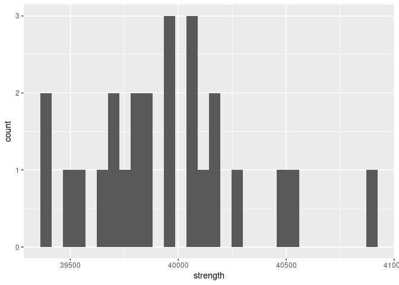

Structural Safety
================
Richard Li
2023-3-28

- <a href="#grading-rubric" id="toc-grading-rubric">Grading Rubric</a>
  - <a href="#individual" id="toc-individual">Individual</a>
  - <a href="#due-date" id="toc-due-date">Due Date</a>
- <a href="#setup" id="toc-setup">Setup</a>
  - <a
    href="#q1-visualize-the-strength-data-with-a-histogram-answer-the-questions-below"
    id="toc-q1-visualize-the-strength-data-with-a-histogram-answer-the-questions-below"><strong>q1</strong>
    Visualize the strength data with a histogram. Answer the questions
    below.</a>
- <a href="#assessing-structural-safety"
  id="toc-assessing-structural-safety">Assessing Structural Safety</a>
  - <a href="#structural-model" id="toc-structural-model">Structural
    model</a>
    - <a
      href="#q2-using-the-observations-in-df_samples-and-the-structural-model-g_break-estimate-the-probability-of-failure"
      id="toc-q2-using-the-observations-in-df_samples-and-the-structural-model-g_break-estimate-the-probability-of-failure"><strong>q2</strong>
      Using the observations in <code>df_samples</code> and the structural
      model <code>g_break()</code>, estimate the probability of failure.</a>
  - <a href="#material-property-model"
    id="toc-material-property-model">Material property model</a>
    - <a
      href="#q3-fit-a-lognormal-distribution-to-the-strength-data-using-the-fitdistr-function"
      id="toc-q3-fit-a-lognormal-distribution-to-the-strength-data-using-the-fitdistr-function"><strong>q3</strong>
      Fit a lognormal distribution to the strength data using the
      <code>fitdistr()</code> function.</a>
    - <a
      href="#q4-complete-the-code-below-by-1-choosing-a-monte-carlo-sample-size-n_monte_carlo-2-extracting-the-estimated-parameters-from-q3-and-3-computing-the-limit-state-value-g--g_break-answer-the-questions-under-observations-below"
      id="toc-q4-complete-the-code-below-by-1-choosing-a-monte-carlo-sample-size-n_monte_carlo-2-extracting-the-estimated-parameters-from-q3-and-3-computing-the-limit-state-value-g--g_break-answer-the-questions-under-observations-below"><strong>q4</strong>
      Complete the code below by 1. choosing a Monte Carlo sample size
      <code>n_monte_carlo</code>, 2. extracting the estimated parameters from
      q3, and 3. computing the limit state value <code>g = g_break()</code>.
      Answer the questions under <em>observations</em> below.</a>
  - <a href="#a-different-way-to-compute-the-pof"
    id="toc-a-different-way-to-compute-the-pof">A different way to compute
    the POF</a>
    - <a
      href="#q5-finish-the-following-function-by-computing-the-pof-with-plnorm-answer-the-questions-under-observations-below"
      id="toc-q5-finish-the-following-function-by-computing-the-pof-with-plnorm-answer-the-questions-under-observations-below"><strong>q5</strong>
      Finish the following function by computing the POF with
      <code>plnorm()</code>. Answer the questions under <em>observations</em>
      below.</a>
  - <a href="#quantifying-sampling-uncertainty"
    id="toc-quantifying-sampling-uncertainty">Quantifying sampling
    uncertainty</a>
    - <a
      href="#q6-the-code-below-estimates-a-bootstrap-ci-on-your-pof-estimate-answer-the-questions-under-observations-below"
      id="toc-q6-the-code-below-estimates-a-bootstrap-ci-on-your-pof-estimate-answer-the-questions-under-observations-below"><strong>q6</strong>
      The code below estimates a bootstrap CI on your POF estimate. Answer the
      questions under <em>observations</em> below.</a>

*Purpose*: Most real problems have multiple sources of uncertainty mixed
together. Untangling these different sources can be challenging, even on
a conceptual level. In this challenge we’ll study a simple problem of
structural safety, and use this small case study to untangle sources of
sampling and Monte Carlo uncertainty.

*Note*: In this challenge I provide a lot of stub-code; you won’t have
to do too much coding. This is because I want you to *focus on answering
the conceptual questions*. The most important questions in this
challenge are: *What sources of uncertainty are you accounting for? What
sources are you not accounting for? Are those sources real or induced?*

<!-- include-rubric -->

# Grading Rubric

<!-- -------------------------------------------------- -->

Unlike exercises, **challenges will be graded**. The following rubrics
define how you will be graded, both on an individual and team basis.

## Individual

<!-- ------------------------- -->

| Category    | Needs Improvement                                                                                                | Satisfactory                                                                                                               |
|-------------|------------------------------------------------------------------------------------------------------------------|----------------------------------------------------------------------------------------------------------------------------|
| Effort      | Some task **q**’s left unattempted                                                                               | All task **q**’s attempted                                                                                                 |
| Observed    | Did not document observations, or observations incorrect                                                         | Documented correct observations based on analysis                                                                          |
| Supported   | Some observations not clearly supported by analysis                                                              | All observations clearly supported by analysis (table, graph, etc.)                                                        |
| Assessed    | Observations include claims not supported by the data, or reflect a level of certainty not warranted by the data | Observations are appropriately qualified by the quality & relevance of the data and (in)conclusiveness of the support      |
| Specified   | Uses the phrase “more data are necessary” without clarification                                                  | Any statement that “more data are necessary” specifies which *specific* data are needed to answer what *specific* question |
| Code Styled | Violations of the [style guide](https://style.tidyverse.org/) hinder readability                                 | Code sufficiently close to the [style guide](https://style.tidyverse.org/)                                                 |

## Due Date

<!-- ------------------------- -->

All the deliverables stated in the rubrics above are due **at midnight**
before the day of the class discussion of the challenge. See the
[Syllabus](https://docs.google.com/document/d/1qeP6DUS8Djq_A0HMllMqsSqX3a9dbcx1/edit?usp=sharing&ouid=110386251748498665069&rtpof=true&sd=true)
for more information.

# Setup

<!-- ----------------------------------------------------------------------- -->

``` r
library(MASS)
library(rsample)
library(broom)
library(tidyverse)
```

    ## ── Attaching packages ─────────────────────────────────────── tidyverse 1.3.2 ──
    ## ✔ ggplot2 3.4.0     ✔ purrr   1.0.1
    ## ✔ tibble  3.1.8     ✔ dplyr   1.1.0
    ## ✔ tidyr   1.3.0     ✔ stringr 1.5.0
    ## ✔ readr   2.1.3     ✔ forcats 1.0.0
    ## ── Conflicts ────────────────────────────────────────── tidyverse_conflicts() ──
    ## ✖ dplyr::filter() masks stats::filter()
    ## ✖ dplyr::lag()    masks stats::lag()
    ## ✖ dplyr::select() masks MASS::select()

``` r
filename_samples <- "./data/al_samples.csv"
```

*Background*: The
[strength](https://en.wikipedia.org/wiki/Ultimate_tensile_strength) of a
material is the amount of mechanical stress it can survive before
breaking. To illustrate: Stresses are internal forces that hold an
object together when we try to squeeze, stretch, or otherwise deform a
solid object. For instance, if we pull on a rectangular bar of material,
internal stresses $\sigma$ work to keep the bar together.


By Jorge Stolfi - Own work, CC BY-SA 3.0,
<https://commons.wikimedia.org/w/index.php?curid=24499456>

*Strength* is a measure of how much internal stress an object can
survive: A higher strength means a stronger material. This challenge’s
data are very simple: They are (synthetic) observations of ultimate
tensile strength (UTS) on individual samples of the same aluminum alloy.
The experiments were carried out following the highest standards of
experimental rigor, so you should consider these values to be the “true”
breaking strength for each sample.

``` r
## NOTE: No need to edit; load data
df_samples <- read_csv(filename_samples)
```

    ## Rows: 25 Columns: 1
    ## ── Column specification ────────────────────────────────────────────────────────
    ## Delimiter: ","
    ## dbl (1): strength
    ## 
    ## ℹ Use `spec()` to retrieve the full column specification for this data.
    ## ℹ Specify the column types or set `show_col_types = FALSE` to quiet this message.

``` r
df_samples
```

    ## # A tibble: 25 × 1
    ##    strength
    ##       <dbl>
    ##  1   39484.
    ##  2   39812.
    ##  3   40052.
    ##  4   40519.
    ##  5   40045.
    ##  6   40160.
    ##  7   40094.
    ##  8   39674.
    ##  9   40144.
    ## 10   39865.
    ## # … with 15 more rows

Data Dictionary:

| Quantity       | Units |
|----------------|-------|
| Strength (UTS) | psi   |

### **q1** Visualize the strength data with a histogram. Answer the questions below.

``` r
df_samples %>%
  ggplot(aes(strength)) + 
  geom_histogram()
```

    ## `stat_bin()` using `bins = 30`. Pick better value with `binwidth`.

<!-- -->

**Observations**:

- What is the mean strength of the material, approximately?
  - Judging from this histogram, it appears that the mean strength is
    \~39800
- To what extent can you tell what shape the distribution of the data
  has?
  - If I put on a pair of very biased goggles, I could maybe contort
    this data to fit a normal distribution in my head, but really it’s
    quite impossible to tell. There’s simply not enough data, and the
    shape is not clear enough.
- Assuming the scopus is the strength of an individual part made from
  this aluminum alloy, is the observed variability real or induced?
  - The observed variability should be real – just because they’re all
    sampled from the same aluminum alloy does not mean we expect uniform
    perfection all around it; some samples may have simply been grabbed
    from less-strong parts of the aluminum.

# Assessing Structural Safety

<!-- ----------------------------------------------------------------------- -->

*Objective*: In this challenge you are going to study a structure and
assess its *probability of failure* (POF). A higher POF corresponds to a
more unsafe structure. Ultimately, we want

$$\text{POF} < 0.03.$$

Your job is to assess a given structure using the data provided and
determine whether you can *confidently* conclude that `POF < 0.03`.

## Structural model

<!-- --------------------------------------- -->

The following code chunk sets up a structural model: We are considering
a rectangular bar under uniaxial tensile load (as pictured above). A
larger cross-sectional area `A` is capable of surviving a greater load
`L`, but a larger `A` is a heavier (more expensive) structure. The
internal stress is approximately `sigma = L / A`—we simply compare this
quantity against the strength.

I pick particular values for `A, L` and package all the information in
the *limit state function* `g_break`:

``` r
## NOTE: No need to edit; model setup
A <- 0.0255 # Cross-sectional area
L <- 1000 # Applied load (lbs)

g_break <- function(strength) {
  strength - L / A
}
```

The *probability of failure* (POF) is then defined in terms of the limit
state $g$ via:

$$\text{POF} \equiv \mathbb{P}[g \leq 0].$$

### **q2** Using the observations in `df_samples` and the structural model `g_break()`, estimate the probability of failure.

*Hint*: In `c07-monte-carlo` you learned how to estimate a probability
as the `mean()` of an indicator. Use the same strategy here.

``` r
## TODO: Estimate the probability of failure; i.e. POF = Pr[g <= 0]
test <- df_samples %>%
  mutate(
    g = g_break(strength),
    broken = strength < g,
  ) %>%
  summarize(
    POF = mean(broken)
  )


test
```

    ## # A tibble: 1 × 1
    ##     POF
    ##   <dbl>
    ## 1     0

**Observations**:

- Does this estimate satisfy `POF < 0.03`?
  - Yes
- Is this estimate of the probability of failure trustworthy? Why or why
  not?
  - As a process, this doesn’t seem like a bad way to try and estimate
    the probability of failure. However, in this case, it’s not
    trustworthy – as we mentioned previously, we’ve conducted such
    limited sampling that this could very easily be a fluke.
- Can you confidently conclude that `POF < 0.03`? Why or why not.
  - No. We’ve already established the the estimate isn’t trustworthy – I
    would therefore be hesitant to make any conclusions regarding the
    data via this estimate.

## Material property model

<!-- --------------------------------------- -->

Since we have so few physical samples, we will fit a distribution to
model the material property. This will give us the means to draw
“virtual samples” and use those to estimate the POF.

### **q3** Fit a lognormal distribution to the strength data using the `fitdistr()` function.

*Note*: In this challenge I generated the `strength` data from a
`lognormal` distribution; if you didn’t know that fact, then the choice
of distribution would be an *additional* source of uncertainty!

*Hint 1*: We learned how to do this in `e-stat08-fit-dist`.

*Hint 2*: The `fitdistr` function uses `densfun = "lognormal"` to
specify a lognormal distribution.

``` r
## TODO:
df_fit <- df_samples %>%
  pull(strength) %>%
  fitdistr(densfun = "lognormal")

df_fit
```

    ##      meanlog         sdlog    
    ##   10.595117912    0.008750493 
    ##  ( 0.001750099) ( 0.001237507)

Once you’ve successfully fit a model for the strength, you can estimate
the probability of failure by drawing samples from the fitted
distribution.

### **q4** Complete the code below by 1. choosing a Monte Carlo sample size `n_monte_carlo`, 2. extracting the estimated parameters from q3, and 3. computing the limit state value `g = g_break()`. Answer the questions under *observations* below.

*Hint 1*: You will need to combine ideas from `c07-monte-carlo` and
`e-stat08-fit-dist` in order to complete this task.

*Hint 2*: The function `rlnorm()` will allow you to draw samples from a
lognormal distribution.

``` r
## TODO 1: Choose Monte Carlo sample size
n_monte_carlo <- 1000

## TODO 2: Extract parameter estimates from df_fit
strength_meanlog <- 10.595
strength_sdlog <- 0.0087

# Generate samples
df_norm_sim <-
  tibble(strength = rlnorm(n_monte_carlo, strength_meanlog, strength_sdlog)) %>%
  mutate(
    g = g_break(strength)
  ) %>%
  glimpse()
```

    ## Rows: 1,000
    ## Columns: 2
    ## $ strength <dbl> 39680.73, 39335.39, 39699.50, 39399.12, 40065.11, 39736.94, 4…
    ## $ g        <dbl> 465.0426, 119.6997, 483.8155, 183.4308, 849.4285, 521.2556, 1…

``` r
## NOTE: The following code estimates the POF and a 95% confidence interval
df_norm_pof <-
  df_norm_sim %>%
  mutate(stat = g <= 0) %>%
  summarize(
    pof_est = mean(stat),
    se = sd(stat) / sqrt(n_monte_carlo)
  ) %>%
  mutate(
    pof_lo = pof_est - 1.96 * se,
    pof_hi = pof_est + 1.96 * se
  ) %>%
  select(pof_lo, pof_est, pof_hi)

df_norm_pof
```

    ## # A tibble: 1 × 3
    ##   pof_lo pof_est pof_hi
    ##    <dbl>   <dbl>  <dbl>
    ## 1 0.0113    0.02 0.0287

- Assuming your scopus is the probability of failure `POF` defined
  above, does your estimate exhibit real variability, induced
  variability, or both?

  - `POF` is a constant that varies based on the distribution of
    strength, so because we can assume that the distribution of the
    strength here isn’t changing, we can assume there is no real
    variability. As a result, we can assume any existing variability is
    induced variability.

- Does this confidence interval imply that `POF < 0.03`?

  - Yes

- Compare this probability with your estimate from q2; is it more or
  less trustworthy?

  - In our case, it’s more trustworthy because we know what distribution
    the strength data was drawn from. Simulating data like this always
    has the danger that we’re making assumptions that don’t hold true.

- Does the confidence interval above account for uncertainty arising
  from the *Monte Carlo approximation*? Why or why not?

  - Yes; the confidence interval we do here needs to exist because we’re
    doing random sampling and thus *could just be getting lucky*; either
    way, that’s where it comes from so I think it accounts for this
    uncertainty.

- Does the confidence interval above account for uncertainty arising
  from *limited physical tests* (`df_samples`)? Why or why not?

  - I want to say no. We drew our samples from a simulated lognormal
    distribution, which we know is correct because we’re told so;
    df_samples never plays a role.

  What could you do to tighten up the confidence interval?

  - Increase our sample size.

- Can you *confidently* conclude that `POF < 0.03`? Why or why not?

  - Even though my confidence interval’s upper bound was below 0.03, I
    still can’t confidently conclude that `POF < 0.03` based on this
    specific sample because there’s a lot of uncertainty from limited
    tests. Based purely upon these sources of uncertainty, i cannot
    trust it.

## A different way to compute the POF

<!-- --------------------------------------- -->

Monte Carlo is a *general* way to estimate probabilities, but it
introduces approximation error. It turns out that, for the simple
problem we’re studying, we can compute the probability directly using
the CDF. Note that for our structural safety problem, we have

$$\text{POF} = \mathbb{P}[g \leq 0] = \mathbb{P}[S \leq L / A] = \text{CDF}_S(L/A).$$

Since
`S = rlnorm(n, meanlog = strength_meanlog, sdlog = strength_sdlog)`, we
can use `plnorm` to compute the probability of failure without Monte
Carlo as
`POF = plnorm(L/A, meanlog = strength_meanlog, sdlog = strength_sdlog)`.
Let’s combine this idea with the fitted distribution to estimate the
POF.

### **q5** Finish the following function by computing the POF with `plnorm()`. Answer the questions under *observations* below.

``` r
## TODO: Complete the function below;
##       note that you only need to edit the TODO section

estimate_pof <- function(df) {
  ## Fit the distribution
  df_fit <-
    df %>%
    pull(strength) %>%
    fitdistr(densfun = "lognormal") %>%
    tidy()

  ## Extract the parameters
  strength_meanlog <-
    df_fit %>%
    filter(term == "meanlog") %>%
    pull(estimate)
  strength_sdlog <-
    df_fit %>%
    filter(term == "sdlog") %>%
    pull(estimate)

## TODO: Estimate the probability of failure using plnorm
  pof_estimate <- plnorm(L/A, meanlog = strength_meanlog, sdlog = strength_sdlog)

  ## NOTE: No need to edit; this last line returns your pof_estimate
  pof_estimate
}

## NOTE: No need to edit; test your function
df_samples %>% estimate_pof()
```

    ## [1] 0.01832289

**Observations**:

- How does this estimate compare with your Monte Carlo estimate above?
  - It’s higher.
- Does this estimate have any uncertainty due to *Monte Carlo
  approximation*? Why or why not?
  - No? I’m not sure why we’d have uncertainty due to Monte Carlo
    approximation if we’re not using Monte Carlo.
- With the scopus as the `POF`, would uncertainty due to *Monte Carlo
  approximation* be induced or real?
  - ---- theoretically induced, but should there be uncertainty due to
    Monte Carlo approximation?  
- Does this estimate have any uncertainty due to *limited physical
  tests*? Why or why not?
  - Yes. We’re stilling fitting a function by basically pulling a
    distribution out of nowhere and thus there is uncertainty.
- With the scopus as the `POF`, would uncertainty due to *limited
  physical tests* be induced or real?
  - I want to say induced, but I said earlier that I didn’t think there
    was any induced uncertainty….

## Quantifying sampling uncertainty

<!-- --------------------------------------- -->

Using `plnorm()` gets rid of Monte Carlo error, but we still have
uncertainty due to limited physical testing. Often we can use a CLT
approximation to construct a confidence interval. However, with
`plnorm()` we can’t use a CLT approximation because it does not follow
the assumptions of the central limit theorem (it’s not a sum of iid
random variables). Instead, we can use the *bootstrap* to approximate a
confidence interval via resampling.

### **q6** The code below estimates a bootstrap CI on your POF estimate. Answer the questions under *observations* below.

``` r
## NOTE: No need to edit; run and inspect
tidycustom <- function(est) {tibble(term = "pof", estimate = est)}

df_samples %>%
  bootstraps(times = 1000) %>%
  mutate(
    estimates = map(
      splits,
      ~ analysis(.x) %>% estimate_pof() %>% tidycustom()
    )
  ) %>%
  int_pctl(estimates)
```

    ## # A tibble: 1 × 6
    ##   term   .lower .estimate .upper .alpha .method   
    ##   <chr>   <dbl>     <dbl>  <dbl>  <dbl> <chr>     
    ## 1 pof   0.00150    0.0182 0.0501   0.05 percentile

**Observations**:

- Does the confidence interval above account for uncertainty arising
  from *Monte Carlo approximation* of the POF? Why or why not?
  - \>O\< why would there be uncertainty arising from Monte Carlo
    approximation of the POF if we’re expressly choosing not to use
    Monte Carlo approximation?
- Does the confidence interval above account for uncertainty arising
  from *limited physical tests* (`df_samples`)? Why or why not?
  - Yes. We’re factoring in our limited samples when we run this to
    compute our final confidence interval, hence why it’s much larger
    than our simulated dataset
- Can you confidently conclude that `POF < 0.03`? Why or why not?
  - No. The upper bound of our confidence interval includes POF \> 0.03,
    and thus we cannot confidently conclude that POF \< 0.03
