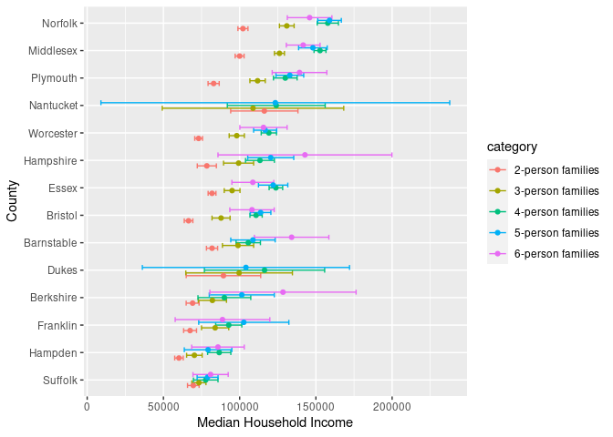
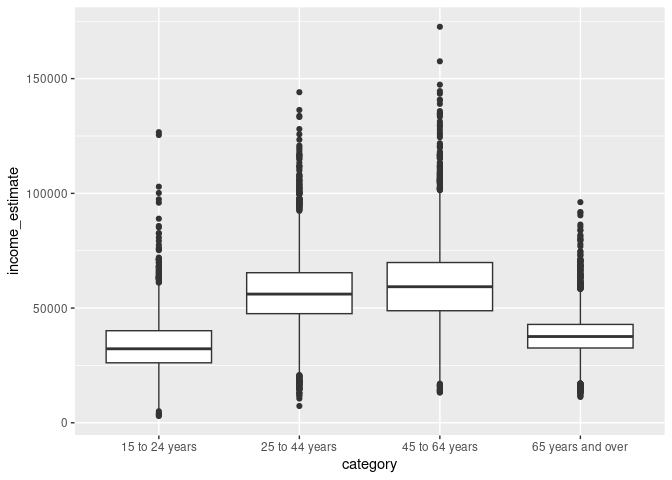

US Income
================
RICHARD LI
2023-4-7

- <a href="#grading-rubric" id="toc-grading-rubric">Grading Rubric</a>
  - <a href="#individual" id="toc-individual">Individual</a>
  - <a href="#due-date" id="toc-due-date">Due Date</a>
- <a href="#setup" id="toc-setup">Setup</a>
  - <a
    href="#q1-load-the-population-data-from-c06-simply-replace-filename_pop-below"
    id="toc-q1-load-the-population-data-from-c06-simply-replace-filename_pop-below"><strong>q1</strong>
    Load the population data from c06; simply replace
    <code>filename_pop</code> below.</a>
  - <a href="#q2-obtain-median-income-data-from-the-census-bureau"
    id="toc-q2-obtain-median-income-data-from-the-census-bureau"><strong>q2</strong>
    Obtain median income data from the Census Bureau:</a>
  - <a
    href="#q3-tidy-the-df_income-dataset-by-completing-the-code-below-pivot-and-rename-the-columns-to-arrive-at-the-column-names-id-geographic_area_name-category-income_estimate-income_moe"
    id="toc-q3-tidy-the-df_income-dataset-by-completing-the-code-below-pivot-and-rename-the-columns-to-arrive-at-the-column-names-id-geographic_area_name-category-income_estimate-income_moe"><strong>q3</strong>
    Tidy the <code>df_income</code> dataset by completing the code below.
    Pivot and rename the columns to arrive at the column names
    <code>id, geographic_area_name, category, income_estimate, income_moe</code>.</a>
  - <a
    href="#q4-convert-the-margin-of-error-to-standard-error-additionally-compute-a-99-confidence-interval-on-income-and-normalize-the-standard-error-to-income_cv--income_se--income_estimate-provide-these-columns-with-the-names-income_se-income_lo-income_hi-income_cv"
    id="toc-q4-convert-the-margin-of-error-to-standard-error-additionally-compute-a-99-confidence-interval-on-income-and-normalize-the-standard-error-to-income_cv--income_se--income_estimate-provide-these-columns-with-the-names-income_se-income_lo-income_hi-income_cv"><strong>q4</strong>
    Convert the margin of error to standard error. Additionally, compute a
    99% confidence interval on income, and normalize the standard error to
    <code>income_CV = income_SE / income_estimate</code>. Provide these
    columns with the names
    <code>income_SE, income_lo, income_hi, income_CV</code>.</a>
  - <a href="#q5-join-df_q4-and-df_pop"
    id="toc-q5-join-df_q4-and-df_pop"><strong>q5</strong> Join
    <code>df_q4</code> and <code>df_pop</code>.</a>
- <a href="#analysis" id="toc-analysis">Analysis</a>
  - <a
    href="#q6-study-the-following-graph-making-sure-to-note-what-you-can-and-cant-conclude-based-on-the-estimates-and-confidence-intervals-document-your-observations-below-and-answer-the-questions"
    id="toc-q6-study-the-following-graph-making-sure-to-note-what-you-can-and-cant-conclude-based-on-the-estimates-and-confidence-intervals-document-your-observations-below-and-answer-the-questions"><strong>q6</strong>
    Study the following graph, making sure to note what you can <em>and
    can’t</em> conclude based on the estimates and confidence intervals.
    Document your observations below and answer the questions.</a>
  - <a
    href="#q7-plot-the-standard-error-against-population-for-all-counties-create-a-visual-that-effectively-highlights-the-trends-in-the-data-answer-the-questions-under-observations-below"
    id="toc-q7-plot-the-standard-error-against-population-for-all-counties-create-a-visual-that-effectively-highlights-the-trends-in-the-data-answer-the-questions-under-observations-below"><strong>q7</strong>
    Plot the standard error against population for all counties. Create a
    visual that effectively highlights the trends in the data. Answer the
    questions under <em>observations</em> below.</a>
- <a href="#going-further" id="toc-going-further">Going Further</a>
  - <a
    href="#q8-pose-your-own-question-about-the-data-create-a-visualization-or-table-here-and-document-your-observations"
    id="toc-q8-pose-your-own-question-about-the-data-create-a-visualization-or-table-here-and-document-your-observations"><strong>q8</strong>
    Pose your own question about the data. Create a visualization (or table)
    here, and document your observations.</a>
- <a href="#references" id="toc-references">References</a>

*Purpose*: We’ve been learning how to quantify uncertainty in estimates
through the exercises; now its time to put those skills to use studying
real data. In this challenge we’ll use concepts like confidence
intervals to help us make sense of census data.

*Reading*: - [Using ACS Estimates and Margin of
Error](https://www.census.gov/programs-surveys/acs/guidance/training-presentations/acs-moe.html)
(Optional) - [Patterns and Causes of Uncertainty in the American
Community
Survey](https://www.sciencedirect.com/science/article/pii/S0143622813002518?casa_token=VddzQ1-spHMAAAAA:FTq92LXgiPVloJUVjnHs8Ma1HwvPigisAYtzfqaGbbRRwoknNq56Y2IzszmGgIGH4JAPzQN0)
(Optional, particularly the *Uncertainty in surveys* section under the
Introduction.)

<!-- include-rubric -->

# Grading Rubric

<!-- -------------------------------------------------- -->

Unlike exercises, **challenges will be graded**. The following rubrics
define how you will be graded, both on an individual and team basis.

## Individual

<!-- ------------------------- -->

| Category    | Needs Improvement                                                                                                | Satisfactory                                                                                                               |
|-------------|------------------------------------------------------------------------------------------------------------------|----------------------------------------------------------------------------------------------------------------------------|
| Effort      | Some task **q**’s left unattempted                                                                               | All task **q**’s attempted                                                                                                 |
| Observed    | Did not document observations, or observations incorrect                                                         | Documented correct observations based on analysis                                                                          |
| Supported   | Some observations not clearly supported by analysis                                                              | All observations clearly supported by analysis (table, graph, etc.)                                                        |
| Assessed    | Observations include claims not supported by the data, or reflect a level of certainty not warranted by the data | Observations are appropriately qualified by the quality & relevance of the data and (in)conclusiveness of the support      |
| Specified   | Uses the phrase “more data are necessary” without clarification                                                  | Any statement that “more data are necessary” specifies which *specific* data are needed to answer what *specific* question |
| Code Styled | Violations of the [style guide](https://style.tidyverse.org/) hinder readability                                 | Code sufficiently close to the [style guide](https://style.tidyverse.org/)                                                 |

## Due Date

<!-- ------------------------- -->

All the deliverables stated in the rubrics above are due **at midnight**
before the day of the class discussion of the challenge. See the
[Syllabus](https://docs.google.com/document/d/1qeP6DUS8Djq_A0HMllMqsSqX3a9dbcx1/edit?usp=sharing&ouid=110386251748498665069&rtpof=true&sd=true)
for more information.

# Setup

<!-- ----------------------------------------------------------------------- -->

``` r
library(tidyverse)
```

    ## ── Attaching packages ─────────────────────────────────────── tidyverse 1.3.2 ──
    ## ✔ ggplot2 3.4.0     ✔ purrr   1.0.1
    ## ✔ tibble  3.1.8     ✔ dplyr   1.1.0
    ## ✔ tidyr   1.3.0     ✔ stringr 1.5.0
    ## ✔ readr   2.1.3     ✔ forcats 1.0.0
    ## ── Conflicts ────────────────────────────────────────── tidyverse_conflicts() ──
    ## ✖ dplyr::filter() masks stats::filter()
    ## ✖ dplyr::lag()    masks stats::lag()

### **q1** Load the population data from c06; simply replace `filename_pop` below.

``` r
## TODO: Give the filename for your copy of Table B01003
filename_pop <- "data/ACSDT5Y2018.B01003-Data.csv"

## NOTE: No need to edit
df_pop <-
  read_csv(
    filename_pop,
    skip = 2,
    col_names = c(
      "id",
      "geographic_area_name",
      "population_estimate",
      "population_moe"
    )
  )
```

    ## Rows: 3220 Columns: 7
    ## ── Column specification ────────────────────────────────────────────────────────
    ## Delimiter: ","
    ## chr (5): id, geographic_area_name, population_moe, X5, X6
    ## dbl (1): population_estimate
    ## lgl (1): X7
    ## 
    ## ℹ Use `spec()` to retrieve the full column specification for this data.
    ## ℹ Specify the column types or set `show_col_types = FALSE` to quiet this message.

``` r
df_pop
```

    ## # A tibble: 3,220 × 7
    ##    id             geographic_area_name     populatio…¹ popul…² X5    X6    X7   
    ##    <chr>          <chr>                          <dbl> <chr>   <chr> <chr> <lgl>
    ##  1 0500000US01001 Autauga County, Alabama        55200 null    ***** ***** NA   
    ##  2 0500000US01003 Baldwin County, Alabama       208107 null    ***** ***** NA   
    ##  3 0500000US01005 Barbour County, Alabama        25782 null    ***** ***** NA   
    ##  4 0500000US01007 Bibb County, Alabama           22527 null    ***** ***** NA   
    ##  5 0500000US01009 Blount County, Alabama         57645 null    ***** ***** NA   
    ##  6 0500000US01011 Bullock County, Alabama        10352 null    ***** ***** NA   
    ##  7 0500000US01013 Butler County, Alabama         20025 null    ***** ***** NA   
    ##  8 0500000US01015 Calhoun County, Alabama       115098 null    ***** ***** NA   
    ##  9 0500000US01017 Chambers County, Alabama       33826 null    ***** ***** NA   
    ## 10 0500000US01019 Cherokee County, Alabama       25853 null    ***** ***** NA   
    ## # … with 3,210 more rows, and abbreviated variable names ¹​population_estimate,
    ## #   ²​population_moe

You might wonder why the `Margin of Error` in the population estimates
is listed as `*****`. From the [documentation (PDF
link)](https://www.google.com/url?sa=t&rct=j&q=&esrc=s&source=web&cd=&cad=rja&uact=8&ved=2ahUKEwj81Omy16TrAhXsguAKHTzKDQEQFjABegQIBxAB&url=https%3A%2F%2Fwww2.census.gov%2Fprograms-surveys%2Facs%2Ftech_docs%2Faccuracy%2FMultiyearACSAccuracyofData2018.pdf%3F&usg=AOvVaw2TOrVuBDlkDI2gde6ugce_)
for the ACS:

> If the margin of error is displayed as ‘\*\*\*\*\*’ (five asterisks),
> the estimate has been controlled to be equal to a fixed value and so
> it has no sampling error. A standard error of zero should be used for
> these controlled estimates when completing calculations, such as those
> in the following section.

This means that for cases listed as `*****` the US Census Bureau
recommends treating the margin of error (and thus standard error) as
zero.

### **q2** Obtain median income data from the Census Bureau:

- `Filter > Topics > Income and Poverty > Income and Poverty`
- `Filter > Geography > County > All counties in United States`
- Look for `Median Income in the Past 12 Months` (Table S1903)
- Download the 2018 5-year ACS estimates; save to your `data` folder and
  add the filename below.

``` r
## TODO: Give the filename for your copy of Table S1903
filename_income <- "data/ACSST5Y2018.S1903-Data.csv"

## NOTE: No need to edit
df_income <-
  read_csv(filename_income, skip = 1) %>%
  rename(
    id = Geography,
  ) %>% 
  select(
    -contains("Annotation")
  )
```

    ## New names:
    ## • `` -> `...483`

    ## Warning: One or more parsing issues, call `problems()` on your data frame for details,
    ## e.g.:
    ##   dat <- vroom(...)
    ##   problems(dat)

    ## Rows: 3220 Columns: 483
    ## ── Column specification ────────────────────────────────────────────────────────
    ## Delimiter: ","
    ## chr (306): Geography, Geographic Area Name, Annotation of Margin of Error!!N...
    ## dbl (176): Estimate!!Number!!HOUSEHOLD INCOME BY RACE AND HISPANIC OR LATINO...
    ## lgl   (1): ...483
    ## 
    ## ℹ Use `spec()` to retrieve the full column specification for this data.
    ## ℹ Specify the column types or set `show_col_types = FALSE` to quiet this message.

``` r
df_income
```

    ## # A tibble: 3,220 × 243
    ##    id    Geogr…¹ Estim…² Margi…³ Estim…⁴ Margi…⁵ Estim…⁶ Margi…⁷ Estim…⁸ Margi…⁹
    ##    <chr> <chr>     <dbl>   <dbl>   <dbl>   <dbl>   <dbl>   <dbl>   <dbl>   <dbl>
    ##  1 0500… Autaug…   21115     383   16585     363    4085     205      34      33
    ##  2 0500… Baldwi…   78622    1183   69544    1042    6425     500     460     171
    ##  3 0500… Barbou…    9186     280    4729     211    4135     248       9      16
    ##  4 0500… Bibb C…    6840     321    5588     346    1172     200       0      22
    ##  5 0500… Blount…   20600     396   20054     417     190      98      24      27
    ##  6 0500… Bulloc…    3609     196     881     119    2681     212      44      52
    ##  7 0500… Butler…    6708     274    3821     173    2752     207       2       4
    ##  8 0500… Calhou…   45033     683   33820     559    9514     435     152      64
    ##  9 0500… Chambe…   13516     372    7953     296    5268     235      54      42
    ## 10 0500… Cherok…   10606     370    9953     356     477      90      33      32
    ## # … with 3,210 more rows, 233 more variables:
    ## #   `Estimate!!Number!!HOUSEHOLD INCOME BY RACE AND HISPANIC OR LATINO ORIGIN OF HOUSEHOLDER!!Households!!One race--!!Asian` <dbl>,
    ## #   `Margin of Error!!Number MOE!!HOUSEHOLD INCOME BY RACE AND HISPANIC OR LATINO ORIGIN OF HOUSEHOLDER!!Households!!One race--!!Asian` <dbl>,
    ## #   `Estimate!!Number!!HOUSEHOLD INCOME BY RACE AND HISPANIC OR LATINO ORIGIN OF HOUSEHOLDER!!Households!!One race--!!Native Hawaiian and Other Pacific Islander` <dbl>,
    ## #   `Margin of Error!!Number MOE!!HOUSEHOLD INCOME BY RACE AND HISPANIC OR LATINO ORIGIN OF HOUSEHOLDER!!Households!!One race--!!Native Hawaiian and Other Pacific Islander` <dbl>,
    ## #   `Estimate!!Number!!HOUSEHOLD INCOME BY RACE AND HISPANIC OR LATINO ORIGIN OF HOUSEHOLDER!!Households!!One race--!!Some other race` <dbl>,
    ## #   `Margin of Error!!Number MOE!!HOUSEHOLD INCOME BY RACE AND HISPANIC OR LATINO ORIGIN OF HOUSEHOLDER!!Households!!One race--!!Some other race` <dbl>, …

Use the following test to check that you downloaded the correct file:

``` r
## NOTE: No need to edit, use to check you got the right file.
assertthat::assert_that(
  df_income %>%
    filter(id == "0500000US01001") %>%
    pull(`Estimate!!Percent Distribution!!FAMILY INCOME BY FAMILY SIZE!!2-person families`)
  == 45.6
)
```

    ## [1] TRUE

``` r
print("Well done!")
```

    ## [1] "Well done!"

This dataset is in desperate need of some *tidying*. To simplify the
task, we’ll start by considering the `\\d-person families` columns
first.

### **q3** Tidy the `df_income` dataset by completing the code below. Pivot and rename the columns to arrive at the column names `id, geographic_area_name, category, income_estimate, income_moe`.

*Hint*: You can do this in a single pivot using the `".value"` argument
and a `names_pattern` using capture groups `"()"`. Remember that you can
use an OR operator `|` in a regex to allow for multiple possibilities in
a capture group, for example `"(Estimate|Margin of Error)"`.

``` r
df_working <-
  df_income %>%
  select(
    id,
    contains("Geographic"),
    contains("median") & matches("\\d-person families")
  ) %>%
  mutate(across(contains("median"), as.numeric))
```

    ## Warning: There were 8 warnings in `mutate()`.
    ## The first warning was:
    ## ℹ In argument: `across(contains("median"), as.numeric)`.
    ## Caused by warning:
    ## ! NAs introduced by coercion
    ## ℹ Run ]8;;ide:run:dplyr::last_dplyr_warnings()dplyr::last_dplyr_warnings()]8;; to see the 7 remaining warnings.

``` r
df_working %>% glimpse()
```

    ## Rows: 3,220
    ## Columns: 12
    ## $ id                                                                                              <chr> …
    ## $ `Geographic Area Name`                                                                          <chr> …
    ## $ `Estimate!!Median income (dollars)!!FAMILY INCOME BY FAMILY SIZE!!2-person families`            <dbl> …
    ## $ `Margin of Error!!Median income (dollars) MOE!!FAMILY INCOME BY FAMILY SIZE!!2-person families` <dbl> …
    ## $ `Estimate!!Median income (dollars)!!FAMILY INCOME BY FAMILY SIZE!!3-person families`            <dbl> …
    ## $ `Margin of Error!!Median income (dollars) MOE!!FAMILY INCOME BY FAMILY SIZE!!3-person families` <dbl> …
    ## $ `Estimate!!Median income (dollars)!!FAMILY INCOME BY FAMILY SIZE!!4-person families`            <dbl> …
    ## $ `Margin of Error!!Median income (dollars) MOE!!FAMILY INCOME BY FAMILY SIZE!!4-person families` <dbl> …
    ## $ `Estimate!!Median income (dollars)!!FAMILY INCOME BY FAMILY SIZE!!5-person families`            <dbl> …
    ## $ `Margin of Error!!Median income (dollars) MOE!!FAMILY INCOME BY FAMILY SIZE!!5-person families` <dbl> …
    ## $ `Estimate!!Median income (dollars)!!FAMILY INCOME BY FAMILY SIZE!!6-person families`            <dbl> …
    ## $ `Margin of Error!!Median income (dollars) MOE!!FAMILY INCOME BY FAMILY SIZE!!6-person families` <dbl> …

``` r
df_q3 <- df_working %>%
  pivot_longer(
    names_pattern = "(Estimate|Margin of Error).*(\\d-person families)",
    names_to = c(".value", "category"),
    cols = -c("id", "Geographic Area Name")
  ) %>%
  rename(
    "geographic_area_name" = "Geographic Area Name",
    "income_estimate" = "Estimate",
    "income_moe" =  "Margin of Error"
  )


## NOTE: I KNOW THIS IS UGLY. I'M LEAVING IT AS A REMINDER TO MYSELF THAT IT CAN ALWAYS BE WORSE :P

# df_q3 <- df_working %>%
#   pivot_longer(
#     names_to = "dropping_this",
#     values_to = "income_moe",
#     cols = contains("Margin of Error")
#   ) %>%
#   pivot_longer(
#     names_to = "drop",
#     values_to = "income_estimate",
#     cols = contains("Estimate")
#   ) %>%
#   separate(
#     col = ("dropping_this"), 
#     into = c("drop_this", "category"),
#     sep = (-17)
#   ) %>%
#   select(
#     -contains("drop")
#   ) %>%
#   rename(
#     geographic_area_name = "Geographic Area Name"
#   )
df_q3
```

    ## # A tibble: 16,100 × 5
    ##    id             geographic_area_name    category          income_est…¹ incom…²
    ##    <chr>          <chr>                   <chr>                    <dbl>   <dbl>
    ##  1 0500000US01001 Autauga County, Alabama 2-person families        64947    6663
    ##  2 0500000US01001 Autauga County, Alabama 3-person families        80172   14181
    ##  3 0500000US01001 Autauga County, Alabama 4-person families        85455   10692
    ##  4 0500000US01001 Autauga County, Alabama 5-person families        88601   20739
    ##  5 0500000US01001 Autauga County, Alabama 6-person families       103787   12387
    ##  6 0500000US01003 Baldwin County, Alabama 2-person families        63975    2297
    ##  7 0500000US01003 Baldwin County, Alabama 3-person families        79390    8851
    ##  8 0500000US01003 Baldwin County, Alabama 4-person families        88458    5199
    ##  9 0500000US01003 Baldwin County, Alabama 5-person families        91259    7011
    ## 10 0500000US01003 Baldwin County, Alabama 6-person families        69609   23175
    ## # … with 16,090 more rows, and abbreviated variable names ¹​income_estimate,
    ## #   ²​income_moe

Use the following tests to check your work:

``` r
## NOTE: No need to edit
assertthat::assert_that(setequal(
  names(df_q3),
  c("id", "geographic_area_name", "category", "income_estimate", "income_moe")
))
```

    ## [1] TRUE

``` r
assertthat::assert_that(
  df_q3 %>%
    filter(id == "0500000US01001", category == "2-person families") %>%
    pull(income_moe)
  == 6663
)
```

    ## [1] TRUE

``` r
print("Nice!")
```

    ## [1] "Nice!"

The data gives finite values for the Margin of Error, which is closely
related to the Standard Error. The Census Bureau documentation gives the
following relationship between Margin of Error and Standard Error:

$$\text{MOE} = 1.645 \times \text{SE}.$$

### **q4** Convert the margin of error to standard error. Additionally, compute a 99% confidence interval on income, and normalize the standard error to `income_CV = income_SE / income_estimate`. Provide these columns with the names `income_SE, income_lo, income_hi, income_CV`.

``` r
df_q4 <- df_q3 %>%
  mutate(
    income_SE = income_moe/1.645,
    income_lo = income_estimate - income_SE*2.576,
    income_hi = income_estimate + income_SE*2.576,
    income_CV = income_SE/income_estimate
  )

df_q4
```

    ## # A tibble: 16,100 × 9
    ##    id            geogr…¹ categ…² incom…³ incom…⁴ incom…⁵ incom…⁶ incom…⁷ incom…⁸
    ##    <chr>         <chr>   <chr>     <dbl>   <dbl>   <dbl>   <dbl>   <dbl>   <dbl>
    ##  1 0500000US010… Autaug… 2-pers…   64947    6663   4050.  54513.  75381.  0.0624
    ##  2 0500000US010… Autaug… 3-pers…   80172   14181   8621.  57965. 102379.  0.108 
    ##  3 0500000US010… Autaug… 4-pers…   85455   10692   6500.  68712. 102198.  0.0761
    ##  4 0500000US010… Autaug… 5-pers…   88601   20739  12607.  56125. 121077.  0.142 
    ##  5 0500000US010… Autaug… 6-pers…  103787   12387   7530.  84389. 123185.  0.0726
    ##  6 0500000US010… Baldwi… 2-pers…   63975    2297   1396.  60378.  67572.  0.0218
    ##  7 0500000US010… Baldwi… 3-pers…   79390    8851   5381.  65530.  93250.  0.0678
    ##  8 0500000US010… Baldwi… 4-pers…   88458    5199   3160.  80317.  96599.  0.0357
    ##  9 0500000US010… Baldwi… 5-pers…   91259    7011   4262.  80280. 102238.  0.0467
    ## 10 0500000US010… Baldwi… 6-pers…   69609   23175  14088.  33318. 105900.  0.202 
    ## # … with 16,090 more rows, and abbreviated variable names
    ## #   ¹​geographic_area_name, ²​category, ³​income_estimate, ⁴​income_moe,
    ## #   ⁵​income_SE, ⁶​income_lo, ⁷​income_hi, ⁸​income_CV

Use the following tests to check your work:

``` r
## NOTE: No need to edit
assertthat::assert_that(setequal(
  names(df_q4),
  c("id", "geographic_area_name", "category", "income_estimate", "income_moe",
    "income_SE", "income_lo", "income_hi", "income_CV")
))
```

    ## [1] TRUE

``` r
assertthat::assert_that(
  abs(
    df_q4 %>%
    filter(id == "0500000US01001", category == "2-person families") %>%
    pull(income_SE) - 4050.456
  ) / 4050.456 < 1e-3
)
```

    ## [1] TRUE

``` r
assertthat::assert_that(
  abs(
    df_q4 %>%
    filter(id == "0500000US01001", category == "2-person families") %>%
    pull(income_lo) - 54513.72
  ) / 54513.72 < 1e-3
)
```

    ## [1] TRUE

``` r
assertthat::assert_that(
  abs(
    df_q4 %>%
    filter(id == "0500000US01001", category == "2-person families") %>%
    pull(income_hi) - 75380.28
  ) / 75380.28 < 1e-3
)
```

    ## [1] TRUE

``` r
assertthat::assert_that(
  abs(
    df_q4 %>%
    filter(id == "0500000US01001", category == "2-person families") %>%
    pull(income_CV) - 0.06236556
  ) / 0.06236556 < 1e-3
)
```

    ## [1] TRUE

``` r
print("Nice!")
```

    ## [1] "Nice!"

One last wrangling step: We need to join the two datasets so we can
compare population with income.

### **q5** Join `df_q4` and `df_pop`.

``` r
## TODO: Join df_q4 and df_pop by the appropriate column

df_data <- right_join(df_pop, df_q4, by = c("id", "geographic_area_name"))
```

    ## Warning in right_join(df_pop, df_q4, by = c("id", "geographic_area_name")): Each row in `x` is expected to match at most 1 row in `y`.
    ## ℹ Row 1 of `x` matches multiple rows.
    ## ℹ If multiple matches are expected, set `multiple = "all"` to silence this
    ##   warning.

``` r
df_data 
```

    ## # A tibble: 16,100 × 14
    ##    id          geogr…¹ popul…² popul…³ X5    X6    X7    categ…⁴ incom…⁵ incom…⁶
    ##    <chr>       <chr>     <dbl> <chr>   <chr> <chr> <lgl> <chr>     <dbl>   <dbl>
    ##  1 0500000US0… Autaug…   55200 null    ***** ***** NA    2-pers…   64947    6663
    ##  2 0500000US0… Autaug…   55200 null    ***** ***** NA    3-pers…   80172   14181
    ##  3 0500000US0… Autaug…   55200 null    ***** ***** NA    4-pers…   85455   10692
    ##  4 0500000US0… Autaug…   55200 null    ***** ***** NA    5-pers…   88601   20739
    ##  5 0500000US0… Autaug…   55200 null    ***** ***** NA    6-pers…  103787   12387
    ##  6 0500000US0… Baldwi…  208107 null    ***** ***** NA    2-pers…   63975    2297
    ##  7 0500000US0… Baldwi…  208107 null    ***** ***** NA    3-pers…   79390    8851
    ##  8 0500000US0… Baldwi…  208107 null    ***** ***** NA    4-pers…   88458    5199
    ##  9 0500000US0… Baldwi…  208107 null    ***** ***** NA    5-pers…   91259    7011
    ## 10 0500000US0… Baldwi…  208107 null    ***** ***** NA    6-pers…   69609   23175
    ## # … with 16,090 more rows, 4 more variables: income_SE <dbl>, income_lo <dbl>,
    ## #   income_hi <dbl>, income_CV <dbl>, and abbreviated variable names
    ## #   ¹​geographic_area_name, ²​population_estimate, ³​population_moe, ⁴​category,
    ## #   ⁵​income_estimate, ⁶​income_moe

# Analysis

<!-- ----------------------------------------------------------------------- -->

We now have both estimates and confidence intervals for
`\\d-person families`. Now we can compare cases with quantified
uncertainties: Let’s practice!

### **q6** Study the following graph, making sure to note what you can *and can’t* conclude based on the estimates and confidence intervals. Document your observations below and answer the questions.

``` r
## NOTE: No need to edit; run and inspect
wid <- 0.5

df_data %>%
  filter(str_detect(geographic_area_name, "Massachusetts")) %>%
  mutate(
    county = str_remove(geographic_area_name, " County,.*$"),
    county = fct_reorder(county, income_estimate)
  ) %>%

  ggplot(aes(county, income_estimate, color = category)) +
  geom_errorbar(
    aes(ymin = income_lo, ymax = income_hi),
    position = position_dodge(width = wid)
  ) +
  geom_point(position = position_dodge(width = wid)) +

  coord_flip() +
  labs(
    x = "County",
    y = "Median Household Income"
  )
```

    ## Warning: There was 1 warning in `mutate()`.
    ## ℹ In argument: `county = fct_reorder(county, income_estimate)`.
    ## Caused by warning:
    ## ! `fct_reorder()` removing 2 missing values.
    ## ℹ Use `.na_rm = TRUE` to silence this message.
    ## ℹ Use `.na_rm = FALSE` to preserve NAs.

    ## Warning: Removed 2 rows containing missing values (`geom_point()`).

<!-- -->

**Observations**:

- Document your observations here.
  - What’s going on with 5 person families in Nantucket? Do I only have
    1 observation or what? Why is the confidence interval so wide. It
    kind of checks out that we see wider confidence intervals as we
    reach 5/6 person families, because there would likely be fewer of
    those, yielding a less confident estimate of median household
    income.

  - It appears like we can conclude a slight upward trend of median
    household income as families get bigger. Of course, this new income
    is split among more people, so we can’t say anything about quality
    of life, merely that 6-person families appear to, as a whole, make
    more money than 2 person families.
- Can you confidently distinguish between household incomes in Suffolk
  county? Why or why not?
  - No. The way that the confidence intervals are arranged not only make
    it hard to distinguish between household incomes, but borderline
    impossible. For example, if I was looking at a household with a
    median income of 75000, it would be virtually impossible to
    categorize that because it falls inside the confidence interval of
    literally every kind of household in that county.
- Which counties have the widest confidence intervals?
  - This is a disingenuous question. On average? On average, I’d say
    Nantucket. It certainly seems like most of the confidence intervals
    for Nantucket are wide.

In the next task you’ll investigate the relationship between population
and uncertainty.

### **q7** Plot the standard error against population for all counties. Create a visual that effectively highlights the trends in the data. Answer the questions under *observations* below.

*Hint*: Remember that standard error is a function of *both* variability
(e.g. variance) and sample size.

``` r
df_data %>%
  ggplot(aes(x= population_estimate, y = income_SE)) + 
  geom_point()
```

    ## Warning: Removed 814 rows containing missing values (`geom_point()`).

<!-- -->

**Observations**:

- What *overall* trend do you see between `SE` and population? Why might
  this trend exist?
  - It looks to generally be an equation with the form f(x) = 1/sqrt(x);
    this might make sense given the way that standard error is
    calculated: we see that sqrt(n) term appear in the denominator. This
    trend might exist because we might be selecting more people to
    sample from the total population in larger counties, because more
    people there are available and willing to be sampled.
- What does this *overall* trend tell you about the relative ease of
  studying small vs large counties?
  - It sure seems like it’s easier to study large counties, which makes
    sense because you’re more likely able to select a representative
    sample of the county without just selecting the entire population
    (or at least a huge part).

# Going Further

<!-- ----------------------------------------------------------------------- -->

Now it’s your turn! You have income data for every county in the United
States: Pose your own question and try to answer it with the data.

### **q8** Pose your own question about the data. Create a visualization (or table) here, and document your observations.

``` r
df_ages<-
  df_income %>%
  select(
    id,
    contains("Geographic"),
    contains("median") & (matches("\\d\\d to \\d\\d years") | matches("\\d years and over"))
  ) %>%
  mutate(across(contains("median"), as.numeric)) %>%
  glimpse()
```

    ## Warning: There were 6 warnings in `mutate()`.
    ## The first warning was:
    ## ℹ In argument: `across(contains("median"), as.numeric)`.
    ## Caused by warning:
    ## ! NAs introduced by coercion
    ## ℹ Run ]8;;ide:run:dplyr::last_dplyr_warnings()dplyr::last_dplyr_warnings()]8;; to see the 5 remaining warnings.

    ## Rows: 3,220
    ## Columns: 10
    ## $ id                                                                                                        <chr> …
    ## $ `Geographic Area Name`                                                                                    <chr> …
    ## $ `Estimate!!Median income (dollars)!!HOUSEHOLD INCOME BY AGE OF HOUSEHOLDER!!15 to 24 years`               <dbl> …
    ## $ `Margin of Error!!Median income (dollars) MOE!!HOUSEHOLD INCOME BY AGE OF HOUSEHOLDER!!15 to 24 years`    <dbl> …
    ## $ `Estimate!!Median income (dollars)!!HOUSEHOLD INCOME BY AGE OF HOUSEHOLDER!!25 to 44 years`               <dbl> …
    ## $ `Margin of Error!!Median income (dollars) MOE!!HOUSEHOLD INCOME BY AGE OF HOUSEHOLDER!!25 to 44 years`    <dbl> …
    ## $ `Estimate!!Median income (dollars)!!HOUSEHOLD INCOME BY AGE OF HOUSEHOLDER!!45 to 64 years`               <dbl> …
    ## $ `Margin of Error!!Median income (dollars) MOE!!HOUSEHOLD INCOME BY AGE OF HOUSEHOLDER!!45 to 64 years`    <dbl> …
    ## $ `Estimate!!Median income (dollars)!!HOUSEHOLD INCOME BY AGE OF HOUSEHOLDER!!65 years and over`            <dbl> …
    ## $ `Margin of Error!!Median income (dollars) MOE!!HOUSEHOLD INCOME BY AGE OF HOUSEHOLDER!!65 years and over` <dbl> …

``` r
df_ages 
```

    ## # A tibble: 3,220 × 10
    ##    id    Geogr…¹ Estim…² Margi…³ Estim…⁴ Margi…⁵ Estim…⁶ Margi…⁷ Estim…⁸ Margi…⁹
    ##    <chr> <chr>     <dbl>   <dbl>   <dbl>   <dbl>   <dbl>   <dbl>   <dbl>   <dbl>
    ##  1 0500… Autaug…      NA      NA   61203    4583   79748    5751   40822    5108
    ##  2 0500… Baldwi…   40051    5279   62192    3827   63921    2567   45680    1847
    ##  3 0500… Barbou…   17788    7151   35140    6613   40255    3537   30819    2922
    ##  4 0500… Bibb C…   26473   18165   53382    4797   52515    8477   35503    3633
    ##  5 0500… Blount…   31058   16184   59345    6438   52951    2868   34070    1917
    ##  6 0500… Bulloc…    8404    2818   14568    9504   44609    9576   45742   18567
    ##  7 0500… Butler…   29861    9594   41543    3962   42328    5710   34795    3885
    ##  8 0500… Calhou…   22188    3907   50763    3746   55428    2397   36555    2228
    ##  9 0500… Chambe…   33818    5610   48750    5955   44894    4311   30335    3469
    ## 10 0500… Cherok…   31297   15697   51572    8013   41663    7681   35253    3446
    ## # … with 3,210 more rows, and abbreviated variable names
    ## #   ¹​`Geographic Area Name`,
    ## #   ²​`Estimate!!Median income (dollars)!!HOUSEHOLD INCOME BY AGE OF HOUSEHOLDER!!15 to 24 years`,
    ## #   ³​`Margin of Error!!Median income (dollars) MOE!!HOUSEHOLD INCOME BY AGE OF HOUSEHOLDER!!15 to 24 years`,
    ## #   ⁴​`Estimate!!Median income (dollars)!!HOUSEHOLD INCOME BY AGE OF HOUSEHOLDER!!25 to 44 years`,
    ## #   ⁵​`Margin of Error!!Median income (dollars) MOE!!HOUSEHOLD INCOME BY AGE OF HOUSEHOLDER!!25 to 44 years`,
    ## #   ⁶​`Estimate!!Median income (dollars)!!HOUSEHOLD INCOME BY AGE OF HOUSEHOLDER!!45 to 64 years`, …

``` r
df_interim <- df_ages %>%
    pivot_longer(
    names_pattern = "(Estimate|Margin of Error).*(\\d\\d to \\d\\d years|\\d\\d years and over)",
    names_to = c(".value", "category"),
    cols = -c("id", "Geographic Area Name")
  ) %>%
  rename(
    "geographic_area_name" = "Geographic Area Name",
    "income_estimate" = "Estimate",
    "income_moe" =  "Margin of Error"
  ) %>%
  mutate(
    income_SE = income_moe/1.645,
    income_lo = income_estimate - income_SE*2.576,
    income_hi = income_estimate + income_SE*2.576,
    income_CV = income_SE/income_estimate
  ) 

df_q8 <- right_join(df_pop, df_interim, by = c("id", "geographic_area_name"))
```

    ## Warning in right_join(df_pop, df_interim, by = c("id", "geographic_area_name")): Each row in `x` is expected to match at most 1 row in `y`.
    ## ℹ Row 1 of `x` matches multiple rows.
    ## ℹ If multiple matches are expected, set `multiple = "all"` to silence this
    ##   warning.

``` r
df_q8 %>%
  ggplot(aes(x = category, y = income_estimate)) + 
  geom_boxplot()
```

    ## Warning: Removed 440 rows containing non-finite values (`stat_boxplot()`).

<!-- -->

``` r
## TODO: Pose and answer your own question about the data
```

QUESTION: How does average age of homeowner relate to average income in
counties around the United States

**Observations**:

- We see a peak in income_estimate when the homeowner is between 45-64
  years old. Unsurprising, given that 45 years olds are, on average,
  more financially stable than when they were younger
- What is shocking is that 15-24 year old homeowners have roughly the
  same income estimate as 65+ year old homeowners. Personally, I was
  shocked that the scale started at 15 years old — presumably, many of
  these are inherited properties and so it’s not shocking that they
  don’t really have an income (indeed we see outliers that are pretty
  much zero).
- I have a guess that people who are 65 years and older are likely
  mostly retired – but I feel like their retirement fund still ought to
  be capable of giving them a comfortable living.
- The data is also far tighter for 65+ year old homeowners… that makes
  sense, since it’s a cultural thing to retire then.

Ideas:

- Compare trends across counties that are relevant to you; e.g. places
  you’ve lived, places you’ve been, places in the US that are
  interesting to you.
- In q3 we tidied the median `\\d-person families` columns only.
  - Tidy the other median columns to learn about other people groups.
  - Tidy the percentage columns to learn about how many households of
    each category are in each county.
- Your own idea!

# References

<!-- ----------------------------------------------------------------------- -->

\[1\] Spielman SE, Folch DC, Nagle NN (2014) Patterns and causes of
uncertainty in the American Community Survey. Applied Geography 46:
147–157. <pmid:25404783>
[link](https://www.sciencedirect.com/science/article/pii/S0143622813002518?casa_token=VddzQ1-spHMAAAAA:FTq92LXgiPVloJUVjnHs8Ma1HwvPigisAYtzfqaGbbRRwoknNqZ6Y2IzszmGgIGH4JAPzQN0)
