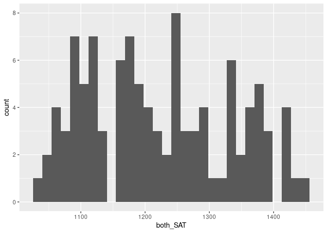

SAT and College Grades
================
(Your name here)
2020-

- <a href="#grading-rubric" id="toc-grading-rubric">Grading Rubric</a>
  - <a href="#individual" id="toc-individual">Individual</a>
  - <a href="#due-date" id="toc-due-date">Due Date</a>
- <a href="#obtain-the-data" id="toc-obtain-the-data">Obtain the Data</a>
  - <a
    href="#q1-visit-the-sat-and-college-gpa-case-study-page-scroll-to-the-bottom-and-click-the-open-data-with-excel-button-this-will-allow-you-to-download-an-xls-file-save-the-file-to-your-data-folder-load-the-data-as-df_sat-and-perform-your-first-checks-against-these-data-answer-the-questions-below"
    id="toc-q1-visit-the-sat-and-college-gpa-case-study-page-scroll-to-the-bottom-and-click-the-open-data-with-excel-button-this-will-allow-you-to-download-an-xls-file-save-the-file-to-your-data-folder-load-the-data-as-df_sat-and-perform-your-first-checks-against-these-data-answer-the-questions-below"><strong>q1</strong>
    Visit the SAT and College GPA case study page, scroll to the bottom, and
    click the <code>Open Data with Excel</code> button. This will allow you
    to download an <code>xls</code> file. Save the file to your
    <code>data</code> folder, load the data as <code>df_sat</code>, and
    perform your “first checks” against these data. Answer the questions
    below:</a>
- <a href="#analysis-with-hypothesis-testing"
  id="toc-analysis-with-hypothesis-testing">Analysis with Hypothesis
  Testing</a>
  - <a href="#view-1-correlations" id="toc-view-1-correlations">View 1:
    Correlations</a>
    - <a
      href="#q2-create-a-single-plot-that-shows-univ_gpa-against-both-high_gpa-and-both_sat-visually-compare-the-two-trends"
      id="toc-q2-create-a-single-plot-that-shows-univ_gpa-against-both-high_gpa-and-both_sat-visually-compare-the-two-trends"><strong>q2</strong>
      Create a <em>single</em> plot that shows <code>univ_GPA</code> against
      <em>both</em> <code>high_GPA</code> and <code>both_SAT</code>. Visually
      compare the two trends.</a>
    - <a href="#hypothesis-testing-with-a-correlation-coefficient"
      id="toc-hypothesis-testing-with-a-correlation-coefficient">Hypothesis
      Testing with a Correlation Coefficient</a>
    - <a
      href="#q3-plot-histograms-for-both_sat-high_gpa-univ_gpa-whichif-anyof-the-variables-look-approximately-normally-distributed"
      id="toc-q3-plot-histograms-for-both_sat-high_gpa-univ_gpa-whichif-anyof-the-variables-look-approximately-normally-distributed"><strong>q3</strong>
      Plot histograms for <code>both_SAT, high_GPA, univ_GPA</code>. Which—if
      any—of the variables look approximately normally distributed.</a>
    - <a
      href="#q4-use-the-function-cortest-to-construct-confidence-intervals-for-corrhigh_gpa-univ_gpa-and-corrboth_sat-univ_gpa-answer-the-questions-below"
      id="toc-q4-use-the-function-cortest-to-construct-confidence-intervals-for-corrhigh_gpa-univ_gpa-and-corrboth_sat-univ_gpa-answer-the-questions-below"><strong>q4</strong>
      Use the function <code>cor.test()</code> to construct confidence
      intervals for <code>corr[high_GPA, univ_GPA</code> and
      <code>corr[both_SAT, univ_GPA]</code>. Answer the questions below.</a>
    - <a
      href="#q5-use-the-bootstrap-to-approximate-a-confidence-interval-for-corrhigh_gpa-univ_gpa-compare-your-resultsboth-the-estimate-and-confidence-intervalto-your-results-from-q4"
      id="toc-q5-use-the-bootstrap-to-approximate-a-confidence-interval-for-corrhigh_gpa-univ_gpa-compare-your-resultsboth-the-estimate-and-confidence-intervalto-your-results-from-q4"><strong>q5</strong>
      Use the bootstrap to approximate a confidence interval for
      <code>corr[high_GPA, univ_GPA</code>. Compare your results—both the
      estimate and confidence interval—to your results from q4.</a>
  - <a href="#view-2-modeling" id="toc-view-2-modeling">View 2: Modeling</a>
    - <a href="#hypothesis-testing-with-a-model"
      id="toc-hypothesis-testing-with-a-model">Hypothesis Testing with a
      Model</a>
    - <a
      href="#q6-fit-a-linear-model-predicting-univ_gpa-with-the-predictor-both_sat-assess-the-model-to-determine-how-effective-a-predictor-both_sat-is-for-univ_gpa-interpret-the-resulting-confidence-interval-for-the-coefficient-on-both_sat"
      id="toc-q6-fit-a-linear-model-predicting-univ_gpa-with-the-predictor-both_sat-assess-the-model-to-determine-how-effective-a-predictor-both_sat-is-for-univ_gpa-interpret-the-resulting-confidence-interval-for-the-coefficient-on-both_sat"><strong>q6</strong>
      Fit a linear model predicting <code>univ_GPA</code> with the predictor
      <code>both_SAT</code>. Assess the model to determine how effective a
      predictor <code>both_SAT</code> is for <code>univ_GPA</code>. Interpret
      the resulting confidence interval for the coefficient on
      <code>both_SAT</code>.</a>
    - <a
      href="#q7-fit-a-model-predicting-univ_gpa-using-both-high_gpa-and-both_sat-compare-the-prediction-accuracy-and-hypothesis-test-results"
      id="toc-q7-fit-a-model-predicting-univ_gpa-using-both-high_gpa-and-both_sat-compare-the-prediction-accuracy-and-hypothesis-test-results"><strong>q7</strong>
      Fit a model predicting <code>univ_GPA</code> using both
      <code>high_GPA</code> and <code>both_SAT</code>. Compare the prediction
      accuracy and hypothesis test results.</a>
  - <a href="#synthesize" id="toc-synthesize">Synthesize</a>
    - <a
      href="#q8-using-the-results-from-all-previous-qs-answer-the-following-questions"
      id="toc-q8-using-the-results-from-all-previous-qs-answer-the-following-questions"><strong>q8</strong>
      Using the results from all previous q’s, answer the following
      questions.</a>
- <a href="#end-notes" id="toc-end-notes">End Notes</a>

*Purpose*: How do we apply hypothesis testing to investigating data? In
this challenge you’ll practice using hypothesis testing tools to make
sense of a dataset.

*Reading*: - [Harvard Study Says SATs Should Be Optional: Here’s
Why](https://www.csmonitor.com/USA/USA-Update/2016/0120/Harvard-study-says-SATs-should-be-optional.-Here-s-why)
(Optional); easy-to-read news article on colleges going SAT-free -
[Norm-Referenced Tests and Race-Blind
Admissions](https://cshe.berkeley.edu/publications/norm-referenced-tests-and-race-blind-admissions-case-eliminating-sat-and-act-university)
(Optional); technical report on relationship between the SAT/ACT and
non-academic factors

*Credit*: This is based on a [case
study](http://onlinestatbook.com/2/case_studies/sat.html) originally
prepared by Emily Zitek, with data collected through the research of
Thomas MacFarland.

``` r
library(tidyverse)
```

    ## ── Attaching packages ─────────────────────────────────────── tidyverse 1.3.2 ──
    ## ✔ ggplot2 3.4.0     ✔ purrr   1.0.1
    ## ✔ tibble  3.1.8     ✔ dplyr   1.1.0
    ## ✔ tidyr   1.3.0     ✔ stringr 1.5.0
    ## ✔ readr   2.1.3     ✔ forcats 1.0.0
    ## ── Conflicts ────────────────────────────────────────── tidyverse_conflicts() ──
    ## ✖ dplyr::filter() masks stats::filter()
    ## ✖ dplyr::lag()    masks stats::lag()

``` r
library(readxl)
library(broom)
library(modelr)
```

    ## 
    ## Attaching package: 'modelr'
    ## 
    ## The following object is masked from 'package:broom':
    ## 
    ##     bootstrap

``` r
library(rsample)
```

<!-- include-rubric -->

# Grading Rubric

<!-- -------------------------------------------------- -->

Unlike exercises, **challenges will be graded**. The following rubrics
define how you will be graded, both on an individual and team basis.

## Individual

<!-- ------------------------- -->

| Category    | Needs Improvement                                                                                                | Satisfactory                                                                                                               |
|-------------|------------------------------------------------------------------------------------------------------------------|----------------------------------------------------------------------------------------------------------------------------|
| Effort      | Some task **q**’s left unattempted                                                                               | All task **q**’s attempted                                                                                                 |
| Observed    | Did not document observations, or observations incorrect                                                         | Documented correct observations based on analysis                                                                          |
| Supported   | Some observations not clearly supported by analysis                                                              | All observations clearly supported by analysis (table, graph, etc.)                                                        |
| Assessed    | Observations include claims not supported by the data, or reflect a level of certainty not warranted by the data | Observations are appropriately qualified by the quality & relevance of the data and (in)conclusiveness of the support      |
| Specified   | Uses the phrase “more data are necessary” without clarification                                                  | Any statement that “more data are necessary” specifies which *specific* data are needed to answer what *specific* question |
| Code Styled | Violations of the [style guide](https://style.tidyverse.org/) hinder readability                                 | Code sufficiently close to the [style guide](https://style.tidyverse.org/)                                                 |

## Due Date

<!-- ------------------------- -->

All the deliverables stated in the rubrics above are due **at midnight**
before the day of the class discussion of the challenge. See the
[Syllabus](https://docs.google.com/document/d/1qeP6DUS8Djq_A0HMllMqsSqX3a9dbcx1/edit?usp=sharing&ouid=110386251748498665069&rtpof=true&sd=true)
for more information.

*Background*: Every year about 2 million students take the Scholastic
Aptitude Test (SAT). The exam is
[controversial](http://www.nea.org/home/73288.htm) but [extremely
consequential](https://www.csmonitor.com/2004/0518/p13s01-legn.html).
There are many claims about the SAT, but we’re going to look at just
one: Is the SAT predictive of scholastic performance in college? It
turns out this is a fairly complicated question to assess—we’ll get an
introduction to some of the complexities.

# Obtain the Data

<!-- -------------------------------------------------- -->

### **q1** Visit the [SAT and College GPA](http://onlinestatbook.com/2/case_studies/sat.html) case study page, scroll to the bottom, and click the `Open Data with Excel` button. This will allow you to download an `xls` file. Save the file to your `data` folder, load the data as `df_sat`, and perform your “first checks” against these data. Answer the questions below:

``` r
## TODO:
df_sat <- read_xls("data/sat.xls") %>%
  glimpse()
```

    ## Rows: 105
    ## Columns: 5
    ## $ high_GPA <dbl> 3.45, 2.78, 2.52, 3.67, 3.24, 2.10, 2.82, 2.36, 2.42, 3.51, 3…
    ## $ math_SAT <dbl> 643, 558, 583, 685, 592, 562, 573, 559, 552, 617, 684, 568, 6…
    ## $ verb_SAT <dbl> 589, 512, 503, 602, 538, 486, 548, 536, 583, 591, 649, 592, 5…
    ## $ comp_GPA <dbl> 3.76, 2.87, 2.54, 3.83, 3.29, 2.64, 2.86, 2.03, 2.81, 3.41, 3…
    ## $ univ_GPA <dbl> 3.52, 2.91, 2.40, 3.47, 3.47, 2.37, 2.40, 2.24, 3.02, 3.32, 3…

``` r
## TODO: Do your "first checks"
```

**Observations**:

- Fill in the following “data dictionary”

| Column     | Meaning                       |
|------------|-------------------------------|
| `high_GPA` | high school GPA               |
| `math_SAT` | SAT score on the math section |
| `verb_SAT` | verbal SAT score              |
| `comp_GPA` | computer science GPA          |
| `univ_GPA` | overall university GPA        |

- What information do we have about these students? We have information
  on their GPA in high school and university, as well as a specific
  subsection of that GPA that would be classified “computer science” –
  presumably, this is the material that “matters more,” given they’re
  graduating with a B.S. in computer science.
- What kinds of information *do we not have* about these students?
  Truthfully, we have no idea what kind of students they are, whether
  they’re participating in clubs, creating businesses, starting
  non-profits, taking care of siblings, what impact their families (or
  perhaps lack thereof) have on them… it’s exactly what students rail
  against – we’re turning “student quality” into a set of numbers.
- Based on these missing variables, what possible effects could be
  present in the data that we would have *no way of detecting*?
  - Like I mentioned, there are a variety of things that can impact a
    student’s ability to perform on a test + achieve a high grade point
    average that aren’t quantified here. If they experienced a death in
    the family right before they took the SAT, I would expect them to
    score lower. If they had to take care of their little siblings every
    day after school, I wouldn’t be shocked if their GPAs were lower.
    These factors are simply things we have no way of understanding.

# Analysis with Hypothesis Testing

<!-- ----------------------------------------------------------------------- -->

We’re going to use two complementary approaches to analyze the data, the
first based on hypothesis testing of correlation coefficients, and the
second based on fitting a regression model and interpreting the
regression coefficients.

To simplify the analysis, let’s look at a composite SAT score:

``` r
## NOTE: No need to edit this
df_composite <-
  df_sat %>%
  mutate(both_SAT = math_SAT + verb_SAT)
```

## View 1: Correlations

<!-- ----------------------------------------------------------------------- -->

### **q2** Create a *single* plot that shows `univ_GPA` against *both* `high_GPA` and `both_SAT`. Visually compare the two trends.

*Hint*: One way to do this is to first *pivot* `df_composite`.

``` r
## TODO:

df_composite %>%
  ggplot(aes( x= univ_GPA))+
  geom_point(aes(y = both_SAT), color = "blue") + 
  geom_point(aes(y = high_GPA), color = "red")
```

<!-- -->

``` r
  # scale_y_continuous(
  # 
  # )
  # WHY IS IT SO IMPOSSIBLE TO GET A SECOND AXIS TO WORK
  
 
df_composite %>%
  ggplot(aes( x= univ_GPA))+
  geom_point(aes(y = both_SAT), color = "blue")
```

<!-- -->

``` r
df_composite %>%
  ggplot(aes( x= univ_GPA))+
  geom_point(aes(y = high_GPA), color = "blue") 
```

<!-- -->

**Observations**:

- What relationship do `univ_GPA` and `both_SAT` exhibit?
  - It appears that there’s a positive correlation between university
    GPA and SAT score, though it seems to almost be exponential in it’s
    relationship...
- What relationship do `univ_GPA` and `high_GPA` exhibit?
  - It seems like a mildly linear positive correlation between
    university GPA and high school GPA

### Hypothesis Testing with a Correlation Coefficient

<!-- ------------------------- -->

We can use the idea of hypothesis testing with a correlation
coefficient. The idea is to set our null hypothesis to the case where
there is no correlation, and test to see if the data contradict that
perspective. Formally, the null (H0) and alternative (HA) hypotheses
relating to a correlation coefficient between two variables `X, Y` are:

$$\text{H0: } \text{Corr}[X, Y] = 0$$

$$\text{HA: } \text{Corr}[X, Y] \neq 0$$

The R function `cor.test` implements such a hypothesis test under the
assumption that `X, Y` are both normally distributed. First, let’s check
to see if this assumption looks reasonable for our data.

### **q3** Plot histograms for `both_SAT, high_GPA, univ_GPA`. Which—if any—of the variables look approximately normally distributed.

``` r
df_composite %>%
  ggplot()+
  geom_histogram(aes(x = both_SAT))
```

    ## `stat_bin()` using `bins = 30`. Pick better value with `binwidth`.

<!-- -->

``` r
df_composite %>%
  ggplot()+
  geom_histogram(aes(x = high_GPA))
```

    ## `stat_bin()` using `bins = 30`. Pick better value with `binwidth`.

<!-- -->

``` r
df_composite %>%
  ggplot()+
  geom_histogram(aes(x = univ_GPA))
```

    ## `stat_bin()` using `bins = 30`. Pick better value with `binwidth`.

<!-- -->

**Observations**:

- To what extent does `both_SAT` look like a normal distribution?
  - It looks to be slightly right-skewed, but I would believe it could
    potentially be a normal distribution.
- To what extent does `high_GPA` look like a normal distribution?
  - Personally, I think it’s the closest thing to a normal distribution
    that exists out of our choices.
- To what extent does `univ_GPA` look like a normal distribution?
  - It really doesn’t look like a normal distribution at all. There’s an
    incredibly intense left skew that makes it really hard to argue that
    this could even approximate a normal distribution.

Keep in mind your findings as you complete q4.

### **q4** Use the function `cor.test()` to construct confidence intervals for `corr[high_GPA, univ_GPA` and `corr[both_SAT, univ_GPA]`. Answer the questions below.

``` r
## TODO: Use the function cor.test() to test the correlations between
##       high_GPA and univ_GPA, as well as between
##       both_SAT and univ_GPA

cor_high_uni <- cor.test(df_composite$high_GPA, df_composite$univ_GPA)
cor_both_uni <- cor.test(df_composite$both_SAT, df_composite$univ_GPA)


cor_high_uni
```

    ## 
    ##  Pearson's product-moment correlation
    ## 
    ## data:  df_composite$high_GPA and df_composite$univ_GPA
    ## t = 12.632, df = 103, p-value < 2.2e-16
    ## alternative hypothesis: true correlation is not equal to 0
    ## 95 percent confidence interval:
    ##  0.6911690 0.8449761
    ## sample estimates:
    ##       cor 
    ## 0.7795631

``` r
cor_both_uni
```

    ## 
    ##  Pearson's product-moment correlation
    ## 
    ## data:  df_composite$both_SAT and df_composite$univ_GPA
    ## t = 9.5339, df = 103, p-value = 8.052e-16
    ## alternative hypothesis: true correlation is not equal to 0
    ## 95 percent confidence interval:
    ##  0.5674824 0.7746821
    ## sample estimates:
    ##       cor 
    ## 0.6846776

``` r
cor_high_both <- cor.test(df_composite$both_SAT, df_composite$high_GPA)
cor_high_both
```

    ## 
    ##  Pearson's product-moment correlation
    ## 
    ## data:  df_composite$both_SAT and df_composite$high_GPA
    ## t = 12.568, df = 103, p-value < 2.2e-16
    ## alternative hypothesis: true correlation is not equal to 0
    ## 95 percent confidence interval:
    ##  0.6891145 0.8438503
    ## sample estimates:
    ##       cor 
    ## 0.7780195

**Observations**:

- Which correlations are significantly nonzero?
  - Both correlations are significantly nonzero, though the high_GPA is
    higher.
- Which of `high_GPA` and `both_SAT` seems to be more strongly
  correlated with `univ_GPA`?
  - high_GPA appears to be more strongly correlated with univ_GPA,
    because it has a higher correlation value.
- How do the results here compare with the visual you created in q2?
  - high_GPA and univ_GPA’s distributions seem to be significantly
    closer to each other (when compared to both_SAT v.s. univ_GPA).
- Based on these results, what can we say about the predictive
  capabilities of both `high_GPA` and `both_SAT` to predict `univ_GPA`?
  - I suppose, given a new high_GPA, we could make guesses for what
    kinds of univ_GPA would correspond *slightly* better than if we were
    given a new SAT composite score.

Finally, let’s use the bootstrap to perform the same test using
*different* assumptions.

### **q5** Use the bootstrap to approximate a confidence interval for `corr[high_GPA, univ_GPA`. Compare your results—both the estimate and confidence interval—to your results from q4.

``` r
## TODO: Use the bootstrap to compute a confidence interval for corr[high_GPA, univ_GPA]
n <- 1000

df_q5 <- df_composite %>% 
  bootstraps(times = n)%>%
  mutate(
    df = map(
      splits,
      ~ analysis(.x)
    )
  )%>%
  slice(1:9) %>%
  unnest(df)

cor.test(df_q5$high_GPA, df_q5$univ_GPA)
```

    ## 
    ##  Pearson's product-moment correlation
    ## 
    ## data:  df_q5$high_GPA and df_q5$univ_GPA
    ## t = 39.573, df = 943, p-value < 2.2e-16
    ## alternative hypothesis: true correlation is not equal to 0
    ## 95 percent confidence interval:
    ##  0.7647944 0.8128535
    ## sample estimates:
    ##       cor 
    ## 0.7900346

``` r
cor.test(df_q5$both_SAT, df_q5$univ_GPA)
```

    ## 
    ##  Pearson's product-moment correlation
    ## 
    ## data:  df_q5$both_SAT and df_q5$univ_GPA
    ## t = 27.871, df = 943, p-value < 2.2e-16
    ## alternative hypothesis: true correlation is not equal to 0
    ## 95 percent confidence interval:
    ##  0.6355404 0.7056041
    ## sample estimates:
    ##       cor 
    ## 0.6720737

**Observations**:

- How does your estimate from q5 compare with your estimate from q4?
  - The two estimates are very similiar.
- How does your CI from q5 compare with your CI from q4?
  - It appears that q5’s CI is significantly smaller than the CI from
    q4.

*Aside*: When you use two different approximations to compute the same
quantity and get similar results, that’s an *encouraging sign*. Such an
outcome lends a bit more credibility to the results.

## View 2: Modeling

<!-- ------------------------- -->

Correlations are useful for relating two variables at a time. To study
the relationship among more variables we can instead use a fitted model.
Using a model, we can also help assess whether it is *worthwhile* to
measure a variable.

To begin, let’s first split the data into training and validation sets.

``` r
## NOTE: No need to edit
set.seed(101)

df_train <-
  df_composite %>%
  rowid_to_column() %>%
  slice_sample(n = 80)

df_validate <-
  df_composite %>%
  rowid_to_column() %>%
  anti_join(
    .,
    df_train,
    by = "rowid"
  )
```

### Hypothesis Testing with a Model

<!-- ------------------------- -->

We can combine the ideas of hypothesis testing with a model. Using a
model, we can express our hypotheses in terms of the model parameters.
For instance, if we were interested in whether $X$ has an affect on $Y$,
we might set up a model:

$$Y_i = \beta X_i + \epsilon_i$$

With the hypotheses:

$$\text{H0}: \beta = 0$$

$$\text{HA}: \beta \neq 0$$

In this case, we’re testing for whether $X$ has a significant effect on
$Y$. Let’s apply this idea to relating the variables `univ_GPA` and
`high_GPA`. Luckily R has built-in tools to construct a confidence
interval on the $\beta$’s in a regression \[1\]; we’ll simply use those
tools rather than do it by hand.

### **q6** Fit a linear model predicting `univ_GPA` with the predictor `both_SAT`. Assess the model to determine how effective a predictor `both_SAT` is for `univ_GPA`. Interpret the resulting confidence interval for the coefficient on `both_SAT`.

``` r
## TODO: Fit a model of univ_GPA on the predictor both_SAT
fit_basic <- lm(df_train$univ_GPA ~ df_train$both_SAT)

fit_basic
```

    ## 
    ## Call:
    ## lm(formula = df_train$univ_GPA ~ df_train$both_SAT)
    ## 
    ## Coefficients:
    ##       (Intercept)  df_train$both_SAT  
    ##          0.025984           0.002565

``` r
## NOTE: The following computes confidence intervals on regression coefficients
fit_basic %>%
  tidy(
    conf.int = TRUE,
    conf.level = 0.99
  )
```

    ## # A tibble: 2 × 7
    ##   term              estimate std.error statistic  p.value conf.low conf.high
    ##   <chr>                <dbl>     <dbl>     <dbl>    <dbl>    <dbl>     <dbl>
    ## 1 (Intercept)        0.0260   0.396       0.0655 9.48e- 1 -1.02      1.07   
    ## 2 df_train$both_SAT  0.00257  0.000322    7.97   1.08e-11  0.00172   0.00342

**Observations**:

- What is the confidence interval on the coefficient of `both_SAT`? Is
  this coefficient significantly different from zero?
  - the confidence interval spans \[0.0017, 0.0034\]. It doesn’t include
    0 in its confident interval, so it appears significantly different
- By itself, how well does `both_SAT` predict `univ_GPA`?
  - By itself, both_SAT seems to predict univ_GPA alright because the
    p.value is 1.081652^(-11). That’s pretty significantly less than
    0.05, which makes me think it’s okay.

Remember from `e-model03-interp-warnings` that there are challenges with
interpreting regression coefficients! Let’s investigate that idea
further.

### **q7** Fit a model predicting `univ_GPA` using both `high_GPA` and `both_SAT`. Compare the prediction accuracy and hypothesis test results.

``` r
## TODO: Fit and assess models with predictors both_SAT + high_GPA, and high_GPA alone
fit_hiGPA <- lm(df_train$univ_GPA ~ df_train$high_GPA)

## NOTE: The following computes confidence intervals on regression coefficients
fit_hiGPA %>%
  tidy(
    conf.int = TRUE,
    conf.level = 0.99
  )
```

    ## # A tibble: 2 × 7
    ##   term              estimate std.error statistic  p.value conf.low conf.high
    ##   <chr>                <dbl>     <dbl>     <dbl>    <dbl>    <dbl>     <dbl>
    ## 1 (Intercept)          1.12     0.193       5.78 1.45e- 7    0.606     1.63 
    ## 2 df_train$high_GPA    0.667    0.0617     10.8  3.79e-17    0.504     0.830

``` r
## TODO: Fit and assess models with predictors both_SAT + high_GPA, and high_GPA alone
fit_boSAT <- lm(df_train$univ_GPA ~ (df_train$high_GPA + df_train$both_SAT))
## NOTE: The following computes confidence intervals on regression coefficients
fit_boSAT %>%
  tidy(
    conf.int = TRUE,
    conf.level = 0.99
  )
```

    ## # A tibble: 3 × 7
    ##   term              estimate std.error statistic     p.value  conf.low conf.high
    ##   <chr>                <dbl>     <dbl>     <dbl>       <dbl>     <dbl>     <dbl>
    ## 1 (Intercept)       0.758     0.362         2.09 0.0397      -0.199      1.71   
    ## 2 df_train$high_GPA 0.570     0.103         5.55 0.000000396  0.299      0.842  
    ## 3 df_train$both_SAT 0.000534  0.000457      1.17 0.247       -0.000674   0.00174

**Observations**:

- How well do these models perform, compared to the one you built in q6?
  - better, the high_GPA has a lower p-value than the both_SAT model in
    q6.
- What is the confidence interval on the coefficient of `both_SAT` when
  including `high_GPA` as a predictor?? Is this coefficient
  significantly different from zero?
  - both_SAT confidence interval \[-0.00067, 0.0017\], this isn’t
    significantly different from 0 because it includes 0.
- How do the hypothesis test results compare with the results in q6?
  - This test appears to determine that high_GPA is a better predictor
    of univ_GPA than both_SAT, as it has a lower p-value.

## Synthesize

<!-- ------------------------- -->

Before closing, let’s synthesize a bit from the analyses above.

### **q8** Using the results from all previous q’s, answer the following questions.

**Observations**:

- Between `both_SAT` and `high_GPA`, which single variable would you
  choose to predict `univ_GPA`? Why?
  - high_GPA. It has a lower p-value, and thus suggestions that high_GPA
    is more statistically significant in the model.
- Is `both_SAT` an effective predictor of `univ_GPA`? What specific
  pieces of evidence do you have in favor of `both_SAT` being effective?
  What specific pieces of evidence do you have against?
  - What does it mean for something be an “effective predictor”. It
    *technically* correlates with univ_GPA, but it’s just… worse, than
    high_GPA. I feel like it’s hard to argue that both_SAT is
    “effective” in this context.

# End Notes

<!-- ----------------------------------------------------------------------- -->

\[1\] There are also assumptions underlying this kind of testing, for
more information see this [Wiki
article](https://en.wikipedia.org/wiki/Linear_regression#Assumptions).
