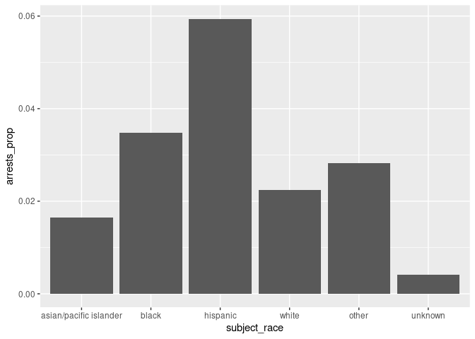
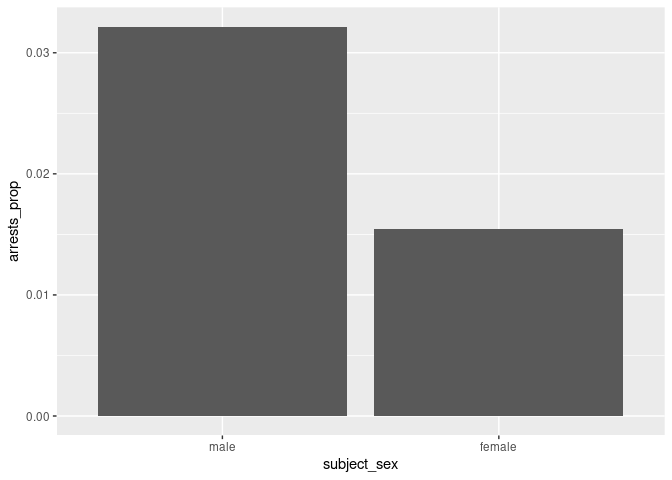
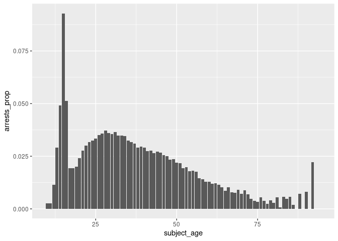

Massachusetts Highway Stops
================
(Your name here)
2020-

- <a href="#grading-rubric" id="toc-grading-rubric">Grading Rubric</a>
  - <a href="#individual" id="toc-individual">Individual</a>
  - <a href="#due-date" id="toc-due-date">Due Date</a>
- <a href="#setup" id="toc-setup">Setup</a>
  - <a
    href="#q1-go-to-the-stanford-open-policing-project-page-and-download-the-massachusetts-state-police-records-in-rds-format-move-the-data-to-your-data-folder-and-match-the-filename-to-load-the-data"
    id="toc-q1-go-to-the-stanford-open-policing-project-page-and-download-the-massachusetts-state-police-records-in-rds-format-move-the-data-to-your-data-folder-and-match-the-filename-to-load-the-data"><strong>q1</strong>
    Go to the Stanford Open Policing Project page and download the
    Massachusetts State Police records in <code>Rds</code> format. Move the
    data to your <code>data</code> folder and match the
    <code>filename</code> to load the data.</a>
- <a href="#eda" id="toc-eda">EDA</a>
  - <a
    href="#q2-do-your-first-checks-on-the-dataset-what-are-the-basic-facts-about-this-dataset"
    id="toc-q2-do-your-first-checks-on-the-dataset-what-are-the-basic-facts-about-this-dataset"><strong>q2</strong>
    Do your “first checks” on the dataset. What are the basic facts about
    this dataset?</a>
  - <a
    href="#q3-check-the-set-of-factor-levels-for-subject_race-and-raw_race-what-do-you-note-about-overlap--difference-between-the-two-sets"
    id="toc-q3-check-the-set-of-factor-levels-for-subject_race-and-raw_race-what-do-you-note-about-overlap--difference-between-the-two-sets"><strong>q3</strong>
    Check the set of factor levels for <code>subject_race</code> and
    <code>raw_Race</code>. What do you note about overlap / difference
    between the two sets?</a>
  - <a
    href="#q4-check-whether-subject_race-and-raw_race-match-for-a-large-fraction-of-cases-which-of-the-two-hypotheses-above-is-most-likely-based-on-your-results"
    id="toc-q4-check-whether-subject_race-and-raw_race-match-for-a-large-fraction-of-cases-which-of-the-two-hypotheses-above-is-most-likely-based-on-your-results"><strong>q4</strong>
    Check whether <code>subject_race</code> and <code>raw_Race</code> match
    for a large fraction of cases. Which of the two hypotheses above is most
    likely, based on your results?</a>
  - <a href="#vis" id="toc-vis">Vis</a>
    - <a
      href="#q5-compare-the-arrest-ratethe-fraction-of-total-cases-in-which-the-subject-was-arrestedacross-different-factors-create-as-many-visuals-or-tables-as-you-need-but-make-sure-to-check-the-trends-across-all-of-the-subject-variables-answer-the-questions-under-observations-below"
      id="toc-q5-compare-the-arrest-ratethe-fraction-of-total-cases-in-which-the-subject-was-arrestedacross-different-factors-create-as-many-visuals-or-tables-as-you-need-but-make-sure-to-check-the-trends-across-all-of-the-subject-variables-answer-the-questions-under-observations-below"><strong>q5</strong>
      Compare the <em>arrest rate</em>—the fraction of total cases in which
      the subject was arrested—across different factors. Create as many
      visuals (or tables) as you need, but make sure to check the trends
      across all of the <code>subject</code> variables. Answer the questions
      under <em>observations</em> below.</a>
- <a href="#modeling" id="toc-modeling">Modeling</a>
  - <a
    href="#q6-run-the-following-code-and-interpret-the-regression-coefficients-answer-the-the-questions-under-observations-below"
    id="toc-q6-run-the-following-code-and-interpret-the-regression-coefficients-answer-the-the-questions-under-observations-below"><strong>q6</strong>
    Run the following code and interpret the regression coefficients. Answer
    the the questions under <em>observations</em> below.</a>
  - <a
    href="#q7-re-fit-the-logistic-regression-from-q6-setting-white-as-the-reference-level-for-subject_race-interpret-the-the-model-terms-and-answer-the-questions-below"
    id="toc-q7-re-fit-the-logistic-regression-from-q6-setting-white-as-the-reference-level-for-subject_race-interpret-the-the-model-terms-and-answer-the-questions-below"><strong>q7</strong>
    Re-fit the logistic regression from q6 setting <code>"white"</code> as
    the reference level for <code>subject_race</code>. Interpret the the
    model terms and answer the questions below.</a>
  - <a
    href="#q8-re-fit-the-model-using-a-factor-indicating-the-presence-of-contraband-in-the-subjects-vehicle-answer-the-questions-under-observations-below"
    id="toc-q8-re-fit-the-model-using-a-factor-indicating-the-presence-of-contraband-in-the-subjects-vehicle-answer-the-questions-under-observations-below"><strong>q8</strong>
    Re-fit the model using a factor indicating the presence of contraband in
    the subject’s vehicle. Answer the questions under <em>observations</em>
    below.</a>
  - <a
    href="#q9-go-deeper-pose-at-least-one-more-question-about-the-data-and-fit-at-least-one-more-model-in-support-of-answering-that-question"
    id="toc-q9-go-deeper-pose-at-least-one-more-question-about-the-data-and-fit-at-least-one-more-model-in-support-of-answering-that-question"><strong>q9</strong>
    Go deeper: Pose at least one more question about the data and fit at
    least one more model in support of answering that question.</a>
  - <a href="#further-reading" id="toc-further-reading">Further Reading</a>

*Purpose*: In this last challenge we’ll focus on using logistic
regression to study a large, complicated dataset. Interpreting the
results of a model can be challenging—both in terms of the statistics
and the real-world reasoning—so we’ll get some practice in this
challenge.

<!-- include-rubric -->

# Grading Rubric

<!-- -------------------------------------------------- -->

Unlike exercises, **challenges will be graded**. The following rubrics
define how you will be graded, both on an individual and team basis.

## Individual

<!-- ------------------------- -->

| Category    | Needs Improvement                                                                                                | Satisfactory                                                                                                               |
|-------------|------------------------------------------------------------------------------------------------------------------|----------------------------------------------------------------------------------------------------------------------------|
| Effort      | Some task **q**’s left unattempted                                                                               | All task **q**’s attempted                                                                                                 |
| Observed    | Did not document observations, or observations incorrect                                                         | Documented correct observations based on analysis                                                                          |
| Supported   | Some observations not clearly supported by analysis                                                              | All observations clearly supported by analysis (table, graph, etc.)                                                        |
| Assessed    | Observations include claims not supported by the data, or reflect a level of certainty not warranted by the data | Observations are appropriately qualified by the quality & relevance of the data and (in)conclusiveness of the support      |
| Specified   | Uses the phrase “more data are necessary” without clarification                                                  | Any statement that “more data are necessary” specifies which *specific* data are needed to answer what *specific* question |
| Code Styled | Violations of the [style guide](https://style.tidyverse.org/) hinder readability                                 | Code sufficiently close to the [style guide](https://style.tidyverse.org/)                                                 |

## Due Date

<!-- ------------------------- -->

All the deliverables stated in the rubrics above are due **at midnight**
before the day of the class discussion of the challenge. See the
[Syllabus](https://docs.google.com/document/d/1qeP6DUS8Djq_A0HMllMqsSqX3a9dbcx1/edit?usp=sharing&ouid=110386251748498665069&rtpof=true&sd=true)
for more information.

*Background*: We’ll study data from the [Stanford Open Policing
Project](https://openpolicing.stanford.edu/data/), specifically their
dataset on Massachusetts State Patrol police stops.

``` r
library(tidyverse)
```

    ## ── Attaching packages ─────────────────────────────────────── tidyverse 1.3.2 ──
    ## ✔ ggplot2 3.4.0     ✔ purrr   1.0.1
    ## ✔ tibble  3.1.8     ✔ dplyr   1.1.0
    ## ✔ tidyr   1.3.0     ✔ stringr 1.5.0
    ## ✔ readr   2.1.3     ✔ forcats 1.0.0
    ## ── Conflicts ────────────────────────────────────────── tidyverse_conflicts() ──
    ## ✖ dplyr::filter() masks stats::filter()
    ## ✖ dplyr::lag()    masks stats::lag()

``` r
library(broom)
```

# Setup

<!-- -------------------------------------------------- -->

### **q1** Go to the [Stanford Open Policing Project](https://openpolicing.stanford.edu/data/) page and download the Massachusetts State Police records in `Rds` format. Move the data to your `data` folder and match the `filename` to load the data.

*Note*: An `Rds` file is an R-specific file format. The function
`readRDS` will read these files.

``` r
## TODO: Download the data, move to your data folder, and load it
filename <- "data/statepolice.rds"
df_data <- readRDS(filename)
```

# EDA

<!-- -------------------------------------------------- -->

### **q2** Do your “first checks” on the dataset. What are the basic facts about this dataset?

Note that we have both a `subject_race` and `race_Raw` column. There are
a few possibilities as to what `race_Raw` represents:

- `race_Raw` could be the race of the police officer in the stop
- `race_Raw` could be an unprocessed version of `subject_race`

Let’s try to distinguish between these two possibilities.

### **q3** Check the set of factor levels for `subject_race` and `raw_Race`. What do you note about overlap / difference between the two sets?

``` r
## TODO: Determine the factor levels for subject_race and raw_Race
df_data %>%
  summary()
```

    ##  raw_row_number          date              location         county_name       
    ##  Length:3416238     Min.   :2007-01-01   Length:3416238     Length:3416238    
    ##  Class :character   1st Qu.:2009-04-22   Class :character   Class :character  
    ##  Mode  :character   Median :2011-07-08   Mode  :character   Mode  :character  
    ##                     Mean   :2011-07-16                                        
    ##                     3rd Qu.:2013-08-27                                        
    ##                     Max.   :2015-12-31                                        
    ##                                                                               
    ##   subject_age                     subject_race     subject_sex     
    ##  Min.   :10.00    asian/pacific islander: 166842   male  :2362238  
    ##  1st Qu.:25.00    black                 : 351610   female:1038377  
    ##  Median :34.00    hispanic              : 338317   NA's  :  15623  
    ##  Mean   :36.47    white                 :2529780                   
    ##  3rd Qu.:46.00    other                 :  11008                   
    ##  Max.   :94.00    unknown               :  17017                   
    ##  NA's   :158006   NA's                  :   1664                   
    ##          type         arrest_made     citation_issued warning_issued 
    ##  pedestrian:      0   Mode :logical   Mode :logical   Mode :logical  
    ##  vehicular :3416238   FALSE:3323303   FALSE:1244039   FALSE:2269244  
    ##                       TRUE :92019     TRUE :2171283   TRUE :1146078  
    ##                       NA's :916       NA's :916       NA's :916      
    ##                                                                      
    ##                                                                      
    ##                                                                      
    ##      outcome        contraband_found contraband_drugs contraband_weapons
    ##  warning :1146078   Mode :logical    Mode :logical    Mode :logical     
    ##  citation:2171283   FALSE:28256      FALSE:36296      FALSE:53237       
    ##  summons :      0   TRUE :27474      TRUE :19434      TRUE :2493        
    ##  arrest  :  92019   NA's :3360508    NA's :3360508    NA's :3360508     
    ##  NA's    :   6858                                                       
    ##                                                                         
    ##                                                                         
    ##  contraband_alcohol contraband_other frisk_performed search_conducted
    ##  Mode :logical      Mode :logical    Mode :logical   Mode :logical   
    ##  FALSE:3400070      FALSE:51708      FALSE:51029     FALSE:3360508   
    ##  TRUE :16168        TRUE :4022       TRUE :3602      TRUE :55730     
    ##                     NA's :3360508    NA's :3361607                   
    ##                                                                      
    ##                                                                      
    ##                                                                      
    ##          search_basis     reason_for_stop    vehicle_type      
    ##  k9            :      0   Length:3416238     Length:3416238    
    ##  plain view    :      0   Class :character   Class :character  
    ##  consent       :   6903   Mode  :character   Mode  :character  
    ##  probable cause:  25898                                        
    ##  other         :  18228                                        
    ##  NA's          :3365209                                        
    ##                                                                
    ##  vehicle_registration_state   raw_Race        
    ##  MA     :3053713            Length:3416238    
    ##  CT     :  82906            Class :character  
    ##  NY     :  69059            Mode  :character  
    ##  NH     :  51514                              
    ##  RI     :  39375                              
    ##  (Other): 109857                              
    ##  NA's   :   9814

``` r
df_data %>%
  glimpse()
```

    ## Rows: 3,416,238
    ## Columns: 24
    ## $ raw_row_number             <chr> "1", "2", "3", "4", "5", "6", "7", "8", "9"…
    ## $ date                       <date> 2007-06-06, 2007-06-07, 2007-06-07, 2007-0…
    ## $ location                   <chr> "MIDDLEBOROUGH", "SEEKONK", "MEDFORD", "MED…
    ## $ county_name                <chr> "Plymouth County", "Bristol County", "Middl…
    ## $ subject_age                <int> 33, 36, 56, 37, 22, 34, 54, 31, 21, 56, 56,…
    ## $ subject_race               <fct> white, white, white, white, hispanic, white…
    ## $ subject_sex                <fct> male, male, female, male, female, male, mal…
    ## $ type                       <fct> vehicular, vehicular, vehicular, vehicular,…
    ## $ arrest_made                <lgl> FALSE, FALSE, FALSE, FALSE, FALSE, FALSE, F…
    ## $ citation_issued            <lgl> TRUE, FALSE, FALSE, FALSE, TRUE, TRUE, TRUE…
    ## $ warning_issued             <lgl> FALSE, TRUE, TRUE, TRUE, FALSE, FALSE, FALS…
    ## $ outcome                    <fct> citation, warning, warning, warning, citati…
    ## $ contraband_found           <lgl> NA, FALSE, NA, NA, NA, NA, NA, NA, NA, NA, …
    ## $ contraband_drugs           <lgl> NA, FALSE, NA, NA, NA, NA, NA, NA, NA, NA, …
    ## $ contraband_weapons         <lgl> NA, FALSE, NA, NA, NA, NA, NA, NA, NA, NA, …
    ## $ contraband_alcohol         <lgl> FALSE, FALSE, FALSE, FALSE, FALSE, FALSE, F…
    ## $ contraband_other           <lgl> NA, FALSE, NA, NA, NA, NA, NA, NA, NA, NA, …
    ## $ frisk_performed            <lgl> NA, FALSE, NA, NA, NA, NA, NA, NA, NA, NA, …
    ## $ search_conducted           <lgl> FALSE, TRUE, FALSE, FALSE, FALSE, FALSE, FA…
    ## $ search_basis               <fct> NA, other, NA, NA, NA, NA, NA, NA, NA, NA, …
    ## $ reason_for_stop            <chr> "Speed", NA, NA, NA, NA, "Speed", NA, NA, N…
    ## $ vehicle_type               <chr> "Passenger", "Commercial", "Passenger", "Co…
    ## $ vehicle_registration_state <fct> MA, MA, MA, MA, MA, MA, MA, MA, MA, MA, MA,…
    ## $ raw_Race                   <chr> "White", "White", "White", "White", "Hispan…

``` r
unique_subject_race <- unique(df_data$subject_race)
unique_raw_race <- unique(df_data$raw_Race)
  
unique_subject_race
```

    ## [1] white                  hispanic               black                 
    ## [4] asian/pacific islander other                  <NA>                  
    ## [7] unknown               
    ## Levels: asian/pacific islander black hispanic white other unknown

``` r
unique_raw_race
```

    ## [1] "White"                                        
    ## [2] "Hispanic"                                     
    ## [3] "Black"                                        
    ## [4] "Asian or Pacific Islander"                    
    ## [5] "Middle Eastern or East Indian (South Asian)"  
    ## [6] "American Indian or Alaskan Native"            
    ## [7] NA                                             
    ## [8] "None - for no operator present citations only"
    ## [9] "A"

``` r
# ? What are "A"s?
df_data %>%
  filter(
    raw_Race == "A"
  )
```

    ## # A tibble: 2 × 24
    ##   raw_row_num…¹ date       locat…² count…³ subje…⁴ subje…⁵ subje…⁶ type  arres…⁷
    ##   <chr>         <date>     <chr>   <chr>     <int> <fct>   <fct>   <fct> <lgl>  
    ## 1 1635091       2011-04-11 BEDFORD Middle…      NA other   <NA>    vehi… FALSE  
    ## 2 3052559       2014-12-11 AUBURN  Worces…      NA other   <NA>    vehi… FALSE  
    ## # … with 15 more variables: citation_issued <lgl>, warning_issued <lgl>,
    ## #   outcome <fct>, contraband_found <lgl>, contraband_drugs <lgl>,
    ## #   contraband_weapons <lgl>, contraband_alcohol <lgl>, contraband_other <lgl>,
    ## #   frisk_performed <lgl>, search_conducted <lgl>, search_basis <fct>,
    ## #   reason_for_stop <chr>, vehicle_type <chr>,
    ## #   vehicle_registration_state <fct>, raw_Race <chr>, and abbreviated variable
    ## #   names ¹​raw_row_number, ²​location, ³​county_name, ⁴​subject_age, …

**Observations**:

- What are the unique values for `subject_race`?

  White, Hispanic, Black, Asian/Pacific Islander, other, and unknown

- What are the unique values for `raw_Race`?

  “White”, “Hispanic”, “Black”, “Asian or Pacific Islander”, “Middle
  Eastern or East Indian (South Asian)”, “None - for no operator present
  citations only”, “A”

- What is the overlap between the two sets?

  white, hispanic, black, and asian/pacific islander

- What is the difference between the two sets?

  the `raw_Race` category has way more options for race, and it seems
  like `subject_race` just has a few main categories and a large
  miscellaneous category.

### **q4** Check whether `subject_race` and `raw_Race` match for a large fraction of cases. Which of the two hypotheses above is most likely, based on your results?

*Note*: Just to be clear, I’m *not* asking you to do a *statistical*
hypothesis test.

``` r
## TODO: Devise your own way to test the hypothesis posed above.

df_data %>%
  select(
    raw_Race, subject_race
  ) %>%
  mutate(
    diff = ifelse(tolower(raw_Race) == as.character(subject_race), 0, 1),
    same = ifelse(tolower(raw_Race) == as.character(subject_race), 1, 0)
  ) %>%
  summarise(
    num_diff = sum(diff, na.rm = TRUE),
    num_same = sum(same, na.rm = TRUE),
  )  %>%
  glimpse()
```

    ## Rows: 1
    ## Columns: 2
    ## $ num_diff <dbl> 194867
    ## $ num_same <dbl> 3219707

**Observations**

Between the two hypotheses:

- `race_Raw` could be the race of the police officer in the stop
- `race_Raw` could be an unprocessed version of `subject_race`

which is most plausible, based on your results?

- The two of these columns are mostly the same. I wrote code that would
  essentially count up the number of same and differences (mostly)
  between the two, and it looks like 3 million of these match and 194
  thousand differ.

## Vis

<!-- ------------------------- -->

### **q5** Compare the *arrest rate*—the fraction of total cases in which the subject was arrested—across different factors. Create as many visuals (or tables) as you need, but make sure to check the trends across all of the `subject` variables. Answer the questions under *observations* below.

``` r
df_data %>%
  filter(!is.na(subject_race), !is.na(arrest_made))%>%
  select(
    arrest_made, subject_race
    ) %>%
  group_by(
    subject_race
  ) %>%
  summarise(
    total_cases = n(),
    arrests_prop = sum(arrest_made)/total_cases
  ) %>%
  ggplot(aes(x = subject_race, y = arrests_prop)) + 
  geom_bar(stat = "identity")
```

<!-- -->

``` r
df_data %>%
  filter(!is.na(subject_sex), !is.na(arrest_made))%>%
  select(
    arrest_made, subject_sex
    ) %>%
  group_by(
    subject_sex
  ) %>%
  summarise(
    total_cases = n(),
    arrests_prop = sum(arrest_made)/total_cases
  ) %>%
  ggplot(aes(x = subject_sex, y = arrests_prop)) + 
  geom_bar(stat = "identity")
```

<!-- -->

(Note: Create as many chunks and visuals as you need)

``` r
df_data %>%
  filter(!is.na(subject_age), !is.na(arrest_made))%>%
  select(
    arrest_made, subject_age
    ) %>%
  group_by(
    subject_age
  ) %>%
  summarise(
    total_cases = n(),
    arrests_prop = sum(arrest_made)/total_cases
  ) %>%
  ggplot(aes(x = subject_age, y = arrests_prop)) + 
  geom_bar(stat = "identity")
```

<!-- -->

**Observations**:

- How does `arrest_rate` tend to vary with `subject_age`?

  - WOAH! Interesting graph here. It seems like there’s pretty much
    right skewed distribution, but it seems like there’s a heavy peak in
    the early teens and 20s. It’s interesting because we probably are
    just seeing a combination of two things – teenagers doing reckless
    things and the high variation that comes with too few cases being
    measured. Although this is scaled by proportion, that kind of
    removes the context of the number of cases.

- How does `arrest_rate` tend to vary with `subject_sex`?

  Men tend to be arrested more often in any altercation with the state
  police.

- How does `arrest_rate` tend to vary with `subject_race`?

  - Hispanic people appear to be shockingly more likely to be arrested
    in any altercation with the state police, followed by black people.
    It doesn’t appear to be purely a minority thing though, because we
    see Asian and Pacific Islanders arrested less than white people.
    Certainly an interesting place to think.

# Modeling

<!-- -------------------------------------------------- -->

We’re going to use a model to study the relationship between `subject`
factors and arrest rate, but first we need to understand a bit more
about *dummy variables*

### **q6** Run the following code and interpret the regression coefficients. Answer the the questions under *observations* below.

``` r
## NOTE: No need to edit; inspect the estimated model terms.
fit_q6 <-
  glm(
    formula = arrest_made ~ subject_age + subject_race + subject_sex,
    data = df_data %>%
      filter(
        !is.na(arrest_made),
        subject_race %in% c("white", "black", "hispanic")
      ),
    family = "binomial"
  )

fit_q6 %>% tidy()
```

    ## # A tibble: 5 × 5
    ##   term                 estimate std.error statistic   p.value
    ##   <chr>                   <dbl>     <dbl>     <dbl>     <dbl>
    ## 1 (Intercept)           -2.67    0.0132      -202.  0        
    ## 2 subject_age           -0.0142  0.000280     -50.5 0        
    ## 3 subject_racehispanic   0.513   0.0119        43.3 0        
    ## 4 subject_racewhite     -0.380   0.0103       -37.0 3.12e-299
    ## 5 subject_sexfemale     -0.755   0.00910      -83.0 0

**Observations**:

- Which `subject_race` levels are included in fitting the model?
  - white, black and Hispanic.
- Which `subject_race` levels have terms in the model?
  - white and hispanic!

You should find that each factor in the model has a level *missing* in
its set of terms. This is because R represents factors against a
*reference level*: The model treats one factor level as “default”, and
each factor model term represents a change from that “default” behavior.
For instance, the model above treats `subject_sex==male` as the
reference level, so the `subject_sexfemale` term represents the *change
in probability* of arrest due to a person being female (rather than
male).

The this reference level approach to coding factors is necessary for
[technical
reasons](https://www.andrew.cmu.edu/user/achoulde/94842/lectures/lecture10/lecture10-94842.html#why-is-one-of-the-levels-missing-in-the-regression),
but it complicates interpreting the model results. For instance; if we
want to compare two levels, neither of which are the reference level, we
have to consider the difference in their model coefficients. But if we
want to compare all levels against one “baseline” level, then we can
relevel the data to facilitate this comparison.

By default `glm` uses the first factor level present as the reference
level. Therefore we can use
`mutate(factor = fct_relevel(factor, "desired_level"))` to set our
`"desired_level"` as the reference factor.

### **q7** Re-fit the logistic regression from q6 setting `"white"` as the reference level for `subject_race`. Interpret the the model terms and answer the questions below.

``` r
## TODO: Re-fit the logistic regression, but set "white" as the reference
## level for subject_race

releveled <-
  df_data %>%
   mutate(
      subject_race = fct_relevel(factor(subject_race), "white")
             )
fit_q7 <-
  glm(
    formula = arrest_made ~ subject_age + subject_race + subject_sex,
    data = releveled %>%
      filter(
        !is.na(arrest_made),
        subject_race %in% c("white", "black", "hispanic")
      ),
    family = "binomial"
  )
fit_q7 %>% tidy()
```

    ## # A tibble: 5 × 5
    ##   term                 estimate std.error statistic   p.value
    ##   <chr>                   <dbl>     <dbl>     <dbl>     <dbl>
    ## 1 (Intercept)           -3.05    0.0109      -279.  0        
    ## 2 subject_age           -0.0142  0.000280     -50.5 0        
    ## 3 subject_raceblack      0.380   0.0103        37.0 3.12e-299
    ## 4 subject_racehispanic   0.893   0.00859      104.  0        
    ## 5 subject_sexfemale     -0.755   0.00910      -83.0 0

**Observations**:

- Which `subject_race` level has the highest probability of being
  arrested, according to this model? Which has the lowest probability?

  - The highest is Hispanic, and the lowest is white, since we set that
    as the reference level and both black and Hispanic are higher than 0

- What could explain this difference in probabilities of arrest across
  race? List **multiple** possibilities.

  - gosh. Sensitive topic. Well, there are a variety of reasons this
    might be occurring:
    - People who are Hispanic and black are committing more violations
      of the law that result in arrest than people who are white.

    - There is systemic racism in the policing of Massachusetts and so
      there are a disproportionate number of arrests of Hispanic and
      black people.

    - It’s simply due to chance and random variation.

- Look at the sent of variables in the dataset; do any of the columns
  relate to a potential explanation you listed?

  ``` r
  df_data %>% 
    names()
  ```

      ##  [1] "raw_row_number"             "date"                      
      ##  [3] "location"                   "county_name"               
      ##  [5] "subject_age"                "subject_race"              
      ##  [7] "subject_sex"                "type"                      
      ##  [9] "arrest_made"                "citation_issued"           
      ## [11] "warning_issued"             "outcome"                   
      ## [13] "contraband_found"           "contraband_drugs"          
      ## [15] "contraband_weapons"         "contraband_alcohol"        
      ## [17] "contraband_other"           "frisk_performed"           
      ## [19] "search_conducted"           "search_basis"              
      ## [21] "reason_for_stop"            "vehicle_type"              
      ## [23] "vehicle_registration_state" "raw_Race"

  - “reason_for_stop” and “search_basis” could help identify whether or
    not there is a significant difference in the *types* of altercations
    people who are black and Hispanic have with the police.
  - “warning_issued” may help us identify if there’s simply
    significantly fewer warnings given out to black and Hispanic people,
    which might say something about the way police officers are handling
    these interactions.

One way we can explain differential arrest rates is to include some
measure indicating the presence of an arrestable offense. We’ll do this
in a particular way in the next task.

### **q8** Re-fit the model using a factor indicating the presence of contraband in the subject’s vehicle. Answer the questions under *observations* below.

``` r
## TODO: Repeat the modeling above, but control for whether contraband was found
## during the police stop


fit_q8 <-
  glm(
    formula = arrest_made ~ subject_age + subject_race + subject_sex + contraband_found,
    data = releveled %>%
      filter(
        !is.na(arrest_made),
        subject_race %in% c("white", "black", "hispanic")
      ),
    family = "binomial"
  )

fit_q8 %>% tidy()
```

    ## # A tibble: 6 × 5
    ##   term                 estimate std.error statistic   p.value
    ##   <chr>                   <dbl>     <dbl>     <dbl>     <dbl>
    ## 1 (Intercept)           -1.72    0.0339      -50.8  0        
    ## 2 subject_age            0.0225  0.000866     26.0  2.19e-149
    ## 3 subject_raceblack     -0.0511  0.0270       -1.90 5.80e-  2
    ## 4 subject_racehispanic   0.221   0.0237        9.31 1.32e- 20
    ## 5 subject_sexfemale     -0.306   0.0257      -11.9  1.06e- 32
    ## 6 contraband_foundTRUE   0.609   0.0192       31.7  4.29e-221

**Observations**:

- How does controlling for found contraband affect the `subject_race`
  terms in the model?
  - Hispanics are still the most likely to be arrested, but now black
    people are less likely to be arrested than white people.
- What does the *finding of contraband* tell us about the stop? What
  does it *not* tell us about the stop?
  - The finding of contraband indicates, at least minimally, that there
    is a path forward to escalate; it’s generally something that police
    officers might utilize to make an arrest happen. However, even
    though it is a step in the right direction, it probably isn’t enough
    isolation to tell us what *race*’s affect is on whether or not
    someone will get arrested.

### **q9** Go deeper: Pose at least one more question about the data and fit at least one more model in support of answering that question.

**Observations**:

*What kind of contraband is most likely to result in arrest?*

``` r
fit_q9 <-
  glm(
    formula = arrest_made ~  contraband_drugs + contraband_alcohol + contraband_weapons + contraband_other + contraband_found,
    data = releveled %>%
      filter(
        !is.na(arrest_made)
      ),
    family = "binomial"
  )

fit_q9 %>% tidy()
```

    ## # A tibble: 6 × 5
    ##   term                   estimate std.error statistic  p.value
    ##   <chr>                     <dbl>     <dbl>     <dbl>    <dbl>
    ## 1 (Intercept)             -1.00      0.0134    -74.7  0       
    ## 2 contraband_drugsTRUE     0.312     0.0365      8.55 1.21e-17
    ## 3 contraband_alcoholTRUE   0.572     0.0377     15.2  6.26e-52
    ## 4 contraband_weaponsTRUE   0.224     0.0445      5.04 4.56e- 7
    ## 5 contraband_otherTRUE     0.594     0.0382     15.6  1.55e-54
    ## 6 contraband_foundTRUE     0.0538    0.0412      1.31 1.91e- 1

Woah, this is interesting. I really thought that a weapon would be the
most incriminating thing, but it seems like it’s actually the least
incriminating thing out of the contraband categories. Perhaps this is
because people de-escalate the situation but mention to the officer that
they’re carrying a weapon for their own safety? I know that this is what
people who have a firearm *should* do.

Unsurprisingly, “contraband found” correlates very minimally with
arrest; though I thought it would be closer in value to the average of
the estimates for all of the specific kinds of contraband – after all,
“contraband found” ought to include all of them, right? In my head,
contraband_other contains all miscellaneous contraband, so my
understanding of what this model is doing must be wrong.

It seems like miscellaneous contraband correlates most highly with
arrest. This one makes sense – the kinds of contraband you don’t see
often are probably the ones that the average person shouldn’t have.

Alcohol being the other contraband with a higher correlation with arrest
also checks out – more than likely there’s some level of drunk
driving/drunk fighting going on, and alcohol can make it difficult to
communicate to the officer that all is well and it’s not that serious.

## Further Reading

<!-- -------------------------------------------------- -->

- Stanford Open Policing Project
  [findings](https://openpolicing.stanford.edu/findings/).
